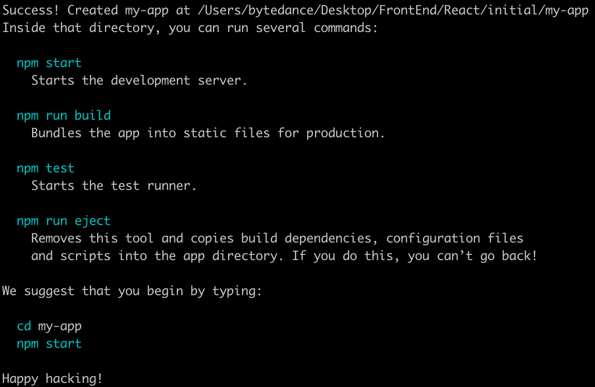
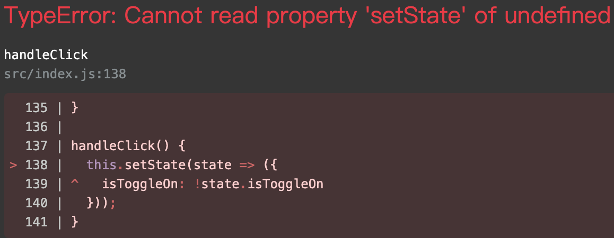
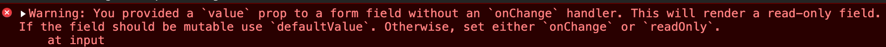

## React基础


### 背景

#### ▼什么是Babel？ [Babel](https://babeljs.io/)

##### Babel 是一个 JavaScript 编译器。

Babel 是一个工具链，主要用于在旧的浏览器或环境中将 ECMAScript 2015+ 代码转换为向后兼容版本的 JavaScript 代码：

- 转换语法
- Polyfill 实现目标环境中缺少的功能 (通过 [@babel/polyfill](https://babel.docschina.org/docs/en/babel-polyfill))
- 源代码转换 (codemods)


Babel 通过语法变换器支持最新版本的 JavaScript。这些 [plugins](https://babel.docschina.org/docs/en/plugins) 允许你现在就使用新语法，而无需等待浏览器的支持。查看我们的[使用指南](https://babel.docschina.org/docs/en/usage)以开始使用。


##### JSX 和 React

Babel 可以转换 JSX 语法！查看 [React preset](https://babel.docschina.org/docs/en/babel-preset-react) 以开始使用

你可以通过以下这个命令安装该 preset

```shell
npm install --save-dev @babel/preset-react
Copy
```

并将 `@babel/preset-react` 添加到你的 Babel 配置中。

```jsx
export default React.createClass({
  getInitialState() {
    return { num: this.getRandomNumber() };
  },

  getRandomNumber() {
    return Math.ceil(Math.random() * 6);
  },

  render() {
    return <div>
      Your dice roll:
      {this.state.num}
    </div>;
  }
});
```


推荐使用的高亮插件:

**Visual Studio Code**

Install the [vscode-language-babel](https://marketplace.visualstudio.com/items?itemName=mgmcdermott.vscode-language-babel) extension and follow the instructions.

There seems to be one other way to get the syntax highlighting working and you can learn more about it in the [Visual Studio Code docs](https://code.visualstudio.com/Docs/languages/javascript#_javascript-projects-jsconfigjson).

**WebStorm**

WebStorm now ships with support for ES2015+ without requiring the installation of any additional extensions. You may, however, need to [enable it](https://blog.jetbrains.com/webstorm/2015/05/ecmascript-6-in-webstorm-transpiling/).


### 环境搭建


windows 贼麻烦，这里就只讲mac，确保在较新版本的node下

```bash
npx create-react-app my-app
```


出现下面的内容就表示成功了：




在项目文件夹下 `npm start` 即可启动项目


🌟一般我们还需要删除里面react提供的初始文件

1. 删除掉新项目中 `src/` 文件夹下的所有文件。

> 注意：
>
> **不要删除整个 `src` 文件夹，删除里面的源文件**。我们会在接下来的步骤中使用示例代码替换默认源文件。

```shell
cd my-app
cd src

# 如果你使用 Mac 或 Linux:
rm -f *

# 如果你使用 Windows:
del *

# 然后回到项目文件夹
cd ..
```


#### Creating a TypeScript app[#](https://create-react-app.dev/docs/getting-started#creating-a-typescript-app)

You can start a new TypeScript app using templates. To use our provided TypeScript template, append `--template typescript` to the creation command.

```shell
npx create-react-app my-app --template typescript
```


这里介绍下 create-react-app

#### create-react-app

[Folder Structure | Create React App (create-react-app.dev)](https://create-react-app.dev/docs/folder-structure)

一般初始化后的目录结构：

```
my-app/
  README.md
  node_modules/
  package.json
  public/
    index.html
    favicon.ico
  src/
    App.css
    App.js
    App.test.js
    index.css
    index.js
    logo.svg
```


‼️For the project to build, **these files must exist with exact filenames**:

- `public/index.html` is the page template;
- `src/index.js` is the JavaScript entry point.

You can delete or rename the other files.


💧more：

‼️You may create subdirectories inside `src`. For faster rebuilds, only files inside `src` are processed by webpack. You need to **put any JS and CSS files inside `src`**, otherwise webpack won’t see them.

⚠️Only files inside `public` can be used from `public/index.html`. Read instructions below for using assets from JavaScript and HTML.

You can, however, create more top-level directories. They will not be included in the production build so you can use them for things like documentation.

If you have Git installed and your project is not part of a larger repository, then a new repository will be initialized resulting in an additional top-level `.git` directory.


#### Hello World

虽然create-react-app命令已经有了很好看的开始界面，我们这里还是写一个hello world

将src下的所有文件删除

```shell
cd src
rm -f *
```


在src文件夹下建立 index.js 文件

```react
import React from 'react';
import ReactDOM from 'react-dom';

ReactDOM.render(
  <h1>Hello World</h1>,
  document.getElementById('root')
)
```

这样 npm start 后就会显示 Hello World！


### ▼什么是JSX？

```jsx
const element = <h1>Hello, world!</h1>;
```

这个有趣的标签语法既不是字符串也不是 HTML。它被称为 JSX，是一个 JavaScript 的语法扩展。我们建议在 React 中配合使用 JSX，JSX 可以很好地描述 UI 应该呈现出它应有交互的本质形式。JSX 可能会使人联想到模版语言，但它**具有 JavaScript 的全部功能。**


#### **Why use？**

1. **JSX 执行更快**，因为它在编译为 JavaScript 代码后进行了优化。
2. 它是**类型安全**的，在编译过程中就能发现错误。
3. 使用 JSX 编写模板更加简单快速。


#### How to use JSX?


🚨<span style='color:red;font-weight:bold'>JSX中只有一个根结点</span>

##### 在 JSX 中嵌入表达式

在下面的例子中，我们声明了一个名为 `name` 的变量，然后在 JSX 中使用它，并将它包裹在大括号中：

```jsx
const name = 'Josh Perez';
const element = <h1>Hello, {name}</h1>;
ReactDOM.render(
  element,
  document.getElementById('root')
);
```

仅仅这样, 就可以通过babel编译该jsx文件, 使得页面显示内容! 

💎在 JSX 语法中，你可以在大括号内放置任何有效的 [JavaScript 表达式](https://developer.mozilla.org/en-US/docs/Web/JavaScript/Guide/Expressions_and_Operators#Expressions)。例如，`2 + 2`，`user.firstName` 或 `formatName(user)` 都是有效的 JavaScript 表达式。


```jsx
function formatName(user) {
  return user.firstName + ' ' + user.lastName;
}

const user = {
  firstName: 'Harper',
  lastName: 'Perez'
};

const element = (
  <h1>
    Hello, {formatName(user)}!  </h1>
);

ReactDOM.render(
  element,
  document.getElementById('root')
);
```

<iframe height="265" style="width: 100%;" scrolling="no" title="MWpLydV" src="https://codepen.io/shanxiansen310/embed/MWpLydV?height=265&theme-id=light&default-tab=js,result" frameborder="no" loading="lazy" allowtransparency="true" allowfullscreen="true">
  See the Pen <a href='https://codepen.io/shanxiansen310/pen/MWpLydV'>MWpLydV</a> by shanxiansen310
  (<a href='https://codepen.io/shanxiansen310'>@shanxiansen310</a>) on <a href='https://codepen.io'>CodePen</a>.
</iframe>


##### JSX 也是一个表达式

在编译之后，JSX 表达式会被转为普通 JavaScript 函数调用，并且对其取值后得到 JavaScript 对象。

也就是说，你可以在 `if` 语句和 `for` 循环的代码块中使用 JSX，将 JSX 赋值给变量，把 JSX 当作参数传入，以及从函数中返回 JSX：

```jsx
function getGreeting(user) {
  if (user) {
    return <h1>Hello, {formatName(user)}!</h1>;  
  }
  return <h1>Hello, Stranger.</h1>;
}
```


##### JSX 特定属性

你可以通过使用引号，来将属性值指定为字符串字面量：

```jsx
const element = <div tabIndex="0"></div>;
```

也可以使用 `大括号`，来在属性值中插入一个 JavaScript 表达式：

```jsx
const element = </img>;
```

在属性中嵌入 JavaScript 表达式时，不要在大括号外面加上引号。你应该仅使用引号（对于字符串值）或大括号（对于表达式）中的一个，对于同一属性不能同时使用这两种符号。

> ⚠️**警告：**
>
> 因为 JSX 语法上更接近 JavaScript 而不是 HTML，所以 React DOM 使用 `camelCase`（小驼峰命名）来定义属性的名称，而不使用 HTML 属性名称的命名约定。
>
> 例如，JSX 里的 `class` 变成了 [`className`](https://developer.mozilla.org/en-US/docs/Web/API/Element/className)，而 `tabindex` 则变为 [`tabIndex`](https://developer.mozilla.org/en-US/docs/Web/API/HTMLElement/tabIndex)。


❗️而且html标签也只能写成小写！


##### JSX 防止注入攻击

你可以安全地在 JSX 当中插入用户输入内容：

```js
const title = response.potentiallyMaliciousInput;
// 直接使用是安全的：
const element = <h1>{title}</h1>;
```

React DOM 在渲染所有输入内容之前，默认会进行[转义](https://stackoverflow.com/questions/7381974/which-characters-need-to-be-escaped-on-html)。它可以确保在你的应用中，永远不会注入那些并非自己明确编写的内容。所有的内容在渲染之前都被转换成了字符串。这样可以有效地防止 [XSS（cross-site-scripting, 跨站脚本）](https://en.wikipedia.org/wiki/Cross-site_scripting)攻击。


##### JSX 表示对象

Babel 会把 JSX 转译成一个名为 `React.createElement()` 函数调用。

以下两种示例代码完全等效：

```jsx
const element = (
  <h1 className="greeting">
    Hello, world!
  </h1>
);
const element = React.createElement(
  'h1',
  {className: 'greeting'},
  'Hello, world!'
);
```

`React.createElement()` 会预先执行一些检查，以帮助你编写无错代码，但实际上它创建了一个这样的对象：

```jsx
// 注意：这是简化过的结构
const element = {
  type: 'h1',
  props: {
    className: 'greeting',
    children: 'Hello, world!'
  }
};
```

这些对象被称为 “React 元素”。它们描述了你希望在屏幕上看到的内容。React 通过读取这些对象，然后使用它们来构建 DOM 以及保持随时更新


---


### ▼元素渲染


**将一个元素渲染为 DOM**

假设你的 HTML 文件某处有一个 `<div>`：

```html
<div id="root"></div>
```

我们将其称为“根” DOM 节点，因为该节点内的所有内容都将由 React DOM 管理。

<span style='color:red;'>仅使用 React 构建的应用通常只有单一的根 DOM 节点。</span> 如果你在将 React 集成进一个已有应用，那么你可以在应用中包含任意多的独立根 DOM 节点。

想要将一个 React 元素渲染到根 DOM 节点中，只需把它们一起传入 [`ReactDOM.render()`](https://react.docschina.org/docs/react-dom.html#render)：

```jsx
const element = <h1>Hello, world</h1>;
ReactDOM.render(element, document.getElementById('root'));
```


#### 更新已经渲染的元素


<span style='color:red;font-weight:bold;'>React 元素是[不可变对象](https://en.wikipedia.org/wiki/Immutable_object)。一旦被创建，你就无法更改它的子元素或者属性。</span>一个元素就像电影的单帧：它代表了某个特定时刻的 UI。


根据我们已有的知识，更新 UI 唯一的方式是创建一个全新的元素，并将其传入 [`ReactDOM.render()`](https://react.docschina.org/docs/react-dom.html#render)。


这里展示一个计时器用来说明渲染更新：

```jsx
function tick() {
  const element = (
    <div>
      <h1>Hello, world!</h1>
      <h2>It is {new Date().toLocaleTimeString()}.</h2>
    </div>
  );
  ReactDOM.render(element, document.getElementById('root'));}
}

setInterval(tick, 1000);
```


>❗️注意
>
>在实践中，大多数 React 应用只会调用一次 [`ReactDOM.render()`](https://react.docschina.org/docs/react-dom.html#render)。在下一个章节，我们将学习如何将这些代码封装到[有状态组件](https://react.docschina.org/docs/state-and-lifecycle.html)中。


**💎React 只更新它需要更新的部分**

<span style='color:red;'>React DOM 会将元素和它的子元素与它们之前的状态进行比较，并只会进行必要的更新来使 DOM 达到预期的状态。</span>

 

尽管每一秒我们都会新建一个描述整个 UI 树的元素，React DOM 只会更新实际改变了的内容，也就是例子中的文本节点。


🚩react diff [React源码揭秘3 Diff算法详解 (juejin.cn)](https://juejin.cn/post/6844904167472005134)


### ▼组件&Props


#### 定义组件

1.编写JS函数

```jsx
function Welcome(props) {
  return <h1>Hello, {props.name}</h1>;
}

const WelcomePlus = props => {
  return <h1>Hello,{props.name}</h1>
}
```

该函数是一个有效的 React 组件，因为它接收唯一带有数据的 “props”（代表属性）对象与并返回一个 React 元素。这类组件被称为“函数组件”，因为它本质上就是 JavaScript 函数。


2.ES6的class

```jsx
class Welcome extends React.Component {
  render() {
    return <h1>Hello, {this.props.name}</h1>;
  }
}
```


💎以上两种写法等效！


#### 渲染组件

React 元素也可以是用户自定义的组件：

当 React 元素为用户自定义组件时，它会将 JSX 所接收的属性（attributes）以及子组件（children）转换为单个对象传递给组件，这个对象被称之为 “props”。

```jsx
class Welcome extends React.Component {
  render() {
    return <h1>Hello, {this.props.name}</h1>
  }
}

const Welcome = props => {
  return <h1>Hello,{props.name}</h1>
}
//上面这两种等效

const container = <Welcome name='Spike'/>
ReactDOM.render(container, document.getElementById('root'));
```

🌟这样就给自定义组件进行了传值！


🚀这中间发生了什么？

1. 我们调用 `ReactDOM.render()` 函数，并传入 `<Welcome name="Sara" />` 作为参数。
2. React 调用 `Welcome` 组件，并将 `{name: 'Sara'}` 作为 props 传入。
3. `Welcome` 组件将 `<h1>Hello, Sara</h1>` 元素作为返回值。
4. React DOM 将 DOM 高效地更新为 `<h1>Hello, Sara</h1>`。


⚠️

>### 用户定义的组件必须以大写字母开头
>
>以小写字母开头的元素代表一个 HTML 内置组件，比如 `<div>` 或者 `<span>` 会生成相应的字符串 `'div'` 或者 `'span'` 传递给 `React.createElement`（作为参数）。大写字母开头的元素则对应着在 JavaScript 引入或自定义的组件，如 `<Foo />` 会编译为 `React.createElement(Foo)`。


组件也可以组合：

```jsx
function Welcome(props) {
  return <h1>Hello, {props.name}</h1>;
}

function App() {
  return (
    <div>
      <Welcome name="Sara" />      
      <Welcome name="Cahal" />      
      <Welcome name="Edite" />    
    </div>
  );
}

ReactDOM.render(
  <App />,
  document.getElementById('root')
);
```

⚠️这里使用App的时候不是写 App()，而是直接写成HTML标签的格式！


**提取组件：**

就是把一个复杂组件中的一些功能提炼为小组件，增加复用性


#### Props的只读性


组件无论是使用[函数声明还是通过 class 声明](https://react.docschina.org/docs/components-and-props.html#function-and-class-components)，都决不能修改自身的 props。来看下这个 `sum` 函数：

```js
function sum(a, b) {
  return a + b;
}
```


这样的函数被称为[“纯函数”](https://en.wikipedia.org/wiki/Pure_function)，因为该函数不会尝试更改入参，且多次调用下相同的入参始终返回相同的结果。

相反，下面这个函数则不是纯函数，因为它更改了自己的入参：

```js
function withdraw(account, amount) {
  account.total -= amount;
}
```

▼React 非常灵活，但它也有一个严格的规则：

**所有 React 组件都必须像纯函数一样保护它们的 props 不被更改。**


### ▼State&生命周期


我们尝试先把之前的时钟改进一下

```jsx
function Clock(props) {
  return (
    <div>
      <h1>Hi, Riki!</h1>
      <h2>Now is {props.date.toLocaleTimeString()}.</h2>
    </div>
  )
}
function tick() {
  ReactDOM.render(
    <Clock date={new Date()} />,
    document.getElementById('root')
  )
}

setInterval(tick,1000);
```


😅这里还是通过多次调用 `ReactDOM.render` 来实现的！理想情况下，我们希望只编写一次代码，便可以让 `Clock` 组件自我更新：

😈我们需要在 `Clock` 组件中添加 “state” 来实现这个功能。

💎**State 与 props 类似，但是 state 是私有的，并且完全受控于当前组件。**


#### Steps：

##### 1.修改为class风格

```jsx
class CLock extends React.Component{
  render() {
    return(
      <div>
        <h1>Hi, Riki!</h1>
        <h2>Now is {this.props.date.toLocaleTimeString()}.</h2>
      </div>
    )
  }
}
```

💎每次组件更新时 `render` 方法都会被调用，但只要在相同的 DOM 节点中渲染 `<Clock />` ，就仅有一个 `Clock` 组件的 class 实例被创建使用。这就使得我们可以使用如 state 或生命周期方法等很多其他特性。


##### 2.向class组件中添加局部的state

```jsx
class Clock extends React.Component{
  constructor(props) {
    /* 借此将props传递给父类的构造函数 */
    super(props);
    this.state={date:new Date()}
  }
  render() {
    return(
      <div>
        <h1>Hi, Riki!</h1>
        <h2>Now is {this.state.date.toLocaleTimeString()}.</h2>
      </div>
    )
  }
}

ReactDOM.render(
  <Clock />,
  document.getElementById('root')
);
```


★Class 组件应该始终使用 `props` 参数来调用父类的构造函数。


##### 3.添加生命周期方法

在具有许多组件的应用程序中，**当组件被销毁时释放所占用的资源是非常重要的**。

当 `Clock` 组件第一次被渲染到 DOM 中的时候，就为其[设置一个计时器](https://developer.mozilla.org/en-US/docs/Web/API/WindowTimers/setInterval)。这在 React 中被称为“挂载（mount）”。

同时，当 DOM 中 `Clock` 组件被删除的时候，应该[清除计时器](https://developer.mozilla.org/en-US/docs/Web/API/WindowTimers/clearInterval)。这在 React 中被称为“卸载（unmount）”。


```jsx
class Clock extends React.Component{
  constructor(props) {
    /* 借此将props传递给父类的构造函数 */
    super(props);
    this.state={date:new Date()}
  }

  componentDidMount() {
    this.timerID=setInterval(
      ()=>this.tick(),
      1000
    )
  }

  componentWillUnmount() {
    clearInterval(this.timerID)
  }

  tick(){
    this.setState({
      date: new Date()
    })
  }

  render() {
    return(
      <div>
        <h1>Hi, Riki!</h1>
        <h2>Now is {this.state.date.toLocaleTimeString()}.</h2>
      </div>
    )
  }
}

ReactDOM.render(
  <Clock />,
  document.getElementById('root')
);
```


* `componentDidMount()` 方法会在组件已经被渲染到 DOM 中后运行，所以，最好在这里设置计时器
* 尽管 `this.props` 和 `this.state` 是 React 本身设置的，且都拥有特殊的含义，但是其实你可以向 class 中随意添加不参与数据流（比如计时器 ID）的额外字段。
* 在 `componentWillUnmount()` 生命周期方法中清除计时器
* 使用 `this.setState()` 来时刻更新组件 state。这里我们将date声明为了state属性而不是props属性，因此改变state就不会违反props的只读性


🚀让我们来快速概括一下发生了什么和这些方法的调用顺序：

1. 当 `<Clock />` 被传给 `ReactDOM.render()`的时候，React 会调用 `Clock` 组件的构造函数。因为 `Clock` 需要显示当前的时间，所以它会用一个包含当前时间的对象来初始化 `this.state`。我们会在之后更新 state。
2. 之后 React 会调用组件的 `render()` 方法。这就是 React 确定该在页面上展示什么的方式。然后 React 更新 DOM 来匹配 `Clock` 渲染的输出。
3. 当 `Clock` 的输出被插入到 DOM 中后，React 就会调用 `ComponentDidMount()` 生命周期方法。在这个方法中，`Clock` 组件向浏览器请求设置一个计时器来每秒调用一次组件的 `tick()` 方法。
4. 浏览器每秒都会调用一次 `tick()` 方法。 在这方法之中，`Clock` 组件会通过调用 `setState()` 来计划进行一次 UI 更新。<span style='color:red;font-weight:bold;'>得益于 `setState()` 的调用，React 能够知道 state 已经改变了，然后会重新调用 `render()` 方法来确定页面上该显示什么</span> 。这一次，`render()` 方法中的 `this.state.date` 就不一样了，如此以来就会渲染输出更新过的时间。React 也会相应的更新 DOM。
5. 一旦 `Clock` 组件从 DOM 中被移除，React 就会调用 `componentWillUnmount()` 生命周期方法，这样计时器就停止了。


#### 正确使用State


##### ❗️不要直接修改 State

例如，此代码不会重新渲染组件：

```js
// Wrong
this.state.comment = 'Hello';
```

而是应该使用 `setState()`:

```js
// Correct
this.setState({comment: 'Hello'});
```

构造函数是唯一可以给 `this.state` 赋值的地方：


##### ⚠️State的更新可能是异步的

出于性能考虑，React 可能会把多个 `setState()` 调用合并成一个调用。

因为 `this.props` 和 `this.state` 可能会异步更新，所以你不要依赖他们的值来更新下一个状态。

例如，此代码可能会无法更新计数器：

```jsx
// Wrong
this.setState({
  counter: this.state.counter + this.props.increment,
});
```

要解决这个问题，<span style='color:red;'>可以让 `setState()` 接收一个函数而不是一个对象</span> 。这个函数用上一个 state 作为第一个参数，将此次更新被应用时的 props 做为第二个参数：

```jsx
// Correct
this.setState((state, props) => ({
  counter: state.counter + props.increment
}));
```

上面使用了[箭头函数](https://developer.mozilla.org/en-US/docs/Web/JavaScript/Reference/Functions/Arrow_functions)，不过使用普通的函数也同样可以：

```jsx
// Correct
this.setState(function(state, props) {
  return {
    counter: state.counter + props.increment
  };
});
```


##### ★State 的更新会被合并

当你调用 `setState()` 的时候，React 会把你提供的对象合并到当前的 state。


#### 💎数据是向下流动的

不管是父组件或是子组件都无法知道某个组件是有状态的还是无状态的，并且它们也并不关心它是函数组件还是 class 组件。

这就是为什么称 state 为局部的或是封装的的原因。除了拥有并设置了它的组件，其他组件都无法访问。


**▼组件可以选择把它的 state 作为 props 向下传递到它的子组件中：**

```jsx
<h2>It is {this.state.date.toLocaleTimeString()}.</h2>
```

这对于自定义组件同样适用：

```jsx
<FormattedDate date={this.state.date} />
```

`FormattedDate` 组件会在其 props 中接收参数 `date`，但是组件本身无法知道它是来自于 `Clock` 的 state，或是 `Clock` 的 props，还是手动输入的：

```jsx
function FormattedDate(props) {
  return <h2>It is {props.date.toLocaleTimeString()}.</h2>;
}
```


完整代码

<iframe height="343" style="width: 100%;" scrolling="no" title="Hello World in React" src="https://codepen.io/gaearon/embed/zKRqNB?default-tab=html%2Cresult" frameborder="no" loading="lazy" allowtransparency="true" allowfullscreen="true">
  See the Pen <a href="https://codepen.io/gaearon/pen/zKRqNB">
  Hello World in React</a> by Dan Abramov (<a href="https://codepen.io/gaearon">@gaearon</a>)
  on <a href="https://codepen.io">CodePen</a>.
</iframe>


这通常会被叫做“自上而下”或是“单向”的数据流。任何的 state 总是所属于特定的组件，而且从该 state 派生的任何数据或 UI 只能影响树中“低于”它们的组件。

如果你把一个以组件构成的树想象成一个 props 的数据瀑布的话，那么每一个组件的 state 就像是在任意一点上给瀑布增加额外的水源，但是它只能**向下流动**。


### ▼事件处理


- React 事件的命名采用小驼峰式（camelCase），而不是纯小写。
- 使用 JSX 语法时你需要传入一个函数作为事件处理函数，而不是一个字符串。


#### 事件绑定格式

例如，传统的 HTML：

```jsx
<button onclick="activateLasers()">
  Activate Lasers
</button>
```

在 React 中略微不同：

```jsx
<button onClick={activateLasers}>  Activate Lasers
</button>
```


#### 默认行为的阻止

在 React 中另一个不同点是你不能通过返回 `false` 的方式阻止默认行为。你必须显式的使用 `preventDefault` 。例如，传统的 HTML 中阻止链接默认打开一个新页面，你可以这样写：

```jsx
<a href="#" onclick="console.log('The link was clicked.'); return false">
  Click me
</a>
```


在 React 中，可能是这样的：

```jsx
function ActionLink() {
  function handleClick(e) {    
    e.preventDefault();    
    console.log('The link was clicked.');  
  }
  return (
    <a href="#" onClick={handleClick}>      
      Click me
    </a>
  );
}
```

在这里，`e` 是一个合成事件。React 根据 [W3C 规范](https://www.w3.org/TR/DOM-Level-3-Events/)来定义这些合成事件，所以你不需要担心跨浏览器的兼容性问题。如果想了解更多，请查看 [`SyntheticEvent`](https://react.docschina.org/docs/events.html) 参考指南


#### this的使用


```jsx
class Toggle extends React.Component {
  constructor(props) {
    super(props);
    this.state = {isToggleOn: true};

    // 为了在回调中使用 `this`，这个绑定是必不可少的
    this.handleClick = this.handleClick.bind(this);
  }

  handleClick() {
    this.setState(state => ({
      isToggleOn: !state.isToggleOn
    }));
  }

  render() {
    return (
      <button onClick={this.handleClick}>
        {this.state.isToggleOn ? 'ON' : 'OFF'}
      </button>
    );
  }
}

ReactDOM.render(
  <Toggle />,
  document.getElementById('root')
);
```


<iframe height="300" style="width: 100%;" scrolling="no" title="Toggle" src="https://codepen.io/gaearon/embed/xEmzGg?default-tab=html%2Cresult" frameborder="no" loading="lazy" allowtransparency="true" allowfullscreen="true">
  See the Pen <a href="https://codepen.io/gaearon/pen/xEmzGg">
  Toggle</a> by Dan Abramov (<a href="https://codepen.io/gaearon">@gaearon</a>)
  on <a href="https://codepen.io">CodePen</a>.
</iframe>

这里就是普通的开关，但如果我们把 constructor 中的 <span style='color:blue;'>this.handleClick = this.handleClick.bind(this);</span> 给注释掉的的就会报错

 


在 JavaScript 中，class 的方法默认不会[绑定](https://developer.mozilla.org/en/docs/Web/JavaScript/Reference/Global_objects/Function/bind) `this`。如果你忘记绑定 `this.handleClick` 并把它传入了 `onClick`，当你调用这个函数的时候 `this` 的值为 `undefined`。

💎这并不是 React 特有的行为；这其实与 [JavaScript 函数工作原理](https://www.smashingmagazine.com/2014/01/understanding-javascript-function-prototype-bind/)有关。通常情况下，如果你没有在方法后面添加 `()`，例如 `onClick={this.handleClick}`，你应该为这个方法绑定 `this`。（因为你传递了这个方法出去，但你并不知道调用者是谁，而this只会在方法调用时确定！）


##### 不用bind的解决方案


1.修改handle为箭头函数

```jsx
class LoggingButton extends React.Component {
  // 此语法确保 `handleClick` 内的 `this` 已被绑定。
  // 注意: 这是 *实验性* 语法。
  handleClick = () => {
    console.log('this is:', this);
  }

  render() {
    return (
      <button onClick={this.handleClick}>
        Click me
      </button>
    );
  }
}
```

⚠️class中的箭头函数不会在类的prototype上，换句话说也不会在实例的\_\_proto\_\_上

这是实验性的 [public class fields 语法](https://babeljs.io/docs/plugins/transform-class-properties/)，你可以使用 class fields 正确的绑定回调函数，[Create React App](https://github.com/facebookincubator/create-react-app) 默认启用此语法。


2.回调中使用箭头函数

```jsx
class LoggingButton extends React.Component {
  handleClick() {
    console.log('this is:', this);
  }

  render() {
    // 此语法确保 `handleClick` 内的 `this` 已被绑定。
    return (
      <button onClick={() => this.handleClick()}>
        Click me
      </button>
    );
  }
}
```

此语法问题在于每次渲染 `LoggingButton` 时都会创建不同的回调函数。在大多数情况下，这没什么问题，但如果该回调函数作为 prop 传入子组件时，这些组件可能会进行额外的重新渲染。我们通常建议在构造器中绑定或使用 class fields 语法来避免这类性能问题。


#### 向事件处理程序传递参数

在循环中，通常我们会为事件处理函数传递额外的参数。例如，若 `id` 是你要删除那一行的 ID，以下两种方式都可以向事件处理函数传递参数：

```jsx
<button onClick={(e) => this.deleteRow(id, e)}>Delete Row</button>
<button onClick={this.deleteRow.bind(this, id)}>Delete Row</button>
```

上述两种方式是等价的，分别通过[箭头函数](https://developer.mozilla.org/en-US/docs/Web/JavaScript/Reference/Functions/Arrow_functions)和 [`Function.prototype.bind`](https://developer.mozilla.org/en-US/docs/Web/JavaScript/Reference/Global_objects/Function/bind) 来实现。

在这两种情况下，React 的事件对象 `e` 会被作为第二个参数传递。如果通过箭头函数的方式，事件对象必须显式的进行传递，而通过 `bind` 的方式，事件对象以及更多的参数将会被隐式的进行传递。


### ▼条件渲染


#### 元素变量

你可以使用变量来储存元素。 它可以帮助你有条件地渲染组件的一部分，而其他的渲染部分并不会因此而改变。

观察这两个组件，它们分别代表了注销和登录按钮：

```jsx
function Greeting(props) {
  const isLoggedIn = props.isLoggedIn;
  if (isLoggedIn) {
    return <UserGreeting />;
  }
  return <GuestGreeting />;
}

function LoginButton(props) {
  return (
    <button onClick={props.onClick}>
      Login
    </button>
  );
}

function LogoutButton(props) {
  return (
    <button onClick={props.onClick}>
      Logout
    </button>
  );
}
```


它将根据当前的状态来渲染 `<LoginButton />` 或者 `<LogoutButton />`。同时它还会渲染 `<Greeting />`。

我们采用元素变量和if语句来渲染一个有状态的组件

```jsx
class LoginControl extends React.Component {
  constructor(props) {
    super(props);
    this.handleLoginClick = this.handleLoginClick.bind(this);
    this.handleLogoutClick = this.handleLogoutClick.bind(this);
    this.state = {isLoggedIn: false};
  }

  handleLoginClick() {
    this.setState({isLoggedIn: true});
  }

  handleLogoutClick() {
    this.setState({isLoggedIn: false});
  }

  render() {
    const isLoggedIn = this.state.isLoggedIn;
    let button;
    if (isLoggedIn) {
      button = <LogoutButton onClick={this.handleLogoutClick} />;
    } else {
      button = <LoginButton onClick={this.handleLoginClick} />;
    }

    return (
      <div>
        <Greeting isLoggedIn={isLoggedIn} />
        {button}
      </div>
    );
  }
}

ReactDOM.render(
  <LoginControl />,
  document.getElementById('root')
);
```

<iframe height="300" style="width: 100%;" scrolling="no" title="Element Variable Example" src="https://codepen.io/gaearon/embed/QKzAgB?default-tab=html%2Cresult" frameborder="no" loading="lazy" allowtransparency="true" allowfullscreen="true">
  See the Pen <a href="https://codepen.io/gaearon/pen/QKzAgB">
  Element Variable Example</a> by Dan Abramov (<a href="https://codepen.io/gaearon">@gaearon</a>)
  on <a href="https://codepen.io">CodePen</a>.
</iframe>


#### 条件运算符


##### 与运算符 &&

通过花括号包裹代码，你可以[在 JSX 中嵌入任何表达式](https://react.docschina.org/docs/introducing-jsx.html#embedding-expressions-in-jsx)。这也包括 JavaScript 中的逻辑与 (&&) 运算符。它可以很方便地进行元素的条件渲染。

```jsx
function Mailbox(props) {
  const unreadMessages = props.unreadMessages;
  return (
    <div>
      <h1>Hello!</h1>
      {unreadMessages.length > 0 &&
      <h2>
        You have {unreadMessages.length} unread messages.
      </h2>
      }
    </div>
  );
}

const messages = ['React', 'Re: React', 'Re:Re: React'];
ReactDOM.render(
  <Mailbox unreadMessages={messages} />,
  document.getElementById('root')
);
```

之所以能这样做，是因为在 JavaScript 中，`true && expression` 总是会返回 `expression`, 而 `false && expression` 总是会返回 `false`。

因此，如果条件是 `true`，`&&` 右侧的元素就会被渲染，如果是 `false`，React 会忽略并跳过它。


##### 三目运算符

另一种内联条件渲染的方法是使用 JavaScript 中的三目运算符 [`condition ? true : false`](https://developer.mozilla.org/en/docs/Web/JavaScript/Reference/Operators/Conditional_Operator)。

在下面这个示例中，我们用它来条件渲染一小段文本

```jsx
render() {
  const isLoggedIn = this.state.isLoggedIn;
  return (
    <div>
      The user is <b>{isLoggedIn ? 'currently' : 'not'}</b> logged in.           		 </div>
  );
}
```

同样的，它也可以用于较为复杂的表达式中，虽然看起来不是很直观：

```jsx
render() {
  const isLoggedIn = this.state.isLoggedIn;
  return (
    <div>
      {isLoggedIn
        ? <LogoutButton onClick={this.handleLogoutClick} />
        : <LoginButton onClick={this.handleLoginClick} />
      }
    </div>
  );
}
```


#### 阻止组件渲染

在极少数情况下，你可能希望能隐藏组件，即使它已经被其他组件渲染。若要完成此操作，你可以让 `render` 方法直接返回 `null`，而不进行任何渲染

<iframe height="300" style="width: 100%;" scrolling="no" title="Preventing Component Rendering" src="https://codepen.io/gaearon/embed/Xjoqwm?default-tab=html%2Cresult" frameborder="no" loading="lazy" allowtransparency="true" allowfullscreen="true">
  See the Pen <a href="https://codepen.io/gaearon/pen/Xjoqwm">
  Preventing Component Rendering</a> by Dan Abramov (<a href="https://codepen.io/gaearon">@gaearon</a>)
  on <a href="https://codepen.io">CodePen</a>.
</iframe>

在组件的 `render` 方法中返回 `null` 并不会影响组件的生命周期。例如，上面这个示例中，`componentDidUpdate` 依然会被调用。


### ▼列表&Key


如下代码，我们使用 [`map()`](https://developer.mozilla.org/en-US/docs/Web/JavaScript/Reference/Global_Objects/Array/map) 函数让数组中的每一项变双倍，然后我们得到了一个新的列表 `doubled` 并打印出来：

```jsx
const numbers = [1, 2, 3, 4, 5];
const doubled = numbers.map((number) => number * 2);console.log(doubled);
```

代码打印出 `[2, 4, 6, 8, 10]`。

在 React 中，把数组转化为[元素](https://react.docschina.org/docs/rendering-elements.html)列表的过程和这个是相似的。

```jsx
const nums=[1,2,3,4,5,6];
const listItem=nums.map(num=>
  <li>{num}</li>
);
console.log(listItem)

ReactDOM.render(
  <ul>{listItem}</ul>,
  document.getElementById('root')
)
```


我们包装一下并加上key

```jsx
function NumList(props) {
  const nums=props.nums;
  const listItem=nums.map(num=>
    <li key={num}>
      {num}
    </li>
  );
  return (
    <ul>{listItem}</ul>
  )
}
const nums=[1,2,3,4,5];
ReactDOM.render(
  <NumList nums={nums} />,
  document.getElementById('root')
)
```


#### key

* key 帮助 React 识别哪些元素改变了，比如被添加或删除。因此你应当给数组中的每一个元素赋予一个确定的标识。

* 一个元素的 key 最好是这个元素在列表中拥有的一个独一无二的字符串。通常，我们使用数据中的 id 来作为元素的 key


🚨当元素没有确定 id 的时候，`万不得已`你可以使用元素索引 index 作为 key：

❗️如果列表项目的顺序可能会变化，我们不建议使用索引来用作 key 值，因为这样做会导致性能变差，还可能引起组件状态的问题。


##### key的位置

元素的 key 只有放在就近的数组上下文中才有意义。

比方说，如果你[提取](https://react.docschina.org/docs/components-and-props.html#extracting-components)出一个 `ListItem` 组件，你应该把 key 保留在数组中的这个 `<ListItem />` 元素上，而不是放在 `ListItem` 组件中的 `<li>` 元素上。


💎一个好的经验法则是：在 `map()` 方法中的元素需要设置 key 属性。


##### key 只是在兄弟节点之间必须唯一

数组元素中使用的 key 在其兄弟节点之间应该是独一无二的。然而，它们不需要是全局唯一的。当我们生成两个不同的数组时，我们可以使用相同的 key 值：


#### 在JSX中嵌入map()

```jsx
//在上面的例子中，我们声明了一个单独的 listItems 变量并将其包含在 JSX 中：
function NumberList(props) {
  const numbers = props.numbers;
  const listItems = numbers.map((number) =>
    <ListItem key={number.toString()}
              value={number} />
  );
  return (
    <ul>
      {listItems}
    </ul>
  );
}


//JSX 允许在大括号中嵌入任何表达式，所以我们可以内联 map() 返回的结果：
function NumberList(props) {
  const numbers = props.numbers;
  return (
    <ul>
      {numbers.map((number) =>
        <ListItem key={number.toString()}
                  value={number} />
      )}
    </ul>
  );
}
```


### ▼表单


#### 受控组件

在 HTML 中，表单元素（如`<input>`、 `<textarea>` 和 `<select>`）之类的表单元素通常自己维护 state，并根据用户输入进行更新。而在 React 中，可变状态（mutable state）通常保存在组件的 state 属性中，并且只能通过使用 [`setState()`](https://react.docschina.org/docs/react-component.html#setstate)来更新。

我们可以把两者结合起来，使 React 的 state 成为“唯一数据源”。渲染表单的 React 组件还控制着用户输入过程中表单发生的操作。被 React 以这种方式控制取值的表单输入元素就叫做“受控组件”。


**不使用React**

```jsx
<form>
  <label>
    名字:
    <input type="text" name="name" />
  </label>
  <input type="submit" value="提交" />
</form>
```


**使用React的state**

```jsx
class NameForm extends React.Component {
  constructor(props) {
    super(props);
    this.state = {value: ''};

    this.handleChange = this.handleChange.bind(this);
    this.handleSubmit = this.handleSubmit.bind(this);
  }

  handleChange(event) {
    this.setState({value: event.target.value});
  }

  handleSubmit(event) {
    alert('提交的名字: ' + this.state.value);
    event.preventDefault();
  }

  render() {
    return (
      <form onSubmit={this.handleSubmit}>
        <label>
          名字:
          <input type="text" value={this.state.value} onChange={this.handleChange}/>
        </label>
        <input type="submit" value="提交"/>
      </form>
    );
  }
}

ReactDOM.render(
  <NameForm/>,
  document.getElementById('root')
)
```


* 由于在表单元素上设置了 `value` 属性，因此显示的值将始终为 `this.state.value`，这使得 React 的 state 成为唯一数据源。
* 由于 `handlechange` 在每次按键时都会执行并更新 React 的 state，因此显示的值将随着用户输入而更新。
  https://developer.mozilla.org/zh-CN/docs/Web/API/HTMLElement/change_event
  我看MDN上说change事件并不是value变就会触发，但我对于这type为text的input组件测试了一下，change事件就是会在每次值变化的时候触发！

[表单 – React (docschina.org)](https://react.docschina.org/docs/forms.html)

总的来说，这使得 `<input type="text">`, `<textarea>` 和 `<select>` 之类的标签都非常相似—它们都接受一个 `value` 属性，你可以使用它来实现受控组件。


#### 处理多个输入

当需要处理多个 `input` 元素时，我们可以给每个元素添加 `name` 属性，并让处理函数根据 `event.target.name` 的值选择要执行的操作。


```jsx
class Reservation extends React.Component {
  constructor(props) {
    super(props);
    this.state = {
      isGoing: true,
      numberOfGuests: 2
    };

    this.handleInputChange = this.handleInputChange.bind(this);
  }

  handleInputChange(event) {
    const target = event.target;
    const value = target.name === 'isGoing' ? target.checked : target.value;
    const name = target.name;

    this.setState({
      [name]: value
    });
  }

  render() {
    return (
      <form>
        <label>
          参与:
          <input
            name="isGoing"
            type="checkbox"
            checked={this.state.isGoing}
            onChange={this.handleInputChange} />
        </label>
        <br />
        <label>
          来宾人数:
          <input
            name="numberOfGuests"
            type="number"
            value={this.state.numberOfGuests}
            onChange={this.handleInputChange} />
        </label>
      </form>
    );
  }
}

ReactDOM.render(
  <Reservation/>,
  document.getElementById('root')
)
```


#### 受控输入空值


对于这种没有采用state.value绑定又制定了value属性的组件，会阻止用户输入！也就是说无法编辑

```jsx
ReactDOM.render(
  <input value="hi"/>,
  document.getElementById('root')
);
```




但如果对value赋值为null或undefined的话，用户还是可以输入!

下面的代码演示了这一点。（输入最初被锁定，但在短时间延迟后变为可编辑。）

```jsx
ReactDOM.render(<input value="hi" />, mountNode);

setTimeout(function() {
  ReactDOM.render(<input value={null} />, mountNode);
}, 1000);
```


### ▼状态提升


🚀通常，多个组件需要反映相同的变化数据，这时我们建议将共享状态提升到最近的共同父组件中去。


下面以一个实例来学习一下！

<iframe height="289" style="width: 100%;" scrolling="no" title="" src="https://codepen.io/gaearon/embed/ZXeOBm?default-tab=html%2Cresult" frameborder="no" loading="lazy" allowtransparency="true" allowfullscreen="true">
  See the Pen <a href="https://codepen.io/gaearon/pen/ZXeOBm">
  </a> by Dan Abramov (<a href="https://codepen.io/gaearon">@gaearon</a>)
  on <a href="https://codepen.io">CodePen</a>.
</iframe>


一个简单的通过温度判断水是否沸腾的组件：

```jsx
function BoilingVerdict(props) {
  if (props.celsius >= 100) {
    return <p>The water would boil.</p>;
  }
  return <p>The water would not boil.</p>;
}
```


一个Calculator组件，温度作为state，绑定input的value后在onChange中更新，BoilVerdict组件也会根据temperature进行相应的更新

```jsx
class Calculator extends React.Component {
  constructor(props) {
    super(props);
    this.handleChange = this.handleChange.bind(this);
    this.state = {temperature: ''};
  }

  handleChange(e) {
    this.setState({temperature: e.target.value});
  }

  render() {
    const temperature = this.state.temperature;
    return (
      <fieldset>
        <legend>Enter temperature in Celsius:</legend>
        <input
          value={temperature}
          onChange={this.handleChange} />
        <BoilingVerdict
          celsius={parseFloat(temperature)} />
      </fieldset>
    );
  }
}
```


#### 添加输入框


这时我们再添加一个Fahrenheit的输入框（只是输入，暂时还没与Celsius联系在一起）


★用于判断Fahrenheit和Celsius的对象

```js
const scaleNames={
  c: 'Celsius',
  f: 'Fahrenheit'
}
```


★温度输入框

```jsx
class TemperatureInput extends React.Component{
  constructor(props) {
    super(props);
    this.handleChange=this.handleChange.bind(this);
    this.state={temperature:''};
  }

  handleChange(e) {
    this.setState({temperature: e.target.value});
  }

  render() {
    const temperature=this.state.temperature;
    const scale=this.props.scale;
    return(
      <fieldset>
        <legend>Enter temperature in {scaleNames[scale]}</legend>
        <input type="text"
               value={temperature}
               onChange={this.handleChange}/>
      </fieldset>
    )
  }
}
```

这里我们需要一个prop来表示温度的格式，一个state来绑定温度的度数。

💎总结一下state绑定的步骤：

1. 在constructor中以对象的形式声明所需的state
2. 在绑定的组件中进行value的赋值  <span style='color:blue;'>value={temperature}</span>
3. 添加onChange事件每当 e.target.value 变化时进行对temperature进行赋值

🎉这样state中的值就可以和temperature同步变化！


#### 编写转换函数


首先，我们将编写两个可以在摄氏度与华氏度之间相互转换的函数：

```jsx
function toCelsius(fahrenheit) {
  return (fahrenheit - 32) * 5 / 9;
}

function toFahrenheit(celsius) {
  return (celsius * 9 / 5) + 32;
}
```

上述两个函数仅做数值转换。而我们将编写另一个函数，它接受字符串类型的 `temperature` 和转换函数作为参数并返回一个字符串。我们将使用它来依据一个输入框的值计算出另一个输入框的值。

当输入 `temperature` 的值无效时，函数返回空字符串，反之，则返回保留三位小数并四舍五入后的转换结果：

```jsx
function tryConvert(temperature, convert) {
  const input = parseFloat(temperature);
  if (Number.isNaN(input)) {
    return '';
  }
  const output = convert(input);
  const rounded = Math.round(output * 1000) / 1000;
  return rounded.toString();
}
```

例如，`tryConvert('abc', toCelsius)` 返回一个空字符串，而 `tryConvert('10.22', toFahrenheit)` 返回 `'50.396'`。


#### Lifting state up


到目前为止, 两个 `TemperatureInput` 组件均在各自内部的 state 中相互独立地保存着各自的数据。

然而，我们希望两个输入框内的数值彼此能够同步。当我们更新摄氏度输入框内的数值时，华氏度输入框内应当显示转换后的华氏温度，反之亦然。

🚀 在 React 中，将多个组件中需要共享的 state 向上移动到它们的最近共同父组件中，便可实现共享 state。这就是所谓的“状态提升”。


修改TemperatureInput组件

```jsx
render() {
    // Before: const temperature = this.state.temperature;
    const temperature = this.props.temperature;    // ...
```

我们知道 [props 是只读的](https://react.docschina.org/docs/components-and-props.html#props-are-read-only)。当 `temperature` 存在于 `TemperatureInput` 组件的 state 中时，组件调用 `this.setState()` 便可修改它。然而，`temperature` 是由父组件传入的prop ， `TemperatureInput` 组件便失去了对它的控制权。   （也就是说只是在该组件中不能修改自身的props，但在该组件外可以修改）


与 DOM 中的 `<input>` 接受 `value` 和 `onChange` 一样，自定义的 `TemperatureInput` 组件接受 `temperature` 和 `onTemperatureChange` 这两个来自父组件 `Calculator` 的 props。

现在，当 `TemperatureInput` 组件想更新温度时，需调用 `this.props.onTemperatureChange` 来更新它：

```jsx
handleChange(e) {
    // Before: this.setState({temperature: e.target.value});
    this.props.onTemperatureChange(e.target.value);    // ...
```

现在temperature和onTemperatureChange都由父组件来提供！


```jsx
class TemperatureInput extends React.Component {
  constructor(props) {
    super(props);
    this.handleChange = this.handleChange.bind(this);
  }

  handleChange(e) {
    this.props.onTemperatureChange(e.target.value);  }

  render() {
    const temperature = this.props.temperature;    const scale = this.props.scale;
    return (
      <fieldset>
        <legend>Enter temperature in {scaleNames[scale]}:</legend>
        <input value={temperature}
               onChange={this.handleChange} />
      </fieldset>
    );
  }
}
```


我们会把当前输入的 `temperature` 和 `scale` 保存在组件内部的 state 中。这个 state 就是从两个输入框组件中“提升”而来的，并且它将用作两个输入框组件的共同“数据源”。这是我们为了渲染两个输入框所需要的所有数据的最小表示。

```jsx
class Calculator extends React.Component {
  constructor(props) {
    super(props);
    this.handleCelsiusChange = this.handleCelsiusChange.bind(this);
    this.handleFahrenheitChange = this.handleFahrenheitChange.bind(this);
    this.state = {temperature: '', scale: 'c'};
  }

  handleCelsiusChange(temperature) {
    this.setState({scale: 'c', temperature});
  }

  handleFahrenheitChange(temperature) {
    this.setState({scale: 'f', temperature});
  }

  render() {
    const scale = this.state.scale;
    const temperature = this.state.temperature;
    const celsius = scale === 'f' ? tryConvert(temperature, toCelsius) : temperature;
    const fahrenheit = scale === 'c' ? tryConvert(temperature, toFahrenheit) : temperature;

    return (
      <div>
        <TemperatureInput
          scale="c"
          temperature={celsius}
          onTemperatureChange={this.handleCelsiusChange} />
        <TemperatureInput
          scale="f"
          temperature={fahrenheit}
          onTemperatureChange={this.handleFahrenheitChange} />
        <BoilingVerdict
          celsius={parseFloat(celsius)} />
      </div>
    );
  }
}
```


<iframe height="293" style="width: 100%;" scrolling="no" title="" src="https://codepen.io/gaearon/embed/WZpxpz?default-tab=html%2Cresult" frameborder="no" loading="lazy" allowtransparency="true" allowfullscreen="true">
  See the Pen <a href="https://codepen.io/gaearon/pen/WZpxpz">
  </a> by Dan Abramov (<a href="https://codepen.io/gaearon">@gaearon</a>)
  on <a href="https://codepen.io">CodePen</a>.
</iframe>

现在无论你编辑哪个输入框中的内容，`Calculator` 组件中的 `this.state.temperature` 和 `this.state.scale` 均会被更新。其中一个输入框保留用户的输入并取值，另一个输入框始终基于这个值显示转换后的结果。


😈让我们来重新梳理一下当你对输入框内容进行编辑时会发生些什么：

- React 会调用 DOM 中 `<input>` 的 `onChange` 方法。在本实例中，它是 `TemperatureInput` 组件的 `handleChange` 方法。
- `TemperatureInput` 组件中的 `handleChange` 方法会调用 `this.props.onTemperatureChange()`，并传入新输入的值作为参数。其 props 诸如 `onTemperatureChange` 之类，均由父组件 `Calculator` 提供。
- 起初渲染时，用于摄氏度输入的子组件 `TemperatureInput` 中的 `onTemperatureChange` 方法与 `Calculator` 组件中的 `handleCelsiusChange` 方法相同，而，用于华氏度输入的子组件 `TemperatureInput` 中的 `onTemperatureChange` 方法与 `Calculator` 组件中的 `handleFahrenheitChange` 方法相同。因此，无论哪个输入框被编辑都会调用 `Calculator` 组件中对应的方法。
- 在这些方法内部，`Calculator` 组件通过使用新的输入值与当前输入框对应的温度计量单位来调用 `this.setState()` 进而请求 React 重新渲染自己本身。
- React 调用 `Calculator` 组件的 `render` 方法得到组件的 UI 呈现。温度转换在这时进行，两个输入框中的数值通过当前输入温度和其计量单位来重新计算获得。
- React 使用 `Calculator` 组件提供的新 props 分别调用两个 `TemperatureInput` 子组件的 `render` 方法来获取子组件的 UI 呈现。
- React 调用 `BoilingVerdict` 组件的 `render` 方法，并将摄氏温度值以组件 props 方式传入。
- React DOM 根据输入值匹配水是否沸腾，并将结果更新至 DOM。我们刚刚编辑的输入框接收其当前值，另一个输入框内容更新为转换后的温度值。

得益于每次的更新都经历相同的步骤，两个输入框的内容才能始终保持同步。


#### ❓**对比VUE**

1. React不太清楚父组件需要提供给子组件哪些Props，子组件中的props散落在各处，你并不能很快就清晰的知道子组件所需要的所有props。而在VUE中很容易知道！


#### 💡学习小结

在 React 应用中，任何可变数据应当只有一个相对应的唯一“数据源”。通常，state 都是首先添加到需要渲染数据的组件中去。然后，如果其他组件也需要这个 state，那么你可以将它提升至这些组件的最近共同父组件中。你应当依靠[自上而下的数据流](https://react.docschina.org/docs/state-and-lifecycle.html#the-data-flows-down)，而不是尝试在不同组件间同步 state。

虽然提升 state 方式比双向绑定方式需要编写更多的“样板”代码，但带来的好处是，排查和隔离 bug 所需的工作量将会变少。由于“存在”于组件中的任何 state，仅有组件自己能够修改它，因此 bug 的排查范围被大大缩减了。此外，你也可以使用自定义逻辑来拒绝或转换用户的输入。

如果某些数据可以由 props 或 state 推导得出，那么它就不应该存在于 state 中。举个例子，本例中我们没有将 `celsiusValue` 和 `fahrenheitValue` 一起保存，而是仅保存了最后修改的 `temperature` 和它的 `scale`。这是因为另一个输入框的温度值始终可以通过这两个值以及组件的 `render()` 方法获得。这使得我们能够清除输入框内容，亦或是，在不损失用户操作的输入框内数值精度的前提下对另一个输入框内的转换数值做四舍五入的操作。

当你在 UI 中发现错误时，可以使用 [React 开发者工具](https://github.com/facebook/react/tree/master/packages/react-devtools) 来检查问题组件的 props，并且按照组件树结构逐级向上搜寻，直到定位到负责更新 state 的那个组件。


### ▼组合VS继承


#### 包含关系

😍这一部分类似于VUE中的slot插槽


有些组件无法提前知晓它们子组件的具体内容。在 `Sidebar`（侧边栏）和 `Dialog`（对话框）等展现通用容器（box）的组件中特别容易遇到这种情况。

我们建议这些组件使用一个特殊的 `children` prop 来将他们的子组件传递到渲染结果中：

```jsx
function FancyBorder(props) {
  return (
    <div className={'FancyBorder FancyBorder-' + props.color}>
      {props.children}    
    </div>
  );
}
```


这使得别的组件可以通过 JSX 嵌套，将任意组件作为子组件传递给它们。

```jsx
function WelcomeDialog() {
  return (
    <FancyBorder color="blue">
      <h1 className="Dialog-title">
        Welcome
      </h1>
      <p className="Dialog-message">
        Thank you for visiting our spacecraft!
      </p>
    </FancyBorder>
  );
}
```

`<FancyBorder>` JSX 标签中的所有内容都会作为一个 `children` prop 传递给 `FancyBorder` 组件。因为 `FancyBorder` 将 `{props.children}` 渲染在一个 `<div>` 中，被传递的这些子组件最终都会出现在输出结果中。


上面可以联系到Vue中的默认插槽，下面的话可以联系到具名插槽

少数情况下，你可能需要在一个组件中预留出几个“洞”。这种情况下，我们可以不使用 `children`，而是自行约定：将所需内容传入 props，并使用相应的 prop。

```jsx
function Contacts() {
  return <div className="Contacts" />;
}

function Chat() {
  return <div className="Chat" />;
}

function SplitPane(props) {
  return (
    <div className="SplitPane">
      <div className="SplitPane-left">
        {props.left}
      </div>
      <div className="SplitPane-right">
        {props.right}
      </div>
    </div>
  );
}

function App() {
  return (
    <SplitPane
      left={
        <Contacts />
      }
      right={
        <Chat />
      } />
  );
}
```


`<Contacts />` 和 `<Chat />` 之类的 React 元素本质就是对象（object），所以你可以把它们当作 props，像其他数据一样传递。这种方法可能使你想起别的库中“槽”（slot）的概念，但在 React 中没有“槽”这一概念的限制，你可以将任何东西作为 props 进行传递。

🌟这里和Vue中的slot很像，不过React实际上还是将这些标签当作`props`传递的！


#### 组合

有些时候，我们会把一些组件看作是其他组件的特殊实例，比如 `WelcomeDialog` 可以说是 `Dialog` 的特殊实例。

“特殊”组件可以通过 props 定制并渲染“一般”组件：

```jsx
function Dialog(props) {
  return (
    <FancyBorder color="blue">
      <h1 className="Dialog-title">
        {props.title}
      </h1>
      <p className="Dialog-message">
        {props.message}
      </p>
    </FancyBorder>
  );
}

function WelcomeDialog() {
  return (
    <Dialog
      title="Welcome"
      message="Thank you for visiting our spacecraft!" />
  );
}
```


class形式也可以很轻松的组合

```jsx
class SignUpDialog extends React.Component {
  constructor(props) {
    super(props);
    this.handleChange = this.handleChange.bind(this);
    this.handleSignUp = this.handleSignUp.bind(this);
    this.state = {login: ''};
  }

  render() {
    return (
      <Dialog title="Mars Exploration Program"
              message="How should we refer to you?">
        <input value={this.state.login}
               onChange={this.handleChange} />
        <button onClick={this.handleSignUp}>
          Sign Me Up!
        </button>
      </Dialog>
    );
  }

  handleChange(e) {
    this.setState({login: e.target.value});
  }

  handleSignUp() {
    alert(`Welcome aboard, ${this.state.login}!`);
  }
}
```


#### ~~继承~~

在 Facebook，我们在成百上千个组件中使用 React。我们并没有发现需要使用继承来构建组件层次的情况。

Props 和组合为你提供了清晰而安全地定制组件外观和行为的灵活方式。注意：组件可以接受任意 props，包括基本数据类型，React 元素以及函数。

如果你想要在组件间复用非 UI 的功能，我们建议将其提取为一个单独的 JavaScript 模块，如函数、对象或者类。组件可以直接引入（import）而无需通过 extend 继承它们。


### Thingking in React


#### 一.将设计好的UI划分为组件层级

首先，你需要在设计稿上用方框圈出每一个组件（包括它们的子组件），并且以合适的名称命名。

但你如何确定应该将哪些部分划分到一个组件中呢？你可以将组件当作一种函数或者是对象来考虑，根据[单一功能原则](https://en.wikipedia.org/wiki/Single_responsibility_principle)来判定组件的范围。也就是说，一个组件原则上只能负责一个功能。如果它需要负责更多的功能，这时候就应该考虑将它拆分成更小的组件。

在实践中，因为你经常是在向用户展示 JSON 数据模型，所以如果你的模型设计得恰当，UI（或者说组件结构）便会与数据模型一一对应，这是因为 UI 和数据模型都会倾向于遵守相同的*信息结构*。将 UI 分离为组件，其中每个组件需与数据模型的某部分匹配。

 


我们已经将每个组件展示的数据标注为了斜体。

1. **`FilterableProductTable` (橙色):** 是整个示例应用的整体
2. **`SearchBar` (蓝色):** 接受所有的*用户输入*
3. **`ProductTable` (绿色):** 展示*数据内容*并根据*用户输入*筛选结果
4. **`ProductCategoryRow` (天蓝色):** 为每一个*产品类别*展示标题
5. **`ProductRow` (红色):** 每一行展示一个*产品*

你可能注意到，`ProductTable` 的表头（包含 “Name” 和 “Price” 的那一部分）并未单独成为一个组件。这仅仅是一种偏好选择，如何处理这一问题也一直存在争论。就这个示例而言，因为表头只起到了渲染*数据集合*的作用——这与 `ProductTable` 是一致的，所以我们仍然将其保留为 `ProductTable` 的一部分。但是，如果表头过于复杂（例如，我们需为其添加排序功能），那么将它作为一个独立的 `ProductTableHeader` 组件就显得很有必要了。

现在我们已经确定了设计稿中应该包含的组件，接下来我们将把它们描述为更加清晰的层级。设计稿中被其他组件包含的子组件，在层级上应该作为其子节点。

- `FilterableProductTable`
  - `SearchBar`
  - `ProductTable`
    - `ProductCategoryRow`
    - `ProductRow`


#### 二.使用React创建一个静态版本


现在我们已经确定了组件层级，可以编写对应的应用了。最容易的方式，**是先用已有的数据模型渲染一个不包含交互功能的 UI。**最好将渲染 UI 和添加交互这两个过程分开。这是因为，编写一个应用的静态版本时，往往要编写大量代码，而不需要考虑太多交互细节；添加交互功能时则要考虑大量细节，而不需要编写太多代码。所以，将这两个过程分开进行更为合适。我们会在接下来的代码中体会到其中的区别。

在构建应用的静态版本时，我们需要创建一些会重用其他组件的组件，然后通过 *props* 传入所需的数据。*props* 是父组件向子组件传递数据的方式。即使你已经熟悉了 *state* 的概念，也**完全不应该使用 state** **构建静态版本**。state 代表了随时间会产生变化的数据，应当仅在实现交互时使用。所以构建应用的静态版本时，你不会用到它。


#### 三.确定UI state的最小（且完整）表示


举例：

我们的示例应用拥有如下数据：

- 包含所有产品的原始列表
- 用户输入的搜索词
- 复选框是否选中的值
- 经过搜索筛选的产品列表


通过问自己以下三个问题，你可以逐个检查相应数据是否属于 state：

1. 该数据是否是由父组件通过 props 传递而来的？如果是，那它应该不是 state。
2. 该数据是否随时间的推移而保持不变？如果是，那它应该也不是 state。
3. 你能否根据其他 state 或 props 计算出该数据的值？如果是，那它也不是 state。


包含所有产品的原始列表是经由 props 传入的，所以它不是 state；搜索词和复选框的值应该是 state，因为它们随时间会发生改变且无法由其他数据计算而来；经过搜索筛选的产品列表不是 state，因为它的结果可以由产品的原始列表根据搜索词和复选框的选择计算出来。

综上所述，属于 state 的有：

- 用户输入的搜索词
- 复选框是否选中的值


#### 四.确定state放置的位置


注意：React 中的数据流是单向的，并顺着组件层级从上往下传递。哪个组件应该拥有某个 state 这件事，**对初学者来说往往是最难理解的部分**。尽管这可能在一开始不是那么清晰，但你可以尝试通过以下步骤来判断：

💎对于应用中的每一个 state：

- 找到根据这个 state 进行渲染的所有组件。
- 找到他们的共同所有者（common owner）组件（在组件层级上高于所有需要该 state 的组件）。
- 该共同所有者组件或者比它层级更高的组件应该拥有该 state。
- 如果你找不到一个合适的位置来存放该 state，就可以直接创建一个新的组件来存放该 state，并将这一新组件置于高于共同所有者组件层级的位置。


💎根据以上策略重新考虑我们的示例应用：

- `ProductTable` 需要根据 state 筛选产品列表。`SearchBar` 需要展示搜索词和复选框的状态。
- 他们的共同所有者是 `FilterableProductTable`。
- 因此，搜索词和复选框的值应该很自然地存放在 `FilterableProductTable` 组件中。


很好，我们已经决定把这些 state 存放在 `FilterableProductTable` 组件中。首先，将实例属性 `this.state = {filterText: '', inStockOnly: false}` 添加到 `FilterableProductTable` 的 `constructor` 中，设置应用的初始 state；接着，将 `filterText` 和 `inStockOnly` 作为 props 传入 `ProductTable` 和 `SearchBar`；最后，用这些 props 筛选 `ProductTable` 中的产品信息，并设置 `SearchBar` 的表单值。


我们还需要让数据反向传递：处于较低层级的表单组件更新较高层级的 `FilterableProductTable` 中的 state。

<iframe height="409" style="width: 100%;" scrolling="no" title="Thinking In React: Step 5" src="https://codepen.io/gaearon/embed/LzWZvb?default-tab=html%2Cresult" frameborder="no" loading="lazy" allowtransparency="true" allowfullscreen="true">
  See the Pen <a href="https://codepen.io/gaearon/pen/LzWZvb">
  Thinking In React: Step 5</a> by Dan Abramov (<a href="https://codepen.io/gaearon">@gaearon</a>)
  on <a href="https://codepen.io">CodePen</a>.
</iframe>

React 通过一种比传统的双向绑定略微繁琐的方法来实现反向数据传递。尽管如此，但这种需要显式声明的方法更有助于人们理解程序的运作方式。


🤩让我们重新梳理一下需要实现的功能：

每当用户改变表单的值，我们需要改变 state 来反映用户的当前输入。由于 state 只能由拥有它们的组件进行更改，`FilterableProductTable` 必须将一个能够触发 state 改变的回调函数（callback）传递给 `SearchBar`。我们可以使用输入框的 `onChange` 事件来监视用户输入的变化，并通知 `FilterableProductTable` 传递给 `SearchBar` 的回调函数。然后该回调函数将调用 `setState()`，从而更新应用。

🌟filterText这个状态由FIlterableProductTable管理，并传递给searchBar和ProductTable


完整代码：

```jsx
class ProductCategoryRow extends React.Component {
  render() {
    const category = this.props.category;
    return (
      <tr>
        <th colSpan="2">
          {category}
        </th>
      </tr>
    );
  }
}

class ProductRow extends React.Component {
  render() {
    const product = this.props.product;
    const name = product.stocked ?
      product.name :
      <span style={{color: 'red'}}>
        {product.name}
      </span>;

    return (
      <tr>
        <td>{name}</td>
        <td>{product.price}</td>
      </tr>
    );
  }
}

class ProductTable extends React.Component {
  render() {
    const filterText = this.props.filterText;
    const inStockOnly = this.props.inStockOnly;

    const rows = [];
    let lastCategory = null;

    this.props.products.forEach((product) => {
      if (product.name.indexOf(filterText) === -1) {
        return;
      }
      if (inStockOnly && !product.stocked) {
        return;
      }
      if (product.category !== lastCategory) {
        rows.push(
          <ProductCategoryRow
            category={product.category}
            key={product.category} />
        );
      }
      rows.push(
        <ProductRow
          product={product}
          key={product.name}
        />
      );
      lastCategory = product.category;
    });

    return (
      <table>
        <thead>
        <tr>
          <th>Name</th>
          <th>Price</th>
        </tr>
        </thead>
        <tbody>{rows}</tbody>
      </table>
    );
  }
}

class SearchBar extends React.Component {
  constructor(props) {
    super(props);
    this.handleFilterTextChange = this.handleFilterTextChange.bind(this);
    this.handleInStockChange = this.handleInStockChange.bind(this);
  }

  handleFilterTextChange(e) {
    this.props.onFilterTextChange(e.target.value);
  }

  handleInStockChange(e) {
    this.props.onInStockChange(e.target.checked);
  }

  render() {
    return (
      <form>
        <input
          type="text"
          placeholder="Search..."
          value={this.props.filterText}
          onChange={this.handleFilterTextChange}
        />
        <p>
          <input
            type="checkbox"
            checked={this.props.inStockOnly}
            onChange={this.handleInStockChange}
          />
          {' '}
          Only show products in stock
        </p>
      </form>
    );
  }
}

class FilterableProductTable extends React.Component {
  constructor(props) {
    super(props);
    this.state = {
      filterText: '',
      inStockOnly: false
    };

    this.handleFilterTextChange = this.handleFilterTextChange.bind(this);
    this.handleInStockChange = this.handleInStockChange.bind(this);
  }

  handleFilterTextChange(filterText) {
    this.setState({
      filterText: filterText
    });
  }

  handleInStockChange(inStockOnly) {
    this.setState({
      inStockOnly: inStockOnly
    })
  }

  render() {
    return (
      <div>
        <SearchBar
          filterText={this.state.filterText}
          inStockOnly={this.state.inStockOnly}
          onFilterTextChange={this.handleFilterTextChange}
          onInStockChange={this.handleInStockChange}
        />
        <ProductTable
          products={this.props.products}
          filterText={this.state.filterText}
          inStockOnly={this.state.inStockOnly}
        />
      </div>
    );
  }
}


const PRODUCTS = [
  {category: 'Sporting Goods', price: '$49.99', stocked: true, name: 'Football'},
  {category: 'Sporting Goods', price: '$9.99', stocked: true, name: 'Baseball'},
  {category: 'Sporting Goods', price: '$29.99', stocked: false, name: 'Basketball'},
  {category: 'Electronics', price: '$99.99', stocked: true, name: 'iPod Touch'},
  {category: 'Electronics', price: '$399.99', stocked: false, name: 'iPhone 5'},
  {category: 'Electronics', price: '$199.99', stocked: true, name: 'Nexus 7'}
];

ReactDOM.render(
  <FilterableProductTable products={PRODUCTS} />,
  document.getElementById('root')
);
```


## React进阶


#### 组件状态

##### `setState` 实际做了什么？

`setState()` 会对一个组件的 `state` 对象安排一次更新。当 state 改变了，该组件就会重新渲染。


##### state 和 props之间的区别？

[`props`](https://react.docschina.org/docs/components-and-props.html)（“properties” 的缩写）和 [`state`](https://react.docschina.org/docs/state-and-lifecycle.html) 都是普通的 JavaScript 对象。它们都是用来保存信息的，这些信息可以控制组件的渲染输出，而它们的一个重要的不同点就是：<span style='color:red;font-weight:bold;'>`props` 是传递*给*组件的（类似于函数的形参），而 `state` 是在组件*内*被组件自己管理的（类似于在一个函数内声明的变量）</span>。

下面是一些不错的资源，可以用来进一步了解使用 `props` 或 `state` 的最佳时机：

- [Props vs State](https://github.com/uberVU/react-guide/blob/master/props-vs-state.md)
- [ReactJS: Props vs. State](https://lucybain.com/blog/2016/react-state-vs-pros/)


##### setState是异步的

调用 `setState` 其实是异步的 —— 不要指望在调用 `setState` 之后，`this.state` 会立即映射为新的值。如果你需要基于当前的 state 来计算出新的值，那你应该传递一个函数，而不是一个对象。

`setState()` 将对组件 state 的更改排入队列，并通知 React 需要使用更新后的 state 重新渲染此组件及其子组件。这是用于更新用户界面以响应事件处理器和处理服务器数据的主要方式。

[setState – React](https://react.docschina.org/docs/react-component.html#setstate)

```jsx
incrementCount() {
  // 注意：这样 *不会* 像预期的那样工作。
  this.setState({count: this.state.count + 1});
}

handleSomething() {
  // 假设 `this.state.count` 从 0 开始。
  this.incrementCount();
  this.incrementCount();
  this.incrementCount();
  // 当 React 重新渲染该组件时，`this.state.count` 会变为 1，而不是你期望的 3。

  // 这是因为上面的 `incrementCount()` 函数是从 `this.state.count` 中读取数据的，
  // 但是 React 不会更新 `this.state.count`，直到该组件被重新渲染。
  // 所以最终 `incrementCount()` 每次读取 `this.state.count` 的值都是 0，并将它设为 1。

  // 问题的修复参见下面的说明。
}
```


**💎给 `setState` 传递一个对象与传递一个函数的区别是什么？**

<span style='color:red;font-weight:bold;'>传递一个函数可以让你在函数内访问到当前的 state 的值</span> 。因为 `setState` 的调用是分批的，所以你可以链式地进行更新，并确保它们是一个建立在另一个之上的，这样才不会发生冲突：

```jsx
incrementCount() {
  this.setState((state) => {
    // 重要：在更新的时候读取 `state`，而不是 `this.state`。
    return {count: state.count + 1}
  });
}

handleSomething() {
  // 假设 `this.state.count` 从 0 开始。
  this.incrementCount();
  this.incrementCount();
  this.incrementCount();

  // 如果你现在在这里读取 `this.state.count`，它还是会为 0。
  // 但是，当 React 重新渲染该组件时，它会变为 3。
}
```


❓React为什么不同步地更新呢？

主要有两个原因：

- 这样会破坏掉 `props` 和 `state` 之间的一致性，造成一些难以 debug 的问题。
- 这样会让一些我们正在实现的新功能变得无法实现


#### React.CreateRef

[Refs and the DOM – React (reactjs.org)](https://zh-hans.reactjs.org/docs/refs-and-the-dom.html)


🚩**Refs 提供了一种方式，允许我们访问 DOM 节点或在 render 方法中创建的 React 元素。**

这点其实和Vue3种的模版引用很像 [模板引用 | Vue.js (vuejs.org)](https://v3.cn.vuejs.org/guide/composition-api-template-refs.html#模板引用)


##### ❓何时使用 Refs

下面是几个适合使用 refs 的情况：

- 管理焦点，文本选择或媒体播放。
- 触发强制动画。
- 集成第三方 DOM 库。


避免使用 refs 来做任何可以通过声明式实现来完成的事情。

🤩举个例子，避免在 `Dialog` 组件里暴露 `open()` 和 `close()` 方法，最好传递 `isOpen` 属性。

 ❗️**勿过度使用 Refs**

你可能首先会想到使用 refs 在你的 app 中“让事情发生”。如果是这种情况，请花一点时间，认真再考虑一下 state 属性应该被安排在哪个组件层中。通常你会想明白，让更高的组件层级拥有这个 state，是更恰当的


##### 访问 Refs

当 ref 被传递给 `render` 中的元素时，对该节点的引用可以在 ref 的 `current` 属性中被访问。

```js
const node = this.myRef.current;
```


💎ref 的值根据节点的类型而有所不同：

- 当 `ref` 属性用于 HTML 元素时，构造函数中使用 `React.createRef()` 创建的 `ref` 接收底层 DOM 元素作为其 `current` 属性。
- 当 `ref` 属性用于自定义 class 组件时，`ref` 对象接收组件的挂载实例作为其 `current` 属性。
- **你不能在函数组件上使用 `ref` 属性**，因为他们没有实例。


```jsx
/* Refs */
class CustomTextInput extends React.Component {
  constructor(props) {
    super(props);
    // 创建一个ref去储存textInput DOM元素
    this.textInput = React.createRef();
    this.focusTextInput = this.focusTextInput.bind(this);
  }

  focusTextInput() {
    // 很明显的，让text input获得焦点使用了原生的DOM API
    // 注意：我们通过current去获得DOM节点
    this.textInput.current.focus();
  }

  render() {
    // 告诉React我们想要将<input>的ref和构造器中创建的textInput联系起来
    return (
      <div>
        <input
          type="text"
          ref={this.textInput} />

        <input
          type="button"
          value="Focus the text input"
          onClick={this.focusTextInput}
        />
      </div>
    );
  }
}

ReactDOM.render(
  <CustomTextInput/>,
  document.getElementById('root')
)
```

😈这里就使用了ref来指向其中的一个input组件，从而实现在点击按钮的同时可以使焦点转移到该input组件上！


★React 会在组件挂载时给 `current` 属性传入 DOM 元素，并在组件卸载时传入 `null` 值。`ref` 会在 `componentDidMount` 或 `componentDidUpdate` 生命周期钩子触发前更新。


##### 给class组件添加Ref


如果我们想包装上面的 `CustomTextInput`，来模拟它挂载之后立即被点击的操作，我们可以使用 ref 来获取这个自定义的 input 组件并手动调用它的 `focusTextInput` 方法：

```jsx
class AutoFocusTextInput extends React.Component {
  constructor(props) {
    super(props);
    this.textInput = React.createRef();  }

  componentDidMount() {
    this.textInput.current.focusTextInput();  }

  render() {
    return (
      <CustomTextInput ref={this.textInput} />    );
  }
}
```

请注意，这仅在 `CustomTextInput` 声明为 class 时才有效：

```js
class CustomTextInput extends React.Component {  // ...
}
```


更多请看React文档！  [Refs and the DOM – React (reactjs.org)](https://zh-hans.reactjs.org/docs/refs-and-the-dom.html)


## ❄️便携小空调

<iframe height="740" src="https://ac.yunyoujun.cn"></iframe>


