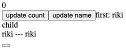
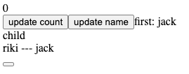

# React Hooks


参考：

[React-hooks入门 · 语雀 (yuque.com)](https://www.yuque.com/joker-u9xtl/ln72vr/nifkpv#d1c2u)

[三天精通 React - 飞书云文档 (feishu.cn)](https://bytedance.feishu.cn/docs/doccnmgIb5KcV3F0zeE47o6PvCh#ZRFMcC)

[终于搞懂 React Hooks了！！！！！ (juejin.cn)](https://juejin.cn/post/6844904072168865800#heading-0)

[30分钟精通React Hooks (juejin.cn)](https://juejin.cn/post/6844903709927800846)

[Hook 概览 – React (docschina.org)](https://react.docschina.org/docs/hooks-overview.html)


## Profile


*Hook* 是 React 16.8 的新增特性。它可以让你在不编写 class 的情况下使用 state 以及其他的 React 特性。

注意

React 16.8.0 是第一个支持 Hook 的版本。升级时，请注意更新所有的 package，包括 React DOM。 React Native 从 [0.59 版本](https://reactnative.dev/blog/2019/03/12/releasing-react-native-059)开始支持 Hook。


<div style="background-color: #fff7d3; border-left: 10px solid #ffe564;padding: 10px;">
    <h4>注意⚠️</h4>
    <span>React 16.8.0 是第一个支持 Hook 的版本。升级时，请注意更新所有的 package，包括 React DOM。 React Native 从 0.59 版本开始支持 Hook。</span>
</div>


  在我们继续之前，请记住 Hook 是：

- **完全可选的。** 你无需重写任何已有代码就可以在一些组件中尝试 Hook。但是如果你不想，你不必现在就去学习或使用 Hook。
- **100% 向后兼容的。** Hook 不包含任何破坏性改动。
- **现在可用。** Hook 已发布于 v16.8.0。

**没有计划从 React 中移除 class。** 你可以在本页[底部的章节](https://react.docschina.org/docs/hooks-intro.html#gradual-adoption-strategy)读到更多关于 Hook 的渐进策略。

**Hook 不会影响你对 React 概念的理解。** 恰恰相反，Hook 为已知的 React 概念提供了更直接的 API：props， state，context，refs 以及生命周期。稍后我们将看到，Hook 还提供了一种更强大的方式来组合他们。


#### Hello World

```jsx
import React, { useState } from 'react';

function Example() {
  // 声明一个新的叫做 “count” 的 state 变量  const [count, setCount] = useState(0);
  return (
    <div>
      <p>You clicked {count} times</p>
      <button onClick={() => setCount(count + 1)}>
        Click me
      </button>
    </div>
  );
}
```


<iframe src="https://codesandbox.io/embed/react-hook-hello-world-vnsq6?fontsize=14&hidenavigation=1&theme=dark"
     style="width:100%; height:500px; border:0; border-radius: 4px; overflow:hidden;"
     title="react-hook-hello world"
     allow="accelerometer; ambient-light-sensor; camera; encrypted-media; geolocation; gyroscope; hid; microphone; midi; payment; usb; vr; xr-spatial-tracking"
     sandbox="allow-forms allow-modals allow-popups allow-presentation allow-same-origin allow-scripts"
   ></iframe>

<iframe height="359" style="width: 100%;" scrolling="no" title="" src="https://codepen.io/shanxiansen310/embed/eYWLxaR?default-tab=html%2Cresult" frameborder="no" loading="lazy" allowtransparency="true" allowfullscreen="true">
  See the Pen <a href="https://codepen.io/shanxiansen310/pen/eYWLxaR">
  </a> by shanxiansen310 (<a href="https://codepen.io/shanxiansen310">@shanxiansen310</a>)
  on <a href="https://codepen.io">CodePen</a>.
</iframe>


#### Why use hooks❓


##### 1.易于在组件间复用状态逻辑


😭在组件之间复用状态逻辑很难，React 没有提供将可复用性行为“附加”到组件的途径（例如，把组件连接到 store）


😈你可以使用 Hook 从组件中提取状态逻辑，使得这些逻辑可以单独测试并复用。**Hook 使你在无需修改组件结构的情况下复用状态逻辑。** 这使得在组件间或社区内共享 Hook 变得更便捷。

具体将在[自定义 Hook](https://react.docschina.org/docs/hooks-custom.html) 中对此展开更多讨论。 


##### 2.更好理解复杂组件


😭我们经常维护一些组件，组件起初很简单，但是逐渐会被状态逻辑和副作用充斥。每个生命周期常常包含一些不相关的逻辑。例如，组件常常在 `componentDidMount` 和 `componentDidUpdate` 中获取数据。但是，同一个 `componentDidMount` 中可能也包含很多其它的逻辑，如设置事件监听，而之后需在 `componentWillUnmount` 中清除。相互关联且需要对照修改的代码被进行了拆分，而完全不相关的代码却在同一个方法中组合在一起。如此很容易产生 bug，并且导致逻辑不一致。

在多数情况下，不可能将组件拆分为更小的粒度，因为状态逻辑无处不在。这也给测试带来了一定挑战。同时，这也是很多人将 React 与状态管理库结合使用的原因之一。但是，这往往会引入了很多抽象概念，需要你在不同的文件之间来回切换，使得复用变得更加困难。


😈为了解决这个问题，**Hook 将组件中相互关联的部分拆分成更小的函数（比如设置订阅或请求数据）**，而并非强制按照生命周期划分。你还可以使用 reducer 来管理组件的内部状态，使其更加可预测。

我们将在[使用 Effect Hook](https://react.docschina.org/docs/hooks-effect.html#tip-use-multiple-effects-to-separate-concerns) 中对此展开更多讨论。


##### 3.可以在非class情况下使用更多的react特性


😭class的问题：

1、代码功能分散，较难形成关联。有些较小的组件，用class来写大可不必，会增加许多代码。假如是很大的组件，每个class内模块又比较多，容易造成开发时“上下反复横跳”的感觉。

2、共享状态较困难。每个组件都是一个class，如果嵌套了很多层组件，传值会是一个比较大的问题。

3、class本身就存在问题。class 不能很好的压缩，并且会使热重载出现不稳定的情况。

4、你必须去理解 JavaScript 中 `this` 的工作方式，这与其他语言存在巨大差异。还不能忘记绑定事件处理器。


😈为了解决这些问题，**Hook 使你在非 class 的情况下可以使用更多的 React 特性。** 从概念上讲，React 组件一直更像是函数。而 Hook 则拥抱了函数，同时也没有牺牲 React 的精神原则。Hook 提供了问题的解决方案，无需学习复杂的函数式或响应式编程技术。


🌟我们准备让 Hook 覆盖所有 class 组件的使用场景，但是**我们将继续为 class 组件提供支持。**在 Facebook，我们有成千上万的组件用 class 书写，我们完全没有重写它们的计划。相反，我们开始在新的代码中同时使用 Hook 和 class。


##### 👻对比

这里我们采用前面的那个计数例子来做对比！


Class版本：

```jsx
class Example extends React.Component {
  constructor(props) {
    super(props);
    this.state = {
      count: 0
    };
  }

  render() {
    return (
      <div>
        <p>You clicked {this.state.count} times</p>
        <button onClick={() => this.setState({ count: this.state.count + 1 })}>
          Click me
        </button>
      </div>
    );
  }
}

```


使用Hooks：

```jsx
import { useState } from 'react';

function Example() {
  const [count, setCount] = useState(0);

  return (
    <div>
      <p>You clicked {count} times</p>
      <button onClick={() => setCount(count + 1)}>
        Click me
      </button>
    </div>
  );
}

```


是不是简单多了！可以看到，`Example`变成了一个函数，但这个函数却有自己的状态（count），同时它还可以更新自己的状态（setCount）。这个函数之所以这么了不得，就是因为它注入了一个hook--`useState`，就是这个hook让我们的函数变成了一个有状态的函数。


## Hooks


下面我们来介绍一些hooks

hooks的意思是钩子，组件尽量写成纯函数。Hooks是一个新的React特性提案，组件尽量写成纯函数，如果需要外部React特性（比如状态管理，生命周期），就用钩子把外部特性"钩"进来，通常函数名字都是以use开头。

Hook 是一些可以让你在函数组件里“钩入” React state 及生命周期等特性的函数。**Hook 不能在 class 组件中使用** —— 这使得你不使用 class 也能使用 React。

本文介绍的hooks有：useState、useReucer、useEffect、useContext、useRef、useMemo


**When would I use a Hook?**

如果你在编写函数组件并意识到需要向其添加一些 state，以前的做法是必须将其它转化为 class。现在你可以在现有的函数组件中使用 Hook。


### useState


#### why


`useState` 的出现是 ： 在函数组件里面使用 class的`setState`😍

解决了的问题是：当我们一个函数组件想要有自己维护的state的时候，不得已只能转换成class。这样很麻烦！


#### how 


##### Desc

在函数组件中，我们没有 `this`，所以我们不能分配或读取 `this.state`。我们直接在组件中调用 `useState` Hook：

```jsx
import React, { useState } from 'react';

function Example() {
  // 声明一个叫 “count” 的 state 变量  
  const [count, setCount] = useState(0);
```


😮说明：

useState 是一种在函数调用时保存变量的方式 —— `useState` 是一种新方法，它与 class 里面的 `this.state` 提供的功能完全相同。一般来说，在函数退出后变量就会”消失”，而 state 中的变量会被 React 保留。


🧷参数

`useState()` 方法里面唯一的参数就是初始 state。不同于 class 的是，我们可以按照需要使用数字或字符串对其进行赋值，而不一定是对象。 

💎这里可以确定的是 useState 就是把这个参数赋值给了返回值数组中的第一个值！并不会进行 copy！


🔙返回值

当前 state 以及更新 state 的函数。

当我们使用 `useState` 定义 state 变量时候，它返回一个有两个值的数组。第一个值是当前的 state，第二个值是更新 state 的函数。使用 `[0]` 和 `[1]` 来访问有点令人困惑，因为它们有特定的含义。这就是我们使用数组解构的原因。

```jsx
var fruitStateVariable = useState('banana'); // 返回一个有两个元素的数组
var fruit = fruitStateVariable[0]; // 数组里的第一个值
var setFruit = fruitStateVariable[1]; // 数组里的第二个值
```


<div style="background-color: #fff7d3; border-left: 10px solid #ffe564;padding: 10px;">
    <h4>注意⚠️</h4>
    <span>state 只在组件首次渲染的时候被创建。在下一次重新渲染时，useState 返回给我们当前的 state。否则它就不是 “state”了！这也是 Hook 的名字总是以 use 开头的一个原因。</span>
</div> 


**reading & updating**


当我们想在 class 中显示当前的 count，我们读取 `this.state.count`：

```jsx
  <p>You clicked {this.state.count} times</p>
```

在函数中，我们可以直接用 `count`:

```jsx
  <p>You clicked {count} times</p>
```


在 class 中，我们需要调用 `this.setState()` 来更新 `count` 值：

```jsx
  <button onClick={() => this.setState({ count: this.state.count + 1 })}>    Click me
  </button>
```

在函数中，我们已经有了 `setCount` 和 `count` 变量，所以我们不需要 `this`:

```jsx
  <button onClick={() => setCount(count + 1)}>    Click me
  </button>
```


★使用多个变量的话直接声明多个useState就好了！


##### useState更新规则

[useState – React (docschina.org)](https://react.docschina.org/docs/hooks-reference.html#usestate)

If you update a State Hook to the same value as the current state, React will bail out without rendering the children or firing effects. (React uses the [`Object.is` comparison algorithm](https://developer.mozilla.org/en-US/docs/Web/JavaScript/Reference/Global_Objects/Object/is#Description).)

🧐啥意思呢？ 就是说如果你把原来的state传进更新函数作为参数的话，React 将跳过子组件的渲染及 effect 的执行，也就是说不会更新和渲染！

🤔那react怎么判断传进来的参数是否和原来的state一样呢？ 采用的是 Object.is 方法[Object.is() - JavaScript | MDN (mozilla.org)](https://developer.mozilla.org/en-US/docs/Web/JavaScript/Reference/Global_Objects/Object/is#description)

```js
// Case 1: Evaluation result is the same as using ===
Object.is(25, 25);                // true
Object.is('foo', 'foo');          // true
Object.is('foo', 'bar');          // false
Object.is(null, null);            // true
Object.is(undefined, undefined);  // true
Object.is(window, window);        // true
Object.is([], []);                // false
var foo = { a: 1 };
var bar = { a: 1 };
Object.is(foo, foo);              // true
Object.is(foo, bar);              // false

// Case 2: Signed zero
Object.is(0, -0);                 // false
Object.is(+0, -0);                // false
Object.is(-0, -0);                // true
Object.is(0n, -0n);               // true

// Case 3: NaN
Object.is(NaN, 0/0);              // true
Object.is(NaN, Number.NaN)        // true
```


示例：

在class组件中 setState由于是合并更新的策略，只要调用setState就会根据更新值重新渲染视图！

```jsx
const obj={
  name:'riki',
  age:12,
}
class App extends React.Component{
  constructor(props) {
    super(props);
    this.state={
      key:obj,
    };
  }
  render() {
    return (
      <div>
        <button onClick={()=>{
          obj.name='aski';
          this.setState({
            key:obj
          })
        }}>123</button>
        {this.state.key.name}
      </div>
    )
  }
}
```

💎这里我们对原来的对象 obj 进行修改后，在setState中赋值给key，会重新渲染视图！


⚠️可是在useState中如果原来的对象没有变更地址就不会重新渲染！

```jsx
const Child = (() =>{
  const arr=[1,2,3];
  const [name, setName] = useState(arr)
  return (
    <div>
      <div>child</div>
      <div>{name} --- {arr}</div>
      <button onClick={() => {
        arr.push(4);
        setName(arr);
        console.log(name);
        console.log(arr);
      }}/>
    </div>
  );
})
```

⭐️上面这段代码点击按钮时虽然会触发setName函数（并且name和arr值都变化了），但并不会引起视图的重新渲染，**因为 arr 的地址没变**。如果我们不是push而是 $arr=[1,2]$ 那么就会触发视图的更新！


##### 使用funtion作为入参


**▼以下情况 useState 需使用 function 作为入参**


> **当初始状态需要复杂计算时**

假设，count 的初始值需要根据 props 传入的数据相加来确定时，我们对比两种初始化方式：

```jsx
// bad
const initialCount = props.data.reduce((acc, cur) => acc + cur, 0);
const [count, setCount] = useState(initialCount);

// good
const [count, setCount] = useState(
  () => props.data.reduce((acc, cur) => acc + cur, 0)
);
```

利用 function 传参只会执行一次的特点，组件重绘时就不需要再执行无用的 reduce 计算。

🔮这里不是指浏览器重绘，组件重绘是指组件函数执行一次。

有点类似于Vue中的计算属性和方法！

怎么说呢，我也不太清楚会有啥情况导致组件重绘😅 这里举一个 useState更新函数的例子吧！


* 不使用function入参 

```jsx
const ComText = ()=>{
  const initial = ()=>{
    console.log(1)
    return 1
  }
  const initialCount = initial()
  const [count, setCount] = useState(initialCount)
  const [name, setName] = useState('riki')
  return (
    <div>
      <button onClick={()=>{setName('he')}}>click</button>
      <button onClick={()=>{setName('he1')}}>click</button>
      {name}
    </div>
  )
}
```

这里使用一个函数来代替之前的reduce并在被调用时打印 1，我们这里直接传入 initial()。 然后再设置一个name的state，我们不更新count，通过 setName 来触发组件重绘并观察initial的调用情况！

<iframe src="https://codesandbox.io/embed/recursing-flower-2djk2?expanddevtools=1&fontsize=15&hidenavigation=1&theme=dark&view=preview"
     style="width:100%; height:500px; border:0; border-radius: 4px; overflow:hidden;"
     title="recursing-flower-2djk2"
     allow="accelerometer; ambient-light-sensor; camera; encrypted-media; geolocation; gyroscope; hid; microphone; midi; payment; usb; vr; xr-spatial-tracking"
     sandbox="allow-forms allow-modals allow-popups allow-presentation allow-same-origin allow-scripts"
   ></iframe>
你会发现在我们 setName 的时候整个组件函数会被重新调用，也就是重新渲染！ 由于我们对useState传入的是 一个计算值 initial()，因此每次渲染的时候都会去重新计算！

 (⭐️ 关键看下面的console，每次点击click虽然更新的是name但也会触发initial函数！因为react不知道这里会不会有影响！就会重新执行！但是重复点击只会渲染两次！估计是啥diff原理)

 但是如果我们是 function 入参


* 使用function入参

```jsx
// 这是一个计算后的结果不是funtion！
const initialCount = props.data.reduce((acc, cur) => acc + cur, 0);
const initialCount = initial();

// 下面两种都是传函数
const [count, setCount]=useState(initial);
const [count, setCount]=useState(()=>initial());
```

★  关键看console

<iframe src="https://codesandbox.io/embed/reverent-silence-xirqz?expanddevtools=1&fontsize=14&hidenavigation=1&theme=dark&view=preview"
     style="width:100%; height:500px; border:0; border-radius: 4px; overflow:hidden;"
     title="function入参2"
     allow="accelerometer; ambient-light-sensor; camera; encrypted-media; geolocation; gyroscope; hid; microphone; midi; payment; usb; vr; xr-spatial-tracking"
     sandbox="allow-forms allow-modals allow-popups allow-presentation allow-same-origin allow-scripts"
   ></iframe>

💎 可以发现这时我们再点击 click 不会再执行initial函数了！因为我们传的参数是函数，函数只会执行一次！


暂时有些疑惑具体使用场景，因为改用函数传参后如何调用set函数去变更呢？ 🤔


**当初始状态是复杂对象时**

创建一个复杂对象的性能开销是很大的。假设现在有一个初始 state 包含 50+ 个字段，我们就需要使用 function 只执行一次的特点，让这个复杂对象的声明只在第一次渲染时执行。（function 的声明所耗性能与 function 所含代码量无关的，但对象、数组是增长的）

```jsx
// bad
const [initialState, setState] = useState({
  attr1: 'xxxx',
  attr2: 'xxxx',
  ...
  attr50: 'xxxx',
});

// good
const [initialState, setState] = useState(() => ({
  attr1: 'xxxx',
  attr2: 'xxxx',
  ...
  attr50: 'xxxx',
}));
```


##### <span style='color:red;'>💎setCount两种传参模式的区别 </span>


setCount，setCount其实可以传入表达式，也可以传入一个函数，例如这样：

```jsx
// 传入表达式
function handleClick() {
   setCount(count + 1)
}
// 传入函数
function handleClickFn() {
  setCount((prevCount) => {
     return prevCount + 1
  })
}
```


这两种方法在同步情况下没区别，但是在异步环境下就有区别了。

```jsx
function App() {
  const [count, setCount] = useState(0)
  const handleClick = () => {
    setTimeout(() => {
      setCount(count + 1)
    }, 1000)
  }
  const handleClickFn = () => {
    setTimeout(() => {
      setCount((prev) => {
        return prev + 1
      })
    }, 1000)
  }
  return (
    <div className="App">
      {count}
      <button onClick={handleClick}>handleClick</button>
      <button onClick={handleClickFn}>handleClickFn</button>
    </div>
  );
}
```

当我们分别快速点击按钮时，handleClick只会生效一次，handleClickFn会生效多次。

🎃原因如下：

点击handleClick时，count没变化，所以只会执行一次。

点击handleClickFn时，prev可以获取上一次的值，每次都将这个值+1，因此会执行多次。


<iframe height="192" style="width: 100%;" scrolling="no" title="react-temp" src="https://codepen.io/shanxiansen310/embed/eYWLxaR?default-tab=html%2Cresult" frameborder="no" loading="lazy" allowtransparency="true" allowfullscreen="true">
  See the Pen <a href="https://codepen.io/shanxiansen310/pen/eYWLxaR">
  react-temp</a> by shanxiansen310 (<a href="https://codepen.io/shanxiansen310">@shanxiansen310</a>)
  on <a href="https://codepen.io">CodePen</a>.
</iframe>


这个特点跟setState类似，如果需要依赖于上一次的值，就要给他传一个函数，return修改后的结果。


```jsx
class Counter extends React.Component {
  constructor(props) {
    super(props)
    this.state = { count: 0 }
  }
  handleClick = () => {
    this.setState({ count: this.state.count + 1 })
    this.setState({ count: this.state.count + 1 })
    // 这样写只会加1
  }
  handleClickFn = () => {
    this.setState((prevState) => {
      return { count: prevState.count + 1 }
    })
    this.setState((prevState) => {
      return { count: prevState.count + 1 }
    })
  }
  render() {
    return (
      <>
        Count: {this.state.count}
        <button onClick={this.handleClick}>+</button>
        <button onClick={this.handleClickFn}>+</button>
      </>
    );
  }
}
```

<iframe height="154" style="width: 100%;" scrolling="no" title="react-temp" src="https://codepen.io/shanxiansen310/embed/abWRObZ?default-tab=html%2Cresult" frameborder="no" loading="lazy" allowtransparency="true" allowfullscreen="true">
  See the Pen <a href="https://codepen.io/shanxiansen310/pen/abWRObZ">
  react-temp</a> by shanxiansen310 (<a href="https://codepen.io/shanxiansen310">@shanxiansen310</a>)
  on <a href="https://codepen.io">CodePen</a>.
</iframe>


这也可以说是useState异步回调的问题！

当使用useState对数据进行更新，并不能立刻获取到最新的数据。

```jsx
  const [name, setName] = useState('dx');

  const handleTest = () => {
    console.log(name) // dx
    setName('dx1')
    console.log(name) // dx
  }
```


#### ⚠️Attention


###### <span style='color:red;'>❗️1.不要在 component函数中同步调用setCount！</span>

就是不要直接用在组件函数中

```jsx
function BadComponent() {
  const [count, setCount] = useState(0);
  setCount(count + 1); // Oops！Trigger rerender again and again
  return count;
}
```


🤓原因：每次使用 `setCount` 时，都会重新执行 Component 的函数，所以，**绝对不能**在 Component 函数中同步调用 `setCount`，这样会导致无限重绘，页面假死


💎`setCount` 操作必须在某个回调中调用，不应该出现在 Component 函数的同步调用栈中执行。


###### <span style='color:red;'>2.useState的初始值，只在第一次有效！</span>


这什么意思呢？ 就是说 useState只会调用一次，如果后续想变更state只能通过useState返回的更新函数来进行更新！

<iframe src="https://codesandbox.io/embed/aged-leftpad-wv6gg?fontsize=14&hidenavigation=1&theme=dark"
     style="width:100%; height:500px; border:0; border-radius: 4px; overflow:hidden;"
     title="aged-leftpad-wv6gg"
     allow="accelerometer; ambient-light-sensor; camera; encrypted-media; geolocation; gyroscope; hid; microphone; midi; payment; usb; vr; xr-spatial-tracking"
     sandbox="allow-forms allow-modals allow-popups allow-presentation allow-same-origin allow-scripts"
   ></iframe>


🚨这里是一个例子！ 由父组件提供给子组件 data 属性，而子组件又将 data 作为 useState 的参数传递给name！

我们此时点击按钮 update name，会在父组件对name（也就是传递给子组件的data变量）进行更新，这时类似于class中父组件state更新同时更新子组件props，子组件的data也更新了！ <span style='color:red;font-weight:bold;'>BUT</span>， 子组件的name却没有更新，这是为什么呢？

* 首先 data 这里是一个基础类型的变量，只是值传递，因此data变化并不会影响name！

* 然后我们想要变更name（引起页面重新渲染的那种），只能通过 setName 来实现！而这里的useState只会在初始调用一次！ 就和 class组件中constructor里定义的state一样！后续如果还想变更name只能通过setName函数，单纯的改变data不会使useState再次被调用的！


<span style='color:red;'>3.useState的更新函数不是在原来的对象上进行修改而是赋值给一个新的变量！</span>


在class组件中我们采用的是setState，一般是这么写的

```jsx
this.setState({
	name: { first:'Spike', last:'Ri' }
})
```

其实setName也和这个一样，是将一个新的对象完整的赋值给name，而不是采用原来的对象进行更新得到！这也是useState一个缺点：

<div style="background-color: #fff7d3; border-left: 10px solid #ffe564;padding: 10px;">    <h5>⚠️useState不适合复杂对象的更改。</h5>    <span>
因为useState不能像setState那样进行合并更新，当使用useState第二个参数进行数据更新的时候，必须传入一个完整的结构，而不仅仅只是改变的那一部分。</span></div>

但useState相当于是把原来class组件 state中的多个键值对拆分成了多个 [name, setName] 


这个attention有啥用呢？ 还是举上面那个例子，我们将传递的name从字符串类型变成了对象类型！

```jsx
const Child = (({data}) =>{
  console.log('child render...', data)
  const [name, setName] = useState(data)
  return (
    <div>
      <div>child</div>
      <div>{name.first} --- {data.first}</div>
      <button onClick={() => {
        console.log(name)
        console.log(data)
      }}/>
    </div>
  );
})

const Hook =()=>{
  console.log('Hook render...')
  const [count, setCount] = useState(0)
  const [name, setName] = useState({ first:'riki' })

  return(
    <div>
      <div>
        {count}
      </div>
      <button onClick={()=>setCount(count+1)}>update count </button>
      <button onClick={()=>setName({first:'jack'})}>update name </button>
      first: {name.first}
      <Child data={name}/>
    </div>
  )
}
```


| 初始                                                         | 点击 update name                                             |
| ------------------------------------------------------------ | ------------------------------------------------------------ |
|  |  |

这里明显是引用类型的传值，**在child组件中name和data指向同一个对象（指针地址相同）**，但为什么data变化了name却没有变化？ 这就是因为父组件Hook中setName改变了name并非是在原来的name上进行更新，而是完全将一个新的对象赋值给了name，因此传递给子组件中对应的data地址也更新了会进行相应的变化，但子组件中的name还是原来的对象所以没有更新！


⭐️因此 setName 对于基础类型会直接改变值，对于引用类型也不是在原来的地址上对对象进行修改，而是完全将采用了一个新的地址的对象进行对其赋值 


###### ❗️为什么必须把hooks写在函数的最外层？


react hook保证多个useState互相独立是通过出现的顺序判断的！

```jsx
function ExampleWithManyStates() {
  const [age, setAge] = useState(42);
  const [fruit, setFruit] = useState('banana');
  const [todos, setTodos] = useState([{ text: 'Learn Hooks' }]);
```

我们调用了三次useState，每次我们传的参数只是一个值（如42，‘banana’），我们根本没有告诉react这些值对应的key是哪个，那react是怎么保证这三个useState找到它对应的state呢？

答案是，react是根据useState出现的顺序来定的。我们具体来看一下：

```jsx
  //第一次渲染
  useState(42);  //将age初始化为42
  useState('banana');  //将fruit初始化为banana
  useState([{ text: 'Learn Hooks' }]); //...

  //第二次渲染
  useState(42);  //读取状态变量age的值（这时候传的参数42直接被忽略）
  useState('banana');  //读取状态变量fruit的值（这时候传的参数banana直接被忽略）
  useState([{ text: 'Learn Hooks' }]); //...
```


修改一下代码，不将hooks放在最外层

```jsx
let showFruit = true;
function ExampleWithManyStates() {
  const [age, setAge] = useState(42);
  
  if(showFruit) {
    const [fruit, setFruit] = useState('banana');
    showFruit = false;
  }
 
  const [todos, setTodos] = useState([{ text: 'Learn Hooks' }]);
```


此时就会报错🚨

```jsx
  //第一次渲染
  useState(42);  //将age初始化为42
  useState('banana');  //将fruit初始化为banana
  useState([{ text: 'Learn Hooks' }]); //...

  //第二次渲染
  useState(42);  //读取状态变量age的值（这时候传的参数42直接被忽略）
  // useState('banana');  
  useState([{ text: 'Learn Hooks' }]); //读取到的却是状态变量fruit的值，导致报错
```


⚠️鉴于此，react规定我们必须把hooks写在函数的最外层，不能写在ifelse等条件语句当中，来确保hooks的执行顺序一致！


### useEffect


#### why


useEffect  ： 在函数组件里面使用 class的生命周期函数。


🆚对比class

* useEffect

```jsx
import React, { useState, useEffect } from 'react';

function Example() {
  const [count, setCount] = useState(0);

  // Similar to componentDidMount and componentDidUpdate:
  useEffect(() => {
    // Update the document title using the browser API
    document.title = `You clicked ${count} times`;
  });

  return (
    <div>
      <p>You clicked {count} times</p>
      <button onClick={() => setCount(count + 1)}>
        Click me
      </button>
    </div>
  );
}
```


* class

```jsx
class Example extends React.Component {
  constructor(props) {
    super(props);
    this.state = {
      count: 0
    };
  }

  componentDidMount() {
    document.title = `You clicked ${this.state.count} times`;
  }
  componentDidUpdate() {
    document.title = `You clicked ${this.state.count} times`;
  }

  render() {
    return (
      <div>
        <p>You clicked {this.state.count} times</p>
        <button onClick={() => this.setState({ count: this.state.count + 1 })}>
          Click me
        </button>
      </div>
    );
  }
}
```


😈**在这个 class 中，我们需要在两个生命周期函数中编写重复的代码。**

这是因为很多情况下，我们希望在组件加载和更新时执行同样的操作。从概念上说，我们希望它在每次渲染之后执行 —— 但 React 的 class 组件没有提供这样的方法。即使我们提取出一个方法，我们还是要在两个地方调用它。


可是在useEffect中就只用写一次！

我们写的有状态组件，通常会产生很多的副作用（side effect），比如发起ajax请求获取数据，添加一些监听的注册和取消注册，手动修改dom等等。我们之前都把这些副作用的函数写在生命周期函数钩子里，比如componentDidMount，componentDidUpdate和componentWillUnmount。而现在的useEffect就相当与这些声明周期函数钩子的集合体。它以一抵三。

<div style="background-color: #fff7d3; border-left: 10px solid #ffe564;padding: 10px;">    <h4>💡提示</h4>    <span>可以把useEffect Hook 看做 componentDidMount，componentDidUpdate 和 componentWillUnmount 这三个函数的组合。</span></div>

同时，由于hooks可以反复多次使用，相互独立。所以我们合理的做法是，给每一个副作用一个单独的useEffect钩子。这样一来，这些副作用不再一股脑堆在生命周期钩子里，代码变得更加清晰。


#### how


##### Desc


<span style='color:red;font-weight:bold;'>React 将按照 effect 声明的顺序依次调用组件中的*每一个* effect。</span>


1. 通过使用useEffect，你可以告诉 React 组件<span style='color:red;'>需要在渲染后执行某些操作</span>。React 会保存你传递的函数（我们将它称之为 “effect”），并且**在执行 DOM 更新之后调用它**。

2. **`useEffect` 会在每次渲染后都执行**。react首次渲染和之后的每次渲染都会调用一遍传给useEffect的函数。而之前我们要用两个声明周期函数来分别表示首次渲染（componentDidMount），和之后的更新导致的重新渲染（componentDidUpdate）。React 保证了每次运行 effect 的同时，DOM 都已经更新完毕。

3. **useEffect中定义的副作用函数的执行不会阻碍浏览器更新视图**，也就是说这些函数是异步执行的，而之前的componentDidMount或componentDidUpdate中的代码则是同步执行的。这种安排对大多数副作用说都是合理的，但有的情况除外，比如我们有时候需要先根据DOM计算出某个元素的尺寸再重新渲染，这时候我们希望这次重新渲染是同步发生的，也就是说它会在浏览器真的去绘制这个页面前发生。

   

   🤺🤺🤺useLayoutEffect 和 useEffect 的传参一致，但有以下区别

   1. 执行时机不同。useLayoutEffect 的入参函数会在 react 更新 DOM 树后同步调用。useEffect 为异步调用

      ⭐️ 在 DOM 变更后，游览器渲染前。此时比如去拿 style 或者 dom 尺寸，都是游览器即将渲染的那一次的尺寸，而不是现在页面上展示的尺寸。 useEffect 则肯定是在游览器渲染完后才执行。

   

   2. useLayoutEffect 在 development 模式下 SSR 会有警告⚠️

   通常情况下 useLayoutEffect 会用在做动效和记录 layout 的一些特殊场景。一般不需要使用 useLayoutEffect


##### 1.无需清除的effect


有时候，我们只想**在 React 更新 DOM 之后运行一些额外的代码。**比如发送网络请求，手动变更 DOM，记录日志，这些都是常见的无需清除的操作。因为我们在执行完这些操作之后，就可以忽略他们了


```jsx
function Example() {
  const [count, setCount] = useState(0);

  useEffect(() => {
    document.title = `You clicked ${count} times`;
  });
}
```


##### 2.需要清除的effect


为什么需要清除？🤔

> 大家都知道，render了之后会执行重新useEffect，如果useEffect里面有一个每setInterval...那么每次render了，再次执行useEffect就会再创建一个setInterval，然后就混乱了...可以把下面案例return的内容删掉感受下

```jsx
useEffect(()=>{
  console.log('use effect...',count)
  const timer = setInterval(() => setCount(count +1), 1000)
  //return ()=>{clearInterval(timer)}
})
```


```jsx
import React, { useState, useEffect } from 'react';

function FriendStatus(props) {
  const [isOnline, setIsOnline] = useState(null);

  useEffect(() => {
    function handleStatusChange(status) {
      setIsOnline(status.isOnline);
    }
    ChatAPI.subscribeToFriendStatus(props.friend.id, handleStatusChange);
    // Specify how to clean up after this effect:
    return function cleanup() {
      ChatAPI.unsubscribeFromFriendStatus(props.friend.id, handleStatusChange);
    };
  });

  if (isOnline === null) {
    return 'Loading...';
  }
  return isOnline ? 'Online' : 'Offline';
}
```


⭐️effect的清除就通过在useEffect中返回一个函数即可，如此可以将添加和移除订阅的逻辑放在一起！


🤔️ 什么时候开始清除？

➡️ React 会在组件卸载的时候执行清除操作。这种解绑的模式跟componentWillUnmount不一样。componentWillUnmount只会在组件被销毁前执行一次而已，而 <span style='color:red;font-weight:bold;'>useEffect里的函数，每次组件渲染后都会执行一遍，包括副作用函数返回的这个清理函数也会重新执行一遍。</span> 

其每次渲染和清除：

```jsx
function FriendStatus(props) {
  // ...
  useEffect(() => {
    // ...
    ChatAPI.subscribeToFriendStatus(props.friend.id, handleStatusChange);
    return () => {
      ChatAPI.unsubscribeFromFriendStatus(props.friend.id, handleStatusChange);
    };
  });
```

```jsx
// Mount with { friend: { id: 100 } } props
ChatAPI.subscribeToFriendStatus(100, handleStatusChange);     // 运行第一个 effect

// Update with { friend: { id: 200 } } props
ChatAPI.unsubscribeFromFriendStatus(100, handleStatusChange); // 清除上一个 effect
ChatAPI.subscribeToFriendStatus(200, handleStatusChange);     // 运行下一个 effect

// Update with { friend: { id: 300 } } props
ChatAPI.unsubscribeFromFriendStatus(200, handleStatusChange); // 清除上一个 effect
ChatAPI.subscribeToFriendStatus(300, handleStatusChange);     // 运行下一个 effect

// Unmount
ChatAPI.unsubscribeFromFriendStatus(300, handleStatusChange); // 清除最后一个 effect
```

此默认行为保证了一致性，避免了在 class 组件中因为没有处理更新逻辑而导致常见的 bug。


##### 3.如何跳过effect❓


**★ 在第二个参数中以数组的形式传递依赖的的变量！**

⚠️这不是说对第二个参数里的变量跳过然后其他参数正常更新，而是 <span style='color:red;font-weight:bold;'>只有第二个参数中的变量发生变化才会触发 useEffect！ </span> 


在某些情况下，每次渲染后都执行清理或者执行 effect 可能会导致性能问题。在 class 组件中，我们可以通过在 `componentDidUpdate` 中添加对 `prevProps` 或 `prevState` 的比较逻辑解决：

```jsx
componentDidUpdate(prevProps, prevState) {
  if (prevState.count !== this.state.count) {
    document.title = `You clicked ${this.state.count} times`;
  }
}
```


这是很常见的需求，所以它被内置到了 `useEffect` 的 Hook API 中。如果某些特定值在两次重渲染之间没有发生变化，你可以通知 React **跳过**对 effect 的调用，只要传递数组作为 `useEffect` 的第二个可选参数即可：

```jsx
useEffect(() => {
  document.title = `You clicked ${count} times`;
}, [count]); // 仅在 count 更改时更新
```

上面这个示例中，我们传入 `[count]` 作为第二个参数。这个参数是什么作用呢？如果 `count` 的值是 `5`，而且我们的组件重渲染的时候 `count` 还是等于 `5`，React 将对前一次渲染的 `[5]` 和后一次渲染的 `[5]` 进行比较。因为数组中的所有元素都是相等的(`5 === 5`)，React 会跳过这个 effect，这就实现了性能的优化。

当渲染时，如果 `count` 的值更新成了 `6`，React 将会把前一次渲染时的数组 `[5]` 和这次渲染的数组 `[6]` 中的元素进行对比。这次因为 `5 !== 6`，React 就会再次调用 effect。如果数组中有多个元素，即使只有一个元素发生变化，React 也会执行 effect。

⭐️对于有清除操作的 effect 同样适用！


<div style="background-color: #fff7d3; border-left: 10px solid #ffe564;padding: 10px;">    		<h5>注意⚠️</h5>    
  <span>如果你要使用此优化方式，请确保数组中包含了所有外部作用域中会随时间变化并且在 effect 中使用的变量，否则你的代码会引用到先前渲染中的旧变量</span> 
  <p>如果想执行只运行一次的 effect（仅在组件挂载和卸载时执行），可以传递一个空数组（[]）作为第二个参数。这就告诉 React 你的 effect 不依赖于 props 或 state 中的任何值，所以它永远都不需要重复执行。这并不属于特殊情况 —— 它依然遵循依赖数组的工作方式。
</p>
</div>


##### 🛠应用场景


###### 1.只需在挂载时执行一次


类似于class组件只在componentDid中调用， 可以用来请求异步数据...、

> useEffect最后，加了[]就表示只第一次执行

```jsx
useEffect(()=>{
  const users = 获取全国人民的信息()
},[])
```


###### 2.每次渲染都会执行，不清除


类似于class组件在componentDid和componentDidUpdate中调用

> useEffect最后，不加[]就表示每一次渲染都执行

```jsx
useEffect(()=>{
  const users = 每次都获取全国人民的信息()
})
```


###### 3.指定变量更新时才执行，不清除


每次渲染都执行感觉有点费

> useEffect最后，加[]，并且[]里面加的字段就表示，这个字段更改了，我这个effect才执行

```jsx
useEffect(() => {
  const users = （name改变了我才获取全国人民的信息()）
},[name])
```


###### 4.使用多个effect


我们有时想用多个effect来应对不同的变量：

```jsx
useEffect(() => {
  const users = （name改变了我才获取全国人民的name信息()）
},[name])

useEffect(() => {
  const users = （name改变了我才获取全国人民的age信息()）
},[age])
```


###### 5.每次渲染都会执行，需要清除


> 在effect的return里面可以做取消订阅的事

```jsx
useEffect(() => {
  const subscription = 订阅全国人民吃饭的情报！
  return () => {
    取消订阅全国人民吃饭的情报！
  }
})
```


##### 💎使用Effect实现关注点分离


**Hook 允许我们按照代码的用途分离他们，** 而不是像生命周期函数那样。React 将按照 effect 声明的顺序依次调用组件中的*每一个* effect。


class组件：

```jsx
class FriendStatusWithCounter extends React.Component {
  constructor(props) {
    super(props);
    this.state = { count: 0, isOnline: null };
    this.handleStatusChange = this.handleStatusChange.bind(this);
  }

  componentDidMount() {
    document.title = `You clicked ${this.state.count} times`;
    ChatAPI.subscribeToFriendStatus(
      this.props.friend.id,
      this.handleStatusChange
    );
  }

  componentDidUpdate() {
    document.title = `You clicked ${this.state.count} times`;
  }

  componentWillUnmount() {
    ChatAPI.unsubscribeFromFriendStatus(
      this.props.friend.id,
      this.handleStatusChange
    );
  }

  handleStatusChange(status) {
    this.setState({
      isOnline: status.isOnline
    });
  }
  // ...
```

🥵可以发现设置 `document.title` 的逻辑是如何被分割到 `componentDidMount` 和 `componentDidUpdate` 中的，订阅逻辑又是如何被分割到 `componentDidMount` 和 `componentWillUnmount` 中的。而且 `componentDidMount` 中同时包含了两个不同功能的代码。 这样代码逻辑分散特别不好！


hook：

```jsx
function FriendStatusWithCounter(props) {
  const [count, setCount] = useState(0);
  useEffect(() => {    document.title = `You clicked ${count} times`;
  });

  const [isOnline, setIsOnline] = useState(null);
  useEffect(() => {    function handleStatusChange(status) {
      setIsOnline(status.isOnline);
    }

    ChatAPI.subscribeToFriendStatus(props.friend.id, handleStatusChange);
    return () => {
      ChatAPI.unsubscribeFromFriendStatus(props.friend.id, handleStatusChange);
    };
  });
  // ...
}
```


#### ⚠️Attention


1.useEffect 里面使用到的state的值, 固定在了useEffect内部， 不会被改变，**除非useEffect刷新，重新固定state的值**

```jsx
const [count, setCount] = useState(0)
useEffect(() => {
  console.log('use effect...',count)
  setCount(count+1)
  const timer = setInterval(() => {
    console.log('timer...count:', count)
    setCount(count + 1)
  }, 1000)
  return ()=> clearInterval(timer)
},[])
```

这里有第二个参数为空数组，因此这个useEffect只会执行一次！ 我们在这个useEffect中进行setCount会发现count根本不会更新！ 因为只有useEffect刷新了才会更新（比如去掉第二个参数）！ 

❗️ 这里是指在 useEffect 内部的count不会改变，如果你在外面改变的话count还是会变的！不过在setInterval下会被改变为原来的值，不加setInterval倒是可以安稳在外面变更！


这里可以使用闭包来理解！setInterval 中的函数声明的时候，因为用到了外部变量，所以会 binding 声明时的 count 值。导致其作用域链上的变量count始终为0！


2.useEffect不能被判断包裹

3.useEffect不能被打断

报错：<span style='color:red;'>React Hook "useEffect" is called conditionally. React Hooks must be called in the exact same order in every component render</span>


原因和useState为什么必须写在最外面相同！


### useRef


#### why

当需要存放一个数据，需要无论在哪里都取到最新状态时，需要使用 useRef。


```jsx
function SomeComponent() {
  const [count, setCount] = useState(0);

  // 这里 useEffect 表示在第一次渲染完成后，执行回调函数
  useEffect(() => {
    const id = setInterval(() => {
      console.log(count);
      setCount(currentCount => currentCount + 1);
    });
    return () => { clearInterval(id); }
  }, []);
  return <h1>See what's printed in console.</h1>
}
```

因为函数声明时（第一次运行时），count 是 0，之后无论这个函数调用多少次，都会是 0。setInterval 中的函数声明的时候，因为用到了外部变量，所以会 binding 声明时的 count 值。


`useEffect`里面的state的值，是固定的，这个是有办法解决的，就是用`useRef`，可以理解成`useRef`的一个作用：

> 就是相当于全局作用域，一处被修改，其他地方全更新...


当我们改用useRef时就会一直更新！

```jsx
function SomeComponent() {
  const [count, setCount] = useState(0);

  const countRef = useRef(count);
  countRef.current = count;

  // 这里 useEffect 表示在第一次渲染完成后，执行回调函数
  useEffect(() => {
    const id = setInterval(() => {
      console.log(countRef.current);
      setCount(currentCount => currentCount + 1);
    },1000);
    return () => {
      clearInterval(id);
    }
  }, []);
  return <h1>See what's printed in console.</h1>
}
```


💎这里的 useRef 只是给 countRef 赋了一个初始值，并没有把countRef的值和count绑定起来！ 也就是说如果我们不添加 <span style='color:blue;'>countRef.current = count;</span> 的话，我们 setCount 更新count时 countRef.current是不会变化的! 那句话相当于把 countRef.current和count绑定起来了！😮

⭐现在我们每次触发setCount后其实count由于是state还是不会改变！但是countRef.current一直加一！


当然你也可以这么写

```jsx
const [count, setCount] = useState(0)
const countRef = useRef(0)
useEffect(() => {
  console.log('use effect...',count)
  const timer = setInterval(() => {
    console.log('timer...count:', countRef.current)
    setCount(++countRef.current)
  }, 1000)
  return ()=> clearInterval(timer)
},[])
```


#### How

```js
const refContainer = useRef(initialValue);
```

`useRef` 返回一个可变的 ref 对象，其 `.current` 属性被初始化为传入的参数（`initialValue`）。返回的 ref 对象在组件的整个生命周期内持续存在。


1.最简单的就是上面那种演示的用法，一处被修改，其他地方全更新


2.一般用于DOM操作，类似于以前的createRef

```jsx
function TextInputWithFocusButton() {
  const inputEl = useRef(null);
  const onButtonClick = () => {
    // `current` 指向已挂载到 DOM 上的文本输入元素
    inputEl.current.focus();
  };
  return (
    <>
      <input ref={inputEl} type="text" />
      <button onClick={onButtonClick}>Focus the input</button>
    </>
  );
}
```

这里点击按钮后就会转移焦点到 inputEl上去！


3.获取表单输入

```jsx
function CustomForm() {
  const eleRef = useRef(null)

  const handleSubmit = (e) => {
    console.log(eleRef.current.value)
    e.preventDefault();
  }

  return (
    <form onSubmit={handleSubmit}>
      <label>
        NAME: <input type="text" ref={eleRef} />
      </label>
      <input type="submit" value="Submit" />
  </form>
  )
}
```


4.也可以活学活用加上useEffect😈

```jsx
const Hook =()=>{
  const [count, setCount] = useState(0)
  const btnRef = useRef(null)

  useEffect(() => {
    console.log('use effect...')
    const onClick = ()=>{
      setCount(count+1)
    }
    btnRef.current.addEventListener('click',onClick, false)
    return ()=> btnRef.current.removeEventListener('click',onClick, false)
  },[count])

  return(
    <div>
      <div>
        {count}
      </div>
      <button ref={btnRef}>click me </button>
    </div>
  )
}
```


5.清除定时器😊

```jsx
function HookTimer() {
  const [timer, setTimer] = useState(0)
  // 解决了useEffect中interval声明后不能删除的问题
  const intervalRef = useRef()

  useEffect(() => {
    intervalRef.current = setInterval(() => {
      setTimer(timer + 1)
    }, 1000)
    return () => {
      clearInterval(intervalRef.current)
    }
  }, [timer])
  return (
    <div>
      <h2>{timer}</h2>
      <button onClick={() => clearInterval(intervalRef.current)}>Stop</button>
    </div>
  )
}
```


**🤩这里为什么要在useEffect中加上一个return呢？**

我也不知道👐，不过简单来说就是会生成多个setInterval产生混乱❗️

怎么说呢？ 每次页面刷新 useEffect依赖项timer会变化因此useEffect也会每次都执行！如果我们不清除那么每次渲染都会执行一次产生多个setInterval！

而我们的stop可以提前clearInterval，由于timer不会在变化，useEffect也不会在执行！这样就会停止！


#### ⚠️Attention


##### 1.避免基于可变对象的 ref 更新

对于 useRef 的值的更新，需要注意如果是在 Component 函数中[^同步赋值]的情况，不要做基于其他任何可变数据的增量更新，比如：

```jsx
// bad
countRef.current = countRef.current + 1;

// good
countRef.current = immutableState.count + 1;
```


因为在 StrictMode 下，React 每次渲染会执行两次 Component 函数，来检查函数组件的幂等性。这时基于可变数据的更新，会导致两次执行结果不一致，这是不允许的（会带来意想不到的更新结果，React 没有提供很好的 Warning 信息，很难排查 [About strict mode - CodeSandbox](https://codesandbox.io/s/about-strict-mode-xfw1e?file=/src/App.tsx)


[^同步赋值]:直接在 Component 这个方法的同步调用栈里赋值。而不是再类似 useEffect 这种 callback 里赋值


##### 2.useState、useRef 如何决策用哪种来维护状态


useRef 生成的可变对象，因为使用起来就跟普通对象一样，赋值时候 React 是无法感知到值变更的，所以也不会触发组件重绘。利用其与 useState 的区别，我们一般这样区分使用：

- 维护与 UI 相关的状态，使用 useState

> 确保更改时刷新 UI

- 值更新不需要触发重绘时，使用 useRef
- 不需要变更的数据、函数，使用 useState

> 比如，需要声明一个不可变的值时，可以这样：

> ```
> const [immutable] = useState(someState);
> ```


不返回变更入口函数。useRef 虽然可以借助 TypeScript 达到语法检测上的 immutable，但实际还是 mutable 的。因为你还是可以修改 ref.current


##### 3.useRef和createRef的区别


以点击按钮聚焦的例子先来看看两者是如何实现的

▼createRef：

```jsx
import { createRef } from 'react'
const FocusInput = () => {
	const inputElement = createRef()  // 获取到input元素
  const handleInput = () => {
  	inputElement.current.focus()
  }
  return (
  	<>
    	<input ref={inputElement} type='text'>
    	<button onClick={handleInput}></button>
    </>
  )
}
```


▼useRef：

```jsx
import { useRef } from 'react'
const FocusInput = () => {
	const inputElement = useRef()  // 获取到input元素
  const handleInput = () => {
  	inputElement.current.focus()
  }
  return (
  	<>
    	<input ref={inputElement} type='text'>
    	<button onClick={handleInput}></button>
    </>
  )
}
```


那两者有什么区别呢？

<span style='color:red;'>createRef每次都会返回新的引用，而useRef每次都会返回相同的引用。</span>

什么意思呢，来看下面这段代码：

这段代码只有在 ref 没有初始值的时候才会被赋值，如果每次都建立一个新的ref就会与num同步更新，但如果传回的是原来的ref就不会更新！

```jsx
const ChangeNum = () => {
  const [num, setNum] = useState(0)
  
  const refFromUseRef = useRef()
  const refFromCreateRef = createRef()
  if (!refFromUseRef.current) {
    refFromUseRef.current = num
  }
  if (!refFromCreateRef.current) {
    refFromCreateRef.current = num
  }

  return (
    <>
      {num}
      <p>refFromUseRef: {refFromUseRef.current}</p>
      <p>refFromCreateRef: {refFromCreateRef.current}</p>
      <button onClick={() => setNum(num + 1)}>ChangeNum</button>
    </>
  )
}
```

<iframe height="248" style="width: 100%;" scrolling="no" title="react-temp2" src="https://codepen.io/shanxiansen310/embed/gOWQyRr?default-tab=html%2Cresult" frameborder="no" loading="lazy" allowtransparency="true" allowfullscreen="true">
  See the Pen <a href="https://codepen.io/shanxiansen310/pen/gOWQyRr">
  react-temp2</a> by shanxiansen310 (<a href="https://codepen.io/shanxiansen310">@shanxiansen310</a>)
  on <a href="https://codepen.io">CodePen</a>.
</iframe>


当不断点击按钮时，num和refFromCreateRef值一直在+1，而中间的refFromUseRef却没有改变。

可以看出，createRef每次都创建了一个新的引用，因此数值会改变，而useRef每次的引用都是相同的，无论怎么变化，都不会改变其current的值。

useRef简单来说可以建立一个引用，在函数内都可以使用这个引用。useRef返回一个可变的ref对象，该对象只有个current属性，初始值为传入的参数(initialValue)。

❓ 但是为什么第一次点击按钮的时候会变化呢？ 因为判断条件为 !ref.current ，而初始值为0，!0为true


### useMemo


#### why


这里举个例子：

```jsx
import * as ReactDOM from "react-dom";
import React, {useState, useEffect, useRef, createRef, useMemo, memo} from 'react';

const Child = memo(({data}) =>{
  console.log('child render...', data.name)
  return (
    <div>
      <div>child</div>
      <div>{data.name}</div>
    </div>
  );
})

const Hook =()=>{
  console.log('Hook render...')
  const [count, setCount] = useState(0)
  const [name, setName] = useState('rose')

  const data = {
    name
  }

  return(
    <div>
      <div>
        {count}
      </div>
      <button onClick={()=>setCount(count+1)}>update count </button>
      <Child data={data}/>
    </div>
  )
}
```

当我们点击按钮更新count的时候，Effect组件会render，一旦render， 执行到这一行代码：

```jsx
   const data = {
      name
   }
```

这一行代码会生成有新的内存地址的对象，那么就算带着memo的Child组件，也会跟着重新render， 尽管最后其实Child使用到的值没有改变！

这种情况下虽然只是改变了count，并没有影响到Child组件的name，但依然会重新渲染child组件！这就会造成性能上的损失！


#### how


```jsx
const memoizedValue = useMemo(() => computeExpensiveValue(a, b), [a, b]);
```

🎃把“创建”函数和依赖项数组作为参数传入 `useMemo`，它仅会在某个依赖项改变时才重新计算 memoized 值。这种优化有助于避免在每次渲染时都进行高开销的计算。

记住，传入 `useMemo` 的函数会在**渲染期间执行**。请不要在这个函数内部执行与渲染无关的操作，诸如副作用这类的操作属于 `useEffect` 的适用范畴，而不是 `useMemo`。

如果没有提供依赖项数组，`useMemo` 在每次渲染时都会计算新的值。


我们尝试修改上面的例子：

```jsx
const data = useMemo(()=>{
  return {
    name
  }
},[name])
```

这样的话渲染的时候就不会再重新渲染Child组件了！ 

⚠️不过这里要注意的一点是Child组件要用memo生成！ useMemo是不会重新计算某个值，要想通过浅比较避免重新渲染组件的话要使用memo！


👀我们再来看另外一个例子

计算阶乘：

```jsx
function CalculateFactorial() {
  const [number, setNumber] = useState(1);
  const [inc, setInc] = useState(0);

  const factorial = factorialOf(number);

  const onChange = event => {
    setNumber(Number(event.target.value));
  };
  const onClick = () => setInc(i => i + 1);

  return (
    <div>
      Factorial of
      <input type="number" value={number} onChange={onChange} />
      is {factorial}
      <button onClick={onClick}>Re-render</button>
    </div>
  );
}

function factorialOf(n) {
  console.log('factorialOf(n) called!');
  return n <= 0 ? 1 : n * factorialOf(n - 1);
}
```


我们输入数字会计算出阶乘，每调用一次就会console这是正常的！ 但我们在不改变数字的情况下点击 re-render还是会再次调用factorialOf函数，这十分影响性能！

因此我们可以使用useMemo来获取阶乘值：

```js
const factorial = useMemo(() => factorialOf(number), [number]);
```


这样就不会重新渲染了！


#### ⚠️Attention


1.useMemo 和 useEffect的区别：


useMemo的作用：

在渲染期间触发函数，意思就是，只有在特定依赖改变的时候，才会触发html标签内的函数执行。

与useEffect区别：

在dom变化后触发函数


2.useMemo 和 React.memo


useMemo

```jsx
export function MyReactComponent({ myNumber }) {
  const result = useMemo(() => myNumber * 5, [myNumber])
  return <p>{result}</p>
}
```


React.memo

```jsx
export function MyReactComponent({ myNumber }) {
  return <p>{myNumber * 5}</p>
}

export default React.memo(MyReactComponent, function areEqual(
  prevProps,
  nextProps
) {
  if (prevProps.myNumber !== nextProps.myNumber) {
    return false
  }
  return true
})
```

In React.memo you need to provide your react component as well as an optional function to handle when it should be updated.

If you don’t provide the optional function <span style='color:red;'>React.memo will automatically shallowly compare your props and re-render whenever they change.</span> 


举个例子来对比下两者的使用：

▼useMemo：

```jsx
import React,{useEffect,useState,useCallback,useMemo} from "react";
//子元素
const Child = ({callback}) => {
  const [count, setCount] = useState(() => callback());
  alert('更新了');
  useEffect(() => {
      setCount(callback());
  }, [callback]);
  return <div>
      {count}
  </div>
}

//父元素
export default function App() {
  const [count, setCount] = useState(1);
  const [val, setVal] = useState('');

  const callback = useCallback(() => {
      return count;
  }, [count]);

  const Children = useMemo(() => <Child callback={callback}/>,[callback]);

  return <div>
      <h4>{count}</h4>
      {
        Children
      }
      <div>
          <button onClick={() => setCount(count + 1)}>+</button>
          <input value={val} onChange={event => setVal(event.target.value)}/>
      </div>
  </div>;
}

```


React.memo

```jsx
// 子元素
const Child = React.memo(({ callback }) => {
  const [count, setCount] = useState(() => callback());
  alert('更新了');
  useEffect(() => {
      setCount(callback());
  }, [callback]);
  return <div>
      {count}
  </div>
})
//父元素
export default function App() {
  const [count, setCount] = useState(1);
  const [val, setVal] = useState('');

  const callback = useCallback(() => {
      return count;
  }, [count]);

  return <div>
      <h4>{count}</h4>
      <Child callback={callback}/>
      <div>
          <button onClick={() => setCount(count + 1)}>+</button>
          <input value={val} onChange={event => setVal(event.target.value)}/>
      </div>
  </div>;
}

```


### useCallback


#### why


useMemo 解决了值的缓存的问题，那么函数呢？ useCallback和useMemo作用相似，只不过是为了解决函数❗️

<span id='useCallback'></span>

下面这个🌰就是，当点击count的按钮，Effect组件render，遇到了：

```js
const onChange=(e)=>{	
	setText(e.target.value)
}
```

虽然子组件Child什么都没有变但还是会被重新渲染！

```jsx
import React, {useState, memo} from 'react';
const Child = memo(({data, onChange}) =>{
  console.log('child render...')
  return (
    <div>
      <div>child</div>
      <div>{data}</div>
      <input type="text" onChange={onChange}/>
    </div>
  );
})

const Hook =()=>{
  console.log('Hook render...')
  const [count, setCount] = useState(0)
  const [name, setName] = useState('rose')
  const [text, setText] = useState('')

  const onChange=(e)=>{
    setText(e.target.value)
  }
  return(
    <div>
      <div>count: {count}</div>
      <div>text : {text}</div>
      <button onClick={()=>setCount(count + 1)}>count + 1</button>
      <Child data={name} onChange={onChange}/>
    </div>
  )
}
```


<iframe src="https://codesandbox.io/embed/sharp-tess-1fyo2?fontsize=14&hidenavigation=1&theme=dark"
     style="width:100%; height:500px; border:0; border-radius: 4px; overflow:hidden;"
     title="sharp-tess-1fyo2"
     allow="accelerometer; ambient-light-sensor; camera; encrypted-media; geolocation; gyroscope; hid; microphone; midi; payment; usb; vr; xr-spatial-tracking"
     sandbox="allow-forms allow-modals allow-popups allow-presentation allow-same-origin allow-scripts"
   ></iframe>


因此我们要使用 useCallback来解决这个问题！


#### how


```jsx
const memoizedCallback = useCallback(
  () => {
    doSomething(a, b);
  },
  [a, b],
);
```


就上面那个例子我们进行改造：

```js
const onChange=(e)=>{
  setText(e.target.value)
}
```

⬇️

```jsx
const onChange=useCallback((e)=>{
  setText(e.target.value)
},[])
```


💎关于这里的 dps数组你可以根据你的需要来传递参数，这里传递空数组表示父组件怎么变化都不会出发Child子组件的重新渲染。 但如果你想要通过用户输入在Child组件中进行操作，可以传入 $[text]$


#### ⚠️Attention

😄1.`useMemo` 与 `useCallback` 类似，都是有着缓存的作用。本质的区别可能就是：

> useMemo 是缓存值的

> useCallback 是缓存函数的


useCallback 是简化版的 useMemo，方便缓存函数引用。下面的代码是等价的：

```js
const memoCallback = useCallback((...args) => {
  // DO SOMETHING
}, [...deps]);
```


```jsx
const memoCallback = useMemo(() => (...args) => {
  // DO SOMETHING
}, [...deps]);
```


😄2.没有依赖，添加空的依赖，就是空数组！

也就是说只执行一次！


🚨3.配置ESlint规则，防止dep漏写！

[javascript/react-hooks.js at master · airbnb/javascript (github.com)](https://github.com/airbnb/javascript/blob/master/packages/eslint-config-airbnb/rules/react-hooks.js)

```js
module.exports = {
  plugins: [
    'react-hooks',
  ],

  parserOptions: {
    ecmaFeatures: {
      jsx: true,
    },
  },

  rules: {
    // Enforce Rules of Hooks
    // https://github.com/facebook/react/blob/c11015ff4f610ac2924d1fc6d569a17657a404fd/packages/eslint-plugin-react-hooks/src/RulesOfHooks.js
    'react-hooks/rules-of-hooks': 'error',

    // Verify the list of the dependencies for Hooks like useEffect and similar
    // https://github.com/facebook/react/blob/1204c789776cb01fbaf3e9f032e7e2ba85a44137/packages/eslint-plugin-react-hooks/src/ExhaustiveDeps.js
    'react-hooks/exhaustive-deps': 'error',
  },
};
```


⭐️可以有效防止漏写 deps，如果 VSCode 配置了 auto fix on save，你甚至可以做到无脑使用，auto fix 会自动帮你加上缺少的 deps，如果还觉得不保险的话，用 husky 配置一下本地的 git hook，提交前运行 lint 检查，大部分情况无脑靠 lint 规则修复即可；当然不排除特殊场景，你需要明确知道自己在干什么，需要哪些 deps，并在用到的地方 disable 这个 rule。


🔥4.一些建议规则：


**什么时候不应该使用 useMemo/useCallback？**


1. 当函数、对象直接传给 DOM 组件（div,span,imgs），不要使用 useMemo/useCallback。React 并不关心 DOM 组件的 prop 的函数、对象的引用是否变更。**除了 ref 函数**。因为 ref 函数在两次渲染前后引用不相等，会先使用 null 调用一次旧的 ref，再使用组件 reference 调用一次新的 ref 函数（为了回收副作用）
   
2. 当函数、对象直接传给叶子组件或组件包含引用类型的 children 传参时，不要使用 useMemo/useCallback。通常情况下，叶子组件都不会使用 React.memo，而 children 每次引用都会变，所以这些组件其实并不 care 传入的函数、对象是否引用有变更
   
3. 不要将一个明显每次渲染都是新的变量作为 useCallback/useMemo。比如：

   ```js
   const x = ['hello'];
   const cb = useCallback(noop, [prop1, prop2, x]);
   ```

   

4. 当函数、对象传入的组件不关心是否是个新的引用时，不要使用 useMemo/useCallback（你需要查看组件的源码，确认没有使用 React.memo/PureComponent 并且同步访问最新的 prop 传参，或者直接将 prop 透传给 DOM 或者叶子节点组件）。还要考虑你是否每次都传了一个没有缓存的新的 children。


**什么时候需要使用 useMemo/useCallback？**

1. 在使用 Context Provider 时，使用 useMemo。Provider 通常会有很多组件订阅它的变更，像`<Provider value={{id, name}}>` 这样的代码，会导致每次组件重绘时，Provider value 引用更新，导致所有订阅此 Provider 的 Consumer 组件及 useContext 所在的组件重绘
2. 当你用到一个耗时的计算，而此计算的输入是一个在重绘时引用不会变更的变量时，使用 useMemo。比如：数据量较大的 map/filter 操作
3. 当使用 ref 函数时，使用 useMemo/useCallback。比如：当使用 useIntersectionObserver hook 时，ref 函数会根据形参是否为 null 执行 disconnect 和 re-connect 操作，需要避免 ref 引用变更导致无用的 disconnect re-connect 调用
4. 当引用对象作为 useEffect 的依赖时，为了避免不停执行 useEffect 中的函数，需要使用 useMemo/useCallback
5. 当子组件使用了 React.memo/PureComponent，prop 作为是否重绘的唯一依据，需要使用 useMemo/useCallback。**使用 React DevTools Profiler 来查看 state 变更时的渲染耗时。找出那些渲染慢的组件，使用 React.memo 来避免不必要的关联重绘这些组件**


[使用 React Hooks 声明 setInterval — Overreacted](https://overreacted.io/zh-hans/making-setinterval-declarative-with-react-hooks/)

[致命的 useCallback/useMemo（翻译） - 飞书云文档 (feishu.cn)](https://bytedance.feishu.cn/docs/doccnKcSsW0lazRObCmw3GlGkmd#iibQxz)


### useReducer


#### why


[`useState`](https://react.docschina.org/docs/hooks-reference.html#usestate) 的替代方案。它接收一个形如 `(state, action) => newState` 的 reducer，并返回当前的 state 以及与其配套的 `dispatch` 方法


在某些场景下，`useReducer` 会比 `useState` 更适用，例如 state 逻辑较复杂且包含多个子值，或者下一个 state 依赖于之前的 state 等。并且，使用 `useReducer` 还能给那些会触发深更新的组件做性能优化，因为[你可以向子组件传递 `dispatch` 而不是回调函数](https://react.docschina.org/docs/hooks-faq.html#how-to-avoid-passing-callbacks-down) 。


#### how


通过看这个名字，我们很容易想到数组方法里面的reduce函数。下面是一个最简单的reduce函数，分别有两个参数，第一个是函数，第二个是初始值。

```js
let sum = arr.reduce(function(prev, cur, index, arr) {
  return prev + cur;
}, 0)
console.log(arr, sum);
```


```js
const [state, dispatch] = useReducer(reducer, initialArg, init);
```


一个简单的计数器例子：

```jsx
const initialState = {count: 0};

function reducer(state, action) {
  switch (action.type) {
    case 'increment':
      return {count: state.count + 1};
    case 'decrement':
      return {count: state.count - 1};
    default:
      throw new Error();
  }
}

function Counter() {
  const [state, dispatch] = useReducer(reducer, initialState);
  return (
    <>
      Count: {state.count}
      <button onClick={() => dispatch({type: 'decrement'})}>-</button>
      <button onClick={() => dispatch({type: 'increment'})}>+</button>
    </>
  );
}
```

💎reducer 接收state和action参数来决定对应的action下对state进行的操作！

💎根据具体情况采用dispatch来执行action


useReucer有以下优点：

1、可以处理state之间有依赖的逻辑，可以通过dispatch方法分发参数，从而修改state

2、可以给自组件传递dispatch而不是回调函数，代码简洁。

3、组件树较大时，可以通过创建context上下文，用useReucer向下传递dispatch函数。


### useContext


#### why


💎和class中的context一样，主要是为了在组件之间共享状态。！


#### how


```js
const value = useContext(MyContext);
```

接收一个 context 对象（`React.createContext` 的返回值）并返回该 context 的当前值。当前的 context 值由上层组件中**距离当前组件最近**的 `<MyContext.Provider>` 的 `value` prop 决定。


当组件上层最近的 `<MyContext.Provider>` 更新时，该 Hook 会触发重渲染，并使用最新传递给 `MyContext` provider 的 context `value` 值。即使祖先使用 [`React.memo`](https://react.docschina.org/docs/react-api.html#reactmemo) 或 [`shouldComponentUpdate`](https://react.docschina.org/docs/react-component.html#shouldcomponentupdate)，也会在组件本身使用 `useContext` 时重新渲染。

`useContext(MyContext)` 相当于 class 组件中的 `static contextType = MyContext` 或者 `<MyContext.Consumer>`。

`useContext(MyContext)` 只是让你能够*读取* context 的值以及订阅 context 的变化。你仍然需要在上层组件树中使用 `<MyContext.Provider>` 来为下层组件*提供* context。


第一步：创建上下文

```js
const TextContext = React.createContext(defaultValue)
```

第二步：在自组件中使用上下文

```js
const { username } = useContext(TextContext)
```

第三步：父组件提供数据

```jsx
<TextContext.Provider value={{ username: 'leo' }}>
   <NavBar />
   <Messages />
</TextContext.Provider>
```


##### 示例1：

```jsx
import React, { useContext } from 'react'
const TextContext = React.createContext({})

const NavBar = () => {
  const { username } = useContext(TextContext)

  return (
    <div>
      <p>{username}</p>
    </div>
  )
}

const Messages = () => {
  const { username } = useContext(TextContext)

  return (
    <div>
      <p>my message is {username}</p>
    </div>
  )
}
function App() {
  
  return (
    <TextContext.Provider value={{ username: 'leo' }}>
      <NavBar />
      <Messages />
    </TextContext.Provider>
  );
}

export default App;
```


##### 示例2:


```jsx
const themes = {
  light: {
    foreground: "#000000",
    background: "#eeeeee"
  },
  dark: {
    foreground: "#ffffff",
    background: "#222222"
  }
};

const ThemeContext = React.createContext(themes.light);

function App() {
  return (
    <ThemeContext.Provider value={themes.dark}>
      <Toolbar />
    </ThemeContext.Provider>
  );
}

function Toolbar(props) {
  return (
    <div>
      <ThemedButton />
    </div>
  );
}

function ThemedButton() {
  const theme = useContext(ThemeContext);
  return (
    <button style={{ background: theme.background, color: theme.foreground }}>
      I am styled by theme context!
    </button>
  );
}
```


⭐️还是由父组件provider提供context，useContext只是为了获得最近的一个context


### 自定义hook


#### why？


★通过自定义 Hook，可以将组件逻辑提取到可重用的函数中。

类似于一些工具函数，提炼出来重复使用。


#### how？


就以官网的例子来讲：


▼该组件用于显示好友的在线状态：

```jsx
import React, { useState, useEffect } from 'react';

function FriendStatus(props) {
  const [isOnline, setIsOnline] = useState(null);
  useEffect(() => {
    function handleStatusChange(status) {
      setIsOnline(status.isOnline);
    }
    ChatAPI.subscribeToFriendStatus(props.friend.id, handleStatusChange);
    return () => {
      ChatAPI.unsubscribeFromFriendStatus(props.friend.id, handleStatusChange);
    };
  });

  if (isOnline === null) {
    return 'Loading...';
  }
  return isOnline ? 'Online' : 'Offline';
}
```


▼聊天应用中有一个联系人列表，当用户在线时需要把名字设置为绿色

```jsx
import React, { useState, useEffect } from 'react';

function FriendListItem(props) {
  const [isOnline, setIsOnline] = useState(null);
  useEffect(() => {
    function handleStatusChange(status) {
      setIsOnline(status.isOnline);
    }
    ChatAPI.subscribeToFriendStatus(props.friend.id, handleStatusChange);
    return () => {
      ChatAPI.unsubscribeFromFriendStatus(props.friend.id, handleStatusChange);
    };
  });

  return (
    <li style={{ color: isOnline ? 'green' : 'black' }}>
      {props.friend.name}
    </li>
  );
}
```


🤩🤩🤩我们可以发现上面有一段逻辑是重复的！ 就是判断用户是否在线的逻辑其实我们可以提取出来作为单独的一个hook！


##### 提取自定义hook


当我们想在两个函数之间共享逻辑时，我们会把它提取到第三个函数中。而组件和 Hook 都是函数，所以也同样适用这种方式。

💎**自定义 Hook 是一个函数，其名称以 “`use`” 开头，函数内部可以调用其他的 Hook。**

<div style="background-color: #fff7d3; border-left: 10px solid #ffe564;padding: 10px;">    <h4>注意⚠️</h4>    <span>自定义hook名称必须以use开头</span></div>

```jsx
import { useState, useEffect } from 'react';

function useFriendStatus(friendID) {
  const [isOnline, setIsOnline] = useState(null);

  useEffect(() => {
    function handleStatusChange(status) {
      setIsOnline(status.isOnline);
    }

    ChatAPI.subscribeToFriendStatus(friendID, handleStatusChange);
    return () => {
      ChatAPI.unsubscribeFromFriendStatus(friendID, handleStatusChange);
    };
  });

  return isOnline;
}
```


★这里我们通过 friendId 来得到某位用户的在线状态！


##### 使用自定义hook


我们一开始的目标是在 `FriendStatus` 和 `FriendListItem` 组件中去除重复的逻辑，即：这两个组件都想知道好友是否在线。

现在我们已经把这个逻辑提取到 `useFriendStatus` 的自定义 Hook 中，然后就可以使用它了：

```jsx
function FriendStatus(props) {
  const isOnline = useFriendStatus(props.friend.id);
  if (isOnline === null) {
    return 'Loading...';
  }
  return isOnline ? 'Online' : 'Offline';
}
```


```jsx
function FriendListItem(props) {
  const isOnline = useFriendStatus(props.friend.id);
  return (
    <li style={{ color: isOnline ? 'green' : 'black' }}>
      {props.friend.name}
    </li>
  );
}
```


**⭐️other example**：


```jsx
import {useEffect, useState} from "react";

export const useWindowSize = () => {
  const [width, setWidth] = useState()
  const [height, setHeight] = useState()

  useEffect(() => {
    const {clientWidth, clientHeight} = document.documentElement
    setWidth(clientWidth)
    setHeight(clientHeight)
  }, [])

  useEffect(() => {
    const handleWindowSize = () =>{
      const {clientWidth, clientHeight} = document.documentElement
      setWidth(clientWidth)
      setHeight(clientHeight)
    };

    window.addEventListener('resize', handleWindowSize, false)

    return () => {
      window.removeEventListener('resize',handleWindowSize, false)
    }
  })

  return [width, height]
}

```


#### ⚠️Attention


**自定义 Hook 必须以 “`use`” 开头吗？**必须如此。这个约定非常重要。不遵循的话，由于无法判断某个函数是否包含对其内部 Hook 的调用，React 将无法自动检查你的 Hook 是否违反了 [Hook 的规则](https://react.docschina.org/docs/hooks-rules.html)。

**在两个组件中使用相同的 Hook 会共享 state 吗？**不会。自定义 Hook 是一种重用*状态逻辑*的机制(例如设置为订阅并存储当前值)，所以每次使用自定义 Hook 时，其中的所有 state 和副作用都是完全隔离的。

**自定义 Hook 如何获取独立的 state？**每次*调用* Hook，它都会获取独立的 state。由于我们直接调用了 `useFriendStatus`，从 React 的角度来看，我们的组件只是调用了 `useState` 和 `useEffect`。 正如我们在[之前章节](https://react.docschina.org/docs/hooks-effect.html#tip-use-multiple-effects-to-separate-concerns)中[了解到的](https://react.docschina.org/docs/hooks-state.html#tip-using-multiple-state-variables)一样，我们可以在一个组件中多次调用 `useState` 和 `useEffect`，它们是完全独立的。


## More


#### 组件的生命周期

React 函数组件的执行阶段分为：

1. Render 阶段

   此阶段就是函数本体的执行阶段

2. Commit 阶段

   Commit 阶段是拿着 render 返回的结果，去同步 DOM 更新的阶段。render 和 commit 分开以达到批量更新 DOM 的目的，也是 react 之后推出并行模式的设计基础。对于我们代码能感知到的部分就是 useLayoutEffect

3. DOM 更新结束

   此时 DOM 已经更新完成，代码能感知到的部分 代码上的体现就是执行 useEffect


#### 异步操作回收


🏄浏览器环境中异步执行的代码无非以下几种：

1. 计时器 setTimeout / setInterval / requestAnimationFrame
2. Promise fufilled 或者 rejected 后回调
3. 各种浏览器原生事件
4. 各种 XXXObserver 的回调函数


##### 计时器回收

针对第一类，计时器，我们可以用对应的注销方法来回收计时器的异步回调

```jsx
useEffect(() => {
  const id = requestAnimationFrame(startAnimate1);
  const timerId = setTimeout(startAnimate2);
  const intervalId = setInterval(startAnimate3);
  return () => {
    cancelAnimationFrame(id);
    clearTimeout(timerId);
    clearInterval(intervalId);
  }
}, []);
```


##### 插桩回收

针对 Promise 这类没有原生回收方案的的异步操作，比较通用的方法是插桩回收

```jsx
useEffect(() => {
  let canceled = false
  fetchData(pageIindex).then(resp => {
    if (canceled) {
      return;
    }
    // DO SOMETHING UI UPDATE
  });
  return () => canceled = true;
}, [pageIndex]);
```

上面的代码，定义了一个标志位（canceled），通过函数闭包在异步回调的时候，判断是否标志位已经过期（canceled = true），如果过期，不执行回调。


#### useCallback使用场景


##### references

[useCallback使用场景 · Issue #26 · xianzou/blog (github.com)](https://github.com/xianzou/blog/issues/26)

[【译】什么时候使用 useMemo 和 useCallback - 键落云起 (jancat.github.io)](https://jancat.github.io/post/2019/translation-usememo-and-usecallback/)

[你不知道的 useCallback - SegmentFault 思否](https://segmentfault.com/a/1190000020108840)


##### 场景一


父组件向子组件传递函数时, 阻止传递的函数在每次 render 时重新创建，从而造成子组件 rerender。需要配合 React.memo一起使用。（也可以用useEffect来控制）


也可以看看useCallback里的 [why](#useCallback)


e.g.1  配合useEffect

```jsx
// 用于记录 getData 调用次数
let count = 0;

function App() {
  const [val, setVal] = useState("");

  function getData() {
    setTimeout(()=>{
      setVal('new data '+count);
      count++;
    }, 500)
  }

  useEffect(()=>{
    getData();
  }, []);

  return (
    <div>{val}</div>
  );
}
```

`getData`模拟发起网络请求。在这种场景下，没有`useCallback`什么事，组件本身是高内聚的。

😊 啥意思呢？ 就是这里的getData函数就在这个组件中不会改变，因此useEffect无依赖项只需要调用一次！（这只是个网络请求，在组件渲染时getData不发生变化只需要调用一次！）


😨如果涉及到组件通讯（也就是本场景父组件向子组件传递函数），情况就不一样了：

```jsx
// 用于记录 getData 调用次数
let count = 0;

function App() {
  const [val, setVal] = useState("");

  function getData() {
    setTimeout(() => {
      setVal("new data " + count);
      count++;
    }, 500);
  }

  return <Child val={val} getData={getData} />;
}

function Child({val, getData}) {
  useEffect(() => {
    getData();
  }, [getData]);

  return <div>{val}</div>;
}
```

此时模拟的网络请求getData会被反复调用，然而我们本意是在getData不变化的情况下只调用一次！

ps：为什么getData会变化，useEffect依赖中需要加入getData❓

因为会遇到根据具体条件传函数的情况！如果情况变了，子组件也要进行相应更新！

```js
const getData = condition ? useRefCallback(fn1, [val]) : useRefCallback(fn2, [val])
```


先来分析下这段代码的用意，`Child`组件是一个纯展示型组件，其业务逻辑都是通过外部传进来的，这种场景在实际开发中很常见。

再分析下代码的执行过程：

1. `App`渲染`Child`，将`val`和`getData`传进去
2. `Child`使用`useEffect`获取数据。因为对`getData`有依赖，于是将其加入依赖列表
3. `getData`执行时，调用`setVal`，导致`App`重新渲染
4. `App`重新渲染时生成新的`getData`方法，传给`Child`
5. `Child`发现`getData`的引用变了，又会执行`getData`
6. 3 -> 5 是一个死循环


😅如果明确`getData`只会执行一次，最简单的方式当然是将其从依赖列表中删除。但如果装了 hook 的lint 插件，会提示：`React Hook useEffect has a missing dependency`

```jsx
useEffect(() => {
  getData();
}, []);
```


**实际情况很可能是当`getData`改变的时候，是需要重新获取数据的**。这时就需要通过`useCallback`来将引用固定住：

```jsx
const getData = useCallback(() => {
  setTimeout(() => {
    setVal("new data " + count);
    count++;
  }, 500);
}, []);
```

<span style='color:red;font-weight:bold;'>上面例子中`getData`的引用永远不会变，因为它的依赖列表是空。可以根据实际情况将依赖加进去，就能确保依赖不变的情况下，函数的引用保持不变。</span> 


e.g.2 配合React.Memo


```jsx
const Child = React.memo(function({val, onChange}) {
  console.log('render...');
  
  return <input value={val} onChange={onChange} />;
});

function App() {
  const [val1, setVal1] = useState('');
  const [val2, setVal2] = useState('');

  const onChange1 = useCallback( evt => {
    setVal1(evt.target.value);
  }, []);

  const onChange2 = useCallback( evt => {
    setVal2(evt.target.value);
  }, []);

  return (
  <>
    <Child val={val1} onChange={onChange1}/>
    <Child val={val2} onChange={onChange2}/>
  </>
  );
}
```

★ 上面的例子中，如果不用`useCallback`, 任何一个输入框的变化都会导致另一个输入框重新渲染。


##### 场景二

以来state的useCallback


```jsx
// 用于记录 getData 调用次数
let count = 0;

function App() {
  const [val, setVal] = useState("");

  function getData() {
    setTimeout(() => {
      setVal("new data " + count);
      count++;
    }, 500);
  }

  return <Child val={val} getData={getData} />;
}

function Child({val, getData}) {
  useEffect(() => {
    getData();
  }, [getData]);

  return <div>{val}</div>;
}
```


假如在`getData`中需要用到`val`( useState 中的值)，就需要将其加入依赖列表，这样的话又会导致每次`getData`的引用都不一样，死循环又出现了...

```jsx
const getData = useCallback(() => {
  console.log(val);

  setTimeout(() => {
    setVal("new data " + count);
    count++;
  }, 500);
}, [val]);
```


如果我们希望无论`val`怎么变，`getData`的引用都保持不变，同时又能取到`val`最新的值，可以通过自定义 hook 实现。注意这里不能简单的把`val`从依赖列表中去掉，否则`getData`中的`val`永远都只会是初始值（闭包原理）。

```jsx
function useRefCallback(fn, dependencies) {
  const ref = useRef(fn);

  // 每次调用的时候，fn 都是一个全新的函数，函数中的变量有自己的作用域
  // 当依赖改变的时候，传入的 fn 中的依赖值也会更新，这时更新 ref 的指向为新传入的 fn
  useEffect(() => {
    ref.current = fn;
  }, [fn, ...dependencies]);

  return useCallback(() => {
    const fn = ref.current;
    return fn();
  }, [ref]);
}
```


使用：

```jsx
const getData = useRefCallback(() => {
  console.log(val);

  setTimeout(() => {
    setVal("new data " + count);
    count++;
  }, 500);
}, [val]);
```


完整代码：

```jsx
import React, { useState, useEffect, useCallback, useRef } from "react";
import ReactDOM from "react-dom";

// 用于记录 getData 调用次数
let count = 0;

function useRefCallback(fn, dependencies) {
  const ref = useRef(fn);

  useEffect(() => {
    ref.current = fn;
  }, [fn, ...dependencies]);

  return useCallback(() => {
    const fn = ref.current;
    return fn();
  }, [ref]);
}

function App() {
  const [val, setVal] = useState("");

  const getData = useRefCallback(() => {
    console.log(val);

    setTimeout(() => {
      setVal("new data " + count);
      count++;
    }, 500);
  }, [val]);

  return <Child val={val} getData={getData} />;
}

function Child({ val, getData }) {
  useEffect(() => {
    getData();
  }, [getData]);

  return <div>{val}</div>;
}

const rootElement = document.getElementById("root");
ReactDOM.render(<App />, rootElement);

```


##### 🥺反例

一般会觉得使用`useCallback`的性能会比普通重新定义函数的性能好， 如下面例子：

```javascript
function App() {
  const [val, setVal] = useState("");

  const onChange = (evt) => {
    setVal(evt.target.value);
  };

  return <input val={val} onChange={onChange} />;
}
```

将`onChange`改为：

```javascript
const onChange = useCallback(evt => {
  setVal(evt.target.value);
}, []);
```

实际性能会更差，可以在[这里](https://link.segmentfault.com/?url=https%3A%2F%2Fcodesandbox.io%2Fs%2Ftest-usecallback-xqvuc)自行测试。究其原因，上面的写法几乎等同于下面：

```javascript
const temp = evt => {
  setVal(evt.target.value);
};
const onChange = useCallback(temp, []);
```

可以看到`onChange`的定义是省不了的，而且额外还要加上调用`useCallback`产生的开销，性能怎么可能会更好？


还可以再看看这个示例更清晰：

```jsx
const dispense = candy => {
  setCandies(allCandies => allCandies.filter(c => c !== candy))
}
const dispenseCallback = React.useCallback(dispense, [])
```


这是原来的：

```jsx
const dispense = candy => {
  setCandies(allCandies => allCandies.filter(c => c !== candy))
}
```

让我们看一下 diff：

```diff
const dispense = candy => {
  setCandies(allCandies => allCandies.filter(c => c !== candy))
}
+ const dispenseCallback = React.useCallback(dispense, [])
```

是的，除了`useCallback`版本做了更多的工作之外，它们完全相同。 我们不仅需要定义函数，还要定义一个数组（`[]`）并调用 `React.useCallback`，它本身会设置属性和运行逻辑表达式等。


❓你可能在疑惑我这个使用了useCallback后dispense不应该就是上一次的吗？ 只是第一次开销大啊，以后开销就小了。

🤓可惜不是如此，useCallback只是保证引用一致，该重新定义函数还是会重新定义！ 因此re-render时还是会再次定义函数！ 如果不是要传递给子组件保证引用相等之类的情况，只会徒增消耗！


⭐️比如这里就是解决引用相等的正确用法：

```jsx
function Foo({bar, baz}) {
  React.useEffect(() => {
    const options = {bar, baz}
    buzz(options)
  }, [bar, baz])
  return <div>foobar</div>
}

function Blub() {
  const bar = React.useCallback(() => {}, [])
  const baz = React.useMemo(() => [1, 2, 3], [])
  return <Foo bar={bar} baz={baz} />
}
```


💎Summary：

真正有助于性能改善的，有 2 种场景：

- 函数`定义`时需要进行大量运算， 这种场景极少
- 需要比较引用的场景，如上文提到的`useEffect`，又或者是配合`React.Memo`使用：


