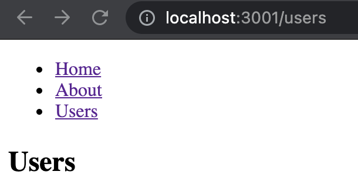
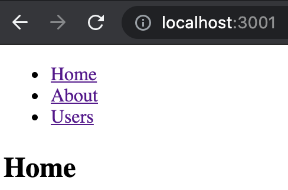
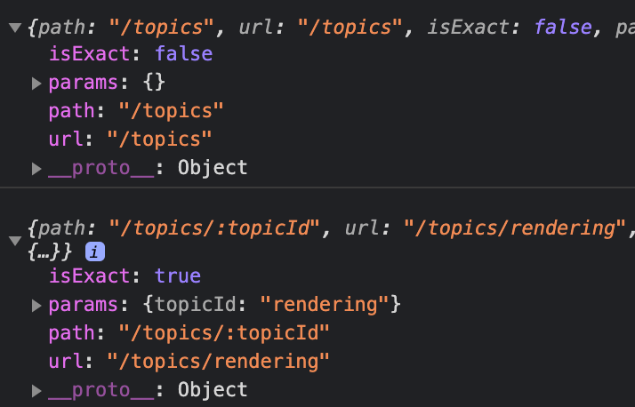

# React Router


## Initial

### start


#### install：

```bash
npm install react-router-dom
```


#### 简单示例：

<iframe height="257" style="width: 100%;" scrolling="no" title="" src="https://codepen.io/shanxiansen310/embed/YzVEyMo?default-tab=html%2Cresult" frameborder="no" loading="lazy" allowtransparency="true" allowfullscreen="true">
  See the Pen <a href="https://codepen.io/shanxiansen310/pen/YzVEyMo">
  </a> by shanxiansen310 (<a href="https://codepen.io/shanxiansen310">@shanxiansen310</a>)
  on <a href="https://codepen.io">CodePen</a>.
</iframe>

这里不是太明显，如果是在网页上的话会发现URL也会跟着变化：

            


```jsx
import React from "react";
import {
  BrowserRouter as Router,
  Switch,
  Route,
  Link
} from "react-router-dom";

// This site has 3 pages, all of which are rendered
// dynamically in the browser (not server rendered).
//
// Although the page does not ever refresh, notice how
// React Router keeps the URL up to date as you navigate
// through the site. This preserves the browser history,
// making sure things like the back button and bookmarks
// work properly.

export default function BasicExample() {
  return (
    <Router>
      <div>
        <ul>
          <li>
            <Link to="/">Home</Link>
          </li>
          <li>
            <Link to="/about">About</Link>
          </li>
          <li>
            <Link to="/dashboard">Dashboard</Link>
          </li>
        </ul>

        <hr />

        {/*
          A <Switch> looks through all its children <Route>
          elements and renders the first one whose path
          matches the current URL. Use a <Switch> any time
          you have multiple routes, but you want only one
          of them to render at a time
        */}
        <Switch>
          <Route exact path="/">
            <Home />
          </Route>
          <Route path="/about">
            <About />
          </Route>
          <Route path="/dashboard">
            <Dashboard />
          </Route>
        </Switch>
      </div>
    </Router>
  );
}

// You can think of these components as "pages"
// in your app.

function Home() {
  return (
    <div>
      <h2>Home</h2>
    </div>
  );
}

function About() {
  return (
    <div>
      <h2>About</h2>
    </div>
  );
}

function Dashboard() {
  return (
    <div>
      <h2>Dashboard</h2>
    </div>
  );
}

```


#### History <span id='history'></span>

本文档中的 “history” 以及 “`history`对象”指的是 [`history` 包](https://github.com/ReactTraining/history)中的内容，该包是 React Router 仅有的两大主要依赖之一（除去 React 本身），在不同的 Javascript 环境中，它提供多种不同的形式来实现对 session 历史的管理。

我们也会使用以下术语：

- “browser history” - 在特定 DOM 上的实现，使用于支持 HTML5 history API 的 web 浏览器中
- “hash history” - 在特定 DOM 上的实现，使用于旧版本的 web 浏览器中
- “memory history” - 在内存中的 history 实现，使用于测试或者非 DOM 环境中，例如 React Native


`history` 对象通常会具有以下属性和方法：

- `length` - (number 类型) history 堆栈的条目数
- `action` - (string 类型) 当前的操作(`PUSH`, `REPLACE`, `POP`)
-  `location`\- (object 类型) 当前的位置。location 会具有以下属性：
  - `pathname` - (string 类型) URL 路径
  - `search` - (string 类型) URL 中的查询字符串
  - `hash` - (string 类型) URL 的哈希片段
  - `state` - (object 类型) 提供给例如使用 `push(path, state)` 操作将 location 放入堆栈时的特定 location 状态。只在浏览器和内存历史中可用。
- `push(path, [state])` - (function 类型) 在 history 堆栈添加一个新条目
- `replace(path, [state])` - (function 类型) 替换在 history 堆栈中的当前条目
- `go(n)` - (function 类型) 将 history 堆栈中的指针调整 `n`
- `goBack()` - (function 类型) 等同于 `go(-1)`
- `goForward()` - (function 类型) 等同于 `go(1)`
- `block(prompt)` - (function 类型) 阻止跳转。(详见 [history 文档](https://github.com/ReactTraining/history#blocking-transitions))。


⚠️

**[history 是可变的](https://react-router.docschina.org/web/api/history/history)**

history 对象是可变的，因此我们建议从 [``](https://react-router.docschina.org/web/api/Route) 的渲染选项中来访问 [`location`](https://react-router.docschina.org/web/api/location)，而不是从 `history.location` 直接获取。这样做可以保证 React 在生命周期中的钩子函数正常执行，例如：

```jsx
class Comp extends React.Component {
  componentWillReceiveProps(nextProps) {
    // locationChanged 将为 true
    const locationChanged = nextProps.location !== this.props.location

    // INCORRECT，因为 history 是可变的所以 locationChanged 将一直为 false
    const locationChanged = nextProps.history.location !== this.props.history.location
  }
}

<Route component={Comp}/>
```


### Basic Components


React Router 中有三种类型的组件： router components, route matching components，和 navigation components。


在 Web 应用程序中使用的所有组件都应该从 react-router-dom 中导入。

```js
import { BrowserRouter, Route, Link } from "react-router-dom";
```


#### [路由](https://react-router.docschina.org/web/guides/basic-components/)

每个 React Router 应用程序的核心应该是一个 router 组件。对于 Web 项目，`react-router-dom` 提供了 `<BrowserRouter>` 和 `<HashRouter>` 路由。这两个路由都会为你创建一个专门的 `history` 对象。一般来说，如果你有一个响应请求的服务器，则你应该使用 `<BrowserRouter>` ，如果你使用的是静态文件的服务器，则应该使用 `<HashRouter>` 。


#### [Route 匹配](https://react-router.docschina.org/web/guides/basic-components/route)

有两个路由匹配组件： `<Route>` 和 `<Switch>` 。

```js
import { Route, Switch } from "react-router-dom";
```

路由匹配是通过比较 `<Route>` 的 `path` 属性和当前地址的 `pathname` 来实现的。当一个 `<Route>` 匹配成功时，它将渲染其内容，当它不匹配时就会渲染 `null`。没有路径的 `<Route>` 将始终被匹配。


`<Switch>` 不是分组 `<Route>` 所必须的，但他通常很有用。 一个 `<Switch>` 会遍历其所有的子 `<Route>` 元素，并<span style='color:red;'>仅渲染与当前地址匹配的第一个元素。</span>这有助于多个路由的路径匹配相同的路径名，当动画在路由之间过渡，且没有路由与当前地址匹配（所以你可以渲染一个 “404” 组件）。

```jsx
<Switch>
  <Route exact path="/" component={Home} />
  <Route path="/about">
    <About />
  </Route>
  <Route path="/contact" component={Contact} />
  {/* when none of the above match, <NoMatch> will be rendered */}
  <Route component={NoMatch} />
</Switch>
```


#### 路由渲染属性

- [match](https://react-router.docschina.org/web/api/match)
- [location](https://react-router.docschina.org/web/api/location)
- [history](https://react-router.docschina.org/web/api/history)

`component` 应该在你想渲染现存组件时使用 （ `React.Component` 或一个无状态组件）。`render`，只有在必须将范围内的变量传递给要渲染的组件时才能使用。你不应该使用具有内联函数的 `component` 属性来传递范围内的变量，因为你将要不必要的卸载/重载组件（component每次加载时都会渲染一个新的组件）

```jsx
const Home = () => <div>Home</div>;

const App = () => {
  const someVariable = true;

  return (
    <Switch>
      {/* these are good */}
      <Route exact path="/" component={Home} />
      <Route
        path="/about"
        render={props => <About {...props} extra={someVariable} />}
      />
      {/* do not do this */}
      <Route
        path="/contact"
        component={props => <Contact {...props} extra={someVariable} />}
      />
    </Switch>
  );
};
```


#### [导航](https://react-router.docschina.org/web/guides/basic-components/)

React Router 提供了一个 `<Link>` 组件来在你的应用程序中创建链接。无论你在何处渲染一个 `<Link>` ，都会在应用程序的 HTML 中渲染锚 （`<a>`）。

```jsx
<Link to="/">Home</Link>
// <a href='/'>Home</a>
```


`<NavLink>` 是一种特殊类型的 `<Link>` 当它的 `to` 属性与当前地址匹配时，可以将其定义为“活跃的”。

```jsx
// location = { pathname: '/react' }
<NavLink to="/react" activeClassName="hurray">
  React
</NavLink>
// <a href='/react' className='hurray'>React</a>
```

当你想强制导航时，你可以渲染一个 `<Redirect>`。当一个 `<Redirect>` 渲染时，它将使用它的 `to` 属性进行定向。

```jsx
<Redirect to="/login" />
```


### Tips


#### 1.Switch和Route


Switch：只渲染第一个子节点

```jsx
import { Route } from "react-router";

let routes = (
  <div>
    <Route path="/about">
      <About />
    </Route>
    <Route path="/:user">
      <User />
    </Route>
    <Route>
      <NoMatch />
    </Route>
  </div>
);
```

If the URL is `/about`, then `<About>`, `<User>`, and `<NoMatch>` will all render because they all match the path. This is by design, allowing us to compose `<Route>`s into our apps in many ways, like sidebars and breadcrumbs, bootstrap tabs, etc.

❗️:user是把path作为了参数，因此能够匹配 ‘/about’，此时参数user就是about

```jsx
let routes = (
  <Switch>
    <Route exact path="/">
      <Home />
    </Route>
    <Route path="/about">
      <About />
    </Route>
    <Route path="/:user">
      <User />
    </Route>
    <Route>
      <NoMatch />
    </Route>
  </Switch>
);
```

Now, if we’re at `/about`, `<Switch>` will start looking for a matching `<Route>`. `<Route path="/about"/>` will match and `<Switch>` will stop looking for matches and render `<About>`. Similarly, if we’re at `/michael` then `<User>` will render.


## Example


#### Basic 

<span id='ex-basic'></span>

<iframe height="386" style="width: 100%;" scrolling="no" title="basic_react-router" src="https://codepen.io/shanxiansen310/embed/KKmZwXy?default-tab=html%2Cresult" frameborder="no" loading="lazy" allowtransparency="true" allowfullscreen="true">
  See the Pen <a href="https://codepen.io/shanxiansen310/pen/KKmZwXy">
  basic_react-router</a> by shanxiansen310 (<a href="https://codepen.io/shanxiansen310">@shanxiansen310</a>)
  on <a href="https://codepen.io">CodePen</a>.
</iframe>

```jsx
import React from "react";
import { BrowserRouter as Router, Route, Link } from "react-router-dom";

const BasicExample = () => (
  <Router>
    <div>
      <ul>
        <li>
          <Link to="/">Home</Link>
        </li>
        <li>
          <Link to="/about">About</Link>
        </li>
        <li>
          <Link to="/topics">Topics</Link>
        </li>
      </ul>

      <hr />

      <Route exact path="/" component={Home} />
      <Route path="/about" component={About} />
      <Route path="/topics" component={Topics} />
    </div>
  </Router>
);

const Home = () => (
  <div>
    <h2>Home</h2>
  </div>
);

const About = () => (
  <div>
    <h2>About</h2>
  </div>
);

const Topics = ({ match }) => (
  <div>
    <h2>Topics</h2>
    <ul>
      <li>
        <Link to={`${match.url}/rendering`}>Rendering with React</Link>
      </li>
      <li>
        <Link to={`${match.url}/components`}>Components</Link>
      </li>
      <li>
        <Link to={`${match.url}/props-v-state`}>Props v. State</Link>
      </li>
    </ul>

    <Route path={`${match.url}/:topicId`} component={Topic} />
    <Route
      exact
      path={match.url}
      render={() => <h3>Please select a topic.</h3>}
    />
  </div>
);

const Topic = ({ match }) => (
  <div>
    <h3>{match.params.topicId}</h3>
  </div>
);

export default BasicExample;
```


## API


### \<Route\> 

有三种渲染方法


- [`Route Component`](https://react-router.docschina.org/web/api/Route/component)
- [`Route Render`](https://react-router.docschina.org/web/api/Route/render-func)
- [`Route Children`](https://react-router.docschina.org/web/api/Route/children-func)


#### [Route props](https://react-router.docschina.org/web/api/Route/route-props)

所有三种渲染方法都有相同的三个 Route 属性。

- [match](https://react-router.docschina.org/web/api/match)
- [location](https://react-router.docschina.org/web/api/location)
- [history](https://react-router.docschina.org/web/api/history)


##### match


一个 `match` 对象中包涵了有关如何匹配 URL 的信息。`match` 对象中包涵以下属性：

- `params` - (object) key／value 与动态路径的 URL 对应解析

- `isExact` - (boolean)  如果`true`则匹配整个 URL （没有结尾字符）

  When `true`, will only match if the path matches the `location.pathname` *exactly*

  ```jsx
  <Route exact path="/one">
    <About />
  </Route>
  ```

  |  path  | location.pathname |  exact  | matches? |
  | :----: | :---------------: | :-----: | :------: |
  | `/one` |    `/one/two`     | `true`  |    no    |
  | `/one` |    `/one/two`     | `false` |   yes    |


- `path` - (string) 用于匹配的路径模式。被嵌套在 `<Route>` 中使用

  ★如果没有path的话匹配所有页面！

  ```jsx
  <Route path="/users/:id">
    <User />
  </Route>
  <Route path={["/users/:id", "/profile/:id"]}>
    <User />
  </Route>
  ```


- `url` - (string) 用于匹配部分的 URL 。被嵌套在 `<Link>` 中使用。这里指的是真实的不带参数的地址


示例

代码可以查看 [basic](#ex-basic)，这里我们选择打印一下 match

 

params就是动态参数  `:key`

path就是Route标签里的path

url是动态参数转化后的path


##### location


location 代表应用程序现在在哪，你想让它去哪，或者甚至它曾经在哪，它看起来就像：

```js
{
  key: 'ac3df4', // not with HashHistory!
  pathname: '/somewhere'
  search: '?some=search-string',
  hash: '#howdy',
  state: {
    [userDefined]: true
  }
}
```


##### [History](#history)


#### 渲染方法


##### component

只有当位置匹配时才会渲染的 `React` 组件。

```jsx
<Route path="/user/:username" component={User}/>

const User = ({ match }) => {
  return <h1>Hello {match.params.username}!</h1>
}
```

当您使用 `component`（而不是 `render` 或 `children` ）Route 使用从给定组件 [`React.createElement`](https://facebook.github.io/react/docs/react-api.html#createelement) 创建新的 [React element](https://facebook.github.io/react/docs/rendering-elements.html)。这意味着，如果您为 `component` 道具提供了内联功能，则每次渲染都会创建一个新组件。这会导致现有组件卸载和安装新组件，而不是仅更新现有组件。当使用内联函数进行内联渲染时，使用 `render` 或者 `children`


##### render: func

This allows for convenient inline rendering and wrapping without the undesired remounting explained above.

您可以传递一个在位置匹配时调用的函数，而不是创建新的 [React element](https://facebook.github.io/react/docs/rendering-elements.html) [`component`](https://github.com/songda1013/react-router.cn/blob/cn/packages/react-router/docs/api/Route.md#component)，该 `render` 属性接收所有相同的 [route props](https://github.com/songda1013/react-router.cn/blob/cn/packages/react-router/docs/api/Route.md#route-props) (match, location and history)的 `component` 渲染属性。

```jsx
// convenient inline rendering
<Route path="/home" render={() => <div>Home</div>}/>

// wrapping/composing
const FadingRoute = ({ component: Component, ...rest }) => (
  <Route {...rest} render={props => (
    <FadeIn>
      <Component {...props}/>
    </FadeIn>
  )}/>
)

<FadingRoute path="/cool" component={Something}/>
```


##### children: func

Sometimes you need to render whether the path matches the location or not. In these cases, you can use the function `children` prop. It works exactly like `render` except that it gets called whether there is a match or not.

有时你需要由路径来决定是否渲染。在这些情况下，您可以使用函数 `children` 属性，它的工作原理与渲染完全一样，不同之处在于它是否存在匹配。

`children` 渲染道具接收所有相同的 [route props](https://github.com/songda1013/react-router.cn/blob/cn/packages/react-router/docs/api/Route.md#route-props) 作为 `component` 和 `render` 方法，如果 Route 与 URL 不匹配，`match` 则为 `null` ，这允许你动态调整你的 UI 界面，基于路线是否匹配，如果路线匹配我们则添加一个 `active` 类

```jsx
<ul>
  <ListItemLink to="/somewhere"/>
  <ListItemLink to="/somewhere-else"/>
</ul>

const ListItemLink = ({ to, ...rest }) => (
  <Route path={to} children={({ match }) => (
    <li className={match ? 'active' : ''}>
      <Link to={to} {...rest}/>
    </li>
  )}/>
)
```


**🚨警告：**`<Route component>` 和 `<Route render>` 优先于 `<Route children>` ，因此不要在同一个 `<Route>` 中使用多个。


