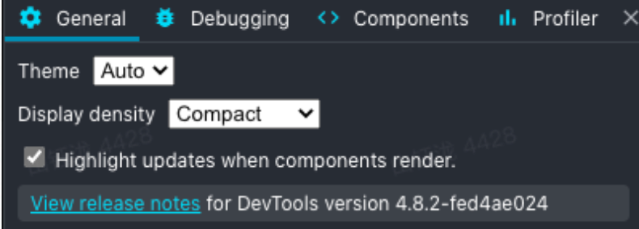

# React-Tools


记录一些react学习中用到的库或者工具。


## Tools


#### React Developer Tools


##### 设置


**general设置**

 


General 面板中最重要的功能就是 **"Highlight updates when components render"**。勾选上之后，可以查看 React 重绘时，页面哪些部分有更新。在遇到性能问题时，可以快速帮助决策在哪部分不需要重绘的组件部分添加 React.memo 阻止重绘。


Debugging 设置

 )

**"Append components stacks to console warnings and errors."**

可以帮助我们定位 React 报错信息来自哪个组件


Components 设置

 -20210810154431946.(null))

**"Hide components where..."**

此项在过滤组件树时有用。比如，大多数应用可能会在顶层有很多 Context.Provider，就可以过滤 Context 类型、不显示。当我们只关心业务逻辑层的组件时，可以过滤掉 DOM 组件，减少树的节点


##### Profiler 设置

 -20210810154448772.(null))

**"Record why each component rendered while profiling"**

-20210810154448972.(null))-20210810154448863.(null))

勾选之后会在渲染火焰图的 hover 面板中看到 **"Why did this render"**。

现在有哪些 render 原因呢？

1. Props changed

​     顾名思义，传入组件的 props 变更

2. The parent component rendered

   父组件渲染导致的子组件渲染。一般要做性能优化都是找这类重绘原因的组件。但是要注意，如果组件中有用到 useContext，Provider 的 value 变更导致的重绘也是被标记为 The parent component rendered，需要注意

3. Hooks changed

   Hook 状态变更导致的重绘，一般就是指 useState 返回的更新函数被调用了


##### React组件监视器


用法和 DevTools 的元素面板类似，可以直接在页面上定位到元素对应的 React Component。并且可以实时查看当前组件内部的 hooks 状态，返回的组件树

-20210810154728194.(null))


★ useDebugValue在对应的hook中使用！ 会在右边的hooks下对应的hook处显示信息！


右上角的四个图标

 

分别作用如下：

- 模拟 ReactLazy 懒加载组件 Suspense 状态
- 定位组件所渲染的 DOM 节点
- 在 Console 中打印 Component 内部状态
- 跳转到组件所在源文件（配合 sourcemap）


##### React性能分析面板


Profiling 面板如下图：

-20210810155332446.(null))

Toolbar 部分的功能和 Chrome dev tools 的 performance panel 一模一样，分别是开始录制、刷新页面并录制、清除记录、加载 Profiling 数据、下载 Profiling 数据。

#### Flamegraph

-20210810155332421.(null))

查看组件层级的耗时及关联层级、累加关系。颜色深浅代表耗时长短，是一个相对的着色，跟具体耗时没关系（比如，0.1ms 可能是黄色，16ms 可能是绿色，具体要看最长耗时的度量是多少）


## Libraries

#### Classnames


Link：[JedWatson/classnames: A simple javascript utility for conditionally joining classNames together (github.com)](https://github.com/JedWatson/classnames)


Install：

```bash
# via npm
npm install classnames
```


如果我们需要在ts中使用，那么需要安装 @types

有些库可能TS不支持,我们无法直接在TS中使用, 此时则需要通过npm安装类型声明文件 

[@types 官方声明文件库](https://github.com/DefinitelyTyped/DefinitelyTyped/)   [@types 搜索声明库](https://microsoft.github.io/TypeSearch/)

> 比如 :  npm install --save @types/node

🌟@types包在编译的时候都会被包含进去  (`node_modules/@types`)


Usage:


```js
classNames('foo', 'bar'); // => 'foo bar'
classNames('foo', { bar: true }); // => 'foo bar'
classNames({ 'foo-bar': true }); // => 'foo-bar'
classNames({ 'foo-bar': false }); // => ''
classNames({ foo: true }, { bar: true }); // => 'foo bar'
classNames({ foo: true, bar: true }); // => 'foo bar'

// lots of arguments of various types
classNames('foo', { bar: true, duck: false }, 'baz', { quux: true }); // => 'foo bar baz quux'

// other falsy values are just ignored
classNames(null, false, 'bar', undefined, 0, 1, { baz: null }, ''); // => 'bar 1'

```

#### 

Arrays will be recursively flattened as per the rules above:

```js
var arr = ['b', { c: true, d: false }];
classNames('a', arr); // => 'a b c'
```


Dynamic class names with ES2015

If you're in an environment that supports [computed keys](https://www.ecma-international.org/ecma-262/6.0/#sec-object-initializer) (available in ES2015 and Babel) you can use dynamic class names:

```js
let buttonType = 'primary';
classNames({ [`btn-${buttonType}`]: true });
```


Use in React

```jsx
var classNames = require('classnames');

class Button extends React.Component {
  // ...
  render () {
    var btnClass = classNames({
      btn: true,
      'btn-pressed': this.state.isPressed,
      'btn-over': !this.state.isPressed && this.state.isHovered
    });
    return <button className={btnClass}>{this.props.label}</button>;
  }
}
```


Because you can mix together object, array and string arguments, supporting optional `className` props is also simpler as only truthy arguments get included in the result:

```jsx
var btnClass = classNames('btn', this.props.className, {
  'btn-pressed': this.state.isPressed,
  'btn-over': !this.state.isPressed && this.state.isHovered
});
```


## Tips


### px ➡️ rem


DOU+项目转换

```scss
@function rem($px) {
  @return ($px / 100px) * 2rem;
}
```


