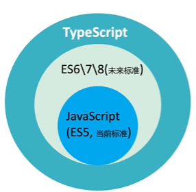
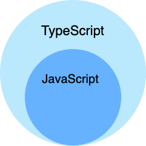
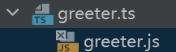
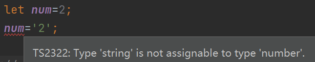
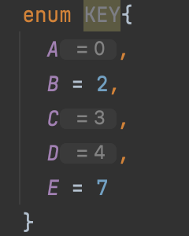
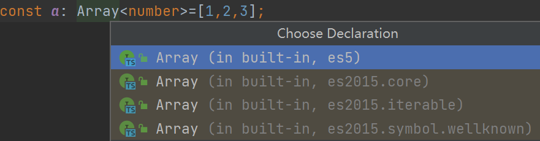

# **TypeScript**学习


### 什么是TypeScript?

 


❗TypeScript无法在浏览器中运行

#### 语言特性

TypeScript 是一种给 JavaScript 添加特性的语言扩展。增加的功能包括：

- 类型批注和编译时类型检查
- 类型推断
- 类型擦除
- 接口
- 枚举
- Mixin
- 泛型编程
- 名字空间
- 元组
- Await

#### JavaScript 与 TypeScript 的区别

TypeScript 是 JavaScript 的超集，扩展了 JavaScript 的语法，因此现有的 JavaScript 代码可与 TypeScript 一起工作无需任何修改，TypeScript 通过类型注解提供编译时的静态类型检查。

TypeScript 可处理已有的 JavaScript 代码，并只对其中的 TypeScript 代码进行编译。

                         


### Quick Start

#### 安装

>npm i -g typescript


★同时也建议将ts-node安装上!  [ts-node - npm (npmjs.com)](https://www.npmjs.com/package/ts-node)  安装它的原因是typescript自带的tsc命令并不能直接运行typescript代码。但值得注意的是 ts-node 并不等于 typescript 的 Node.js ，仅仅封装了 typescript 的编译过程，提供直接运行typescript代码的能力。

##### 1.全局安装ts-node

> npm i -g ts-node


##### 2.配置ts-node环境变量

★要想配置环境变量，我们首先要清楚 npm 全局安装 ts-node 的位置

npm config get prefix

经过上面的语句我们可以知道 npm 全局安装 ts-node 的位置，接下来就是配置为环境变量：

- 桌面“此电脑”右键点击“属性”
- 窗口左侧列表点击“高级系统设置”
- 新窗口点击下方“环境变量”
- “系统变量”选择“Path”，点击“编辑”
- 点击“新建”，将1中得到的路径复制进去，点击保存
- 重启计算机


3.控制台   ts-node  xxx.ts

如果出现bug  `Cannot find module '@types/node/package.json'`  则需要安装 [@types/node](https://www.npmjs.com/package/@types/node)

> npm install --save @types/node

This package contains type definitions for Node.js, 就是让node直到TypeScript中的那些类型！


#### 第一个文件

建立typescript文件, 以 .ts 结尾

```typescript
function greeter(person:   string) {
  return "Hello, " + person;
}

let user = "Jane User";
greeter(user);
```


#### 编译代码

在命令行上，运行TypeScript编译器：

> tsc greeter.ts


❗这仅仅是编译，不会运行哦！  **这个命令的结果是将ts文件编译成js文件并且会生成一个js文件**

 

greeter.js

```js
function greeter(person) {
  return "Hello, " + person;
}
var user = "Jane User";
greeter(user);
```


此时用IDE运行js文件即可！


如果想要直接运行ts，可以使用 ts-node

```bash
npm install -g ts-node
ts-node foo.ts
```


#### **类型注解**

**type annotation**

TypeScript里的类型注解是一种轻量级的为函数或变量添加约束的方式。 在这个例子里，我们希望 `greeter`函数接收一个字符串参数。 如果我们给greeter传入其它类型的参数就会报错!

🌟**不过尽管有错误，`greeter.js`文件还是会被创建**。 就算你的代码里有错误，你仍然可以使用TypeScript。但在这种情况下，TypeScript会警告你代码可能不会按预期执行。


#### Interfaces


这里我们使用接口来描述一个拥有`firstName`和`lastName`字段的对象。 **在TypeScript里，只要两个类型内部的结构兼容那么这两个类型就是兼容的。** 这就允许我们在实现接口时候只要保证==包含==了接口要求的结构就可以，而不必明确地使用 `implements`语句。

greeter.ts

```ts
interface Person {
  firstName: string;
  lastName: string;
}

function greeter(person: Person) {
  return "Hello, " + person.firstName + " " + person.lastName;
}

let user = {firstName: "Jane", lastName: "User",age:12};

console.log(greeter(user));
```


greeter.js

```js
function greeter(person) {
  return "Hello, " + person.firstName + " " + person.lastName;
}
var user = { firstName: "Jane", lastName: "User", age: 12 };
console.log(greeter(user));
```


#### Classes

TypeScript支持JavaScript的新特性，比如支持基于类的面向对象编程。

让我们创建一个`Student`类，它带有一个构造函数和一些公共字段。 注意类和接口可以一起共作，程序员可以自行决定抽象的级别。

🌟还要注意的是，**在构造函数的参数上使用`public`等同于创建了同名的成员变量**。

greeter.ts

```js
class Student {
  fullName: string;
  constructor(public firstName, public middleInitial, public lastName) {
    this.fullName = firstName + " " + middleInitial + " " + lastName;
  }
}

interface Person {
  firstName: string;
  lastName: string;
}

function greeter(person : Person) {
  return "Hello, " + person.firstName + " " + person.lastName;
}

let user = new Student("Jane", "M.", "User");
console.log(greeter(user));
```


greeter.js

```js
var Student = /** @class */ (function () {
    function Student(firstName, middleInitial, lastName) {
        this.firstName = firstName;
        this.middleInitial = middleInitial;
        this.lastName = lastName;
        this.fullName = firstName + " " + middleInitial + " " + lastName;
    }
    return Student;
}());
function greeter(person) {
    return "Hello, " + person.firstName + " " + person.lastName;
}
var user = new Student("Jane", "M.", "User");
console.log(greeter(user));
console.log(user.fullName);
```


#### Running

其实就是结合TS编译生成的js文件

```html
<!DOCTYPE html>
<html>
    <head><title>TypeScript Greeter</title></head>
    <body>
        <script src="greeter.js"></script>
    </body>
</html>
```


#### 声明文件 .d.ts

当使用第三方库时，我们需要引用它的声明文件，才能获得对应的代码补全、接口提示等功能。

d.ts大名叫TypeScript Declaration File，存放一些声明，类似于C/C++的.h头文件（#include `<stdio.h>`）：


参考：[声明文件 · TypeScript 入门教程 (xcatliu.com)](https://ts.xcatliu.com/basics/declaration-files#什么是声明语句)

由于本章涉及大量新语法，故在本章开头列出新语法的索引，方便大家在使用这些新语法时能快速查找到对应的讲解：

- [`declare var`](https://ts.xcatliu.com/basics/declaration-files#declare-var) 声明全局变量
- [`declare function`](https://ts.xcatliu.com/basics/declaration-files#declare-function) 声明全局方法
- [`declare class`](https://ts.xcatliu.com/basics/declaration-files#declare-class) 声明全局类
- [`declare enum`](https://ts.xcatliu.com/basics/declaration-files#declare-enum) 声明全局枚举类型
- [`declare namespace`](https://ts.xcatliu.com/basics/declaration-files#declare-namespace) 声明（含有子属性的）全局对象
- [`interface` 和 `type`](https://ts.xcatliu.com/basics/declaration-files#interface-和-type) 声明全局类型
- [`export`](https://ts.xcatliu.com/basics/declaration-files#export) 导出变量
- [`export namespace`](https://ts.xcatliu.com/basics/declaration-files#export-namespace) 导出（含有子属性的）对象
- [`export default`](https://ts.xcatliu.com/basics/declaration-files#export-default) ES6 默认导出
- [`export =`](https://ts.xcatliu.com/basics/declaration-files#export-1) commonjs 导出模块
- [`export as namespace`](https://ts.xcatliu.com/basics/declaration-files#export-as-namespace) UMD 库声明全局变量
- [`declare global`](https://ts.xcatliu.com/basics/declaration-files#declare-global) 扩展全局变量
- [`declare module`](https://ts.xcatliu.com/basics/declaration-files#declare-module) 扩展模块
- [`/// <reference /> `](https://ts.xcatliu.com/basics/declaration-files#san-xie-xian-zhi-ling) 三斜线指令


💎全局变量就是声明了在全部的文件中就可以用了，不需要再 export/import


这里讲一下 npm 导入：

一般我们通过 `import foo from 'foo'` 导入一个 npm 包，这是符合 ES6 模块规范的。

在我们尝试给一个 npm 包创建声明文件之前，需要先看看它的声明文件是否已经存在。一般来说，npm 包的声明文件可能存在于两个地方：

1. 与该 npm 包绑定在一起。判断依据是 `package.json` 中有 `types` 字段，或者有一个 `index.d.ts` 声明文件。这种模式不需要额外安装其他包，是最为推荐的，所以以后我们自己创建 npm 包的时候，最好也将声明文件与 npm 包绑定在一起。
2. 发布到 `@types` 里。我们只需要尝试安装一下对应的 `@types` 包就知道是否存在该声明文件，安装命令是 `npm install @types/foo --save-dev`。这种模式一般是由于 npm 包的维护者没有提供声明文件，所以只能由其他人将声明文件发布到 `@types` 里了。

假如以上两种方式都没有找到对应的声明文件，那么我们就需要自己为它写声明文件了。由于是通过 `import` 语句导入的模块，所以声明文件存放的位置也有所约束，一般有两种方案：

1. 创建一个 `node_modules/@types/foo/index.d.ts` 文件，存放 `foo` 模块的声明文件。这种方式不需要额外的配置，但是 `node_modules` 目录不稳定，代码也没有被保存到仓库中，无法回溯版本，有不小心被删除的风险，故不太建议用这种方案，一般只用作临时测试。
2. 创建一个 `types` 目录，专门用来管理自己写的声明文件，将 `foo` 的声明文件放到 `types/foo/index.d.ts` 中。这种方式需要配置下 `tsconfig.json` 中的 `paths` 和 `baseUrl` 字段。


❗️不过在DOU+项目中一般都是直接在对应文件夹下直接建立同名的 `d.ts` 文件

目录结构：

```autoit
/path/to/project
├── src
|  └── index.ts
├── types
|  └── foo
|     └── index.d.ts
└── tsconfig.json
```

`tsconfig.json` 内容：

```json
{
    "compilerOptions": {
        "module": "commonjs",
        "baseUrl": "./",
        "paths": {
            "*": ["types/*"]
        }
    }
}
```

如此配置之后，通过 `import` 导入 `foo` 的时候，也会去 `types` 目录下寻找对应的模块的声明文件了。


##### 如何编写一个 d.ts 文件？

参考：[如何编写一个d.ts文件 - SegmentFault 思否](https://segmentfault.com/a/1190000009247663)

总结一下：
从类型`type`角度分为：基本类型（string、number、boolean等）及其混合；复杂类型（class、function、object）及其混合（比如说又是class又是function）。
从代码有效范围分为：全局变量、模块变量和又是全局变量又是模块变量的。
从定义文件来说：自己写的`.d.ts`文件和扩展别人写的`.d.ts`文件。
以上三个角度，应该覆盖了描述文件的各个方面了。


简要选取几个：

###### 模块化的全局变量

这个是怎么回事呢，就是有时候我们定义全局变量的时候需要引入(别人写的)文件，比如这样的，我想声明个全局变量req：

 

由于我们当前的d.ts文件使用了import/export语法，那么ts编译器就不把我们通过`declare var xxx:yyy`当成了全局变量了，那么我们就需要通过以下的方式声明全局变量：

```tsx
import { Request,Response} from 'express'

declare global {
  const req: Request
  const res: Response

  namespace OOO {
    const a:number
  }
}
```


###### d.ts文件位置

如果是模块化的话那就放到和源码（A.js）文件同一个目录下，如果是全局变量的话理论上放到哪里都可以————当然除非你在tsconfig.json 文件里面特殊配置过。


### 基础类型

| 数据类型   | 关键字    | 描述                                                         |
| :--------- | :-------- | :----------------------------------------------------------- |
| 任意类型   | any       | 声明为 any 的变量可以赋予任意类型的值。                      |
| 数字类型   | number    | 双精度 64 位浮点值。它可以用来表示整数和分数。`let binaryLiteral: number = 0b1010; // 二进制 let octalLiteral: number = 0o744;    // 八进制 let decLiteral: number = 6;    // 十进制 let hexLiteral: number = 0xf00d;    // 十六进制` |
| 字符串类型 | string    | 一个字符系列，使用单引号（**'**）或双引号（**"**）来表示字符串类型。反引号（**`**）来定义多行文本和内嵌表达式。`let name: string = "Runoob"; let years: number = 5; let words: string = `您好，今年是 ${ name } 发布 ${ years + 1} 周年`;` |
| 布尔类型   | boolean   | 表示逻辑值：true 和 false。`let flag: boolean = true;`       |
| 数组类型   | 无        | 声明变量为数组。`// 在元素类型后面加上[] let arr: number[] = [1, 2]; // 或者使用数组泛型 let arr: Array<number> = [1, 2];` |
| 元组       | 无        | 元组类型用来表示已知元素数量和类型的数组，各元素的类型不必相同，对应位置的类型需要相同。`let x: [string, number]; x = ['Runoob', 1];    // 运行正常 x = [1, 'Runoob'];    // 报错 console.log(x[0]);    // 输出 Runoob` |
| 枚举       | enum      | 枚举类型用于定义数值集合。`enum Color {Red, Green, Blue}; let c: Color = Color.Blue; console.log(c);    // 输出 2` |
| void       | void      | 用于标识方法返回值的类型，表示该方法没有返回值。`function hello(): void {    alert("Hello Runoob"); }` |
| null       | null      | 表示对象值缺失。                                             |
| undefined  | undefined | 用于初始化变量为一个未定义的值                               |
| never      | never     | never 是其它类型（包括 null 和 undefined）的子类型，代表从不会出现的值。 |

**注意：**TypeScript 和 JavaScript 没有整数类型。


Javascript 类型分类：

原始数据类型 - primitive values：

- Boolean
- Null
- Undefined
- Number
- BigInt
- String
- Symbol


其在TypeScript中的体现:

```js
let isDone: boolean = false

// 接下来来到 number，注意 es6 还支持2进制和8进制，让我们来感受下

let age: number = 10
let binaryNumber: number = 0b1111

// 之后是字符串，注意es6新增的模版字符串也是没有问题的
let firstName: string = 'viking'
let message: string = `Hello, ${firstName}, age is ${age}`

// 还有就是两个奇葩兄弟两，undefined 和 null
let u: undefined = undefined
let n: null = null

// 注意 undefined 和 null 是所有类型的子类型。也就是说 undefined 类型的变量，可以赋值给 number 类型的变量：
let num: number = undefined
```


**any类型**: 传入任何值都可以, 和js没区别

```javascript
let notSure: any = 4
notSure = 'maybe it is a string'
notSure = 'boolean'
// 在任意值上访问任何属性都是允许的：
notSure.myName
// 也允许调用任何方法：
notSure.getName()
```


**Type Inference**

Wherever possible, TypeScript tries to automatically *infer* the types in your code. For the most part you don’t need to explicitly learn the rules of inference. If you’re starting out, try using fewer type annotations than you think.

意思就是TypeScript会自动识别类型, 如果很确定某种变量的类型, 不加也可以!

 


#### **Array** : 

 /əˈreɪ/

way1:可以在元素类型后面接上 `[]`，表示由此类型元素组成的一个数组：

```javascript
//最简单的方法是使用「类型 + 方括号」来表示数组：
let arrOfNumbers: number[] = [1, 2, 3, 4]
//数组的项中不允许出现其他的类型：
//数组的一些方法的参数也会根据数组在定义时约定的类型进行限制：
arrOfNumbers.push(3)
arrOfNumbers.push('abc')
```


way2:

第二种方式是使用数组泛型，`Array<元素类型>`：

```js
let list: Array<number> = [1, 2, 3];
```


#### Tuple :

/ˈtʌpəl/

元组类型允许表示一个==已知元素数量和类型==的数组，各元素的类型不必相同。 比如，你可以定义一对值分别为 `string`和`number`类型的元组。

```js
// Declare a tuple type
let x: [string, number];
// Initialize it
x = ['hello', 10]; // OK
// Initialize it incorrectly
x = [10, 'hello']; // Error
```

多写一项或者少些一项也会出错! ❌


#### Interface :

Duck Typing 概念：

> 如果某个东西长得像鸭子，像鸭子一样游泳，像鸭子一样嘎嘎叫，那它就可以被看成是一只鸭子。

```ts
// 我们定义了一个接口 Person
interface Person {
  name: string;
  age: number;
}
// 接着定义了一个变量 viking，它的类型是 Person。这样，我们就约束了 viking 的形状必须和接口 Person 一致。
let viking: Person ={
  name: 'viking',
  age: 20
}

//有时我们希望不要完全匹配一个形状，那么可以用可选属性：
interface Person {
  name: string;
  age?: number;
}
let viking: Person = {
  name: 'Viking'
}

//接下来还有只读属性，有时候我们希望对象中的一些字段只能在创建的时候被赋值，那么可以用 readonly 定义只读属性

interface Person {
  readonly id: number;
  name: string;
  age?: number;
}
viking.id = 9527
```

 <span style=" color:red;">readonly</span>

string, number等也可以看作是一个interface


▼定义任意属性： （参考：[对象的类型——接口 ](https://ts.xcatliu.com/basics/type-of-object-interfaces.html)）

有时候我们希望一个接口允许有任意的属性，可以使用如下方式：

```ts
interface Person {
    name: string;
    age?: number;
    [propName: string]: any;
}

let tom: Person = {
    name: 'Tom',
    gender: 'male'
};
```

使用 `[propName: string]` 定义了任意属性取 `string` 类型的值。


⚠️

需要注意的是，**一旦定义了任意属性，那么确定属性和可选属性的类型都必须是它的类型的子集**：

```ts
interface Person {
    name: string;
    age?: number;
    [propName: string]: string;
}

let tom: Person = {
    name: 'Tom',
    age: 25,
    gender: 'male'
};

// index.ts(3,5): error TS2411: Property 'age' of type 'number' is not assignable to string index type 'string'.
// index.ts(7,5): error TS2322: Type '{ [x: string]: string | number; name: string; age: number; gender: string; }' is not assignable to type 'Person'.
//   Index signatures are incompatible.
//     Type 'string | number' is not assignable to type 'string'.
//       Type 'number' is not assignable to type 'string'.
```

上例中，任意属性的值允许是 `string`，但是可选属性 `age` 的值却是 `number`，`number` 不是 `string` 的子属性，所以报错了。


▼Interface可以继承:

```ts
interface Animal {
  name: string
}

interface Bear extends Animal {
  honey: boolean
}

const winnie:Bear={
  name:'winnie the pooh',
  honey:false
}
```


▼Interface可以添加新属性:

```ts
interface Animal {
  name: string
}

interface Bear extends Animal {
  honey: boolean
}
interface Bear{
  age:number;
}
const winnie:Bear={
  name:'winnie the pooh',
  honey:false,
  age:13
}
```


在4.2版本, 微软推出了type alias,  而type alias与interface相比的区别就是不能继承和新增属性

👉 [Type Aliases](https://www.typescriptlang.org/docs/handbook/2/everyday-types.html#type-aliases)


#### Function :


参数类型声明:

```js
// Parameter type annotation
function greet(name: string) {
  console.log("Hello, " + name.toUpperCase() + "!!");
}
```


返回值类型声明:

```js
//Return type annotations appear after the parameter list
function getFavoriteNumber(): number {
  return 26;
}
```

但通常并不需要给出返回值类型声明, 因为TypeScript会自动推测返回值类型!


```javascript
// 可选参数
function add(x: number, y: number, z?: number): number {
  if (typeof z === 'number') {
    return x + y + z
  } else {
    return x + y
  }
}
```


也可以声明函数类型

```javascript
// 函数本身的类型
const add2: (x: number, y: number, z?:number) => number = add

// interface 描述函数类型
const sum = (x: number, y: number) => {
  return x + y
}
interface ISum {
  (x: number, y: number): number
}
const sum2: ISum = sum
```


💎TypeScript中凡是在冒号 : 后面的都是在声明类型, 与实际的代码逻辑没有关系!


#### Union Type :

```js
// 我们只需要用中竖线来分割两个
let numberOrString: number | string 

// 当 TypeScript 不确定一个联合类型的变量到底是哪个类型的时候，我们只能访问此联合类型的所有类型里共有的属性或方法：
numberOrString.length      // 报错, 因为number没有这个属性
numberOrString.toString()  // 正确 number和 string都有这个方法
```


可以使用类型判断来解决上面的问题 :

```js
function printId(id: number | string) {
  if (typeof id === "string") {
    // In this branch, id is of type 'string'
    console.log(id.toUpperCase());
  } else {
    // Here, id is of type 'number'
    console.log(id);
  }
}

function welcomePeople(x: string[] | string) {
  if (Array.isArray(x)) {
    // Here: 'x' is 'string[]'
    console.log("Hello, " + x.join(" and "));
  } else {
    // Here: 'x' is 'string'
    console.log("Welcome lone traveler " + x);
  }
}
```


当然还可以用下面的方法== 类型断言


#### Type Assertion :

这里我们可以用 as 关键字，告诉typescript 编译器，你没法判断我的代码，但是我本人很清楚具体类型

```javascript
function getLength(input: string | number): number {
  const str = input as string
  if (str.length) {
    return str.length
  } else {
    const number = input as number
    return number.toString().length
  }
}
```


For example, if you’re using `document.getElementById`, TypeScript only knows that this will return *some* kind of `HTMLElement`, but you might know that your page will always have an `HTMLCanvasElement` with a given ID.

In this situation, you can use a *type assertion* to specify a more specific type:

```js
const myCanvas = document.getElementById("main_canvas") as HTMLCanvasElement;
```


#### Class :


▼回顾一下类的特点和JS中的类

面向对象编程的三大特点

- **封装（Encapsulation）**：将对数据的操作细节隐藏起来，只暴露对外的接口。外界调用端不需要（也不可能）知道细节，就能通过对外提供的接口来访问该对象，
- **继承（Inheritance）**：子类继承父类，子类除了拥有父类的所有特性外，还有一些更具体的特性。
- **多态（Polymorphism）**：由继承而产生了相关的不同的类，对同一个方法可以有不同的响应。


```javascript
class Animal {
  name: string;
  constructor(name: string) {
    this.name = name
  }
  run() {
    return `${this.name} is running`
  }
}
const snake = new Animal('lily')

// 继承的特性
class Dog extends Animal {
  bark() {
    return `${this.name} is barking`
  }
}

const xiaobao = new Dog('xiaobao')
console.log(xiaobao.run())
console.log(xiaobao.bark())

// 这里我们重写构造函数，注意在子类的构造函数中，必须使用 super 调用父类的方法，要不就会报错。
class Cat extends Animal {
  constructor(name) {
    super(name)
    console.log(this.name)
  }
  run() {
    return 'Meow, ' + super.run()
  }
}
const maomao = new Cat('maomao')
console.log(maomao.run())
```


[类成员的访问修饰符](https://www.typescriptlang.org/docs/handbook/classes.html#public-private-and-protected-modifiers)

- **public** 修饰的属性或方法是公有的，可以在任何地方被访问到，默认所有的属性和方法都是 public 的
- **private** 修饰的属性或方法是私有的，**不能在声明它的类的外部访问**
- **protected** 修饰的属性或方法是受保护的，它和 private 类似，**区别是它在子类中也是允许被访问的**


类与接口: 通过类实现一个接口

```js
interface Radio {
  switchRadio(trigger: boolean): void; 
}
class Car implements Radio {
  switchRadio(trigger) {
    return 123
  }
}
class Cellphone implements Radio {
  switchRadio() {
  }
}
```

❗ 同java一样, implements了一个interface就必须重写对应的method! 不然会报错❌


实现多个接口:

```js
interface Radio {
  switchRadio(trigger: boolean): void;
}
interface Battery {
  checkBatteryStatus(): void;
}

// 要实现多个接口，我们只需要中间用 逗号 隔开即可
class Cellphone implements Radio, Battery {
  switchRadio() {}
  checkBatteryStatus() {}
}
```


也可以采用interface继承的形式

```js
interface RadioWithBattery extends Radio{
  checkBatteryStatus(): void;
}
class Cellphone implements RadioWithBattery {
  switchRadio() {}
  checkBatteryStatus() {}
}
```


#### Enums ：<span id='enums'> </span>

Unlike most TypeScript features, this is *not* a type-level addition to JavaScript but something added to the language and runtime. Because of this, it’s a feature which you should know exists, **but maybe hold off on using unless you are sure.** You can read more about enums in the [Enum reference page](https://www.typescriptlang.org/docs/handbook/enums.html).

```javascript
// 数字枚举，一个数字枚举可以用 enum 这个关键词来定义，我们定义一系列的方向，然后这里面的值，枚举成员会被赋值为从 0 开始递增的数字,
enum Direction {
  Up,
  Down,
  Left,
  Right,
}
console.log(Direction.Up)

// 还有一个神奇的点是这个枚举还做了反向映射
console.log(Direction[0])
```

这里对应的js文件为

```js
var Direction;
(function (Direction) {
    Direction[Direction["Up"] = 0] = "Up";
    Direction[Direction["Down"] = 1] = "Down";
    Direction[Direction["Left"] = 2] = "Left";
    Direction[Direction["Right"] = 3] = "Right";
})(Direction || (Direction = {}));
console.log(Direction.Down);
console.log(Direction[2]);
```

💎可以发现这里采用了双向绑定赋值   Direction["Up"] = 0  返回0 ， 接着Direction[0] = "Up"


```js
// 字符串枚举
enum Direction {
  Up = 'UP',
  Down = 'DOWN',
  Left = 'LEFT',
  Right = 'RIGHT',
}
const value = 'UP'
if (value === Direction.Up) {
  console.log('go up!')
}
```

字符串枚举的话其js就是直接赋值：

```js
// 字符串枚举
var Direction;
(function (Direction) {
    Direction["Up"] = "UP";
    Direction["Down"] = "DOWN";
    Direction["Left"] = "LEFT";
    Direction["Right"] = "RIGHT";
})(Direction || (Direction = {}));
var value = 'UP';
if (value === Direction.Up) {
    console.log('go up!');
}
```


More:

```typescript
enum Direction {
  Up = 1,
  Down,
  Left,
  Right
}
```

我们定义了一个数字枚举， `Up`使用初始化为 `1`。 其余的成员会从 `1`开始自动增长。 换句话说， `Direction.Up`的值为 `1`， `Down`为 `2`， `Left`为 `3`， `Right`为 `4`

 


💎 可以看出来：不带有初始化器且之前的枚举成员是一个 *数字*常量。 这种情况下，当前枚举成员的值为它上一个枚举成员的值加1。


#### Generic ：

泛型（Generics）是指在定义函数、接口或类的时候，不预先指定具体的类型，而在使用的时候再指定类型的一种特性。


```javascript
function echo(arg) {
  return arg
}
const result = echo(123)
// 这时候我们发现了一个问题，我们传入了数字，但是返回了 any

function echo<T>(arg: T): T {
  return arg
}
const result = echo(123)

// 泛型也可以传入多个值
function swap<T, U>(tuple: [T, U]): [U, T] {
  return [tuple[1], tuple[0]]
}

const result = swap(['string', 123])
//这里交换值后保证了类型也进行了交换
```


##### 泛型约束 :

在函数内部使用泛型变量的时候，由于事先不知道它是哪种类型，所以不能随意的操作它的属性或方法

```javascript
function echoWithArr<T>(arg: T): T {
  console.log(arg.length)   //这里会报错 ❌
  return arg
}

// 上例中，泛型 T 不一定包含属性 length，我们可以给他传入任意类型，当然有些不包括 length 属性，那样就会报错
```


因此可以制作一个接口, 将泛型定义为具有length属性的变量

```js
interface IWithLength{
  length:number;
}

function echoWithLength<T extends IWithLength>(arg:T):T{
  console.log(arg.length);
  return arg;
}

echoWithLength('123');        //✅
echoWithLength({length:1});   //✅
echoWithLength(1);            //❌
```


##### 泛型与类 :

```javascript
class Queue {
  private data = [];
  push(item) {
    return this.data.push(item)
  }
  pop() {
    return this.data.shift()
  }
}

const queue = new Queue()
queue.push(1)
queue.push('str')
console.log(queue.pop().toFixed())
console.log(queue.pop().toFixed())

//在上述代码中存在一个问题，它允许你向队列中添加任何类型的数据，当然，当数据被弹出队列时，也可以是任意类型。在上面的示例中，看起来人们可以向队列中添加string 类型的数据，但是那么在使用的过程中，就会出现我们无法捕捉到的错误，
```

❌ 无法保证push和pop的数据类型一致!

❗上述代码可以 tsc 编译无错误, 但是 ts-node执行时就会报错, 比如:  error TS7006: Parameter 'item' implicitly has an 'any' type;  error TS2345: Argument of type 'any' is not assignable to parameter of type 'never'. 等等! (ts-node貌似更严格一些);  并且对于   <span style="color:blue;">queue.pop().toFixed()</span>  还会报错  <span style=" color:red;">error TS2532: Object is possibly 'undefined'.</span>


**简单修改：**

严格的保证了输入输出为同一种格式!

```javascript
class Queue<T> {
  private data = [];
  push(item: T) {
    return this.data.push(item)
  }
  pop(): T {
    return this.data.shift()
  }
}
const queue = new Queue<number>(); //注意new的时候加上 <number>  
queue.push(1)
//queue.push('str')  //❌报错
console.log(queue.pop().toFixed())
console.log(queue.pop().toFixed())
```

当然这段代码 tsc 编译可以无错了, 但是要求严格的ts-node还是会报一堆错, 给个严格一点的版本仅供参考

```ts
class Queue<T> {
  private data: T[] = [];   //明显[]里面的变量类型都是T, 因此声明一下

  push(item: T) {
    return this.data.push(item);
  }

  pop(): T | undefined {     //shift可能遇到数组为空的情况,那么返回值就不一定是T了
    return this.data.shift();
  }
}

const queue = new Queue<number>()
queue.push(1)
console.log(queue.pop()?.toFixed())  //queue.pop()不一定是number,
console.log(queue.pop()?.toFixed())
```

❗通过使用 `?.` 操作符取代 `.` 操作符，JavaScript 会在尝试访问 queue.pop().toFixed() 之前，先隐式地检查并确定 queue.pop() **既不是** **null** **也不是** **undefined**


##### 泛型和接口 :

```ts
//泛型和 interface
interface KeyPair<T, U> {
  key: T;
  value: U;
}

let kp1: KeyPair<number, string> = { key: 1, value: "str"}
let kp2: KeyPair<string, number> = { key: "str", value: 123}
```

🚩设置接口, 在使用的时候确定类型


#### Type Alias :

alias:   /ˈeɪliəs/ 

A *type alias* is exactly that - a *name* for any *type*.

类型别名，就是给类型起一个别名，让它可以更方便的被重用。

```ts
type Point = {
  x: number;
  y: number;
};

// Exactly the same as the earlier example
function printCoord(pt: Point) {
  console.log("The coordinate's x value is " + pt.x);
  console.log("The coordinate's y value is " + pt.y);
}

printCoord({ x: 100, y: 100 });
```


也可以将函数定义为type:

```ts
type sum= (x: number, y: number) => number;
const res:sum=(x,y)=>{
  return x+y;
}
```


 支持联合类型

```ts
type StrOrNumber = string | number
let result2: StrOrNumber = '123'
result2 = 123
```


常量也可以直接作为类型, 不过值就只能等于该常量

```js
const str: 'name'='name';
const number: 1=1;
```


字符串字面量, 这样直接限定了Directions 为这四个值

```ts
type Directions = 'Up' | 'Down' | 'Left' | 'Right';
let toWhere:Directions="Up";
```

可以对比一下  [Enums](#enums)

```TypeScript
enum Direction {
  Up,
  Down,
  Left,
  Right,
}
console.log(Direction.Up)
```


交叉类型

```ts
interface IName  {
  name: string
}
type IPerson = IName & { age: number }
let person: IPerson = { name: 'hello', age: 12}
```

types类似一种别名, 当我们使用交叉 `&`或者组合 `|` 时推荐使用! 

如果需要extends或者implements时可以采用interface


直接将一个类型变为类型数组

```ts
interface RuleProp {
  type: 'required' | 'email'; // 规则类型
  message: string; // 错误提示信息
}
type RulesProp = RuleProp[]
```

❗ interface可不能直接这么写哦!


#### 声明文件

有些库可能TS不支持, 比如jQuey, 我们无法直接在TS中使用, 此时则需要通过npm安装类型声明文件 

[@types 官方声明文件库](https://github.com/DefinitelyTyped/DefinitelyTyped/)   [@types 搜索声明库](https://microsoft.github.io/TypeSearch/)

> 比如 :  npm install --save @types/node

🌟@types包在编译的时候都会被包含进去  (`node_modules/@types`)


#### 内置类型

 


 

```ts
//global objects
const a: Array<number> = [1,2,3]
// 大家可以看到这个类型，不同的文件中有多处定义，但是它们都是 内部定义的一部分，然后根据不同的版本或者功能合并在了一起，一个interface 或者 类多次定义会合并在一起。这些文件一般都是以 lib 开头，以 d.ts 结尾，告诉大家，我是一个内置对象类型欧
const date: Date = new Date()
const reg = /abc/

// 我们还可以使用一些 build in object，内置对象，比如 Math 与其他全局对象不同的是，Math 不是一个构造器。Math 的所有属性与方法都是静态的。
Math.pow(2,2)

// DOM 和 BOM 标准对象
// document 对象，返回的是一个 HTMLElement
let body: HTMLElement = document.body
// document 上面的query 方法，返回的是一个 nodeList 类型
let allLis = document.querySelectorAll('li')

//当然添加事件也是很重要的一部分，document 上面有 addEventListener 方法，注意这个回调函数，因为类型推断，这里面的 e 事件对象也自动获得了类型，这里是个 mouseEvent 类型，因为点击是一个鼠标事件，现在我们可以方便的使用 e 上面的方法和属性。
document.addEventListener('click', (e) => {
  e.preventDefault()
})
```


#### [Utility Types](https://www.typescriptlang.org/docs/handbook/utility-types.html)

Typescript 还提供了一些功能性，帮助性的类型，这些类型，大家在 js 的世界是看不到的，这些类型叫做 utility types，提供一些简洁明快而且非常方便的功能。

Utility Types用法：使用泛型给它穿入一个其它类型，然后 utility types对这个类型进行某种操作


##### Partial

```ts
// Partial，它可以把传入的类型都变成可选
interface IPerson {
  name: string
  age: number
}

let viking: IPerson = { name: 'viking', age: 20 }
type IPartial = Partial<IPerson>
let viking2: IPartial = { }

// Partial的实现
type Partial<T> = { 
  [P in keyof T]?: T[P] 
};

```


##### Omit

```tsx
// Omit，它返回的类型可以忽略传入类型的某个属性

type IOmit = Omit<IPerson, 'name'>
let viking3: IOmit = { age: 20 }
```


##### Pick

Constructs a type by picking the set of properties `Keys` (string literal or union of string literals) from `Type`.

```ts
interface Todo {
  title: string;
  description: string;
  completed: boolean;
}
 
type TodoPreview = Pick<Todo, "title" | "completed">;
 
const todo: TodoPreview = {
  title: "Clean room",
  completed: false,
};
 
todo;
```

简单来说就是从一堆属性中选取自己想要的属性


##### Parameters

```tsx
// Parameters： Constructs a tuple type from the types used in the parameters of a function type

declare function f1(arg: { a: number; b: string }): void;
 
type T0 = Parameters<() => string>;
     
type T0 = []
type T1 = Parameters<(s: string) => void>;
     
type T1 = [s: string]
type T2 = Parameters<<T>(arg: T) => T>;
     
type T2 = [arg: unknown]
type T3 = Parameters<typeof f1>;
     
type T3 = [arg: {
    a: number;
    b: string;
}]
```

以这里的 type T3说明 <span style='color:blue;'>Parameters\<typeof f1\></span>，也就是我们 typeof 后面跟一个函数，这会检测到该函数的参数类型！


##### Record

## `Record<Keys, Type>`


Constructs an object type whose property keys are `Keys` and whose property values are `Type`. This utility can be used to map the properties of a type to another type.


Source code

```tsx
/**
 * Construct a type with a set of properties K of type T
 */
type Record<K extends keyof any, T> = {
  [P in K]: T;
};
```


e.g.

```tsx
interface CatInfo {
  age: number;
  breed: string;
}
 
type CatName = "miffy" | "boris" | "mordred";
 
const cats: Record<CatName, CatInfo> = {
  miffy: { age: 10, breed: "Persian" },
  boris: { age: 5, breed: "Maine Coon" },
  mordred: { age: 16, breed: "British Shorthair" },
};
 
cats.boris;
```


Record 后面的泛型就是对象键和值的类型。

比如我需要一个对象，有 ABC 三个属性，属性的值必须是数字，那么就这么写：


```ts
type keys = 'A' | 'B' | 'C'
const result: Record<keys, number> = {
  A: 1,
  B: 2,
  C: 3
}
```

好吧，其实很简单。千万不要写成下面这样!

```tsx
const obj: any = {}
```


#### 🔨基础类型tips和bugfix

1.not assignable to parameter of type never” error 

```js
const foo = (foo: string) => {
  const result = []
  result.push(foo)
}
```

这里设定了 foo 为string类型, 那么result应该也是string[]。可是如果我们在 tsconfig中设置`noImplicitAny` FALSE, **AND** `strictNullChecks` TRUE （猜测ts-node会默认设置），那么 

```js
const result = []
```

等价于：

```js
const result:never[] = []
```

因此string类型的变量自然就不能push到never类型的数组了（Without defining the array type, it by default will be `never`）


✅因此需要改成 

```js
const foo = (foo: string) => {
  const result : string[] = []
  result.push(foo)
}
```


💎tsc是可以正确编译的，ts-node过长多 ;:rage:


### Tips


#### unknown和any的区别

unknown 和 any 的主要区别是 unknown 类型会更加严格：在对 unknown 类型的值执行大多数操作之前，我们必须进行某种形式的检查。而在对 any 类型的值执行操作之前，我们不必进行任何检查。

```ts
let foo: any = 123;
console.log(foo.msg); // 符合TS的语法
let a_value1: unknown = foo;   // OK
let a_value2: any = foo;      // OK
let a_value3: string = foo;   // OK


let bar: unknown = 222; // OK 
console.log(bar.msg); // Error
let k_value1: unknown = bar;   // OK
let K_value2: any = bar;      // OK
let K_value3: string = bar;   // Error
```

因为bar是一个未知类型(任何类型的数据都可以赋给 unknown 类型)，所以不能确定是否有msg属性。不能通过TS语法检测；而 unkown 类型的值也不能将值赋给 any 和 unkown 之外的类型变量

<div style="background-color: #fff7d3; border-left: 10px solid #ffe564;padding: 10px;">    <h5>总结： any 和 unknown 都是顶级类型，但是 unknown 更加严格，不像 any 那样不做类型检查，反而 unknown 因为未知性质，不允许访问属性，不允许赋值给其他有明确类型的变量</h5>    <span></span></div>


⚠️<span style='color:red;font-weight:bold;'>不允许访问属性</span> 

⚠️<span style='color:red;font-weight:bold;'>不允许赋值给其他有明确类型的变量</span>


##### 联合类型中的 unkown

在联合类型中，unknown 类型会吸收任何类型。这就意味着如果任一组成类型是 unknown，联合类型也会相当于 unknown


```ts
type UnionType1 = unknown | null;       // unknown
type UnionType2 = unknown | undefined;  // unknown
type UnionType3 = unknown | string;     // unknown
type UnionType4 = unknown | number[];   // unknown
```

意外是 any 类型。如果至少一种组成类型是 any，联合类型会相当于 any

```ts
type UnionType5 = unknown | any;  // any
```


##### 交叉类型中的 unkown

```ts
type IntersectionType1 = unknown & null;       // null
type IntersectionType2 = unknown & undefined;  // undefined
type IntersectionType3 = unknown & string;     // string
type IntersectionType4 = unknown & number[];   // number[]
type IntersectionType5 = unknown & any;        // any
```

由于每种类型都可以赋值给 unknown 类型，所以在交叉类型中包含 unknown 不会改变结果。我们将只剩下 string 类型。


▼那如何将 unknown 类型指定为一个更具体的类型呢？

- 使用 typeof 进行类型判断（这些缩小类型范围的技术都有助于TS基于控制流程下的类型分析）

```ts
  function unknownToString(value: unknown): string {
    if (typeof value === "string") {
     return value;
    }
  
    return String(value);
  }
```


- 对 unknown 类型使用类型断言
   要强制编译器信任类型为 unknown 的值为给定类型，则可以使用类型断言：

```ts
  const value: unknown = "Hello World";
  const foo: string = value; // Error
  const bar: string = value as string; // OK
```


断言错了时语法能通过检测，但是运行的时候就会报错了！

```ts
  const value: unknown = "Hello World";

  const bar: number = value as number; // runtime Error
```


#### ts面向接口编程


我们用一个extends的例子来说明：

```tsx
interface Base {
  id: number
}
interface Advance extends Base {
  name: string
}
const test = (param: Base) => {}
```


```ts
const a: Advance = { id: 1, name: 'riki'}
test(a)   ✅
```

这样是正确的，因为Advance继承了Base，因此a拥有Base的属性，所以可以在test函数中作为参数！


```tsx
const a = { id: 1, name: 'riki'}
test(a)   ✅
```

这样也是正确的！ts不像java面向对象编程，而是面向接口。 这里观察到 a 中包含了Base接口中的属性，因此也不会报错！
