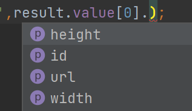

## Vue3+TS

### 课程服务

- **项目演示站点：http://zhihu.vikingship.xyz/**
- 在线后端API 查询和使用站点：http://api.vikingship.xyz/
- 项目在线文档：http://docs.vikingship.xyz/
- 完成的组件库展示：http://showcase.vikingship.xyz/
- 流程图和原型图
- 购买后直接可以接入使用的真实后端API
- **如果您想学习本课程，请支持正版，谢谢！ https://coding.imooc.com/class/449.html**


## Vue3新特性

#### 配置开发环境

[Vue cli](https://cli.vuejs.org/zh/)

```javascript
// 安装或者升级
npm install -g @vue/cli
# OR
yarn global add @vue/cli

// 保证 vue cli 版本在 4.5.0 以上
vue --version

// 创建项目
vue create my-project
```

然后的步骤

- Please pick a preset - 选择 **Manually select features**
- Check the features needed for your project - 多选择上 **TypeScript**，特别注意点空格是选择，点回车是下一步
- Choose a version of Vue.js that you want to start the project with - 选择 **3.x (Preview)**
- Use class-style component syntax - 输入 **n**，回车
- Use Babel alongside TypeScript - 输入**n**，回车
- Pick a linter / formatter config - 直接回车
- Pick additional lint features - 直接回车
- Where do you prefer placing config for Babel, ESLint, etc.? - 直接回车
- Save this as a preset for future projects? - 输入**n**，回车

启动图形化界面创建

```text
vue ui
```


#### setup

setup(props,context)  == >  ==组合式API的入口==。为了开始使用组合式 API，我们首先需要一个可以实际使用它的地方。在 Vue 组件中，我们将此位置称为 `setup`

[介绍 | Vue.js (vuejs.org)](https://v3.cn.vuejs.org/guide/composition-api-introduction.html#组合式-api-基础)


#### Ref 语法

[setup 方法](https://v3.vuejs.org/guide/composition-api-introduction.html#setup-component-option)

[ref 函数](https://v3.vuejs.org/guide/reactivity-fundamentals.html#creating-standalone-reactive-values-as-refs)

```vue
<template>
  <h1>{{count}}</h1>
  <h1>{{double}}</h1>
  <button @click="increase">+1</button>
</template>
```

```js
import { ref } from "vue"

setup() {
  // ref 是一个函数，它接受一个参数，返回的就是一个神奇的 响应式对象 。我们初始化的这个 0 作为参数包裹到这个对象中去，在未来可以检测到改变并作出对应的相应。
  const count = ref(0)
  const double = computed(() => {
    return count.value * 2
  })
  const increase = () => {
    count.value++
  }
  return {
    count,
    increase,
    double
  }
}
```


#### Reactive 函数

[Reactive 函数](https://v3.vuejs.org/guide/reactivity-fundamentals.html#declaring-reactive-state)

```vue
<script lang="ts">
export default {
  setup() {
    const data=reactive({
      count:0,
      increase:()=> {data.count++},
      double:computed(()=>data.count*2)   //❌
    })
  },
};
</script>
```

这里会报错!!!     <span style=" color:red;">data' implicitly has type 'any' because it does not have a type annotation and is referenced directly or indirectly in its own initializer.</span>  因为涉及到循环引用, 在TypeScript中不好判断data的类型! 


因此我们可以采用interface自己设置一下data类型好让ts确定类型!

```vue
<script lang="ts">
import { reactive,computed } from 'vue';
interface DataProps{
  count:number;
  double:number;
  increase:()=>void;
}

export default {
  // eslint-disable-next-line @typescript-eslint/explicit-module-boundary-types
  setup() {
    const data:DataProps=reactive({
      count:0,
      increase:()=> {data.count++},
      double:computed(()=>data.count*2)
    })
    return{
      data
    }
  },
};
</script>
```

此时的template为

```vue
<template>
<div id="content">
  
  <h1>{{ data.count }}</h1>
  <h1>{{ data.double }}</h1>
  <button @click="data.increase">+1</button>
</div>
</template>
```


🚩也许你会觉得在template中一直使用data很麻烦

先把template改为

```vue
<template>
<div id="content">
  
  <h1>{{ count }}</h1>
  <h1>{{ double }}</h1>
  <button @click="increase">+1</button>
</div>
</template>
```

我们直接采用扩展运算符展开  ...data , 不会起作用, 甚至指明类型 (count: data.count) 也没办法, 这是因为你把一个reactive对象分解后就不是响应式的了, 而就是原始类型! 因此我们需要使分解后的值变为响应式的!!!  采用toRefs

```js
export default {
  // eslint-disable-next-line @typescript-eslint/explicit-module-boundary-types
  setup() {
    const data:DataProps=reactive({
      count:0,
      increase:()=> {data.count++},
      double:computed(()=>data.count*2)
    })
    console.log(data);
    const refData =toRefs(data);
    return{
      ...refData
    }
  },
};
```

 

**😆对比一下 `ref` 和 `reactive`**

way1: separate variables

```js
let x=0;
let y=0;

function updateNumber() {
  x=2;
  y=3;
}
```


way2: single object

```js
const pos={
  x:0,
  y:0
}
function updateObject() {
  pos.x=2;
  pos.y=3;
}
```

但是这种方式下如果单独把变量拎出来就没有响应性了

```js
const {x}=pos;
pos.x=3;
console.log(x);  // 0
```


**🚩使用 ref 还是 reactive 可以选择这样的准则:**

- 第一，就像刚才的原生 javascript 的代码一样，像你平常写普通的 js 代码选择原始类型和对象类型一样来选择是使用 ref 还是 reactive。
- 第二，所有场景都使用 reactive，但是要记得使用 toRefs 保证 reactive 对象属性保持响应性。


🚩Vue3采用 ==Proxy== 来替代之前使用的 ==Object.defineProperty== , 使得可以监听数组下标和对象新属性的直接添加 !


#### 生命周期


**选项 API 生命周期选项和组合式 API 之间的映射**

- `beforeCreate` -> use `setup()`
- `created` -> use `setup()`
- `beforeMount` -> `onBeforeMount`
- `mounted` -> `onMounted`
- `beforeUpdate` -> `onBeforeUpdate`
- `updated` -> `onUpdated`
- `beforeUnmount` -> `onBeforeUnmount`
- `unmounted` -> `onUnmounted`
- `errorCaptured` -> `onErrorCaptured`
- `renderTracked` -> `onRenderTracked`
- `renderTriggered` -> `onRenderTriggered`
- `activated` -> `onActivated`
- `deactivated` -> `onDeactivated`


★renderTracked和renderTriggered一般用于debug!

##### renderTracked

- **类型：**`(e: DebuggerEvent) => void`

跟踪虚拟 DOM 重新渲染时调用。钩子接收 `debugger event` 作为参数。 <span style=" color:red;">此事件告诉你哪个操作跟踪了组件以及该操作的目标对象和键。</span>

**用法：**

```html
<div id="app">
  <button v-on:click="addToCart">Add to cart</button>
  <p>Cart({{ cart }})</p>
</div>
```

```js
const app = createApp({
  data() {
    return {
      cart: 0
    }
  },
  renderTracked({ key, target, type }) {
    console.log({ key, target, type })
    /* 当组件第一次渲染时，这将被记录下来:
    {
      key: "cart",
      target: {
        cart: 0
      },
      type: "get"
    }
    */
  },
  methods: {
    addToCart() {
      this.cart += 1
    }
  }
})

app.mount('#app')
```


##### renderTriggered

- **类型：**`(e: DebuggerEvent) => void`

- **详细：**

  当虚拟 DOM 重新渲染被触发时调用。和 [`renderTracked`](https://v3.cn.vuejs.org/api/options-lifecycle-hooks.html#rendertracked) 类似，接收 `debugger event` 作为参数。 <span style=" color:red;">此事件告诉你是什么操作触发了**重新**渲染，以及该操作的目标对象和键。</span>

- **用法：**

  ```html
  <div id="app">
    <button v-on:click="addToCart">Add to cart</button>
    <p>Cart({{ cart }})</p>
  </div>
  ```

  ```js
  const app = createApp({
    data() {
      return {
        cart: 0
      }
    },
    renderTriggered({ key, target, type }) {
      console.log({ key, target, type })
    },
    methods: {
      addToCart() {
        this.cart += 1
        /* 这将导致 renderTriggered 被调用
          {
            key: "cart",
            target: {
              cart: 1
            },
            type: "set"
          }
        */
      }
    }
  })
  
  app.mount('#app')
  ```


#### watch

<span id='watch-link'></span>

e.g.

```html
<button @click="updateGreeting">update title</button>
```

setup()中

```js
const greeting=ref('');
const updateGreeting=()=>{
	greeting.value+="Hello! "
}
document.title='updated'+greeting.value;  //修改title的代码
return{
  greeting,
  updateGreeting
}
```

<span style="color:#4a4b4a;background: antiquewhite"> ❗这么写是没法改变的哦! 因为引用setup只在beforeCreate和created时执行一次,  因此只会在初始的时候变更一次!  绑定的updateGreeting并不会修改document.title</span>   这里的greeting.value作为基本类型string赋值给document.title已经定型了, document.title不会因为greeting.value变化而变化! 并不存在引用关系!  

▼这时我们如果想要document.title依据greeting变化就需要watch来进行跟踪并更新了!

```js
watch(greeting, () => {
  document.title = "updated" + greeting.value;
})
```


watch使用方法:

```javascript
// watch 简单应用
watch(data, () => {
  document.title = 'updated ' + data.count
})
// watch 的两个参数，代表新的值和旧的值
watch(refData.count, (newValue, oldValue) => {
  console.log('old', oldValue)
  console.log('new', newValue)
  document.title = 'updated ' + data.count
})

// watch 多个值，返回的也是多个值的数组
watch([greetings, data], (newValue, oldValue) => {
  console.log('old', oldValue)
  console.log('new', newValue)
  document.title = 'updated' + greetings.value + data.count
})

// 使用 getter 的写法 watch reactive 对象中的一项
watch([greetings, () => data.count], (newValue, oldValue) => {
  console.log('old', oldValue)
  console.log('new', newValue)
  document.title = 'updated' + greetings.value + data.count
})
```

❗这里的data由于是reactive对象, 因此不好监控! 如果我们想要监控的话也不能写成 data.count形式

<span style="background:#FCFF85">A watch source can only be a getter/effect function, a ref, a reactive object, or an array of these types. 
  at <Reactive></span>

这里的`getter function`可以理解为 ()=>value


#### 模块化开发


##### ▼鼠标跟踪

以前我们原本是把一段代码的逻辑放在组件里的

```ts
setup(){
  const x=ref(0);
  const y=ref(0);
  //pageX是UIEvent的只读属性, MouseEvent派生于UIEvent
  const updateMouse=(e:MouseEvent)=>{
    x.value=e.pageX;
    y.value=e.pageY;
  }
  onMounted(()=>{
    document.addEventListener('click',updateMouse);
  })
  onUnmounted(()=>{
    document.removeEventListener('click',updateMouse);
  })
  return{
    x,y
  }
}
```


在Vue3中则可以这样:  新建一个Hooks文件夹在建一个useMousePosition.ts的文件, 按照下面这么写就可以实现功能的复用了! 

```ts
import {onMounted, onUnmounted, ref} from "vue";

function useMousePosition() {
  const x=ref(0);
  const y=ref(0);
  //pageX是UIEvent的只读属性, MouseEvent派生于UIEvent
  const updateMouse=(e:MouseEvent)=>{
    x.value=e.pageX;
    y.value=e.pageY;
  }
  onMounted(()=>{
    document.addEventListener('click',updateMouse);
  })
  onUnmounted(()=>{
    document.removeEventListener('click',updateMouse);
  })
  return{
    x,y
  }
}

export default useMousePosition
```


此时我们只用在setup()中这样写即可 !    <span style=" color:red;">记得import!</span>

```ts
import useMousePosition from "@/hooks/useMousePosition";

export default{
  setup(){
    const {x,y}=useMousePosition();
    return{
      x,y
    }
  }
}
```


😆😆😆温故而知新: 采用reactive对象重写

```js
function useMouseTrack() {
  const positions=reactive<MousePosition>({
    x:0,
    y:0
  })
  const updateMouse=(e:MouseEvent)=>{
    positions.x=e.pageX;
    positions.y=e.pageY;
  }
  onMounted(()=>{
    document.addEventListener('click',updateMouse);
  })
  onUnmounted(()=>{
    document.removeEventListener('click',updateMouse);
  })
  const refPos=toRefs(positions);
  return{
    ...refPos
  }
}
```

**vue3 这种实现方式的优点**

- 第一：它可以清楚的知道 xy 这两个值的来源，这两个参数是干什么的，他们来自 useMouseTracker 的返回，那么它们就是用来追踪鼠标位置的值。
- 第二：我们可以xy 可以设置任何别名，这样就避免了命名冲突的风险。
- 第三：这段逻辑可以脱离组件存在，因为它本来就和组件的实现没有任何关系，我们不需要添加任何组件实现相应的功能。只有逻辑代码在里面，不需要模版

❓在 Vue 2 中，mixin 是将部分组件逻辑抽象成可重用块的主要工具。但是，他们有几个问题：

- Mixin 很容易发生冲突：因为每个 mixin 的 property 都被合并到同一个组件中，所以为了避免 property 名冲突，你仍然需要了解其他每个特性。
- 可重用性是有限的：我们不能向 mixin 传递任何参数来改变它的逻辑，这降低了它们在抽象逻辑方面的灵活性。


##### ▼url网络请求


[axios 文档地址](https://github.com/axios/axios)

```bash
// 安装 axios 注意它是自带 type 文件的，所以我们不需要给它另外安装 typescript 的定义文件
npm install axios --save
```

useURLLoader.ts

```ts
import { ref } from 'vue'
import axios from 'axios'
// 添加一个参数作为要使用的 地址
const useURLLoader = (url: string) => {
// 声明几个ref，代表不同的状态和结果
  const result = ref(null)
  const loading = ref(true)
  const loaded = ref(false)
  const error = ref(null)

// 发送异步请求，获得data
// 由于 axios 都有定义，所以rawData 可以轻松知道其类型
  axios.get(url).then((rawData) => {
    loading.value = false
    loaded.value = true
    result.value = rawData.data
  }).catch((e) => {
    error.value = e
  })
  // 将这些ref 一一返回
  return {
    result,
    loading,
    error,
    loaded
  }
}

export default useURLLoader
```


我们在vue文件中使用   [免费获取狗狗图片的 API 地址](https://dog.ceo/api/breeds/image/random)

❗图片src要写成 :src 哦!

```html
  
<h1 v-if="loading">Loading ...</h1>
```

```js
const {result,loading,loaded}=useURLLoader('https://dog.ceo/api/breeds/image/random')
```

这样就简单的实现了axios网络请求api服务! 


#### ▼模块化结合TypeScript

在上面的例子中我们最后是从 result 中得到图片的地址信息, 但是当我们想watch这个信息时会报错

```js
watch(result,()=>{
  console.log(result.value.message);
})
```

因为result我们一开始赋值为 ref(null), 系统自动识别为null类型了, 因此会警告🚨我们null是没有message属性的! 


因此我们可以采用TypeScript来让代码识别我们的参数类型

useURLLoader.ts  中加上泛型

```ts
const useURLLoader = <T>(url: string) => {
  const result = ref<T|null>(null);
  //...
}
```


添加interface并阐明泛型的类型

```ts
//写在export default外面
interface DogResult {
  message: string;
  status: string;
}

//setup()中
watch(result,()=>{
  if(result.value){
    console.log('result.message:',result.value.message);
  }
})
return{
  result,
  loading,
  loaded
}
```


★也许这样没法体现出采用TypeScript的优势, 但是这个泛型T可以使得更加通用。因为不止dog api一种类型， 如果我们请求其他的api那么我们可以定义更多样的类型！

比如这里有个猫猫图片   https://api.thecatapi.com/v1/images/search?limit=1  返回的数据类型为一个数组：

```json
[{"breeds":[],"id":"hPFLuG81Y","url":"https://cdn2.thecatapi.com/images/hPFLuG81Y.jpg","width":768,"height":1024}]
```


那么我们可以这么处理：定义数组中元素的类型然后 T 赋值为 `CatResult[]`

```ts
interface CatResult {
  id: string;
  url: string;
  width: number;
  height: number;
}

// 免费猫图片的 API  https://api.thecatapi.com/v1/images/search?limit=1
const { result, loading, loaded } = useURLLoader<CatResult[]>('https://api.thecatapi.com/v1/images/search?limit=1')

watch(result,()=>{
  if(result.value){
    console.log('result.message:',result.value[0]);
  }
})
return{
  result,
  loading,
  loaded
}
```

   可以通用于各种各样的api请求, 并且还有了代码提示! 很方便!

同时记得修改template中的代码: setup中return ref数据会自动解包, 也就是不用再写 .value后缀!

```html

```


##### 使用 defineComponent 包裹组件

[defineComponent 文档地址](https://v3.vuejs.org/api/global-api.html#definecomponent)

实际上该api就是直接返回传递给它的对象。返回的值有一个合成类型的构造函数，用于手动渲染函数、TSX 和 IDE 工具支持。==简单来说就是为TypeScript服务!==


😍**优势：**

1. 写起来有很多提示！
2. defineComponent可以对setup的参数`props`进行类型推断！


#### Teleport

瞬间移动; 传送;  远距离传送 [Teleport | Vue.js (vuejs.org)](https://v3.cn.vuejs.org/guide/teleport.html#与-vue-components-一起使用)


why use❓

有时组件模板的一部分逻辑上属于该组件，而从技术角度来看，最好将模板的这一部分移动到 DOM 中 Vue app 之外的其他位置。一个常见的场景是创建一个包含全屏模式的组件。在大多数情况下，你希望模态框的逻辑存在于组件中，但是模态框的快速定位就很难通过 CSS 来解决，或者需要更改组件组合。

比如说我们突然需要跳出一个 Dialog全屏组件，通常这个组件是会被嵌套在各种子组件中, 而从技术角度来看，最好将模板的这一部分移动到 DOM 中 Vue app 之外的其他位置。

```html
div class="foo">
    <div class="foo">
        <div>...</div>
        <dialog v-if="dialogOpen">
    </div>
</div>
```

 

|  | Problems:<br />1.Dialog被包裹在其他组件之中,易被干扰<br />2.样式也在其他组件中,容易混乱 |
| ------------------------------------------------------------ | ------------------------------------------------------------ |


怎么改进呢?

在 public/index.html 中添加一个 `<div id='modal'> </div> ` 的节点

```html
// Modal.vue
<template>
  // vue3 新添加了一个默认的组件就叫 Teleport，我们可以拿过来直接使用，它上面有一个 to 的属性，它接受一个css query selector 作为参数，这就是代表要把这个组件渲染到哪个 dom 元素中
  <teleport to="#modal">
    <div id="center">
      <h1>this is a modal</h1>
    </div>
  </teleport>
</template>
```

这样在我们即使在其他组件中使用 `<modal>` , modal也不会嵌套在里面!


官方例子: codepen示例: [Vue 3 Teleport (codepen.io)](https://codepen.io/team/Vue/pen/gOPNvjR)

<iframe height="459" style="width: 100%;" scrolling="no" title="Vue 3 Teleport" src="https://codepen.io/team/Vue/embed/gOPNvjR?height=459&theme-id=light&default-tab=js,result" frameborder="no" loading="lazy" allowtransparency="true" allowfullscreen="true">
  See the Pen <a href='https://codepen.io/team/Vue/pen/gOPNvjR'>Vue 3 Teleport</a> by Vue
  (<a href='https://codepen.io/Vue'>@Vue</a>) on <a href='https://codepen.io'>CodePen</a>.
</iframe>


**▼TelePort简单应用:**

这边介绍一下vue3的新属性 emits,  [emits Option | Vue.js (vuejs.org)](https://v3.cn.vuejs.org/guide/migration/emits-option.html#_2-x-behavior) 


##### emits

- **类型：**`Array<string> | Object`

- **详细：**

  emits 可以是数组或对象，从组件触发自定义事件，emits 可以是简单的数组，也可以是对象，后者允许配置事件验证。

  在对象语法中，每个 property 的值可以为 `null` 或验证函数。验证函数将接收传递给 `$emit` 调用的其他参数。如果 `this.$emit('foo',1)` 被调用，`foo` 的相应验证函数将接收参数 `1`。验证函数应返回布尔值，**以表示事件参数是否有效。**

- **用法：**

  ```js
  const app = createApp({})
  
  // 数组语法
  app.component('todo-item', {
    emits: ['check'],
    created() {
      this.$emit('check')
    }
  })
  
  // 对象语法
  app.component('reply-form', {
    emits: {
      // 没有验证函数
      click: null,
  
      // 带有验证函数
      submit: payload => {
        if (payload.email && payload.password) {
          return true
        } else {
          console.warn(`Invalid submit event payload!`)
          return false
        }
      }
    }
  })
  ```

  `emits` 选项中列出的事件**不会**从组件的根元素继承，也将从 `$attrs` property 中移除。

  

  🚩这里解释一下验证函数, 对象语法中值为null表示不验证, 带有函数的话根据Boolean值来判断该emit的触发事件是否有效。（也就是this.emit调用时判断是否有效, 记住要传入验证函数需要的参数!）


##### Modal组件

```vue
<template>
<teleport to="#modal">
  <div id="center" v-if="isOpen">
    <h2><slot>this is a modal</slot></h2>
    <button @click="buttonClick">Close</button>
  </div>
</teleport>
</template>
<script lang="ts">
import { defineComponent } from 'vue'
export default defineComponent({
  props: {
    isOpen: Boolean,
  },
  emits: {
    'close-modal': null
  },
  setup(props, context) {
    const buttonClick = () => {
      context.emit('close-modal')
    }
    return {
      buttonClick
    }
  }
})
</script>
<style>
  #center {
    width: 200px;
    height: 200px;
    border: 2px solid black;
    background: white;
    position: fixed;
    left: 50%;
    top: 50%;
    margin-left: -100px;
    margin-top: -100px;
  }
</style>
```


在 App 组件中使用

```javascript
const modalIsOpen = ref(false)
const openModal = () => {
  modalIsOpen.value = true
}
const onModalClose = () => {
  modalIsOpen.value = false
}

<button @click="openModal">Open Modal</button><br/>
<modal :isOpen="modalIsOpen" @close-modal="onModalClose"> My Modal !!!!</modal>
```


现在就简单的实现了一个窗口, 可以点击打开和关闭! 

 


但是该对话组件虽然嵌套多层, 但实际上却通过teleport与app同级❗


 


#### Suspense

[Suspense | Vue.js (vuejs.org)](https://v3.cn.vuejs.org/guide/migration/suspense.html#介绍)

❗Suspense 是一个试验性的新特性并且其 API 可能随时更改。特此声明以便社区能够为当前的实现提供反馈。它不应该被用在生产环境。


e.g.

AsyncShow.vue

```vue
<template>
  <h1>{{result}}</h1>
</template>
<script lang="ts">
import { defineComponent } from 'vue'
export default defineComponent({
  setup() {
    return new Promise((resolve) => {
      setTimeout(() => {
        return resolve({
          result: 42
        })
      }, 3000)
    })
  }
})
</script>
```

很明显, 这里是在setup中返回一个promise, 并且该promise在3000ms后resolve并返回一个对象{result:42}


使用的话很简单, 在需要使用的组件中引入后再template中添加:

```html
<Suspense>
  <template #default>
    <async-show />
  </template>
  <template #fallback>
    <h1>Loading !...</h1>
  </template>
</Suspense>
```

`#default`是resolve后展示的内容, `#fallback`则是在resolve前展示的内容

官网解释是: `default` 插槽里的节点会尽可能展示出来。如果不能，则展示 `fallback` 插槽里的节点。


##### ▼更好的示例

采用了async/await方法, 并且使用了网络请求

DogShow.vue

```vue
<template>
  
</template>
<script lang='ts'>
import axios from "axios";
import { defineComponent } from "vue";
export default defineComponent({
  async setup() {
    const rawData = await axios.get("https://dog.ceo/api/breeds/image/random");
    console.log(rawData);
    
    return {
      result: rawData.data,
    }
  }
})
</script>
```


App.vue

```html
<Suspense>
  <template #default>
    <async-show />
    <dog-show />
  </template>
  <template #fallback>
    <h1>Loading !...</h1>
  </template>
</Suspense>
```

❗不要这么写, template中改成只有一个root node, 不然会报错无法显示! (可能是目前版本不支持!)


#### 全局API

[全局 API | Vue.js (vuejs.org)](https://v3.cn.vuejs.org/api/global-api.html#全局-api)


如果你使用的是 CDN 构建，那么全局 API 可以通过全局对象 `Vue` 来访问，例如：

```js
const { createApp, h, nextTick } = Vue
```


如果你使用的是 ES 模块，那么它们可以直接导入：

```js
import { createApp, h, nextTick } from 'vue'
```


##### ▼对比vue2:


Vue2 的全局配置

```javascript
import Vue from 'vue'
import App from './App.vue'

Vue.config.ignoredElements = [/^app-/]
Vue.use(/* ... */)
Vue.mixin(/* ... */)
Vue.component(/* ... */)
Vue.directive(/* ... */)

Vue.prototype.customProperty = () => {}

new Vue({
  render: h => h(App)
}).$mount('#app')
```

Vue2 这样写在一定程度上修改了 Vue 对象的全局状态。

- 第一，在单元测试中，全局配置非常容易污染全局环境，用户需要在每次 case 之间，保存和恢复配置。有一些 api （vue use vue mixin）甚至没有方法恢复配置，这就让一些插件的测试非常的困难。
- 第二，在不同的 APP 中，如果想共享一份有不同配置的 vue 对象，也变得非常困难。


**Vue3 的新写法**

```typescript
import { createApp } from 'vue'
import App from './App.vue'

const app = createApp(App)
// 这个时候 app 就是一个 App 的实例，现在再设置任何的配置是在不同的 app 实例上面的，不会像vue2 一样发生任何的冲突。

app.config.isCustomElement = tag => tag.startsWith('app-')
app.use(/* ... */)
app.mixin(/* ... */)
app.component(/* ... */)
app.directive(/* ... */)

app.config.globalProperties.customProperty = () => {}

// 当配置结束以后，我们再把 App 使用 mount 方法挂载到固定的 DOM 的节点上。
app.mount(App, '#app')
```


总结:  <span style="font-weight:bold; color:red;">Vue.config - > app.config</span>


**💎Tree-Shaking**

字面意思是把树上的树叶🍃都shake下去, 只剩枝干。这里是webpack中的概念--通常用于描述移除 JavaScript 上下文中的未引用代码(dead-code)

Vue3中也采用这种方式将全局的api具名导出，以此享受tree-shaking的优化从而减少打包体积

```js
// vue2
import Vue from 'vue'
Vue.nextTick(()=>{})
const obj = Vue.observable({})

// vue3
import Vue,{ nextTick,observable } from 'vue '
Vue.nextTick // undefined
nextTick(( )=>{})
const obj = observable({})
```


## 项目起步


### 需求分析

**一个复杂的 SPA 项目都要包括哪些知识点？**

- 第一，要有数据的展示，这个是所有网站共有的特性，而且最好是有多级复杂数据的展示
- 第二，要有数据的创建，这就是表单的作用，有展示自然要有创建。在创建中，我们会发散很多问题，比如数据的验证怎样做，文件的上传如何处理，创建和编辑怎样共享单个页面等等。
- 第三，要有组件的抽象，vue 是组件的世界，组件是最重要的一环，编写组件是最基本的能力，对于一些常用的功能，我们需要高可用性和可定制性的组件，也就是说我们在整个项目中一般不会用到第三方组件，比如 element，都是从零开始，而且会循序渐进，不断抽象。甚至行成自己的一套小组件库。
- 第四，整体状态数据结构的设计和实现，SPA 一般使用状态工具管理整理状态，并且给多个路由使用，在 vue 中，我们使用 vuex，一个项目的整体数据结构的复杂程度就代表了这个能力的高低，最好是要有多层次的数据结构，相互依赖的关系，还要将数据的获取，结构设计，缓存进行一系列的考量。
- 第五，权限管理和控制，一个项目需要有用户权限的实现，不仅仅是后端，前端作为一个整体的 SPA 的项目，权限控制也尤为重要，我们需要有权限的获取，权限的持久化，权限的更新，那个路由可访问，哪个需要权限才可以访问。发送异步请求的全局 token 注入，全局拦截，全局信息提示等等和权限相关的内容。
- 第六，真实的后端API，和后端的交互是整个项目的最重要一环。一些同学在开发项目的时候会使用 mock server，但是由于后端的数据结构常常和最初的文档设计背道而驰，造成最后项目需要再次回炉修改。

**页面所有原型图地址**: https://whimsical.com/Djb2TcWsLTPeapFdM3NaX


### 文件结构和代码规范


这里采用了 **ESLint + Standard config**    [JavaScript Standard Style (standardjs.com)](https://standardjs.com/readme-zhcn.html)

本工具通过以下三种方式为你（及你的团队）节省大量时间：

- **无须配置。** 史上最便捷的统一代码风格的方式，轻松拥有。
- **自动代码格式化。** 只需运行 `standard --fix` 从此和脏乱差的代码说再见。
- **提前发现风格及程序问题。** 减少代码审查过程中反反复复的修改过程，节约时间。

无须犹豫。再也不用维护 `.eslintrc`, `.jshintrc`, or `.jscsrc` 。开箱即用。

安装：

```shell
npm install standard --save-dev
```


```bash
/assets
	image.png
    logo.png
        	
/components
	ColumnList.vue
    Dropdown.vue
    ...
/hooks
	useURLloader.ts
    ...
/views
	Home.vue
    ...
App.vue
main.ts
store.ts
router.ts
...
```

hooks中放一些自定义的函数


### 样式

[Bootstrap · The most popular HTML, CSS, and JS library in the world. (getbootstrap.com)](https://getbootstrap.com/)

[Tailwind CSS - Rapidly build modern websites without ever leaving your HTML.](https://tailwindcss.com/)


安装bootstrap (next表示最新的版本)

```bash
npm install bootstrap@next --save
```

目前版本是：  "bootstrap": "`^5.0.0-beta3`"


设计图:  [vue3 (whimsical.com)](https://whimsical.com/vue3-Djb2TcWsLTPeapFdM3NaX)


### ColumnList组件


在component下建立ColumnList.vue

```vue
<template>
  <h1></h1>
</template>
<script lang="ts">

import { defineComponent } from 'vue'
export interface ColumnProps {
  id: number;
  title: string;
  avatar: string;
  description: string;
}

export default defineComponent({
  name: 'ColumnList',
  props: {
    list: {
      type: Array,
      required: true
    }
  }
})
</script>
```

这里的list的type我们想把它定义为columnProps类型,  也许会想到采用assertion ==>   <span style="color:blue;">Array as ColomnProps[]</span> , 但这样并不行❗ 因为Array是构造函数, 并不是一个类型, 没办法断言成一个类型。不过vue提供了一种注解的方法：  [注解props |vue](https://v3.cn.vuejs.org/guide/typescript-support.html#注解-props)  我们可以使用 PropType 这个方法，它接受一个泛型，将 Array 构造函数返回传入的泛型类型。  🌟修改如下：

```vue
props: {
  list: {
    type: Array as PropType<ColumnProps[]>,
    required: true
  }
}
```


Vetur插件tips： 我们可以通过在该组件的settings.json中添加:

```json
"vetur.experimental.templateInterpolationService": true 
```

然后该插件就会把vue文件转换为ts文件来分析语法, 最后再把结果转换为vue, 这样就能支持template的补全来支持TypeScript的类型

 

(😅😅😅当然WebStorm本身就支持不用搞这么复杂!)


#### ▼简单的模板展示：

ColumnList.vue

```vue
<template>
  <ul>
    <li v-for="column in list" :key="column">
      
      <h4>{{column.title}}</h4>
      <p>{{column.description}}</p>
      <a href="#">进入专栏</a>
    </li>
  </ul>
</template>
<script lang="ts">

import { defineComponent, PropType } from 'vue'
export interface ColumnProps {
  id: number;
  title: string;
  avatar: string;
  description: string;
}

export default defineComponent({
  name: 'ColumnList',
  props: {
    list: {
      type: Array as PropType<ColumnProps[]>,
      required: true
    }
  }
})
</script>
```

🚩

1. interface编写
2. 组件props的list类型声明
3. template中 v-for 构建组件


App.vue

```vue
<template>
  <div class="container">
    <column-list :list="list"></column-list>
  </div>
</template>

<script lang="ts">
import { defineComponent } from 'vue'
import 'bootstrap/dist/css/bootstrap.min.css'
import ColumnList, { ColumnProps } from '@/components/ColumnList.vue'
const testData: ColumnProps[] = [
  {
    id: 1,
    title: 'test1的专栏',
    description: '这是的test1专栏，有一段非常有意思的简介，可以更新一下欧',
    avatar: 'http://vue-maker.oss-cn-hangzhou.aliyuncs.com/vue-marker/5ee22dd58b3c4520912b9470.jpg?x-oss-process=image/resize,m_pad,h_100,w_100'
  },
  {
    id: 2,
    title: 'test2的专栏',
    description: '这是的test2专栏，有一段非常有意思的简介，可以更新一下欧',
    avatar: 'http://vue-maker.oss-cn-hangzhou.aliyuncs.com/vue-marker/5ee22dd58b3c4520912b9470.jpg?x-oss-process=image/resize,m_pad,h_100,w_100'
  }
]
export default defineComponent({
  name: 'App',
  components: {
    ColumnList
  },
  setup () {
    return {
      list: testData
    }
  }
})
</script>
```

🚩

1. 引入bootstrap
2. 从ColumnList.vue中引入组件(default), 再引入ColumnProps这个interface
3. setup中return数据给组件使用
4. template中引入column-list组件并传入props


💎这里使用了Bootstrap中的属性 container   [Containers · Bootstrap v5.0 (getbootstrap.com)](https://getbootstrap.com/docs/5.0/layout/containers/)

- `.container`, which sets a `max-width` at each responsive breakpoint


#### ▼采用Bootstrap美化:

我们这里使用Bootstrap中的Grid   [Grid system · Bootstrap v5.0 (getbootstrap.com)](https://getbootstrap.com/docs/5.0/layout/grid/)

- **Columns are incredibly flexible.** There are 12 template columns available per row, allowing you to create different combinations of elements that span any number of columns. Column classes indicate the number of template columns to span (e.g., `col-4` spans four). `width`s are set in percentages so you always have the same relative sizing.

🌟意思就是每一行等分为了12列, 我们可以通过  col-x 来确定我们的内容宽度, 全是col-4能等分为三列, 全是col-6等分为2列


card组件:  卡片式的样式更加美观

 

```html
<div class="card" style="width: 18rem;">
  
  <div class="card-body">
    <h5 class="card-title">Card title</h5>
    <p class="card-text">Some quick example text to build on the card title and make up the bulk of the card's content.</p>
    <a href="#" class="btn btn-primary">Go somewhere</a>
  </div>
</div>
```


##### ▼初步美化:

 

ColumnList.vue

```vue
<template>
  <div class="row">
    <div v-for="column in list" :key="column.id" class="col-4 mb-4">
      <div class="card h-100 shadow-sm" style="width: 18rem;">
        <div class="card-body text-center">
          
          <h5 class="card-title">{{column.title}}</h5>
          <p class="card-text text-start">{{column.description}}</p>
          <a href="#" class="btn btn-outline-primary">进入专栏</a>
        </div>
      </div>
    </div>
  </div>
</template>
```

🚩

1. col-4把一行分为了三列 (grid一行等分12列)

2. mb-4表示 margin-bottom 设置为 $spacer * 1.5  [Spacing · Bootstrap v5.0 ](https://getbootstrap.com/docs/5.0/utilities/spacing/)

3. card卡片样式引入, `h-100`表示高度占100%

4. shadow-sm 是阴影 sm表示small, 共有shadow-none, shadow-sm, shadow, shadow-lg四个值

5. text-center使文本居中

6. w-25意思是width为原来的25%， 

7. my-4  意思是设置y轴上的margin即设置 top 和 bottom

8. text-start就是说对齐开始的位置，  这是第五版中改了名字：Renamed `.text-left` and `.text-right` to `.text-start` and `.text-end`.   [Text · Bootstrap v5.0](https://getbootstrap.com/docs/5.0/utilities/text/)

9. btn-outline-primary 是一种button样式，会有背景色变化的动画  [Buttons · Bootstrap v5.0](https://getbootstrap.com/docs/5.0/components/buttons/)

   


##### ▼对图片添加默认地址


随便选一张图片放在 src/assets 中, 我们需要对传入的props中的list进行修改, 于是写在setup中! 

```js
export default defineComponent({
  name: 'ColumnList',
  props: {
    list: {
      type: Array as PropType<ColumnProps[]>,
      required: true
    }
  },
  setup (props) {
    const columnList = computed(() => {
      return props.list.map(column => {
        if (!column.avatar) {
          column.avatar = require('@/assets/default.jpg')
        }
        return column
      })
    })
    return {
      columnList
    }
  }
})
```

🚩这里将columnList变成了一个computed属性, 以便在avatar变化的时候及时更新 (computed是响应式的!) 当然如果你不使用computed也会显示默认图片, 但这仅会在第一次加载时计算, 后面获取到了avatar也不会变化!

❗ vue中图片的地址如果要动态获取的话必须使用require(\$path$)   or  使用网络地址

🌟记得在setup中把新计算的columnList返回, template中的list改为columnList


### GlobalHeader组件


```vue
<template>
  <nav class="navbar navbar-dark bg-primary justify-content-between mb-4 px-4">
    <a class="navbar-brand" href="#">者也专栏</a>
    <ul v-if="!user.isLogin" class="list-inline mb-0">
      <li class="list-inline-item"><a href="#" class="btn btn-outline-light my-2">登陆</a></li>
      <li class="list-inline-item"><a href="#" class="btn btn-outline-light my-2">注册</a></li>
    </ul>
    <ul v-else class="list-inline mb-0">
      <li class="list-inline-item"><a href="#" class="btn btn-outline-light my-2">你好 {{user.name}}</a></li>
    </ul>
  </nav>
</template>

<script lang="ts">
import { defineComponent, PropType } from 'vue'
export interface UserProps {
  isLogin: boolean;
  name?: string;
  id?: number;
}
export default defineComponent({
  name: 'GlobalHeader',
  props: {
    user: {
      type: Object as PropType<UserProps>,
      required: true
    }
  }
})
</script>
```

1. 这里主要采用的Bootstrap中的navbar组件  [Navbar · Bootstrap v5.0 (getbootstrap.com)](https://getbootstrap.com/docs/5.0/components/navbar/)


```html
<nav class="navbar navbar-dark bg-dark">
  <!-- Navbar content -->
</nav>

<nav class="navbar navbar-dark bg-primary">
  <!-- Navbar content -->
</nav>

<nav class="navbar navbar-light" style="background-color: #e3f2fd;">
  <!-- Navbar content -->
</nav>
```

navbar-light 或 navbar-dark 相当于浅色/深色模式


2. justify-content-between 就是flex布局中的属性  [Flex · Bootstrap v5.0 (getbootstrap.com)](https://getbootstrap.com/docs/5.0/utilities/flex/)
3. 引入了 UserProps类型来判断用户状态。 template中的v-if用于在不同状态显示不同内容


### DropDown组件

[Dropdowns · Bootstrap v5.0 (getbootstrap.com)](https://getbootstrap.com/docs/5.0/components/dropdowns/#single-button)

初始是这样的：

```vue
<template>
  <div class="dropdown">
    <a href="#" class="btn btn-outline-light dropdown-toggle" @click.prevent="toggleOpen">{{ title }}</a>
    <ul class="dropdown-menu" :style="{display:'block'}" v-if="isOpen" >
      <li><a class="dropdown-item" href="#">New Article</a></li>
      <li><a class="dropdown-item" href="#">Profiles</a></li>
      <li><a class="dropdown-item" href="#">More</a></li>
    </ul>
  </div>
</template>
```

1.  <span style=" color:red;">@click.prevent</span> 是为了阻止默认的点击事件发生! 对应js中的 [event.preventDefault| MDN )](https://developer.mozilla.org/zh-CN/docs/Web/API/Event/preventDefault) . 这里是个超链接, 超链接默认点击跳转, 但我们需要的是点击下拉显示, 也就是说将默认的点击事件更改为了我们自己定义的事件!
2. class为 <span style=" color:red;">dropdown-menu</span> 的话默认为  <span style="color:blue;">display:none</span> 也就是不显示. 因此我们改为 <span style="color:blue;">:style="{display:'block'}"</span>  使其显示出来! 
3. v-if  isOpen  toggleOpen一起控制下拉的显示和关闭!


```vue
<script>
import { defineComponent, ref } from 'vue'
export default defineComponent({
  name: 'DropDown',
  props: {
    title: {
      type: String,
      required: true
    }
  },
  setup () {
    const isOpen = ref(false)
    const toggleOpen = () => {
      isOpen.value = !isOpen.value
    }
    return {
      isOpen,
      toggleOpen
    }
  }
})
</script>
```


目前还有很多缺点:  比如点击按钮之外的地方无法使下拉框消失, 没有对下拉菜单内容设置点击事件等

 

▼当然如果我们想要对dropdown-item进行更加多样的改变, 我们可以将其设置为一个组件, 也许在这里显得比较多余, 但却方便我们以后添加功能! 

#### DropdownItem.vue

```vue
<template>
  <li
    class="dropdown-option"
    :class="{'is-disabled': disabled}"
  >
    <slot></slot>
  </li>
</template>

<script lang="ts">
import { defineComponent } from 'vue'
export default defineComponent({
  props: {
    disabled: {
      type: Boolean,
      default: false
    }
  }
})
</script>

<style>
.dropdown-option.is-disabled * {
  color: #6c757d;
  pointer-events: none;
  background-color: transparent;
}
</style>
```

🚩这里使用了插槽slot, 是为了方便使用该组件时直接添加item的名称!


#### 点击外部时item自动消失

 

▼需要完成的任务：

1. **在mounted时添加click事件，在unmounted时将事件删除**
2. **拿到DropDown的DOM元素从而判断，点击的内容是否被这个元素包含**


##### 模板引用

★关于模板引用（template-ref） [模板引用 | Vue.js (vuejs.org)](https://v3.cn.vuejs.org/guide/component-template-refs.html)

尽管存在 prop 和事件，但有时你可能仍然需要**直接访问 JavaScript 中的子组件**。为此，可以使用 `ref` attribute 为子组件或 HTML 元素指定引用 ID

🚨`$refs` 只会在组件渲染完成之后生效。这仅作为一个用于直接操作子元素的“逃生舱”——你应该避免在模板或计算属性中访问 `$refs`。

文档中是在组件app.component形式下使用的, 这时可以通过 this.\$refs来获取, 但composition api中却无法在setup中获取this.\$refs, 那么该怎么办呢?    [$refs and the Vue 3 Composition API](https://markus.oberlehner.net/blog/refs-and-the-vue-3-composition-api/)

在template和setup中同时使用相同名称的ref:

▼这里我们对DropDown.vue进行修改:

1. template中添加ref, 点击dropdown外的区域消失, 所以ref就绑定dropdown 

```html
<div class="dropdown" ref="dropdownRef">
```


2. setup中添加ref

```js
// 未mounted前初始值为null
const dropdownRef = ref<null | HTMLElement>(null)
const handler = (e: MouseEvent) => {
  if (dropdownRef.value) {
    console.log(dropdownRef.value)
    if (!dropdownRef.value.contains(e.target as HTMLElement) && isOpen.value) {
      isOpen.value = false
    }
  }
}
onMounted(() => {
  document.addEventListener('click', handler)
})
onUnmounted(() => {
  document.removeEventListener('click', handler)
})
return {
  isOpen,
  toggleOpen,
  // 返回和 ref 同名的响应式对象，就可以拿到对应的 dom 节点
  dropdownRef
}
```


🚩

① 这里的dropdownRef是一个HTML元素, 但由于setup执行是在beforeCreate时, 因此初始值为null

②我们这里在onMounted时添加事件监听, onUnmounted时删除是个很好的习惯哦! 

③直接对document进行监听, 然后判断event.target来决定发生的事件, 这就是前面所学的<span style="font-weight:bold; color:red;">事件委托</span> !

④点击外部消失我们采用的是except思想, event.target不是dropdown且dropdown展开就会触发!

⑤dropdownRef.value是ref所在的那个标签!

 


#### 包装成一个函数

这个点击外部就消失的功能我们其实可以包装成一个函数, 就不用重复造轮子了!😁😁😁

参数: elementRef

返回值: isClickOutside

功能: 就是判断点击范围是否在某个element元素外 ! 在的话返回true, 不在的话返回false

```ts
import { ref, onMounted, onUnmounted, Ref } from 'vue'

/* Ref是interface,我们这里需要传入一个响应式对象Ref通过泛型来给定具体类型 */
const useClickOutside = (elementRef: Ref<null | HTMLElement>) => {
  const isClickOutside = ref(false)
  const handler = (event: MouseEvent) => {
    if (elementRef.value) { // 等mounted之后再触发
      // 这里ts要求对event.target进行断言类型
      if (elementRef.value.contains(event.target as HTMLElement)) {
        isClickOutside.value = false
      } else {
        isClickOutside.value = true
      }
    }
  }
  onMounted(() => {
    document.addEventListener('click', handler)
  })
  onUnmounted(() => {
    document.removeEventListener('click', handler)
  })
  return isClickOutside
}

export default useClickOutside
```

❗这里对event.target要断言类型, 不然会报错  TS2345: Argument of type 'EventTarget | null' is not assignable to parameter of type 'Node | null'.  


▼那么我们怎么在组件中使用呢？

```js
const isCLickOutside = useClickOutside(dropdownRef)
if (isOpen.value && isCLickOutside.value) {
  isOpen.value = false
}
```

如果直接在setup中这么写的话是不会有效果的❗ 因为只会执行一次, 因此我们需要使用watch! (这里可以联系之前的相关例子 [watch](#watch-link)) 这样就使  <span style="color:blue;">isClickOutside</span> 变成了响应式的!

```js
const isCLickOutside = useClickOutside(dropdownRef)
watch(isCLickOutside, () => {
  if (isOpen.value && isCLickOutside.value) {
    isOpen.value = false
  }
})
```


## 自定义Form组件


### ValidateInput

#### 需求分析


#### 简单实现

从Bootstrap复制一段代码[Forms · Bootstrap v5.0 (getbootstrap.com)](https://getbootstrap.com/docs/5.0/forms/overview/)

在App.vue中添加Bootstrap中的form表单

```html
<form>
  <div class="mb-3">
    <label for="exampleInputEmail1" class="form-label">Email address</label>
    <input type="email" class="form-control" id="exampleInputEmail1" aria-describedby="emailHelp"
           v-model="emailRef.val"
           @blur="validateEmail"
    >
    <div id="emailHelp" class="form-text text-danger">{{ emailRef.message }}</div>
  </div>
  <div class="mb-3">
    <label for="exampleInputPassword1" class="form-label">Password</label>
    <input type="password" class="form-control" id="exampleInputPassword1">
  </div>
  <div class="mb-3 form-check">
    <input type="checkbox" class="form-check-input" id="exampleCheck1">
    <label class="form-check-label" for="exampleCheck1">Check me out</label>
  </div>
  <button type="submit" class="btn btn-primary">Submit</button>
</form>
```

❗ 这里的邮箱提示是通过


邮箱验证Reg

```js
const emailReg = /^(([^<>()[\]\\.,;:\s@"]+(\.[^<>()[\]\\.,;:\s@"]+)*)|(".+"))@((\[[0-9]{1,3}\.[0-9]{1,3}\.[0-9]{1,3}\.[0-9]{1,3}\])|(([a-zA-Z\-0-9]+\.)+[a-zA-Z]{2,}))$/
```


响应式email类型和验证函数

```js
const emailRef = reactive({
  val: '', // 输入值
  error: false, // 是否错误
  message: '' // 提示语
})
const validateEmail = () => {
  if (emailRef.val.trim() === '') { // 1.邮箱为空
    emailRef.error = true
    emailRef.message = 'Email cannot be empty!'
  } else if (!emailReg.test(emailRef.val)) { // 2.邮箱格式不对
    emailRef.error = true
    emailRef.message = 'Email is invalidate!'
  } else {
    emailRef.error = false
    emailRef.message = ''
  }
}
```

🚩 `v-model`就是vue中用来绑定input值并实现双向绑定的属性! `@blur`就是焦点不在改组件上时触发的事件

 


但这样很麻烦! 我们需要为每一个输入框都编写验证逻辑! 因此我们封装一个组件!


#### 组件初步封装

ValidateInput.vue

先看看script:

```vue
<script lang="ts">
import { defineComponent, PropType, reactive } from 'vue'

interface RuleProp {
  type: 'required' | 'email'; // 规则类型
  message: string; // 错误提示信息
}

const emailReg = /^(([^<>()[\]\\.,;:\s@"]+(\.[^<>()[\]\\.,;:\s@"]+)*)|(".+"))@((\[[0-9]{1,3}\.[0-9]{1,3}\.[0-9]{1,3}\.[0-9]{1,3}\])|(([a-zA-Z\-0-9]+\.)+[a-zA-Z]{2,}))$/
// 因为规则也许不止一种
export type RulesProp = RuleProp[]
export default defineComponent({
  name: 'ValidateInput',
  props: {
    rules: Array as PropType<RulesProp>
  },
  setup (props) {
    const inputRef = reactive({
      val: '', // 输入值
      error: false, // 是否错误
      message: '123' // 提示语
    })
    const validateInput = () => {
      if (props.rules) { // 首先判断有无rule
        const isAllPassed = props.rules.every(rule => {
          let passed = true
          switch (rule.type) {
            case 'required':
              passed = (inputRef.val.trim() !== '')
              break
            case 'email':
              passed = (emailReg.test(inputRef.val))
              break
            default:
              break
          }
          // 如果passed为false,every就不会继续执行了
          if (!passed) inputRef.message = rule.message
          console.log(inputRef.message)
          return passed
        })
        /* 这里很重要哦! 用于控制是否显示message! */
        inputRef.error = !isAllPassed
      }
    }
    return {
      inputRef,
      validateInput
    }
  }
})
</script>
```

🚩

1. 定义rule属性的interface, 并采用type转换成数组类型 ( 你也可以写成 Array\<RuleProp> )
2. 在setup中将输入值定义为响应式对象 inputRef
3. 定义验证函数。 可以注意一下这里的 every 方法, 我编写的也和教程中不一样


```vue
<template>
  <div class="mb-3">
    <label for="exampleInput" class="form-label">Email address</label>
    <input class="form-control" id="exampleInput" aria-describedby="emailHelp"
           :class="{'is-invalid':inputRef.error}"
           v-model="inputRef.val"
           @blur="validateInput"
    >
    <span v-if="inputRef.error" class="form-text invalid-feedback">{{ inputRef.message }}</span>
  </div>
</template>
```

因此我们这里根据 inputRef.error 来确定是否显示提示信息

 <span style="color:blue;"> is-invalid 和 invalid-feedback </span> 是Bootstrap中的样式!  [Validation · Bootstrap v5.0 (getbootstrap.com)](https://getbootstrap.com/docs/5.0/forms/validation/#server-side)

 


这里其实还是有缺陷的! 等着完成整个项目后改进!

1. 我希望提前给message留出位置, 而不是发生错误后再有message位置, 使 整体布局下移


💎目前我们完成的验证输入组件可以支持扩展验证的哦!


#### 添加v-model支持


##### 背景介绍

[v-model | Vue.js (vuejs.org)](https://v3.cn.vuejs.org/guide/migration/v-model.html#概览)

2.x 语法

在 2.x 中，在组件上使用 `v-model` 相当于绑定 `value` prop 和 `input` 事件：

```html
<ChildComponent v-model="pageTitle" />

<!-- 是以下的简写: -->

<ChildComponent :value="pageTitle" @input="pageTitle = $event" />
```


3.x 语法

在 3.x 中，自定义组件上的 `v-model` 相当于传递了 `modelValue` prop 并接收抛出的 `update:modelValue` 事件：

```html
<ChildComponent v-model="pageTitle" />

<!-- 是以下的简写: -->

<ChildComponent
  :modelValue="pageTitle"
  @update:modelValue="pageTitle = $event"
/>
```


如何运用到自定义组件? 

原来的时候我们是这样的

```vue
<input class="form-control" id="exampleInput" aria-describedby="emailHelp"
       :class="{'is-invalid':inputRef.error}"
       v-model="inputRef.val"
       @blur="validateInput"
>
```

这里也有 `v-model`, 只不过这只能在ValidateInput内使用, 而无法在引用该组件时添加 v-model 来使用! 也就是说我在App.vue中使用

```vue
<ValidateInput :rules="emailRules" v-model="emailValue"></ValidateInput>
{{emailValue}}
```

这样是无法实现v-model的双向绑定的! (因为我们这个自定义组件根本就没有实现 v-model, 那里只是在内层使用vue内置的 v-model) 


具体实现的话先使用官方教程中一个简单的例子来解释:  [组件基础 | Vue.js (vuejs.org)](https://v3.cn.vuejs.org/guide/component-basics.html#在组件上使用-v-model)

CustomInput组件

▼为了让它正常工作，这个组件内的 `<input>` 必须：

<span style="font-weight:bold; color:red;">1.将其 `value` attribute 绑定到一个名叫 `modelValue` 的 prop 上</span>

<span style="font-weight:bold; color:red;">2.在其 `input` 事件被触发时，将新的值通过自定义的 `update:modelValue` 事件抛出</span>

app.component写法:

```js
app.component('custom-input', {
  props: ['modelValue'],
  emits: ['update:modelValue'],
  template: `
    <input
      :value="modelValue"
      @input="$emit('update:modelValue', $event.target.value)"
    >
  `
})
```


.vue文件写法: 也可以看下面的具体使用! 

```vue
<template>
  <input
    :value="modelValue"
    @input="$emit('update:modelValue', $event.target.value)"
  >
</template>

<script>
export default {
  name: 'CustomInput',
  props: ['modelValue'],
  emits: ['update:modelValue']
}
</script>
```


此时就可以直接引入该组件, 并添加 v-model 属性

```html
<custom-input v-model="searchText"></custom-input>
```


##### 具体使用

先来看看按照vue官方的模板该如何编写? 

```vue
<input class="form-control" id="exampleInput" aria-describedby="emailHelp"
       :class="{'is-invalid':inputRef.error}"
       :value="modelValue"
       @input="$emit('update:modelValue', $event.target.value)"
       @blur="validateInput"
>
```

```js
export default defineComponent({
  name: 'ValidateInput',
  props: {
    rules: Array as PropType<RulesProp>,
    modelValue: String
  },
  emits: ['update:modelValue'],
  setup(),
  //...
```

1. :value必须设置为modelValue, prop是组件的属性, 而emit定义组件触发的事件
2. props中必须写出 ==modelValue==, emits也必须写出 =='update:modelValue'==


这是个通用的办法, 但是这样只能使用 modelValue, 而我们这里需要绑定的 v-model属性为 inputRef.val, 因此我们需要进行一些修改!


在ValidateInput.vue中进行修改

```vue
<template>
  <div class="validate-input-container pb-3">
    <input type="text"
      class="form-control"
      :class="{'is-invalid': inputRef.error}"
      @blur="validateInput"
      :value="inputRef.val"
      @input="updateValue"
    >
    <span v-if="inputRef.error" class="invalid-feedback">{{inputRef.message}}</span>
  </div>
</template>
<script lang="ts">
  props: {
    rules: Array as PropType<RulesProp>,
    modelValue: String
  },
  const inputRef = reactive({
    val: props.modelValue || '',
    error: false,
    message: ''
  })
  const updateValue = (e: KeyboardEvent) => {
    const targetValue = (e.target as HTMLInputElement).value
    inputRef.val = targetValue
    context.emit('update:modelValue', targetValue)
  }

</script>
```

这里我们将 ==:value== 赋值为 inputRef.val,  @input是输入监听事件, 赋值为我们手动实现的方法 updateValue.   要支持 v-model 只能使用官方模板给的 modelValue 和 @update, 因此我们还是需要在props中添加 modelValue, 并通过modelValue给inputRef.val赋值, 而且需要利用 context.emit 抛出方法!

因此在 `updateValue` 这个方法中我们需要先获取到输入的值, 也就是键盘事件 (KeyboardEvent) 中的目标 HTMLInputElement的值, 然后将绑定的 inputRef.val 先赋值, 再 emit该事件, 并将更新的值`targetValue`作为参数写在后面

🚩现在可以说我们实现了三个地方的双向绑定, 我们可以在 ValidateInput.vue中的template添加 {{inputRef.val}}, 然后在 使用ValidateInput的地方添加对应 v-model 的值

```vue
<ValidateInput :rules="emailRules" v-model="emailValue"></ValidateInput>
{{emailValue}}
```

此时我们在 input 中输入的话, ValidateInput.vue中 inputRef.value 和 App.vue中的 emailValue 都会同步进行响应式更新!  (采用vue官方的模板的话只能实现emailValue的响应式更新❗)


支持 v-model 步骤:

1. 在props注册modelValue
2. emit `update:modelValue` 事件


#### $attrs支持默认属性

\<input>这个HTML标签还有许多属性, [input|MDN](https://developer.mozilla.org/zh-CN/docs/Web/HTML/Element/Input) , 比如placeholder, 我们如何去支持呢? 


首先直接加进去试试看

```vue
<ValidateInput
  :rules="emailRules"  v-model="emailValue"
  placeholder="hello"
></ValidateInput>
```


我们发现并没有显示placeholder的值, 而且更离谱的是placeholder居然在父元素上面去了

 


💎这是因为 placeholder 是 非Prop的Attribute [非 Prop 的 Attribute | Vue.js (vuejs.org)](https://v3.cn.vuejs.org/guide/component-attrs.html#attribute-继承), 也就是没有在组件的props中定义的属性! 常见的示例包括 `class`、`style` 和 `id` 属性

而**当组件返回单个根节点时，非 prop attribute 将自动添加到根节点的 attribute 中。** 大多这种添加的属性会替换掉原来的属性, 但是有些会合并, 比如class!

我们现在需要做的是 == > 将placeholder属性转移到我们想要的input上


**step1: 不要让根节点继承Attribute  [禁用attribute继承| Vue.js (vuejs.org)](https://v3.cn.vuejs.org/guide/component-attrs.html#禁用-attribute-继承)**

禁用 attribute 继承的常见情况是需要将 attribute 应用于根节点之外的其他元素。

🌟解决方法: 在组件中 **将  `inheritAttrs` 选项设置为 `false`** 

现在我们可以发现根节点中没有placeholder属性了 ! 


**step2: 把Attributes添加到\<input>上面!**

首先了解一下 \$attrs  [\$attrs | Vue.js (vuejs.org)](https://v3.cn.vuejs.org/api/instance-properties.html#attrs)

- **仅可读**

包含了父作用域中不作为组件 [props](https://v3.cn.vuejs.org/api/options-data.html#props) 或[自定义事件](https://v3.cn.vuejs.org/api/options-data.html#emits)的 attribute 绑定和事件。 

这个\$attrs 对应于setup中的 context.attrs, 我们可以尝试log一下看看! 

 

可以发现我们添加的 非Prop属性都可以找到!


如果我们要是指定的组件来绑定我们添加的\$attrs, 则需要使用 v-bind [禁用Attribute继承 | vue)](https://v3.cn.vuejs.org/guide/component-attrs.html#禁用-attribute-继承)  比如这里在 ValidateInput.vue 中我们想让 \<input> 来拥有 非 prop 的attribute, 那么需要在\<input>中使用 v-bind来绑定这些attribute:

```vue
<template>
  <div class="validate-input-container pb-3">
    <input class="form-control" id="exampleInput" aria-describedby="emailHelp"
           :class="{'is-invalid':inputRef.error}"
           :value="inputRef.val"
           @input="updateValue"
           @blur="validateInput"
           
           v-bind="$attrs"
    >
    {{inputRef.val}}
    <span v-if="inputRef.error" class="form-text invalid-feedback">{{ inputRef.message }}</span>
  </div>
</template>
```


### ValidateForm


#### 需求分析


#### 使用slot

我们这里需要有两个自定义的插槽, 一个用于 input 输入, 另一个用于表单submit按钮, 此时采用 具名插槽即可!  [具名插槽 | Vue.js (vuejs.org)](https://v3.cn.vuejs.org/guide/component-slots.html#具名插槽)


```vue
<template>
  <form class="validate-form-container">
    <slot name="default"></slot>
    <div class="submit-area" @click.prevent="$emit('form-submit',true)">
      <slot name="submit">
        <button type="submit" class="btn btn-secondary">Submit</button>
      </slot>
    </div>
  </form>
</template>
```


1. 语义化包裹 ValidateInput 组件, 这里使用了default 插槽 !
2. 提交按钮有默认值, 也可以自定义! 这里再ValidateForm中提供了默认button, 并且使用slot让还可以在使用时自定义!


3.提交完毕触发特定事件

这里还需要emit点击事件, 我这里采用的官网的模板, 直接在div中写emit

```vue
<template>
  <div>
    <p>{{ text }}</p>
    <button v-on:click="$emit('accepted')">OK</button>
  </div>
</template>
<script>
  export default {
    props: ['text'],
    emits: ['accepted']
  }
</script>
```


也可以自己写一个方法, 然后在方法里面emit

```vue
<div class="submit-area" @click.prevent="submitForm">
  ...
  
<script lang="ts">
import { defineComponent } from 'vue'
export default defineComponent({
  emits: ['form-submit'],
  setup(props, context) {
    const submitForm = () => {
      context.emit('form-submit', true)
    }
    return {
      submitForm
    }
  }
})
</script>
```


#### 父子组件通信


4.验证包裹的子组件 ValidateInput的结果

如果要在父组件ValidateForm中验证子组件ValidateInput上的结果, 那么必然涉及到父子组件通信和传值。但这里由于slot和多个子组件，并不是那么容易！


[模板引用 | Vue.js (vuejs.org)](https://v3.cn.vuejs.org/guide/composition-api-template-refs.html#jsx-中的用法)

我们可以采用 模板引用 来获取子组件上所有的属性和方法!  这里我们对该组件添加 ref

```vue
<validate-input
  type="text"
  :rules="emailRules" v-model="emailValue"
  placeholder="Enter your email"
  ref="inputRef"
></validate-input>
```

setup中也添加同名的ref并返回! 

```js
const inputRef = ref<any>(null)
return {
	inputRef
}
```

log一下 inputRef.value: 

 

果然可以发现该自定义组件上的属性和方法

我们尝试着使之前的ValidateInput.vue中的 `validateInput` 方法返回一些数据

```js
const validateInput = () => {
  if (props.rules) { // 首先判断有无rule
    const isAllPassed = props.rules.every(rule => {
      let passed = true
      switch (rule.type) {
        case 'required':
          passed = (inputRef.val.trim() !== '')
          break
        case 'email':
          passed = (emailReg.test(inputRef.val))
          break
        default:
          break
      }
      // 如果passed为false,every就不会继续执行了
      if (!passed) inputRef.message = rule.message
      console.log(inputRef.message)
      return passed
    })
    /* 这里很重要哦! 用于控制是否显示message! */
    inputRef.error = !isAllPassed
    return isAllPassed
  }
  return true
}
```


我们在App.vue中尝试执行子组件的方法:

```js
const onSubmitForm = (res: boolean) => {
  console.log('validate res: ', inputRef.value.validateInput())
}
```

此时我们点击 Submit, 就会调用子组件 ValidateInput 中的验证方法，然后检查到email为空便会提示！


这样看起来很完美， 可是我们这里是 slot， 并不支持 template-ref， 而且slot中有很多个ValidateInput组件，没法用一个ref去一一对应！

```vue
<form class="validate-form-container">
  <slot name="default"></slot>
  <span class="submit-area" @click.prevent="$emit('form-submit',true)">
    <slot name="submit">
      <button type="submit" class="btn btn-secondary">Submit</button>
    </slot>
  </span>
</form>
```


（当然我也想过可以在App.vue中对每个validate-input一一手动设置ref，不过有点不太好！）


💥新的思想：


1. 每一个子组件在创建时都emit一个事件
2. 父组件form监听这些子组件事件并将其添加进一个检验数组


可惜的是在vue3中 \$on 已经被移除!   [事件 API | Vue.js (vuejs.org)](https://v3.cn.vuejs.org/guide/migration/events-api.html#概览)

> `$on`，`$off` 和 `$once` 实例方法已被移除，应用实例不再实现事件触发接口

**迁移策略**

在 Vue 3 中，已经不可能使用这些 API 从组件内部监听组件自己发出的事件了，该用例暂没有迁移的方法。但是该 eventHub 模式可以被替换为实现了事件触发器接口的外部库，例如 [mitt](https://github.com/developit/mitt) 或 [tiny-emitter](https://github.com/scottcorgan/tiny-emitter)。

[developit/mitt: 🥊 Tiny 200 byte functional event emitter / pubsub. (github.com)](https://github.com/developit/mitt)


#### mitt

▼写一个简单的示例验证子组件传值！

首先我们安装 mitt 

```shell
$ npm install --save mitt
```

1. 每一个子组件在创建时都emit一个事件
2. 父组件form监听这些子组件事件并将其添加进一个检验数组


我们先进行 2. 在父组件 ValidateForm 中进行监听


```ts
import mitt from 'mitt'
type Events = {
  'form-item-created':string
}
/* 我们需要把这个给validateInput使用 */
export const emitter = mitt<Events>()
```

mitt官方文档说ts中需要写一个type, 里面是我们需要监听的事件名称和其类型 ! 名称必须和监听的一模一样! 

然后在setup中我们进行监听和事后清除操作:

```js
const callback = (test: string) => {
  console.log(test)
}
emitter.on('form-item-created', callback)
onUnmounted(() => { // 事件添加了一定要记得在组件卸载时删除
  emitter.off('form-item-created', callback)
})
```


✅父组件监听 \$on 完成


接下来在子组件ValidateInput中mount时向父组件emit

首先引入 emitter

```js
import { emitter } from '@/components/ValidateForm.vue'
```

当子组件ValidateInput挂载时进行emit

```js
onMounted(() => {
  emitter.emit('form-item-created', inputRef.val)
})
```


我们提前在App.vue对emial和password赋值进行检查

```js
const emailValue = ref('shan@gmail.com')
const passwordValue = ref('123')
```

可以发现控制台打印出了对应的值

说明我们在 父组件 ValidateForm中设置的callback被成功调用! 

✅子组件emit事件 完成!


**mitt中的TypeScript使用**

🌟解释一下mitt中TypeScript的使用, 使用官网例子来介绍: 

```js
import mitt from 'mitt';

type Events = {
  foo: string;
  bar?: number;
};

const emitter = mitt<Events>(); // inferred as Emitter<Events>

emitter.on('foo', (e) => {}); // 'e' has inferred type 'string'

emitter.emit('foo', 42); // Error: Argument of type 'number' is not assignable to parameter of type 'string'. (2345)
```

1. 你需要对想要监听or发送的事件进行类型定义, 其中 foo 是需要进行监听的事件名称, 后面的string表示的是子组件emit的变量类型! 

2. 比如说在上面的简单示例中我们设置

   ```ts
   type Events = {
     'form-item-created':string
   }
   ```

   表示 监听的事件名 为   <span style="color:blue;">'form-item-created'</span> , 子组件中emit出去的参数类型为  <span style=" color:red;">string</span> 

   子组件 ValidateInput.vue中, 这里emit的inputRef.val必须是stirng

   ```ts
   onMounted(() => {
     emitter.emit('form-item-created', inputRef.val)
   })
   ```


   然后在父组件中\$on监听时的回调函数中的参数必须是string类型, 也就是说 callback类型如下:

   ```ts
   type Callback = (test:string) => void
   const callback = (test: string) => {
     console.log(test)
   }
   ```

   这个test就对应子组件emit的inputRef.val


我们现在来实际应用一下, 因为我们需要传的不是测试的string, 而是一个验证函数!


我们先提前定义好相关类型, 验证函数是一个返回Boolean的函数

```ts
type ValidateFunc = () => boolean
type ValidateCallback = (func:ValidateFunc) => void
type Events = {
  'form-item-created': ValidateFunc
}
```


由于我们需要在提交前进行相关的验证, 于是我们需要重新设置提交事件, 以便在提交前进行检查!


改为:

```vue
<span class="submit-area" @click.prevent="submitForm">
  <slot name="submit">
    <button type="submit" class="btn btn-secondary">Submit</button>
  </slot>
</span>
```


在点击submit时会调用 submitForm, 在这个函数中我们会对得到的验证函数逐一执行并验证! 

```js
const submitForm = () => {
  const result = validateFuncList.every(func => func())
  context.emit('form-submit', result)
}
```

❌ 我们这里采用的every, 但every存在短路现象, 比如

 

我这里点击提交, 却只显示了 email 的错误, 实际上password也为空, 但没有检测到! 

因此我们为了使全部的验证函数都运行一遍, 可以先用map进行处理返回一个Boolean数组, 然后再对every进行处理! 

```js
const submitForm = () => {
  const result = validateFuncList.map(func => func()).every(res => res)
  context.emit('form-submit', result)
}
```

这样的话点击submit就会执行所有验证函数! 

 


最后也不要忘记再 onUnmounted 中对validateFunc进行清空

```js
onUnmounted(() => { // 事件添加了一定要记得在组件卸载时删除
  emitter.off('form-item-created', callback)
  validateFuncList.length = 0
})
```


★目前我们就简单的利用mitt库完成了父子组件的通信!  这里其实可以传很多类型的值!


### Summary

1. ValidateInput组件的封装 (template和inputRef验证)


