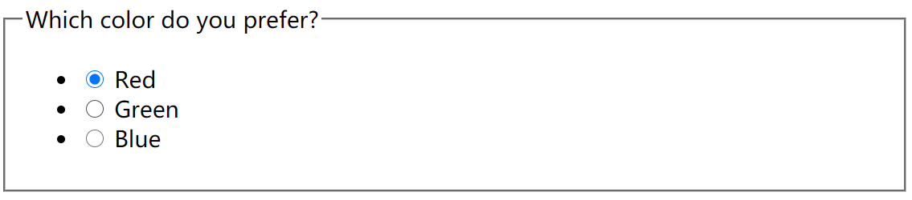
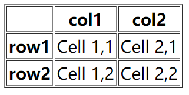

## 一.按钮

1.单选框

```html
<fieldset>
    <legend>Which color do you prefer?</legend>
    <ul>
        <li>
            <input type="radio" value="red" name="color" id="colorRed">
            <label for="colorRed">Red</label>
        </li>
        <li>
            <input type="radio" value="green" name="color" id="colorGreen">
            <label for="colorGreen">Green</label>
        </li>
        <li>
            <input type="radio" value="blue" name="color" id="colorBlue">
            <label for="colorBlue">Blue</label>
        </li>
    </ul>
</fieldset>
```




[more]([HTML  标签 (w3school.com.cn)](https://www.w3school.com.cn/tags/tag_input.asp))


## 二.表格


1.基础的表格


```html
<table border="1" >
    <tbody>
    <tr>
        <th></th>
        <th>col1</th>
        <th>col2</th>
    </tr>
    <tr>
        <th>row1</th>
        <td>Cell 1,1</td>
        <td>Cell 2,1</td>
    </tr>
    <tr>
        <th>row2</th>
        <td>Cell 1,2</td>
        <td>Cell 2,2</td>
    </tr>
    </tbody>
</table>
```

 


[more]([HTML  标签 (w3school.com.cn)](https://www.w3school.com.cn/tags/tag_table.asp))


