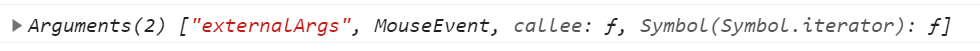

### 一.防抖函数的理解--层层递进


防抖和节流原理这里不会细述，主要是讲如何从一个最简单的防抖函数一直优化到比较完美的状态。（最终版比现在网上blog的要稍微好一点）

🌟当然也提供一个原理链接，同样也是我最初的参考[防抖和节流](https://www.jianshu.com/p/c8b86b09daf0)


▼对于防抖和节流我的理解是：防抖是停下来了才开始执行, 节流是固定时间不管发生多少次时间都执行固定次数


先给一个最基础版的防抖（非立即执行）

HTML：

```html
<div id="content"
     style="height:150px;
     line-height:150px;
     text-align:center;
     color: #fff;
     background-color:lightseagreen;
     font-size:80px;">
    0
</div>
```


#### 1.基础版

 js:

```js
let easyDebounce=(func,wait)=>{
    let timeout;
    return function (){
        clearTimeout(timeout);
        timeout=setTimeout(()=>{
            func();
        },wait)
    }
}

let item=document.querySelector("#content");
let num=0;
function count() {
    item.innerHTML = String(++num);
}
item.addEventListener('mousemove',easyDebounce(count,1000));
```

▼效果为不管在div内移动多少次， 只会触发最后一次的func


可以看出来我们已经实现了基本的防抖了。不过这里有两个缺陷

1. 我们直接调用func(), 这样的话就没法给回调函数count进行传参, 连默认的event都传不进来, 因为event参数是绑定在匿名函数上的!!!
2. 我们在定时器中的回调函数的this指向的是顶层对象window, 但是原本应该是item!!! 


(废话几句, 大佬可以跳过😅😅😅:  因为这里会将返回的函数绑定在item上, 其完整写法是 **EventTarget.addEventListener()**.   再多说一点easyDebounce执行的时候其中的this指向window, 因为绑定在item上的函数不是easyBounce而是esayBounce返回的函数...)  具体执行是这样的: 

```js
let easyDebounce=(func,wait)=>{
    let timeout;
    console.log(this)            //▼window
    return function (){
        console.log(this);         //▼item
        clearTimeout(timeout);
        timeout=setTimeout(()=>{
            func();                
        },wait)
    }
}

let item=document.querySelector("#content");
let num=0;
function count() {
    item.innerHTML = String(++num);
    console.log(this);             //▼window
}
```


那么如何改进呢? 

#### 2.标准防抖

```js
let easyDebounce=(func,wait)=>{
    let timeout;
    return function (){
        let context=this;
        let args=arguments;
        clearTimeout(timeout);

        timeout=setTimeout(()=>{
            func.apply(context,args);
        },wait)
    }
}

let item=document.querySelector("#content");
let num=0;
function count(event) {
    console.log(this);      //item
    console.log(event);     //MouseEvent
    item.innerHTML = String(++num);
}
item.addEventListener('mousemove',easyDebounce(count,1000));
```

🌟此时我们通过apply方法, 成功解决了this和传参的问题!!! 这也是比较流行的一种写法


可是如果我们想要给回调函数count传参该怎么办呢? 

```js
item.addEventListener('mousemove',easyDebounce(count(param),1000));
```

❌这样肯定是不行的啦, 回调函数是传地址, 让别人去调用, 这么写会立即调用count


这就要用到下面的方法了------通过外部函数传参


#### 3.防抖Plus

```js
let debounce=function (func,wait){ //箭头函数没有arguments
    let timeout;
    let externalArgs=[...arguments].slice(2);
    return function () {
        let context=this;
        let args=externalArgs.concat([...arguments]);
        if (timeout) clearTimeout(timeout);
        timeout=setTimeout(()=>{
            func.apply(context,args);
        },wait)
    }
}
function count() {
    console.log(this);
    console.log(arguments);  //Arguments(2)['externalArgs',MouseEvent]
    item.innerHTML = String(num++);
}
item.addEventListener('mousemove',debounce(count,1000,'externalArgs'));
```

我们可以在debounce中传参, 并利用arguments在count使用参数




