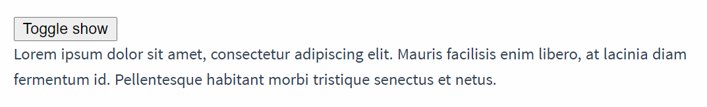

### [过渡的类名](https://cn.vuejs.org/v2/guide/transitions.html#过渡的类名)

在进入/离开的过渡中，会有 6 个 class 切换。

1. `v-enter`：定义进入过渡的开始状态。在元素被插入之前生效，在元素被插入之后的下一帧移除。
2. `v-enter-active`：定义进入过渡生效时的状态。在整个进入过渡的阶段中应用，在元素被插入之前生效，在过渡/动画完成之后移除。这个类可以被用来定义进入过渡的过程时间，延迟和曲线函数。
3. `v-enter-to`：**2.1.8 版及以上**定义进入过渡的结束状态。在元素被插入之后下一帧生效 (与此同时 `v-enter` 被移除)，在过渡/动画完成之后移除。
4. `v-leave`：定义离开过渡的开始状态。在离开过渡被触发时立刻生效，下一帧被移除。
5. `v-leave-active`：定义离开过渡生效时的状态。在整个离开过渡的阶段中应用，在离开过渡被触发时立刻生效，在过渡/动画完成之后移除。这个类可以被用来定义离开过渡的过程时间，延迟和曲线函数。
6. `v-leave-to`：**2.1.8 版及以上**定义离开过渡的结束状态。在离开过渡被触发之后下一帧生效 (与此同时 `v-leave` 被删除)，在过渡/动画完成之后移除。


对于这些在过渡中切换的类名来说，如果你使用一个没有名字的 `<transition>`，则 `v-` 是这些类名的默认前缀。如果你使用了 `<transition name="my-transition">`，那么 `v-enter` 会替换为 `my-transition-enter`。

`v-enter-active` 和 `v-leave-active` 可以控制进入/离开过渡的不同的缓和曲线，在下面章节会有个示例说明。


### Vue实现的简单CSS动画


[codeOpen](https://codepen.io/shanxiansen310/pen/XWpbogg)

示例：(省略了兼容性前缀)

```html
<div id="example-2">
  <button @click="show = !show">Toggle show</button>
  <transition name="bounce">
    <p v-if="show">Lorem ipsum dolor sit amet, consectetur adipiscing elit. Mauris facilisis enim libero, at lacinia diam fermentum id. Pellentesque habitant morbi tristique senectus et netus.</p>
  </transition>
</div>
```


```js
new Vue({
  el: '#example-2',
  data: {
    show: true
  }
})
```

```css
.bounce-enter-active {
  animation: bounce-in .5s;
}
.bounce-leave-active {
  animation: bounce-in .5s reverse;
}
@keyframes bounce-in {
  0% {
    transform: scale(0);
  }
  50% {
    transform: scale(1.5);
  }
  100% {
    transform: scale(1);
  }
}
```





