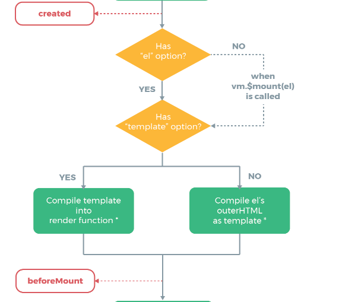
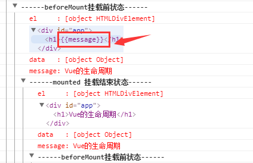

###  一.双向数据绑定初步理解


先来看一个简单的单向绑定    

```html
<body>
<div id="root">
    <div>Hello Vue!</div>
    <p>{{content}}</p>
</div>

<script>
    new Vue({
        el:'#root',
        data: {
            content:"one-way binding"
        }
    })
</script>
</body>
```

 

▼在这里通过Vue实例中data的content传递给了html的p标签,  但是无法通过p标签去改变content

<span style="font-weight:bold; color:red;">🌟数据决定页面的显示, 但是页面无法决定数据的内容!</span>


上面的无法决定你可能会觉得是因为根本无法改变p标签, 那么接下来换成 input


```html
<body>
<div id="root">
    <div>Hello Vue!</div>
    <input :value="content" />
    <p>{{content}}</p>
</div>

<script>
    new Vue({
        el:'#root',
        data: {
            content:"one-way binding"
        }
    })
</script>
</body>
```

 


可以发现我们修改input中的value值, 可是下面对应的p标签的content并没有变化!!!

**🌟说明这还是单向绑定**


但是 <span style="font-weight:bold; color:red;">v-model</span> 却可以实现双向绑定  

```html
<body>
<div id="root">
    <div>Hello Vue!</div>
    <input v-model="content" />
    <p>{{content}}</p>
</div>

<script>
    new Vue({
        el:'#root',
        data: {
            content:"one-way binding"
        }
    })
</script>
</body>
```

 

🌟可以发现, 下面的content跟随input输入的value一起变化!


### 二.Vue生命周期


#### Vue生命周期中的hook函数

- **beforeCreate**
- **created**
- **beforeMount**
- **mounted**
- **beforeUpdate**
- **updated**
- **beforeDestroy**
- **destroyed**

**🌟其实就是Create , Mount , Update , Destroy**


示例

HTML

```html
<div id="app">
    <h1>{{message}}</h1>
</div>
```

 js

```js
<script>
    var vm = new Vue({
        // el: '#app',
        data: {
            message: 'Vue的生命周期'
        },
        template:`<div>template</div>`,

        beforeCreate: function() {
            console.group('------beforeCreate创建前状态------');
            console.log("%c%s", "color:red" , "el     : " + this.$el); //undefined
            console.log("%c%s", "color:red","data   : " + this.$data); //undefined
            console.log("%c%s", "color:red","message: " + this.message)
        },
        created: function() {
            console.group('------created创建完毕状态------');
            console.log("%c%s", "color:red","el     : " + this.$el); //undefined
            console.log("%c%s", "color:red","data   : " + this.$data); //已被初始化
            console.log("%c%s", "color:red","message: " + this.message); //已被初始化
        },
        beforeMount: function() {
            console.group('------beforeMount挂载前状态------');
            console.log("%c%s", "color:red","el     : " + (this.$el)); //已被初始化
            console.log(this.$el);
            console.log("%c%s", "color:red","data   : " + this.$data); //已被初始化
            console.log("%c%s", "color:red","message: " + this.message); //已被初始化
        },
        mounted: function() {
            console.group('------mounted 挂载结束状态------');
            console.log("%c%s", "color:red","el     : " + this.$el); //已被初始化
            console.log(this.$el);
            console.log("%c%s", "color:red","data   : " + this.$data); //已被初始化
            console.log("%c%s", "color:red","message: " + this.message); //已被初始化
        },
        beforeUpdate: function () {
            console.group('beforeUpdate 更新前状态===============》');
            console.log("%c%s", "color:red","el     : " + this.$el);
            console.log(this.$el);
            console.log("%c%s", "color:red","data   : " + this.$data);
            console.log("%c%s", "color:red","message: " + this.message);
        },
        updated: function () {
            console.group('updated 更新完成状态===============》');
            console.log("%c%s", "color:red","el     : " + this.$el);
            console.log(this.$el);
            console.log("%c%s", "color:red","data   : " + this.$data);
            console.log("%c%s", "color:red","message: " + this.message);
        },
        beforeDestroy: function () {
            console.group('beforeDestroy 销毁前状态===============》');
            console.log("%c%s", "color:red","el     : " + this.$el);
            console.log(this.$el);
            console.log("%c%s", "color:red","data   : " + this.$data);
            console.log("%c%s", "color:red","message: " + this.message);
        },
        destroyed: function () {
            console.group('destroyed 销毁完成状态===============》');
            console.log("%c%s", "color:red","el     : " + this.$el);
            console.log(this.$el);
            console.log("%c%s", "color:red","data   : " + this.$data);
            console.log("%c%s", "color:red","message: " + this.message)
        }
    })
</script>
```

▼这是在执行自定义钩子函数后的打印结果:

 


##### **1. 在beforeCreate和created钩子函数之间的生命周期**

在这个生命周期之间，**进行数据的观测, 并初始化事件**,  而在**created**的时候数据已经和**data属性进行绑定**, 但是$el仍未被初始化。

created：**在这一步，实例已完成以下配置：数据观测、属性和方法的运算，watch/event事件回调，完成了data 数据的初始化，el没有。**


##### **2. created钩子函数和beforeMount间的生命周期**

 

▼在这里首先判断是否存在el属性？（可以联想到之前讲到的组件也是Vue实例！）

if 没有 el：（注释掉Vue实例中的 el属性）

 **然后运行可以看到到created的时候就停止了!**  因为没有el无法进行mount❗

 

**但是如果我们现在调用mount函数**：  vm.$mount(document.getElementById("app"))
**就会进入mount状态，同时message也会相应地变化**


 


▼然后，我们往下看，**template**参数选项的有无对生命周期的影响。（联系组件）

（1）如果vue实例对象中有template参数选项，则将其作为模板编译成render函数。
（2）如果没有template选项，则将外部HTML作为模板编译。
（3）可以看到**template中的模板优先级要高于outer HTML的优先级。**


此时我们在Vue实例中添加template

```js
template: "<h1>{{message +'这是在template中的'}}</h1>", //在vue配置项中修改的
```

就可以在看到在页面中的显示：

 


Vue要通过el得到对应的outHTML作为template（如果内置了template则采用内置的），反正要先判断el


plus：

在vue对象中还有一个**render函数**，它是以createElement作为参数，然后做渲染操作，而且我们可以直接嵌入JSX.

```js
new Vue({
    el: '#app',
    render: function(createElement) {
        return createElement('h1', 'this is createElement')
    }
})
```

可以看到页面中渲染的是：


所以综合排名优先级：

<span style="font-weight:bold; color:red;">🚩render函数选项 > template选项 > outer HTML.</span>


##### **3. beforeMount和mounted 钩子函数间的生命周期**

 

可以看到此时是给vue实例对象添加**$el成员**，并且替换掉挂载的DOM元素。因为在之前console中打印的结果可以看到**beforeMount**之前el上还是undefined。  

❗不过我看源码, 在beforeMount时 $el应该还是undefined, 在mounted的时候才被赋值挂载

❗console当打印出来的是基本数据类型时候当然没问题，否则对于复杂数据类型是会发生改变的，因为只是地址引用而已

  


##### **4. mounted**

注意看下面截图：

 

▼在mounted之前h1中还是通过**{{message}}**进行占位的，因为此时还没有挂载到页面上，还是JavaScript中的虚拟DOM形式存在的。在mounted之后可以看到h1中的内容发生了变化。


##### **5. beforeUpdate钩子函数和updated钩子函数间的生命周期**

 

当vue发现data中的数据发生了改变，会**触发对应组件的重新渲染**，先后调用**beforeUpdate**和**updated**钩子函数。我们在console中输入：

```js
vm.message = '触发组件更新'
```

就会触发组件更新

 

  

🌟这里可以发现beforeUpdate时el中的data已经变化，但这时并不会更新页面。因为beforeUpdate到updated这个过程才是渲染更新页面的过程，updated时页面才被重新渲染完成。


<span style="font-size:20px;font-weight:bold">★在beforeUpdate,可以监听到data的变化但是view层没有被重新渲染，view层的数据没有变化。等到updated的时候 view层才被重新渲染，数据更新。 </span>


如果我们在beforeUpdate的函数中添加  console.log(this.$el.innerHTML); 
就会发现打印出来的html视图中的数据并没有变化

 


##### **6.beforeDestroy和destroyed钩子函数间的生命周期**

 

  

**beforeDestroy**钩子函数在实例销毁之前调用。**在这一步，实例仍然完全可用**。
**destroyed**钩子函数在Vue 实例销毁后调用。调用后，Vue 实例指示的所有东西都会解绑定，所有的事件监听器会被移除，所有的子实例也会被销毁。


 


### 三. 使用数组下标改变值为什么不会触发响应式？


​	🌟一句话概括：在对数组进行监听时会采用特殊的监听方法, 如果是基本数据类型的话, 会通过对指定的数组的七个方法进行封装(augment)后监听; 如果是对象会再次调用observe函数进行监听。

1. **observe(value) 方法对object和Array创建一个监听器new Observer()value**   (基本类型会直接return)
2. **Observer中对数组进行特殊处理，并调用observeArray()**
3. **observeArray中再次遍历并对数组元素进行observe, 然后回到1**


​	参考: https://blog.csdn.net/qq_46299172/article/details/108509814

​	▼Vue 不能检测以下数组的变动：  [官方文档](https://vuejs.bootcss.com/guide/reactivity.html#%E5%AF%B9%E4%BA%8E%E6%95%B0%E7%BB%84)

1. 当你利用索引直接设置一个数组项时，例如：`vm.items[indexOfItem] = newValue`
2. 当你修改数组的长度时，例如：`vm.items.length = newLength`

​	❗**不过对于数组中的对象依然是响应式的!!!** 并且更改数组中的对象时会触发整个数组一起的响应式更新!!!

```html
<div id="app">
    <ul>
        <li v-for="item in list">
            {{item}}
        </li>
    </ul>
</div>
```

```html
<script>
    const app=new Vue({
        el:'#app',
        data:{
            list:['4','5','6',{'1':1,'2':2}]
        },
        mounted(){
            this.list[1]='1';
            this.list[3]["1"]=3;
        }
    })
</script>
```

▼如果不更新数组中的对象, 只有   this.list[1]='1'; 的话是不会再视图上进行更新的!! 但是data中的list确实改变了

▼如果更新数组中的对象, 加上 this.list[3] ["1"] =3;  会连带把整个数组都在视图上更新


**首先分析源码:**

从 **initData** 中会执行 **observe** 函数

#### observe

```js
/**
 * Attempt to create an observer instance for a value,
 * returns the new observer if successfully observed,
 * or the existing observer if the value already has one.
 */
function observe (value, asRootData) {
  //判断是否为对象,或者是否为VNode的实例  
  if (!isObject(value) || value instanceof VNode) {
    //如果value不是对象或者value使VNode的实例直接return
    return
  }
    
  // 观察者 创建一个ob
  var ob;
  if (hasOwn(value, '__ob__') && value.__ob__ instanceof Observer) {
    //检测value是否有value的__ob__缓存,如果有则直接获取
    ob = value.__ob__;
  } else if (
    shouldObserve &&   //  当前状态是否能添加观察者
    !isServerRendering() &&
    (Array.isArray(value) || isPlainObject(value)) &&  //★是否为对象或者数组
    Object.isExtensible(value) &&    // 是否可以在它上面添加新的属性
    !value._isVue
  ) {
    //如果满足上述条件, 则new一个Observer实例对value进行监听,即把value响应化 
    ob = new Observer(value);
  }
  if (asRootData && ob) {
    ob.vmCount++;
  }
  return ob
}
```

★observe函数主要的作用就是判断value是否为对象or数组,  满足条件则new Observer(value)为其创建监听器使value响应化


#### Observer

```js
var Observer = function Observer (value) {
  this.value = value;
  this.dep = new Dep();  //Dep消息订阅器
  this.vmCount = 0;
  //添加__ob__属性,Define a property.
  def(value, '__ob__', this);
  //判断当前的value是不是数组
  if (Array.isArray(value)) {
    if (hasProto) {
      //如果浏览器有数组的proto的话就用浏览器的数组方法并进行增强
      protoAugment(value, arrayMethods);
    } else {
      //复制增强后的7个数组方法
      copyAugment(value, arrayMethods, arrayKeys);
    }
    //遍历数组中的元素进行observe
    this.observeArray(value);
  } else {
    this.walk(value);
  }
};
```

​	🌟这里主要是讲Observer监听器会对数组进行特别的监听,

只有源码中的这七个方法会被响应式更新

```js
var methodsToPatch = [
  'push',
  'pop',
  'shift',
  'unshift',
  'splice',
  'sort',
  'reverse'
];
```


如果是数组的话会调用对数组中的元素进行遍历:

#### observeArray

```js
/**
* Observe a list of Array items.
*/
Observer.prototype.observeArray = function observeArray (items) {
   for (var i = 0, l = items.length; i < l; i++) {
      observe(items[i]);
   }
};
```

🌟对数组中的每一个元素调用observe方法进行监听, 在这个方法中有:

```js
if (!isObject(value) || value instanceof VNode) {
    //如果value不是对象或者value使VNode的实例直接return
    return
}
```

不是对象直接返回, 是对象的话就继续刚才的一系列步骤。

★this.walk(value)采用Object.defineProperty对所有的key进行设置了getter和setter，就是在此时完成了数据劫持，并添加相应的副作用。


#### ▼Plus:

```html
<div id="app">
  <ul>
    <li v-for="item in objectList">
      {{item.value}}
    </li>
  </ul>
  <ul>
    <li v-for="item in list">
      {{item}}
    </li>
  </ul>
</div>
```

```js
const app = new Vue({
  el: '#app',
  data: {
    objectList: [
      { value: 1, id: 1 },
      { value: 2, id: 2 },
      { value: 3, id: 3 },
    ],
    list: ['4', '5', '6']
  },
  mounted () {
    this.list[1] = '6'
    this.objectList[1].value = 3
  }
})
```

这时打印的是 👇 , 但明明数组下标不会响应式变化啊!!!😅

​	

▼继续执行后面的this.objectList[1].value = 3时，这是一个响应化的操作，因此当值改变时，会触发setter中的**Dep.notify()**，去通知视图更新，经过一系列vdom，patch后，vue会发现data中有个list数组中一个元素值也改变了，因此也会将当前改变的值和list数组中改变的那个值都给重新渲染了

```js
 Dep.prototype.notify = function notify () {
    // stabilize the subscriber list first
    var subs = this.subs.slice();
    if (!config.async) {
      // subs aren't sorted in scheduler if not running async
      // we need to sort them now to make sure they fire in correct
      // order
      subs.sort(function (a, b) { return a.id - b.id; });
    }
    for (var i = 0, l = subs.length; i < l; i++) {
      subs[i].update();
    }
  };
```

  ★可以看见Dep.notify会对每一个订阅者Subscriber进行更新!!!

因此这里的数组下标改变值的响应化其实是后一句执行 **this.objectList[1].value = 3**，这一句通知视图更新时，会检测到前一个list数组中值有变化，但是视图中没更新，因此才会一起渲染


#### ▼plus+ : 如何实现对数组下标的响应式更新?

前面我们也知道，通过数组下标改变值，能成功改变data中的值，但是因为没有监听，因此不会触发响应式更新

那么我们可以通过添加属性监听完成这一操作，众所周知，数组索引也是数组的一个属性，因此让我们重写一下对数组的操作

```js
constructor (value: any) {
  this.value = value
  this.dep = new Dep()
  this.vmCount = 0
  def(value, '__ob__', this)
  if (Array.isArray(value)) {
    if (hasProto) {
      protoAugment(value, arrayMethods)
    } else {
      copyAugment(value, arrayMethods, arrayKeys)
    }
    // this.observeArray(value)
    this.walkArray(value)
  } else {
    this.walk(value)
  }
}
walkArray (obj: Object) {
  obj.forEach((item, index) => {
    defineReactive(obj, index)
  })
}

```

我把原本的observeArray注释了，换成了自己写的walkArray，而walkArray就是实现了对索引的监听。

这时候就已经实现成功了，看看效果

```html
<div id="app">
  <ul>
    <li v-for="item in list">
      {{item}}
    </li>
  </ul>
</div>
```

```js
const app = new Vue({
  el: "#app",
  data: {
    list: ['1', '2', '3']
  },
  mounted (){
    this.list[1] = 4
  }
})
```


为什么vue没有提供对数组属性的监听？


