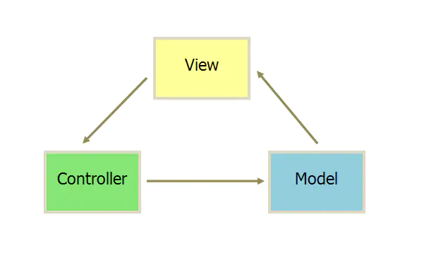
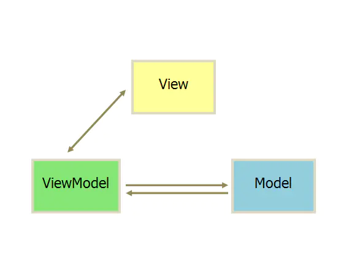

## 一.Vue的双向绑定


#### 背景知识

**▼MVC模式**

★MVC模式是单向绑定，即Model绑定到View，当我们用JavaScript代码更新Model时，View就会自动更新


**▼MVVM模式**

★MVVM 模式在于数据与视图的保持同步，意思是说数据改变时会自动更新视图，视图发生变化时会更新数据。

★我对于双向绑定的理解，就是用户更新了View，Model的数据也自动被更新了，这种情况就是双向绑定。再说细点，就是在单向绑定的基础上给可输入元素（input、textare等）添加了change(input)事件,(change事件触发，View的状态就被更新了)来动态修改model。  [简单示例](基础知识\基础.md)


#### 双向绑定的原理

🚩采用**数据劫持结合发布者-订阅者模式**的方式，通过**Object.defineProperty()**来劫持各个属性的setter，getter，在数据变动时发布消息给订阅者，触发相应的监听回调。


**▼实现过程**


我们已经知道实现数据的双向绑定，首先要对数据进行劫持监听，所以我们需要设置一个监听器Observer，用来监听所有属性。如果属性发上变化了，就需要告诉订阅者Watcher看是否需要更新。因为订阅者是有很多个，所以我们需要有一个消息订阅器Dep来专门收集这些订阅者，然后在监听器Observer和订阅者Watcher之间进行统一管理的。接着，我们还需要有一个指令解析器Compile，对每个节点元素进行扫描和解析，将相关指令（如v-model，v-on）对应初始化成一个订阅者Watcher，并替换模板数据或者绑定相应的函数，此时当订阅者Watcher接收到相应属性的变化，就会执行对应的更新函数，从而更新视图。因此接下去我们执行以下3个步骤，实现数据的双向绑定：

1. **实现一个监听器==Observer==，用来劫持并监听所有属性，如果有变动的，就通知订阅者。**

2. **实现一个订阅者==Watcher==，每一个Watcher都绑定一个更新函数，watcher可以收到属性的变化通知并执行相应的函数，从而更新视图。**

3. **实现一个解析器==Compile==，可以扫描和解析每个节点的相关指令(v-model，v-on等指令)，如果节点存在v-model，v-on等指令，则解析器Compile初始化这类节点的模板数据，使之可以显示在视图上，绑定相应的更新函数**


#### 实现步骤

##### 1.实现一个Observer

我们知道可以利用`Obeject.defineProperty()`来监听属性变动
那么需要对observe的数据对象进行递归遍历，包括子属性对象的属性，都加上 `setter`和`getter`
这样的话，**给这个对象的某个值赋值，就会触发`setter`，那么就能监听到了数据变化**。


监听到变化后我们便需要通过维护一个Dep数组收集watcher, 并且通知这些订阅者 dep.notify()

```js
function Observer(data) {
    this.data=data;
    this.walk(data);
}
function observe(value, vm) {
    if (!value||typeof value!=='object'){
        return;
    }
    return new Observer(value);
}

Observer.prototype={
    walk:function (data) {
        let self=this;
        Object.keys(data).forEach(function (key) {
            self.defineReactive(data,key,data[key]);
        });
    },
    defineReactive:function (data,key,val){
        let dep=new Dep();
        //递归遍历所有子属性
        let childObj=observe(val); //todo ?delete
        //该方法接收三个参数:要给其添加属性的对象、属性的名称和一个描述符对象。
        Object.defineProperty(data,key,{
            enumerable:true,
            configurable:true,
            get:function getter() {
                if (Dep.target){
                    //添加一个订阅者watcher
                    console.log(Dep.target);
                    dep.addSub(Dep.target);
                }
                return val;
            },
            //如果对一个对象属性值改变，就会触发setter中的dep.notify()
            //通知watcher（订阅者）数据变更，执行对应订阅者的更新函数，来更新视图
            set:function setter(newVal) {
                if (newVal===val){
                    return;
                }
                val=newVal;
                //新的值是object的话，进行监听
                childObj=observe(newVal);
                dep.notify();
            }
        })
    }

}

/*Dep is the data dependency of the subscriber Watcher*/
// 消息订阅器Dep，订阅器Dep主要负责收集订阅者，然后在属性变化的时候执行对应订阅者的更新函数
function Dep() {
    this.subs=[];
}
Dep.prototype={
    /**
     * [订阅器添加订阅者]
     * @param  {[Watcher]} sub [订阅者]
     */
    addSub:function (sub) {
        this.subs.push(sub);
    },
    // 通知订阅者数据变更
    notify:function () {
        this.subs.forEach(function (sub) {
            sub.update();
        })
    }
}
Dep.target=null;
```


##### 2.实现一个Watcher

1. 在自身实例化时往属性订阅器(dep)里面添加自己
2. 自身必须有一个update()方法
3. 待属性变动dep.notify()通知时，能调用自身的update()方法，并触发Compile中绑定的回调，则功成身退


```js
function Watcher(vm, exp, cb) {
    this.cb = cb;       //cb，就是Watcher绑定的更新函数。
    this.vm = vm;
    this.exp = exp;      //exp是node节点的v-model或v-on：click等指令的属性值
    this.value = this.get();  // 将自己添加到订阅器的操作
}

Watcher.prototype = {
    update: function() {
        this.run();
    },
    run: function() {
        var value = this.vm.data[this.exp];
        var oldVal = this.value;
        if (value !== oldVal) {
            this.value = value;
            this.cb.call(this.vm, value, oldVal);
        }
    },
    get: function() {
        Dep.target = this;  // 缓存自己
        var value = this.vm.data[this.exp]  //强制执行监听器里的get函数
        Dep.target = null;  // 释放自己
        return value;
    }
};
```

★`getter`方法执行的时候，就会在属性的订阅器`dep`添加当前watcher实例，从而在属性值有变化的时候，watcherInstance就能收到更新通知。


##### 3.实现一个Compile

解析器Compile实现步骤：

1. **解析模板指令(如v-model,v-on)，将模板中的变量替换成数据，然后初始化渲染页面视图**

2. **将模板指令对应的节点绑定对应的更新函数，初始化相应的订阅器**


**🌟详细:**

1.如果子节点含有v-指令，即是元素节点，则对这个元素添加监听事件。（如果是v-on，则node.addEventListener('click'），如果是v-model，则node.addEventListener('input'))。接着初始化模板元素，创建一个Watcher绑定这个元素节点。
 2.如果子节点是文本节点，即" {{ data }} ", 则用正则表达式取出" {{ data }} "中的data，然后var initText = this.vm[exp]，用initText去替代其中的data。


##### 4.实现一个MVVM


MVVM需要安排给Observer，Compile以及Watche做的事情如下

1. **Observer实现对MVVM自身model数据劫持，监听数据的属性变更，并在变动时进行notify**
2. **Compile实现指令解析，初始化视图，并订阅数据变化，绑定好更新函数**
3. **Watcher一方面接收Observer通过dep传递过来的数据变化，一方面通知Compile进行view update。**


