|      |      |      |      |
| ---- | ---- | ---- | ---- |
|      |      |      |      |


参考:

[用Markdown绘制图表 | typora中文网](https://www.typora.net/371.html)

[Typora也能做思维导图？做笔记的又一个绝佳选择？ (iseex.github.io)](https://iseex.github.io/2020-11/typora-diagram/)

[Online FlowChart & Diagrams Editor - Mermaid Live Editor (mermaid-js.github.io)](https://mermaid-js.github.io/mermaid-live-editor/edit#eyJjb2RlIjoiZ3JhcGggVERcbiAgICBBW0NocmlzdG1hc10gLS0-fEdldCBtb25leXwgQihHbyBzaG9wcGluZylcbiAgICBCIC0tPiBDe0xldCBtZSB0aGlua31cbiAgICBDIC0tPnxPbmV8IERbTGFwdG9wXVxuICAgIEMgLS0-fFR3b3wgRVtpUGhvbmVdXG4gICAgQyAtLT58VGhyZWV8IEZbZmE6ZmEtY2FyIENhcl1cbiAgIiwibWVybWFpZCI6IntcbiAgXCJ0aGVtZVwiOiBcImRlZmF1bHRcIlxufSIsInVwZGF0ZUVkaXRvciI6ZmFsc2UsImF1dG9TeW5jIjp0cnVlLCJ1cGRhdGVEaWFncmFtIjpmYWxzZX0)

###   思维导图

```mermaid
graph LR
A[青柠学术]-->B[博主]
A-->C[Up主]
A-->D[社群]
B-->E[公众号]
B-->F[知乎]
C-->H[B站]
C-->I[荔枝微课]
D-->J[知识星球]
D-->K[微信群]
```



<iframe height="498" style="width: 100%;" scrolling="no" title="🧩 Impossible Penrose Triangle Loader 🔺" src="https://codepen.io/indextwo/embed/Rwpxbgw?defaultTab=html%2Cresult" frameborder="no" loading="lazy" allowtransparency="true" allowfullscreen="true">
  See the Pen <a href="https://codepen.io/indextwo/pen/Rwpxbgw">
  🧩 Impossible Penrose Triangle Loader 🔺</a> by Lawrie (<a href="https://codepen.io/indextwo">@indextwo</a>)
  on <a href="https://codepen.io">CodePen</a>.
</iframe>


竖向

```mermaid
graph TD
A[青柠学术]-->B[博主]
A-->C[Up主]
A-->D[社群]
B-->E[公众号]
B-->F[知乎]
C-->H[B站]
C-->I[荔枝微课]
D-->J[知识星球]
D-->K[微信群]
```




### 流程图

[flowchart.js](http://flowchart.js.org/)


```flow
st=>start: Start
op=>operation: Your Operation
cond=>condition: Yes or No?
e=>end

st->op->cond
cond(yes)->e
cond(no)->op
```


```flow
st=>start: Start|past:>http://www.google.com[blank]
e=>end: End|future:>http://www.google.com
op1=>operation: My Operation|past
op2=>operation: Stuff|current
sub1=>subroutine: My Subroutine|invalid
cond=>condition: Yes
or No?|approved:>http://www.google.com
c2=>condition: Good idea|rejected
io=>inputoutput: catch something...|future

st->op1(right)->cond
cond(yes, right)->c2
cond(no)->sub1(left)->op1
c2(yes)->io->e
c2(no)->op2->e
```


### 序列图

[js-sequence-diagrams by bramp](https://bramp.github.io/js-sequence-diagrams/)

```sequence
Alice->Bob: Hello Bob, how are you?
Note right of Bob: Bob thinks
Bob-->Alice: I am good thanks!
```

```sequence
Title: Here is a title
A->B: Normal line
B-->C: Dashed line
C->>D: Open arrow
D-->>A: Dashed open arrow
```


```sequence
# Example of a comment.
Note left of A: Note to the\n left of A
Note right of A: Note to the\n right of A
Note over A: Note over A
Note over A,B: Note over both A and B
```


```sequence
participant C
participant B
participant A
Note right of A: By listing the participants\n you can change their order
```


Git add add


