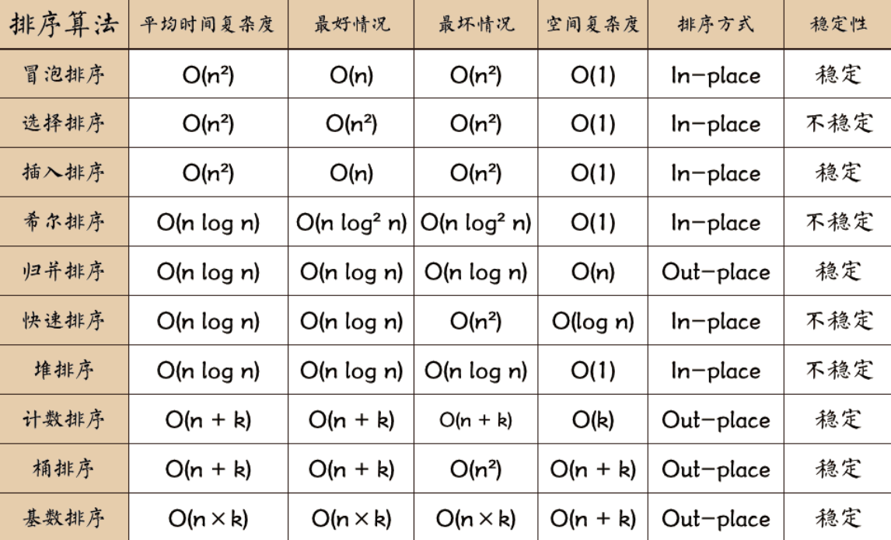
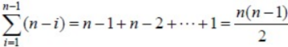
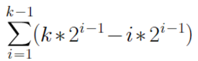
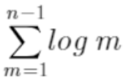
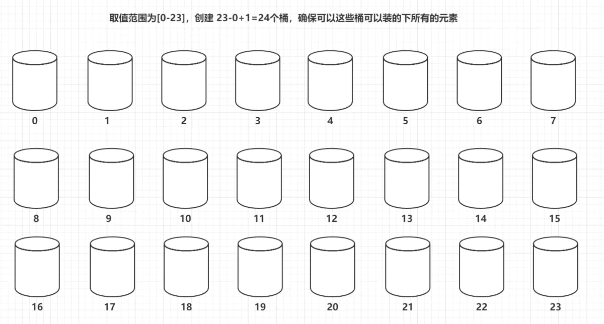
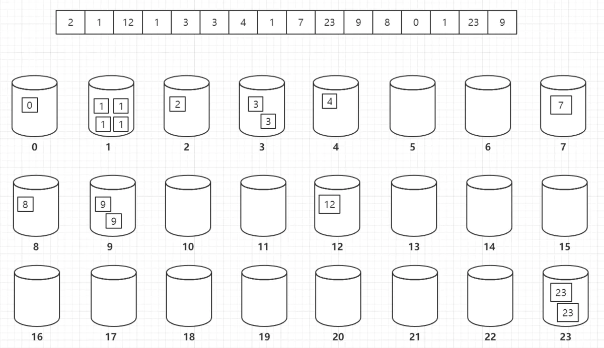

## 排序算法总结

[TOC]


排序算法可以分为**内部排序**和**外部排序**。

内部排序是数据记录在内存中进行排序。

而外部排序是因排序的数据很大，一次不能容纳全部的排序记录，在排序过程中需要访问外存。

常见的内部排序算法有：插入排序、希尔排序、选择排序、冒泡排序、归并排序、快速排序、堆排序、基数排序等。

用一张图概括：




**★IN-PLACE**

假如问题规模是n，在解决问题过程中，只开辟了常数量的空间，与n无关，这是原址操作，就是In-place

**★OUT-PLACE**

如果开辟的辅助空间与问题规模有关，则是out-place。
拿上面的例子来说，假设你把排序时把数组中的数按顺序放入了一个新的数组，我就开了一个n规模大小的数组，这个就与数据规模有关。


**稳定性**:假定在待排序的记录序列中，存在多个具有相同的关键字的记录，若经过排序，这些记录的相对次序保持不变，即在原序列中，r[i]=r[j]，且r[i]在r[j]之前，而在排序后的序列中，r[i]仍在r[j]之前，则称这种排序算法是稳定的；否则称为不稳定的。

对每种排序算法稳定性的解析:  👉  [排序算法稳定性_百度百科 (baidu.com)](https://baike.baidu.com/item/排序算法稳定性)

▼选择排序、快速排序、希尔排序、堆排序不是稳定的排序算法，而冒泡排序、插入排序、归并排序和基数排序是稳定的排序算法。


### 冒泡排序

★冒泡排序本质：**N个数，需要N-1趟，每趟需要比较N-i次（i是指第i趟）**

如10个数需要比9+8+7+6+5+4+3+2+1=45次

★冒泡排序的优点：每进行一趟排序，就会少比较一次，因为每进行一趟排序都会找出一个较大值。如上例：第一趟比较之后，排在最后的一个数一定是最大的一个数，第二趟排序的时候，只需要比较除了最后一个数以外的其他的数，同样也能找出一个最大的数排在参与第二趟比较的数后面，第三趟比较的时候，只需要比较除了最后两个数以外的其他的数，以此类推……也就是说，每进行一趟比较，每一趟少比较一次，一定程度上减少了算法的量

```js
/**
 * @param arr
 * @returns {*}
 */
/*冒泡排序 O(n^2)*/
const BubbleSort=(arr)=>{
    let isSorted=true;
    /*注意这里只需要n-1趟就行了!!!*/
    for (let i=0;i<arr.length-1;i++){
        /*优化一下,如果没有再进行交换就结束*/
        isSorted=true;
        /*每完成一趟都会选出一个极大值放在最后,所以可以少检查i个数*/
        for (let j=0;j<arr.length-1-i;j++){
            if (arr[j]>arr[j+1]){
                [arr[j],arr[j+1]]=[arr[j+1],arr[j]];
                isSorted=false;
            }
        }
        if (isSorted){  //表示没有再进行交换
            break;
        }
    }
    return arr;
}
```

▼稳定性:冒泡排序就是把小的元素往前调或者把大的元素往后调。比较是相邻的两个元素比较，交换也发生在这两个元素之间。所以，如果两个元素相等，我想你是不会再无聊地把他们俩交换一下的；如果两个相等的元素没有相邻，那么即使通过前面的两两交换把两个相邻起来，这时候也不会交换，所以相同元素的前后顺序并没有改 变，所以冒泡排序是一种稳定排序算法。


### 快速排序


自己的理解:


★其实这中间有重复的数字, 其实重复的那个数字只是暂时表示key枢纽值的位置, 方便在最后的时候替换!!!

JavaScript代码:

```js
/**
 * @param {Number[]} arr
 * @return {Number[]}
 */
const QuickSort=(arr)=>{

    const divide=(arr,low,high)=>{
        //每次假设arr[low]为key,不要写成arr[0],每次divide范围不同!
        let key=arr[low];
        while (low<high) {
            while (key <= arr[high] && low < high) high--;
            arr[low] = arr[high];
            while (key >= arr[low] && low < high) low++;
            arr[high] = arr[low];
        }
        arr[low]=key;
        return low;     //返回的是位置,不是key!!!
    }

    let sort=(arr,low,high)=>{
        /*这是一个递归的过程, 我们需要用if来表示执行递归的情况,别写成while了
        * 同时这里只需要对符合情况的进行排序而已, 就不用写if(不满足) return null了*/

        if (low<high){
            let  mid=divide(arr,low,high);
            sort(arr,low,mid-1);
            sort(arr,mid+1,high);
        }
    }

    sort(arr,0,arr.length-1)
    return  arr;
}
```

最优情况: 每次选取到的key刚好平分整个数组, 就是把数组刚好分为长度相等的两部分
t(n) = cn + 2t(n/2)
= cn + 2(cn/2 + 2t(n/4)) = 2cn + 4t(n/4)
= 2cn + 4(cn/4 + 2t(n/8)) = 3cn + 8t(n/8)
= icn + 2^i * t(n/(2^i))
当 2^i = n时, i = logn, 排序结束，
t(n) = cnlogn + n*t(1) = o(nlogn)
🌟可以理解为 logn层 , 每层会进行n次比较:  n * logn 

最坏情况: 完全有序, 待排序的序列为正序或者逆序，每次划分只得到一个比上一次划分少一个记录的子序列，注意另一个为空。如果递归树画出来，它就是一棵斜树。此时需要执行n‐1次递归调用，且第i次划分需要经过n‐i次关键字的比较才能找到第i个记录, 因此比较次数为

 

🌟可以理解为 n层 , 每层会进行n次比较:  n^2^ 


稳定性分析: 不稳定

▼在中枢元素和a[j]交换的时候，很有可能把前面的元素的稳定性打乱，比如序列为 5 3 3 4 3 8 9 10 11， 现在中枢元素5和3(第5个元素，下标从1开始计)交换就会把元素3的稳定性打乱，所以快速排序是一个不稳定的排序算法，不稳定发生在中枢元素和a[j] 交换的时刻


### 归并排序

**算法步骤**

1. 申请空间，使其大小为两个已经排序序列之和，该空间用来存放合并后的序列；
2. 设定两个指针，最初位置分别为两个已经排序序列的起始位置；
3. 比较两个指针所指向的元素，选择相对小的元素放入到合并空间，并移动指针到下一位置；
4. 重复步骤 3 直到某一指针达到序列尾；
5. 将另一序列剩下的所有元素直接复制到合并序列尾。

**时间复杂度分析**: O(nlogn):  拆分的时候会拆分logn层, 然后每一次merge都会有n次操作.  ★并且归并排序的时间复杂度十分稳定, 不管什么情况下都会进行相应的操作, 最好最坏都是O(nlogn)

**空间复杂度分析**:O(n)  归并的空间复杂度就是那个临时的数组(res)和递归时压入栈的数据占用的空间：n + logn；所以空间复杂度为: O(n)


```js
/*归并排序*/
/**
 * @param {Number[]} arr
 * @return {Number[]}
 */
const mergeSort=(arr)=>{
    const merge=(left,right)=>{
        let result=[];
        while (left.length>0&&right.length>0){
            left[0]<right[0]? result.push(left.shift()) : result.push(right.shift());
        }
        return result.concat(left,right);
    }

    /*递归进行拆分,然后返回时进行merge*/
    const sort=(arr)=>{
        if (arr.length<=1){  //小于的情况也要考虑进去!!!
            return arr;
        }
        let mid=Math.floor(arr.length/2);
        return merge(sort(arr.slice(0,mid)),sort(arr.slice(mid)))
    }

    return sort(arr);
}
```

❗❗❗注意不要写 (arr.length-1)/2 因为这样的话如果最后只剩下两个数, slice(0,0)返回的是[] , 而 slice(0)返回的是[a,b] 这样会永远递归下去💣

(arr.length-1)/2取得是中位数中较小的那一个, 而slice [ ) 左开右闭


### 堆排序

**基本思想**:堆排序的基本思想是：将待排序序列构造成一个大顶堆，此时，整个序列的最大值就是堆顶的根节点。将其与末尾元素进行交换，此时末尾就为最大值。然后将剩余n-1个元素重新构造成一个堆，这样会得到n个元素的次小值。如此反复执行，便能得到一个有序序列了


关于堆的详细介绍: 👉  [堆](https://www.cnblogs.com/chengxiao/p/6129630.html)

- 堆是一个**完全二叉树。**

- 完全二叉树： 二叉树除开最后一层，其他层结点数都达到最大，最后一层的所有结点都集中在左边（左边结点排列满的情况下，右边才能缺失结点）。

- **堆**

  　　**堆是具有以下性质的完全二叉树：每个结点的值都大于或等于其左右孩子结点的值，称为大顶堆；或者每个结点的值都小于或等于其左右孩子结点的值，称为小顶堆。如下图：**

  

  同时，我们对堆中的结点按层进行编号，将这种逻辑结构映射到数组中就是下面这个样子

  

  该数组从逻辑上讲就是一个堆结构，我们用简单的公式来描述一下堆的定义就是：

  **大顶堆：arr[i] >= arr[2i+1] && arr[i] >= arr[2i+2]**  

  **小顶堆：arr[i] <= arr[2i+1] && arr[i] <= arr[2i+2]**  


**算法步骤:**

1. **将无序序列构建成一个堆，根据升序降序需求选择大顶堆或小顶堆;**
2. **将堆顶元素与末尾元素交换，将最大元素"沉"到数组末端;**
3. **重新调整结构，使其满足堆定义，然后继续交换堆顶元素与当前末尾元素，反复执行调整+交换步骤，直到整个序列有序。**


**时间复杂度**:O(nlogn)      空间复杂度:O(1)

**初始化堆的时间复杂度分析**

初始化堆的时候，对于每个非叶子结点，都要调用上述函数，将它与它的孩子结点进行比较和交换，顺序是从后向前。

以操作2作为基本操作，对每一层都完全铺满的堆进行分析，

设元素个数为n，则堆的高度k=log（n+1）≈log n，非叶子结点的个数为2^（k-1）-1

假设每个非叶子结点都需要进行调整，则第i层的非叶子结点需要的操作次数为k-i，

第i层共有2^（i-1）个结点，则第i层的所有结点所做的操作为k*2^（i-1）- i*2^（i-1），

共k-1层非叶子结点，总的操作次数为 

　　　　

化简可得，上式=2^k-k+1，将k=log（n+1）≈log n代入，得n - log n +1，

所以，初始化堆的复杂度为O(n)

**调整堆的时间复杂度分析**

调整堆的复杂度计算和初始化堆差不多，

假设根节点和排在最后的序号为m的叶子结点交换，并进行调整，那么调整的操作次数 = 原来m结点所在的层数 = 堆的高度（因为m结点在堆的最后）= log m

共n个结点，调整的总操作次数为

　　　　　

 

化简可得，上式=log (n-1)! ≈ n*log n

 所以，调整堆的复杂度为O(n*log n)

 

★因此,总体复杂度为**O(n*log n)**   (以调整堆的时间复杂度为主)

```js
/**
 * @param {Number[]} arr
 * @return {Number[]}
 */
const heapSort=(arr)=>{
    /*构造当前结点i下的大顶堆*/
    const maxHeap=(i,len)=>{
        /*1. 2*i+1是i的左子树的索引;
         *2. len的存在是因为每找到一个max值后都会放在arr最后然后len-1
         *3. j=2*j+1是因为要保证i下面所有的结点都构成大顶堆*/
        for (let j=2*i+1;j<len;j=2*j+1){
            /*如果右子树更大则比较当前节点和右子树,而且我们不需要关心未交换的那一颗子树的情况,
            因为在后面的排序中我们是自底向上,如果当前子树的根节点未被改变,则它还是一个大顶堆*/
            if (j+1<len&&arr[j]<arr[j+1]){
                j++;
            }
            if (arr[i]<arr[j]){
                [arr[i],arr[j]]=[arr[j],arr[i]];
                //★这里i变成j继续往下探索
                i=j;
            }
            else {
                break;
            }
        }
    }

    const sort=()=>{
        /*初始化大顶堆,从第一个非叶子结点开始(i要能够等于0,因为根结点也需要进行比较)*/
        for (let i=Math.floor( (arr.length-1)/2 );i>=0;i--){
            maxHeap(i,arr.length);
        }
        /*i>0是因为最后只剩一个数时不需要在进行比较了*/
        for (let i=arr.length-1;i>0;i--){
            [arr[i],arr[0]]=[arr[0],arr[i]];   /*根节点与最后一个节点交换*/
            /*因为最后一个结点已经交换,所以arr长度会减一,这里刚好就是i*/
            maxHeap(0,i);
        }
    }

    sort();
    return arr;
}
```

step1: 以索引 i(根节点) , 长度 len为参数写建立大顶堆的函数 maxHeap(i,len)  <span style='color:brown;'> (实质上是对索引在i到len的数进行调整) </span>

step2: 初始化大顶堆 

step3: 通过maxHeap不断选出极大的数来排好序


#### **堆结构实现**  大小顶堆通用(更换cmp方法)

```js
const maxHeapCmp=(x,y)=>x>y;  //最大堆
const swap=(arr,i,j)=>([arr[i], arr[j]] = [arr[j], arr[i]]);
class Heap{
    /*默认最大堆*/
    constructor(cmp=maxHeapCmp) {
        this.container=[];
        this.cmp=cmp;
    }

    insert(data){
        const  {container,cmp}=this;
        container.push(data);
        let index=container.length-1;
        //建立大顶堆/小顶堆
        while (index) {
            let parent = Math.floor((index - 1) / 2);
            if (!cmp(container[index],container[parent])){
                return;
            }
            swap(container,index,parent);
            index=parent;
        }
    }

    extract(){
        const  {container,cmp}=this;
        if (!container.length) return null;
        swap(container,0,container.length-1);
        const res=container.pop();  //得到结果

        //调整堆
        const length=container.length;
        let index=0,exchange=index*2+1;
        while (exchange<length){
            //由比较函数确定大小顶堆. 如果这里是大顶堆,则需要大的,
            // 所以我们判断的是右节点是否大于左节点
            if (exchange+1<length && cmp(container[exchange+1],container[exchange])){
                exchange++;
            }
            if (cmp(container[exchange],container[index])){
                swap(container,exchange,index);
                index=exchange;
                exchange=exchange*2+1;
            }else {   //这是建立在原本下面的都是大顶堆的情况,所以可以break
                break;
            }
        }
        return res;
    }

    top(){
        return  this.container.length? this.container[0]:null;
    }

}
```


### 桶排序


#### 1. 桶排序的思想

(1) 得到无序数组的取值范围


(2) 根据取值范围"创建"对应数量的"桶"



(3) 遍历数组，把每个元素放到对应的"桶"中



(4) 按照顺序遍历桶中的每个元素，依次放到数组中，即可完成数组的排序。

"桶"是一种容器，这个容器可以用多种数据结构实现，包括数组、队列或者栈。

#### 2. 复杂度

- **时间复杂度**：遍历数组求最大值最小值为O(n)，遍历数组放入"桶"中复杂度为O(n)，遍历桶取出每个值的复杂度为O(n)，最终的时间复杂度为O(3n)，也就是O(n)
- **空间复杂度**：额外的空间取决于元素的取值范围，总的来说为O(n)
- **稳定性**：桶排序是否稳定取决于"桶"用什么数据结构实现，如果是队列，那么可以保证相同的元素"取出去"后的相对位置与"放进来"之前是相同的，即排序是稳定的，而如果用栈来实现"桶"，则排序一定是不稳定的，因为桶排序可以做到稳定，所以桶排序是稳定的排序算法


 

 

 


