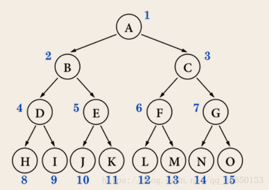

★二叉树各种leetcode [题解](https://leetcode-cn.com/problems/increasing-order-search-tree/solution/yi-tao-quan-fa-shua-diao-nge-bian-li-shu-de-wen-3/)    [树算法的套路框架](https://leetcode-cn.com/problems/same-tree/solution/xie-shu-suan-fa-de-tao-lu-kuang-jia-by-wei-lai-bu-/)


### 基本概念

####  二叉树的性质

1. 若二叉树的层次从0开始，则在二叉树的第i层至多有2^i个结点(i>=0)。
2. 高度为k的二叉树最多有2^(k+1) - 1个结点(k>=-1)。 (空树的高度为-1)
3. 对任何一棵二叉树，如果其叶子结点(度为0)数为m, 度为2的结点数为n, 则m = n + 1。


#### 完美二叉树(perfect)

一个深度为k(>=-1)且有2^(k+1) - 1个结点的二叉树称为**完美二叉树** (perfect binary tree)
换句话说：树是满的，还是二叉的 (就是常说的满二叉树)
图是这样的：



#### 完全二叉树(Complete)

完全二叉树从根结点到倒数第二层满足完美二叉树，最后一层可以不完全填充，其叶子结点都靠左对齐

下图就**不是**一棵完全(Complete)二叉树


#### 完满二叉树(full)

所有非叶子结点的度都是2
换句话说：只要你有孩子，你就必然是有**两个**孩子。

 


合集:


#### 二叉搜索树BST

[二叉查找树](https://baike.baidu.com/item/二叉查找树/7077965)（**Binary Search Tree**），（又：二叉搜索树，二叉排序树）它或者是一棵空树，或者是具有下列性质的[二叉树](https://baike.baidu.com/item/二叉树/1602879)： 若它的左子树不空，则左子树上所有结点的值均小于它的[根结点](https://baike.baidu.com/item/根结点/9795570)的值； 若它的右子树不空，则右子树上所有结点的值均大于它的根结点的值； 它的左、右子树也分别为[二叉排序树](https://baike.baidu.com/item/二叉排序树/10905079)。二叉搜索树作为一种经典的数据结构，它既有链表的快速插入与删除操作的特点，又有数组快速查找的优势；所以应用十分广泛，例如在文件系统和数据库系统一般会采用这种数据结构进行高效率的排序与检索操作。


### 基础题

二叉树的三种遍历:


#### [100. 相同的树](https://leetcode-cn.com/problems/same-tree/)

难度简单577收藏分享切换为英文接收动态反馈

给你两棵二叉树的根节点 `p` 和 `q` ，编写一个函数来检验这两棵树是否相同。

如果两个树在结构上相同，并且节点具有相同的值，则认为它们是相同的。

**提示：**

- 两棵树上的节点数目都在范围 `[0, 100]` 内
- `-104 <= Node.val <= 104`


```js
/**
 * Definition for a binary tree node.
 * function TreeNode(val, left, right) {
 *     this.val = (val===undefined ? 0 : val)
 *     this.left = (left===undefined ? null : left)
 *     this.right = (right===undefined ? null : right)
 * }
 */
/**
 * @param {TreeNode} p
 * @param {TreeNode} q
 * @return {boolean}
 */
//way1: DFS
var isSameTree = function(p, q) {
    if(p==null&&q==null){
        return true;
    }
    if(p==null||q==null){
        return false;
    }
    return p.val===q.val&&isSameTree(p.left,q.left)&&isSameTree(p.right,q.right);
};

//way2: BFS
var isSameTree = function(p, q) {
    //BFS
    let queP=[p],queQ=[q];
    let curP,curQ;
    while(queP.length&&queQ.length){
        curP=queP.shift();
        curQ=queQ.shift();
        //注意这里并不是就表示结束了,因为队列中会添加很多null结点进行比较
        if(curP==null&&curQ==null){
            continue;
        }
        if(curP==null||curQ==null){
            return false;
        }
        if(curP.val!==curQ.val){
            return false;
        }
        //继续寻找,并将子节点入队
        queP.push(curP.left); 
        queP.push(curP.right);

        queQ.push(curQ.left);
        queQ.push(curQ.right);
    }
    return true;
};
```

