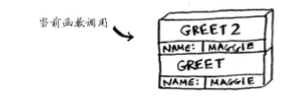

[TOC]


## 递归与尾递归

**1、递归**

　　关于递归的概念，我们都不陌生。简单的来说递归就是一个函数直接或间接地调用自身，是为直接或间接递归。一般来说，递归需要有边界条件、递归前进段和递归返回段。当边界条件不满足时，递归前进；当边界条件满足时，递归返回。用递归需要注意以下两点：**(1) 递归就是在过程或函数里调用自身。(2) 在使用递归策略时，必须有一个明确的递归结束条件，称为递归出口。**


递归一般用于解决三类问题：

　 **(1)数据的定义是按递归定义的。（Fibonacci函数，n的阶乘）**

　  **(2)问题解法按递归实现。（回溯）**

　  **(3)数据的结构形式是按递归定义的。（二叉树的遍历，图的搜索）**

递归的缺点：

　　递归解题相对常用的算法如普通循环等，运行效率较低。因此，应该尽量避免使用递归，除非没有更好的算法或者某种特定情况，递归更为适合的时候。**在递归调用的过程当中系统为每一层的返回点、局部量等开辟了栈来存储，因此递归次数过多容易造成栈溢出。**

　　用线性递归实现Fibonacci函数，程序如下所示：

```c
int FibonacciRecursive(int n)
{
    if( n < 2)
        return n;
    return (FibonacciRecursive(n-1)+FibonacciRecursive(n-2));
}
```

递归写的代码非常容易懂，完全是根据函数的条件进行选择计算机步骤。例如现在要计算n=5时的值，递归调用过程如下图所示：


**2、尾递归**

　　顾名思义，尾递归就是从最后开始计算, 每递归一次就算出相应的结果, 也就是说, 函数调用出现在调用者函数的尾部, 因为是尾部, 所以根本没有必要去保存任何局部变量. 直接让被调用的函数返回时越过调用者, 返回到调用者的调用者去。**尾递归就是把当前的运算结果（或路径）放在参数里传给下层函数**，深层函数所面对的不是越来越简单的问题，而是越来越复杂的问题，因为参数里带有前面若干步的运算路径。

　　尾递归是极其重要的，不用尾递归，函数的堆栈耗用难以估量，需要保存很多中间函数的堆栈。比如f(n, sum) = f(n-1) + value(n) + sum; 会保存n个函数调用堆栈，而使用尾递归f(n, sum) = f(n-1, sum+value(n)); 这样则只保留后一个函数堆栈即可，之前的可优化删去。

　　采用尾递归实现Fibonacci函数，程序如下所示：

```
1 int FibonacciTailRecursive(int n,int ret1,int ret2)
2 {
3    if(n==0)
4       return ret1; 
5     return FibonacciTailRecursive(n-1,ret2,ret1+ret2);
6 }
```

例如现在要计算n=5时的值，尾递归调用过程如下图所示：

从图可以看出，为递归不需要向上返回了，但是需要引入而外的两个空间来保持当前的结果。


## 递归调用栈


调用栈

调用栈（英语：Call stack，英文直接简称为“栈”（the stack））别称有：执行栈（execution stack）、控制栈（control stack）、运行时栈（run-time stack）与机器栈（machine stack），是[计算机科学](https://baike.baidu.com/item/计算机科学)中存储有关正在运行的[子程序](https://baike.baidu.com/item/子程序)的消息的[栈](https://baike.baidu.com/item/栈)。有时仅称“栈”，但栈中不一定仅存储子程序消息。几乎所有[计算机程序](https://baike.baidu.com/item/计算机程序)都依赖于调用栈，然而[高级语言](https://baike.baidu.com/item/高级语言)一般将调用栈的细节隐藏至后台。


调用栈最经常被用于存放子程序的返回地址。在调用任何子程序时，主程序都必须暂存子程序运行完毕后应该返回到的地址。因此，如果被调用的子程序还要调用其他的子程序，其自身的返回地址就必须存入调用栈，在其自身运行完毕后再行取回。在递归程序中，每一层次递归都必须在调用栈上增加一条地址，因此如果程序出现无限递归（或仅仅是过多的递归层次），调用栈就会产生栈溢出。


计算机在内部使用调用栈的栈，我们来看看是如何使用调用栈的。下面是一个函数

```python
def great(name):

    print("hello, "+name+"!")

    great2(name)

    print("getting ready to say bye...")

    bye()
```

而另外两个函数：


```python
def greet2(name):

  print("how are you, "+name+"?")

def bye():

  print("ok bye!")
```

开始执行时，比如调用greet("maggie"),计算机首先为该函数调用分配一块内存，将变量name设为maggie


接下来， 你打印hello, maggie!，再调用greet2("maggie")。同样，计算机也为这个函数调用分配一 块内存。

 

计算机使用一个栈来表示这些内存块，其中第二个内存块位于第一个内存块上面。你打印 how are you, maggie?，然后从函数调用返回。此时，栈顶的内存块被弹出。

 


现在，栈顶的内存块是函数greet的，这意味着你返回到了函数greet。当你调用函数greet2 时，函数greet只执行了一部分。这是本节的一个重要概念：调用另一个函数时，当前函数暂停 并处于未完成状态。该函数的所有变量的值都还在内存中。执行完函数greet2后，你回到函数 greet，并从离开的地方开始接着往下执行：首先打印getting ready to say bye…，再调用 函数bye。

 


在栈顶添加了函数bye的内存块。然后，你打印ok bye!，并从这个函数返回

 


