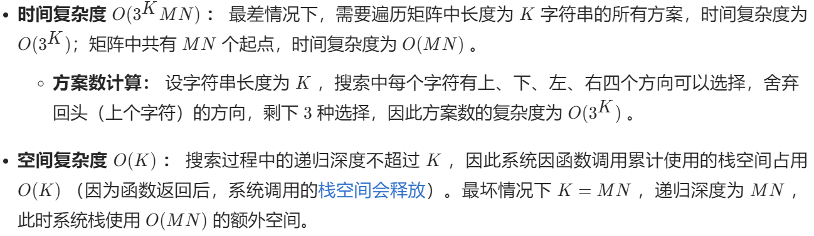
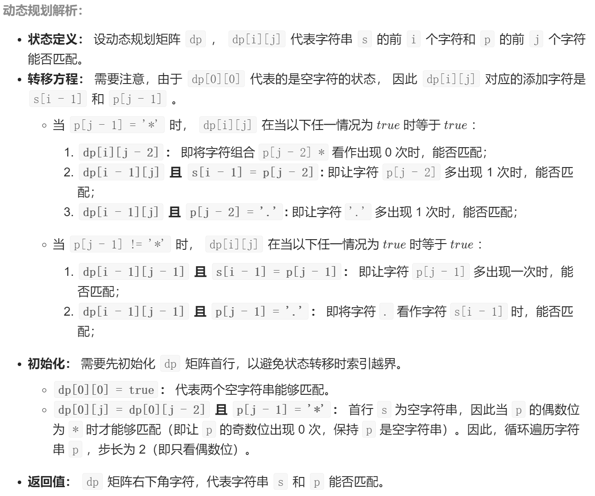
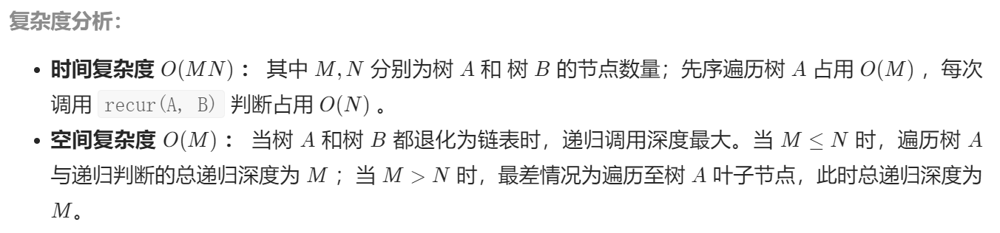
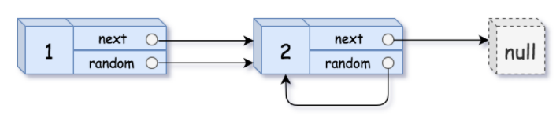
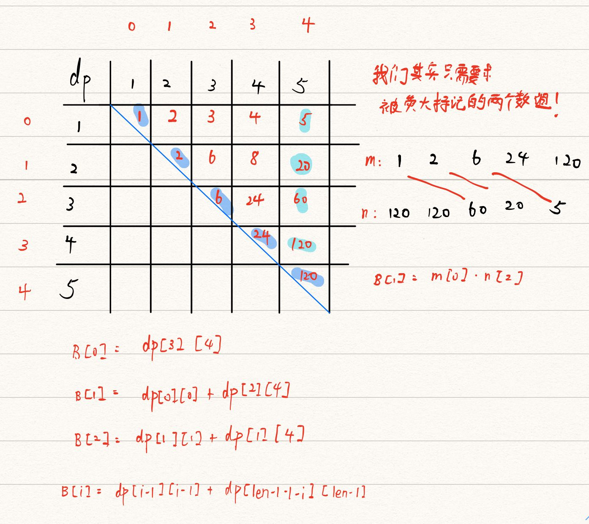

# Sword-for-offer


### 基础

#### [剑指 Offer 03. 数组中重复的数字](https://leetcode-cn.com/problems/shu-zu-zhong-zhong-fu-de-shu-zi-lcof/)

找出数组中重复的数字。


在一个长度为 n 的数组 nums 里的所有数字都在 0～n-1 的范围内。数组中某些数字是重复的，但不知道有几个数字重复了，也不知道每个数字重复了几次。请找出数组中任意一个重复的数字。

示例 1：

输入：
[2, 3, 1, 0, 2, 5, 3]
输出：2 或 3 


限制：

2 <= n <= 100000

```js
var findRepeatNumber = function(nums) {
    //way1: 哈希表  时间复杂度:O(n)  空间复杂度:O(n)
    // let hashMap=[];
    // for (const num of nums) {
    //     if (!hashMap[num]){
    //         hashMap[num]=true;
    //     }else{
    //         return num;
    //     }
    // }

    //way2 时间复杂度:O(n)  空间复杂度:O(1)
    let key;
    for(let i=0;i<nums.length;i++){
        key=nums[i];

        while(key!==i){
            if(nums[key]===key){
                return key;
            }
            [nums[i], nums[key]] =[nums[key],nums[i]];
            key=nums[key];
        }
    }

};
```

 

★主要是理解一下way2的思想, 充分利用题目中给出的性质


#### [剑指 Offer 05. 替换空格](https://leetcode-cn.com/problems/ti-huan-kong-ge-lcof/)

请实现一个函数，把字符串 s 中的每个空格替换成"%20"。

示例 1：

输入：s = "We are happy."
输出："We%20are%20happy."


限制：

0 <= s 的长度 <= 10000


**way1:遍历添加** 

时间复杂度: O(n)  空间复杂度: O(n)

```js
/**
 * @param {string} s
 * @return {string}
 */
var replaceSpace = function(s) {
    let res="";
    for(let i=0;i<s.length;i++){
        if(s[i]===" "){
            res+="%20";
            continue;
        }
        else{
            res+=s[i];
        }
    }
    return res;
};
```


 

**way2: 使用正则表达式**

```js
var replaceSpace = function(s) {
    return s.replace(/ /g,"%20");
    //return s.replace(/\s/g,"%20");
};
//要特别注意这个replace的用法，如果不写正则，
    return s.replace(' ','%20');//只会替换部分
    return s.replace(/^\s/g,'%20'); //不能通过
    return s.replace(/^\s+/g,'%20'); //"   " 多个空格不能通过

//way3, 利用split和join函数
var replaceSpace = function(s) {
    return s.split(" ").join("%20");
};
```


#### [剑指 Offer 06. 从尾到头打印链表](https://leetcode-cn.com/problems/cong-wei-dao-tou-da-yin-lian-biao-lcof/)

输入一个链表的头节点，从尾到头反过来返回每个节点的值（用数组返回）。

示例 1：

输入：head = [1,3,2]
输出：[2,3,1]


限制：

0 <= 链表长度 <= 10000

```js
/**
 * Definition for singly-linked list.
 * function ListNode(val) {
 *     this.val = val;
 *     this.next = null;
 * }
 */
/**
 * @param {ListNode} head
 * @return {number[]}
 */

//way1:递归  时间复杂度: O(n)  空间复杂度:O(n)
var reversePrint = function(head) {
    if (head==null){
        return []
    }
    let arr=reversePrint(head.next);
    arr.push(head.val);
    return arr;
};

//way2: 使用unshift每次在头部插入数据
var reversePrint = function(head) {
    let p=head;
    let res=[];
    
    while(p){
        res.unshift(p.val);
        p=p.next;
    }
    return res;
};
```

牛客重刷:

```js
/*function ListNode(x){
    this.val = x;
    this.next = null;
}*/
function printListFromTailToHead(head)
{
    if(!head) return [];
    return printListFromTailToHead(head.next).concat([head.val]);
}
module.exports = {
    printListFromTailToHead : printListFromTailToHead
};
```

★使用concat使代码更简洁


#### [剑指 Offer 07. 重建二叉树](https://leetcode-cn.com/problems/zhong-jian-er-cha-shu-lcof/)

* 输入某二叉树的前序遍历和中序遍历的结果，请重建该二叉树。假设输入的前序遍历和中序遍历的结果中都不含重复的数字。

例如，给出

前序遍历 preorder = [3,9,20,15,7]
中序遍历 inorder    = [9,3,15,20,7]
返回如下的二叉树：

​    3
   / \
  9  20
​    /  \
   15   7


限制：

0 <= 节点个数 <= 5000

递归

**复杂度分析**

- 时间复杂度：*O*(*n*)。对于每个节点都有创建过程以及根据左右子树重建过程。
- 空间复杂度：*O*(*n*)。存储整棵树的开销。

 

我们只需要使用3个指针即可。

**🌟一个是preStart，他表示的是前序遍历开始的位置 (因为我们需要通过前序遍历来找到根节点)**

**🌟一个是inStart，他表示的是中序遍历开始的位置**

**🌟一个是inEnd，他表示的是中序遍历结束的位置**

我们主要是对中序遍历的数组进行拆解，下面就以下面的这棵树来画个图分析下


他的前序遍历是：[3,9,8,5,2,20,15,7]

他的中序遍历是：[5,8,9,2,3,15,20,7]


​        <span style='color:red; font-weight:bold;'> ▼可以发现这里会递归到把叶节点的左右子树都赋值为null </span>

▼这里只要找到了前序遍历的结点在中序遍历的位置，我们就可以把中序遍历数组分解为两部分了。
如果**index是前序遍历的某个值在中序遍历数组中的索引**，以index为根节点划分的话，那么中序遍历中

 

[0，index-1]就是根节点左子树的所有节点，
[index+1，inorder.length-1]就是根节点右子树的所有节点。


中序遍历好划分，那么前序遍历呢，如果是左子树：
preStart=preStart+1；                                   //这代表左子树的根节点在先序遍历中的位置

 

如果是右子树就稍微麻烦点，
preStart=preStart+(index-instart+1)；        //这代表右子树的根节点在先序遍历中的位置

 

★preStart是当前节点比如m先序遍历开始的位置，index-instart+1就是当前节点m左子树的数量加上当前节点的数量，所以preStart+(index-instart+1)就是当前节点m右子树前序遍历开始的位置


```js
/**
 * @param {number[]} preorder
 * @param {number[]} inorder
 * @return {TreeNode}
 */

function TreeNode(val){
    this.val=val;
    this.left=this.right=null;
    // console.log(this);  注意一下this!!!
}

let buildTree = function(preOrder, inOrder){
    //注意一下dfs需要的参数!!!
    //这个dfs会每次生成一个新节点,并继续向下延伸
    let dfs=(preStart,inStart,inEnd)=>{
        if (preStart>preOrder.length-1||inStart>inEnd){
            /*注意不满足条件的话需要返回null哦!!!*/
            return null;
        }
        //为当前结点赋值,注意要用new,使其变为一个可以操作的实例!!!
        let root=new TreeNode(preOrder[preStart]);
        /*找到当前节点root在中序遍历中的位置，然后再把数组分两半*/
        let index=inOrder.indexOf(root.val);
        root.left=dfs(preStart+1,inStart,index-1);
        root.right=dfs(preStart+index-inStart+1,index+1,inEnd);
        return root;
    }
    return dfs(0,0,inOrder.length-1);
}
```

▼牛客重刷

```js
/* function TreeNode(x) {
    this.val = x;
    this.left = null;
    this.right = null;
} */

function TreeNode(val){
    this.val=val;
    this.left=this.right=null;
    // console.log(this);  注意一下this!!!
}
function reConstructBinaryTree(pre, vin){
    
    const rebuild=(preIndex,inStart,inEnd)=>{
        if(inStart>inEnd) return null;
            
        let index=vin.indexOf(pre[preIndex]);
        let node=new TreeNode(pre[preIndex]);
        node.left=rebuild(preIndex+1,inStart,index-1);
        node.right=rebuild(preIndex+index-inStart+1,index+1,inEnd);
        return node;
    }
    
    return rebuild(0,0,vin.length-1);
}
module.exports = {
    reConstructBinaryTree : reConstructBinaryTree
};
```

🌟二刷心得:

1. 建议画图理解!!!
2. 之前的(preStart>preOrder.length-1 条件可以省略!! inStart和inEnd都是严格对应顺序的, 所以不用担心pre超过限制


#### [剑指 Offer 09. 用两个栈实现队列](https://leetcode-cn.com/problems/yong-liang-ge-zhan-shi-xian-dui-lie-lcof/)

用两个栈实现一个队列。队列的声明如下，请实现它的两个函数 appendTail 和 deleteHead ，分别完成在队列尾部插入整数和在队列头部删除整数的功能。(若队列中没有元素，deleteHead 操作返回 -1 )

 

示例 1：

输入：
["CQueue","appendTail","deleteHead","deleteHead"]
[[],[3],[],[]]
输出：[null,null,3,-1]
示例 2：

输入：
["CQueue","deleteHead","appendTail","appendTail","deleteHead","deleteHead"]
[[],[],[5],[2],[],[]]
输出：[null,-1,null,null,5,2]
提示：

1 <= values <= 10000
最多会对 appendTail、deleteHead 进行 10000 次调用


```js
var CQueue = function () {
    this.statck1 = [];
    this.statck2 = []
};

/** 
 * @param {number} value
 * @return {void}
 */
CQueue.prototype.appendTail = function (value) {
    this.statck1.push(value)
    return null
};

/**
 * @return {number}
 */
CQueue.prototype.deleteHead = function () {
	//如果有,则直接从当前的stack2中取
    if(this.statck2.length){
        return this.statck2.pop();
    }
    while (val = this.statck1.pop()) {
        this.statck2.push(val)
    }

    return this.statck2.pop()||-1;
};

/**
 * Your CQueue object will be instantiated and called as such:
 * var obj = new CQueue()
 * obj.appendTail(value)
 * var param_2 = obj.deleteHead()
 */
```

#### [剑指 Offer 10- I. 斐波那契数列](https://leetcode-cn.com/problems/fei-bo-na-qi-shu-lie-lcof/)

写一个函数，输入 n ，求斐波那契（Fibonacci）数列的第 n 项（即 F(N)）。斐波那契数列的定义如下：

F(0) = 0,   F(1) = 1
F(N) = F(N - 1) + F(N - 2), 其中 N > 1.
斐波那契数列由 0 和 1 开始，之后的斐波那契数就是由之前的两数相加而得出。

答案需要取模 1e9+7（1000000007），如计算初始结果为：1000000008，请返回 1。

示例 1：

输入：n = 2
输出：1
示例 2：

输入：n = 5
输出：5


提示：

0 <= n <= 100

```js
/**
 * @param {number} n
 * @return {number}
 */
var fib = function(n) { 
    //way1.非常普通，没有优化的递归通项公式解法

    //优点：非常容易想到，fib在不加额外参数且不引入外部变量的情况下只能这么调用自身
    //缺点：fib会重复计算之前的项，计算结果是一次性的，极其浪费时间和空间，在本题必定超时，完全无法通过

    /*
        if(n<=1)return n;
        return ( fib(n-1) + fib(n-2) ) % 1000000007;
    */

    //way2.普通的尾调用自身（尾递归）+ES6尾调用优化解法

    //优点：不创建新的栈帧，现有栈帧被重复利用，不会爆栈，性能比未经优化的递归明显提高
    //缺点：需要反复清除栈帧的数据，性能不如下面的循环解法

    /*
    //这里由于n从0开始, 所以fib序列为: 0,1,1,2,3,5...
    //在n=3之前都是已确定的,所以当n=3时才会有第一次递归。每一次递归都是一次加法，从1+1为第一次开始总共需要n-2次加法，所以n=2时就刚好可以返回最后的结果
        function f(n,a=1,b=1){
            if(n<=1) return n;
            if(n==2) return b ;
            return f(n-1,b,(a+b) % 1000000007);    //最后一步，调用自身，将数据处理的步骤变成参数的变化
        }
        return f(n);
    */
    
    
    //way3 不错的递归+动态规划解法

    //优点：空间换时间，所有计算结果都被缓存，下一次计算直接读取缓存结果，性能比较好
    //缺点：需要额外的储存空间，空间复杂度高

    //注：动态规划的思想是，通过保存中间计算结果，减少结果计算时间

    /*
        let dp = [0,1]
        function f(n){
            if(dp[n]!=undefined){
                return dp[n];
            }
            //利用数组存储中间值
            dp[n] = f(n-1) + f(n-2);
            return dp[n] % 1000000007;
        }
        return f(n);
    */
    
    //way4.很好的循环计算解法

    //优点：每一次计算结果都能得到利用，易于理解，只保存前两个计算结果，性能最优
    //缺点：没有明显的缺点，在本题中记得看清题目中取模的要求
    
    /*
    if(n<=1){
        return n;
    }
    let a=0,b=1;
    let c=0;
    //把序列0,1当作固定, 从n=2开始进行
    while(n-->=2){
        c=(a+b)%(1e9+7);
        a=b;
        b=c;
    }
    return b;
    */
    
    //while循环也可以简化一下,但这种写法在leetcode上性能比上面的差
    /*
    if(n<=1){
        return n;
    }
    let a=0,b=1;
    while(n-->=2){
        [a,b]=[b,(a+b)%(1e9+7)];
    }
    return b;
    */
    
    
    

```

🌟关于 => [尾递归](D:\Study\Algorithm\Notes-Typora\Base\递归理解.md)


#### [剑指 Offer 10- II. 青蛙跳台阶问题](https://leetcode-cn.com/problems/qing-wa-tiao-tai-jie-wen-ti-lcof/)

<span id="frog">一只青蛙</span>一次可以跳上1级台阶，也可以跳上2级台阶。求该青蛙跳上一个 n 级的台阶总共有多少种跳法。

答案需要取模 1e9+7（1000000007），如计算初始结果为：1000000008，请返回 1。

示例 1：

输入：n = 2
输出：2
示例 2：

输入：n = 7
输出：21
示例 3：

输入：n = 0
输出：1
提示：

0 <= n <= 100

🌟实际上就是换了壳的斐波那契, 但是要注意这里n是从0开始(动态规划)

**复杂度分析：**

* 时间复杂度 **O(N)** ： 计算 f(n)需循环 n 次，每轮循环内计算操作使用 O(1)O(1) 。
* 空间复杂度 **O(1)** ： 几个标志变量使用常数大小的额外空间
* 


```javascript
/**
 * @param {number} n
 * @return {number}
 */
var numWays = function(n) {  
   let a=b=1,c=0;
    //有n个数要加n次,  n>=1 ,第一次是1+0,相当于没加,但还是有n次加法
    //1.  a=1 b=0 c=1+0=1
    //2.  a=0 b=1 c=0+1=1
          //可以看出来前两次的特殊情况这里都考虑到了!!!
    while(n-->=0){
        a = b;
        b = c;
        c = (a + b) % 1000000007;
    }
    return c;
    //也可以写成规范的动态规划模式
    /**
    let dp = [];
    dp[0] = 1;
    dp[1] = 1;
    for (let i = 2; i <= n; i++) {
    	let c = dp[i - 1] + dp[i - 2];
    	dp[i] = c > 1000000007 ? c % 1000000007 : c;
    }
  
  	return dp[n];
    **/
};

//尾递归
var numWays = function(n) {  
    let recur=(n,a=1,b=1)=>{
        //采用的是尾递归,当n<2说明已经递归结束,需要返回了,这里以b来表示结果
        //这种写法特殊情况(n=0||1)也能恰好包括,所以不必单独拎出来
        if(n<2){
            return b;
        }
        return recur(n-1,b,(a+b)%(1e9+7) );    
    }

    return recur(n);
};
```


★总结:

* 最简单的递归肯定不行的,会大量计算重复超时
* 尾递归的方式还行, 时空上都很棒, 其思想主要是通过参数的变化来替代了简单递归的重复计算
* 动态规划当然最好了!!! 不过会多建一个数组占用空间


这里延伸一下**变态跳台阶**

▼一只青蛙一次可以跳上1级台阶，也可以跳上2级……它也可以跳上n级。求该青蛙跳上一个n级的台阶总共有多少种跳法。

这实际上是一种数学公式

f[n] = f[n-1] + f[n-2] + ... + f[0]

那么f[n-1] 为多少呢？

f[n-1] = f[n-2] + f[n-3] + ... + f[0]

所以一合并，f[n] = 2*f[n-1]，初始条件f[0] = f[1] = 1

```js
function jumpFloorII(number){
    if(number===0||number===1)
        return 1;
    let res=1;
    for(let i=2;i<=number;i++){
        res*=2;
    }
    return res;
}
```


**▼剑指重刷:**

和上面类似的题目做的时候没想到那种方法。。

我们可以用2* 1的小矩形横着或者竖着去覆盖更大的矩形。请问用n个2 * 1的小矩形无重叠地覆盖一个2* n 的大矩形，总共有多少种方法？

比如n=3时，2*3的矩形块有3种覆盖方法：

 


输入

```
4
```

返回值

```
5
```


那就对n 从小到大，一步步分析：

 

n=1时，显然只有一种方法

 

n=2时，如图有2种方法

 

n=3，如图有3中方法


我们可以把每次的新矩形覆盖看作是$n-2$时候加上两个横着的小矩形和$n-1$的时候加上一个竖着的小矩形, 因此本质上还是fib (可能会再想n-2到n不止那一种, 可是多出来的我们会在n-1考虑到!!)

```js
function rectCover(number)
{
    // write code here
    if(number<=2){
        return number;
    }
    let a=1,b=2;
    while(number-->2){
        [a,b]=[b,a+b];
    }
    return b;
}
module.exports = {
    rectCover : rectCover
};
```


#### 剑指 Offer 11. 旋转数组的最小数字

把一个数组最开始的若干个元素搬到数组的末尾，我们称之为数组的旋转。输入一个递增排序
的数组的一个旋转，输出旋转数组的最小元素。
例如，数组 [3,4,5,1,2] 为 [1,2,3,4,5] 的一个旋转，该数组的最小值为1。

示例 1：

输入：[3,4,5,1,2]
输出：1
示例 2：

输入：[2,2,2,0,1]
输出：0

```javascript
/*最好别用!!! 直接遍历, 复杂度为O(n)*/
var minArray = function(numbers) {
    for(let i=0;i<numbers.length-1;i++){
        if(numbers[i]>numbers[i+1]){
            return numbers[i+1]
        }
    }
    return numbers[0];
};
```


**二分查找**

复杂度分析：
时间复杂度:O(logn) 在特例情况下（例如 [1,1,1,1]），会退化到 O(N)。

空间复杂度: O(1)

 

 

①第一种情况:pivot表示中间值  pivot大于末尾的值

 

第二种情况:  pivot小于末尾的值

 

第三种情况:  pivot等于末尾的值

 


```js
let binarySearch=(numbers)=>{
    let start=0,end=numbers.length-1;

    /*start=end时退出循环*/
    while (start<end){
        /*特别要注意下这里记得转换小数为整数!!!*/
        let mid=Math.floor((start+end)/2);
        /*mid小于end,在左边*/
        if (numbers[mid]<numbers[end])
            end=mid;
        /*mid大于end,在右边*/
        else if (numbers[mid]>numbers[end])
            start=mid+1;
        else end--;
    }
    return numbers[start];
}
```

复习时发现的问题:

①注意 let mid=Math.floor(**(start+end)/2**); 这里是计算中间值的index, 不要写成 (end-start)/2

②注意比较的是mid和end!!!

 


**▼剑指重刷:**


```js
function minNumberInRotateArray(rotateArray)
{
    //特殊处理
    if(!rotateArray.length) return 0;
    let left=0,right=rotateArray.length-1;
    while(left<right){
        let mid=(left+right)>>1;
        if(rotateArray[mid]<rotateArray[0]) right=mid;
        else if(rotateArray[mid]>rotateArray[0]) left=mid+1;
        else left++;
    }
    return rotateArray[left];
    
}
module.exports = {
    minNumberInRotateArray : minNumberInRotateArray
};
```

★这个思路和前面是一样的!!! 不过这里是一直用rotateArray[0]进行比较

①rotateArray[mid]<rotateArray[0], 说明在左边

②rotateArray[mid]>rotateArray[0], 说明一定还在右边

▼但这里并不好!!!   其实这就应该是按照二分法进行查找的!!  如果变成这样反而会降低效率, 而且在前面也说了 如果是正序排列的情况下, 这种判断方法就会出错!!!  比如 1 2 3 4 5 最后会得到5, 因此重刷时自己写的并不好!

🌟还是采用原来的


#### [剑指 Offer 12. 矩阵中的路径](https://leetcode-cn.com/problems/ju-zhen-zhong-de-lu-jing-lcof/)

难度中等

请设计一个函数，用来判断在一个矩阵中是否存在一条包含某字符串所有字符的路径。路径可以从矩阵中的任意一格开始，每一步可以在矩阵中向左、右、上、下移动一格。如果一条路径经过了矩阵的某一格，那么该路径不能再次进入该格子。例如，在下面的3×4的矩阵中包含一条字符串“bfce”的路径（路径中的字母用加粗标出）。

[["a","**b**","c","e"],
["s","**f**","**c**","s"],
["a","d","**e**","e"]]

但矩阵中不包含字符串“abfb”的路径，因为字符串的第一个字符b占据了矩阵中的第一行第二个格子之后，路径不能再次进入这个格子。

 

**示例 1：**

```
输入：board = [["A","B","C","E"],["S","F","C","S"],["A","D","E","E"]], word = "ABCCED"
输出：true
```

**示例 2：**

```
输入：board = [["a","b"],["c","d"]], word = "abcd"
输出：false
```

 

**提示：**

- `1 <= board.length <= 200`
- `1 <= board[i].length <= 200`


回溯递归

**思想简述**:

* 深度优先搜索： 可以理解为暴力法遍历矩阵中所有字符串可能性。DFS 通过递归，先朝一个方向搜到底，再回溯至上个节点，沿另一个方向搜索，以此类推。
* 剪枝： 在搜索中，遇到 这条路不可能和目标字符串匹配成功 的情况（例如：此矩阵元素和目标字符不同、此元素已被访问），则应立即返回，称之为 可行性剪枝 。

 



```js
/**
 * @param {character[][]} board
 * @param {string} word
 * @return {boolean}
 */
var exist = function(board, word) {
 /*i,j为矩阵中的行列, k为word中的索引*/
    let dfs=(board,word,i,j,k)=>{
        /*递归结束条件*/
        //失败:1.行或列索引越界 2.当前矩阵元素与目标字符不同 3.当前矩阵元素已访问过
        if (i>=board.length||i<0||j>=board[0].length||j<0||
            board[i][j]!==word[k])
            return false;
        //成功
        if (word.length-1===k)
            return true;

        /*表示已经访问过*/
        board[i][j]='';

        /*下,上,右,左*/
        let result=dfs(board,word,i+1,j,k+1)||dfs(board,word,i-1,j,k+1)||
                   dfs(board,word,i,j+1,k+1)||dfs(board,word,i,j-1,k+1);

        /*递归结束返回后,恢复当前的值*/
        board[i][j]=word[k];
        /*返回结果*/
        return result;
    }

    for (let i=0;i<board.length;i++){
        for (let j=0;j<board[0].length;j++){
            if (dfs(board,word,i,j,0)) return true;
        }
    }
    return false;
};

//★其实board和word在dfs函数中可以省略掉
```

🔴思路: 递归错误条件判断=>递归正确条件判断 => 向四个方向进行检查


#### 剑指 Offer 13.机器人的运动范围

地上有一个m行n列的方格，从坐标 [0,0] 到坐标 [m-1,n-1] 。一个机器人从坐标 [0, 0] 的格子开始移动，它每次可以向左、右、上、下移动一格（不能移动到方格外），也不能进入行坐标和列坐标的数位之和大于k的格子。例如，当k为18时，机器人能够进入方格 [35, 37] ，因为3+5+3+7=18。但它不能进入方格 [35, 38]，因为3+5+3+8=19。请问该机器人能够到达多少个格子？

 

示例 1：

输入：m = 2, n = 3, k = 1
输出：3
示例 2：

输入：m = 3, n = 1, k = 0
输出：1
提示：

1 <= n,m <= 100
0 <= k <= 20

**类似于前面的矩阵路径,但这里加上了一些限制条件**

##### DFS

**这个算法是dfs, 并且进行了很多时空上优化!!!**

复杂度分析：
设矩阵行列数分别为 M, NM,N 。

**时间复杂度 O(MN)** ： 最差情况下，机器人遍历矩阵所有单元格，此时时间复杂度为 O(MN)
**空间复杂度 O(MN)** ： 最差情况下，Set visited 内存储矩阵所有单元格的索引，使用 O(MN) 的额外空间。


```js
/**
 * @param {number} m
 * @param {number} n
 * @param {number} k
 * @return {number}
 */
let movingCount=function (m,n,k){
    /*计算位数之和*/
    let bitSum=(x)=>{
        let res=0;
        while (x){
            res=res+(x%10);
            x=Math.floor(x/10);
        }
        return res;
    }
    /*也可以这么写,时间上会更快,但只适用于小于100的数*/
    let sum=x=>x%10+Math.floor(x/10);

    let flag=[];  /*记录当前位置是否满足条件*/

    function dfs(i,j){
        if (i<0||i>m-1||j<0||j>n-1||flag[i*n+j]===true
        || (sum(i)+sum(j)>k)){
            return ;
        }
        /*表示符合条件,可以访问到*/
        flag[i*n+j]=true;
        dfs(i+1,j);
        dfs(i-1,j);   //可以删掉
        dfs(i,j+1);
        dfs(i,j-1);   //可以删掉
    }
    dfs(0,0);
    /*过滤器*/
    return flag.filter(item=>item===true).length;
}
```

1. 采用了最简单的箭头函数的表达形式来计算位数和, 并且根据范围进行了精简
2. 采用flag来记录能够访问到的元素坐标, 在js中二维数组的创建十分麻烦, 于是在这里我们可以利用一维数组的方法来存储二维数组, 十分巧妙 flag[i*n+j]
3. js中的过滤器方法, 通过过滤后直接计算可以到达的格子数

**★更快一点 ** :

根据可达解的结构和连通性，易推出机器人可 仅通过向右和向下移动，访问所有可达解 。

三角形内部： 全部连通，易证；
两三角形连通处： 若某三角形内的解为可达解，则必与其左边或上边的三角形连通（即相交），即机器人必可从左边或上边走进此三角形。


因此我们可以根据这个特性直接去掉向上和向左的递归

dfs(i-1,j);      dfs(i,j-1);    --删掉

▼dfs极简版

```js
/**
 * @param {number} m
 * @param {number} n
 * @param {number} k
 * @return {number}
 */
var movingCount = function(m, n, k) {
    const getSum=n=>{
        let res=0;
        while(n){
            res+=n%10;
            n=Math.floor(n/10);
        }
        return res;
    }

    let flag=[];
    const dfs=(i,j)=>{
        if (i>=m||j>=n||flag[i*n+j]===true||
            getSum(i)+getSum(j)>k){
            return
        }
        flag[i*n+j]=true;
        dfs(i+1,j);
        dfs(i,j+1);
    }
    dfs(0,0);

    return flag.filter(item=>item===true).length;
}
```


##### BFS

本题还有对应的BFS解法, 结果还是可以!!!

```js
/*BFS*/
let movingCountBFS=(m,n,k)=>{
    function getSum(num) {
        let answer = 0;
        while(num) {
            answer += num % 10;
            num = Math.floor(num / 10);
        }
        return answer;
    }

    /*方向数组,本题只用右下*/
    const direction=[
        // [-1,0],   //上
        [0,1],    //右
        [1,0],    //下
        // [0,-1]    //左
    ];

    /*已经走过的坐标,存放字符串字面量*/
    let set=new Set([`0,0`]);

    /*将要遍历的坐标队列*/
    let queue=[[0,0]];

    /*遍历*/
    while (queue.length){
        /*移除队首,遍历其子节点*/
        let [x,y]=queue.shift();

        for (let i=0;i<2;i++){
            let nextX=x+direction[i][0];
            let nextY=y+direction[i][1];

            /*临界值判断*/
            if (nextX<0||nextX>=m||nextY<0||nextY>=n||getSum(nextX)+getSum(nextY)>k
                ||set.has(`${nextX},${nextY}`)){
                continue;   //跳过本次for循环
            }

            /*表示该坐标已经到达过*/
            set.add(`${nextX},${nextY}`);

            /*将该坐标加入队列（因为这个坐标的四周没有走过，需要纳入下次的遍历）*/
            queue.push([nextX,nextY]);
        }
    }
    /*set的大小就是可到达坐标的数量*/
    return set.size;
}

//way2 不使用set, 使用flag
var movingCount = function(m, n, k) {
    const getSum=n=>{
        let res=0;
        while(n){
            res+=n%10;
            n=Math.floor(n/10);
        }
        return res;
    }

    const direction=[
        // [-1,0],   //上
        [0,1],    //右
        [1,0],    //下
        // [0,-1]    //左
    ]

    let flag=[true];  //[0,0]在后面的while循环中不会被考虑,但[0,0]可达
    let queue=[[0,0]];

    while (queue.length){
        let [x,y]=queue.shift();

        for (let i=0;i<direction.length;i++){
            let newX=x+direction[i][0];
            let newY=y+direction[i][1];

            if (newX>=m||newY>=n||getSum(newX)+getSum(newY)>k||
                flag[newX*n+newY]===true){
                continue;
            }

            flag[newX*n+newY]=true;
            queue.push([newX,newY]);
        }
    }

    return flag.filter(x=>x===true).length;

}

```


#### [剑指 Offer 14- I. 剪绳子](https://leetcode-cn.com/problems/jian-sheng-zi-lcof/)

难度中等

给你一根长度为 `n` 的绳子，请把绳子剪成整数长度的 `m` 段（m、n都是整数，n>1并且m>1），每段绳子的长度记为 `k[0],k[1]...k[m-1]` 。请问 `k[0]*k[1]*...*k[m-1]` 可能的最大乘积是多少？例如，当绳子的长度是8时，我们把它剪成长度分别为2、3、3的三段，此时得到的最大乘积是18。

**示例 1：**

```
输入: 2
输出: 1
解释: 2 = 1 + 1, 1 × 1 = 1
```

**示例 2:**

```
输入: 10
输出: 36
解释: 10 = 3 + 3 + 4, 3 × 3 × 4 = 36
```

**提示：**

- `2 <= n <= 58`

数学方法:


**复杂度分析：**

时间复杂度 O(1) ： 仅有求整、求余、次方运算。

求整和求余运算：资料提到不超过机器数的整数可以看作是 O(1)) ；

幂运算：查阅资料，提到浮点取幂为 O(1) 。

空间复杂度 O(1) ： 变量 a 和 b 使用常数大小额外空间。

```js
/**
 * @param {number} n
 * @return {number}
 */
var cuttingRope = function(n) {
    //m<n,每次分为3的时候能取得最大值(数学推导)
    if(n<=3){
        return n-1;
    }
    let quo=Math.floor(n/3),re=n%3;
    if (re===0){
        return Math.pow(3,quo);
    }
    //2*2 > 1*3  ,所以这里退一个3出来凑成 1*3 
    else if(re===1){
        return Math.pow(3,quo-1)*4;
    }
    else
        return Math.pow(3,quo)*2;
};
```

**▼动态规划**


**状态定义**：dp[i]:表示长度为i的剪短后的最大乘积; 
**初始状态**：dp[2] = 1;  
**状态转移方程**：dp[i] = Math.max(dp[i], Math.max(j * dp[i-j], j * (i - j))); 其中 1<j<i  
**返回值**：dp[n]


当 i≥2 时，假设对正整数 i 拆分出的第一个正整数是 j（1≤j<i），则有以下**两种**方案：

* **将 i 拆分成 j 和 i−j 的和，且 i−j 不再拆分成多个正整数，此时的乘积是 j×(i−j)；**

* **将 i 拆分成 j 和 i−j 的和，且 i−j 继续拆分成多个正整数，此时的乘积是 j×dp[i−j]。**

   (dp[i-j]就是如果要继续划分下去的最佳方案)

```js
var cuttingRope = function(n) {
    //dp
    //最大长度为n,所以可以令数组长度为n+1(数组从0开始,不考虑0)
    let dp=Array(n+1).fill(1);
    //从2开始才能被分为两个整数
    for (let i=3;i<=n;i++){
        //题目有要求,必须要分成2段以上,所以j必须大于0
        for (let j=1;j<i;j++){
            dp[i]=Math.max(dp[i],j*(i-j),dp[i-j]*j)
        }
    }
    return dp[n];
};
```


#### 剪绳子 plus

给你一根长度为 n 的绳子，请把绳子剪成整数长度的 m 段（m、n都是整数，n>1并且m>1），每段绳子的长度记为 k[0],k[1]...k[m - 1] 。请问 k[0]*k[1]*...*k[m - 1] 可能的最大乘积是多少？例如，当绳子的长度是8时，我们把它剪成长度分别为2、3、3的三段，此时得到的最大乘积是18。

答案需要取模 1e9+7（1000000007），如计算初始结果为：1000000008，请返回 1。

**提示：**

- `2 <= n <= 1000`

▼这里扩大了n的范围, 如果再用之前的方法会导致溢出, 所以我们只能一步步去计算, 取模

▼采用过前面两种方法(数学,dp)在过程中进行取模, 但是都不太行, 不知道原因为何?


* 循环求余(直接利用了乘3是最佳的这一想法)

```js
var cuttingRope = function(n) {
  let arr=[0,0,1,2,4];
  if(n<5) return arr[n];
  const max=1e9+7;
  let res=1
  //每乘一次3都要进行取模
  while(n>=5){
      res=res*3%max;
      n=n-3;
  }
  //跳出while循环: 
  //1.n=2,显然是直接乘2能得到最好的结果
  //2.n=3,相当于原来直接称3
  //3.n=4,相当于原来把3*1分为2*2
  //所以这里可以直接while>=5来进行循环
  return  res*n%max;
};
```


#### [剑指 Offer 15. 二进制中1的个数](https://leetcode-cn.com/problems/er-jin-zhi-zhong-1de-ge-shu-lcof/)

难度简单

请实现一个函数，输入一个整数（以二进制串形式），输出该数二进制表示中 1 的个数。例如，把 9 表示成二进制是 1001，有 2 位是 1。因此，如果输入 9，则该函数输出 2

示例 1：

输入：00000000000000000000000000001011
输出：3
解释：输入的二进制串 00000000000000000000000000001011 中，共有三位为 '1'。

**提示：**

- 输入必须是长度为 `32` 的 **二进制串** 。


★解法①:位运算 二进制数字n 

* 若n&1=0, 则 n 二进制最右一位为0;
* 若n&1=1, 则 n 二进制最右一位为1;


```js
/**
 * @param {number} n - a positive integer
 * @return {number}
 */
//每次利用&判断最后一位是否为1, >>>为无符号右移
var hammingWeight = function(n) {  
    let res=0;
    while(n!==0){
        res+=(n&1);
        n>>>=1;
    }
    return res;
};
```


★解法②: 利用n&n-1


```js
var hammingWeight = function(n) {  
    let res=0;
    while(n){
        n=n&(n-1);
        res++;
    }
    return res;
};
```


### 代码的完整性

#### [剑指 Offer 16. 数值的整数次方](https://leetcode-cn.com/problems/shu-zhi-de-zheng-shu-ci-fang-lcof/)

标签:二分

难度中等

实现函数double Power(double base, int exponent)，求base的exponent次方。不得使用库函数，同时不需要考虑大数问题。

 

**示例 1:**

```
输入: 2.00000, 10
输出: 1024.00000
```

**示例 2:**

```
输入: 2.10000, 3
输出: 9.26100
```

**示例 3:**

```
输入: 2.00000, -2
输出: 0.25000
解释: 2-2 = 1/22 = 1/4 = 0.25
```

 

**说明:**

- -100.0 < *x* < 100.0
- *n* 是 32 位有符号整数，其数值范围是 [−231, 231 − 1] 。


**二分查找:**


* **3^11^= 3^5^ * 3^5^ * 3**
* **3^5^  = 3^2^ * 3^2^ * 3**
* **3^2^  = 3^1^ *3^1^**

```js
/**
 * @param {number} x
 * @param {number} n
 * @return {number}
 */
var myPow = function(x, n) {
    // return Math.pow(x,n);

    let absPow=(x,n)=>{
        if(n===0){
            return 1;
        }
        if(n===1){
            return x;    
        }
		//biResult就是x^n二分后的值
        let biResult=absPow(x,Math.floor(n/2));
        return n%2? biResult*biResult*x : biResult *biResult;
    }
    const result=absPow(x,Math.abs(n));
    return n<0? 1/result :result;
};
```

**▼剑指重刷:**

<span style="font-weight:bold; color:red;">注意exponent可能为负数</span>


#### [★★剑指 Offer 17. 打印从1到最大的n位数](https://leetcode-cn.com/problems/da-yin-cong-1dao-zui-da-de-nwei-shu-lcof/)


<span id="jumpTree">输入数字 n，按顺序打印出从 1 到最大的 n 位十进制数。比如输入 3，则打印出 1、2、3 一直到最大的 3 位数 999。</span>

示例 1:

输入: n = 1
输出: [1,2,3,4,5,6,7,8,9]


说明：

用返回一个整数列表来代替打印
n 为正整数


**★主要思想**:这道题考察的是大数思想, 数值巨大时无法使用Number表示, 只能用字符串拼接的方式.而这里为了进行拼接采用的是递归十叉树的方法。 并且在最后采用map进行了类型的转换。（若是其他语言最后可能要考虑如何去掉前面不必要的 0）


```js
/**
 * @param {number} n
 * @return {number[]}
 */
const printNumbers = function(n){
    if(n<=0) return [];
    let number = new Array(n).fill(0);
    let res = [];

    function recur(index){
        /*判断是否可以继续延伸*/
        if(index === n) {
            res.push(number.join(''));  //单纯将数组元素连接成字符串
            return;
        }
        for(let i=0; i<10; i++){
            number[index] = i;
            recur(index+1);
        }
    }

    recur(0);
    res.shift();
    return res.map(Number);
}
```


####  [★★★剑指 Offer 19. 正则表达式匹配](https://leetcode-cn.com/problems/zheng-ze-biao-da-shi-pi-pei-lcof/)

请实现一个函数用来匹配包含'. '和'* '的正则表达式。模式中的字符'.'表示任意一个字符，而'* '表示它前面的字符可以出现任意次（含0次）。在本题中，匹配是指字符串的所有字符匹配整个模式。例如，字符串"aaa"与模式"a.a"和"ab* ac* a"匹配，但与"aa.a"和"ab*a"均不匹配。

示例 1:

输入:
s = "aa"
p = "a"
输出: false
解释: "a" 无法匹配 "aa" 整个字符串。
示例 2:

输入:
s = "aa"
p = "a* "
输出: true
解释: 因为 '*' 代表可以匹配零个或多个前面的那一个元素, 在这里前面的元素就是 'a'。因此，字符串 "aa" 可被视为 'a' 重复了一次。
示例 3:

输入:
s = "ab"
p = ".* "
输出: true
解释: ".* " 表示可匹配零个或多个（'*'）任意字符（'.'）。


- `s` 可能为空，且只包含从 `a-z` 的小写字母。
- `p` 可能为空，且只包含从 `a-z` 的小写字母以及字符 `.` 和 `*`，无连续的 `'*'`。
- `.`这个表示空!!!


解题思路 :  动态规划





```js
/**
 * @param {string} s
 * @param {string} p
 * @return {boolean}
 */
var isMatch = function(s, p) {
    let m=s.length,n=p.length;

    /*初始化一个二维数组*/
    let dp=Array.from({length:m+1},x=>new Array(n+1).fill(false));
    dp[0][0]=true;
    
    /* 对首行进行初始化, 连续的偶数列上都为*则可以为true */
    for(let j=2;j<n+1;j++){
        if(dp[0][j-2]&&p[j-1]==="*"){
            dp[0][j]=true;
        }
    }
    for (let i=1;i<m+1;i++){
        for (let j=1;j<n+1;j++){
            if (p[j-1]==="*"){
                dp[i][j]=dp[i][j-2]||(dp[i-1][j]&&s[i-1]===p[j-2])
                    ||(dp[i-1][j]&&p[j-2]===".");
            }
            else {
                dp[i][j]=(dp[i-1][j-1]&&s[i-1]===p[j-1])||(dp[i-1][j-1]&&p[j-1]===".");
            }
        }
    }
    return dp[m][n];
};

//简化
/**
 * @param {string} s
 * @param {string} p
 * @return {boolean}
 */
var isMatch = function(s, p) {
    let m = s.length;
    let n = p.length;
    let dp = Array.from({length: m+1},x=>new Array(n+1).fill(false));
    dp[0][0] = true;
    for(let i = 0; i <= m;i++) {
        for(let j = 1; j <= n; j++) {
            if(p[j-1] === "*") {
                /*这样就可以解决首行问题*/
                dp[i][j] = dp[i][j-2];
                if(match(s,p,i,j-1)) {
                    dp[i][j] = dp[i][j] || dp[i-1][j];
                }
            } else {
                if(match(s,p,i,j)) {
                    dp[i][j] = dp[i-1][j-1];
                }
            }
        }
    }
    return dp[m][n];
};
const match = (s,p,i,j)=> {
    if(i === 0) return false;
    if(p[j-1] === '.') return true;
    return s[i-1] === p[j-1];
}


```


例子:


<span style="font-weight:bold; color:red;">🌟关键是划分好对应的情况!!!</span>


#### [剑指 Offer 21. 调整数组顺序使奇数位于偶数前面](https://leetcode-cn.com/problems/diao-zheng-shu-zu-shun-xu-shi-qi-shu-wei-yu-ou-shu-qian-mian-lcof/)

难度简单

输入一个整数数组，实现一个函数来调整该数组中数字的顺序，使得所有奇数位于数组的前半部分，所有偶数位于数组的后半部分。


**示例：**

```
输入：nums = [1,2,3,4]
输出：[1,3,2,4] 
注：[3,1,2,4] 也是正确的答案之一。
```

**提示：**

1. `0 <= nums.length <= 50000`
2. `1 <= nums[i] <= 10000`


easy题就不多写了...

```js
/**
 * @param {number[]} nums
 * @return {number[]}
 */
var exchange = function(nums) {
	//way1：分治思想 空间换时间 分为奇偶两部分 再合并,不推荐!!!
    const odd = [], even = []
    for (const num of nums) 
        num & 1 ? odd.push(num) : even.push(num)
    return odd.concat(even)
	
    //way2: ★推荐方法:双指针(可以联想到快排) 
    let left=0,right=nums.length-1;
    while(left<right){
        while(nums[left]%2===1 && left<right) left++;
        while(nums[right]%2===0 && left<right) right--;
        [nums[left],nums[right]]=[nums[right],nums[left]];
    }
    return nums;
};	
```

🌟[快排](D:\Study\Algorithm\Notes-Typora\Base\sort.md)

**▼剑指重刷:**

这道题在牛客上要求保持原来的顺序, 我在这里想了很久...做个总结:

**Summay:**

▼不要求顺序(书上和lc):

1. 快排思想, 双指针直接交换 (最佳)  **时间复杂度: O(n)** **空间复杂度: O(1)**

▼要求顺序

1. 两个栈, 一个记录偶数, 一个记录奇数 **时间复杂度: O(n)** **空间复杂度: O(n)**
2. 冒泡 
3. 快慢双指针, 需要交换时就整体后移


### 代码的鲁棒性


#### [剑指 Offer 22. 链表中倒数第k个节点](https://leetcode-cn.com/problems/lian-biao-zhong-dao-shu-di-kge-jie-dian-lcof/)

难度:easy

输入一个链表，输出该链表中倒数第k个节点。为了符合大多数人的习惯，本题从1开始计数，即链表的尾节点是倒数第1个节点。

例如，一个链表有 6 个节点，从头节点开始，它们的值依次是 1、2、3、4、5、6。这个链表的倒数第 3 个节点是值为 4 的节点。

 

示例：

给定一个链表: 1->2->3->4->5, 和 k = 2.

返回链表 4->5.


<span style='color:red; font-weight:bold;'> ★虽然只是easy难度, 但要特别注重鲁棒性的考虑!!! </span>

```js
/**
 * Definition for singly-linked list.
 * function ListNode(val) {
 *     this.val = val;
 *     this.next = null;
 * }
 */
/**
 * @param {ListNode} head
 * @param {number} k
 * @return {ListNode}
 */
var getKthFromEnd = function(head, k) {

    //虽然leetcode没有要求,但是书中并非考的这么easy

    //1.考虑head是否为空或者undefined
    if(head===null||head===undefined){
        return null;
    }
    //2.考虑k是否是一个正整数
    if(k<=0){
        return null;
    }

    //这里链表长度至少为1,而且k>0,count最终表示链表长度
    let p=head,q=head,count=1;
    while(p=p.next){
        if(count>=k){
            q=q.next;
        }
        count++;
    }
    //3.考虑k是否大于链表的长度
    if(k>count){
        return null;
    }else{
        return q;
    }
};
```


#### 剑指offer23: 链表中环的入口节点

leetcode和牛客上都没有收录这道题, 但我觉得还是要了解一下其思想!!!😊😊😊

(没有空间限制的话, 直接hash表记录最简单)

步骤;

1. 先判断是否有环?  快慢指针, 相遇则有(记录相遇节点meetNode), 若快指针到了null, 则无
2. 根据相遇节点(meetNode肯定在环中)来得到环中节点的数目n
3. 快慢指针, 快指针先走n步, 慢指针再开始走,相遇的地方就是入口节点


#### [剑指 Offer 24. 反转链表](https://leetcode-cn.com/problems/fan-zhuan-lian-biao-lcof/)

难度:easy

定义一个函数，输入一个链表的头节点，反转该链表并输出反转后链表的头节点。

 

示例:

输入: 1->2->3->4->5->NULL
输出: 5->4->3->2->1->NULL


限制：

0 <= 节点个数 <= 5000


way1:双指针


```js
/**
 * Definition for singly-linked list.
 * function ListNode(val) {
 *     this.val = val;
 *     this.next = null;
 * }
 */
/**
 * @param {ListNode} head
 * @return {ListNode}
 */
//way1:双指针
var reverseList = function(head) {
    let cur=null,pre=head;
    //!!!考虑特殊情况
    if(head==null){
        return null;
    }
    while(head=head.next){
        pre.next=cur;
        cur=pre;
        pre=head;
    }
    //注意这里最后还要手动转换一下
    pre.next=cur;
    return pre;
};
```

 

way2:递归

* 使用递归函数，一直递归到链表的最后一个结点，该结点就是反转后的头结点，记作 retret .
* 此后，每次函数在返回的过程中，让当前结点的下一个结点的 nextnext 指针指向当前节点。
* 同时让当前结点的 nextnext 指针指向 NULLNULL ，从而实现从链表尾部开始的局部反转
* 当递归函数全部出栈后，链表反转完成。
* 

```js
//递归代码
var reverseList = function(head) {
    let res;
    //一定要注意考虑输入为null
    if(head==null){
        return null;
    }
    const recur=cur=>{
        if(cur.next==null){
            res=cur;
            return;
        }
        recur(cur.next);
        cur.next.next=cur;
        cur.next=null;
    }
    recur(head);
    return res;
};
```


**▼剑指重刷:**

最简洁的模式

```js
var reverseList = function(head) {
    let pre=null,cur=head;
    while(cur){
        //解构赋值也有执行顺序!!!
        [pre,cur.next,cur]=[cur,pre,cur.next];
    }
    return pre;
};
```


#### [剑指 Offer 25. 合并两个排序的链表](https://leetcode-cn.com/problems/he-bing-liang-ge-pai-xu-de-lian-biao-lcof/)

难度简单

输入两个递增排序的链表，合并这两个链表并使新链表中的节点仍然是递增排序的。

**示例1：**

```
输入：1->2->4, 1->3->4
输出：1->1->2->3->4->4
```

**限制：**

```
0 <= 链表长度 <= 1000
```


way1：迭代法实现，注意考虑l1和l2是否为空

时间复杂度是 O(N)，空间复杂度是 O(1)

```js
/**
 * Definition for singly-linked list.
 * function ListNode(val) {
 *     this.val = val;
 *     this.next = null;
 * }
 */
/**
 * @param {ListNode} l1
 * @param {ListNode} l2
 * @return {ListNode}
 */
var mergeTwoLists = function(l1, l2) {
    //1.首先考虑都为null的情况
    //这样分类其实也考虑进去了都为null
    if(l1===null){
        return l2;
    }
    else if(l2===null){
        return l1;
    }

    //现在l1和l2都不为null，至少有一个结点
    let res,cur;
    //初始化,确定头节点
    if(l1.val>l2.val){
        res=l2;
        l2=l2.next;
    }else{
        res=l1;
        l1=l1.next;
    }
    cur=res;
    //比较l1和l2大小并插入链表
    while(l1&&l2){
        if(l1.val<=l2.val){
            cur.next=l1;
            l1=l1.next;
        }        
        else{
            cur.next=l2;
            l2=l2.next;
        }
        cur=cur.next;
    }
    //最后的收尾工作
    if(l1===null){
        cur.next=l2;
    }else{
        cur.next=l1;
    }
    return res;
};
```

way2： 递归

代码更简洁，但增加了空间复杂度

时间复杂度是 O(N)，空间复杂度是 O(N)

```js
var mergeTwoLists = function(l1, l2) {
    //1.首先考虑都为null的情况
    //这样分类其实也考虑进去了都为null
    if(l1===null){
        return l2;
    }
    else if(l2===null){
        return l1;
    }
    //通过递归每一次找一个数,回溯时再将其连接起来
    if(l1.val<l2.val){
        l1.next=mergeTwoLists(l1.next,l2);
        return l1;
    }else{
        l2.next=mergeTwoLists(l1,l2.next);
        return l2;
    } 
};
```


#### [★★剑指 Offer 26. 树的子结构](https://leetcode-cn.com/problems/shu-de-zi-jie-gou-lcof/)

难度中等

输入两棵二叉树A和B，判断B是不是A的子结构。(约定空树不是任意一个树的子结构)

B是A的子结构， 即 A中有出现和B相同的结构和节点值。

例如:
给定的树 A:

​       3  

​      / \  

​     4  5 

​    / \ 

   1  2
给定的树 B：

   4  

  / 

1

返回 true，因为 B 与 A 的一个子树拥有相同的结构和节点值。

**示例 1：**

```
输入：A = [1,2,3], B = [3,1]
输出：false
```

**示例 2：**

```
输入：A = [3,4,5,1,2], B = [4,1]
输出：true
```

**限制：**

```
0 <= 节点个数 <= 10000
```

 



```js
/**
 * Definition for a binary tree node.
 * function TreeNode(val) {
 *     this.val = val;
 *     this.left = this.right = null;
 * }
 */
/**
 * @param {TreeNode} A
 * @param {TreeNode} B
 * @return {boolean}
 */
var isSubStructure = function(A, B) {

    const isEqual=(A,B)=>{
        if(B==null){
            return true;
        }    
        if(A==null){
            return false;
        }
        if(A.val!==B.val){
            return false;
        }

        return isEqual(A.left,B.left)&&isEqual(A.right,B.right);
    }

    const traverse=A=>{
        if(A==null||B==null){
            return false;
        }
        return isEqual(A,B)||traverse(A.left)||traverse(A.right);
    }

    return traverse(A);
};
```

★这里书上重点考察的时robust, 所以一定要考虑A, B输入为null的情况

★书上还考察了一个点, 在判断小数类型是否相等时不能使用==


**🔴总结**

* 编码前全面考虑所有可能的的输入
* 考虑边界条件
* 做好错误处理
* 采取防御性编程, 做好错误处理


### 解决面试题的思路

#### ▼画图让抽象问题形象化

#### [★27. 二叉树的镜像](https://leetcode-cn.com/problems/er-cha-shu-de-jing-xiang-lcof/)

难度简单

请完成一个函数，输入一个二叉树，该函数输出它的镜像。

例如输入：

​                4  
​               /  \ 
​              2   7 
​             / \  / \
​           1  3 6  9
镜像输出：

​                 4   
​                /  \ 
​               7   2 
​              / \  / \
​             9  6 3  1

 

**示例 1：**

```
输入：root = [4,2,7,1,3,6,9]
输出：[4,7,2,9,6,3,1]
```


**限制：**

```
0 <= 节点个数 <= 1000
```


```js
/**
 * Definition for a binary tree node.
 * function TreeNode(val) {
 *     this.val = val;
 *     this.left = this.right = null;
 * }
 */
/**
 * @param {TreeNode} root
 * @return {TreeNode}
 */
//way1: 递归,这是我自己想的,感觉还行..
var mirrorTree = function(root) {
    const recur=(root)=>{
        if(root==null){
            return;
        }
        [root.left,root.right]=[root.right,root.left];
        recur(root.left);
        recur(root.right);
    }
    recur(root);
    return root;
};

//更简洁的递归写法
var mirrorTree = function(root) {
    if(root==null){
        return null;
    }
    [root.left,root.right]=[mirrorTree(root.right),mirrorTree(root.left)];
    return root;
};
```


way2: 遍历, 利用队列(BFS)

 


```js
var mirrorTree = function(root) {
    if(root==null){
        return null;
    }
    let queue=[root];
    while(queue.length){
        let node=queue.shift();
        if(node.left) queue.push(node.left);
        if(node.right) queue.push(node.right);

        [node.left,node.right]=[node.right,node.left];
    }
    return root;
};
```

❗注意特例情况(root=null)的判定


#### [★28. 对称的二叉树](https://leetcode-cn.com/problems/dui-cheng-de-er-cha-shu-lcof/)

难度简单

请实现一个函数，用来判断一棵二叉树是不是对称的。如果一棵二叉树和它的镜像一样，那么它是对称的。

例如，二叉树 [1,2,2,3,4,4,3] 是对称的。

 
但是下面这个 [1,2,2,null,3,null,3] 则不是镜像对称的:

 

 

**示例 1：**

```
输入：root = [1,2,2,3,4,4,3]
输出：true
```

**示例 2：**

```
输入：root = [1,2,2,null,3,null,3]
输出：false
```

 

**限制：**

```
0 <= 节点个数 <= 1000
```


```js
/**
 * @param {TreeNode} root
 * @return {boolean}
 */
var isSymmetric = function(root) {
    if(root==null){
        return true;
    }
    const recur=(left,right)=>{
        if(left==null&&right==null){
            return true;
        }
        if(left==null||right==null||left.val!==right.val){
            return false;
        }
        return recur(left.left,right.right)&&recur(left.right,right.left);
    }
    return recur(root.left,root.right);
};
```


#### [★★29. 顺时针打印矩阵](https://leetcode-cn.com/problems/shun-shi-zhen-da-yin-ju-zhen-lcof/)

难度简单

输入一个矩阵，按照从外向里以顺时针的顺序依次打印出每一个数字。

 

**示例 1：**

```
输入：matrix = [[1,2,3],[4,5,6],[7,8,9]]
输出：[1,2,3,6,9,8,7,4,5]
```

**示例 2：**

```
输入：matrix = [[1,2,3,4],[5,6,7,8],[9,10,11,12]]
输出：[1,2,3,4,8,12,11,10,9,5,6,7]
```

 

**限制：**

- `0 <= matrix.length <= 100`
- `0 <= matrix[i].length <= 100`

 


 


```js
/**
 * @param {number[][]} matrix
 * @return {number[]}
 */
var spiralOrder = function(matrix) {
    let res=[];
    //不要少了这一步!!! 因为后面要获取matrix,length所以必须判断
    //也不要大意写成了 matrix==[] ,这是引用类型!!
    if(matrix.length===0) return res;
    let left=0,right=matrix[0].length-1;
    let top=0,bottom=matrix.length-1;
    /*row表示新的矩阵的行数,col表示列数*/
    while (true){
        //左上-->右上
        for (let i=left;i<=right;i++) res.push(matrix[top][i]);
        //右上-->右下
        if (++top>bottom) break; //判断是否可以继续
        for (let i=top;i<=bottom;i++) res.push(matrix[i][right]);
        //右下-->左下
        if (--right<left) break;
        for (let i=right;i>=left;i--) res.push(matrix[bottom][i]);
        //左下-->左上
        if (--bottom<top) break;
        for (let i=bottom;i>=top;i--) res.push(matrix[i][left]);
        //判断是否可以继续左上-->右上
        if (++left>right) break;
    }
    return res;
};
```

**▼剑指重刷:**

自己居然还是想出了思路😍😍😍

关键就是left , right , top, bottom四个变量


#### ▼举例让抽象问题具体化

#### [★30. 包含min函数的栈](https://leetcode-cn.com/problems/bao-han-minhan-shu-de-zhan-lcof/)

难度简单

定义栈的数据结构，请在该类型中实现一个能够得到栈的最小元素的 min 函数在该栈中，调用 min、push 及 pop 的时间复杂度都是 O(1)。

 

**示例:**

```js
MinStack minStack = new MinStack();
minStack.push(-2);
minStack.push(0);
minStack.push(-3);
minStack.min();      --> 返回 -3.
minStack.pop();
minStack.top();      --> 返回 0.
minStack.min();      --> 返回 -2.
```

 

**提示：**

1. 各函数的调用总次数不超过 20000 次


**🌟思路:  在栈中添加一个并行的辅助元素帮助计算min**


```js
/**
 * initialize your data structure here.
 */
var MinStack = function() {
    this.stack=[];
};

/** 
 * @param {number} x
 * @return {void}
 */
MinStack.prototype.push = function(x) {
    if(this.stack.length){
        let min=this.stack[this.stack.length-1][1];
        min<=x? this.stack.push([x,min]) : this.stack.push([x,x]);
    }else{
        this.stack.push([x,x]);
    }
};

/**
 * @return {void}
 */
MinStack.prototype.pop = function() {
    //注意判断栈是否为空
    if(this.stack.length){
        this.stack.pop();
    }
};

/**
 * @return {number}
 */
MinStack.prototype.top = function() {
    if(this.stack.length){
        return this.stack[this.stack.length-1][0];
    }
    return null;
};

/**
 * @return {number}
 */
MinStack.prototype.min = function() {
    if(this.stack.length){
        return this.stack[this.stack.length-1][1];
    }
    return null;
};

/**
 * Your MinStack object will be instantiated and called as such:
 * var obj = new MinStack()
 * obj.push(x)
 * obj.pop()
 * var param_3 = obj.top()
 * var param_4 = obj.min()
 */
```

贴一种使用ES6的class的简洁写法

```js
/* 
    解题思路：每次push 基于当前stack 迭代更新 min 属性 Math.min(this.head.min, val)
    const minStack = new MinStack()
    minStack.push(-2) -> [ { val: -2, min: -2 }] 
    minStack.push(0) -> [ { val: -2, min: -2 }, { val: 0, min: -2 }] min = Math.min(-2, 0) => -2
    minStack.push(-3) -> [ { val: -2, min: -2 }, { val: 0, min: -2 }, { val: -3, min: -3 }] 
    minStack.min() -> head.min => -3
    minStack.pop() -> 返回 { val: -3, min: -3 } 剩下 [ { val: -2, min: -2 }, { val: 0, min: -2 }] 
    minStack.top() -> head.val => 0
    minStack.min() -> head.min => -2
*/
class MinStack {
    constructor () {
        this.stack = []
    }
    push(val) {
        // 若栈不为空 则迭代对比更新最值
        this.stack.push({
            val,
            min: this.stack.length ? Math.min(this.head.min, val) : val
        })
    }
    pop() {
        this.stack.pop()
    }
    min() {
       return this.head.min
    }
    top() {
        return this.head.val
    }
    get head() { 
        // 当前栈的最后一项 即栈顶头 head
        return this.stack[this.stack.length - 1]
    }
}
```


#### [★★31. 栈的压入、弹出序列](https://leetcode-cn.com/problems/zhan-de-ya-ru-dan-chu-xu-lie-lcof/)

难度中等

输入两个整数序列，第一个序列表示栈的压入顺序，请判断第二个序列是否为该栈的弹出顺序。假设压入栈的所有数字均不相等。例如，序列 {1,2,3,4,5} 是某栈的压栈序列，序列 {4,5,3,2,1} 是该压栈序列对应的一个弹出序列，但 {4,3,5,1,2} 就不可能是该压栈序列的弹出序列。

 

**示例 1：**

```
输入：pushed = [1,2,3,4,5], popped = [4,5,3,2,1]
输出：true
解释：我们可以按以下顺序执行：
push(1), push(2), push(3), push(4), pop() -> 4,
push(5), pop() -> 5, pop() -> 3, pop() -> 2, pop() -> 1
```

**示例 2：**

```
输入：pushed = [1,2,3,4,5], popped = [4,3,5,1,2]
输出：false
解释：1 不能在 2 之前弹出。
```

 

**提示：**

1. `0 <= pushed.length == popped.length <= 1000`
2. `0 <= pushed[i], popped[i] < 1000`
3. `pushed` 是 `popped` 的排列。


<span style='color:red; font-weight:bold;font-size:20px;'>  🌟使用辅助栈进行模拟栈的压入和弹出  </span>


```js
/**
 * @param {number[]} pushed
 * @param {number[]} popped
 * @return {boolean}
 */
var validateStackSequences = function(pushed, popped) {
    //输入为空的考虑,但在leetcode这可以略去,因为说明了poped是pushed排列
    if(!pushed.length&&!popped.length){
        return true;
    }
    if(!pushed.length||!popped.length){
        return false;
    }
    let stack=[];

    while(pushed.length){
        stack.push(pushed.shift());
        while( stack.length&&(stack[stack.length-1]===popped[0]) ){
            stack.pop();
            popped.shift();
        }
    }
    return stack.length===0;
};
```


#### [★32 - I. 从上到下打印二叉树](https://leetcode-cn.com/problems/cong-shang-dao-xia-da-yin-er-cha-shu-lcof/)

难度简单

从上到下打印出二叉树的每个节点，同一层的节点按照从左到右的顺序打印。

 

例如:
给定二叉树: `[3,9,20,null,null,15,7]`,

```
    3
   / \
  9  20
    /  \
   15   7
```

返回：

```
[3,9,20,15,7]
```

 

**提示：**

1. `节点总数 <= 1000`


★层序遍历其实就是一种广度优先遍历 BFS


```js
/**
 * Definition for a binary tree node.
 * function TreeNode(val) {
 *     this.val = val;
 *     this.left = this.right = null;
 * }
 */
/**
 * @param {TreeNode} root
 * @return {number[]}
 */
var levelOrder = function(root) {
    //注意考虑为null的情况!!!
    if(root==null) return [];   
    let queue=[root];
    let node,res=[];
    while(queue.length){
        node=queue.shift();
        res.push(node.val);
        if(node.left) queue.push(node.left);
        if(node.right) queue.push(node.right);
    }
    return res;
};
```


#### [32 - II. 从上到下打印二叉树 II easy+](https://leetcode-cn.com/problems/cong-shang-dao-xia-da-yin-er-cha-shu-ii-lcof/)

难度简单

从上到下按层打印二叉树，同一层的节点按从左到右的顺序打印，每一层打印到一行。

 

例如:
给定二叉树: `[3,9,20,null,null,15,7]`,

```
    3
   / \
  9  20
    /  \
   15   7
```

返回其层次遍历结果：

```
[
  [3],
  [9,20],
  [15,7]
]
```

 

**提示：**

1. `节点总数 <= 1000`


```js
/**
 * Definition for a binary tree node.
 * function TreeNode(val) {
 *     this.val = val;
 *     this.left = this.right = null;
 * }
 */
/**
 * @param {TreeNode} root
 * @return {number[][]}
 */
var levelOrder = function(root) {
    if(root==null) return [];   
    let queue=[root];
    let node,res=[];
    while(queue.length){
        let temp=[];
        //每次循环的i=queue.length其实就是当层的结点数
        //虽然queue.length在for中会变化,但i一开始就确定好了
        //所以不要写成i=0,i<queue.elngth
        for(let i=queue.length;i>0;i--){
            node=queue.shift();
            temp.push(node.val);
            if(node.left) queue.push(node.left);
            if(node.right) queue.push(node.right);
        }
        res.push(temp);
    }
    return res;
};
```


#### [32 - III. 从上到下打印二叉树 III](https://leetcode-cn.com/problems/cong-shang-dao-xia-da-yin-er-cha-shu-iii-lcof/)

难度中等

请实现一个函数按照之字形顺序打印二叉树，即第一行按照从左到右的顺序打印，第二层按照从右到左的顺序打印，第三行再按照从左到右的顺序打印，其他行以此类推。

 

例如:
给定二叉树: `[3,9,20,null,null,15,7]`,

```
    3
   / \
  9  20
    /  \
   15   7
```

返回其层次遍历结果：

```
[
  [3],
  [20,9],
  [15,7]
]
```

 

**提示：**

1. `节点总数 <= 1000`

和上一题相同的思想, 根据层数判定如何插入

```js
/**
 * Definition for a binary tree node.
 * function TreeNode(val) {
 *     this.val = val;
 *     this.left = this.right = null;
 * }
 */
/**
 * @param {TreeNode} root
 * @return {number[][]}
 */
var levelOrder = function(root) {
    if(root==null){
        return []
    }
    let queue=[root];
    let res=[],count=0,node;
    while(queue.length){
        let temp=[];
        for(let i=queue.length;i>0;i--){
            node=queue.shift();
            count%2? temp.unshift(node.val):temp.push(node.val);
            if(node.left) queue.push(node.left);
            if(node.right) queue.push(node.right); 
        }
        res.push(temp);
        count++;
    }
    return res;

};
```


#### [★★33. 二叉搜索树的后序遍历序列](https://leetcode-cn.com/problems/er-cha-sou-suo-shu-de-hou-xu-bian-li-xu-lie-lcof/)

难度中等

输入一个整数数组，判断该数组是不是某二叉搜索树的后序遍历结果。如果是则返回 `true`，否则返回 `false`。假设输入的数组的任意两个数字都互不相同。

 

参考以下这颗二叉搜索树：

```
     5
    / \
   2   6
  / \
 1   3
```

**示例 1：**

```
输入: [1,6,3,2,5]
输出: false
```

**示例 2：**

```
输入: [1,3,2,6,5]
输出: true
```

 

**提示：**

1. `数组长度 <= 1000`


**二叉搜索树定义：** 左子树中所有节点的值 << 根节点的值；右子树中所有节点的值 >> 根节点的值；其左、右子树也分别为二叉搜索树

后序遍历根节点必然是数组最后一个元素

way1:递归算法

🌟思路: 就是很简单的根据定义进行递归, 后序遍历的话, 最后一个树肯定为根节点, 根据定义左子树需要都小于根节点, 右子树需要都大于根节点, 就根据这个来判断!


```js
/**
 * @param {number[]} postorder
 * @return {boolean}
 */
var verifyPostorder = function(postorder) {
    const recur=(start,end)=>{
        //这个if就包含了输入为空数组[]的情况(0>-1) 
        if(start>=end) return true;
        let p=start;
        //分割出左子树
        while(postorder[p]<postorder[end]) p++;
        let mid=p;  //mid是右子树序列的第一个
        //分割出右子树
        while(postorder[p]>postorder[end]) p++;
        return p===end&&recur(start,mid-1)&&recur(mid,end-1); //注意
    }
    return recur(0,postorder.length-1);
};
```

  ***我不知道为啥这里如果把p和mid定义在recur外的话, 在leetcode中运行会超时..

**❗❗❗复习时发现的错误**

1.  recur(mid, end-1) 写成了recur(mid,end) 。这样到了最后recur(end-1,end)时会无限递归
2.  注意哦, recur一个是(start, mid-1) , 一个是 (mid, end-1) ! 这是双闭区间, 都要减一


**▼剑指重刷:**

没想到这种方法, 虽然时间复杂度有点高, 但还是挺好的思想!!!


更好的方法(有点难理解...)

**辅助单调栈**

(觉得长可以看[我自己的理解](#jump))


**🚩注意:** 该解法判断是否为二叉搜索数的后序遍历的依据就是  <span style=" color:red;">单调递增栈中每次遇到的降序节点都是最靠近父节点的左子节点, 并且root始终保持最大!</span>


```js
/**
 * @param {number[]} postorder
 * @return {boolean}
 */
var verifyPostorder = function(postorder) {
    let root=Number.MAX_VALUE;
    let stack=[]
	//考虑到了postorder=[]的情况
    for(let i=postorder.length-1;i>=0;i--){
        if(postorder[i]>root) return false;
        while(stack.length&&stack[stack.length-1]>postorder[i]){
            root=stack.pop();
        }
        stack.push(postorder[i]);
    }
    return true;
};
```

<span id="jump">自己画图理解</span>                      max      实际上是这样的一个结构

​                                            /


**🚩注意:** 该解法判断是否为二叉搜索数的后序遍历的依据就是  <span style=" color:red;">单调递增栈中每次遇到的降序节点都是最靠近父节点的左子节点, 并且root始终保持最大!</span>


#### [★★34. 二叉树中和为某一值的路径](https://leetcode-cn.com/problems/er-cha-shu-zhong-he-wei-mou-yi-zhi-de-lu-jing-lcof/)

难度中等

输入一棵二叉树和一个整数，打印出二叉树中节点值的和为输入整数的所有路径。从树的根节点开始往下一直到叶节点所经过的节点形成一条路径。

 

**示例:**
给定如下二叉树，以及目标和 `target = 22`，

```
              5
             / \
            4   8
           /   / \
          11  13  4
         /  \    / \
        7    2  5   1
```

返回:

```
[
   [5,4,11,2],
   [5,8,4,5]
]
```

 

**提示：**

1. `节点总数 <= 10000`


```js
/**
 * Definition for a binary tree node.
 * function TreeNode(val, left, right) {
 *     this.val = (val===undefined ? 0 : val)
 *     this.left = (left===undefined ? null : left)
 *     this.right = (right===undefined ? null : right)
 * }
 */
/**
 * @param {TreeNode} root
 * @param {number} target
 * @return {number[][]}
 */
var pathSum = function(root, target) {
    let res=[];
    let path=[];
    const dfs=node=>{
        if(node==null) return;
        path.push(node.val);
        //注意终点必须是叶节点!!!  (别忘了考虑负值)
        if((path.reduce((a,b)=>a+b) === target)&&!node.left&&!node.right){ 
            res.push([...path]); //引用值不要直接push!!!
        }
        dfs(node.left);
        dfs(node.right);
        path.pop();
    }
    dfs(root);
    return res;
};
```


#### ▼分解让复杂问题简单化


#### [★★35. 复杂链表的复制](https://leetcode-cn.com/problems/fu-za-lian-biao-de-fu-zhi-lcof/)

难度中等

请实现 copyRandomList 函数，复制一个复杂链表。在复杂链表中，每个节点除了有一个 next 指针指向下一个节点，还有一个 random 指针指向链表中的任意节点或者 null。

 

示例 1：


输入：head = [[7,null],[13,0],[11,4],[10,2],[1,0]]
输出：[[7,null],[13,0],[11,4],[10,2],[1,0]]

示例 2：



输入：head = [[1,1],[2,1]]
输出：[[1,1],[2,1]]
示例 3：


输入：head = [[3,null],[3,0],[3,null]]
输出：[[3,null],[3,0],[3,null]]
示例 4：

输入：head = []
输出：[]
解释：给定的链表为空（空指针），因此返回 null。


提示：

- -10000 <= Node.val <= 10000
- Node.random 为空（null）或指向链表中的节点。
- 节点数目不超过 1000 。


  有其他很容易想到的方法, 但没有这个方法复杂度低


  题目中已经说了新建一个链表，所以新建Node的形式不算复杂度

```js
/**
 * // Definition for a Node.
 * function Node(val, next, random) {
 *    this.val = val;
 *    this.next = next;
 *    this.random = random;
 * };
 */

/**
 * @param {Node} head
 * @return {Node}
 */
var copyRandomList = function(head) {
    if(head==null) return null;
    //1.构建初始的链表  1->1->2->2->3->3 ...
    let p=head;
    while(p){
        let node=new Node(p.val,p.next,null);
        p.next=node;
        p=node.next;
    }

    //2.构建各个新结点的random指向
    p=head;
    while(p){
        //p.random有可能是null
        if(p.random){
            p.next.random=p.random.next;
        }
        p=p.next.next;
    }

    //3.拆分两个链表
    p=head;
    let cur=head.next,res=head.next;
    while(cur.next){
        p.next=p.next.next;
        cur.next=cur.next.next;
        p=p.next;
        cur=cur.next;
    }   
    p.next=null;   //原链表不能变,记得复原!!!
    return res;

};
```

🌟主要思想就是分解, 很难的问题分解为几个简单的步骤!!!


**▼剑指重刷:**

我在想能不能把第二步和第三步合并, 但并不行, 因为第二步还需要保证前面的节点是完整的, 因为后面的random可能会指向前面的节点.  而在第三步我们会改变这个结构


#### [★★36. 二叉搜索树与双向链表](https://leetcode-cn.com/problems/er-cha-sou-suo-shu-yu-shuang-xiang-lian-biao-lcof/)

难度中等

输入一棵二叉搜索树，将该二叉搜索树转换成一个排序的循环双向链表。要求不能创建任何新的节点，只能调整树中节点指针的指向。

 

为了让您更好地理解问题，以下面的二叉搜索树为例：

 


 


我们希望将这个二叉搜索树转化为双向循环链表。链表中的每个节点都有一个前驱和后继指针。对于双向循环链表，第一个节点的前驱是最后一个节点，最后一个节点的后继是第一个节点。

下图展示了上面的二叉搜索树转化成的链表。“head” 表示指向链表中有最小元素的节点。

 


 

特别地，我们希望可以就地完成转换操作。当转化完成以后，树中节点的左指针需要指向前驱，树中节点的右指针需要指向后继。还需要返回链表中的第一个节点的指针。

 

**注意：**此题对比原题有改动。


```js
/**
 * // Definition for a Node.
 * function Node(val,left,right) {
 *    this.val = val;
 *    this.left = left;
 *    this.right = right;
 * };
 */
/**
 * @param {Node} root
 * @return {Node}
 */
//way1: 仅通过改变指针实现
var treeToDoublyList = function(root) {

    //特殊情况的考虑
    if(!root) return null;

    let pre,head;
    //1.进行中序遍历,调整指针指向
    const inOrder=cur=>{
        if(!cur) return;
        inOrder(cur.left);
        if(!pre){  //如果是第一个结点(最小的那个)
            head=cur; //head指向最小的,即链表的头指针
        }else{
            pre.right=cur;  //这个必须要求pre存在
        }
        cur.left=pre;  //即使是第一个结点也符合
        pre=cur;   //pre连接完毕
        inOrder(cur.right);
    };
    inOrder(root);

    //2.完善 (第一个节点的left和最后一个节点的right)
    head.left=pre;
    pre.right=head;
    
    return head;

};
```


```js
//way2:我自己想的,多了一个为n的空间存储指针...
var treeToDoublyList = function(root) {

    //特殊情况的考虑
    if(!root) return null;

    //1.进行中序遍历,存入每个节点的指针
    let nodeSet=[];
    const inOrder=node=>{
        if(!node){
            return;
        }
        inOrder(node.left);
        let p=node;
        nodeSet.push(p);
        inOrder(node.right);
    };
    inOrder(root);

    //2.连接成循环双向链表
    if(nodeSet.length===1){
        nodeSet[0].left=nodeSet[0];
        nodeSet[0].right=nodeSet[0];
    }else{
        for(let i=1;i<nodeSet.length-1;i++){
            //首尾结点待会单独考虑
            nodeSet[i].left=nodeSet[i-1];
            nodeSet[i].right=nodeSet[i+1];
        }
        nodeSet[0].left=nodeSet[nodeSet.length-1];
        nodeSet[0].right=nodeSet[1];
        nodeSet[nodeSet.length-1].right=nodeSet[0];
        nodeSet[nodeSet.length-1].left=nodeSet[nodeSet.length-2];
    }
    return nodeSet[0];

};
```


#### [★★★37. 序列化二叉树](https://leetcode-cn.com/problems/xu-lie-hua-er-cha-shu-lcof/)

难度:<span style="color:red">**困难**</span>

请实现两个函数，分别用来序列化和反序列化二叉树。

**示例:** 

```
你可以将以下二叉树：

    1
   / \
  2   3
     / \
    4   5

序列化为 "[1,2,3,null,null,4,5,null,null,null,null]"
```


**🌟这道题序列化自定义!!! 只要你能根据自己序列化出来的东西反序列化为原来的树就行!!**


  详解   -- >  [link]([「手画图解」DFS和BFS两种解法一点点剖析 - 序列化二叉树 - 力扣（LeetCode） (leetcode-cn.com)](https://leetcode-cn.com/problems/xu-lie-hua-er-cha-shu-lcof/solution/shou-hua-tu-jie-dfshe-bfsliang-chong-jie-fa-er-cha/))

```js
//自己的拙劣解法  way1:BFS
/**
 * Definition for a binary tree node.
 * function TreeNode(val) {
 *     this.val = val;
 *     this.left = this.right = null;
 * }
 */

/**
 * Encodes a tree to a single string.
 *
 * @param {TreeNode} root
 * @return {string}
 */
var serialize = function(root) {
    //★String会直接把数组的括号去掉,不要写成 String([])
    if(!root) return '[]';
    let queue=[root];
    let res=[];
    while(queue.length){
        let node=queue.shift();
        if(node){
            res.push(node.val);
            queue.push(node.left);
            queue.push(node.right);
        }else{
            res.push("null");
        }
    }
    //字面量表示法也会去掉原来数组中的[]
    return `[${res}]`;

};

/**
 * Decodes your encoded data to tree.
 *
 * @param {string} data
 * @return {TreeNode}
 */
var deserialize = function(data) {
    //0.特殊情况考虑
    //Number会把空字符串转换为0( Number("")=0 ),所以这里必须判断空字符串
    if(!data||data==="[]") return null;
    
    //1.先对字符串进行处理成数组,并进行数值转换
    //leetcode判题程序有点恶心, 最后如果输出数组中的值为字符串的话会
    //帮你进行Number()转换。所以字符串的null会Number("null")=NaN,所以这里自己转换
    //当然val也可能为字符串，但一般做题时考虑为int
    let arr=data.substring(1,data.length-1).split(",").map(
        item=> item==="null"? null : Number(item)
    );

    //2.初始化
    let head=new TreeNode(arr[0]);
    let queue=[head];
    let i=1;  //i记录数组中的序列

    //3.BFS进行创建结点
    while(queue.length){           //依旧BFS
        //1.从队列中弹出一个结点
        let node=queue.shift();
        //2.为其创建左右子节点
        if(arr[i]!=null){
            node.left=new TreeNode(arr[i]);;
            queue.push(node.left);
        }
        i++;
        //右节点
        //有右子结点且右子结点不为null
        if(arr[i]!=null){
            node.right=new TreeNode(arr[i]);;
            queue.push(node.right);
        }
        i++;
    }
    return head;
};

/**
 * Your functions will be called as such:
 * deserialize(serialize(root));
 */
```

**🌟更加优雅的DFS先序遍历方法**

```js
/**
 * Encodes a tree to a single string.
 *
 * @param {TreeNode} root
 * @return {string}
 */
var serialize = function(root) {
    if(!root) return "x";
    //必须要加一个符号!!!因为val转化为字符串后长度不定!!!
    return root.val+","+serialize(root.left)+","+serialize(root.right);
};

/**
 * Decodes your encoded data to tree.
 *
 * @param {string} data
 * @return {TreeNode}
 */
var deserialize = function(data) {
    let arr=data.split(",");
    const recur=()=>{
        let value=arr.shift();
        if(value==="x"){
            return null;
        }
        let node=new TreeNode(Number(value));
     
        node.left=recur();
        node.right=recur();
        return node;
    }
    return recur();
};
```


#### [★★38. 字符串的排列](https://leetcode-cn.com/problems/zi-fu-chuan-de-pai-lie-lcof/)

难度中等

<span id="sword38">输入一个字符串</span>，打印出该字符串中字符的所有排列。

 

你可以以任意顺序返回这个字符串数组，但里面不能有重复元素。

 

**示例:**

```
输入：s = "abc"
输出：["abc","acb","bac","bca","cab","cba"]
```

 

**限制：**

```
1 <= s 的长度 <= 8
```


​       🌟这是大佬的方法, 我们自己的方法没有只有一个visited是多出来的, 空间复杂度应该是O(N)

自己的笨拙的方法, 模仿的之前的题  [打印从0到n的树](#jumpTree)

时间超长!!!  时间复杂度约为 10^n^


```js
/**
 * @param {string} s
 * @return {string[]}
 */
var permutation = function(s) {
    const res=[];
    let arr=s.split("");

    let str=[];   //生成的字符先用数组表示!!! String不可变不好操作
    const recur=n=>{
        if(n===s.length){
            let k=str.join("");
            //去重
            if(res.indexOf(k)===-1){
                res.push(k);
            }
        }

        for(let i=0;i<s.length;i++){
            if(arr[i]==null) continue;
            str[n]=arr[i]; arr[i]=null;
            recur(n+1);
            arr[i]=str[n];
        }
    }
    recur(0);
    return res;
};
```


同样的思路, 换种写法可能更好!!!


```js
/**
 * @param {string} s
 * @return {string[]}
 */
var permutation = function(s) {
    const res=new Set();
    const visited={};

    const recur=path=>{
        if(path.length===s.length){
            res.add(path);
        }
        for(let i=0;i<s.length;i++){
            if(visited[i]) continue;
            visited[i]=true;
            recur(path+s[i]);
            visited[i]=false;
        }
    }
    recur("");
    return [...res];    //Set需要转换为数组
};
```

★亮点★

1. **采用了Set结构, 能够自动去重!!!**
2. **visited来记录是否被访问过**
3. **递归直接采用字符串作为参数, 虽然immutable,但是+会返回新的**


★书中方法是进行交换, 这里是遍历判断, 实际上差不多


### 优化时间和空间效率


#### [★39. 数组中出现次数超过一半的数字](https://leetcode-cn.com/problems/shu-zu-zhong-chu-xian-ci-shu-chao-guo-yi-ban-de-shu-zi-lcof/)

难度简单

数组中有一个数字出现的次数超过数组长度的一半，请找出这个数字。

 

你可以假设数组是非空的，并且给定的数组总是存在多数元素。

 

**示例 1:**

```
输入: [1, 2, 3, 2, 2, 2, 5, 4, 2]
输出: 2
```

 

**限制：**

```
1 <= 数组长度 <= 50000
```


本题是easy，自然可以用易想到的hash表方法来进行解答

这里介绍两种不容易想到的 摩尔投票和快排


```js
/**
 * @param {number[]} nums
 * @return {number}
 */
//way1: 摩尔投票
var majorityElement = function(nums) {    
    let most;
    let votes=0;
    for(let i=0;i<nums.length;i++){
        //注意这里的先后顺序,先判断votes,再进行votes的+,-
        //因为就算把众数之外的全抵消完了也还会剩下一个众数,所以先判断上轮的投票结果
        if(votes===0) most=nums[i];
        nums[i]===most? votes++:votes--;
    }
    return most;
};

//way2:快排
var majorityElement = function(nums) {
    
    const part=(low,high)=>{
        let key=nums[low];
        while(low<high){
            while(low<high&&key<=nums[high]) high--;
            nums[low]=nums[high];
            while(low<high&&key>=nums[low]) low++;
            nums[high]=nums[low];
        }
        nums[low]=key;
        return low;
    }

    let medium=Math.floor(nums.length/2);
    // let most=nums[medium];  //考虑length=1的情况
    const sort=(low,high)=>{
        if(low<high){
            let mid=part(low,high);
            if(mid===medium){
                return;
            }
            else if(mid>medium){
                sort(low,mid-1);
            }
            else{
                sort(mid+1,high);
            }
        }
    }
    sort(0,nums.length-1);
   
    return nums[medium];


};
```


#### [★40. 最小的k个数](https://leetcode-cn.com/problems/zui-xiao-de-kge-shu-lcof/)

难度简单

输入整数数组 `arr` ，找出其中最小的 `k` 个数。例如，输入4、5、1、6、2、7、3、8这8个数字，则最小的4个数字是1、2、3、4。

 

**示例 1：**

```
输入：arr = [3,2,1], k = 2
输出：[1,2] 或者 [2,1]
```

**示例 2：**

```
输入：arr = [0,1,2,1], k = 1
输出：[0]
```

 

**限制：**

- `0 <= k <= arr.length <= 10000`
- `0 <= arr[i] <= 10000`


最简单的: O(nlogn)  不推荐 

```js
var getLeastNumbers = function(arr, k) {
    return arr.sort((a,b)=>a-b).slice(0,k);
};
```

way1:会改变原数组的快排  O(n)

★mid=k or k-1 都可以找出前n个数

```js
/**
 * @param {number[]} arr
 * @param {number} k
 * @return {number[]}
 */
var getLeastNumbers = function(nums, k) {
      const part=(low,high)=>{
        let key=nums[low];
        while(low<high){
            while(low<high&&key<=nums[high]) high--;
            nums[low]=nums[high];
            while(low<high&&key>=nums[low]) low++;
            nums[high]=nums[low];
        }
        nums[low]=key;
        return low;
    }

    let res=[];  //考虑k=arr.length=0的特殊情况
    const sort=(low,high)=>{
        if(low<k){  //注意这个判断条件! 要考虑到k=arr.length的情况!
            let mid=part(low,high);
            if(mid===k){
                res=nums.slice(0,mid);    
            }else if(mid===k-1){
                res=nums.slice(0,mid+1);
            }else if(mid<k-1){
                sort(mid+1,high);
            }else if(mid>k){
                sort(low,mid-1);
            }
        }
    }
    sort(0,nums.length-1);
    return res;

};
```


way2: O(nlogk) 最大堆的方法    (实现堆太繁琐, 了解即好)

🌟优点

1. 不需要修改原数组
2. 适用于海量数据

```js
// ac地址：https://leetcode-cn.com/problems/zui-xiao-de-kge-shu-lcof/
// 原文地址：https://xxoo521.com/2020-02-21-least-nums/
function swap(arr, i, j) {
    [arr[i], arr[j]] = [arr[j], arr[i]];
}

class MaxHeap {
    constructor(arr = []) {
        this.container = [];
        if (Array.isArray(arr)) {
            arr.forEach(this.insert.bind(this));
        }
    }

    insert(data) {
        const { container } = this;

        container.push(data);
        let index = container.length - 1;
        while (index) {
            let parent = Math.floor((index - 1) / 2);
            if (container[index] <= container[parent]) {
                break;
            }
            swap(container, index, parent);
            index = parent;
        }
    }

    extract() {
        const { container } = this;
        if (!container.length) {
            return null;
        }

        swap(container, 0, container.length - 1);
        const res = container.pop();
        const length = container.length;
        let index = 0,
            exchange = index * 2 + 1;

        //之前已经是堆结构,这里只是交换了一下首尾,所以直接从顶部向下遍历
        while (exchange < length) {
            // 如果有右节点，并且右节点的值大于左节点的值
            let right = index * 2 + 2;
            if (right < length && container[right] > container[exchange]) {
                exchange = right;
            }
            if (container[exchange] <= container[index]) {
                break;
            }
            swap(container, exchange, index);
            index = exchange;
            exchange = index * 2 + 1;
        }

        return res;
    }

    top() {
        if (this.container.length) return this.container[0];
        return null;
    }
}

/**
 * @param {number[]} arr
 * @param {number} k
 * @return {number[]}
 */
var getLeastNumbers = function(arr, k) {
    const length = arr.length;
    if (k >= length) {
        return arr;
    }

    const heap = new MaxHeap(arr.slice(0, k));
    for (let i = k; i < length; ++i) {
        if (heap.top() > arr[i]) {
            heap.extract();
            heap.insert(arr[i]);
        }
    }
    return heap.container;
};

```


#### [★★★41. 数据流中的中位数](https://leetcode-cn.com/problems/shu-ju-liu-zhong-de-zhong-wei-shu-lcof/)

难度困难

如何得到一个数据流中的中位数？如果从数据流中读出奇数个数值，那么中位数就是所有数值排序之后位于中间的数值。如果从数据流中读出偶数个数值，那么中位数就是所有数值排序之后中间两个数的平均值。

例如，

[2,3,4] 的中位数是 3

[2,3] 的中位数是 (2 + 3) / 2 = 2.5

设计一个支持以下两种操作的数据结构：

- void addNum(int num) - 从数据流中添加一个整数到数据结构中。
- double findMedian() - 返回目前所有元素的中位数。

**示例 1：**

```
输入：
["MedianFinder","addNum","addNum","findMedian","addNum","findMedian"]
[[],[1],[2],[],[3],[]]
输出：[null,null,null,1.50000,null,2.00000]
```

**示例 2：**

```
输入：
["MedianFinder","addNum","findMedian","addNum","findMedian"]
[[],[2],[],[3],[]]
输出：[null,null,2.00000,null,2.50000]
```

 

**限制：**

- 最多会对 `addNum、findMedian` 进行 `50000` 次调用。


[way2:二分查找](#bin47)    [★way3:最大堆最小堆](#heap41)


way1.最容易想到的, 用来理解下题意, 排好序后再找   O(nlogn)

```js
/**
 * initialize your data structure here.
 */
var MedianFinder = function() {
    this.data=[];
};

/** 
 * @param {number} num
 * @return {void}
 */
MedianFinder.prototype.addNum = function(num) {
    this.data.push(num);
};

/**
 * @return {number}
 */
MedianFinder.prototype.findMedian = function() {
    let len=this.data.length;
    if(!len){
        return null;
    }
    this.data.sort((a,b)=>a-b);
    let mid=Math.floor((len-1)/2);
    if(len%2===1){
        return this.data[mid];
    }else{
        return (this.data[mid]+this.data[mid+1])/2;
    }
};

/**
 * Your MedianFinder object will be instantiated and called as such:
 * var obj = new MedianFinder()
 * obj.addNum(num)
 * var param_2 = obj.findMedian()
 */
```


<span id="bin47">**★较好的二分查找法**</span>

其实不需要每次添加元素的时候，都对全部元素重新排序。如果之前一直保证元素是有序的，那么添加新元素的时候，只需要将元素插入到正确位置即可，查找正确位置可以通过「二分搜索」来完成。

为了保证之前的元素有序，针对每个新添加的元素都将其放入正确位置。

**添加元素时间复杂度: O(n)**   二分查找需要O(logN)的复杂度，移动元素需要O(N)复杂度

**查找元素时间复杂度: O(1)**

```js
/**
 * initialize your data structure here.
 */
var MedianFinder = function() {
    this.data=[];
};

/** 
 * @param {number} num
 * @return {void}
 */
MedianFinder.prototype.addNum = function(num) {
    //这里每次都是排好序的插入,所以直接二分查找就好!!!不建议使用快排
    if(!this.data.length){
        this.data.push(num);
        return;   //别忘了返回!!!
    }

    let low=0,high=this.data.length-1;
    //必须要加上 = ,不然最后无法清楚判断,
    //比如 1,3,4插入2, 最后无法判断是插在1前还是1后
    while(low<=high){    
        let mid=Math.floor((low+high)/2);
        if(this.data[mid]===num){
            this.data.splice(mid,0,num); //在mid处插入num
            return;
        }else if(this.data[mid]>num){
            high=mid-1;
        }else{
            low=mid+1;
        }
    }
    //最后low=high时会对arr[mid]和num进行比较,num更小就插在arr[mid]
    //num更大,则插在arr[mid+1],刚好可以用low来替代
    this.data.splice(low,0,num);
};

/**
 * @return {number}
 */
MedianFinder.prototype.findMedian = function() {
    let len=this.data.length;
    if(!len){
        return null;
    }
    let mid=Math.floor((len-1)/2);
    if(len%2){
        return this.data[mid];
    }else{
        return (this.data[mid]+this.data[mid+1])/2;
    }
};
```


<span id="heap41">**▼最好的方法 最大堆和最小堆**</span>


算法思路:

​	★首先建立堆结构!!!

​	★插入时对于传进来的数我们一开始其实是不知道该放在哪里的, 所以就先进入maxHeap再取最大元素放至minHeap, 此时保证了大顶堆元素都小于小顶堆, 然后我们再判断长度进行相关调整。


```js
//堆结构实现
const maxHeapCmp=(x,y)=>x>y;  //最大堆
const swap=(arr,i,j)=>([arr[i], arr[j]] = [arr[j], arr[i]]);
class Heap{
    /*默认最大堆*/
    constructor(cmp=maxHeapCmp) {
        this.container=[];
        this.cmp=cmp;
    }

    insert(data){
        const  {container,cmp}=this;
        container.push(data);
        let index=container.length-1;
        //建立大顶堆/小顶堆
        while (index) {
            let parent = Math.floor((index - 1) / 2);
            if (!cmp(container[index],container[parent])){
                return;
            }
            swap(container,index,parent);
            index=parent;
        }
    }

    extract(){
        const  {container,cmp}=this;
        if (!container.length) return null;
        swap(container,0,container.length-1);
        const res=container.pop();  //得到结果

        //调整堆
        const length=container.length;
        let index=0,exchange=index*2+1;
        while (exchange<length){
            //由比较函数确定大小顶堆. 如果这里是大顶堆,则需要大的,
            // 所以我们判断的是右节点是否大于左节点
            if (exchange+1<length && cmp(container[exchange+1],container[exchange])){
                exchange++;
            }
            if (cmp(container[exchange],container[index])){
                swap(container,exchange,index);
                index=exchange;
                exchange=exchange*2+1;
            }else {   //这是建立在原本下面的都是大顶堆的情况,所以可以break
                break;
            }
        }
        return res;
    }

    top(){
        return  this.container.length? this.container[0]:null;
    }
}

/**
 * initialize your data structure here.
 */
var MedianFinder = function() {
    this.maxHeap=new Heap();
    this.minHeap=new Heap((x,y)=>x<y);
};

/** 
 * @param {number} num
 * @return {void}
 */
MedianFinder.prototype.addNum = function(num) {
    //对于传进来的数我们一开始其实是不知道该放在哪里的
    //★所以就先进入maxHeap再取最大元素放至minHeap
    //此时我们再判断长度进行相关调整
    this.maxHeap.insert(num);
    this.minHeap.insert(this.maxHeap.extract());
    if(this.maxHeap.container.length<this.minHeap.container.length){
        this.maxHeap.insert(this.minHeap.extract());
    }

};

/**
 * @return {number}
 */
MedianFinder.prototype.findMedian = function() {
   return this.maxHeap.container.length>this.minHeap.container.length ?
    this.maxHeap.top() : (this.maxHeap.top()+this.minHeap.top())/2; 
};

/**
 * Your MedianFinder object will be instantiated and called as such:
 * var obj = new MedianFinder()
 * obj.addNum(num)
 * var param_2 = obj.findMedian()
 */
```


#### [★42. 连续子数组的最大和](https://leetcode-cn.com/problems/lian-xu-zi-shu-zu-de-zui-da-he-lcof/)

<span id="sw42">难度简单</span>

输入一个整型数组，数组中的一个或连续多个整数组成一个子数组。求所有子数组的和的最大值。

要求时间复杂度为O(n)。

 

**示例1:**

```
输入: nums = [-2,1,-3,4,-1,2,1,-5,4]
输出: 6
解释: 连续子数组 [4,-1,2,1] 的和最大，为 6。
```

 

**提示：**

- `1 <= arr.length <= 10^5`
- `-100 <= arr[i] <= 100`


way1:

分析数组规律, 我们发现只要出现curSum<0的情况就可以抛弃掉前面的数组, 为什么可以抛弃呢?

1. 下一个值nums[i]大于0, 那么肯定重新从 i 这里开始可以得到更大的
2. 下一个值nums[i]小于0, 如果nums[i]>curSum, 那么和上面同理 
3. 下一个值nums[i]小于0, 如果nums[i]<curSum, 为什么还可以从nums[i]开始呢? 首先nums[i]<0肯定是不能再次加入curSum了, 这是因为再加进去只会更小 (如果在想后面如果出现更大的正数的话可以回看1)。而且也不必担心后面从nums[i]开始得到的值更小怎么办， 因为这里有一个maxSum来记录最大值


如果curSum>0就一直加就好了，因为maxSum也记录了最大值不用担心

​     4  -2  17  ：这种情况也是从4开始最大！！！


**时间复杂度**:  O(n)

**空间复杂度**:  O(1)

```js
/**
 * @param {number[]} nums
 * @return {number}
 */
var maxSubArray = function(nums) {
    if(!nums.length) return null;
    if(nums.length===1) return nums[0];
    let curSum=0;
    let maxSum=-Infinity;
    for(let i=0;i<nums.length;i++){
        if(curSum<0){
            curSum=nums[i];
        }else{
            curSum+=nums[i];
        }
        if(maxSum<curSum){
            maxSum=curSum;
        }
    }
    return maxSum;
};
```


way2：动态规划

思路和上面一样!!!


**时间复杂度**:  O(n)

**空间复杂度**:  O(1)   一般来说不建议修改原数组...

```js
/**
 * @param {number[]} nums
 * @return {number}
 */
var maxSubArray = function(nums) {
    let maxSum=nums[0];
    for(let i=1;i<nums.length;i++){
        if(nums[i-1]>0){
            nums[i]+=nums[i-1];
        }
        maxSum=Math.max(maxSum,nums[i]); 
    }
    return maxSum;
};
```


🌟🌟🌟为什么这道easy能花我这么久时间?

1. 没去思考数组的规律, 钻入死胡同
2. 理解<span style="color:red; font-weight:bold;">负贡献</span>, 这道题这要思想就是 ①负贡献直接不考虑  ②保存最大值


#### [★★★43. 1～n 整数中 1 出现的次数](https://leetcode-cn.com/problems/1nzheng-shu-zhong-1chu-xian-de-ci-shu-lcof/)

难度困难

输入一个整数 `n` ，求1～n这n个整数的十进制表示中1出现的次数。

例如，输入12，1～12这些整数中包含1 的数字有1、10、11和12，1一共出现了5次。

 

**示例 1：**

```
输入：n = 12
输出：5
```

**示例 2：**

```
输入：n = 13
输出：6
```

 

**限制：**

- `1 <= n < 2^31`


下面的方法都是这个时间复杂度

**时间复杂度: O(logn)**

**空间复杂度: O(1)**

way1:找到规律后从最高位开始循环

```js
/**
 * @param {number} n
 * @return {number}
 */
//2^31=2,147,483,648
    // 这种题就要找规律，与之前做的那道找某个位置是什么数字的类似
    // 现在有一个函数f(n)，代表n位上有多少个1
    //         f(0) = 0
    //  0~9    f(1) = 1
    //  0~99   f(2) = 10 + 10*f(1) = 20  (10+为  10~19中十位有10个1)
    //  0~999  f(3) = 100 + 10*f(2) = 300  (100+为  100~199中百位有100个1)
    //  0~9999 f(4) = 1000 + 10*f(3) = 4000 (...)
    // ...
    // 如 5467 中有多少个1
    // 1. 0~5000中有 5 * f(3) + 1000 = 2500个
    // 2. 0~400中有 4 * f(2) + 100 = 180个
    // 3. 0~60中有 6 * f(1) + 10 = 16个
    // 4. 0~7中有 7 * f(0) + 1 = 1个
    // 所以5467中有2697个1

var countDigitOne = function(n) {
    let f = [0,1,20,300,4000,50000,600000,7000000,80000000,900000000,10000000000];
    let count=0;
    let str=String(n),index=str.length-1;
    let pow=Math.pow(10,str.length-1);
    for (let i=0;i<str.length;i++){
        count+=f[index--]*str[i];
        //该位置数字为1的情况 比如 123 就需要加上100~123中的24个1
        //这里也考虑了末位为1的情况
        if (str[i]==="1"){
            count+=Number(str.slice(i+1))+1;
        }
        if (str[i]>'1'){
            count+=pow;
        }
        pow/=10;
    }
    return count;
};
```


way2:依次计算每一位出现1的次数

 

🌟重点分清这三种情况

 

 

 


🌟从cur=0递增


```js
/**
 * @param {number} n
 * @return {number}
 */
var countDigitOne = function(n) {
    let cur=n%10,low=0,count=0,digit=1,
    high=Math.floor(n/10);
    //★计算每一位出现1的次数
    //cur和high都为0肯定就结束了
    while(cur!==0||high!==0){
        if(cur===0){
            //cur出现1的次数只由high决定
            count+=high*digit;  
        }else if(cur===1){
            //cur出现1的次数由high和low共同决定
            count+=high*digit+low+1;
        }else {
            //cur出现1的次数只由high决定
            count+=high*digit+digit;
        }
        low+=cur*digit;
        cur=high%10;
        high=Math.floor(high/10);
        digit*=10;   
    }
    return count;
};
```


#### [★★44. 数字序列中某一位的数字](https://leetcode-cn.com/problems/shu-zi-xu-lie-zhong-mou-yi-wei-de-shu-zi-lcof/)

难度中等

数字以0123456789101112131415…的格式序列化到一个字符序列中。在这个序列中，第5位（从下标0开始计数）是5，第13位是1，第19位是4，等等。

请写一个函数，求任意第n位对应的数字。

 

**示例 1：**

```
输入：n = 3
输出：3
```

**示例 2：**

```
输入：n = 11
输出：0
```

 

**限制：**

- `0 <= n < 2^31`


自己的方法 (😭😭😭好歹是自己认认真真写了半个多小时的)

思路来源于上一道题, 找规律

0~9 :                    10
10~99 :                9x20
100~999 :            9x300
1000~9999 :       9x4000           

🌟找到n位于哪一个位数的区间, 再进行细分查找


```js
/**
 * @param {number} n
 * @return {number}
 */
var findNthDigit = function(n) {
    //1.for循环找到n的对应的值的位数
    //2.n-pre / 位数

    if(n<10) return n;
    let count=10,digit=1;
    while(count<n){
        digit++;
        count+=(9*digit*Math.pow(10,digit-1));
    }
    count-=(9*digit*Math.pow(10,digit-1));
    let remain=n-count,
        index=Math.floor(remain/digit),
        loc=remain%digit,
        num=String(Math.pow(10,digit-1)+index);
    return num[loc];
};
```

(看了下书, 发现自己的本办法居然和书不谋而合!!!😍😍😍)


#### [★★45. 把数组排成最小的数](https://leetcode-cn.com/problems/ba-shu-zu-pai-cheng-zui-xiao-de-shu-lcof/)

难度中等

输入一个非负整数数组，把数组里所有数字拼接起来排成一个数，打印能拼接出的所有数字中最小的一个。

 

**示例 1:**

```
输入: [10,2]
输出: "102"
```

**示例 2:**

```
输入: [3,30,34,5,9]
输出: "3033459"
```

 

**提示:**

- `0 < nums.length <= 100`

**说明:**

- 输出结果可能非常大，所以你需要返回一个字符串而不是整数
- 拼接起来的数字可能会有前导 0，最后结果不需要去掉前导 0


一行代码版:  利用字符串比较方法 a+b<b+a

```js
var minNumber = function(nums) {
    return nums.sort((a,b)=>(String(a)+String(b))-(String(b)+String(a))).join("");
};
```

❤这种写法排序规则的传递性证明：

```python
字符串 xy < yx , yz < zy ，需证明 xz < zx 一定成立。

设十进制数 x, y, z 分别有 a, b, c 位，则有：
（左边是字符串拼接，右边是十进制数计算，两者等价）
xy = x * 10^b + y 
yx = y * 10^a + x

则 xy < yx 可转化为：
x * 10^b + y < y * 10^a + x
x (10^b - 1) < y (10^a - 1)
x / (10^a - 1) < y / (10^b - 1)     ①

同理， 可将 yz < zy 转化为：
y / (10^b - 1) < z / (10^c - 1)     ②

将 ① ② 合并，整理得：
x / (10^a - 1) < y / (10^b - 1) < z / (10^c - 1)
x / (10^a - 1) < z / (10^c - 1)
x (10^c - 1) < z (10^a - 1)
x * 10^c + z < z * 10^a + x
∴  可推出 xz < zx ，传递性证毕
```


自己写的,花了一个多小时😭😭😭


```js
/**
 * @param {number[]} nums
 * @return {string}
 */
//理解该方法需要的特例
//1. 34 344  2. 34 342 3. 34 345
//4. 345 3453453  
var minNumber = function(nums) {
    const cmp=(a,b)=>{
        let m=a.toString(),n=b.toString();
        let k=m.length>n.length? m:n;        
        for(let i=0;i<k.length;i++){
            if(!m[i]||!n[i]){
                let j=0,min=i;   //min是长度更小的那一个的长度
                while(i<k.length){
                    if(k[i]>k[j]) {return m.length-n.length;}       //返回长度小的那一个
                    else if(k[i]<k[j]) {return -(m.length-n.length) }   //返回长度大的那一个
                    i++; j= j===min? 0:j+1; 
                }
                //能到这一步说明类似于这种组成 345  34534534 
                //长度大的完全由长度小的组成
                if(j===0) return 0;
                //由于ab,ba这两种排序下只有最后几位不同,所以比较最后几位
                let lastNum=Number(k.slice(-min));  //长度大的截取
                let minNum=m.length<n.length? a:b;
                //lastNum是短的排前面, minNum是短的排后面
                if(lastNum<minNum) {return m.length-n.length;}    //返回长度小的那一个
                else  {return -(m.length-n.length) }      //返回长度大的那一个
            }
            if(m[i]<n[i]) return -1;
            if(m[i]>n[i]) return 1;
        }
        //a,b一模一样
        return 0;
    }
    let res=nums.sort(cmp);

    // if(res[0]===0)  [res[0],res[1]]=[res[1],res[0]];
    return res.join("");
};
```


**▼剑指重刷:**实际上自己的方法和a+b < b+a 是差不多的思路, 关键在于如何证明传递性!!!


#### [★★46. 把数字翻译成字符串](https://leetcode-cn.com/problems/ba-shu-zi-fan-yi-cheng-zi-fu-chuan-lcof/)

难度中等

给定一个数字，我们按照如下规则把它翻译为字符串：0 翻译成 “a” ，1 翻译成 “b”，……，11 翻译成 “l”，……，25 翻译成 “z”。一个数字可能有多个翻译。请编程实现一个函数，用来计算一个数字有多少种不同的翻译方法。

 

**示例 1:**

```
输入: 12258
输出: 5
解释: 12258有5种不同的翻译，分别是"bccfi", "bwfi", "bczi", "mcfi"和"mzi"
```

 

**提示：**

- `0 <= num < 231`


▼自己的方法, 递归

思想: 可以联系前面的  [青蛙跳台阶](#frog)   每次可以选择一个数或者两个数, 这道题关键在于多了一个条件判断, 还有千万不能忘记  '07' 是不能当作一个翻译的, 必须拆分成 0 和 7

❗但是这么写容易造成重复计算,  这是属于暴力递归!!!

**时间复杂度: O(2^n^) **每个数都要遍历一次, 并且分叉2个节点

**空间复杂度: O(n)** 栈的深度为n

```js
/**
 * @param {number} num
 * @return {number}
 */
var translateNum = function(num) {

    let str=String(num);
    const recur=n=>{
        if(n>=str.length-1) return 1;

        if(Number(str.slice(n,n+2))>25||str[n]==='0'){
            return recur(n+1);
        }
        else
            return recur(n+1)+recur(n+2);
    }
    return recur(0);

};
```


可以用尾递归进行优化

```js
/**
 * @param {number} num
 * @return {number}
 */
var translateNum = function(num) {

    let str=String(num);
    const recur=(a=1,b=1,i=2)=>{
        if(i>str.length){
            return b;
        }
         if(Number(str.slice(i-2,i))<=25&&Number(str.slice(i-2,i))>=10){
             return recur(b,a+b,++i);
         }else{
             return recur(b,b,++i);
         }
    }
    return recur();

};
```


💥💥💥注意 , recur(i++)传进去的参数是i 而不是增加后的i


★★★动态规划

🌟先把题目具体范围判断好!!!   

符合两个数的条件 [10,25]    03类似的不行!!!

**时间复杂度: O(n) **每个数都要遍历一次

**空间复杂度: O(n)** 新的字符串, 可以通过取余来降低

```js
/**
 * @param {number} num
 * @return {number}
 */
var translateNum = function(num) {

    let str=String(num);
    let a=1,b=1;    
    //dp[i]表示以数字str[i-1]结尾的翻译方案数量
    //dp[0]=1, dp[1]=1 表示无数字和一个数字的翻译方法数量均为1
    //这里简化 a=dp[i-2] b=dp[i-1]
    for(let i=2;i<=str.length;i++){
        //只有在10~25闭区间内才有可能组成两位数
        if(Number(str.slice(i-2,i))<=25&&Number(str.slice(i-2,i))>=10){
            [a,b]=[b,a+b];
        //表示以数字str[i-1]结尾的翻译方法只能从str[i-2]跨到str[i-1],即dp[i-1]=>dp[i]
        //而不能跨两个数,直接从dp[i-2]=>dp[i]
        }else{  
            //[ dp[i-1],dp[i] ] = [ dp[i] , dp[i] ]
            [a,b]=[b,b];
        }
    }
    return b;
};
```

★leetcode上写[ ]这种形式会变得很慢!!!


基础DP问题

#### [★★47. 礼物的最大价值](https://leetcode-cn.com/problems/li-wu-de-zui-da-jie-zhi-lcof/)

难度中等

在一个 m*n 的棋盘的每一格都放有一个礼物，每个礼物都有一定的价值（价值大于 0）。你可以从棋盘的左上角开始拿格子里的礼物，并每次向右或者向下移动一格、直到到达棋盘的右下角。给定一个棋盘及其上面的礼物的价值，请计算你最多能拿到多少价值的礼物？

 

**示例 1:**

```
输入: 
[
  [1,3,1],
  [1,5,1],
  [4,2,1]
]
输出: 12
解释: 路径 1→3→5→2→1 可以拿到最多价值的礼物
```

 

提示：

- `0 < grid.length <= 200`
- `0 < grid[0].length <= 200`


最基础的dp问题了, 一开始我还在想是不是dfs递归, 发现这个需要找全, 并选择最优的,所以还是dp最好!!! (不过dfs也可, 但需要采用备忘录)

**时间复杂度: O(n^2^)**

**空间复杂度: O(n^2^)  / O(mn)**  (可以将原数组作为dp数组来减小)

```js
/**
 * @param {number[][]} grid
 * @return {number}
 */
var maxValue = function(grid) {
    
    //初始化
    let m=grid.length,n=grid[0].length;
    let dp=Array.from({length:m+1},item=>new Array(n+1).fill(0));
    for(let i=0;i<m;i++){
        for(let j=0;j<n;j++){
            dp[i+1][j+1]=Math.max(dp[i+1][j]+grid[i][j],dp[i][j+1]+grid[i][j]);
        }
    }
    return dp[m][n];
};
```


#### [★★剑指 Offer 48. 最长不含重复字符的子字符串](https://leetcode-cn.com/problems/zui-chang-bu-han-zhong-fu-zi-fu-de-zi-zi-fu-chuan-lcof/)

难度中等

请从字符串中找出一个最长的不包含重复字符的子字符串，计算该最长子字符串的长度。

 

**示例 1:**

```
输入: "abcabcbb"
输出: 3 
解释: 因为无重复字符的最长子串是 "abc"，所以其长度为 3。
```

**示例 2:**

```
输入: "bbbbb"
输出: 1
解释: 因为无重复字符的最长子串是 "b"，所以其长度为 1。
```

**示例 3:**

```
输入: "pwwkew"
输出: 3
解释: 因为无重复字符的最长子串是 "wke"，所以其长度为 3。
     请注意，你的答案必须是 子串 的长度，"pwke" 是一个子序列，不是子串。
```

 

提示：

- `s.length <= 40000`


##### way1:🌟动态规划 + Hash表


```js
/**
 * @param {string} s
 * @return {number}
 */

var lengthOfLongestSubstring = function(s) {
   //dp[i]表示以s[i]作为结尾的不包含重复字符的子字符串的长度
   //建立一个map来记录字符上次出现的位置last,距离为dist=i-last
   //ASCII中字符只有128个
   //1.s[i]未出现过 dp[i]=dp[i-1]+1
   //2.s[i]出现过  dist<=dp[i-1]:  dp[i]=dist
   //3.s[i]出现过  dist>dp[i-1] :  dp[i]=dp[i-1]+1

   //特殊情况处理!!!
   if(s.length<=1) return s.length;

   let hashMap=new Map();
   let maxLength=0,dp=[];
   dp[0]=1; hashMap.set(s[0],0);
   for(let i=1;i<s.length;i++){
       if(hashMap.has(s[i])){
           let dist=i-hashMap.get(s[i]);
           dp[i]= dist>dp[i-1]? dp[i-1]+1 : dist;
       }else{
           dp[i]=dp[i-1]+1;
       }
       //更新hashMap
       hashMap.set(s[i],i);
       maxLength=Math.max(maxLength,dp[i]);
   }
    return maxLength;
};
```

★dp数组可以优化, 但我这里写只是更加直观


##### way2: 滑动窗口  

其实和上面的一个思想, 不过这样更加形象


```js
/**
 * @param {string} s
 * @return {number}
 */
var lengthOfLongestSubstring = function(s) {
    //滑动窗口
    let hashMap=new Map();
    let start=-1,maxLength=0;  //这样0 - (-1)可以得到长度 1  很巧妙!
    for(let end=0;end<s.length;end++){
        //当字符在map中已经存储时，需要判断其索引值index和当前窗口start的大小以确定是否需要对start进行更新:
        //当index>start时，start更新为当前的index,否则保持不变。
        //注意若index作为新的start，计算当前滑动空间的长度时也是不计入的，左开右闭，右侧s[i]会计入，这样也是防止字符的重复计入。
        if(hashMap.has(s[end])){
            start=Math.max(start,hashMap.get(s[end]));
        }
        //更新hashMap
        hashMap.set(s[end],end);
        maxLength=Math.max(maxLength,end-start);
    }
    return maxLength;
};
```


**▼剑指重刷:**

<span style="font-weight:bold; color:red;">感觉这道题的关键在于map来记录上一次出现的位置</span>


💣自己的方法, 思路在代码里, 很辣鸡, 听说时间复杂度为 O(n^3^)

长度为n的字符串共有n^2^个子串, 而我们需要O(n的时间去判断一个子字符串中有无重复)

```js
/**
 * @param {string} s
 * @return {number}
 */
var lengthOfLongestSubstring = function(s) {
    /*每次出现重复字符串后,从第一次出现重复那个数的下一个重新开始*/
    let maxLength=0;
    let index=0;  //index为子串的start
    //如果maxLength本身就大于剩余的字串长度,则没必要继续进行
    while (maxLength<s.length-index){
        /*初始化子串为第一个字符*/
        let sub=s[index],i;
        for (i=index+1;i<s.length;i++){
            if (sub.includes(s[i])){
                //起始位置index + 字符在子串的位置 + 1
                index=index+sub.indexOf(s[i])+1;
                break;
            }
            sub+=s[i];
        }
        maxLength= Math.max(maxLength,sub.length);
    }
    return maxLength;
};
```


#### [😭★★49. 丑数](https://leetcode-cn.com/problems/chou-shu-lcof/)

难度中等

我们把只包含质因子 2、3 和 5 的数称作丑数（Ugly Number）。求按从小到大的顺序的第 n 个丑数。

 

**示例:**

```
输入: n = 10
输出: 12
解释: 1, 2, 3, 4, 5, 6, 8, 9, 10, 12 是前 10 个丑数。
```

**说明:** 

1. `1` 是丑数。
2. `n` **不超过**1690。


🚩大佬的方法, 其实是一样的思想, 但做了一些优化使得更加有效率

 

```js
var nthUglyNumber = function (n) {
    //p指向2/3/5乘uglys后超过当前最大丑数后最小的那个数
    let p2 = 1, p3 = 1, p5 = 1;
    let t2 = 0, t3 = 0, t5 = 0;

    /*▼解释一下为什么不用考虑去重?
    * 因为每次都选取的大于当前丑数数组中最大的数,自然是不会重复了!*/
    let uglys = [1], max = 1;

    while (n-- > 1) {  //循环n-1次
        p2 = 2 * uglys[t2];
        p3 = 3 * uglys[t3];
        p5 = 5 * uglys[t5];
        max = Math.min(p2, p3, p5);
        uglys.push(max);
        /*这里很关键!!! 一开始我是判断哪个最小就把哪个加一,但那样无法去重
        * ★这样只要相等就++,可以去重!!!*/
        if (p2===max) t2++;
        if (p3===max) t3++;
        if (p5===max) t5++;

    }
    return uglys[uglys.length-1];
};
```

 


在看了书上的思路后自己写的, 不过这是真的慢😅😅😅


```js
var nthUglyNumber = function(n) {
    //p指向2/3/5乘uglys后超过当前最大丑数后最小的那个数
    let p2=1,p3=1,p5=1;
    let t2=0,t3=0,t5=0;

    /*▼解释一下为什么不用考虑去重?
    * 因为每次都选取的大于当前丑数数组中最大的数,自然是不会重复了!*/
    let uglys=[1],max=1;

    while(n-->1){
        let len=uglys.length;
        for(let i=t2;i<uglys.length;i++){
            if(2*uglys[i]>max){
                p2=2*uglys[i];
                break;
            }
        }
        for(let i=t3;i<uglys.length;i++){
            if(3*uglys[i]>max){
                p3=3*uglys[i];
                break;
            }
        }
        for(let i=t5;i<uglys.length;i++){
            if(5*uglys[i]>max){
                p5=5*uglys[i];
                break;
            }
        }
        max=Math.min(p2,p3,p5);
        if (p2<p5){
            p2<p3? t2++ : t3++;
        }else {
            p3<p5? p3++ : p5++;
        }
        uglys.push(max);
    }
    return uglys[uglys.length-1];
};
```


**▼剑指重刷:**

🌟主要思路是建立三个针对2,3,5的指针 t2, t3, t5,  这三个指针指向丑数数组中的某个位置, 这三个位置需要满足 $i * uglys[t_i]>uglys[uglys.length-1]$ ,然后在每次循环时选出最小的那个元素push进去


#### [★50. 第一个只出现一次的字符](https://leetcode-cn.com/problems/di-yi-ge-zhi-chu-xian-yi-ci-de-zi-fu-lcof/)

难度简单

在字符串 s 中找出第一个只出现一次的字符。如果没有，返回一个单空格。 s 只包含小写字母。

**示例:**

```
s = "abaccdeff"
返回 "b"

s = "" 
返回 " "
```

 

**限制：**

```
0 <= s 的长度 <= 50000
```


hash表记录

Map实现

**时间复杂度: O(n):**

**空间复杂度: O(n)**

```js
/**
 * @param {string} s
 * @return {character}
 */
var firstUniqChar = function(s) {

    let hashMap=new Map(),res=' ';
    for(let i=0;i<s.length;i++){
        if(hashMap.has(s[i])){
            hashMap.set(s[i],false)
        }else{
            hashMap.set(s[i],true);
        }
    }
    for(let item of hashMap){
        if(item[1]){
            res=item[0];
            break;
        }
    }
    
    //for循环也可以改成这样
    /*
    let arr=[...hashMap].filter(i=>i[1]);
    arr.length? res=arr[0][0]:{} ;
    */
    
    return res;
};
```


#### [★★51. 数组中的逆序对](https://leetcode-cn.com/problems/shu-zu-zhong-de-ni-xu-dui-lcof/)

难度困难

在数组中的两个数字，如果前面一个数字大于后面的数字，则这两个数字组成一个逆序对。输入一个数组，求出这个数组中的逆序对的总数。

 

**示例 1:**

```
输入: [7,5,6,4]
输出: 5
```

 

**限制：**

```
0 <= 数组长度 <= 50000
```


[归并排序](D:\Study\Algorithm\Notes-Typora\Base\sort.md)的思想:   


🌟合并阶段可以采用不同的比较方法, ▶ ◀ 都行


 

```js
/**
 * @param {number[]} nums
 * @return {number}
 */
var reversePairs = function(nums) {
   let count=0;
    const merge=(left,right)=>{
        let res=[];
        let p1=left.length-1,p2=right.length-1;
        //!注意,由于我这里是从后面往前面循环,所以pop虽然改变了数组长度
        //但不会对前面的index有影响
        while (p1>=0&&p2>=0){
            if (left[p1]<=right[p2]){
                res.unshift(right.pop());
                p2--;
            }else {
                res.unshift(left.pop());
                p1--;
                count+=(p2+1);
            }
        }
        return left.concat(right,res);
    }

    const sort=arr=>{
        if (arr.length<=1){
            return arr;
        }
        let mid=Math.floor((arr.length)/2);
        return merge(sort(arr.slice(0,mid)),sort(arr.slice(mid)));
    }
    sort(nums);
    return count;
};
```

我这里写的比较简洁, 采用了concat和unshift, 减少了判断条件, 耗时有点长

这个思想一样, 耗时较短

```js
/**
 * @param {number[]} nums
 * @return {number}
 */
var reversePairs = function(nums) {
    // 归并排序
    let sum = 0;
    mergeSort(nums);
    return sum;

    function mergeSort (nums) {
        if(nums.length < 2) return nums;
        const mid = parseInt(nums.length / 2);
        let left = nums.slice(0,mid);
        let right = nums.slice(mid);
        return merge(mergeSort(left), mergeSort(right));
    }

    function merge(left, right) {
        let res = [];
        let leftLen = left.length;
        let rightLen = right.length;
        let len = leftLen + rightLen;
        for(let index = 0, i = 0, j = 0; index < len; index ++) {
            if(i >= leftLen) res[index] = right[j ++];
            else if (j >= rightLen) res[index] = left[i ++];
            else if (left[i] <= right[j]) res[index] = left[i ++];
            else {
                res[index] = right[j ++];
                sum += leftLen - i;//在归并排序中唯一加的一行代码
            }
        }
        return res;
    }
};

```


**▼剑指重刷:**

```js
function InversePairs(data)
{
    // write code here
    let count=0;
    const merge=(left,right)=>{
        let res=[],i=0;
        let p1=0,p2=0;
        while(true){
            if(p1===left.length){
                res=res.concat(right.slice(p2));
                break;
            }
            if(p2===right.length){
                res=res.concat(left.slice(p1));
                break;
            }
            
            if(left[p1]>right[p2]){
                count+=right.length-p2;
                res[i++]=left[p1++];
            }else{
                res[i++]=right[p2++];
            }
        }
        return res;
    }
    
    const recur=arr=>{
        if(arr.length<=1) return arr;
        let mid=parseInt(arr.length/2);
        return merge(recur(arr.slice(0,mid)),recur(arr.slice(mid)));
    }
    
    recur(data);
    return count%1000000007;
    
}
module.exports = {
    InversePairs : InversePairs
};
```


**心得:**

★一个很小的地方  **let mid=parseInt(arr.length/2);**  我尝试把这里改成位运算来方便计算, 可是在这种处理方式下,leetcode和牛客都会显示超出内存限制!!!   所以还是尽量不用位运算  

★不要写成原来的第一种方法,每次通过unshift再计算length太耗时间了!!!   使用两个指针, 再在循环中判断是否数组长度


🚩这里提供一种新的merge，看上去更简洁 !

```js
const merge = (nums1, nums2) => {
    let p1 = p2 = 0, r = [], len1 = nums1.length, len2 = nums2.length
    while (p1 < len1 || p2 < len2) {
        if (p2 >= len2 || nums1[p1] > nums2[p2]) r.push(nums1[p1++]) // p2越界放p1
        else r.push(nums2[p2++])
    }
    return r 
}
```


#### [★52. 两个链表的第一个公共节点](https://leetcode-cn.com/problems/liang-ge-lian-biao-de-di-yi-ge-gong-gong-jie-dian-lcof/)

难度简单

输入两个链表，找出它们的第一个公共节点。


❗注意：

1.如果两个链表没有交点，返回 null.
2.在返回结果后，两个链表仍须保持原有的结构。
3.可假定整个链表结构中没有循环。
4.程序尽量满足 O(n) 时间复杂度，且仅用 O(1) 内存。


★★★双指针完美方法

 


```js
/**
 * Definition for singly-linked list.
 * function ListNode(val) {
 *     this.val = val;
 *     this.next = null;
 * }
 */

/**
 * @param {ListNode} headA
 * @param {ListNode} headB
 * @return {ListNode}
 */
var getIntersectionNode = function(headA, headB) {
    if(!headA||!headB) return null;  //其实可以去掉

    let pA=headA,pB=headB;
    while(true){
        if(pA==pB) return pA;
        pA= pA? pA.next:headB;
        pB= pB? pB.next:headA;
    }
};
```

**🌟判断方式很巧妙哦!!!  pA和pB可以为null, 这样考虑到了无公共子节点的情况**


自己的笨办法...

```js
var getIntersectionNode = function(headA, headB) {
    let pA=headA,pB=headB;
    while(pA){
        pA.flag=true;
        pA=pA.next;
    }
    while(pB){
        if(pB.flag) return pB;
        pB=pB.next;
    }
    return null;
};
```


### 面试中的各项能力

#### [★53 - I. 在排序数组中查找数字 I](https://leetcode-cn.com/problems/zai-pai-xu-shu-zu-zhong-cha-zhao-shu-zi-lcof/)

难度简单

统计一个数字在排序数组中出现的次数。

 

**示例 1:**

```
输入: nums = [5,7,7,8,8,10], target = 8
输出: 2
```

**示例 2:**

```
输入: nums = [5,7,7,8,8,10], target = 6
输出: 0
```

 

**限制：**

```
0 <= 数组长度 <= 50000
```


二分...

 

```js
/**
 * @param {number[]} nums
 * @param {number} target
 * @return {number}
 */
var search = function(nums, target) {
    let low=0, high=nums.length-1;
    let count=0;
    //注意这里是low<=high, 必须加上=
    while(low<=high){
        let mid=Math.floor((low+high)/2);
        if(nums[mid]<target){
            low=mid+1;
        }else if(nums[mid]>target){
            high=mid-1;
        }else{
            count++;
            let temp=mid;
            while(nums[++mid]===target) count++;
            mid=temp;
            while(nums[--mid]===target) count++;
            break;
        }
    }
    return count;
};
```

🌟 while(low< **=** high)  因为我们要在while循环中找到target, 而mid的求法向下取整, 这样很有可能会在最后漏掉计算high的值


#### [★53 - II. 0～n-1中缺失的数字](https://leetcode-cn.com/problems/que-shi-de-shu-zi-lcof/)

难度简单

一个长度为n-1的递增排序数组中的所有数字都是唯一的，并且每个数字都在范围0～n-1之内。在范围0～n-1内的n个数字中有且只有一个数字不在该数组中，请找出这个数字。

 

**示例 1:**

```
输入: [0,1,3]
输出: 2
```

**示例 2:**

```
输入: [0,1,2,3,4,5,6,7,9]
输出: 8
```

 

**限制：**

```
1 <= 数组长度 <= 10000
```


🌟还是对二分的理解

 

```js
/**
 * @param {number[]} nums
 * @return {number}
 */
var missingNumber = function(nums) {

    let low=0,high=nums.length-1;
    while(low<=high){
        let mid=Math.floor((low+high)/2);
        if(nums[mid]===mid){
            low=mid+1;
        }else if(nums[mid]>mid){
            high=mid-1;
        }
    }
    return low;
};
```

★把missNum左边看作left, 右边看作right

🚩**最后low=high时, 定位到的地方必是right的第一个数, 因此 nums[low]=missNum+1, 即low=missNum**


#### [★54. 二叉搜索树的第k大节点](https://leetcode-cn.com/problems/er-cha-sou-suo-shu-de-di-kda-jie-dian-lcof/)

难度简单

给定一棵二叉搜索树，请找出其中第k大的节点。

 示例 1:

输入: root = [3,1,4,null,2], k = 1
   3
  / \
 1   4
  \
   2
输出: 4
示例 2:

输入: root = [5,3,6,2,4,null,null,1], k = 3
       5
      / \
     3   6
    / \
   2   4
  /
 1
输出: 4


限制：

1 ≤ k ≤ 二叉搜索树元素个数


**🌟注意是求最大的第k个数, 需要右 中 左进行遍历!!!**


**时间复杂度: O(n):**

**空间复杂度: O(n)**:  递归栈的空间

```js
/**
 * Definition for a binary tree node.
 * function TreeNode(val) {
 *     this.val = val;
 *     this.left = this.right = null;
 * }
 */
/**
 * @param {TreeNode} root
 * @param {number} k
 * @return {number}
 */
var kthLargest = function(root, k) {
    let rank=0,res;
    let dfs=root=>{
        if(!root){
            return;
        }
        dfs(root.right);
        if(++rank===k) res=root.val;
        dfs(root.left);
    }
    dfs(root);
    return res;
};
```


#### [★55 - I. 二叉树的深度](https://leetcode-cn.com/problems/er-cha-shu-de-shen-du-lcof/)

难度简单

输入一棵二叉树的根节点，求该树的深度。从根节点到叶节点依次经过的节点（含根、叶节点）形成树的一条路径，最长路径的长度为树的深度。

例如：

给定二叉树 `[3,9,20,null,null,15,7]`，

```
    3
   / \
  9  20
    /  \
   15   7
```

返回它的最大深度 3 。

 

**提示：**

1. `节点总数 <= 10000`


依然是dfs

 

```js
/**
 * Definition for a binary tree node.
 * function TreeNode(val) {
 *     this.val = val;
 *     this.left = this.right = null;
 * }
 */
/**
 * @param {TreeNode} root
 * @return {number}
 */
var maxDepth = function(root) {
    let depth=0,maxDepth=0;
    const dfs=node=>{
        if(!node) return;
        depth++;
        maxDepth=Math.max(maxDepth,depth);
        dfs(node.left);
        dfs(node.right);
        depth--;        
    }
    dfs(root);
    return maxDepth;
};


//★更简洁的写法
var maxDepth = function(root) {
    if(!root) return 0;
    return Math.max(maxDepth(root.left),maxDepth(root.right))+1
};
```


BFS改写

```js
/**
 * Definition for a binary tree node.
 * function TreeNode(val) {
 *     this.val = val;
 *     this.left = this.right = null;
 * }
 */
/**
 * @param {TreeNode} root
 * @return {number}
 */
var maxDepth = function(root) {
    if(!root) return 0;
    const queue=[root];
    //记录每层节点的数量, 本层完毕的时候就 +1
    //cur为当前层的节点数, next为下一层的节点数
    let cur=1,next=0,maxDepth=0;
    while(queue.length){
        let node=queue.shift();
        if(node.left) {
            queue.push(node.left);
            next++;
        }
        if(node.right) {
            queue.push(node.right);
            next++;
        }
        if(--cur===0){
            [cur,next]=[next,0];
            maxDepth++;
        }
    }
    return maxDepth;
};

//更简洁的写法, 每次把queue中的直接遍历完
var maxDepth = function(root) {
    if(!root) return 0;
    let queue=[root];
    //记录每层节点的数量, 到下一层的时候就 +1
    let cur=1,next=0,maxDepth=0;
    while(queue.length){
        let tmp=[];
        for(node of queue){
            if(node.left)  tmp.push(node.left);
            if(node.right) tmp.push(node.right);            
        }
        maxDepth++;
        queue=tmp;
    }
    return maxDepth;
};
```


#### [★55 - II. 平衡二叉树](https://leetcode-cn.com/problems/ping-heng-er-cha-shu-lcof/)

难度简单

输入一棵二叉树的根节点，判断该树是不是平衡二叉树。如果某二叉树中任意节点的左右子树的深度相差不超过1，那么它就是一棵平衡二叉树。

 

**示例 1:**

给定二叉树 `[3,9,20,null,null,15,7]`

```
    3
   / \
  9  20
    /  \
   15   7
```

返回 `true` 。

**示例 2:**

给定二叉树 `[1,2,2,3,3,null,null,4,4]`

```
       1
      / \
     2   2
    / \
   3   3
  / \
 4   4
```

返回 `false` 。

 

**限制：**

- `0 <= 树的结点个数 <= 10000`


**时间复杂度: O(n):**

**空间复杂度: O(n)**

```js
/**
 * Definition for a binary tree node.
 * function TreeNode(val) {
 *     this.val = val;
 *     this.left = this.right = null;
 * }
 */
/**
 * @param {TreeNode} root
 * @return {boolean}
 */
var isBalanced = function(root) {
    let isBalanced=true;
    const dfs=node=>{
        if(!node) return 0;
        let leftLen=dfs(node.left);
        let rightLen=dfs(node.right);
        if(Math.abs(leftLen-rightLen)>1){
            isBalanced=false;
            return;
        }
        return Math.max(leftLen,rightLen)+1;
    }
    dfs(root);
    return isBalanced;
};
```


#### [★★56 - I. 数组中数字出现的次数](https://leetcode-cn.com/problems/shu-zu-zhong-shu-zi-chu-xian-de-ci-shu-lcof/)

难度中等

一个整型数组 `nums` 里除两个数字之外，其他数字都出现了两次。请写程序找出这两个只出现一次的数字。要求时间复杂度是O(n)，空间复杂度是O(1)。

 

**示例 1：**

```
输入：nums = [4,1,4,6]
输出：[1,6] 或 [6,1]
```

**示例 2：**

```
输入：nums = [1,2,10,4,1,4,3,3]
输出：[2,10] 或 [10,2]
```

 

**限制：**

- `2 <= nums.length <= 10000`


位运算,  平时没接触过很难想到

 

算法

先对所有数字进行一次异或，得到两个出现一次的数字的异或值。

在异或结果中找到任意为 11 的位。

根据这一位对所有的数字进行分组。

在每个组内进行异或操作，得到两个数字。

**复杂度分析**

- 时间复杂度：O(n)，我们只需要遍历数组两次。
- 空间复杂度：O(1)，只需要常数的空间存放若干变量。

```js
/**
 * @param {number[]} nums
 * @return {number[]}
 */
var singleNumbers = function(nums) {
    
    let k=0;
    //1.全部异或起来得到不相等的那两个数的异或值
    for(num of nums){
        k^=num;
    }

    //2.制作mask,采取最低位那个不同的
    //(也可以直接mask=k&-k,注意负数用补码表示)
    let mask=1;
    while((k&mask) === 0){
        mask<<=1;
    }

    //3.根据mask将原来的数组分为两部分分别包含那两个不同的值
    //然后再依次异或除掉相同的数就可以得到结果
    let a=0,b=0;
    for(num of nums){
        if((num&mask) === 0){
            a^=num;
        }else{
            b^=num;
        }
    }
    return [a,b];

};
```

关于异或运算


**▼剑指重刷:**

这道题方法也太巧妙了, 没想到...

1. 通过对所有书异或最后得到那两个数的异或
2. 制作mask,  k&-k
3. 根据和mask异或将所有数在遍历分为两类


#### [★★56 - II. 数组中数字出现的次数 II](https://leetcode-cn.com/problems/shu-zu-zhong-shu-zi-chu-xian-de-ci-shu-ii-lcof/)

难度中等

在一个数组 `nums` 中除一个数字只出现一次之外，其他数字都出现了三次。请找出那个只出现一次的数字。

 

**示例 1：**

```
输入：nums = [3,4,3,3]
输出：4
```

**示例 2：**

```
输入：nums = [9,1,7,9,7,9,7]
输出：1
```

 

**限制：**

- `1 <= nums.length <= 10000`
- `1 <= nums[i] < 2^31`


**又是位运算**, 本来想着上一道一样的思路, 可惜行不通, 三个的话 xor 后还是原来的...


🚩**思路: 出现三次的话我们可以从每一位去想。同一个数出现三次那么对应位置的1一定也出现了三次，最终某些位上的1的个数无法被3整除的就是那个没用重复的数字**


```js
/**
 * @param {number[]} nums
 * @return {number}
 */
var singleNumber = function(nums) {
    let counts=new Array(32).fill(0);
    for(let i=0;i<nums.length;i++){
        for(let j=0;j<32;j++){
            counts[j]+=nums[i]&1;  //获得最低位的1
            nums[i]>>>=1;
        }
    }
    let res=0,k;
    for(let i=0;i<32;i++){
        k=counts[i]%3;
        if(k) res+=Math.pow(2,i);
    }
    return res;
};

//充分利用位运算的性质,最后的for循环还可以这么写
	for(let i=0;i<32;i++){
        res<<=1;    //要先左移,不然最后时最低位会变高一位
        res|=counts[31-i]%3;
    }
```

🌟实际上，只需要修改求余数值  ，即可实现解决 **除了一个数字以外，其余数字都出现 m 次** 的通用问题。


#### [★57. 和为s的两个数字](https://leetcode-cn.com/problems/he-wei-sde-liang-ge-shu-zi-lcof/)

难度简单

输入一个递增排序的数组和一个数字s，在数组中查找两个数，使得它们的和正好是s。如果有多对数字的和等于s，则输出任意一对即可。

 

**示例 1：**

```
输入：nums = [2,7,11,15], target = 9
输出：[2,7] 或者 [7,2]
```

**示例 2：**

```
输入：nums = [10,26,30,31,47,60], target = 40
输出：[10,30] 或者 [30,10]
```

 

**限制：**

- `1 <= nums.length <= 10^5`
- `1 <= nums[i] <= 10^6`


🌟就很简单的思路, 高低对撞双指针!!!

**时间复杂度: O(n):**

**空间复杂度: O(1)**

```js
/**
 * @param {number[]} nums
 * @param {number} target
 * @return {number[]}
 */
var twoSum = function(nums, target) {
    let low=0,high=nums.length;
    while(low<high){
        if(nums[low]+nums[high]===target) {
            return[nums[low],nums[high]];
        }
        nums[low]+nums[high]<target? low++:high--;
    }
    return [];
};
```


#### [★57 - II. 和为s的连续正数序列](https://leetcode-cn.com/problems/he-wei-sde-lian-xu-zheng-shu-xu-lie-lcof/)

难度简单

输入一个正整数 `target` ，输出所有和为 `target` 的连续正整数序列（至少含有两个数）。

序列内的数字由小到大排列，不同序列按照首个数字从小到大排列。

 

**示例 1：**

```
输入：target = 9
输出：[[2,3,4],[4,5]]
```

**示例 2：**

```
输入：target = 15
输出：[[1,2,3,4,5],[4,5,6],[7,8]]
```

 

**限制：**

- `1 <= target <= 10^5`


🌟滑动窗口!!!  其实只要看见这种连续的, 就可以想到使用滑动窗口!!!

```js
/**
 * @param {number} target
 * @return {number[][]}
 */
var findContinuousSequence = function(target) {
    //至少含有两个数
    let right=2,sum=3;
    let arr=[1,2],res=[],end=((target>>1)+1);
    //当right>target/2+1时,就不可能再有其他arr了 
    while(right<=end){
        if(sum===target){
            res.push([...arr]);
            sum-=arr.shift();
        }
        else if(sum<target){
            sum+=++right; //滑动窗口right++
            arr.push(right);
        }else{
            sum-=arr.shift();
        }
    }
    return res;
};
```


#### [★58 - I. 翻转单词顺序](https://leetcode-cn.com/problems/fan-zhuan-dan-ci-shun-xu-lcof/)

难度简单

输入一个英文句子，翻转句子中单词的顺序，但单词内字符的顺序不变。为简单起见，标点符号和普通字母一样处理。例如输入字符串"I am a student. "，则输出"student. a am I"。

 

**示例 1：**

```
输入: "the sky is blue"
输出: "blue is sky the"
```

**示例 2：**

```
输入: "  hello world!  "
输出: "world! hello"
解释: 输入字符串可以在前面或者后面包含多余的空格，但是反转后的字符不能包括。
```

**示例 3：**

```
输入: "a good   example"
输出: "example good a"
解释: 如果两个单词间有多余的空格，将反转后单词间的空格减少到只含一个。
```

 

**说明：**

- 无空格字符构成一个单词。
- 输入字符串可以在前面或者后面包含多余的空格，但是反转后的字符不能包括。
- 如果两个单词间有多余的空格，将反转后单词间的空格减少到只含一个。


way1:先全部翻转, 再翻转单词

```js
//这是书上的方法
var reverseWords = function(s) {
    const reverseMine=str=>{
        let re='';
        for(let i=str.length-1;i>=0;i--){
            re+=str[i];
        }
        return re;
    }
    //1.翻转整个str
    let reStr=reverseMine(s.trim());
    //2.将每个单词再次翻转
    return reStr.split(/\s+/).map(v=>reverseMine(v)).join(" ");
};
```

way2: 

 


😁作弊方法, 熟悉一下api

```js
/**
 * @param {string} s
 * @return {string}
 */
var reverseWords = function(s) {
    //去除掉所有的空格
    let arr=s.split(' ').filter(i=>i!=='');
    return arr.reverse().join(" ");
};
```


#### [😭★★★59 - I. 滑动窗口的最大值](https://leetcode-cn.com/problems/hua-dong-chuang-kou-de-zui-da-zhi-lcof/)

难度简单  | 困难

给定一个数组 `nums` 和滑动窗口的大小 `k`，请找出所有滑动窗口里的最大值。

**示例:**

```
输入: nums = [1,3,-1,-3,5,3,6,7], 和 k = 3
输出: [3,3,5,5,6,7] 
解释: 

  滑动窗口的位置                最大值
---------------               -----
[1  3  -1] -3  5  3  6  7       3
 1 [3  -1  -3] 5  3  6  7       3
 1  3 [-1  -3  5] 3  6  7       5
 1  3  -1 [-3  5  3] 6  7       5
 1  3  -1  -3 [5  3  6] 7       6
 1  3  -1  -3  5 [3  6  7]      7
```

 

**提示：**

你可以假设 *k* 总是有效的，在输入数组不为空的情况下，1 ≤ k ≤ 输入数组的大小。


**way1:暴力解法**

**暴力法** 的时间复杂度为 O((n-k+1)k) ≈ *O*(nk) 。

- 设数组 nums的长度为 *n* ，则共有(*n*−*k*+1) 个窗口；
- 获取每个窗口最大值需线性遍历，时间复杂度为 O(k)。

```js
/**
 * @param {number[]} nums
 * @param {number} k
 * @return {number[]}
 */
var maxSlidingWindow = function(nums, k) {
    //1.特殊情况考虑, 由于1<=k<=nums.length ,所以不会出现溢出
    //但是我们下面的循环是基于nums.length>=2和k>=2的,所以要特殊处理
    if(nums.length<=1||k===1) return nums;
    
    let left=0,right=k-1;
    let maxLoc=-1,res=[];
    //2.如果maxLoc>=left, 比较nums[maxLoc]和nums[right];
    //  如果maxLoc<left , 循环找到最大的
    while(right<nums.length){  //在这里nums.length必须>=2
        if(maxLoc>=left){
            maxLoc=nums[maxLoc]>nums[right]?  maxLoc : right;
            res.push(nums[maxLoc]);
        }
        else{
            maxLoc=left;
            for(let i=left+1;i<=right;i++){
                maxLoc=nums[maxLoc]>nums[i]? maxLoc : i;
            }
            res.push(nums[maxLoc]);
        }
        right++; left++;  //滑动窗口一起右移
    }
    return res;
};
```

🚩这道题思想很简单, 但自己做的时候错了很多次都是因为没有考虑边界条件, 所以啊, 一定要考虑周到!!!


**way2:单调队列**  :维护一个单调递减队列来存储窗口范围内的点

特点是**欺软怕硬**：`新元素`会删比它小的数，排在比它大的数后

单调队列中的数的大小从大到小, 次序是在原数组中从左到右

 


```js
/**
 * @param {number[]} nums
 * @param {number} k
 * @return {number[]}
 */
var maxSlidingWindow = function(nums, k) {

    let left=-k+1,right=0;
    let queue=[],res=[];
    //queue为一个单调递减队列
    while(right<nums.length){
        //如果队首元素就是上一次删除的元素,则出队
        if(left>0&&queue[0]===nums[left-1]){
            queue.shift();
        }
        //如果nums[right]大于队列中的元素,则让它们都出队
        //因为之前的元素如果小的话就不可能再是最大的了
        //但如果之后的元素小的话有可能是最大
        while(queue.length&&queue[queue.length-1]<nums[right]){
            queue.pop();
        }
        queue.push(nums[right]);
        //当left>=0时才组成滑动窗口,此时记录最大值
        if(left>=0) {
            res.push(queue[0]);
        }

        left++; right++;
    }
    return res;

};
```


**way3:**  分块 + 预处理  **最好的方法,也最难想到**


大佬的代码, 极其精简, 但不容易看懂

```js
/**
 * @param {number[]} nums
 * @param {number} k
 * @return {number[]}
 */
var maxSlidingWindow = function(nums, k) {
    let n = nums.length, p = new Int16Array(n), s = new Int16Array(n), r = new Int16Array(n - k + 1), i = n, j = -1
    while (i--) {
        p[++j] = j % k ? Math.max(p[j - 1], nums[j]) : nums[j]
        s[i]   = i % k ? Math.max(s[i + 1], nums[i]) : nums[i]
    }
    while (i++ < n - k) r[i] = Math.max(s[i], p[i + k - 1])
    return r
}; 
```


自己的代码, 在空间上和大佬的差距很大...

```js
/**
 * @param {number[]} nums
 * @param {number} k
 * @return {number[]}
 */
var maxSlidingWindow = function(nums, k) {

    //采用分区块的方法,以k为块的长度,计算每个区块从前往后和从后往前的最大值
    //如果nums[i]的i不是k的倍数,则这个数占有第一个分组的后缀以及第二个分组的前缀
    if(!nums.length) return[];
    let len=nums.length ,pre=new Int16Array(len) ,suff=new Int16Array(len);
    let res=[],pIndex=-1,sIndex=len; //比实际的+1 or -1 免去循环时初始化
    while(pIndex<len){  //使用sIndex判断也可以
        //从左到右计算当前区块的最大值
        pre[++pIndex]= pIndex%k===0? nums[pIndex] :
                    Math.max(nums[pIndex],pre[pIndex-1]);
        //从右到左计算当前区块的最大值
        suff[--sIndex]= sIndex%k===0? nums[sIndex] :
                    Math.max(nums[sIndex],suff[sIndex+1]);
    }
    //现在进行循环得出最大值
    for(let i=0;i<nums.length+1-k;i++){
        res.push(Math.max(suff[i],pre[i+k-1]));
    }
    return res;

};
```


#### [★★59 - II. 队列的最大值](https://leetcode-cn.com/problems/dui-lie-de-zui-da-zhi-lcof/)

难度中等

请定义一个队列并实现函数 `max_value` 得到队列里的最大值，要求函数`max_value`、`push_back` 和 `pop_front` 的**均摊**时间复杂度都是O(1)。

若队列为空，`pop_front` 和 `max_value` 需要返回 -1

**示例 1：**

```
输入: 
["MaxQueue","push_back","push_back","max_value","pop_front","max_value"]
[[],[1],[2],[],[],[]]
输出: [null,null,null,2,1,2]
```

**示例 2：**

```
输入: 
["MaxQueue","pop_front","max_value"]
[[],[],[]]
输出: [null,-1,-1]
```

 

**限制：**

- `1 <= push_back,pop_front,max_value的总操作数 <= 10000`
- `1 <= value <= 10^5`


要学会举一反三!!!  上一道题的滑动窗口其实就可以看成是一个队列, 右移入队一个元素, 出队一个元素

上一道题的way2就是这样, 利用了一个单调队列来依序存储最大的数


```js
var MaxQueue = function() {
    this.queue=[];
    this.deque=[];
};

/**
 * @return {number}
 */
MaxQueue.prototype.max_value = function() {
    if(!this.queue.length) return -1;
    return this.deque[0];
};

/** 
 * @param {number} value
 * @return {void}
 */
MaxQueue.prototype.push_back = function(value) {
    while(this.deque.length&&this.deque[this.deque.length-1]<value) {
        this.deque.pop();
    }
    this.deque.push(value);
    this.queue.push(value);
};

/**
 * @return {number}
 */
MaxQueue.prototype.pop_front = function() {
    if(!this.queue.length) return -1;
    let val=this.queue.shift();
    if(this.deque[0]===val){
        this.deque.shift();
    }
    return val;
};

/**
 * Your MaxQueue object will be instantiated and called as such:
 * var obj = new MaxQueue()
 * var param_1 = obj.max_value()
 * obj.push_back(value)
 * var param_3 = obj.pop_front()
 */
```


#### ▼抽象建模能力


#### [😭★★60. n个骰子的点数](https://leetcode-cn.com/problems/nge-tou-zi-de-dian-shu-lcof/)

难度中等

把n个骰子扔在地上，所有骰子朝上一面的点数之和为s。输入n，打印出s的所有可能的值出现的概率。

你需要用一个浮点数数组返回答案，其中第 i 个元素代表这 n 个骰子所能掷出的点数集合中第 i 小的那个的概率。

 

**示例 1:**

```
输入: 1
输出: [0.16667,0.16667,0.16667,0.16667,0.16667,0.16667]
```

**示例 2:**

```
输入: 2
输出: [0.02778,0.05556,0.08333,0.11111,0.13889,0.16667,0.13889,0.11111,0.08333,0.05556,0.02778]
```

 

**限制：**

```
1 <= n <= 11
```


way1:

首先可以联系到之前做的  [剑指17](#jumpTree)    [剑指38字符串的排列](#sword38)   这和这道题有点类似, 都是采用的一样的递归方法

但是这种方法有缺点 就是时间太长  

 

**时间复杂度: O(6^n^):**

```js
/**
 * @param {number} n
 * @return {number[]}
 */
var dicesProbability = function(n) {
    //采用递归
    let cnts=new Array(6*n+1).fill(0); //这个数组记录次数,已初始化为0
    let sum=0,index=1;   //index表示第几个骰子

    const recur=index=>{
        if(index>n){
            cnts[sum]++;
            return;
        }
        for(let i=1;i<=6;i++){
            sum+=i;
            recur(index+1);
            sum-=i;
        }
    }
    recur(index);
    let res=[],combin=Math.pow(6,n);
    for(let i=n;i<=6*n;i++){
        res.push(cnts[i]/combin);
    }
    return res;

};
```


当然还有更好的方法==动态规划

因为前面的递归实际上会重复计算很多值!!!


way2:

dp的话, 其实是记录下了dp[i] [j] :表示投掷第i个骰子后点数和为j的概率

从而我们可以写出递推公式: **dp[i] [j] = (dp[i-1] [j-6] + ... + dp[i-1] [j-1] ) / 6** 

但是这样的话会进行判断 j-6 的范围, 为了不判断范围, 我们可以采取**贡献制**, 以此计算$dp[i] [j]$对$dp[i+1] [j+1]$到$dp[i] [j+6] $的贡献 $dp[i] [j] * 1/6 $


```js
/**
 * @param {number} n
 * @return {number[]}
 */
var dicesProbability = function(n) {
    let dp = new Array(6).fill(1/6);

    for(let i=2;i<=n;i++){
        //建立一个tmp表示该轮,减少空间消耗
        let tmp=new Array(5*i+1).fill(0); //n个骰子有6*n-n+1种点数和
        for(let j=0;j<dp.length;j++){
            for(let k=0;k<6;k++){
                //计算上一轮的值对本轮的贡献
                //就是上一轮的dp[j]如果再转到k的概率为dp[j]*1/6
                tmp[j+k]+=dp[j]/6;
            }
        }
        dp=tmp;
    }
    return dp;

};
```

★为了节约空间, 把dp二维数组简化成了上一次的dp和当前的tmp两个一维数组


**▼剑指重刷:**

贡献制思想很巧妙!!!!


#### [★61. 扑克牌中的顺子](https://leetcode-cn.com/problems/bu-ke-pai-zhong-de-shun-zi-lcof/)

难度简单

从扑克牌中随机抽5张牌，判断是不是一个顺子，即这5张牌是不是连续的。2～10为数字本身，A为1，J为11，Q为12，K为13，而大、小王为 0 ，可以看成任意数字。A 不能视为 14。

 

**示例 1:**

```
输入: [1,2,3,4,5]
输出: True
```

 

**示例 2:**

```
输入: [0,0,1,2,5]
输出: True
```

 

**限制：**

数组长度为 5 

数组的数取值为 [0, 13] .


先排序,  然后计算0的个数, 再接着遍历计算

```js
/**
 * @param {number[]} nums
 * @return {boolean}
 */
var isStraight = function(nums) {
    let arr=nums.sort((a,b)=>a-b);
    let cnt=nums.filter(i=>i===0).length; //计算0的个数

    for(let i=0;i<4;i++){
        if(arr[i]===0||arr[i]===arr[i+1]-1) continue;
        if(arr[i]===arr[i+1]) return false;
        let dist=arr[i+1]-arr[i]-1;
        if(dist<=cnt) cnt-=dist
        else
            return false
    }
    return true

};
```


★另外的方法, 可以用到最大牌和最小牌距离是否小于5来快速判断 (最大最小在遍历重复的时候选择出来)

 


#### [😭★62. 圆圈中最后剩下的数字](https://leetcode-cn.com/problems/yuan-quan-zhong-zui-hou-sheng-xia-de-shu-zi-lcof/)

难度简单

0,1,···,n-1这n个数字排成一个圆圈，从数字0开始，每次从这个圆圈里删除第m个数字（删除后从下一个数字开始计数）。求出这个圆圈里剩下的最后一个数字。

例如，0、1、2、3、4这5个数字组成一个圆圈，从数字0开始每次删除第3个数字，则删除的前4个数字依次是2、0、4、1，因此最后剩下的数字是3。

 

**示例 1：**

```
输入: n = 5, m = 3
输出: 3
```

**示例 2：**

```
输入: n = 10, m = 17
输出: 2
```

 

**限制：**

- `1 <= n <= 10^5`
- `1 <= m <= 10^6`


way1:很简单却超时严重的暴力写法...

 

**时间复杂度: O(n^2^)  猜的...**

```js
/**
 * @param {number} n
 * @param {number} m
 * @return {number}
 */
var lastRemaining = function(n, m) {
    if(n===1) return 1;
    //初始化数组
    let arr=Array.from({length:n},(v,i)=>i);
    let count=n,cur=0;
    while(--count){
        let loc=(cur+m-1)%arr.length;
        arr.splice(loc,1);
        cur=loc;
    }
    return arr[0];
};
```


way2: 数学方法, 很巧妙!!!


**🚩先正推, 然后再进行反推!!!**


第一轮是 [0, 1, 2, 3, 4] ，所以是 [0, 1, 2, 3, 4] 这个数组的多个复制。这一轮 2 删除了。

第二轮开始时，从 3 开始，所以是 [3, 4, 0, 1] 这个数组的多个复制。这一轮 0 删除了。

第三轮开始时，从 1 开始，所以是 [1, 3, 4] 这个数组的多个复制。这一轮 4 删除了。

第四轮开始时，还是从 1 开始，所以是 [1, 3] 这个数组的多个复制。这一轮 1 删除了。

最后剩下的数字是 3。

图中的绿色的线指的是新的一轮的开头是怎么指定的，每次都是固定地向前移位 mm 个位置。

然后我们从最后剩下的 3 倒着看，我们可以反向推出这个数字在之前每个轮次的位置。

最后剩下的 3 的下标是 0。

第四轮反推，补上 mm 个位置，然后模上当时的数组大小 22，位置是(0 + 3) % 2 = 1。

第三轮反推，补上 mm 个位置，然后模上当时的数组大小 33，位置是(1 + 3) % 3 = 1。

第二轮反推，补上 mm 个位置，然后模上当时的数组大小 44，位置是(1 + 3) % 4 = 0。

第一轮反推，补上 mm 个位置，然后模上当时的数组大小 55，位置是(0 + 3) % 5 = 3。

所以最终剩下的数字的下标就是3。因为数组是从0开始的，所以最终的答案就是3。

总结一下反推的过程，就是 (当前index + m) % 上一轮剩余数字的个数。


**时间复杂度: O(n):**

 

```js
/**
 * @param {number} n
 * @param {number} m
 * @return {number}
 */
var lastRemaining = function(n, m) {
    let loc=0;
    for(let len=2;len<=n;len++){
        loc=(loc+m)%len;
    }
    return loc;
};
```


#### [★★63. 股票的最大利润](https://leetcode-cn.com/problems/gu-piao-de-zui-da-li-run-lcof/)

难度中等

假设把某股票的价格按照时间先后顺序存储在数组中，请问买卖该股票一次可能获得的最大利润是多少？

 

**示例 1:**

```
输入: [7,1,5,3,6,4]
输出: 5
解释: 在第 2 天（股票价格 = 1）的时候买入，在第 5 天（股票价格 = 6）的时候卖出，最大利润 = 6-1 = 5 。
     注意利润不能是 7-1 = 6, 因为卖出价格需要大于买入价格。
```

**示例 2:**

```
输入: [7,6,4,3,1]
输出: 0
解释: 在这种情况下, 没有交易完成, 所以最大利润为 0。
```

 

**限制：**

```
0 <= 数组长度 <= 10^5
```


这道题的思路和  [42.连续子数组的最大和](#sw42)  十分相似!!!  都是判断当前的值, 不满足条件则直接替换, 并且会采用max来辅助记录最符合条件的


**时间复杂度: O(n):**

**空间复杂度: O(1)**

```js
/**
 * @param {number[]} prices
 * @return {number}
 */
var maxProfit = function(prices) {
    if(!prices.length) return 0;  //去掉也可

    let pre=prices[0],profit=0,max=0;
    for(let i=1;i<prices.length;i++){
        if(pre>=prices[i]) pre=prices[i];
        else{
            max=Math.max(max,prices[i]-pre);
        }
    }
    return max;
};
```

也可以理解一下dp的思想


#### ▼发散思维能力


#### [★★64. 求1+2+…+n](https://leetcode-cn.com/problems/qiu-12n-lcof/)

难度中等

求 `1+2+...+n` ，要求不能使用乘除法、for、while、if、else、switch、case等关键字及条件判断语句（A?B:C）。

 

**示例 1：**

```
输入: n = 3
输出: 6
```

**示例 2：**

```
输入: n = 9
输出: 45
```

 

**限制：**

- `1 <= n <= 10000`


**🌟使用短路运算符配合递归!!!**


常见的逻辑运算符有三种，即 “与 \&\&&& ”，“或 ||∣∣ ”，“非 !! ” ；而其有重要的短路效应，如下所示：

1. 
   if(A && B)  // 若 A 为 false ，则 B 的判断不会执行（即短路），直接判定 A && B 为 false

2. if(A || B) // 若 A 为 true ，则 B 的判断不会执行（即短路），直接判定 A || B 为 true

本题需要实现 “当 n = 1n=1 时终止递归” 的需求，可通过短路效应实现。

- **n > 1 && sumNums(n - 1) // 当 n = 1 时 n > 1 不成立 ，此时 “短路” ，终止后续递归**


```js
/**
 * @param {number} n
 * @return {number}
 */
let res=0;
var sumNums = function(n) {
    let x= n>=1 && sumNums(n-1);
    res+=n;
    return res;
};
```


**▼更多方法:**

1. 运用对数，将乘法变为加法，除法变成减法，通过公式 $ \cfrac {n(n+1)} 2 $ 计算 $x^2$

- $ log_ab = log_ax + log_ay$
- $ log_a\frac xy = log_ax - log_ay$     

🌟对数和幂运算有浮点误差，最终通过取整消除误差。

```js
/**
 * @param {number} n
 * @return {number}
 */
var sumNums = function (n) {
    return Math.round(Math.exp(Math.log(n) + Math.log(n + 1) - Math.log(2)));
};

```


2.使用右移 >>

```js
/**
 * @param {number} n
 * @return {number}
 */
var sumNums = function(n) {
    return (n**2+n)>>1;
};
```


#### [😭★65. 不用加减乘除做加法](https://leetcode-cn.com/problems/bu-yong-jia-jian-cheng-chu-zuo-jia-fa-lcof/)

难度简单

写一个函数，求两个整数之和，要求在函数体内不得使用 “+”、“-”、“*”、“/” 四则运算符号。

 

**示例:**

```
输入: a = 1, b = 1
输出: 2
```

 

**提示：**

- `a`, `b` 均可能是负数或 0
- 结果不会溢出 32 位整数


位运算

①首先计算无进位和, 这个可以用异或来实现

②计算进位的地方, 使用位与实现, 还要左移1位

③两个一起相加, 但不能加, 所以进入循环


```js
/**
 * @param {number} a
 * @param {number} b
 * @return {number}
 */
var add = function(a, b) {
    let sum,carry;
    while(b){
        sum=a^b;    //异或操作只加不进位
        carry=(a&b)<<1;  //位与计算需要进位的位置,并左移一位
        a=sum; b=carry; //由于不能相加,所以再次循环
    }
    return a;
};
```

Q ： 若数字 aa 和 bb 中有负数，则变成了减法，如何处理？
A ： 在计算机系统中，数值一律用 补码 来表示和存储。补码的优势： 加法、减法可以统一处理（CPU只有加法器）。因此，以上方法 同时适用于正数和负数的加法 。


^ 亦或 ----相当于 无进位的求和， 想象10进制下的模拟情况：（如:19+1=20；无进位求和就是10，而非20；因为它不管进位情况）

& 与 ----相当于求每位的进位数， 先看定义：1&1=1；1&0=0；0&0=0；即都为1的时候才为1，正好可以模拟进位数的情况,还是想象10进制下模拟情况：（9+1=10，如果是用&的思路来处理，则9+1得到的进位数为1，而不是10，所以要用<<1向左再移动一位，这样就变为10了）；

这样公式就是：（a^b) ^ ((a&b)<<1) 即：每次无进位求 + 每次得到的进位数--------我们需要不断重复这个过程，直到进位数为0为止；


#### [★★66. 构建乘积数组](https://leetcode-cn.com/problems/gou-jian-cheng-ji-shu-zu-lcof/)

难度中等

给定一个数组 `A[0,1,…,n-1]`，请构建一个数组 `B[0,1,…,n-1]`，其中 `B[i]` 的值是数组 `A` 中除了下标 `i` 以外的元素的积, 即 `B[i]=A[0]×A[1]×…×A[i-1]×A[i+1]×…×A[n-1]`。不能使用除法。

 

**示例:**

```
输入: [1,2,3,4,5]
输出: [120,60,40,30,24]
```

 

**提示：**

- 所有元素乘积之和不会溢出 32 位整数
- `a.length <= 100000`


**本质就是两个dp数组，分别维护 i 左侧、右侧的乘积和。**

下面的写法代码比较多, 但容易理解

```js
/**
 * @param {number[]} a
 * @return {number[]}
 */
var constructArr = function(a) {
    
    if(!a.length) return [];
    let len=a.length;
    let left=new Array(len),right=new Array(len);
    //i=0时,left没有贡献,只有right,所以left[0]等于1,方便后面相乘计算
    left[0]=1; right[len-1]=1;  //辅助计算位

    for(let i=1;i<len;i++){
        left[i]=left[i-1]*a[i-1];
    }
    for(let i=len-2;i>=0;i--){
        right[i]=right[i+1]*a[i+1];
    }
    let res=new Array(len);
    for(let i=0;i<len;i++){
        res[i]=left[i]*right[i];
    }
    return res;
};
```


🌟简洁版本:  更快, 且空间复杂度降低


```js
/**
 * @param {number[]} a
 * @return {number[]}
 */
var constructArr = function(a) {
    
    if(!a.length) return [];
    let len=a.length;
    let res=new Array(len);
    res[0]=1;
    let tmp=1;

    //i表示以i位置划分
    for(let i=1;i<len;i++){
        res[i]=res[i-1]*a[i-1];
    }
    for(let i=len-2;i>=0;i--){
        tmp*=a[i+1];
        res[i]*=tmp;
    }

    return res;
};
```

 


(自己写的太难看了, 只留作纪念, 别看!!!)

最后一题艰苦奋战写出来了  dp 



```js
/**
 * @param {number[]} a
 * @return {number[]}
 */
var constructArr = function(a) {
    if(!a.length) return [];
    //求出两种数组 dp[i][i] 和 dp[i-1][len-1]
    let len=a.length;
    let m=[a[0]], n=[a[len-1]]
    for(let i=1;i<len;i++){
        m.push(m[i-1]*a[i]);
    }
    for(let i=1;i<len;i++){
        n.unshift(n[0]*a[len-1-i]);
    }
    let b=new Array(len);
    b[0]=n[1]; b[len-1]=m[len-2];
    
    for(let i=0;i<len-2;i++){
        b[i+1]=m[i]*n[i+2];
    }
    return b;
};
```

这种写法莫名的很慢,  但是**时间复杂度: O(n)**  所以换了一种方式, push 和 unshift耗时太严重


```js
/**
 * @param {number[]} a
 * @return {number[]}
 */
var constructArr = function(a) {
    if(!a.length) return [];
    //求出两种数组 dp[i][i] 和 dp[i-1][len-1]
    let len=a.length;
    let m=new Array(len),n=new Array(len);
    m[0]=a[0]; n[len-1]=a[len-1];
    for(let i=1;i<len;i++){
        m[i]=m[i-1]*a[i];
    }
    for(let i=1;i<len;i++){
        n[len-1-i]=n[len-i]*a[len-1-i];
    }
    let b=new Array(len);
    b[0]=n[1]; b[len-1]=m[len-2];

    for(let i=0;i<len-2;i++){
        b[i+1]=m[i]*n[i+2];
    }
    return b;
};	
```


