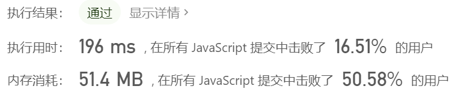

## 链表


#### LRU算法

Least Recently Used

[146. LRU 缓存机制](https://leetcode-cn.com/problems/lru-cache/)

难度中等

运用你所掌握的数据结构，设计和实现一个 [LRU (最近最少使用) 缓存机制](https://baike.baidu.com/item/LRU) 。

实现 `LRUCache` 类：

- `LRUCache(int capacity)` 以正整数作为容量 `capacity` 初始化 LRU 缓存
- `int get(int key)` 如果关键字 `key` 存在于缓存中，则返回关键字的值，否则返回 `-1` 。
- `void put(int key, int value)` 如果关键字已经存在，则变更其数据值；如果关键字不存在，则插入该组「关键字-值」。当缓存容量达到上限时，它应该在写入新数据之前删除最久未使用的数据值，从而为新的数据值留出空间。

 

**进阶**：你是否可以在 `O(1)` 时间复杂度内完成这两种操作？

 

**示例：**

```js
输入
["LRUCache", "put", "put", "get", "put", "get", "put", "get", "get", "get"]
[[2], [1, 1], [2, 2], [1], [3, 3], [2], [4, 4], [1], [3], [4]]
输出
[null, null, null, 1, null, -1, null, -1, 3, 4]

解释
LRUCache lRUCache = new LRUCache(2);
lRUCache.put(1, 1); // 缓存是 {1=1}
lRUCache.put(2, 2); // 缓存是 {1=1, 2=2}
lRUCache.get(1);    // 返回 1
lRUCache.put(3, 3); // 该操作会使得关键字 2 作废，缓存是 {1=1, 3=3}
lRUCache.get(2);    // 返回 -1 (未找到)
lRUCache.put(4, 4); // 该操作会使得关键字 1 作废，缓存是 {4=4, 3=3}
lRUCache.get(1);    // 返回 -1 (未找到)
lRUCache.get(3);    // 返回 3
lRUCache.get(4);    // 返回 4
```

 

**提示：**

- `1 <= capacity <= 3000`
- `0 <= key <= 3000`
- `0 <= value <= 104`
- 最多调用 `3 * 104` 次 `get` 和 `put`


**▼经典的LRU算法:** 

1. get() 数据被访问时，位置需要刷新，moveToHead

2. put() 写入数据时有两种情况：

   1. 之前有该数据，更新数据，刷新位置
   2. 之前没有该数据：
      1. LRUCache未满则直接写入并放在头部
      2. LRUCache已满则先删除最久未使用的条目，然后再写入数据

   


**▼如何都在 $O(1)$ 的时间复杂度内实现？**

1. get() 查找操作需要在O(1), 那么只有hash表。但是访问后需要更新位置并移动到顶部, 可是hash表是无序的！我们没办法只通过hash表来判断least recently used！<span style="font-weight:bold; color:red;">hash表用于快速搜索元素</span>
2. 因此我们还需要链表链表有先后顺序，而且插入，删除操作都可以在O(1)的时间复杂度内实现(数组的话都是O(n)) ! 只不过这里需要设置成双向链表, 因为单向链表无法访问前驱节点
3. 我们需要刷新位置时直接在头部插入,  删除元素时需要从尾部删除。因此我们在头部和尾部都设置一个虚拟节点方便操作，并且记住在初始时将虚拟节点联系起来！


moveToHead =>  removeFromList + addToHead

```js
/*定义链表节点*/
class ListNode {
 constructor(key, value) {
  this.key = key;
  this.value = value;
  this.next = null;
  this.prev = null;
 }
}

/*定义LRUCache*/
class LRUCache {
 constructor(capacity) {
  this.capacity = capacity;  // 缓存的容量
  this.hash = {};            // 哈希表
  this.count = 0;            // 缓存数目
  this.dummyHead = new ListNode(); // 虚拟头结点
  this.dummyTail = new ListNode(); // 虚拟尾节点
  this.dummyHead.next = this.dummyTail;
  this.dummyTail.prev = this.dummyHead; // 相联系
 }

 get(key) {
  let node = this.hash[key];
  if (node == null) return -1;
  this.moveToHead(node);   //被访问了移到链表头部
  return node.value;
 }

 put(key,value){
  let node=this.hash[key];   //从hash表中查找是否存在key
  if (node==null){           //不存在则需要添加新数据
   if (this.count===this.capacity){
    this.removeLRUItem();
   }
   let newNode=new ListNode(key,value);
   this.hash[key]=newNode;
   this.addToHead(newNode);
   this.count++;
  }else {
   node.value=value;
   this.moveToHead(node);
  }
 }

 moveToHead(node){
  this.removeFromList(node);
  this.addToHead(node);
 }

 removeFromList(node){
  const prev=node.prev;
  const next=node.next;
  prev.next=next;
  next.prev=prev;
 }

 addToHead(node){
  node.prev=this.dummyHead;
  node.next=this.dummyHead.next;
  this.dummyHead.next.prev=node;
  this.dummyHead.next=node;
 }

 removeLRUItem(){
  const tail=this.popTail(); //得到最近最少使用的节点即尾节点
  delete this.hash[tail.key]; //删除hash表中对应的键值对
  this.count--;
 }

 popTail(){
  const tail=this.dummyTail.prev;
  this.removeFromList(tail);
  return tail;
 }
}
```

 

❗💣

1. 判断节点在hash表中是否存在采用 node==null， 不要写成\=\=\=, 因为这里不存在显示的实际上时undefined。


## 范围覆盖

#### [★★45. 跳跃游戏 II](https://leetcode-cn.com/problems/jump-game-ii/)

难度中等

给定一个非负整数数组，你最初位于数组的第一个位置。

数组中的每个元素代表你在该位置可以跳跃的最大长度。

你的目标是使用最少的跳跃次数到达数组的最后一个位置。

**示例:**

```
输入: [2,3,1,1,4]
输出: 2
解释: 跳到最后一个位置的最小跳跃数是 2。
     从下标为 0 跳到下标为 1 的位置，跳 1 步，然后跳 3 步到达数组的最后一个位置。
```

**说明:**

假设你总是可以到达数组的最后一个位置。


**🌟贪心算法, 每次从可以到达的范围计算下次能到达的范围,进行遍历!!!**

**时间复杂度：$O(n^2)$，**因为最坏的情况比如 1 1 1 1 1 1111111，position 会从 55 更新到 00，并且每次更新都会经历一个 for 循环。

**空间复杂度：**$O(1)$

```js
/**
 * @param {number[]} nums
 * @return {number}
 */
var jump = function(nums) {
    if(nums.length<=1) return 0;
    let len=nums.length;
    let start=0,curMax=0,count=0;

    while(true){
        //找出当前能跳跃到的最大位置
        count++;
        let tmp=curMax;  //保留这个值,方便start最后赋值
        //★注意这里千万不要写i<=curMax, curMax在变化!!!
        for(let i=start;i<=tmp;i++){
            curMax=Math.max(curMax,i+nums[i]);
        }
        if(curMax>=len-1) break;
        start=(++tmp);  //下一次开始的位置
    }
    return count;
};
```


**🚩只用一个for循环的精简版** 

优化

从上面代码观察发现，其实被 while 包含的 for 循环中，i 是从头跑到尾的。

只需要在一次 跳跃 完成时，更新下一次 能跳到最远的距离。

并以此刻作为时机来更新 跳跃 次数。就可以在一次 for 循环中处理。

❗这种方法也有缺陷,不一定都是这样好  详见 [link](#tip-greedy)

**时间复杂度: O(n):**

**空间复杂度: O(1)**

```js
/**
 * @param {number[]} nums
 * @return {number}
 */
var jump = function(nums) {
    if(nums.length<=1) return 0;
    let len=nums.length;
    //maxPos表示当前i能够到达的最大距离
    //end表示上一轮跳跃能够到达的最大距离
    let maxPos=0,end=0,count=0;

    for(let i=0;i<len;i++){
        maxPos=Math.max(maxPos,i+nums[i]);
        //如果到达了上轮的最大位置处,则要再进行一次跳跃
        //而我们也已经用maxPos记录了上一轮能到达的最大位置
        //并且要保证end不能为最后的位置,因为这里count++表示要进行下次跳跃
        if(i===end&&end!==len-1){
            end=maxPos;
            count++;
        }
    }
    return count;
};
```

**🌟关键是maxPos记录当前能到达的最大值, 而end记录上一次跳跃能到达的最大值。当到达end时就表示上次跳跃结束， 进行下次跳跃！！！**


▼看到评论有说可以直接联想到BFS层序遍历, 便采用了层序遍历: 不过在空间和时间上表现不是太好, 但这和上面是一样的思路

```js
/**
 * @param {number[]} nums
 * @return {number}
 */
var jump = function(nums) {
    if(nums.length<=1) return 0;
    let len=nums.length;
    let jump=[[0,nums[0]]]; //数组中的位置和跳跃距离

    let count=0,preMax=0;  //preMax代表上一层最远的位置
    while(jump.length){
        //取jump中的位置进行一次跳跃
        count++;
        let tmp=[];
        let curMax=preMax;
        for(let i=0;i<jump.length;i++){
            let next=jump[i][0]+jump[i][1];
            curMax=Math.max(curMax,next);
        }
        if(curMax>=len-1) break;
        for(let i=preMax+1;i<=curMax;i++){
            tmp.push([i,nums[i]]);
        }
        jump=tmp;
    }
    return count;
};
```


#### [★★1024. 视频拼接](https://leetcode-cn.com/problems/video-stitching/)

难度中等

你将会获得一系列视频片段，这些片段来自于一项持续时长为 `T` 秒的体育赛事。这些片段可能有所重叠，也可能长度不一。

视频片段 `clips[i]` 都用区间进行表示：开始于 `clips[i][0]` 并于 `clips[i][1]` 结束。我们甚至可以对这些片段自由地再剪辑，例如片段 `[0, 7]` 可以剪切成 `[0, 1] + [1, 3] + [3, 7]` 三部分。

我们需要将这些片段进行再剪辑，并将剪辑后的内容拼接成覆盖整个运动过程的片段（`[0, T]`）。返回所需片段的最小数目，如果无法完成该任务，则返回 `-1` 。

 

**示例 1：**

```
输入：clips = [[0,2],[4,6],[8,10],[1,9],[1,5],[5,9]], T = 10
输出：3
解释：
我们选中 [0,2], [8,10], [1,9] 这三个片段。
然后，按下面的方案重制比赛片段：
将 [1,9] 再剪辑为 [1,2] + [2,8] + [8,9] 。
现在我们手上有 [0,2] + [2,8] + [8,10]，而这些涵盖了整场比赛 [0, 10]。
```

**示例 2：**

```
输入：clips = [[0,1],[1,2]], T = 5
输出：-1
解释：
我们无法只用 [0,1] 和 [1,2] 覆盖 [0,5] 的整个过程。
```

**示例 3：**

```
输入：clips = [[0,1],[6,8],[0,2],[5,6],[0,4],[0,3],[6,7],[1,3],[4,7],[1,4],[2,5],[2,6],[3,4],[4,5],[5,7],[6,9]], T = 9
输出：3
解释： 
我们选取片段 [0,4], [4,7] 和 [6,9] 。
```

**示例 4：**

```
输入：clips = [[0,4],[2,8]], T = 5
输出：2
解释：
注意，你可能录制超过比赛结束时间的视频。
```

 

**提示：**

- `1 <= clips.length <= 100`
- `0 <= clips[i][0] <= clips[i][1] <= 100`
- `0 <= T <= 100`


🌟思路和跳跃是一样的!!!   遍历的是需要覆盖的范围, 不是片段!!!

1. **根据需要覆盖的区间进行遍历, 记录0~i进行下次跳跃能到达的最远距离maxPos**
2. **判断是否有空缺, maxPos=i则表示无法继续, 也就是没办法剪成完整的影片**
3. **end=i 表示已达上一轮能剪辑到的最长的位置, 需要进行下一个片段的选择**


**时间复杂度: O(n)**

**空间复杂度: O(n)**

```js
/**
 * @param {number[][]} clips
 * @param {number} T
 * @return {number}
 */
var videoStitching = function(clips, T) {

    //类似于桶排序或者之前网易的幸运数字,我们建立一个为区间长度的数组
    //记录处于位置loc上能到达的最远的地方
    let maxEnd=Array(T).fill(0);  //Math.max中如果有Number()后为NaN会直接返回NaN
    //和之前的跳跃有两个不同 
    //1.跳跃每个位置只有一个最远距离,而这里可能有多个,因此用一个for来取最大
    //2.跳跃必能达到最后,但这里不一定, 所以要考虑
    for(let i in clips){
        maxEnd[clips[i][0]]=Math.max(maxEnd[clips[i][0]],clips[i][1]);
    }

    //end表示当前跳跃能到达的最大位置,因此我们要在这个范围内寻找maxPos的点进行跳跃/剪辑
    //maxEnd(i)是指i位置能到达的最远处, maxPos是i前面所有的能到达的最远处
    let end=0,maxPos=0,count=0; 
    //★这里i不能等于T哦, 如果等于T那么最后会多加一次,因为可以达到T的话不应该在加了
    //★也不用担心万一到不了T,因为会到达T-1,T-1时会进行判断能否继续
    for(let i=0;i<T;i++){
        maxPos=Math.max(maxPos,maxEnd[i]);
        //能到达的最远处等于i表示无法继续向下进行了, 所以无法完成任务
        if(i===maxPos){
            return -1;
        }
        //已经到达了上次跳跃的最大处,需要选择下次跳跃为maxPos的点来进行下次跳跃
        if(end===i){
            count++;
            end=maxPos;
        }
    }
    return count;

};
```


<span id='1024'>▼按给定的范围数组遍历</span>

```js
/**
 * @param {number[][]} clips
 * @param {number} T
 * @return {number}
 */
var videoStitching = function(clips, T) {
    clips.sort((a,b)=>a[0]-b[0]);
    let i=0,end=0,maxPos=0,count=0;
    //题有点特殊, T可能为0, 那么一个片段都不需要
    //而下面的while默认必须要有一个片段
    if(T===0) return 0;
    while(i<clips.length){
        while(i<clips.length&&clips[i][0]<=end){
            maxPos=Math.max(maxPos,clips[i][1]);
            i++;
        }
        //此时应该clips[i][0]>end or i>=clips.length

        //前面的while已把上一轮能到达的点都遍历完毕,肯定会进行一次跳跃,因此++
        //不用担心maxPos>T, 因为maxPos>T影响的是下一轮是否jump,而本轮jump是早就确定了的
        count++;
        //maxPos>T表示满足条件不需要跳跃了 || i>=...超出范围了应该终止
        if(maxPos>=T||i>=clips.length) break;
        end=maxPos;
        //下一个片段的起点比当前能达到的最大距离都远,因此会空缺
        //前面判断了i,因此这里的i在范围内
        if(clips[i][0]>maxPos){
            return -1;
        }
    }
    return maxPos<T? -1:count;
};
```


自己的笨办法....

```js
/**
 * @param {number[][]} clips
 * @param {number} T
 * @return {number}
 */
//题目中并没有说clips[i][0]
var videoStitching = function (clips, T) {
    //其实就是跳跃问题,只不过中间有些点可能没有
    //clips[i][0]为跳跃位置,clips[i][1]为跳跃距离
    clips.sort((a, b) => a[0] - b[0]);
    if (T === 0) return 0;
    if (clips[0][0] !== 0) return -1;
    let end = 0, maxPos = 0, count = 0;
    //这里的for循环实际上是一个已经跳跃了的情况,但不确定跳跃到哪里
    //我们需要根据maxPos来确定最贪婪的跳跃选择
    for (let i = 0; i < clips.length; i++) {
        while (i < clips.length - 1 && clips[i][0] === clips[i + 1][0]) {
            clips[i + 1][1] = Math.max(clips[i][1], clips[i + 1][1]);
            i++;
        }
        //原本是应该在end处更新,但是这里的片段可能没有end位置
        if (clips[i][0] > end) {
            //如果在上一轮的最大位置end前发现可以跳到大于clips[i]的位置
            //那么可以在中间进行依次片段剪辑来弥补
            //▼比如说 [0,2] [1,9] [5,9] 第一个片段只能到达2, 但其可以通过先跳跃到[1,9],
            //再跳跃到[5,9]或者更后面的位置,因此这里增加一次从[0,2]到[1,9]的跳跃
            //❗注意这里并没有增加[1,9]到[5,9]的跳跃!!!
            if (maxPos >= clips[i][0]) {
                count++;
                //处理初始化问题,第一次的跳跃的时候end不能直接为maxPos,此时maxPos还没更新
                end = maxPos;
                //这时是以之前的maxPos的点作为起点开始寻找下一个最大的maxPos点了!
                maxPos = Math.max(maxPos, clips[i][1]);
                //maxPos在之前不可能大于等于T,但是这个时候clips[i][1]却有可能>=T
                //如果这时候不考虑这种情况的话就会使maxPos=>clips[i]=>T变成maxPos=>T
                if (maxPos >= T) count++;
            } else {  //如果maxPos小于clips[i][0],说明无法填补这个空缺
                return -1;
            }
        }
        else if (clips[i][0] === end) {
            //刚好等于end的情况就和之前的跳跃问题一模一样了!!!
            count++;
            //此时必须要做一次跳跃,要在之前的maxPos和当前的位置i选择最大的
            maxPos = Math.max(maxPos, clips[i][1]);
            end = maxPos;
        } else {
            maxPos = Math.max(maxPos, clips[i][1]);
            //T秒的运动过程片段,但是clips[i][0]和clips[i][1]也可能大于T(输入错误的特殊情况)
            if (maxPos >= T) count++;
        }
        if (maxPos >= T) break;

    }
    if (maxPos < T) return -1;
    return count;
};
```

🚀**反思**:为什么自己的写法又臭又长需要考虑各种条件, 而别人的写法干净利落?

​	▼我觉得主要是我没有抓住重点!!!  <span style="font-weight:bold; color:red;">这类范围覆盖的题需要的是遍历 **范围**</span>, 但我却直接想的是去遍历片段(需要考虑很多不容易想到的边界情况)!!!  完全忘记了第一次做跳跃时自己是怎么遍历的...  


当然贪心都能转换为dp, dp也是干净利落, 思路如下:

dp[0]=0,  其余初始化为Infinity,  dp[i]表示从[0,i]最少需要由多少个片段构成

▼每次遍历所有片段 , 如果i > $clips[j][0]$, 则比较$dp[i]$和 $dp[clips[j][0]]+1$ ,因为到[0, i ]可以由[0, $clips[j][0]$]和[$clips[j][0]$, i] 组成 , 然后取最小的

★为什么i = $clips[j][0]$不考虑? 如果等于的话, 直接用dp[i]就可以了, 不需要再跳一次!!!  而且此时的话dp[i]还是Infinity,我们首先需要确保可以从 [0,k] 再来确保能从[k,i]

 


dp的写法:

**时间复杂度: O(n^2^)**

**空间复杂度: O(n)**

```js
/**
 * @param {number[][]} clips
 * @param {number} T
 * @return {number}
 */
var videoStitching = function(clips, T) {
    //题目要求是[0,T)
    //dp[i]表示[0,i)需要的最少片段数,我们会用所有片段去循环遍历
    let dp=Array(T+1).fill(Infinity);
    dp[0]=0;           //初始值为0 也表示[0,0)不需要片段
    for (let i=1;i<=T;i++){
        for (let v of clips){
            // v[0]<i<=v[1]说明可以用该片段
            // 剪辑成[v[0],i)
            if (v[0]<i&&v[1]>=i){
                dp[i]=Math.min(dp[i],dp[v[0]]+1)
            }
        }
    }
    return  dp[T]===Infinity? -1 : dp[T];
};
```


#### [★★★1326. 灌溉花园的最少水龙头数目](https://leetcode-cn.com/problems/minimum-number-of-taps-to-open-to-water-a-garden/)

难度困难

在 x 轴上有一个一维的花园。花园长度为 `n`，从点 `0` 开始，到点 `n` 结束。

花园里总共有 `n + 1` 个水龙头，分别位于 `[0, 1, ..., n]` 。

给你一个整数 `n` 和一个长度为 `n + 1` 的整数数组 `ranges` ，其中 `ranges[i]` （下标从 0 开始）表示：如果打开点 `i` 处的水龙头，可以灌溉的区域为 `[i - ranges[i], i + ranges[i]]` 。

请你返回可以灌溉整个花园的 **最少水龙头数目** 。如果花园始终存在无法灌溉到的地方，请你返回 **-1** 。

 

**示例 1：**


```
输入：n = 5, ranges = [3,4,1,1,0,0]
输出：1
解释：
点 0 处的水龙头可以灌溉区间 [-3,3]
点 1 处的水龙头可以灌溉区间 [-3,5]
点 2 处的水龙头可以灌溉区间 [1,3]
点 3 处的水龙头可以灌溉区间 [2,4]
点 4 处的水龙头可以灌溉区间 [4,4]
点 5 处的水龙头可以灌溉区间 [5,5]
只需要打开点 1 处的水龙头即可灌溉整个花园 [0,5] 。
```

**示例 2：**

```
输入：n = 3, ranges = [0,0,0,0]
输出：-1
解释：即使打开所有水龙头，你也无法灌溉整个花园。
```

**提示：**

- `1 <= n <= 10^4`
- `ranges.length == n + 1`
- `0 <= ranges[i] <= 100`


🌟还是老套路, 先转换数据和跳跃模式一样

 

**时间复杂度: O(n):**

```js
/**
 * @param {number} n
 * @param {number[]} ranges
 * @return {number}
 */
var minTaps = function(n, ranges) {
    //n>=1, ranges.length=n+1
    //我们在意的是范围, 不是水龙头个数, 所以是n
    //maxEnd[i]表示在位置i, 能到达的最远距离
    let maxEnd=Array(n).fill(0);
    for(let i=0;i<ranges.length;i++){
        let low=Math.max(0,i-ranges[i]),
            high=i+ranges[i];
        maxEnd[low]=Math.max(maxEnd[low],high);
    }

    //对覆盖范围循环
    let end=0,maxPos=0,count=0;
    for(let i=0;i<n;i++){
        maxPos=Math.max(maxPos,maxEnd[i]);
        //i<n,如果在循环中maxPos=i表示无法使覆盖范围达到n
        if(maxPos===i) return -1;
        //end=i,表示上次的水龙头覆盖的最大范围已到,需要寻找下一个水龙头
        //也就是已达到上一轮跳跃最大距离,选择maxPos对应的位置
        //为上一轮的跳跃落脚点进行下一次跳跃
        if(end===i){
            end=maxPos;
            count++;
        }
    }
    return count;
};
```


▼这是自己按照上面那道题直接套的dp, 性能不是太好😭😭😭

 

```js
/**
 * @param {number} n
 * @param {number[]} ranges
 * @return {number}
 */
var minTaps = function(n, ranges) {
    //n>=1, ranges.length=n+1
    //dp[i]表示[0,i]需要的水龙头数目
    let dp=Array(n+1).fill(Infinity);
    dp[0]=0;
	//先处理成范围
    for(let i=0;i<ranges.length;i++){
        let low=Math.max(0,i-ranges[i]),
            high=i+ranges[i];
        ranges[i]=[low,high];
    }

    //对覆盖范围循环
    for(let i=1;i<=n;i++){
        for(let v of ranges){
            if(v[0]<i&&v[1]>=i){
                dp[i]=Math.min(dp[i],dp[v[0]]+1);
            }
        }
    }

    return dp[n]===Infinity? -1:dp[n];
};
```


#### 腾讯笔试:视野争夺

链接：https://www.nowcoder.com/questionTerminal/61e1e66e39f348cdb6495de91ac36a41
来源：牛客网


小Q在进行一场竞技游戏,这场游戏的胜负关键就在于能否能争夺一条长度为L的河道,即可以看作是[0,L]的一条数轴。 

  这款竞技游戏当中有n个可以提供视野的道具−真视守卫,第i个真视守卫能够覆盖区间[xi,yi]。现在小Q想知道至少用几个真视守卫就可以覆盖整段河道。 


**输入描述:**

输入包括n+1行。


第一行包括两个正整数n和L(1<=n<=10^5^,1<=L<=10^9^)


接下来的n行,每行两个正整数xi,yi(0<=xi<=yi<=10^9^),表示第i个真视守卫覆盖的区间。

**输出描述:**

```
一个整数，表示最少需要的真视守卫数量, 如果无解, 输出-1。
```

示例1

输入

```
4 6
3 6
2 4
0 2
4 7
```

输出

```
3
```


🌟<span id='tip-greedy'>这道题你</span>>可能会以为又和之前的一样, 但是有坑!!!  注意到了吗? 如果又是按之前的范围覆盖来计算, 那么计算量会达到$10^9$量级(超时❗),  但如果采用对片段进行遍历的话 只有 $10^5$ , 因此对片段遍历还是对范围遍历要看情况!!!

```js
const readline=require('readline');
const rl=readline.createInterface({
    input:process.stdin,
    output:process.stdout
})
const arr=[]
let n,l;
rl.on('line',function(line){
    arr.push(line.split(' ').map(Number));
    if(arr.length===1){
        n=Number(arr[0][0]);
        l=Number(arr[0][1]);
    }else if(arr.length===n+1){
        arr.shift();
        arr.sort((a,b)=>a[0]-b[0]);

        let end=0,maxPos=0,count=0,i=0;
        while (i<arr.length){
            //求出在上一轮跳跃范围内最大的maxPos
            //由于已经排好序,end=0初始化时也满足情况
            while (i<arr.length&&arr[i][0]<=end){
                maxPos=Math.max(maxPos,arr[i][1]);
                ++i;
            }
            //跳跃一次
            count++;
            end=maxPos;
            //直接起点大于了当前能跳跃到的最大距离,出现了空缺
            if (i<arr.length&&arr[i][0]>end){
                count=-1; break;
            }
            if (maxPos>=l) break;
        }
        //退出时maxPos未能达到l
        if (maxPos<l){
            count=-1;
        }
        console.log(count);
        
        //next
        arr.length=0;
    }
})
```

我在了解这个方法后也对1024进行了范围数组遍历的改写 [link 1024](#1024)


**🌟Summary**

覆盖有三种方法:

**一. 覆盖范围遍历**

1. 建立一个长度为覆盖范围长度的数组maxEnd, 对片段数组进行遍历, 记录位于位置i能到达的最远距离$maxEnd[i]$ , 初始化为0
2. 对覆盖范围进行遍历, 更新maxPos为$[0,i]$中能跳跃到的最远节点
3. end=i 表示已经到达了上次跳跃的最大处,需要选择下次跳跃为maxPos的点来进行下次跳跃

**二.片段数组遍历**

1. 先将片段数组进行排序
2. 使用一个while把当前轮的都遍历完并更新maxPos
3. end=maxPos进行相关更新并对退出条件进行判断

**三.动态规划**

dp[i]表示[0,i)需要的最少片段数,我们会用所有片段去循环遍历


## 动态规划


#### ★★1.幸运数字

小易的幸运数字是7，现有一个整数数组 nums，请你找出并返回能被七整除的子集合的最大和，如果找不到则返回-1。

[题目链接]([组合幸运数字_网易2021校招笔试-前端开发工程师（正式第一批）_牛客网 (nowcoder.com)](https://www.nowcoder.com/test/question/done?tid=42777111&qid=1262925#summary))


**输入描述:**

```
一个正整数数组列表nums，用空格区分，1<=length(nums)<=100000，sum(nums) <= 1000000000
```

**输出描述:**

```
一个整数，最大和
```


**输入例子1:**

```
7 3 1 4
```

**输出例子1:**

```
14
```

**例子说明1:**

```
7+3+4
```


这道题很难, 一开始会想到遍历得到所有的子集合的和, 但是却不知道如何遍历得到。因为这里的子集合长度可以为1 ~ nums.length，一般的遍历无法满足！

举例：  1 2 3 4

一般的遍历是 1， 1 2， 1 2 3， 1 2 3 4， 2， 2 3， 2 3 4， 3，3 4，4实现这个遍历已经是$O(n^2)$的复杂度了! 可是这还没结束, 还需要  1 3, 1 3 4, 1 4, 2 4, 这种循环遍历极其难写出来!!

🌟那我们这里想到了一个巧妙地方法, 逆向思维, 由于全部的数之和sum肯定是由所有的数组成, 那我们可以试着慢慢地扒元素下来直到把所有元素扒完,

比如说我们这里有一个数组 [a,b,c,d]

 

★这种逆向的遍历更容易使用代码写出来


```js
const readline=require('readline');
const rl=readline.createInterface({
    input:process.stdin,
    output:process.stdout
});
/*
 小易的幸运数字是7，现有一个整数数组 nums，
 请你找出并返回能被七整除的子集合的最大和，如果找不到则返回-1
 输入:
 一个正整数数组列表nums，用空格区分，1<=length(nums)<=100000，sum(nums) <= 1000000000
 */
rl.on('line',function (line) {
    /*1.处理数据*/
    let arr=line.trim().split(' ').map(Number);

    /*2.dp*/
    //由于是全是正整数,所以 sum >= arr.length
    let sum=arr.reduce((a,b)=>a+b);
    //dp[i]记录i是否能够得到 1为可得到,0则相反
    let dp=new Array(sum+1).fill(0);
    dp[0]=1; dp[sum]=1;
    /*这个方法很巧妙, 最初是a+b+c+d,每次从所有的满足条件的子集合减去一个数
    * 这样就很方便的得到了所有的排列*/
    for (let i=0;i<arr.length;i++){
        for (let j=0;j<=sum;j++){
            if (dp[j]===1&&j>=arr[i]){
                dp[j-arr[i]]=1;
            }
        }
    }

    let maxSum=-1;
    for (let i=dp.length-1;i>=7;i--){
        if (dp[i]===1&& i%7===0){
            maxSum=i;
            break;
        }
    }
    console.log(maxSum);
})
```


🚩类似题目, 学会融汇贯通!!!

##### <span style="font-size:20px;font-weight:bold">1.1小易的考试成绩 </span>


小易参加了一次考试，这场包含 n 个题目，第 i 个题目的分数是 si 。 

  如果小易第 i 题目回答正确，他将得到 Si 分，否则该题目他将得到 0 分。 

  最终的考试得分是所有题目得分的总和。 

  由于阅卷老师很讨厌数字 5，在阅卷时如果一个学生的考试总分中含有数字 5，那么阅卷老师将气愤地给他 0 分。 

  那么小易考试的最高得分是多少？ 


**输入描述:**

```
输入的第一行是正整数 n(1<=n<=100)  ，代表这场考试的题目数。
接下一行含有n个正整数 s1,s2,s3....sn (1<= si <=200)
```


**输出描述:**

```
输出一个整数，代表小易考试的最高得分。
```

示例1

输入

```
5
5 15 5 15 5
```

输出

```
40
```

说明

```
如果所有题目都答对，总分为45，但里面包含了数字5,所以最高得分应该为40
```

示例2

输入

```
5
5 15 5 15 8
```

输出

```
48
```


🌟这道题其实也要求出集合中所有的组合的和, 并且再选出最大的, 所以是和上一道题一样的解法!!!


```js
const readline=require('readline');
const rl=readline.createInterface({
    input:process.stdin,
    output:process.stdout
})

let arr=[];
rl.on("line",function(line){
    arr.push(line);
    if(arr.length===2){
        let len=Number(arr[0]);
        let nums=arr[1].split(' ').map(Number);
        
        //core code
        let sum=nums.reduce((a,b)=>a+b); //sum>=1
        let dp=new Array(sum+1).fill(0); //dp.length>=2
        dp[0]=1; dp[sum]=1;
        for(let i=0;i<nums.length;i++){
            for(let j=0;j<=sum;j++){
                if(dp[j]!==0&&j>=nums[i]){
                    dp[j-nums[i]]=1;
                }
            }
        }
        let max=0;
        for(let k=dp.length-1;k>0;k--){
            if(dp[k]&& !String(k).includes('5')){
                max=k;
                break;
            }
        }
        console.log(max);
        
        //before next input
        arr=[];
    }
})

```


★其实在计算dp时不需要每次都进行一次长度为sum的循环的, 其实一开始只有dp[sum]满足要求, 在后面我们其实只要记录下那些满足要求的位置就方便每次'扒', 可是我尝试了一下会超出空间限制!!!  所以还是牢记上面那种经典解题方法!!!

▼有变化的部分大概长这样 , 了解即好!

```js
        let flag=[sum];
        for(let i=0;i<nums.length;i++){
            for(let j=flag.length-1;j>=0;j--){
                let loc=flag[j]-nums[i];
                dp[loc]=1;
                flag.push(loc);
            }
        }
```


**🌟总结:**

**对于求集合中所有组合的和的题目, 先算出数组中所有数字的和, 然后再依次删掉每个元素**


#### [2.假期](https://www.nowcoder.com/questionTerminal/7cd9a140387e455a972e8fea0e74be2c)

腾讯笔试


由于业绩优秀，公司给小Q放了 n 天的假，身为工作狂的小Q打算在在假期中工作、锻炼或者休息。他有个奇怪的习惯：不会连续两天工作或锻炼。只有当公司营业时，小Q才能去工作，只有当健身房营业时，小Q才能去健身，小Q一天只能干一件事。给出假期中公司，健身房的营业情况，求小Q最少需要休息几天。


**输入描述:**

```
第一行一个整数 n(1≤n≤100000)n(1\leq n\leq 100000)n(1≤n≤100000) 表示放假天数
第二行 n 个数 每个数为0或1,第 i 个数表示公司在第 i 天是否营业
第三行 n 个数 每个数为0或1,第 i 个数表示健身房在第 i 天是否营业
（1为营业 0为不营业）
```

**输出描述:**

```
一个整数，表示小Q休息的最少天数
```


示例1

输入

```
4
1 1 0 0
0 1 1 0
```

输出

```
2
```

说明

```
小Q可以在第一天工作，第二天或第三天健身，小Q最少休息2天
```


自己的思路:

这道题有坑, 不能直接按照贪心去直接把工作和健身算进去, 比如

corp: 1  1  0

gym:  1  1  1

如果第一天直接选work的话, 必须休息一天, 但如果第一天选gym的话休息0天。因此我们需要跳过中间都为1的点!!!

```js
const readline=require('readline');
const rl=readline.createInterface({
    input:process.stdin,
    output:process.stdout
})
const arr=[];
rl.on('line',function(line){
    arr.push(line);
    if(arr.length===3){
        let len=Number(arr[0]);
        let corp=arr[1].split(' ').map(Number);
        let gym=arr[2].split(' ').map(Number);
        let work=false,train=false;
        //dp[i]表示i天时间内最少休息的天数
        let dp=Array(len+1).fill(0);  //多加一位方便计算
        for(let i=0;i<len;i++){
            //1.必须休息的情况 [0,0]
            if((!corp[i]&&!gym[i])||(work&&!gym[i])||(train&&!corp[i])){
                dp[i+1]=dp[i]+1; work=false; train=false;
                continue;
            }
            //2.公司和健身房都营业一天及以上的情况 [1,1]+
            if ((!work&&!train)&&(corp[i]&&gym[i])&&i<len-1){
                let end=i;
                while (end<len-1&&corp[end]&&gym[end]){
                    end++;
                }
                work=false; train=false;
                //corp和gym从0开始, 而dp从1开始
                //end此时指向corp和gym中不为[1,1]的位置,而这个位置对应dp[end+1]
                //所以我们之确定dp[end]
                dp[end]=dp[i];  //就跳过中间都为1的点,让循环自己判断下一次
                i=end-1;  //for循环最后会加1
                continue;
            }
            //3.公司和健身房只有一个在营业的情况 [1,0] or [0,1]
            if(!work&&corp[i]){
                work=true;  train=false;
                dp[i+1]=dp[i];
            }else if(!train&&gym[i]){
                train=true; work=false;
                dp[i+1]=dp[i];
            }
        }
        console.log(dp[len]);
        arr.length=0;
    }
})
```


🌟但是这道题利用这种动态规划更简洁!!! 而且不用考虑那么多!!!

状态转移分析  

  1、每一天小Q都可能处于3个状态，那就是工作、休息、锻炼  

  2、若第i天小Q处于工作状态，那么第i-1天只能是休息、锻炼  

  3、若第i天小Q处于锻炼状态，那么第i-1天只能是休息、工作  

  4、若第i天小Q处于休息状态，那么第i-1天可能是工作、休息、锻炼。

```js
const readline=require('readline');
const rl=readline.createInterface({
    input:process.stdin,
    output:process.stdout
})
const arr=[];
rl.on('line',function(line){
    arr.push(line);
    if(arr.length===3){
        let len=Number(arr[0]);
        let corp=arr[1].split(' ').map(Number);
        let gym=arr[2].split(' ').map(Number);
        //0: 休息  1:工作 2:健身
        //dp[0][i]表示第i天休息的情况下最少休息的天数
        //多加一位方便计算
        let dp=Array.from({length:3},()=>Array(len+1).fill(Infinity)); 
        dp[0][0]=0; dp[1][0]=0; dp[2][0]=0; //初始化
        for(let i=1;i<=len;i++){
            //1.休息
            dp[0][i]=Math.min(dp[0][i-1],dp[1][i-1],dp[2][i-1])+1;
            //2.可以工作
            if(corp[i-1]){
                dp[1][i]=Math.min(dp[0][i-1],dp[2][i-1]);
            }
            //3.可以锻炼
            if(gym[i-1]){
                dp[2][i]=Math.min(dp[0][i-1],dp[1][i-1]);
            }
        }
        
        console.log(Math.min(dp[0][len],dp[1][len],dp[2][len]));
        arr.length=0;
    }
})
```


#### ▼回文串

#### [★★647. 回文子串](https://leetcode-cn.com/problems/palindromic-substrings/)

难度中等527

给定一个字符串，你的任务是计算这个字符串中有多少个回文子串。

具有不同开始位置或结束位置的子串，即使是由相同的字符组成，也会被视作不同的子串。

 

**示例 1：**

```
输入："abc"
输出：3
解释：三个回文子串: "a", "b", "c"
```

**示例 2：**

```
输入："aaa"
输出：6
解释：6个回文子串: "a", "a", "a", "aa", "aa", "aaa"
```

 

**提示：**

- 输入的字符串长度不会超过 1000 。


##### way1: dp

这道题我一开始没想到是dp, 本来想双指针, 但不行; 想用栈, 也无法得到所有的。看了题解才发现是dp😭

🌟$dp[i] [j]$ 表示 范围 i ~ j内的子字符串是否为回文串

状态转移方程：
$$
dp[i][j] =
 \begin{cases} 
 true, & \text{if }s[i]=s[j] \&\& ((j-i<2)\|dp[i+1][j-1] )  \\
 false, & \text{else }
 \end{cases}
$$
这个状态转移方程是什么意思呢？

当只有一个字符时，比如 a 自然是一个回文串。
当有两个字符时，如果是相等的，比如 aa，也是一个回文串。
当有三个及以上字符时，比如 ababa 这个字符记作串 1，把两边的 a 去掉，也就是 bab 记作串 2，可以看出只要串2是一个回文串，那么左右各多了一个 a 的串 1 必定也是回文串。所以当 s[i]==s[j] 时，自然要看 dp[i+1] [j-1] 是不是一个回文串。


**时间复杂度: O(n^2^):**

**空间复杂度: O(n^2^)**

```js
/**
 * @param {string} s
 * @return {number}
 */
var countSubstrings = function(s) {
    // if(!s.length) return 0;
    let len=s.length;
    let dp=Array.from({length:len},item=>new Array(len+2).fill(0));
    let count=0;
    //dp[i][j]表示i~i+j范围内的子串是否是一个回文子串
    for(let j=0;j<s.length;j++){
        for(let i=0;i<=j;i++){
            if((s[i]===s[j])&&((j-i<2)||dp[i+1][j-1] )){
                dp[i][j]=1;
                count++;
            }
        }
    }
    return count;
};
```

🌟其实这种解法还有一个坑💣!!! 就是如何遍历? 

一开始我直接写的 , 这是最常规的循环

```js
for(let i=0;i<=s.length;i++){
    for(let j=i;j<=s.length;j++){
        if((s[i]===s[j])&&((j-i<2)||dp[i+1][j-1] )){
            dp[i][j]=1;
            count++;
        }
    }
}
```

可是这种循环是直接从起始位置 i 到最后, 而我们判断是否为回文子串时, 会在$s[i]==s[j]$但$j-i>=2$时判断 子串中的子串是否满足条件, 而这种常规的循环在这种时候会失效

比如  a b b c b b, 我们第二轮循环时 以b为起点 按理来说应该加入 ①b  ②bb ③bbcbb 这三个, 可是bbcbb并不会被加入, 这是因为我们会在这时判断bbcbb的子串bcb是否满足条件, **虽然bcb肯定满足条件 但我们循环还没进行到此处, 所以bbcbb不会被加入,** 而之后起点右移, 也不会再次计算bbcbb, 这样就会漏掉很多满足条件的情况!!! 

🚩我们这里采用逆向思维

**固定i, 移动j** 这是我们一开始常规循环的过程,  只是一昧地扩大范围并没有保证范围内的都已经被计算, 因此不可避免地会漏掉很多数
$$
\begin{matrix}
 a & b & b & c & b & b \\
 b & b & c & b & b \\
 b & c & b & b \\
 c & b & b \\
 b & b\\
b\\
\end{matrix} \tag{1}
$$
**所以我们要积少成多, 这也是dp的基本思想**

**固定j, 移动i** , 这样移动的时候都保证了里面的子字符串都已经判断过
$$
\begin{matrix}
 a\\
 a & b  \\
 a & b & b \\
 a & b & b & c \\
 a & b & b & c & b \\
 a & b & b & c & b & b \\
\end{matrix} \tag{1}
$$


##### way2:中心扩展

简单来讲就是以一个数或两个数为中心, 向其两侧慢慢扩张


这种方法还是$O(n^2)$ 不过空间复杂度更低, 为O(1)

比如对一个字符串 ababa，选择最中间的 a 作为中心点，往两边扩散，第一次扩散发现 left 指向的是 b，right 指向的也是 b，所以是回文串，继续扩散，同理 ababa 也是回文串。

这个是确定了一个中心点后的寻找的路径，然后我们只要寻找到所有的中心点，问题就解决了。

中心点一共有多少个呢？看起来像是和字符串长度相等，但你会发现，如果是这样，上面的例子永远也搜不到 abab，想象一下单个字符的哪个中心点扩展可以得到这个子串？似乎不可能。所以中心点不能只有单个字符构成，还要包括两个字符，比如上面这个子串 abab，就可以有中心点 ba 扩展一次得到，所以最终的中心点由 2 * len - 1 个，分别是 len 个单字符和 len - 1 个双字符。

如果上面看不太懂的话，还可以看看下面几个问题：

▼为什么有 2 * len - 1 个中心点？
aba 有5个中心点，分别是 a、b、c、ab、ba
abba 有7个中心点，分别是 a、b、b、a、ab、bb、ba
▼什么是中心点？
中心点即 left 指针和 right 指针初始化指向的地方，可能是一个也可能是两个
▼为什么不可能是三个或者更多？
因为 3 个可以由 1 个扩展一次得到，4 个可以由两个扩展一次得到

```js
/**
 * @param {string} s
 * @return {number}
 */
var countSubstrings = function(s) {
    // if(!s.length) return 0;
    let res=0,len=s.length;
    for(let center=0;center<2*len-1;center++){
        let left=center>>1;
        let right=left+center%2;

        while(left>=0&&right<len&&s[left]===s[right]){
            res++;
            left--;
            right++;
        }
    }

    return res;
};
```


#### ▼编辑距离

#### [★★★72. 编辑距离](https://leetcode-cn.com/problems/edit-distance/)

难度困难1508收藏分享切换为英文接收动态反馈

给你两个单词 `word1` 和 `word2`，请你计算出将 `word1` 转换成 `word2` 所使用的最少操作数 。

你可以对一个单词进行如下三种操作：

- 插入一个字符
- 删除一个字符
- 替换一个字符

 

**示例 1：**

```
输入：word1 = "horse", word2 = "ros"
输出：3
解释：
horse -> rorse (将 'h' 替换为 'r')
rorse -> rose (删除 'r')
rose -> ros (删除 'e')
```

**示例 2：**

```
输入：word1 = "intention", word2 = "execution"
输出：5
解释：
intention -> inention (删除 't')
inention -> enention (将 'i' 替换为 'e')
enention -> exention (将 'n' 替换为 'x')
exention -> exection (将 'n' 替换为 'c')
exection -> execution (插入 'u')
```

 

**提示：**

- `0 <= word1.length, word2.length <= 500`
- `word1` 和 `word2` 由小写英文字母组成


思路
1.动态规划

**2.定义 dp[i] [j]**

21. dp[i] [j] 代表 word1 中前 i 个字符，变换到 word2 中前 j 个字符，最短需要操作的次数
22. 需要考虑 word1 或 word2 一个字母都没有，即全增加/删除的情况，所以预留 dp[0] [j] 和 dp[i] [0]

**3.状态转移**

31. 增，dp[i] [j] = dp[i] [j - 1] + 1
32. 删，dp[i] [j] = dp[i - 1] [j] + 1
33. 改，dp[i] [j] = dp[i - 1] [j - 1] + 1
34. 按顺序计算，当计算 dp[i] [j] 时，dp[i - 1] [j] ， dp[i] [j - 1] ， dp[i - 1] [j - 1] 均已经确定了
35. 配合增删改这三种操作，需要对应的 dp 把操作次数加一，取三种的最小
36. 如果刚好这两个字母相同 word1[i - 1] = word2[j - 1] ，那么可以直接参考 dp[i - 1] [j - 1] ，操作不用加一

**▼增:表示word1前i个字符可以通过$dp[i][j-1]$次操作构成word2的前j-1个字符。若要构成word2前j个字符，那么我们在$dp[i][j-1]$的基础上进行一次添加字符word[j]的操作即可!!!**

**▼删:表示word1前$i-1$个字符可以通过$dp[i-1][j]$次操作构成word2的前$j$个字符。此时已经能够达到$dp[i][j]$的目标了, 但是$dp[i][j]$比$dp[i-1][j]$多需要一个word1[i], 因此进行一次删去word1[i]的操纵**

**▼改:对应word1[i]和word2[j], 我们直接把word[i]改为word[j]**

 


**时间复杂度: O(n^2^)**

**空间复杂度: O(n^2^)**

(上面的写成$O(MN)$也是可以的)

```js
/**
 * @param {string} word1
 * @param {string} word2
 * @return {number}
 */
var minDistance = function(word1, word2) {
    let len1=word1.length,len2=word2.length;
    //word1是row竖着的, word2是column横着的
    let dp=Array.from({length:len1+1},item=>Array(len2+1).fill(0));
    //dp[i][j]表示word1前i个字符和word2前j个字符之间的最小距离
    //dp[0][j]表示的是word1为空时的编辑距离
    for(let i=1;i<=len1;i++){
        dp[i][0]=i;
    }
    for(let j=1;j<=len2;j++){
        dp[0][j]=j;
    }
    //有三种情况,依次进行判断 
    for(let i=1;i<=len1;i++){
        for(let j=1;j<=len2;j++){
            dp[i][j]=Math.min(dp[i-1][j]+1,dp[i][j-1]+1,dp[i-1][j-1]+!(word1[i-1]===word2[j-1]));    
        }
    }

    return dp[len1][len2];
};
```


##### ★★特殊的编辑距离

在自然语言处理的过程中，经常需要判断一个字符串和另外一个字符串之间的一个相似程度，其中常见的一个指标就是编辑距离，即一个字符串最少经过多少次“增删改”某个字符，可以变为另一个字符串。

如“abc”与“ac”的编辑距离为1，是因为在a和c中间“增加”一个b即可。如“abcd”与“axc”的编辑距离为2，是因为把“abcd”的b修改为x，然后再删除d即可，共2次操作。

但是在某种场景中，编辑距离定义为词粒度的。比如句子A “I am a coder”与句子B “hello ,  I am a singer”之间，对于句子A可以通过添加"hello"和符号",",  并替换"coder"为"singer"，共3个操作得到句子B。所以可得其基本的编辑距离为3。

在本题中，特别地，对于部分词，比如标点符号“, ”、"hello"对于句子语义的影响并不重要，这部分称之为停用词，这部分可以在匹配的过程中被跳过。比如对于句子A “I am a coder”与句子B “hello ,  I am a singer”，如果加入了停用词的影响，那编辑距离从3降到1。

所以目标是可以有选择性地跳过停用词的情况下，问最小的编辑距离是多少。


**输入描述:**

```
共3行
第一行为停用词列表，用空格区分
第二行为句子A，所有词可以用空格区分，词数不超过10000
第三行为句子B，所有词可以用空格区分，词数不超过10000
```


**输出描述:**

```
一个整数，可跳过停用词情况下的最短编辑距离
```


**输入例子1:**

```
hello ,
I am a coder
hello ,  I am a singer
```


**输出例子1:**

```
1
```


就是编辑距离的模板...

```js
const readline=require('readline');
const rl=readline.createInterface({
    input:process.stdin,
    output:process.stdout
})
const arr=[];
rl.on('line',function(line){
    arr.push(line);
    if(arr.length===3){
        let ban=arr[0].trim().split(' ');
        let s1=arr[1].trim().split(' ').filter(v=>!ban.includes(v));
        let s2=arr[2].trim().split(' ').filter(v=>!ban.includes(v));
        let len1=s1.length,len2=s2.length;
        let dp=Array.from({length:len1+1},()=>Array(len2+1));
        dp[0][0]=0;
        for(let i=1;i<=len1;i++) {dp[i][0]=i}
        for(let j=1;j<=len2;j++) {dp[0][j]=j}
        
        for(let i=1;i<=len1;i++){
            for(let j=1;j<=len2;j++){
                dp[i][j]=Math.min(dp[i][j-1]+1,dp[i-1][j]+1,dp[i-1][j-1]+!(s1[i-1]===s2[j-1]))
            }
        }
        console.log(dp[len1][len2]);
        
        //before next
        arr.length=0;
    }
})


```


#### 树形dp

#### ★★★最优二叉树

链接：https://www.nowcoder.com/questionTerminal/0d939e874a004f449a370aca1346dd5c?answerType=1&f=discussion
来源：牛客网


小团有一个由N个节点组成的二叉树，每个节点有一个权值。定义二叉树每条边的开销为其两端节点权值的乘积，二叉树的总开销即每条边的开销之和。小团按照二叉树的中序遍历依次记录下每个节点的权值，即他记录下了N个数，第i个数表示位于中序遍历第i个位置的节点的权值。之后由于某种原因，小团遗忘了二叉树的具体结构。在所有可能的二叉树中，总开销最小的二叉树被称为最优二叉树。现在，小团请小美求出最优二叉树的总开销。  


**输入描述:**

```
第一行输入一个整数N（1<=N<=300），表示二叉树的节点数。第二行输入N个由空格隔开的整数，表示按中序遍历记录下的各个节点的权值，所有权值均为不超过1000的正整数。
```


**输出描述:**

```
输出一个整数，表示最优二叉树的总开销。
```

示例1

输入

```
5
7 6 5 1 3
```

输出

```
45
```

说明

```
最优二叉树如图所示，总开销为7*1+6*5+5*1+1*3=45。
```


美团不当人系列...  二叉树+dp, 还是三维dp, 树还要考虑虚拟节点, 而且树有三层结构

 

```js
const readline=require('readline');
const rl=readline.createInterface({
    input:process.stdin,
    output:process.stdout
})
const arr=[];
rl.on('line',function(line){
    arr.push(line);
    if(arr.length===2){
        let len=Number(arr[0]);
        let w=arr[1].split(' ').map(Number);
        w.unshift(0);

        //1.dp[low][high][root]表示以root为根节点,
        //其左/右子树节点范围在data[low,high]内的最小开销(左或者右,只有一边)
        //2.len+1是因为需要有一个虚拟的根节点
        let dp=Array.from({length:len+1},
            ()=>Array.from({length:len+1},()=>Array(len+1).fill(-1)));
        const dfs=(low,high,root)=>{
            if(low>high) return 0;
            //如果访问过则直接返回
            if(dp[low][high][root]!=-1) return dp[low][high][root];
            //在low~high每个位置都有可能作为根节点
            let cost=Infinity;
            for(let i=low;i<=high;i++){
                let left=dfs(low,i-1,i);
                let right=dfs(i+1,high,i);
                cost=Math.min(cost,left+right+w[i]*w[root]);
            }
            return dp[low][high][root]=cost;
        }
        console.log(dfs(1,len,0));

        //next
        arr.length=0;
    }
})
```


## 位运算


#### [★★1371. 每个元音包含偶数次的最长子字符串](https://leetcode-cn.com/problems/find-the-longest-substring-containing-vowels-in-even-counts/)

难度中等

给你一个字符串 `s` ，请你返回满足以下条件的最长子字符串的长度：每个元音字母，即 'a'，'e'，'i'，'o'，'u' ，在子字符串中都恰好出现了偶数次。

 

**示例 1：**

```
输入：s = "eleetminicoworoep"
输出：13
解释：最长子字符串是 "leetminicowor" ，它包含 e，i，o 各 2 个，以及 0 个 a，u 。
```

**示例 2：**

```
输入：s = "leetcodeisgreat"
输出：5
解释：最长子字符串是 "leetc" ，其中包含 2 个 e 。
```

**示例 3：**

```
输入：s = "bcbcbc"
输出：6
解释：这个示例中，字符串 "bcbcbc" 本身就是最长的，因为所有的元音 a，e，i，o，u 都出现了 0 次。
```

 

**提示：**

- `1 <= s.length <= 5 x 10^5`
- `s` 只包含小写英文字母。


▼5个字母， 寻找出现了偶数次的最大子串。这里很难通过一般的方法解答， 因为如果找出所有子串，时间复杂度太高，找出来$O(n^2)$然后还要对每个子串进行判断元音字母的个数

🌟因此既然是五个字母, 状态只有两种:奇数个or偶数个, 那么我们很容易就联想到位运算。5个字母可以对应32种状态, 那么我们可以记录每一种状态。然后我们发现

▼对于代码中一些变量的解释

这里由于只考虑每个元音奇偶次数，因此考虑用二进制来记录；

定义特征，aeiou 分别对应二进制 10000，01000，00100，00010，00001
其中 0 表示对应元音出现了偶数次数，1 表示奇数
从左往右遍历字符串，不断更新 dp；

dp[pattern] 的作用是用来记录当前索引值下对应的元音奇偶次数组合特征；
例如：如果 pattern 为 10，也就是对应二进制 01010，dp[pattern] = 8 的意思为，当索引值为 8 的时候，e 和 o 都出现了奇数次，其它元音为偶数次。


▼如何找到符合条件最大长度？

根据异或运算规律，异或本身为 0，所以当重复出现偶数次，对应位变为 0，否则为 1
由这个规律可以断定，当再次出现这个 pattern 的时候，从最初的pattern到再次出现的相同的pattern之间的元音字符一定出现了偶数次

为了方便解释，pattern 如下用二进制表示：
例如，pattern 的值变化为 31-->30-->28-->29-->31
对应的二进制位 [11111]-->[11110]-->[11100]-->[11101]-->[11111]
一个合理的字符串变化：aeiou --> aeioua -->aeiouae-->aeiouaea-->aeiouaeae
由此可见，从 aeiou 到 aeiouaeae 这个过程中，多余出来的 aeae 为符合条件的字符串
所以，在这个过程中，不管中间发生了什么样的变化，这两个状态之间对应的元音为偶数，也就是一定符合题意的字符串
因此，不断更新 res，来获得最大字符串长度

**时间复杂度: O(n):**

```js
/**
 * @param {string} s
 * @return {number}
 */
var findTheLongestSubstring = function(s) {
    let dp=new Array(33).fill(-Infinity);
    dp[0]=-1;  //辅助计算
    //dp记录32种状态对应的索引
    //dp[pattern]=i 表示该种pattern第一次出现的位置(dp从1开始)
    let pattern=0,max=0;
    for(let i=0;i<s.length;i++){
        //从0开始异或, 出现偶次为0, 奇数次为1
        switch(s[i]){
            case 'a': pattern^=(1<<4)
            break;
            case 'e': pattern^=(1<<3)
            break;
            case 'i': pattern^=(1<<2)
            break;
            case 'o': pattern^=(1<<1)
            break;
            case 'u': pattern^=(1<<0)
            break;
        }
        if(dp[pattern]!==-Infinity){  //如果出现过该pattern
            //这里出现0也没问题, 因为我们提前设置了dp[0]=-1
            //假设i=0,s[0]是一个辅音字母,那么0-(-1)=1, max=1
            max=Math.max(max,i-dp[pattern]);
        }else{
            dp[pattern]=i;
        }
    }
    return max;
};
```


##### 


## 树


#### [★104. 二叉树的最大深度](https://leetcode-cn.com/problems/maximum-depth-of-binary-tree/)

难度简单

给定一个二叉树，找出其最大深度。

二叉树的深度为根节点到最远叶子节点的最长路径上的节点数。

**说明:** 叶子节点是指没有子节点的节点。

**示例：**
给定二叉树 `[3,9,20,null,null,15,7]`，

```
    3
   / \
  9  20
    /  \
   15   7
```

返回它的最大深度 3 。


**▼深度优先遍历**

复杂度分析

时间复杂度：$O(n)$，其中 n为二叉树节点的个数。每个节点在递归中只被遍历一次。

空间复杂度：$O(height)$，其中 height 表示二叉树的高度。递归函数需要栈空间，而栈空间取决于递归的深度，因此空间复杂度等价于二叉树的高度。

```js
var maxDepth = function(root) {
    if(!root) return 0
    return Math.max(maxDepth(root.left),maxDepth(root.right))+1;
};
```


**▼广度优先遍历**

复杂度分析

时间复杂度：$O(n)$，其中 n 为二叉树的节点个数。与方法一同样的分析，每个节点只会被访问一次。

空间复杂度：此方法空间的消耗取决于队列存储的元素数量，其在最坏情况下会达到 O(n)O(n)。


```js
var maxDepth = function(root) {
    if(!root) return 0;

    let queue=[root];
    let depth=0;
    while(queue.length){
        for(let i=queue.length;i>0;i--){
            let node=queue.shift();
            if(node.left) queue.push(node.left)
            if(node.right) queue.push(node.right)
        }
        depth++;
    }
    return depth;
};
```


## 栈的应用

这里一般是指需要栈来记录一些重要信息的题目


### 栈的压入压出

#### [★★856. 括号的分数](https://leetcode-cn.com/problems/score-of-parentheses/)

难度中等

给定一个平衡括号字符串 `S`，按下述规则计算该字符串的分数：

- `()` 得 1 分。
- `AB` 得 `A + B` 分，其中 A 和 B 是平衡括号字符串。
- `(A)` 得 `2 * A` 分，其中 A 是平衡括号字符串。

 

**示例 1：**

```
输入： "()"
输出： 1
```

**示例 2：**

```
输入： "(())"
输出： 2
```

**示例 3：**

```
输入： "()()"
输出： 2
```

**示例 4：**

```
输入： "(()(()))"
输出： 6
```

 

**提示：**

1. `S` 是平衡括号字符串，且只含有 `(` 和 `)` 。
2. `2 <= S.length <= 50`


**way1:栈方法**

 


🌟思路: <span style="font-weight:bold; color:red;">上一层的得分 =  上一层的得分 + 当前层的得分 * 2 </span>   

▼ ( 1 )   这里的第一个括号就 ( 代表了第一层,里面的数字1是第一层的得分, 但这不是最高层, 最高层是没有括号的第0层, 因此 最高层的得分 = 0 + 1*2 =2

▼ ( 1 ( 1 )   这里的第一个括号 ( 为第一层, 暂时得分为 1 , 第二个括号 ( 是第二层暂时得分为1, depth=[0, 1, 1], 此时我们由于遇到了 ) 则需要把当前层与上一层合并, 根据规则内层向上走一层, 得分会乘2, 因此 
**上一层得分=上一层得分+当前层得分乘2**  即 1+1 * 2=3, 之后不论嵌套多少层都是如此, 类似 $2*(2*(2*(...)))$

▼( ( ) ( ) ( ) ( ) )相当于 ( 1+1+1+1 ), 括号内的就是当前括号所在层的得分

★这里对于()要进行特殊考虑, 因为这样会使深度+1并初始化为0, 但是由于()内为空没有得分, 因此需要单独设置为1

```js
/**
 * @param {string} S
 * @return {number}
 */
var scoreOfParentheses = function(S) {
    let depth=[0];
    for(let v of S){
        if(v==='('){
            depth.push(0);  //深度+1, 并初始化为0
        }else{
            let cur=depth.pop();  //当前深度的值
            let pre=depth.pop();  
            //由于遇到了)需要出栈深度-1, 因此将cur*2加在前面
            depth.push(pre+Math.max(cur*2,1));
        }
    }
    return depth[0];
};
```

* Math.max(cur*2,1) 如果是中间为空的括号的话不存在cur，那么在合并应为1，而不是为0
* 初始多了一个0是为了辅助计算，也可以把这当作是没有括号时的最高层


way2:找规律


我们可以发现，只有 () 会对字符串 S 贡献实质的分数，其它的括号只会将分数乘二或者将分数累加。因此，我们可以找到每一个 () 对应的深度 x，那么答案就是 2^x^ 的累加和。

▼意思就是只有() 这种结构才计分, 其他的括号只是将这种结构的值进行乘2

 


```js
/**
 * @param {string} S
 * @return {number}
 */
const scoreOfParentheses = function(S) {
	let depth=0,res=0;
	for(let i=0;i<S.length;i++){
		if(S[i]==='('){
			depth++;
		}else{
			depth--;
			if(S[i-1]==='('){   //这里就是把前面所有积累的深度给消耗掉
				res+=Math.pow(2,depth);
			}
		}
	}
	return res;
};
```


这是自己想出来的方法, 想了很久, 有点绕:但是leetcode上表现还行

 


▼首先使用一个栈来记录信息, 主要是用来记录深度和值。

分为了几种情况进行考虑:

1. 第一个出现）的肯定是这种结构( )，因此第一次遇到）的时候进行初始化
2. 如果比栈顶的元素深度还深的话, 应该是这种结构 ( A ( <span style="font-weight:bold; color:red;">()</span> ) ) 或者 A ( <span style="font-weight:bold; color:red;">()</span> () ) 这种应该直接入栈
3. 如果栈顶元素比当前的深度深, 说明其被嵌套了一个() 需要乘2, 并且不能直接遍历下一个字符, 因为通过嵌套()乘2后, 有可能与之前的元素形成 AB 的结构, 因此还需要判断是否形成了 AB
4. 最简单的情况: 栈顶元素和depth相等, 那么只有可能是 A ( ) 这种情况, 直接相加


★可能会再想最后一种情况如果是 A ( B )那怎么办?  不用担心, 这在3中处理了

```js
/**
 * @param {string} S
 * @return {number}
 */
var scoreOfParentheses = function(S) {
    let depth=0,score=0,stack=[];
    for(let v of S){
        if(v==='('){
            depth++;
        }else{
            //第一次入栈
            if(!stack.length){
                stack.push([1,depth--]);
            }
            else if(stack[stack.length-1][1]<depth){
                stack.push([1,depth--])
            }
            else if(stack[stack.length-1][1]>depth){
                stack[stack.length-1][0]*=2;
                stack[stack.length-1][1]--;
                if(stack.length>=2&&(stack[stack.length-1][1]===stack[stack.length-2][1])){
                    stack[stack.length-2][0]+=stack[stack.length-1][0];
                    stack.pop();                
                }
                depth--;
            }else{
                stack[stack.length-1][0]++;
                depth--;
            }
            
        }
    }
    return stack[0][0];
};
```


🚩**plus：括号类型题扩展**

[★★22. 括号生成](https://leetcode-cn.com/problems/generate-parentheses/)

[★★★32. 最长有效括号](https://leetcode-cn.com/problems/longest-valid-parentheses/)


##### [★★22. 括号生成](https://leetcode-cn.com/problems/generate-parentheses/)

这道题只是括号，没用到栈，只是和括号联系一下！

排列 | 括号 | DFS

难度中等

数字 `n` 代表生成括号的对数，请你设计一个函数，用于能够生成所有可能的并且 **有效的** 括号组合。

 

**示例 1：**

```
输入：n = 3
输出：["((()))","(()())","(())()","()(())","()()()"]
```

**示例 2：**

```
输入：n = 1
输出：["()"]
```

 

**提示：**

- `1 <= n <= 8`


**DFS：** 

**采用深度遍历的方法添加所有括号， <span style=" color:red;">由于每一次添加的括号都不同因此不会出现重复！</span>**

1. 用完了所有的括号才能push
2. 因为实际上还是括号 ( ) 包含的形式, 所以必须要保证leftNum>=rightNum, 避免 ) (

3. 每次判断一下左or右括号是否已经用完, 没用完就继续遍历


```js
/**
 * @param {number} n
 * @return {string[]}
 */
const generateParenthesis = function(n) {
	const res=[];
	if (n===0) return res;

	const dfs=(curStr,leftNum,rightNum)=>{
		//必须要把左右括号都用完了再push
		if (leftNum===n&&rightNum===n){
			res.push(curStr);
			return;
		}
		//必须保证左括号使用的更多,避免 )(
		if (leftNum<rightNum) return;
		//leftNum>=rightNum
		if (leftNum<n) {
			dfs(curStr+'(',leftNum+1,rightNum);
		}
		if (rightNum<n) {
			dfs(curStr+')',leftNum,rightNum+1);
		}
	}
	dfs('',0,0);
	return res;
};
```

 

❗这里是 `事后判断` , 比如说最开始的时候leftNum和rightNum都为0, 但也会进行 ')' 的递归 ! 只不过是在递归中舍弃掉并return。 

★可以把这个事后判断改成事前判断   <span style="color:blue;">if (rightNum < n && leftNum > rightNum)</span>


**BFS版:**

搞一个类! 记录str, leftNum, rightNum。 每次从 0，0开始，每次放一些入队，出队时根据条件判断加入res, 还是加左括号or右括号！ 注意加入右括号时必须满足 leftNum>rightNum, 不然加入后右括号就更多了！！！

```js
js
/**
 * @param {number} n
 * @return {string[]}
 */
const generateParenthesisBFS = function (n) {
 const res = [];
 if (n === 0) return res;

 class Node {
  constructor(str, leftNum, rightNum) {
   this.str = str;
   this.leftNum = leftNum;
   this.rightNum = rightNum;
  }
 }

 const queue = [new Node('', 0, 0)];
 while (queue.length) {
  let temp = queue.shift();
  if (temp.leftNum === n && temp.rightNum === n) {
   res.push(temp.str);
  }
  if (temp.leftNum < n) {
   queue.push(new Node(temp.str + '(', temp.leftNum + 1, temp.rightNum));
  }
  if (temp.rightNum < n && temp.leftNum > temp.rightNum) {
   queue.push(new Node(temp.str + ')', temp.leftNum, temp.rightNum + 1));
  }
 }
 return res;
}
```

▼可以看得出来搜索时BFS要写的复杂一点！！！ 💎推荐使用DFS！


#### [★★★32. 最长有效括号](https://leetcode-cn.com/problems/longest-valid-parentheses/)

难度困难1330收藏分享切换为英文接收动态反馈

给你一个只包含 `'('` 和 `')'` 的字符串，找出最长有效（格式正确且连续）括号子串的长度。

 

**示例 1：**

```
输入：s = "(()"
输出：2
解释：最长有效括号子串是 "()"
```

**示例 2：**

```
输入：s = ")()())"
输出：4
解释：最长有效括号子串是 "()()"
```

**示例 3：**

```
输入：s = ""
输出：0
```

 

**提示：**

- `0 <= s.length <= 3 * 104`
- `s[i]` 为 `'('` 或 `')'`


##### way1:栈

其实这里很类似与下面单调栈1,  根据情况进行入栈出栈, 而且入栈的也是index.

**🚩具体思路:**

- 对于遇到的每个 $\text{‘(’}$ ，我们将它的下标放入栈中

- 对于遇到的每个 $\text{‘)’}$ ，我们先弹出栈顶元素表示匹配了当前右括号
  - 如果栈为空，说明当前的右括号为没有被匹配的右括号，我们将其下标放入栈中来更新我们之前提到的「最后一个没有被匹配的右括号的下标」
  - 如果栈不为空，当前右括号的下标减去栈顶元素即为「以该右括号为结尾的最长有效括号的长度」


**🌟关键:**  <span style="font-weight:bold; color:red;">保证栈底 $stack[0]$ 是当前遍历过的元素中最后一个没有匹配到左括号的有括号的下标!</span>

▼为什么要这样呢? 如果我们只是单纯的在栈底放 $'('$  那么通过入栈出栈是无法处理这种情况的 （比如$'()()'$ ）因为这样我们只会考虑单个括号里的情况, 无法联系到与之相邻的括号! 因此记录上一个未匹配到的右括号的坐标, 这样相当于形成了一个隔断, 类似于下面单调栈1中的栈顶! 每次更新的stack[0] 都是一个新的起点


**▼复杂度分析**

时间复杂度： $O(n)$，n 是给定字符串的长度。我们只需要遍历字符串一次即可。

空间复杂度： $O(n)$。栈的大小在最坏情况下会达到 n，因此空间复杂度为 $O(n)$ 。

```js
/**
 * @param {string} s
 * @return {number}
 */
const longestValidParentheses = function(s){
	const stack=[-1]; //栈底为上一次因多余的')'不能连续而结束的时候
	let maxLen=0;
	for (let i = 0; i < s.length; i++) {
		if (s[i]==='(') stack.push(i);
		else {
			stack.pop();
			if (stack.length===0){
				stack.push(i);
			}else {
				maxLen=Math.max(maxLen,i-stack[stack.length-1]);
			}
		}
	}
	return maxLen;
}
```

💣

* 为什么要预先设置一个 -1 在栈中?  相当于哨兵吧, 比如说 $'))'$ 这种情况需要更新时stack为空就不能pop了。 而且必须设置为-1， 这样遇到 $'()'$ 时刚好合适  $i-stack[stack.length-1]$  就是1- (-1)
* else中直接pop, 如果栈为空了则说明遇到了新的未匹配到的右括号, 需要更新坐标。本质上还是类似于`消消乐` ，遇到（）消除，遇到无法匹配的 ）则该轮游戏结束进行下一轮！


当然还有dp的做法，只不过状态转移方程有点难想（不过上面的栈底放啥也挺难想的）

##### way2:动态规划

🚩思路关键是如何从前面推到后面？因此我们先定义 $dp[i]$ 为以s[i]结尾能得到的最大子串的长度。那么可以知道 ‘(’ 一定为0, 所以只用考虑 ')'的情况:

🌟我们从前往后遍历字符串求解 $dp$ 值，我们每两个字符检查一次：

1. $s[i]=‘)’$ 且 $s[i−1]=‘(’$，也就是字符串形如 “……()”“……()”，我们可以推出：
   $$
   dp[i]=dp[i−2]+2
   $$

我们可以进行这样的转移，是因为结束部分的 "()" 是一个有效子字符串，并且将之前有效子字符串的长度增加了 2 。

2. $s[i]=‘)’$ 且 $s[i−1]=‘)’$，也就是字符串形如 $“……))”$，我们可以推出：
   如果 $s[i−dp[i−1]−1]=‘(’$，那么

$$
\textit{dp}[i]=\textit{dp}[i-1]+\textit{dp}[i-\textit{dp}[i-1]-2]+2
$$

💎也就是说如果是连续的 '))' , 那么我们还需要检查前面那个右括号封闭范围前的符号是否是 '('


**时间复杂度: $O(n)$:**

**空间复杂度: $O(n)$:**

```js
/**
 * @param {string} s
 * @return {number}
 */
const longestValidParentheses = function(s) {
 const len=s.length;
 if (len<=1) return 0;
 let dp=Array(len).fill(0);
 let maxLen=0;
 //从1开始,因为第0位必为0, 前面保证了这里len>1
 for (let i = 1; i < len; i++) {
  if (s[i]===')'){
   if (s[i-1]==='('){
    dp[i]= i-2>=0? dp[i-2]+2:2;
   }
   else{ //不是'('那就是')'
    if (s[i-dp[i-1]-1]==='('){ //判断当前的s[i]是否封闭
     //判断当前封闭的()前面是否还有有效括号子串
     dp[i]= i-dp[i-1]-2>=0? dp[i-1]+dp[i-dp[i-1]-2]+2:dp[i-1]+2;
    }
   }
   maxLen=Math.max(maxLen,dp[i]);
  }
 }
 return maxLen;
};
```


##### way3:左右遍历

🚩减少了空间复杂度, 而且想法很简单!!! 因为满足条件的子串肯定是 左右括号数相同, 并且还会在右括号数量大于左括号时进行截断, 十分完美! 


**时间复杂度: $O(n)$:**

**空间复杂度: $O(1)$:**

```js
const longestValidParenthesesPlus = function(s){
 let maxLen=0,left=0,right=0;
 for (let i = 0; i < s.length; i++) {
  if (s[i]==='('){
   left++;
  }else {
   right++;
  }
  if (left===right){
   maxLen=Math.max(maxLen,left+right);
  }else if (left<right){
   left=right=0;
  }
 }
 left=right=0;
 for (let i = s.length-1; i >=0 ; i--) {
  if (s[i]==='('){
   left++;
  }else {
   right++;
  }
  if (left===right){
   maxLen=Math.max(maxLen,left+right);
  }else if (left>right){
   left=right=0;
  }
 }
 return maxLen;
}
```

❗注意从右到左时是right要大于left


总的来说连方法都和下面单调栈很相似, 可以联系在一起!!!


 


### 单调栈1


🚩这类的单调栈问题以 5.每日温度 为入门题, 主要通过单调栈来解决 下一个更大数字在哪的问题


以下列出了单调栈的问题，供大家参考。

序号	题目	题解
1	42. 接雨水（困难）	暴力解法、优化、双指针、单调栈
2	739. 每日温度（中等）	暴力解法 + 单调栈
3	496. 下一个更大元素 I（简单）	暴力解法、单调栈
4	316. 去除重复字母（困难）	栈 + 哨兵技巧（Java、C++、Python）
5	901. 股票价格跨度（中等）	「力扣」第 901 题：股票价格跨度（单调栈）
6	402. 移掉K位数字	
7	581. 最短无序连续子数组	


链接：https://leetcode-cn.com/problems/largest-rectangle-in-histogram/solution/bao-li-jie-fa-zhan-by-liweiwei1419/


#### ★★1.逛街

**(腾讯笔试)**

小Q在周末的时候和他的小伙伴来到大城市逛街，一条步行街上有很多高楼，共有n座高楼排成一行。

小Q从第一栋一直走到了最后一栋，小Q从来都没有见到这么多的楼，所以他想知道他在每栋楼的位置处能看到多少栋楼呢？（当前面的楼的高度大于等于后面的楼时，后面的楼将被挡住） 


**输入例子1:**

```
[5,3,8,3,2,5]
```


**输出例子1:**

```
[3,3,5,4,4,4]
```


**例子说明1:**

当小Q处于位置3时，他可以向前看到位置2,1处的楼，向后看到位置4,6处的楼，加上第3栋楼，共可看到5栋楼。当小Q处于位置4时，他可以向前看到位置3处的楼，向后看到位置5,6处的楼，加上第4栋楼，共可看到4栋楼。


意思是, 处于当前楼比如现在是楼高为8的楼时, 首先我们肯定可以看见当前这个高为8的楼, 其次我们向左边看 3<5不会有遮挡, 所以能看到两栋楼;  向右边看 3>2, 会遮挡掉一栋楼, 所以能看到两栋楼, 一共是5栋楼。❗经过我测试了一下 :alien: ,  <span style=" color:red;">题目中相同高度的楼也是会被遮挡导致无法看见!</span>  因此=也要出栈。 这里是单调严格递减栈


```js
/**
 * 代码中的类名、方法名、参数名已经指定，请勿修改，直接返回方法规定的值即可
 * @param heights int整型一维数组 
 * @return int整型一维数组
 */
function findBuilding(heights) {
	// write code here
	const len = heights.length, stack = [];
	let pre = Array(len), suff = Array(len);
	//计算左边能看到的楼
	for (let i = 0; i < len; i++) {
		pre[i] = stack.length;  
		while (stack.length && stack[stack.length - 1] <= heights[i]) {
			stack.pop();
		}
		stack.push(heights[i]);
	}
	stack.length = 0;
	//计算右边能看到的楼
	for (let i = heights.length - 1; i >= 0; i--) {
		suff[i] = stack.length;  
		while (stack.length && stack[stack.length - 1] <= heights[i]) {
			stack.pop();
		}
		stack.push(heights[i]);
	}
	let res = Array(len);
	for (let i = 0; i < len; i++) {
		res[i] = pre[i] + suff[i] + 1; //1是所在位置那栋楼
	}
	return res;
}
module.exports = {
    findBuilding : findBuilding
};
```


**🌟反思:**

其实这是一道很简单的题, 为什么做的这么不好???

1. 首先是没有理解清楚题意!!!  题目表述确实有点不清晰...
2. 应该速度抓住重点, 使用一个栈表示前面的楼层, 当前楼更高就一直出栈就行了!!!
3. 其实可以优化, 用一个res数组来标识pre和suff就行了, 初始化为1, 表示肯定能看见当前的


2021/6/3:  修改了一下,  更加简洁！


#### ★★★2.最大区间值 (字节)


Leetcode上找不到的字节跳动高频面试题 (18年头条自己出的校招笔试题)

- 挑选一个区间，区间值为区间和乘以区间内最小的数的值，求区间值最大的区间（2021.1 字节跳动-国际化-前端）
- 无序数组，求一个值最大的区间，区间计算方案为：区间和 * 区间最小值（2020.09 字节跳动-电商-后端）
- [3,1,6,4,5,2]，对于任意子序列可以计算一个X值，X=sum(subArray) * min(subArray)，求最大X（2020.07 字节跳动-商业化-前端）

**题目描述**
给定一个数组，要求选出一个区间, 使得该区间是所有区间中经过如下计算的值最大的一个：区间中的最小数 * 区间所有数的和。**数组中的元素都是非负数**。


🌟具体分析可以看下面的leetcode84

采用的单调栈 （单调非严格递增）+ 哨兵的方法

```js
/**
 * @param {number[]} arr
 * @return {number}
 */
const maxSumAndMin=arr=>{
    //实际上还是去计算数组以某一个值为区间最小值时能得到的最大乘积
    const stack=[];
    const data=[0,...arr,0];
    //slice是左闭右开
    const getSum=(l,r)=>{
        return data.slice(l,r).reduce((a,b)=>a+b);
    }
    let maxValue=0;

    for (let i = 0; i < data.length; i++) {
        while (stack.length&&data[i]<data[stack[stack.length-1]]){
            let topIndex=stack.pop();
            maxValue=Math.max(
                maxValue,
                data[topIndex]*getSum(stack[stack.length-1]+1,i)
            )
        }
        stack.push(i);
    }
    return maxValue;
}
```


**▼为什么是单调非严格递增栈？**

🌟因为这里是最小的来决定乘数，因此可以保证出栈时的那个数可以是$(stack[stack.length-2], stack[stack.length-1]) $  范围内最小的！

🌟相同大小的不用出栈（其实出不出都可），因为靠前面的那个数会比后面计算的大并覆盖！


**▼前后两个哨兵 (就是0) 的作用**

🌟第一个是防止一直出栈到最后栈为空无法计算宽度

🌟最后一个是为了让所有元素都出栈好计算所有情况的值


**▼宽度的计算**

🌟i 是右边界, 是比出栈元素小的, 由于我们以出栈元素为最小元素, 因此不包括 i, 出栈之后的栈顶元素可能与出栈元素相等或比出栈元素小，因此也不能采用，所以要加一（根据slice的左闭右开来去确定！）


❗❗❗  

1. stack 记录的是 index，高度是 numArr[topIndex] 而不是 topIndex


#### ★★★3.柱状图中最大的矩形(LC84)

给定 n 个非负整数，用来表示柱状图中各个柱子的高度。每个柱子彼此相邻，且宽度为 1 。

求在该柱状图中，能够勾勒出来的矩形的最大面积。

 


以上是柱状图的示例，其中每个柱子的宽度为 1，给定的高度为 [2,1,5,6,2,3]。

 


图中阴影部分为所能勾勒出的最大矩形面积，其面积为 10 个单位。


**示例:**

>输入: [2,1,5,6,2,3]
>输出: 10


###### 1.暴力解法:   ❌

**时间复杂度: O(n^2^):**  会超出时间限制

**空间复杂度: O(1)**

思想很简单: 由于最大的矩形面积肯定是会是某个矩形的高度, 所以以每一个矩形为最大高度来计算, 向左和向右延伸

```js
/**
 * @param {number[]} heights
 * @return {number}
 */
var largestRectangleArea = function(heights) {
    //求出以每个柱子为最大高度时得到的最大面积
    let max=-1;
    for(let i=0;i<heights.length;i++){
        let count=1,h=heights[i],index=i;
        while(--index>=0&&heights[index]>=h) count++;
        index=i;
        while(++index<heights.length&&heights[index]>=h) count++;
        max=Math.max(max,count*h);
    }
    return max;
};
```


###### 2.单调栈 🌟 


主要思路:

1. 记录一个非严格单调递增栈, 存放heights数组的index
2. $heights[i]$ 大于栈顶元素则入栈
3. $heights[i]$ 小于栈顶元素, 则将栈顶元素出栈同时记录maxArea, 直到栈顶元素小于等于 $heights[i]$


上面的只是大概思路, 这里面还有许多细节:

**▼如何记录maxArea?**

​	首先可以初始化为0。每一次出栈都是因为当前bar小于该出栈元素的高度，因此其宽度可以记录为 
$$
i-stack[stack.length-1]-1
$$
​	$i$是当前bar的index，$stack[stack.length-1]$是新栈顶的index，这是单调递增栈，所以出栈元素的高度只能在新栈顶和当前bar之间满足（当然可能新栈顶高度等于出栈元素高度，但可以留在新栈顶出栈时考虑）。$i-stack[stack.length-1]$ 是当前bar和新栈顶之间的宽度，多算了当前bar所以最后还要 -1


**▼记录maxArea时栈为空了怎么办？**

​	因为每次更新maxArea的前提是有元素出栈，如果$heights[i]$小于所有栈中的元素, 导致最后栈为空没有新栈顶怎么办?  

​	设置一个高度为0的虚拟bar放在最前端, 在本题的题意下, 肯定高度为0是最小的了。这样会始终保证栈中存在一个元素。


**▼栈中最后剩下来的元素怎么办？**

​	maxArea的更新是因为$heights[i]$<栈顶元素 从而导致出栈，可是最后不一定所有元素都能出栈（比如最后一个元素永远无法出栈）。因此我们还需要一个辅助元素0放在最后，这样能保证所有元素都能出栈并计算其对应的maxArea。 （如果最后一个元素为0呢？这种情况不会出栈，但不出栈也不会影响结果）


**▼举例加深理解**

这里以[2,1,5,6,2,3]为例:

 


**时间复杂度: O(n)**

**空间复杂度: O(n)**

```js
/**
 * @param {number[]} heights
 * @return {number}
 */
var largestRectangleArea = function(heights) {
    const heightArr=[0,...heights,0];
    const stack=[];  //stack记录的是heightArr中元素的index
    let maxArea=0;
    for (let i=0;i<heightArr.length;i++){
        //当前的值小于栈顶元素时
        while (stack.length&&heightArr[i]<heightArr[stack[stack.length-1]]){ //stack[-1]:undefined
            //因为栈底肯定是0,所以不用担心栈为空的情况
            let top=stack.pop();  //栈顶元素出栈
            maxArea=Math.max(
                maxArea,
                //计算出栈的bar形成的长方形面积
                heightArr[top]*(i-stack[stack.length-1]-1) 
            )
        }
        /*注意入栈的是index不是value!!!*/
        stack.push(i);  //经过while后栈顶元素高度肯定小于等于当前的bar,入栈
    }
    return maxArea;
};
```

💣感觉这个方法挺好的， 不知道为啥时空效率这么低

 

😅更新:时空效率低地原因找到了

```js
const heightArr=[0,...heights,0];
//换成
heights.unshift(0), heights.push(0);
```


tips:

1. while中stack.length的判断其实可以去掉, 因为后面为undefined无法判断也会返回false, 但加上更加严谨而且时间有效率有所提升


🌟复习反思

1. 在原有的heights数组前后增加两个0的用途要搞清 (前后不一样的哦)
2. stack记录的是index!!!在我们比较元素大小(value)和计算宽度(采用index)时要注意


###### 3.单调栈寻找左右边界

其实这种方法没有第二种方法好, 因为需要两次循环, 但是我觉得这种方法和腾讯那道逛街的题特别相似,所以还是理解一下!!!

大致思路: 

1. 从左到右循环找到左边界 (if单调栈为空则表示之前的都满足,所以此时左边界为-1)
2. 从右到左寻找右边界(也是利用单调栈同样的思路)
3. 最后通过左右边界再求出宽度计算maxArea


```js
/**
 * @param {number[]} heights
 * @return {number}
 */
var largestRectangleArea = function(heights) {
    //第一个0是防止单调栈为空的情况
    //第二个0是为了最后将单调栈清空
    const stack=[];
    const left=[],right=[];  //这里存储的是index不是value
    let maxArea=0;
    const len=heights.length;

    //从左到右计算左边界
    for (let i = 0; i < len; i++) {
        //只要大于等于的都出栈,这里算的是能到达的最远的左边界的位置(不包含左边界)
        while (stack.length&&heights[i]<=heights[stack[stack.length-1]]){
            stack.pop();
        }
        //这里左边有一个哨兵(位置为-1),但并没有实际添加上去
        left[i]= stack.length? stack[stack.length-1]:-1;
        stack.push(i);

    }

    stack.length=0;
    //从右到左计算右边界
    for (let i =len-1; i >=0; i--) {
        //stack.length判断条件其实可以去掉,因为<右边为undefined的话默认为false,加上严谨!
        while (stack.length&&heights[i]<=heights[stack[stack.length-1]]){
            stack.pop();
        }
        right[i]=stack.length? stack[stack.length-1]:len;
        stack.push(i);
    }

    for (let i = 0; i < len; i++) {
        maxArea=Math.max(
            maxArea,
            heights[i]*(right[i]-left[i]-1)
        )
    }
    return maxArea;
};
```

 比第二种方法稍微慢一点, 但分步骤易理解一些

 

❗当然这里如果想和第二种方法一样显式地添加哨兵也是可以的, 而且只需要换成下面这样即可, 其余的不需要改变

```js
const heightsArr=[0,...heights,0];
```


#### ★★★4.接雨水

这道题和上面的类似, 不过处理起来更简单! 像lc84还需要考虑哨兵的问题, 这里就不用考虑❗

[接雨水-link](https://leetcode-cn.com/problems/trapping-rain-water/)


给定 *n* 个非负整数表示每个宽度为 1 的柱子的高度图，计算按此排列的柱子，下雨之后能接多少雨水。

 

**示例 1：**


```
输入：height = [0,1,0,2,1,0,1,3,2,1,2,1]
输出：6
解释：上面是由数组 [0,1,0,2,1,0,1,3,2,1,2,1] 表示的高度图，在这种情况下，可以接 6 个单位的雨水（蓝色部分表示雨水）。 
```

**示例 2：**

```
输入：height = [4,2,0,3,2,5]
输出：9
```

 

**提示：**

- `n == height.length`
- `0 <= n <= 3 * 104`
- `0 <= height[i] <= 105`


▼更多示例:

 


##### way1:单调栈

思路和上面类似

**时间复杂度: O(n):**

**空间复杂度: O(n):**

```js
/**
 * @param {number[]} height
 * @return {number}
 */
var trap = function(height) {
	let maxDrop = 0;
	const stack = [];

	for (let i = 0; i < height.length; i++) {
		while (stack.length && height[i] >= height[stack[stack.length - 1]]) {
			let topIndex = stack.pop();

			//因为计算雨水需要栈里的两个柱子来计算高度, 因此出栈一个后必须还要保证有一个柱子
			if (stack.length) {
				//这里也考虑了栈中高度相同的柱子,遇见高度相同的柱子会出栈保留后面一个
				let h = Math.min(height[i], height[stack[stack.length - 1]]) - height[topIndex];
				let width = i - stack[stack.length - 1] - 1;
				maxDrop += h * width;
			}
		}

		stack.push(i);
	}
	return maxDrop;
};
```


**🌟关键:**

1. 在进行单调栈的pop时, 这里的单位体积我们是通过当前柱子上面的空间来计算的, 高度取前后两根柱子最小的 (类似于木桶原理) 减去当前柱子的高度, width和前面的一样
2. 遇见相同高度的柱子时依然会进入pop, 但这里计算高度时会是0, 因此不用去管。一般会保留最后一个柱子
3. 这里的高度计算不用向前面的一样添加哨兵，因为实际上数组中的第一个和最后一个元素就相当于了哨兵（我们永远不会去计算第一个和最后一个元素能接到的雨水）
4. 特殊情况： length<=2时也会返回 0, 当然可以在前面添加一个判断


❗

1. 这里是计算所有的雨滴数, 前面是计算最大的, 有些许不同!


##### way2:动态规划

(😅其实就是从左到右+从右到左两次循环)


**时间复杂度: O(n):**

**空间复杂度: O(n):**

```js
/**
 * @param {number[]} height
 * @return {number}
 */
var trap = function(height) {
    if (height.length<=2) return 0;
    let maxDrop=0;
    const leftMax=[height[0]],rightMax=[];
    rightMax[height.length-1]=height[height.length-1];
    
    for (let i = 1; i < height.length; i++) {
        leftMax[i]=Math.max(leftMax[i-1],height[i]);
    }
    for (let i = height.length-2; i >=0 ; i--) {
        rightMax[i]=Math.max(rightMax[i+1],height[i]);
    }

    for (let i = 0; i < height.length; i++) {
        maxDrop+=Math.min(leftMax[i],rightMax[i])-height[i];
    }

    return maxDrop;
};
```

这个效率相对低一点

 


#### ★5.每日温度 (简单入门级别)

[739. 每日温度](https://leetcode-cn.com/problems/daily-temperatures/)

难度中等

请根据每日 `气温` 列表，重新生成一个列表。对应位置的输出为：要想观测到更高的气温，至少需要等待的天数。如果气温在这之后都不会升高，请在该位置用 `0` 来代替。

例如，给定一个列表 `temperatures = [73, 74, 75, 71, 69, 72, 76, 73]`，你的输出应该是 `[1, 1, 4, 2, 1, 1, 0, 0]`。

**提示：**`气温` 列表长度的范围是 `[1, 30000]`。每个气温的值的均为华氏度，都是在 `[30, 100]` 范围内的整数。


```js
/**
 * @param {number[]} temperatures
 * @return {number[]}
 */
var dailyTemperatures = function(temperatures) {
    const res=Array(temperatures.length).fill(0);  //没有进行修改的说明找不到更大的天气
    const monoStack=[];    //非严格单调递减栈， 记录index
    for (let i = 0; i < temperatures.length; i++) {
        while (monoStack.length&&temperatures[i]>temperatures[monoStack[monoStack.length-1]]){
            let topIndex=monoStack.pop();
            res[topIndex]=i-topIndex;
        }
        monoStack.push(i);
    }
    return res;
};
```

时空复杂度都是O(n)

🌟基本思路和前面的都一样

1. 返回数组初始化为0，因为只对在后面天气会升高的气温进行修改，不进行修改的在这之后肯定就观测不到更高的气温
2. 只需要计算宽度即可


#### ★6.下一个更大元素 (简单变体)

[496. 下一个更大元素 I](https://leetcode-cn.com/problems/next-greater-element-i/)


给你两个 **没有重复元素** 的数组 `nums1` 和 `nums2` ，其中`nums1` 是 `nums2` 的子集。

请你找出 `nums1` 中每个元素在 `nums2` 中的下一个比其大的值。

`nums1` 中数字 `x` 的下一个更大元素是指 `x` 在 `nums2` 中对应位置的右边的第一个比 `x` 大的元素。如果不存在，对应位置输出 `-1` 。

 

**示例 1:**

```
输入: nums1 = [4,1,2], nums2 = [1,3,4,2].
输出: [-1,3,-1]
解释:
    对于 num1 中的数字 4 ，你无法在第二个数组中找到下一个更大的数字，因此输出 -1 。
    对于 num1 中的数字 1 ，第二个数组中数字1右边的下一个较大数字是 3 。
    对于 num1 中的数字 2 ，第二个数组中没有下一个更大的数字，因此输出 -1 。
```


**示例 2:**

```
输入: nums1 = [2,4], nums2 = [1,2,3,4].
输出: [3,-1]
解释:
    对于 num1 中的数字 2 ，第二个数组中的下一个较大数字是 3 。
    对于 num1 中的数字 4 ，第二个数组中没有下一个更大的数字，因此输出 -1 。
```


提示：

1 <= nums1.length <= nums2.length <= 1000
0 <= nums1[i], nums2[i] <= 104
nums1和nums2中所有整数 互不相同
nums1 中的所有整数同样出现在 nums2 中


🚩

>栈（stack）是很简单的一种数据结构，先进后出的逻辑顺序，符合某些问题的特点，比如说函数调用栈。
>
>单调栈实际上就是栈，只是利用了一些巧妙的逻辑，使得每次新元素入栈后，栈内的元素都保持有序（单调递增或单调递减）。
>
>听起来有点像堆（heap）？不是的，单调栈用途不太广泛，只处理一种典型的问题，叫做 Next Greater Element。


★简单思路: 由于nums1是nums2的子集，因此我们先通过一个for循环对nums2中的所有数据采用单调栈求 next greater number，然后再通过一个for循环寻找到nums1中的元素在nums2中对应的位置，进而得到next greater number

```js
/**
 * @param {number[]} nums1
 * @param {number[]} nums2
 * @return {number[]}
 */
var nextGreaterElement = function(nums1, nums2) {
    const res=[];
    const nextGreater=Array(nums2.length).fill(-1);
    const monoStack=[];    //一个单调递减栈
    for (let i = 0; i < nums2.length; i++) {
        while (monoStack.length&&nums2[monoStack[monoStack.length-1]]<nums2[i]){
            let topIndex=monoStack.pop();
            nextGreater[topIndex]=nums2[i];
        }
        monoStack.push(i);
    }
    for (let i = 0; i < nums1.length; i++) {
        let index=nums2.indexOf(nums1[i]);
        res[i]=nextGreater[index];
    }
    return res;
};
```

▼实际上还是单调栈的思路！


#### ★★7.下一个更大元素(循环数组)


[503. 下一个更大元素 II](https://leetcode-cn.com/problems/next-greater-element-ii/)

难度中等430收藏分享切换为英文接收动态反馈

给定一个循环数组（最后一个元素的下一个元素是数组的第一个元素），输出每个元素的下一个更大元素。数字 x 的下一个更大的元素是按数组遍历顺序，这个数字之后的第一个比它更大的数，这意味着你应该循环地搜索它的下一个更大的数。如果不存在，则输出 -1。

**示例 1:**

```
输入: [1,2,1]
输出: [2,-1,2]
解释: 第一个 1 的下一个更大的数是 2；
数字 2 找不到下一个更大的数； 
第二个 1 的下一个最大的数需要循环搜索，结果也是 2。
```

**注意:** 输入数组的长度不会超过 10000。


**🚩这里讲一下循环数组的处理方法:**

1. 一种实现方式是，把数组复制一份到数组末尾，这样虽然不是严格的循环数组，但是对于本题已经足够了，因为本题对数组最多遍历两次。
2. 另一个常见的实现方式是，使用取模运算 % 可以把下标 i 映射到数组 nums 长度的 0−N 内。


##### way1:  复制数组

```js
/**
 * @param {number[]} nums
 * @return {number[]}
 */
var nextGreaterElements = function(nums) {
    const monoStack=[];
    const next=Array(2*nums.length).fill(-1);
    let circularNums=[...nums,...nums];
    for (let i = 0; i < circularNums.length; i++) {
        while (monoStack.length&&circularNums[i]>circularNums[monoStack[monoStack.length-1]]){
            let topIndex=monoStack.pop();
            next[topIndex]=circularNums[i];
        }
        monoStack.push(i);
    }
    return next.slice(0,nums.length)
};
```


##### way2: 取模

```js
/**
 * @param {number[]} nums
 * @return {number[]}
 */
var nextGreaterElements = function(nums) {
    const monoStack=[];
    let len=nums.length;
    const next=Array(len).fill(-1);
    // let circularNums=[...nums,...nums];
    for (let i = 0; i < nums.length*2-1; i++) {
        while (monoStack.length&&nums[i%len]>nums[monoStack[monoStack.length-1]]){
            let topIndex=monoStack.pop();
            next[topIndex]=nums[i%len];
        }
        monoStack.push(i%len);
    }
    return next;
};
```


#### [★★581. 最短无序连续子数组](https://leetcode-cn.com/problems/shortest-unsorted-continuous-subarray/)

难度中等

给你一个整数数组 `nums` ，你需要找出一个 **连续子数组** ，如果对这个子数组进行升序排序，那么整个数组都会变为升序排序。

请你找出符合题意的 **最短** 子数组，并输出它的长度。

 

**示例 1：**

```
输入：nums = [2,6,4,8,10,9,15]
输出：5
解释：你只需要对 [6, 4, 8, 10, 9] 进行升序排序，那么整个表都会变为升序排序。
```

**示例 2：**

```
输入：nums = [1,2,3,4]
输出：0
```

**示例 3：**

```
输入：nums = [1]
输出：0
```

 

**提示：**

- `1 <= nums.length <= 104`
- `-105 <= nums[i] <= 105`

 

**进阶：**你可以设计一个时间复杂度为 `O(n)` 的解决方案吗？


▼思路: 就是普通的单调栈, 不过需要有些特殊的考虑!!!

我这里采用的是记录start和end。start是最早发生顺序错乱的位置 (大的那个数的位置, 或者说出栈的数中index最小的)，end是最后发生位置错乱的位置。


**时间复杂度: $O(n)$:**

**空间复杂度: $O(n)$:**

```js
/**
 * @param {number[]} nums
 * @return {number}
 */
const findUnsortedSubarray = function(nums) {
	//记录位置，一个start(最先开始发生降序的地方，出栈的那个数)，一个end
	let start=nums.length,end=0,maxNum=-Infinity;
	const stack=[],len=nums.length;

	for (let i = 0; i < len; i++) {
		while (stack.length&&nums[i]<nums[stack[stack.length-1]]){
			end=i;
			let topIndex=stack.pop();
			start=Math.min(start,topIndex);
			maxNum=Math.max(maxNum,nums[topIndex]);
		}
		stack.push(i);
	}
	while (end+1<len&&nums[end+1]<maxNum&&end++){}
	return start===len? 0:end-start+1;
};
```

 

❗<span style="font-weight:bold; color:red;">注意:</span>

1. stack记录的是index，maxNum记录的是出栈的元素中最大的
2. while循环是因为end记录的并不一定是最后的位置，比如 [1,6,2,2,3] 最后记录的end是2(index), 但实际上end应该为5(index)。我们需要找到不小于maxNum的那个数的位置才是end
3. 最后要从end+1开始判断，因为$nums[end]$肯定小于maxNum
4. 有可能本身就是升序的，但start又不能取很小的数，所以最后要判断是否有序！


### 单调栈2


🚩这类的单调栈主要解决删除或者保留若干个字符，使得剩下的数字最小（或最大）或者字典序最小（或最大）的问题。而解决问题的前提是要有一定数学前提。而基于这个数学前提，我们贪心地删除栈中相邻的字符。


这就是接下来要给大家讲的四个题，其中 1081 和 316 题只是换了说法而已。

- [316. 去除重复字母](https://leetcode-cn.com/problems/remove-duplicate-letters/)(困难)
- [321. 拼接最大数](https://leetcode-cn.com/problems/create-maximum-number/)(困难)
- [402. 移掉 K 位数字](https://leetcode-cn.com/problems/remove-k-digits/)(中等)
- [1081. 不同字符的最小子序列](https://leetcode-cn.com/problems/smallest-subsequence-of-distinct-characters/)（中等）


#### [★★402. 移掉K位数字](https://leetcode-cn.com/problems/remove-k-digits/)


给定一个以字符串表示的非负整数 *num*，移除这个数中的 *k* 位数字，使得剩下的数字最小。

**注意:**

- *num* 的长度小于 10002 且 ≥ *k。*
- *num* 不会包含任何前导零。

**示例 1 :**

```
输入: num = "1432219", k = 3
输出: "1219"
解释: 移除掉三个数字 4, 3, 和 2 形成一个新的最小的数字 1219。
```

**示例 2 :**

```
输入: num = "10200", k = 1
输出: "200"
解释: 移掉首位的 1 剩下的数字为 200. 注意输出不能有任何前导零。
```

**示例 3 :**

```
输入: num = "10", k = 2
输出: "0"
解释: 从原数字移除所有的数字，剩余为空就是0。
```


**🌟主要思路:**

1. 从左至右扫描，当前扫描的数还不确定要不要删，入栈暂存，保留对它的记忆。
2. 123531这样「高位递增」的数，肯定不会想删高位，高位肯定想尽量小，会尽量删低位。
3. 432135这样「高位递减」的数，会想干掉高位，直接让高位变小，效果很好。
   所以，如果当前遍历的数比栈顶大，符合递增，就是满意的，入栈。
4. 如果当前遍历的数比栈顶小，立马删掉栈顶的数，不管后面有没有更大的，为什么？
   **因为栈顶的数在高位，删掉它，小的顶上，高位变小，变小的幅度大于低位变小**。

❗

1. 单调栈是非严格单调递增, 相等的不用出栈 比如( '12234', 2 )
2. 出栈要考虑出栈次数是否大于了 k ?
3. 对于栈中前导0的处理, 其实可以入栈最后再进行类型转换 （❌后面试过不行，因为num长度太长了会转为Infinity）


**时间复杂度: O(n):**

**空间复杂度: O(n):**

```js
/**
 * @param {string} num
 * @param {number} k
 * @return {string}
 */
var removeKdigits = function(num, k) {
	if (num.length===k) return '0';   //可以去掉
	const monoStack=[];   //非严格单调递增栈
	let count=0;
	for (let i = 0; i < num.length; i++) {
		while (count<k&&monoStack.length&&monoStack[monoStack.length-1]>num[i]){
			monoStack.pop();
			count+=1;
		}
		//防止monoStack中含有前导0 (比如 '3204' 会造成前导0 '04')
        //★ 在栈为空的清空下不能为0 ★
		if (num[i]!=='0'||monoStack.length){
			monoStack.push(num[i]);
		}
	}
	while(count++<k){
		monoStack.pop();
	}
	//由于前导0不会被加入, 所以monoStack为空表示最后只剩下 '0'
	return  monoStack.length? monoStack.join('') : '0';
};
```

🌟从0到k执行k次操作, 可以用 while(count++<k)来代替for循环

🈲我之前还想通过String(Number())来去掉前导0, 但发现 num 字符串的长度太长了!!! 会超出js可以表达的最大的值, 所以还是使用这种入栈时判断前导0的方法吧

🚩单调栈的思想很简单，这里关键是前导0的考虑

★其实也可以不考虑前导0, 直接在最后shift就行!

```js
/**
 * @param {string} num
 * @param {number} k
 * @return {string}
 */
var removeKdigits = function (num, k) {
  //单调递增栈
  const stack = [];
  let popCount = k;
  for (let i = 0; i < num.length; i++) {
    while (stack.length && popCount && num[i] < stack[stack.length - 1]) {
      stack.pop();
      popCount--;
    }
    stack.push(num[i]);
  }
  while (popCount--) {
    stack.pop();
  }
  while (stack[0] === "0") stack.shift();
  return stack.length ? stack.join("") : '0';
};
```


#### [★★316. 去除重复字母](https://leetcode-cn.com/problems/remove-duplicate-letters/)

难度中等

给你一个字符串 `s` ，请你去除字符串中重复的字母，使得每个字母只出现一次。需保证 **返回结果的字典序最小**（要求不能打乱其他字符的相对位置）

 

**示例 1：**

```
输入：s = "bcabc"
输出："abc"
```

**示例 2：**

```
输入：s = "cbacdcbc"
输出："acdb"
```

 

**提示：**

- `1 <= s.length <= 104`
- `s` 由小写英文字母组成


★还是一样的单调栈思路!!!但有些小坑, 思路如下:

1. 只是为了去重, 所以我们要先采用hash数组来记录每一个字母出现的次数!
2. 之前的单调栈是真正的单调栈, 而这里在出栈时考虑的条件更多。由于出栈和入栈都需要保证当前元素不在栈中，所以在放在一个if下 （之前我没放一个if下就有点重复考虑， 不太好）
3. while循环出栈，这里出栈就有点特殊了，不仅是单纯的大小比较，还要考虑是否为重复元素！ 然后在入栈
4. counts[i]-- 相当于表示遍历过的通用操作，因此不受其他条件限制

**时间复杂度: O(n)**

**空间复杂度: O(n)**

```js
/**
 * @param {string} s
 * @return {string}
 */
const removeDuplicateLetters = function(s) {
	const counts={},stack=[];
	let i=s.length;
	while (i--){
		if (!counts[s[i]]) counts[s[i]]=0;
		counts[s[i]]++;
	}
	//注意这时 i=-1, counts对象表示还i之后对应的字母的个数,这里的while实际上就是相当于for
	while (i++<s.length){
		if (!stack.includes(s[i])){
			//★出栈条件: 1.栈顶元素在后面还会出现 2.栈顶元素大于当前元素 3.当前元素不在栈中
			while (stack.length&&counts[stack[stack.length-1]]&&stack[stack.length-1]>s[i]){
				stack.pop();
			}
			//★入栈条件: 在栈里没出现过
			stack.push(s[i]);
		}
		counts[s[i]]--;
	}
	return stack.join('');
};
```

 

 (这里也可以采用map实现)

💣：

1.为什么后来的相同的我们不入栈却采用前面的?

仔细观察可以发现，我们这里对于重复元素如果已经在栈中那么就会抛弃后面的元素而采用栈中的。这里有几种情况：

​	①当前元素和栈顶元素相同 比如ac => c ，那么此时我选择栈里的或当前元素的结果是一样的  

​	②当前元素小于栈顶元素， 比如 abc => b ：这种时候按字典序是 abc 小于 acb，因此采用栈中已有的元素

​	③当前元素大于栈顶元素，这种情况有点难考虑到，比如 acegd => e : 按理来说d<e, 那么之前栈中的e应该出栈。但这里因为有一个比e更大但没重复的元素g在e后面，因此在d入栈时e不用出栈。而此时肯定采用前面的e会使字典序更小，acegd < acgde 


**🌟better: 换种写法可以极大提高性能 (采用编码的形式)**

```js
/**
 * @param {string} s
 * @return {string}
 */
var removeDuplicateLetters = function(s) {
    let counts = new Uint8Array(26), stack = [], i = s.length
    while (i--) counts[s.charCodeAt(i) - 97]++
    while (++i < s.length) {
        const n = s.charCodeAt(i)
        counts[n - 97]--
        if (stack.includes(n) === false) {
            let j = stack.length
            while(j-- && stack[j] > n && counts[stack[j] - 97]) stack.pop()
            stack.push(n)
        }
    }
    return String.fromCharCode(...stack)
};
```


way2: 前面的思路采用了hash数组来记录出现个数， 这里不采用hash数组，利用Array.prototype的includes方法来判断栈顶元素是否还在后面出现（indexOf同理）

```js
/**
 * @param {string} s
 * @return {string}
 */
const removeDuplicateLetters = function(s) {
 let stack=[];
 for (let i = 0; i < s.length; i++) {
  if (!stack.includes(s[i])){
   //出栈
   while (stack.length&&stack[stack.length-1]>s[i]&&s.includes(stack[stack.length-1],i)){
    stack.pop();
   }
   stack.push(s[i]);
  }
 }
 return stack.join('');
};
```

表现还行：

 


#### [★★★321. 拼接最大数](https://leetcode-cn.com/problems/create-maximum-number/)

难度困难

给定长度分别为 `m` 和 `n` 的两个数组，其元素由 `0-9` 构成，表示两个自然数各位上的数字。现在从这两个数组中选出 `k (k <= m + n)` 个数字拼接成一个新的数，要求从同一个数组中取出的数字保持其在原数组中的相对顺序。

求满足该条件的最大数。结果返回一个表示该最大数的长度为 `k` 的数组。

**说明:** 请尽可能地优化你算法的时间和空间复杂度。


示例 1:

输入:
nums1 = [3, 4, 6, 5]
nums2 = [9, 1, 2, 5, 8, 3]
k = 5
输出:
[9, 8, 6, 5, 3]
示例 2:

输入:
nums1 = [6, 7]
nums2 = [6, 0, 4]
k = 5
输出:
[6, 7, 6, 0, 4]
示例 3:

输入:
nums1 = [3, 9]
nums2 = [8, 9]
k = 3
输出:
[9, 8, 9]


好难！！！ 主要讲一下思路吧！

 

我们这里没办法像前面的单调栈一样只循环一次就出结果，这里有两个数组，是无法一下子决定哪个数组要多少个数字能得到最优解。因此我们需要设置所有的情况来进行讨论！！！

1. **maxSub(nums, k)**: 先写出如何得到最大的长度为k的字串的方法, 这里就是前面最经典的单调栈, 只不过要加上对出栈个数的考虑 
2. **merge(sub1, sub2)**: 我们是需要考虑两个数组的, 因此必然会涉及到合并。这里的合并可以采用简单的数组比大小（js中可以按顺序比较) ,  不过这种方法时间会慢一点。可以自己写判断的算法，不过有点复杂
3. **for()**: 最后就是for循环进行求解了, 这里需要注意的是,  对于for循环中 i 的取值范围的判断, 不能超出任何一个数组的长度这里可以通过简单的数学方法判断！
   $\begin{cases} 
    0<i<k \\
    i<len1 \\
    \end{cases}$  和  $\begin{cases}
    0<k-i<k \\
    k-i<len2 \\
    \end{cases}$    结合一下     $\begin{cases}0<i<k \\i<len1 \\i>k-len2
    \end{cases}$


##### way1:

```js
/**
 * @param {number[]} nums1
 * @param {number[]} nums2
 * @param {number} k
 * @return {number[]}
 */
const maxNumber = function (nums1, nums2, k) {
	const maxSubsequence = (nums, k) => {
		const stack = [];
		let count = nums.length - k; //表示需要出栈的元素个数
		for (let i = 0; i < nums.length; i++) {
			while (stack.length && count && stack[stack.length - 1] < nums[i]){
				stack.pop();
				count--;
			}
			stack.push(nums[i]);
		}
		return stack.slice(0,k);  //只需要栈中前k个元素
	}

	const merge=(sub1,sub2)=>{
		const res=[];
		while (sub1.length&&sub2.length){
			sub1>sub2? res.push(sub1.shift()) : res.push(sub2.shift());
		}
		return res.concat(sub1,sub2);
	}

	let result=Array(k).fill(0);
	const start=Math.max(0,k-nums2.length);
	const end=Math.min(nums1.length,k);
	for (let i = start; i <= end; i++) {
		let tmp=merge(maxSubsequence(nums1,i),maxSubsequence(nums2,k-i));
		result= result>tmp? result:tmp;
	}
	return result;
};
```

🚩这种写法的时间复杂度有点高 ! 

 

**❗注意:**

1. 我这里的merge在判断是否放入时,是通过判断整个数组是否大于另外一个数组, 而不是单纯的比较某一个数值。因为对于数组的比较，js就是按照字典序！


🌟主要是因为merge, 换种merge的写法可以大大提高效率!!!

```js
var maxNumber = function(nums1, nums2, k) {
    var r = Array(k).fill(0), end = Math.min(k, nums1.length);
    for(var i = Math.max(0, k - nums2.length); i <= end; i++) 
            r = max(r, merge(maxSubsequence(nums1, i), maxSubsequence(nums2, k - i)))
    return r
};
var maxSubsequence = (nums, k) => {
    var mStack = [], len = nums.length, top = -1, last = len - k
    for(var i = 0; i < len; i++) {
        while (top > -1 && nums[i] > mStack[top] && last > 0) top--, last--
        top < k - 1 ? mStack[++top] = nums[i] : last--
    }
    return mStack
}
var merge = (nums1, nums2) => {
    var p1 = 0, p2 = 0, r = [], len1 = nums1.length, len2 = nums2.length
    while (p1 < len1 || p2 < len2) {
        if (p2 >= len2 || nums1[p1] > nums2[p2]) r.push(nums1[p1++])
        else if (nums1[p1] === nums2[p2]) {
            var _p1 = p1, _p2 = p2
            while(_p1 < len1 && nums1[++_p1] === nums2[++_p2]) {}
            r.push(_p2 >= len2 || nums1[_p1] > nums2[_p2] ? nums1[p1++] : nums2[p2++])
        } else r.push(nums2[p2++])
    }
    return r 
}

var max = (nums1, nums2, p1 = p2 = -1, len1 = nums1.length) => {
    while(p1 < len1 && nums1[++p1] === nums2[++p2]) {}
    return nums2[p2] > nums1[p1] ? nums2 : nums1
}
```


**🌟合并2个序列，保持元素相对顺序，返回表示数最大的序列**

其实这里和归并排序很像，只不过归并排序的两个数组提前有序，所以也是保持了元素的相对顺序 ❗

❗重点学习一下别人的merge方法：

最原始的merge：

```js
const merge = (nums1, nums2) => {
    let p1 = 0, p2 = 0, r = [], len1 = nums1.length, len2 = nums2.length;
    while (p1 < len1 || p2 < len2) {
        if (p2 >= len2 || nums1[p1] > nums2[p2]) 
            r.push(nums1[p1++]); // p2越界放p1
        else 
            r.push(nums2[p2++]);
    }
    return r;
}
```

* while 中的条件保证了只有在nums1和nums2都放入数组了才结束
* 放入p1的条件是 p2 大于等于 len2, 这个条件必须放进来，但是顺序可以放前面也可以放在后面。因为while保证了p1和p2至少有一个没越界，而这里的 if p2>=len2 则说明 p1必定没越界, 那么只能加入 p1。其次 nums[p1] > nums[p2] 没办法判断哪个越界，当越界的时候 值为 undefined 而在进行比较运算时会转化 Number(undefined) 为NaN，也就是说如果有越界的话 nums1[p1] > nums2[p2] 由于存在一个NaN必定为false，但我们却没法判断哪个越界，因此必须把 p2>=len2的判断放在前面。
* p2越界了，放入p1；p2没越界，p1对应的值大于p2，也放入p1；有可能会问p1越界了怎么办？ p1越界后面的 nums1[p1] > nums2[p2] 中的nums1[p1] 会转化为NaN进而使表达式值为false, 就会放入p2


💣但是在本题中merge需要改变一下:❗

本题序列有序（保持初始顺序）但不一定是降序。举例：合并 [1, 2, 3] [1, 2, 5], 上面的merge最终结果为 [1,2,3,1,2,5] 这肯定不是最大
双指针都指向1时，移动哪个指针呢？显然，应该移动p2指针，因为序列2的5>序列1的3
**上面代码只需增加指针相同时，向后找不同位逻辑。找到后，依然，谁大放谁，指针右移**

```js
const merge = (nums1, nums2) => {
    let p1 = 0, p2 = 0, r = [], len1 = nums1.length, len2 = nums2.length;
    while (p1 < len1 || p2 < len2) {
        if (p2 >= len2 || nums1[p1] > nums2[p2]) r.push(nums1[p1++]);
        else if (nums1[p1] === nums2[p2]) {
            let _p1 = p1, _p2 = p2;
            while(_p1 < len1 && nums1[++_p1] === nums2[++_p2]) {}
            r.push(_p2 >= len2 || nums1[_p1] > nums2[_p2] ? nums1[p1++] : nums2[p2++]);
        } 
        else r.push(nums2[p2++]);
    }
    return r;
}
```

🌟这里很巧妙的地方在于 <span style="color:blue ;"> while(\_p1 < len1 && nums1[++\_p1] === nums2[++_p2]) {}</span>  这里直接可以计算到最后不相等的时候或者都到尽头的时候。 添加 \_p1 < len1 的条件是为了防止 nums1和nums2完全相等最后无限循环。while循环结束后的情况： 

  **1.\_p1越界(\_p2不越界)  2. \_p1和\_p2都越界(说明完全相同❗)  3. _p2越界, _p1不越界(后面的===会为false)  **
  **4. \_p1和\_p2都不越界, 只是不同了**

🌟push也是很巧妙同样通过越界和大小一起来判断!  `_p2>=len2` 越界对应上面2,3两种情况, 而这两种情况都可以放p1进去(注意是p1, 而不是\_p1 ❗)    `nums1[_p1] > nums2[_p2]` 成立对应于上面的情况4 (如果越界会变为NaN不论另外一个数是什么都会变成false) ,此时加入p1也符合题意!!!   🚩如果前面两种情况都不符合那么就对应与上面的情况1和3, \_p1越界\_p2不越界自然加入p2, 都不越界 \_p2更大也该加入\_p2   (这里的判断 $nums1[\_p1] > nums2[\_p2]$  中 `>` 改为 `>=` 也行的!)


最后再贴一个两者结合的版本

##### way2

```js
/**
 * @param {number[]} nums1
 * @param {number[]} nums2
 * @param {number} k
 * @return {number[]}
 */
const maxNumber = function (nums1, nums2, k) {
	let result=Array(k).fill(0);
	let start=Math.max(0,k-nums2.length),
			end=Math.min(k,nums1.length);
	for (let i = start; i <=end ; i++) {
		let tmp=merge(maxSub(nums1,i),maxSub(nums2,k-i));
		result= result>=tmp? result:tmp;
	}
	return  result;
}
const maxSub=(nums,k)=>{  //k是这个子数组的长度
	const stack=[];
	let count=nums.length-k;  //需要删除的元素个数
	for (let i = 0; i < nums.length; i++) {
		while (stack.length&&count&&stack[stack.length-1]<nums[i]){
			stack.pop();
			count--;
		}
		stack.push(nums[i]);
	}
	return stack.slice(0,k);
}

const merge = (sub1, sub2) => {
	let p1 = 0, p2 = 0, len1 = sub1.length, len2 = sub2.length;
	const res = [];
	while (p1 < len1 || p2 < len2) {
		if (p2 >= len2 || sub1[p1] > sub2[p2]) {
			res.push(sub1[p1++]);
		} else if (sub1[p1] === sub2[p2]) {
			let _p1 = p1, _p2 = p2;
			while (_p1 < len1 && sub1[++_p1] === sub2[++_p2]) {}
			res.push(_p2 >= len2 || sub1[_p1] > sub2[_p2] ? sub1[p1++] : sub2[p2++])
		}else {
			res.push(sub2[p2++]);
		}
	}
	return res;
}
```


💣二刷: <span style="font-weight:bold; color:red;">一定要区分开 \_p1 和 p1</span>


#### 🚩Summary: ​

从前面的三个题来总结一下这类题型: 

这三道题都是删除或者保留若干个字符，使得剩下的数字最小（或最大）或者字典序最小（或最大）。而**解决问题的前提是要有一定数学前提。而基于这个数学前提，我们==贪心==地删除栈中相邻的字符。**比如402关键在于有了移除个数(popCount)的考虑, 316关键在于hashmap提前记录所有字母的count来判断是否可以删除, 321关键在于对问题逐步的分解, `maxSub => merge => maxNum`

316.去除重复字母（中等），我们使用 hashmap 代替了数组的遍历查找，属于典型的空间换时间方式，可以认识到数据结构的灵活使用是多么的重要。背后的思路是怎么样的？为什么想到空间换时间的方式，我在文中也进行了详细的说明，这都是值得大家思考的问题。然而实际上，这些题目中使用的栈也都是空间换时间的思想。大家下次碰到需要空间换取时间的场景，是否能够想到本文给大家介绍的栈和哈希表呢？

321.拼接最大数（困难）则需要我们能够对问题进行分解，这绝对不是一件简单的事情。但是对难以解决的问题进行分解是一种很重要的技能


