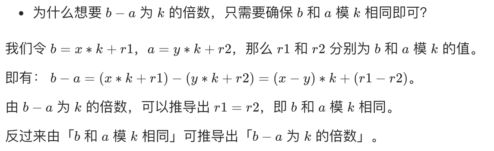

# 提前批


### pdd笔试


#### 准备

##### ⭐️数字组合

多多君最近在研究某种数字组合：
定义为：每个数字的十进制表示中(0~9)，每个数位**各不相同**且各个数位之和等于N。
满足条件的数字可能很多，找到其中的最小值即可。
多多君还有很多研究课题，于是多多君找到了你--未来的计算机科学家寻求帮助。


**输入描述:**

```
共一行，一个正整数N，如题意所示，表示组合中数字不同数位之和。
（1 <= N <= 1,000）
```


**输出描述:**

```
共一行，一个整数，表示该组合中的最小值。
如果组合中没有任何符合条件的数字，那么输出-1即可。
```


**输入例子1:**

```
5
```


**输出例子1:**

```
5
```


**例子说明1:**

```
符合条件的数字有：5，14，23，32，41
其中最小值为5
```


其实这道题我们很容易确定范围，每个数字只能出现一次，那么各数位和最大就是1~9的和45，那么大于45的数就直接返回-1即可！

💎由于要找出所有组合中的最小值，因此较大的数字肯定是放在最后的！ 我们可以根据这个特点一次次的比较数值，然后组合出最小的

```js
const readline = require('readline');
const rl = readline.createInterface({
  input: process.stdin,
  output: process.stdout,
})

/* 数字组合 */
rl.on('line', (line) => {
  const num = Number(line.trim())
  console.log(numCombine(num))
})

const numCombine = num => {
  if (num>45) return -1;
  if (num<=9) return num;
  let res='9';
  num-=9;
  for (let i = 8; i > 0; i--) {
    if (num>=i){
      res=i+res;
      num-=i;
    }
    if (num===0){
      break;
    }
  }
  return Number(res);
}

// 也可以把 <=9这种情况也加载for循环中！
const numCombine2 = num => {
  if (num>45) return -1;
  let res='';
  for (let i = 9; i > 0; i--) {
    if (num>=i){
      res=i+res;
      num-=i;
    }
    if (num===0){
      break;
    }
  }
  return Number(res);
}
```


因为是小于等于45，因此一定可以在for循环组合出最小的那个数！


当然还可以直接计算出 所有的值！

```js
const numCombine=num=>{
  if (num > 45) return -1;
  else if (num <= 9) return num
  else if (num <= 17) { // 1~8 + 9
    return (num-9)*10+9;
  }
  else if (num <= 24) { // 1~7 + 89
    return (num-17)*100+89;
  }
  else if (num <= 30) { // 1~6 + 789
    return (num-24)*1000+789;
  }
  else if (num <= 35) { // 1~5 + 6789
    return (num-30)*10000+6789;
  }
  else if (num <= 39) { // 1~4 + 56789
    return (num-35)*100000+56789;
  }
  else if (num <= 42) { // 1~3 + 456789
    return (num-39)*1000000+456789;
  }
  else if (num <= 44) { // 1~2 + 3456789
    return (num-42)*10000000+3456789;
  }
  else if (num===45){
    return 123456789;
  }
}
```


##### ⭐️⭐️字符变换

多多君最近在研究字符串之间的变换，可以对字符串进行若干次变换操作:

1. 交换任意两个相邻的字符，代价为0。
2. 将任意一个字符a修改成字符b，代价为 |a - b|（绝对值）。

现在有两个长度相同的字符串X和Y，多多君想知道，如果要将X和Y变成两个一样的字符串，需要的最少的代价之和是多少。


**输入描述:**

```
共三行，第一行，一个整数N，表示字符串的长度。
（1 <= N <= 2,000）
接下来两行，每行分别是一个字符串，表示字符串X和Y。
（字符串中仅包含小写字母）
```


**输出描述:**

```
共一行，一个整数，表示将X和Y变换成一样的字符串需要的最小的总代价。
```


**输入例子1:**

```
4
abca
abcd
```


**输出例子1:**

```
3
```


思路🧐

这道题需要抓住题目中的关键  <span style='color:blue;'>交换任意两个相邻的字符，代价为0。</span> 看着是相邻的才能交换，实际上是字符位置随意改变代价都为0！（不信你自己试试，任意一种顺序通过任意次相邻交换都可以做到！） 因此我们一开始就要对两个字符串进行排序，排好序后for循环计算长度和距离！

💎js不支持字符加减得数字，字符转ASCII码用  String.charCodeAt()

```js
const readline = require('readline');
const rl = readline.createInterface({
  input: process.stdin,
  output: process.stdout,
})
const arr = []

/* 字符变换 */
rl.on("line", (line) => {
  arr.push(line);
  if (arr.length === 3) {
    const len = Number(arr[0]);
    let s1 = arr[1], s2 = arr[2];

    console.log(numTransferred(len, s1, s2));
  }
})

const numTransferred = (len, s1, s2) => {
  const arr1=s1.split('').sort()
  const arr2=s2.split('').sort()
  let cost=0;
  for (let i = 0; i < len; i++) {
    cost+=Math.abs(arr1[i].charCodeAt(0)-arr2[i].charCodeAt(0));
  }
  return cost;
}
```


##### ⭐️⭐️⭐️和谐树

链接：https://www.nowcoder.com/questionTerminal/877c520f935c4d67a4614dc4bce84a1a?f=discussion
来源：牛客网


多多路上从左到右有N棵树（编号1～N），其中第i个颗树有和谐值Ai。 

 多多鸡认为，如果一段连续的树，它们的和谐值之和可以被M整除，那么这个区间整体看起来就是和谐的。
 现在多多鸡想请你帮忙计算一下，满足和谐条件的区间的数量。

**输入描述:**

```
第一行，有2个整数N和M，表示树的数量以及计算和谐值的参数。
（ 1 <= N <= 100,000, 1 <= M <= 100  ）
第二行，有N个整数Ai, 分别表示第i个颗树的和谐值。
（ 0 <= Ai <= 1,000,000,000 ）
```


**输出描述:**

```
共1行，每行1个整数，表示满足整体是和谐的区间的数量。
```


示例1

输入

```
5 2
1 2 3 4 5
```

输出

```
6
```

说明

```
长度为1: [2], [4]
长度为2: 无
长度为3: [1,2,3], [3,4,5]
长度为4: [1,2,3,4], [2,3,4,5]
长度为5: 无
共6个区间的和谐值之和可以被2整除。
```


💡思路：

看见这道题我一开始联想到了网易的那道幸运数字，但后来发现不对劲！ 幸运数字不要求连续，而这里却必须是连续的！


这里运用到了数字知识，就是同余性质！

 


我们以 2， [1,2,3,4,5] 举例：

😈这里我们以和谐数 2 建立一个余数数组count表示对应余数的个数！

* 设置$count[0]=1$是因为我们遇到直接可以被2整除的sum时可以直接 +1
* 但是如果遇到余数不为0的初始就为0，因为只有对应的相同余数的那个区间的和才能被2整除！


比如这里我们遇到 1，我们先加初始为0的$count[1]$，然后才是对应的$count[1]$加一变为1。然后遇到2，此时sum为3，余数也是1！因此加上此时的值为1的$count[1]$使res=1，然后$count[1]$加一变为2。

上面为什么会使 res+1呢❓ 因为 第一个余数为1的preSum的和第二个余数为1的preSum之间的区间和（$[2]$）

而第三个余数为1的preSum是 $[1,2,3,4,5]$ ，此时res会加上2！ 因为 preSum[0] ~ preSum[4],  preSum[1] ~ preSum[4] 区间和都可以被2整除。下面是解法：

🕐时间复杂度： $O(n)$

```js
const readline = require('readline');
const rl = readline.createInterface({
  input: process.stdin,
  output: process.stdout,
})
const arr=[];
const getSum = (arr) => {
  return arr.reduce((acc, val) => acc+val)
}
rl.on("line", (line) => {
  arr.push(line);
  if (arr.length === 2) {
    const data=arr[0].split(' ').map(Number);
    const trees=arr[1].split(' ').map(Number);
    const len=data[0],harmony=data[1],sum=getSum(trees);

    console.log(resolution(len,harmony,trees));
    arr.length=0;
  }
})

const resolution = (n,m,arr) => {
  let sum=0,res=0;
  const count=Array(m).fill(0);
  count[0]=1;
  for (let i = 0; i < n; i++) {
    sum+=arr[i];
    const remain=sum%m;
    res+=count[remain]++;
  }
  return res;
}
```


另一种更好懂的写法：

1. 先计算所有同余数的preSum有多少个，其满足的区间数为 $count[i]-1$

2. 由于这些区间都能互相组合， 一个区间一个，两个区间三个，三个区间六个，规律就是 
   $$
   \cfrac{count[i]*(count[i]-1)}{2}
   $$
   类似于 1+2+3+...


```js
const resolution2 = (n,m,arr) => {
  let sum=0,res=0;
  const count=Array(m).fill(0);
  count[0]=1;
  for (let i = 0; i < n; i++) {
    sum+=arr[i];
    count[sum%m]++;
  }
  for (let i = 0; i < m; i++) {
    res+=count[i]*(count[i]-1)/2
  }
  return res;
}
```


暴力解法：

时间复杂度： $O(n^2)$


先求出所有的preSum然后再遍历：

```js
const preSumRes = (n,m,arr) => {
  const preSum=Array(n+1).fill(0); // 从0到n的前缀和
  for (let i = 0; i < n; i++) {
    preSum[i+1]=preSum[i]+arr[i];
  }
  let count=0;
  for (let i = 1; i <= n; i++) {
    for (let j = 0; j < i; j++) {
      if ((preSum[i]-preSum[j])%m===0){
        count++;
      }
    }
  }
  return count;
}
```


##### ⭐️⭐️⭐️同类骰子


多多君拼团购买了N个骰子，为了方便后面进行活动，多多君需要将这些骰子进行分类。

 

两个骰子为同类的定义是：

```
将其中一个骰子通过若干次上下、左右或前后翻转后，其与另一个骰子对应的``6``面数字均相等。
```

现在多多君想知道不同种类的骰子的数量分别有多少。


**输入描述:**

```
第一行1个整数N，表示骰子的数量。（1 <= N <= 1,000）

接下来N行，每行6个数字（1～6，且各不相同）
其中第i行表示第i个骰子当前上、下、左、右、前、后这6面的数字。
```


**输出描述:**

```
共2行:
第一行1个整数M，表示不同种类的骰子的个数
第二行M个整数，由大到小排序，表示每个种类的骰子的数量
```


**输入例子1:**

```
2
1 2 3 4 5 6
1 2 6 5 3 4
```


**输出例子1:**

```
1
2
```


**例子说明1:**

```
第二个骰子相当于是第一个骰子从左向右旋转了一面得到，属于同类。
```


**输入例子2:**

```
3
1 2 3 4 5 6
1 2 6 5 3 4
1 2 3 4 6 5
```


**输出例子2:**

```
2
2 1
```


**例子说明2:**

```
第三个骰子无法通过任何旋转变换成第一个或第二个骰子。
```


我们取每个骰子：以1作为上面，然后得到侧边四面的4个数字的顺序。

如果任意两个骰子的这个侧面4个数字顺序是一样的，那么这两个骰子就是同类。

比如示例2：

骰子1：123456，侧边的四面数字为 3546（或5463、..）

骰子2：126534，侧边的四面数字为 6354（或3546、..）

骰子3：123465，侧边的四面数字为 3645（或6453、..）

调整骰子2的侧边的四面数字顺序 3546，这就和骰子1一样了。（这里为了实现匹配是通过将四位数字转为int型整数，然后取不同顺序中最小的值）

此外结合如下规律：

\1. 骰子6面可以分为3对，每对两面，比如 12 、34 、56

\2. 骰子按对顺序调换不改变骰子顺序，比如 123456 与 561234 是同一类

\3. 举例：骰子为 123456， 1位上面侧边四面为 3564

\4. 举例：骰子为 345612， 1位上面侧边四面为 3564

\5. 举例：骰子为 213456， 1位上面侧边四面为 6453


🎃核心思想就是先把所有的骰子归一化，以1⃣️作为最上面的那一面，此时去得到其侧面组合成的最小值（不用考虑最下面）


```jsx
const readline = require('readline');
const rl = readline.createInterface({
  input: process.stdin,
  output: process.stdout,
})
const arr = []
let len = -1;
rl.on('line', line => {
  if (len === -1) {
    len = Number(line);
  } else {
    arr.push(line.trim().split(' ').map(Number));
    if (arr.length === len) {
      const res = sameDice(arr);
      console.log(res.length)
      console.log(...res)
      arr.length = 0;
    }
  }
})

const sameDice = arr => {
  const res = [];

  for (let i = 0; i < arr.length; i++) {
    // 将骰子排好序，以 1 为上面计算其侧面的值
    let val = 0;
    const dices = arr[i];
    for (let j = 0; j < 6; j++) {
      if (dices[j] === 1) {
        // 21 34 56 => 12 34 65 => 3645
        val = j % 2 ? (dices[(j + 1) % 6] * 1000 + dices[(j + 4) % 6] * 100 + dices[(j + 2) % 6] * 10 + dices[(j + 3) % 6])
          : (dices[(j + 2) % 6] * 1000 + dices[(j + 4) % 6] * 100 + dices[(j + 3) % 6] * 10 + dices[(j + 5) % 6]);
        break;
      }
    }
    // 找出侧面组合最小的 比如 3456 4563 5634 6345 选择3456
    for (let k = 0, temp = val; k < 3; k++) {
      temp = Math.floor(temp / 10) + (temp % 10) * 1000;
      val = Math.min(val, temp);
    }
    res[val] = res[val] ? res[val] + 1 : 1;
  }
  return res.sort((a, b) => b - a).filter(i => i !== undefined)
}
```


