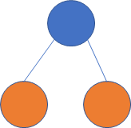

## 字节


##### ▼怎么实现数字->汉字的转化 ，

力扣原题[整数转换英文表示](https://leetcode-cn.com/problems/integer-to-english-words/)的简化汉字版本，要求通过以下三个case

12345 -> 一万二千三百四十五

10002 -> 一万零二

10080 -> 一万零八十

```js
function revert(num) {
    let numbers = ['零', '一', '二', '三', '四', '五', '六', '七', '八','九'];
    let counts = ['十', '百', '千', '万'];
    let arr = [];
    while (num) {
        arr.push(num % 10);
        num = Math.floor(num / 10);
    }
    console.log(arr)
    let res = "";
    for (let i = arr.length - 1; i >= 0; i--) {
        //只有在不等于0的情况下才进行
        if (arr[i] !== 0) {
            //判断之前有无等于0的情况有的话需要加上一个 零
            if (arr[i + 1] === 0) {
                res += numbers[0];
            }
            res += numbers[arr[i]];
            if (i > 0) {
                res += counts[i - 1];
            }
        }
    }
    return res;
}
```

1. 首先转化每个数中每一位的数字存入数组
2. 中间的0是省略的所以我们遇到0就跳过
3. 每当有数字时判断前面是否有0, 有的话则加上
4. 判断是否为个位数, 个位数不需要加上计量单位


##### 最大区间值

Leetcode上找不到的字节跳动高频面试题 (18年头条自己出的校招笔试题)

- 挑选一个区间，区间值为区间和乘以区间内最小的数的值，求区间值最大的区间（2021.1 字节跳动-国际化-前端）
- 无序数组，求一个值最大的区间，区间计算方案为：区间和 * 区间最小值（2020.09 字节跳动-电商-后端）
- [3,1,6,4,5,2]，对于任意子序列可以计算一个X值，X=sum(subArray) * min(subArray)，求最大X（2020.07 字节跳动-商业化-前端）

题目描述
给定一个数组，要求选出一个区间, 使得该区间是所有区间中经过如下计算的值最大的一个：区间中的最小数 * 区间所有数的和。数组中的元素都是非负数。


具体分析可以看下面的leetcode84

采用的单调栈+哨兵的方法

```js
/**
 * @param {number[]} arr
 * @return {number}
 */
const maxSumAndMin=arr=>{
    //实际上还是去计算数组以某一个值为区间最小值时能得到的最大乘积
    const stack=[];
    const data=[0,...arr,0];
    //计算的是开区间的和,左右都是开区间,但slice是左闭右开
    const getSum=(l,r)=>{
        return data.slice(l+1,r).reduce((a,b)=>a+b);
    }
    let maxValue=0;

    for (let i = 0; i < data.length; i++) {
        while (stack.length&&data[i]<data[stack[stack.length-1]]){
            let topIndex=stack.pop();
            maxValue=Math.max(
                maxValue,
                data[topIndex]*getSum(stack[stack.length-1],i)
            )
        }
        stack.push(i);
    }
    return maxValue;
}
```


##### [84. 柱状图中最大的矩形](https://leetcode-cn.com/problems/largest-rectangle-in-histogram/)

给定 n 个非负整数，用来表示柱状图中各个柱子的高度。每个柱子彼此相邻，且宽度为 1 。

求在该柱状图中，能够勾勒出来的矩形的最大面积。

 


以上是柱状图的示例，其中每个柱子的宽度为 1，给定的高度为 [2,1,5,6,2,3]。

 


图中阴影部分为所能勾勒出的最大矩形面积，其面积为 10 个单位。


**示例:**

>输入: [2,1,5,6,2,3]
>输出: 10


###### 1.暴力解法:   ❌

**时间复杂度: O(n^2^):**  会超出时间限制

**空间复杂度: O(1)**

思想很简单: 由于最大的矩形面积肯定是会是某个矩形的高度, 所以以每一个矩形为最大高度来计算, 向左和向右延伸

```js
/**
 * @param {number[]} heights
 * @return {number}
 */
var largestRectangleArea = function(heights) {
    //求出以每个柱子为最大高度时得到的最大面积
    let max=-1;
    for(let i=0;i<heights.length;i++){
        let count=1,h=heights[i],index=i;
        while(--index>=0&&heights[index]>=h) count++;
        index=i;
        while(++index<heights.length&&heights[index]>=h) count++;
        max=Math.max(max,count*h);
    }
    return max;
};
```


###### 2.单调栈 🌟 


主要思路:

1. 记录一个非严格单调递增栈, 存放heights数组的index
2. $heights[i]$ 大于栈顶元素则入栈
3. $heights[i]$ 小于栈顶元素, 则将栈顶元素出栈同时记录maxArea, 直到栈顶元素小于等于 $heights[i]$


上面的只是大概思路, 这里面还有许多细节:

**▼如何记录maxArea?**

​	首先可以初始化为0。每一次出栈都是因为当前bar小于该出栈元素的高度，因此其宽度可以记录为 
$$
i-stack[stack.length-1]-1
$$
​	$i$是当前bar的index，$stack[stack.length-1]$是新栈顶的index，这是单调递增栈，所以出栈元素的高度只能在新栈顶和当前bar之间满足（当然可能新栈顶高度等于出栈元素高度，但可以留在新栈顶出栈时考虑）。$i-stack[stack.length-1]$ 是当前bar和新栈顶之间的宽度，多算了当前bar所以最后还要 -1


**▼记录maxArea时栈为空了怎么办？**

​	因为每次更新maxArea的前提是有元素出栈，如果$heights[i]$小于所有栈中的元素, 导致最后栈为空没有新栈顶怎么办?  

​	设置一个高度为0的虚拟bar放在最前端, 在本题的题意下, 肯定高度为0是最小的了。这样会始终保证栈中存在一个元素。


**▼栈中最后剩下来的元素怎么办？**

​	maxArea的更新是因为$heights[i]$<栈顶元素 从而导致出栈，可是最后不一定所有元素都能出栈（比如最后一个元素永远无法出栈）。因此我们还需要一个辅助元素0放在最后，这样能保证所有元素都能出栈并计算其对应的maxArea。 （如果最后一个元素为0呢？这种情况不会出栈，但不出栈也不会影响结果）


**▼举例加深理解**

这里以[2,1,5,6,2,3]为例:

 


**时间复杂度: O(n)**

**空间复杂度: O(n)**

```js
/**
 * @param {number[]} heights
 * @return {number}
 */
var largestRectangleArea = function(heights) {
    const heightArr=[0,...heights,0];
    const stack=[];  //stack记录的是heightArr中元素的index
    let maxArea=0;
    for (let i=0;i<heightArr.length;i++){
        //当前的值小于栈顶元素时
        while (stack.length&&heightArr[i]<heightArr[stack[stack.length-1]]){ //stack[-1]:undefined
            //因为栈底肯定是0,所以不用担心栈为空的情况
            let top=stack.pop();  //栈顶元素出栈
            maxArea=Math.max(
                maxArea,
                //计算出栈的bar形成的长方形面积
                heightArr[top]*(i-stack[stack.length-1]-1) 
            )
        }
        /*注意入栈的是index不是value!!!*/
        stack.push(i);  //经过while后栈顶元素高度肯定小于等于当前的bar,入栈
    }
    return maxArea;
};
```

💣感觉这个方法挺好的， 不知道为啥时空效率这么低

 

😅更新:时空效率低地原因找到了

```js
const heightArr=[0,...heights,0];
//换成
heights.unshift(0), heights.push(0);
```


tips:

1. while中stack.length的判断其实可以去掉, 因为后面为undefined无法判断也会返回false, 但加上更加严谨而且时间有效率有所提升


🌟复习反思

1. 在原有的heights数组前后增加两个0的用途要搞清 (前后不一样的哦)
2. stack记录的是index!!!在我们比较元素大小(value)和计算宽度(采用index)时要注意


###### 3.单调栈寻找左右边界

其实这种方法没有第二种方法好, 因为需要两次循环, 但是我觉得这种方法和腾讯那道逛街的题特别相似,所以还是理解一下!!!

大致思路: 

1. 从左到右循环找到左边界 (if单调栈为空则表示之前的都满足,所以此时左边界为-1)
2. 从右到左寻找右边界(也是利用单调栈同样的思路)
3. 最后通过左右边界再求出宽度计算maxArea


```js
/**
 * @param {number[]} heights
 * @return {number}
 */
var largestRectangleArea = function(heights) {
    //第一个0是防止单调栈为空的情况
    //第二个0是为了最后将单调栈清空
    const stack=[];
    const left=[],right=[];  //这里存储的是index不是value
    let maxArea=0;
    const len=heights.length;

    //从左到右计算左边界
    for (let i = 0; i < len; i++) {
        //只要大于等于的都出栈,这里算的是能到达的最远的左边界的位置(不包含左边界)
        while (stack.length&&heights[i]<=heights[stack[stack.length-1]]){
            stack.pop();
        }
        //这里左边有一个哨兵(位置为-1),但并没有实际添加上去
        left[i]= stack.length? stack[stack.length-1]:-1;
        stack.push(i);

    }

    stack.length=0;
    //从右到左计算右边界
    for (let i =len-1; i >=0; i--) {
        //stack.length判断条件其实可以去掉,因为<右边为undefined的话默认为false,加上严谨!
        while (stack.length&&heights[i]<=heights[stack[stack.length-1]]){
            stack.pop();
        }
        right[i]=stack.length? stack[stack.length-1]:len;
        stack.push(i);
    }

    for (let i = 0; i < len; i++) {
        maxArea=Math.max(
            maxArea,
            heights[i]*(right[i]-left[i]-1)
        )
    }
    return maxArea;
};
```

 比第二种方法稍微慢一点, 但分步骤易理解一些

 

❗当然这里如果想和第二种方法一样显式地添加哨兵也是可以的, 而且只需要换成下面这样即可, 其余的不需要改变

```js
const heightsArr=[0,...heights,0];
```


## 腾讯


### 腾讯2020校园招聘-后台


#### 1.压缩算法

小Q想要给他的朋友发送一个神秘字符串，但是他发现字符串的过于长了，于是小Q发明了一种压缩算法对字符串中重复的部分进行了压缩，对于字符串中连续的m个相同字符串S将会压缩为[m|S] (m为一个整数且1<=m<=100)，例如字符串ABCABCABC将会被压缩为[3|ABC]，现在小Q的同学收到了小Q发送过来的字符串，你能帮助他进行解压缩么？ 

**输入例子1:**

```
"HG[3|B[2|CA]]F"
```


**输出例子1:**

```
"HGBCACABCACABCACAF"
```


**例子说明1:**

```
HG[3|B[2|CA]]F−>HG[3|BCACA]F−>HGBCACABCACABCACAF
```


思路其实很简单, 都能看出来是利用栈, 但是里面的细节还是对于第一次来做的我有点困难😭😭😭

🌟建立两个栈, 一个存放重复的次数, 一个存放字符串。每次遇到 [ 就先把前面的字符串保存到栈中, 遇到 ] 后就从stackStr中弹出一个并和压缩字符串相加 比如  s [3|ab]  ==> s + ab*3 

```js
/**
 * 代码中的类名、方法名、参数名已经指定，请勿修改，直接返回方法规定的值即可
 *
 * 
 * @param str string字符串 
 * @return string字符串
 */
function compress( str ) {
    // write code here
    let re='',num=0,stackNum=[],stackStr=[];
    for(let i=0;i<str.length;i++){
        if(str[i]==='['){
            stackStr.push(re);
            re='';
        }else if(!isNaN(str[i])){
            num=num*10+Number(str[i]);
        }else if(str[i]==='|'){
            stackNum.push(num);
            num=0;
        }else if(str[i]===']'){
            let tmp=stackStr.pop();   //tmp是压缩[]前的字符
            re=tmp+re.repeat(stackNum.pop());
        }else{   //普通字符串
            re+=str[i];
        }
    }
    return re;
}
module.exports = {
    compress : compress
};
```


相关题目:

[面试题 01.06. 字符串压缩](https://leetcode-cn.com/problems/compress-string-lcci/)

[443. 压缩字符串](https://leetcode-cn.com/problems/string-compression/)

[1531. 压缩字符串 II](https://leetcode-cn.com/problems/string-compression-ii/)


#### 2.[逛街](https://www.nowcoder.com/question/next?pid=21283868&qid=1453812&tid=43175324)

小Q在周末的时候和他的小伙伴来到大城市逛街，一条步行街上有很多高楼，共有n座高楼排成一行。

小Q从第一栋一直走到了最后一栋，小Q从来都没有见到这么多的楼，所以他想知道他在每栋楼的位置处能看到多少栋楼呢？（当前面的楼的高度大于等于后面的楼时，后面的楼将被挡住） 


**输入例子1:**

```
[5,3,8,3,2,5]
```


**输出例子1:**

```
[3,3,5,4,4,4]
```


**例子说明1:**

当小Q处于位置3时，他可以向前看到位置2,1处的楼，向后看到位置4,6处的楼，加上第3栋楼，共可看到5栋楼。当小Q处于位置4时，他可以向前看到位置3处的楼，向后看到位置5,6处的楼，加上第4栋楼，共可看到4栋楼。


意思是, 处于当前楼比如现在是楼高为8的楼时, 首先我们肯定可以看见当前这个高为8的楼, 其次我们向左边看 3<5不会有遮挡, 所以能看到两栋楼;  向右边看 3>2, 会遮挡掉一栋楼, 所以能看到两栋楼, 一共是5栋楼


```js
/**
 * 代码中的类名、方法名、参数名已经指定，请勿修改，直接返回方法规定的值即可
 *
 * 
 * @param heights int整型一维数组 
 * @return int整型一维数组
 */
function findBuilding( heights ) {
    // write code here
    let len=heights.length;
    let stack=[heights[0]]; 
    let pre=Array(len),suff=Array(len);
    pre[0]=1, suff[len-1]=0;
    for(let i=1;i<heights.length;i++){
        pre[i]=stack.length+1;  //pre包括前面的和当前的楼
        while(stack.length&&stack[stack.length-1]<=heights[i]){
            stack.pop();
        }
        stack.push(heights[i]);
    }
    stack=[heights[len-1]];
    for(let i=heights.length-2;i>=0;i--){
        suff[i]=stack.length;  //pre包括前面的和当前的楼
        while(stack.length&&stack[stack.length-1]<=heights[i]){
            stack.pop();
        }
        stack.push(heights[i]);
    }
    let res=Array(len);
    for(let i=0;i<len;i++){
        res[i]=pre[i]+suff[i];
    }
    return res;
}
module.exports = {
    findBuilding : findBuilding
};
```


**🌟反思:**

其实这是一道很简单的题, 为什么做的这么不好???

1. 首先是没有理解清楚题意!!!  题目表述确实有点不清晰...
2. 应该速度抓住重点, 使用一个栈表示前面的楼层, 当前楼更高就一直出栈就行了!!!
3. 其实可以优化, 用一个res数组来标识pre和suff就行了, 初始化为1, 表示肯定能看见当前的


#### 3.[假期](https://www.nowcoder.com/questionTerminal/7cd9a140387e455a972e8fea0e74be2c)


由于业绩优秀，公司给小Q放了 n 天的假，身为工作狂的小Q打算在在假期中工作、锻炼或者休息。他有个奇怪的习惯：不会连续两天工作或锻炼。只有当公司营业时，小Q才能去工作，只有当健身房营业时，小Q才能去健身，小Q一天只能干一件事。给出假期中公司，健身房的营业情况，求小Q最少需要休息几天。


**输入描述:**

```
第一行一个整数 n(1≤n≤100000)n(1\leq n\leq 100000)n(1≤n≤100000) 表示放假天数
第二行 n 个数 每个数为0或1,第 i 个数表示公司在第 i 天是否营业
第三行 n 个数 每个数为0或1,第 i 个数表示健身房在第 i 天是否营业
（1为营业 0为不营业）
```

**输出描述:**

```
一个整数，表示小Q休息的最少天数
```


示例1

输入

```
4
1 1 0 0
0 1 1 0
```

输出

```
2
```

说明

```
小Q可以在第一天工作，第二天或第三天健身，小Q最少休息2天
```


自己的思路:

这道题有坑, 不能直接按照贪心去直接把工作和健身算进去, 比如

corp: 1  1  0

gym:  1  1  1

如果第一天直接选work的话, 必须休息一天, 但如果第一天选gym的话休息0天。因此我们需要跳过中间都为1的点!!!

```js
const readline=require('readline');
const rl=readline.createInterface({
    input:process.stdin,
    output:process.stdout
})
const arr=[];
rl.on('line',function(line){
    arr.push(line);
    if(arr.length===3){
        let len=Number(arr[0]);
        let corp=arr[1].split(' ').map(Number);
        let gym=arr[2].split(' ').map(Number);
        let work=false,train=false;
        //dp[i]表示i天时间内最少休息的天数
        let dp=Array(len+1).fill(0);  //多加一位方便计算
        for(let i=0;i<len;i++){
            //1.必须休息的情况 [0,0]
            if((!corp[i]&&!gym[i])||(work&&!gym[i])||(train&&!corp[i])){
                dp[i+1]=dp[i]+1; work=false; train=false;
                continue;
            }
            //2.公司和健身房都营业一天及以上的情况 [1,1]+
            if ((!work&&!train)&&(corp[i]&&gym[i])&&i<len-1){
                let end=i;
                while (end<len-1&&corp[end]&&gym[end]){
                    end++;
                }
                work=false; train=false;
                //corp和gym从0开始, 而dp从1开始
                //end此时指向corp和gym中不为[1,1]的位置,而这个位置对应dp[end+1]
                //所以我们之确定dp[end]
                dp[end]=dp[i];  //就跳过中间都为1的点,让循环自己判断下一次
                i=end-1;  //for循环最后会加1
                continue;
            }
            //3.公司和健身房只有一个在营业的情况 [1,0] or [0,1]
            if(!work&&corp[i]){
                work=true;  train=false;
                dp[i+1]=dp[i];
            }else if(!train&&gym[i]){
                train=true; work=false;
                dp[i+1]=dp[i];
            }
        }
        console.log(dp[len]);
        arr.length=0;
    }
})
```


🌟但是这道题利用这种动态规划更简洁!!! 而且不用考虑那么多!!!

#### 状态转移分析  

  1、每一天小Q都可能处于3个状态，那就是工作、休息、锻炼  

  2、若第i天小Q处于工作状态，那么第i-1天只能是休息、锻炼  

  3、若第i天小Q处于锻炼状态，那么第i-1天只能是休息、工作  

  4、若第i天小Q处于休息状态，那么第i-1天可能是工作、休息、锻炼。

```js
const readline=require('readline');
const rl=readline.createInterface({
    input:process.stdin,
    output:process.stdout
})
const arr=[];
rl.on('line',function(line){
    arr.push(line);
    if(arr.length===3){
        let len=Number(arr[0]);
        let corp=arr[1].split(' ').map(Number);
        let gym=arr[2].split(' ').map(Number);
        //0: 休息  1:工作 2:健身
        //dp[0][i]表示第i天休息的情况下最少休息的天数
        //多加一位方便计算
        let dp=Array.from({length:3},()=>Array(len+1).fill(Infinity)); 
        dp[0][0]=0; dp[1][0]=0; dp[2][0]=0; //初始化
        for(let i=1;i<=len;i++){
            //1.休息
            dp[0][i]=Math.min(dp[0][i-1],dp[1][i-1],dp[2][i-1])+1;
            //2.可以工作
            if(corp[i-1]){
                dp[1][i]=Math.min(dp[0][i-1],dp[2][i-1]);
            }
            //3.可以锻炼
            if(gym[i-1]){
                dp[2][i]=Math.min(dp[0][i-1],dp[1][i-1]);
            }
        }
        
        console.log(Math.min(dp[0][len],dp[1][len],dp[2][len]));
        arr.length=0;
    }
})
```


## 网易

1.[编程题]判断是不是子字符串

给定两个字符串 s和 t ，判断 s是否为 t 的子序列。

你可以认为 s 和 t 中仅包含英文小写字母。字符串 t 可能会很长（长度 ~= 500,000），而 s 是个短字符串（长度 <=100）。

字符串的一个子序列是原始字符串删除一些（也可以不删除）字符而不改变剩余字符相对位置形成的新字符串。（例如，"ace"是"abcde"的一个子序列，而"aec"不是）。


**输入描述:**

```
共两行，第一行为字符串s,  第二行为字符串t
```


**输出描述:**

```
输出true或者是false，true表示是s是t的子序列，false表示s不是t的子序列
```


**输入例子1:**

```
abc
ahbgdc
```


**输出例子1:**

```
true
```


这是一个easy题, 主要用来熟悉一下输入输出格式


```js
const readline=require('readline');
const rl=readline.createInterface({
    input:process.stdin,
    output:process.stdout
})
const arr=[];
rl.on('line', function (line) {
    arr.push(line.trim());
    if(arr.length===2){
        let s=arr[0],t=arr[1];
        let i=0,j=0;
        while(i<s.length&&j<t.length){
            if(s[i]===t[j++]) i++;
        }
        console.log(i===s.length);
    }
});
```


rl.on监听了一个line事件, 每次我们按下enter键时函数就会执行 (这个监听函数一直都存在!)

**🌟对于固定行数的多行数据, 我们可以先装进一个数组, 然后判断行数再进行相关的逻辑操作**


#### 2.[编程题]电影院选座

疫情逐步缓和后，电影院终于开业了，但是由于当前仍处于疫情期间，应尽量保持人群不聚集的原则。
所以当小易来电影院选定一排后，尽量需要选择一个远离人群的位置。
已知由0和1组成的数组表示当前排的座位情况,其中1表示已被选座，0表示空座
请问小易所选座位和最近人的距离座位数最大是多少？
有如下假设：至少有一个人已选座，至少有一个空座位，且座位数限制为 2 <=length <=1000


**输入描述:**

```
一行由0和1组成的整数数组
```


**输出描述:**

```
仅一行一个整数表示答案
```


**输入例子1:**

```
1 0 0 0 1 0 1
```


**输出例子1:**

```
2
```


**例子说明1:**

```
小易第3个座位最合适，则和座位1/座位5的距离为2
```


**🌟头部和尾部的话不用除2,  在人中间的话需要除2**

```js
const readline=require('readline');
const rl=readline.createInterface({
    input:process.stdin,
    output:process.stdout
})
const arr=[];
rl.on('line', function (line) {
    let nums=line.trim().split(' ').map(Number);
    let head=0,tail=0;
    let max=0,mid=0;
    //计算头部和尾部有多少个连续的空位
    while (nums[head]===0) head++;
    while (nums[nums.length-1-tail]===0) tail++;
    for (let i=head+1;i<nums.length-tail-1;i++){
        mid= nums[i] ? 0 : mid+1
        max=Math.max(max,mid);
    }
    console.log(Math.max(Math.ceil(max/2),head,tail));

});
```


#### [★★611. 有效三角形的个数](https://leetcode-cn.com/problems/valid-triangle-number/)

难度中等

给定一个包含非负整数的数组，你的任务是统计其中可以组成三角形三条边的三元组个数。

**示例 1:**

```
输入: [2,2,3,4]
输出: 3
解释:
有效的组合是: 
2,3,4 (使用第一个 2)
2,3,4 (使用第二个 2)
2,2,3
```

**注意:**

1. 数组长度不超过1000。
2. 数组里整数的范围为 [0, 1000]。


★笔试有道题和这个类似, 那道题还需要求关键元素就是有效三角形中出现最多的元素


▼双指针:  先排序, 再固定最大的开始找

   

```js
/**
 * @param {number[]} nums
 * @return {number}
 */
var triangleNumber = function(nums) {
    let sortNums=nums.sort((a,b)=>a-b);
    let count=0;
    for(let i=sortNums.length-1;i>=2;i--){
        let left=0,right=i-1;
        while(left<right){
            if(sortNums[left]+sortNums[right]>sortNums[i]){
                count+=right-left;
                right--    
            }else{
                left++
            }
        }
    }
    return count;
};
```


#### ★3.樱桃树

有一棵二叉树，树上的叶子节点定义为“樱桃”。现在需要找出树上有多少个满足如下子结构的“樱桃”串，即一串上刚好有两颗“樱桃”。



比如如下的一棵树，红框标示的有两个符合要求的结构，答案就是2


**输入描述:**

```
第一行两个正整数m, n，空格分开，分别代表总共有树上有多少个节点，和树上有多少条边，2<=m<=100,  1<=n<=100
下面有n行，每行为3个部分，用空格分割，第一个数字为某非叶子节点的id, 第二个为该边为left还是right，第三个为子节点的id
注意：节点id彼此不会重复，id 1为根节点 
```


**输出描述:**

```
一个整数，标示符合要求的子结构的数量
```


**输入例子1:**

```
10 9
1 left 2
1 right 3
2 left 4
2 right 5
3 right 6
6 left 7
6 right 8
8 left 9
8 right 10
```


**输出例子1:**

```
2
```


**🌟这道题主要学习一下树的输入方式的处理!!!**  

一看到这道题可能先想的是如何去构建一棵树, 但是其实这道题可以使用Map或者数组来进行构建, 因为只需要判断每个结点 ①是否有两个子结点 ②子节点是否都是叶子结点 即可!!!

  我采用的的map, 也是熟悉一下api😂  不过我觉得使用数组更好, map需要自己定义value, 容易出错

```js
/*
第一行两个正整数m, n，空格分开，分别代表总共有树上有多少个节点，和树上有多少条边，2<=m<=100,  1<=n<=100
下面有n行，每行为3个部分，用空格分割，第一个数字为某非叶子节点的id, 第二个为该边为left还是right，第三个为子节点的id
注意：节点id彼此不会重复，id 1为根节点 
*/
const readline=require('readline');
const rl = readline.createInterface({
    input:process.stdin,
    output:process.stdout
})

const arr=[];
let nodeNum,edgeNum;
const tree=new Map();
rl.on('line',function(line){
    arr.push(line);
    if(arr.length===1){
        let keys=line.trim().split(' ').map(Number);
        nodeNum=keys[0]; edgeNum=keys[1];  //m为节点数, n为边数
    }else{
        let rows=line.trim().split(' ');
        let parent=Number(rows[0]);
        let child=Number(rows[2]);
        //key采用Number, value采用Stirng
        if(!tree.has(parent)){
            tree.set(parent,child+''); //不要忘记使其变为String
        }else{
            let pre=tree.get(parent);
            tree.set(parent,pre+' '+child);
        }
    }
    if(arr.length===edgeNum+1){
        let count=0;
        tree.forEach((value,key)=>{
            let values=value.split(' ').map(Number);
            if(values.length===2&&!tree.has(values[0])&&!tree.has(values[1])){
                count++;
            }
        })
        console.log(count);
        arr.length=0;
    }
})
```

❗

**console**.log('1 '.split(''))

**输出****: ['1', ' '];**

**console**.log('1 '.split(' '))

**输出****: ['1', ''];**

 ❗注意, 添加空格的情况下如果split为空字符'', 会把空格也算进数组; 如果split为空格' ', 会把空字符算进数组

🌟所以在上面不能写成 pre+child+' ' 而要写成 pre+' '+child  ,


#### ★摩尔斯电码解码

已知摩尔斯电码和字符映射关系如下：

- A -> 0

- B -> 1

- C -> 10

- D -> 11

- E -> 100

- F -> 101

- G -> 110

- H -> 111

当前我们获取到了一串01数字字符串，需要进行摩尔斯电码解码，请问共有多少种解码方法？

**输入描述:**

```
一行由0和1组成的字符串
```


**输出描述:**

```
一行一个数字表示答案，即解码方法数量
```


**输入例子1:**

```
11
```


**输出例子1:**

```
2
```


**例子说明1:**

```
有D和BB两种解法
```


🌟这道题就是简单的dp!!!  

 

```js
const readline=require('readline');
const rl=readline.createInterface({
    input:process.stdin,
    output:process.stdout
})

rl.on('line',function(line){
    let s=line.trim(),len=s.length;
    let dp=Array(len+1).fill(0);
    //dp[i]表示s[0]到s[i-1]的子串有多少种解法
    dp[0]=1;  //dp[0]相当于在头部新增的辅助结点
    for(let i=0;i<len;i++){ //s[i] 对应dp[i+1]
        dp[i+1]=dp[i]; //s[i-2]直接到s[i-1]这里有一种
        if(i>0&&s[i-1]==='1') dp[i+1]+=dp[i-1];
        if(i>1&&s[i-2]==='1') dp[i+1]+=dp[i-2];
    }
    console.log(dp[len]);  
})
```


## 美团


#### ★★★最优二叉树

链接：https://www.nowcoder.com/questionTerminal/0d939e874a004f449a370aca1346dd5c?answerType=1&f=discussion
来源：牛客网


小团有一个由N个节点组成的二叉树，每个节点有一个权值。定义二叉树每条边的开销为其两端节点权值的乘积，二叉树的总开销即每条边的开销之和。小团按照二叉树的中序遍历依次记录下每个节点的权值，即他记录下了N个数，第i个数表示位于中序遍历第i个位置的节点的权值。之后由于某种原因，小团遗忘了二叉树的具体结构。在所有可能的二叉树中，总开销最小的二叉树被称为最优二叉树。现在，小团请小美求出最优二叉树的总开销。  


**输入描述:**

```
第一行输入一个整数N（1<=N<=300），表示二叉树的节点数。第二行输入N个由空格隔开的整数，表示按中序遍历记录下的各个节点的权值，所有权值均为不超过1000的正整数。
```


**输出描述:**

```
输出一个整数，表示最优二叉树的总开销。
```

示例1

输入

```
5
7 6 5 1 3
```

输出

```
45
```

说明

```
最优二叉树如图所示，总开销为7*1+6*5+5*1+1*3=45。
```


美团不当人系列...  二叉树+dp, 还是三维dp, 树还要考虑虚拟节点, 而且树有三层结构

 

```js
const readline=require('readline');
const rl=readline.createInterface({
    input:process.stdin,
    output:process.stdout
})
const arr=[];
rl.on('line',function(line){
    arr.push(line);
    if(arr.length===2){
        let len=Number(arr[0]);
        let w=arr[1].split(' ').map(Number);
        w.unshift(0);

        //1.dp[low][high][root]表示以root为根节点,
        //其左/右子树节点范围在data[low,high]内的最小开销(左或者右,只有一边)
        //2.len+1是因为需要有一个虚拟的根节点
        let dp=Array.from({length:len+1},
            ()=>Array.from({length:len+1},()=>Array(len+1).fill(-1)));
        const dfs=(low,high,root)=>{
            if(low>high) return 0;
            //如果访问过则直接返回
            if(dp[low][high][root]!=-1) return dp[low][high][root];
            //在low~high每个位置都有可能作为根节点
            let cost=Infinity;
            for(let i=low;i<=high;i++){
                let left=dfs(low,i-1,i);
                let right=dfs(i+1,high,i);
                cost=Math.min(cost,left+right+w[i]*w[root]);
            }
            return dp[low][high][root]=cost;
        }
        console.log(dfs(1,len,0));

        //next
        arr.length=0;
    }
})
```


