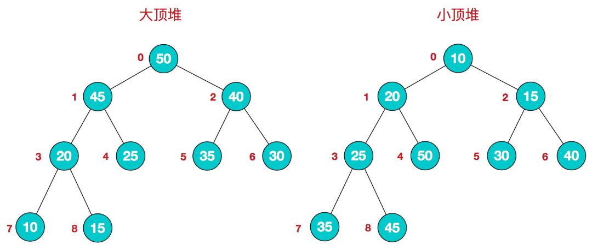
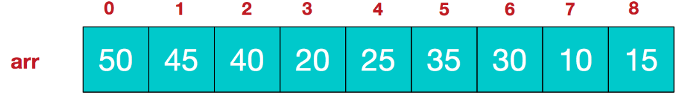
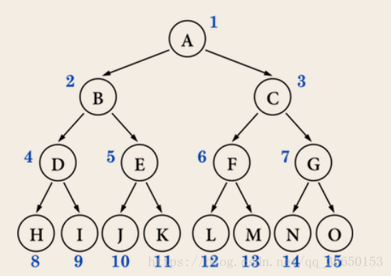
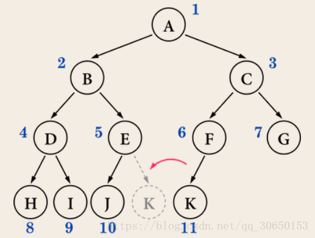
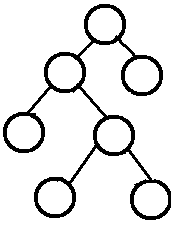
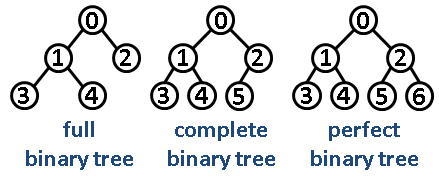

## 链表

```js
//s
class ListNode {
 constructor(key, value) {
  this.key = key;
  this.value = value;
  this.next = null;
  this.prev = null;
 }
}
```


## 堆

关于堆的详细介绍: 👉  [堆](https://www.cnblogs.com/chengxiao/p/6129630.html)

- 堆是一个**完全二叉树。**

- 完全二叉树： 二叉树除开最后一层，其他层结点数都达到最大，最后一层的所有结点都集中在左边（左边结点排列满的情况下，右边才能缺失结点）。

- **堆**

  **堆是具有以下性质的完全二叉树：每个结点的值都大于或等于其左右孩子结点的值，称为大顶堆；或者每个结点的值都小于或等于其左右孩子结点的值，称为小顶堆。如下图：**

  

  同时，我们对堆中的结点按层进行编号，将这种逻辑结构映射到数组中就是下面这个样子

  

  该数组从逻辑上讲就是一个堆结构，我们用简单的公式来描述一下堆的定义就是：

  **大顶堆：arr[i] >= arr[2i+1] && arr[i] >= arr[2i+2]**  

  **小顶堆：arr[i] <= arr[2i+1] && arr[i] <= arr[2i+2]**  

完全二叉树中非叶子节点序号为i的话, 其左子树序号为2i+1, 右子树序号为2i+2


#### **堆结构实现**  

关于堆的详细介绍: 👉  [堆](https://www.cnblogs.com/chengxiao/p/6129630.html)

- 堆是一个**完全二叉树。**

- 完全二叉树： 二叉树除开最后一层，其他层结点数都达到最大，最后一层的所有结点都集中在左边（左边结点排列满的情况下，右边才能缺失结点）。

- **堆**

  **堆是具有以下性质的完全二叉树：每个结点的值都大于或等于其左右孩子结点的值，称为大顶堆；或者每个结点的值都小于或等于其左右孩子结点的值，称为小顶堆。如下图：**

  

  同时，我们对堆中的结点按层进行编号，将这种逻辑结构映射到数组中就是下面这个样子

  

  该数组从逻辑上讲就是一个堆结构，我们用简单的公式来描述一下堆的定义就是：

  **大顶堆：arr[i] >= arr[2i+1] && arr[i] >= arr[2i+2]**  

  **小顶堆：arr[i] <= arr[2i+1] && arr[i] <= arr[2i+2]**  

完全二叉树中非叶子节点序号为i的话, 其左子树序号为2i+1, 右子树序号为2i+2


**堆结构实现  大小顶堆通用(更换cmp方法)**

1.insert()  插入num在数组最后, 根据堆是完全二叉树的性质, 从下往上调整

**时间复杂度**：O(logn)

将元素插入最后一位，再进行向上冒泡，即如果父节点的值小于被插入的元素，父节点下移，被插入的元素上移。时间复杂度取决于树的高度h。而完全二叉树的树的高度为[logn+1]的上取整，所示时间复杂度为O(logn)。

2.extract()  交换首尾, pop()   从上向下进行调整

**时间复杂度**：O(logn)

删除操作的逻辑为，删除堆的根节点，将最后一个节点补到根节点位置，得到一颗不符合规则的堆。再对根节点进行向下冒泡，即如果父节点小于某一孩子或所有孩子，将元素值最大 的孩子与父节点交换。孩子上移，父节点下移，下移后与孩子重复该操作，直到比孩子都大或没有孩子。
删除操作向下深入，操作时间还是取决于树的高度，时间复杂度为O(logn)


```js
const maxHeapCmp=(x,y)=>x>y;  //最大堆
const swap=(arr,i,j)=>([arr[i], arr[j]] = [arr[j], arr[i]]);
class Heap{
    /*默认最大堆*/
    constructor(cmp=maxHeapCmp) {
        this.container=[];
        this.cmp=cmp;
    }

    insert(data){
        const  {container,cmp}=this;
        container.push(data);
        let index=container.length-1;
        //建立大顶堆/小顶堆
        while (index) {
            let parent = Math.floor((index - 1) / 2);
            if (!cmp(container[index],container[parent])){
                return;
            }
            swap(container,index,parent);
            index=parent;
        }
    }

    extract(){
        const  {container,cmp}=this;
        if (!container.length) return null;
        swap(container,0,container.length-1);
        const res=container.pop();  //得到结果

        //调整堆
        const length=container.length;
        let index=0,exchange=index*2+1;
        while (exchange<length){
            //由比较函数确定大小顶堆. 如果这里是大顶堆,则需要大的,
            // 所以我们判断的是右节点是否大于左节点
            if (exchange+1<length && cmp(container[exchange+1],container[exchange])){
                exchange++;
            }
            if (cmp(container[exchange],container[index])){
                swap(container,exchange,index);
                index=exchange;
                exchange=exchange*2+1;
            }else {   //这是建立在原本下面的都是大顶堆的情况,所以可以break
                break;
            }
        }
        return res;
    }

    top(){
        return  this.container.length? this.container[0]:null;
    }
}
```


1.insert()  插入num在数组最后, 根据堆是完全二叉树的性质, 从下往上调整

**时间复杂度**：O(logn)

将元素插入最后一位，再进行向上冒泡，即如果父节点的值小于被插入的元素，父节点下移，被插入的元素上移。时间复杂度取决于树的高度h。而完全二叉树的树的高度为[logn+1]的上取整，所示时间复杂度为O(logn)。

2.extract()  交换首尾, pop()   从上向下进行调整

**时间复杂度**：O(logn)

删除操作的逻辑为，删除堆的根节点，将最后一个节点补到根节点位置，得到一颗不符合规则的堆。再对根节点进行向下冒泡，即如果父节点小于某一孩子或所有孩子，将元素值最大 的孩子与父节点交换。孩子上移，父节点下移，下移后与孩子重复该操作，直到比孩子都大或没有孩子。
删除操作向下深入，操作时间还是取决于树的高度，时间复杂度为O(logn)


```js
const maxHeapCmp=(x,y)=>x>y;  //最大堆
const swap=(arr,i,j)=>([arr[i], arr[j]] = [arr[j], arr[i]]);
class Heap{
    /*默认最大堆*/
    constructor(cmp=maxHeapCmp) {
        this.container=[];
        this.cmp=cmp;
    }

    insert(data){
        const  {container,cmp}=this;
        container.push(data);
        let index=container.length-1;
        //建立大顶堆/小顶堆
        while (index) {
            let parent = Math.floor((index - 1) / 2);
            if (!cmp(container[index],container[parent])){
                return;
            }
            swap(container,index,parent);
            index=parent;
        }
    }

    extract(){
        const  {container,cmp}=this;
        if (!container.length) return null;
        swap(container,0,container.length-1);
        const res=container.pop();  //得到结果

        //调整堆
        const length=container.length;
        let index=0,exchange=index*2+1;
        while (exchange<length){
            //由比较函数确定大小顶堆. 如果这里是大顶堆,则需要大的,
            // 所以我们判断的是右节点是否大于左节点
            if (exchange+1<length && cmp(container[exchange+1],container[exchange])){
                exchange++;
            }
            if (cmp(container[exchange],container[index])){
                swap(container,exchange,index);
                index=exchange;
                exchange=exchange*2+1;
            }else {   //这是建立在原本下面的都是大顶堆的情况,所以可以break
                break;
            }
        }
        return res;
    }

    top(){
        return  this.container.length? this.container[0]:null;
    }
}
```


## 树

★二叉树各种leetcode [题解](https://leetcode-cn.com/problems/increasing-order-search-tree/solution/yi-tao-quan-fa-shua-diao-nge-bian-li-shu-de-wen-3/)    [树算法的套路框架](https://leetcode-cn.com/problems/same-tree/solution/xie-shu-suan-fa-de-tao-lu-kuang-jia-by-wei-lai-bu-/)


### 基本概念

####  二叉树的性质

1. 若二叉树的层次从0开始，则在二叉树的第i层至多有2^i个结点(i>=0)。
2. 高度为k的二叉树最多有2^(k+1) - 1个结点(k>=-1)。 (空树的高度为-1)
3. 对任何一棵二叉树，如果其叶子结点(度为0)数为m, 度为2的结点数为n, 则m = n + 1。


#### 完美二叉树(perfect)

一个深度为k(>=-1)且有2^(k+1) - 1个结点的二叉树称为**完美二叉树** (perfect binary tree)
换句话说：树是满的，还是二叉的 (就是常说的满二叉树)
图是这样的：



#### 完全二叉树(Complete)

完全二叉树从根结点到倒数第二层满足完美二叉树，最后一层可以不完全填充，其叶子结点都靠左对齐

下图就**不是**一棵完全(Complete)二叉树



#### 完满二叉树(full)

所有非叶子结点的度都是2
换句话说：只要你有孩子，你就必然是有**两个**孩子。

 


合集:




#### 二叉搜索树BST

[二叉查找树](https://baike.baidu.com/item/二叉查找树/7077965)（**Binary Search Tree**），（又：二叉搜索树，二叉排序树）它或者是一棵空树，或者是具有下列性质的[二叉树](https://baike.baidu.com/item/二叉树/1602879)： 若它的左子树不空，则左子树上所有结点的值均小于它的[根结点](https://baike.baidu.com/item/根结点/9795570)的值； 若它的右子树不空，则右子树上所有结点的值均大于它的根结点的值； 它的左、右子树也分别为[二叉排序树](https://baike.baidu.com/item/二叉排序树/10905079)。二叉搜索树作为一种经典的数据结构，它既有链表的快速插入与删除操作的特点，又有数组快速查找的优势；所以应用十分广泛，例如在文件系统和数据库系统一般会采用这种数据结构进行高效率的排序与检索操作。


### 基础题

二叉树的三种遍历:


#### [100. 相同的树](https://leetcode-cn.com/problems/same-tree/)

难度简单577收藏分享切换为英文接收动态反馈

给你两棵二叉树的根节点 `p` 和 `q` ，编写一个函数来检验这两棵树是否相同。

如果两个树在结构上相同，并且节点具有相同的值，则认为它们是相同的。

**提示：**

- 两棵树上的节点数目都在范围 `[0, 100]` 内
- `-104 <= Node.val <= 104`


```js
/**
 * Definition for a binary tree node.
 * function TreeNode(val, left, right) {
 *     this.val = (val===undefined ? 0 : val)
 *     this.left = (left===undefined ? null : left)
 *     this.right = (right===undefined ? null : right)
 * }
 */
/**
 * @param {TreeNode} p
 * @param {TreeNode} q
 * @return {boolean}
 */
//way1: DFS
var isSameTree = function(p, q) {
    if(p==null&&q==null){
        return true;
    }
    if(p==null||q==null){
        return false;
    }
    return p.val===q.val&&isSameTree(p.left,q.left)&&isSameTree(p.right,q.right);
};

//way2: BFS
var isSameTree = function(p, q) {
    //BFS
    let queP=[p],queQ=[q];
    let curP,curQ;
    while(queP.length&&queQ.length){
        curP=queP.shift();
        curQ=queQ.shift();
        //注意这里并不是就表示结束了,因为队列中会添加很多null结点进行比较
        if(curP==null&&curQ==null){
            continue;
        }
        if(curP==null||curQ==null){
            return false;
        }
        if(curP.val!==curQ.val){
            return false;
        }
        //继续寻找,并将子节点入队
        queP.push(curP.left); 
        queP.push(curP.right);

        queQ.push(curQ.left);
        queQ.push(curQ.right);
    }
    return true;
};
```

