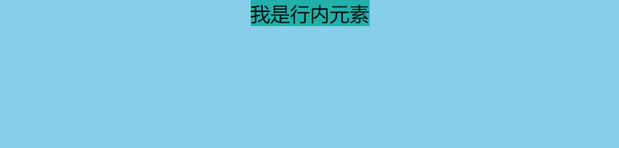
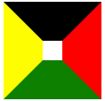
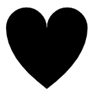

## 一. 布局


### 居中

#### 1.水平居中

* **行内元素** (父元素必须是块级元素)

  **text-align: center**

```html
<style>
  #father {
    width: 500px;
    height: 300px;
    background-color: skyblue;
    text-align: center;
  }
</style>

<div id="father">
   <span id="son">我是行内元素</span>
</div>
```




* **块状元素**

  需要谁居中，给其设置 ***margin: 0 auto;*** （作用：使盒子自己居中)

  

```html
<style>
    #father {
        width: 500px;
        height: 300px;
        background-color: skyblue;
    }
 
    #son {
        width: 100px;
        height: 100px;
        background-color: green;
        margin: 0 auto;
    }
</style>
 
<div id="father">
    <div id="son">我是块级元素</div>
</div>
```


 


* <span style="font-size:20px;font-weight:bold"> **使用定位属性**</span>

▼首先设置父元素为相对定位，再设置子元素为绝对定位，设置子元素的**left:50%**，即让子元素的左上角水平居中； 然后设置绝对子元素的 **margin-left: -元素宽度的一半px;** 或者设置**transform: translateX(-50%);**


```html
<style>
    #father {
        width: 500px;
        height: 300px;
        background-color: skyblue;
        position: relative;
}
 
    #son {
        width: 100px;
        height: 100px;
        background-color: green;
        position: absolute;   //★
        left: 50%;            //★
        margin-left: -50px;   //★
        //或者transform:translateX(-50%);
}
</style>
 
<div id="father">
    <div id="son">我是块级元素</div>
</div>
```


* <span style="font-size:20px;font-weight:bold"> **使用flex布局**</span>

使用flexbox布局，只需要给待处理的块状元素的**父元素**添加属性 **display: flex; justify-content: center;**

```html
<style>
    #father {
        width: 500px;
        height: 300px;
        background-color: skyblue;
        display: flex;
        justify-content: center;
    }
 
    #son {
        width: 100px;
        height: 100px;
        background-color: green;
    }
</style>
 
<div id="father">
    <div id="son">我是块级元素</div>
</div>
```


#### 2.垂直居中


* <span style="font-size:20px;font-weight:bold"> 单行的行内元素</span>

  直接设置 line-height 等于父元素的height值

```html
<style>
    #father {
        width: 500px;
        height: 300px;
        background-color: skyblue;
    }
 
    #son {
        background-color: green;
        line-height: 300px;
    }
</style>
 
<div id="father">
    <span id="son">我是单行的行内元素</span>
</div>
```

 


❗单行是指文字字数的长度不会超过父元素, 如果超出了每行之间的间距会很大 因为line-height就是表示一行文字的高度


* <span style="font-size:20px;font-weight:bold">多行的行内元素 </span>

使用给父元素设置**display:table-cell;**和**vertical-align: middle;**属即可；

```html
<style>
    #father {
        width: 500px;
        height: 300px;
        background-color: skyblue;
        display: table-cell;
        vertical-align:middle;
    }
 
    #son {
        background-color: green;
    }
</style>
 
<div id="father">
    <span id="son">我是多行的行内元素我是多行的行内元素我是多行的行内元素我是多行的行内元素我是多行的行内元素我是多行的行内元素我是多行的行内元素我是多行的行内元素</span>
</div>
```


 


* <span style="font-size:20px;font-weight:bold">块级元素 </span>

**way1: 使用定位**

首先设置父元素为相对定位，再设置子元素为绝对定位，设置子元素的**top: 50%**，即让子元素的左上角垂直居中；设置绝对子元素的 **margin-top: -元素高度的一半px;** 或者设置**transform: translateY(-50%);**


**way2: 使用flex布局**

只需要给待处理的块状元素的父元素添加属性 **display: flex; align-items: center;**


#### 3.水平垂直居中

- <span style="font-size:20px;font-weight:bold">已知高度和宽度的元素 </span>

**★方案一：**设置父元素为相对定位，给子元素设置绝对定位，**top: 0; right: 0; bottom: 0; left: 0; margin: auto;**


**方案二：**设置父元素为相对定位，给子元素设置绝对定位，**left: 50%; top: 50%; margin-left: -**-**子元素宽度的一半px ** **; margin-top: -** **-元素高度的一半px**;


- <span style="font-size:20px;font-weight:bold">未知高度和宽度的元素 </span>

**方案一：使用定位属性**

设置父元素为相对定位，给子元素设置绝对定位，**left: 50%; top: 50%; transform: translateX(-50%) translateY(-50%);**


**方案二：使用flex布局实现**

设置父元素为flex定位，**justify-content: center; align-items: center;**


### CSS graph


#### Triangle


<div style='width:0;height:0;border-top:40px solid transparent;border-left:40px solid red; '></div>

```css
#div1{
  width:0;
  height:0;
  border-top:40px solid transparent;
  border-left:40px solid red;
}
```

In fact, this is a rectangle, but we set the value of  border-top as transparent.

<div style='width:0;height:0;border-top:40px solid blue;border-left:40px solid red; '></div>

In this case, color of border-top is blue


How does it work ?🤔


 

🚩以正方形为例(border各个方向的边框长度相同)

 wdith=0,height=0的情况下,border-top等区域实际上就是个三角形

🎃<span style='color:red;font-weight:bold;'>但这些区域的显示需要依靠邻边</span> , 即top和left结合都有长度那么左上角区域才会显示出来. 但这些组合成的区域的颜色仍然是由各自控制. 比如left设置自己区域的颜色, top设置自己区域的颜色, 互不干预

 


那么border-top等设置的长度是指哪?

 


🚀<span style='color:red;font-weight:bold;'>可以看出bottom控制的是下方的垂直线长度，而bottom区域表示的三角形底的长度是由left和right决定</span> 


因此我们不仅可以用 两边做三角形，也可用三边做三角形


两边： (top设为transparent)

<div style='width:0;height:0;border-top:40px solid transparent;border-left:40px solid red; '></div>


三边：(top和bottom设为transparent)

<div style='width:0;height:0;border-top:40px solid transparent;border-bottom:40px solid transparent;border-left:40px solid red; '></div>


plus：当然上面的结果只建立在 width和height都为0 的情况，当宽高不为0时，根据盒子模型，border在外围，会被元素撑开❗️

```css
div{
  width:20px;
  height:20px;
  border-top:40px solid;
  border-right:40px solid red;
  border-bottom:40px solid green;
  border-left:40px solid yellow;
}
```

 


#### clip-path


this property creates a clipping region that sets what part of an element should be shown. Parts that are inside the region are shown, while those outside are hidden.

💎用来剪切图片，只显示我们剪裁出的区域


##### inset()


inset( \<shape-arg\>{1,4} [round \<border-radius\>]? )

以上函数定义了一个插进的长方形。

上式的前四个参数分别代表了**插进的长方形与相关盒模型的上，右，下与左边界和顶点的偏移量**。这些参数遵循边际速记语法（the syntax of the margin shorthand），所以给予一个、两个、或四个值都能设置四个偏移量。

相当于就是对应每个位置减了多少

\<border-radius\>

The optional [`border-radius`](https://developer.mozilla.org/en-US/docs/Web/CSS/border-radius) argument(s) define rounded corners for the inset rectangle using the border-radius shorthand syntax.


比如这里全为0就是不剪切，按照原本的大小显示：

```css
div{
  width: 100px;
  height: 100px;
  background-image: url("https://p3.douyinpic.com/img/tos-cn-avt-0015/685a109cb439ab12e1cdbd0dce1a689c~c5_100x100.jpeg?from=4010531038");
  clip-path: inset(0 0 0 0);
}
```

 


可以用px表示也可以用百分数表示

```js
div{
  width: 100px;
  height: 100px;
  background-image: url("https://p3.douyinpic.com/img/tos-cn-avt-0015/685a109cb439ab12e1cdbd0dce1a689c~c5_100x100.jpeg?from=4010531038");
  clip-path: inset(50% 10px 0px 50%);
}
```

 


▼我们还可以设置剪裁后的 border-radius

```css
clip-path: inset(50% 10px 0px 50% round 10px 50% 10px 0px);
```

在设置完剪裁区域的值后加上round，再在后面写 border-radius


##### circle()


circle( [\<shape-radiu\s>]? [at \<position\>]? )


**\<shape-radius\>**

length,  percentage  or  value  closest-side and farthest-side

这个值代表半径，可以用长度或百分数表示， closest-side表示采用最短边作为直径，farthest-side则是用最长边

🚩一个以百分比表示的值将以公式 `sqrt(width^2+height^2)/sqrt(2)`计算，其中width与height为相关盒模型的宽与高。

**\<position\>**

Moves the center of the circle. May be a length, percentage or values such as `left`


▼shape-radius

```css
.{
  /*半径20px，在中心*/
  clip-path: circle(20px);
  
  /*半径为长度的50%（有特殊的计算方法），在中心*/
  clip-path: circle(50%);
  
  /*半径为最短边的一半，在中心*/
	clip-path: circle(closest-side);
}
```


▼position

就是一个二维坐标的表示，从最左上开始，即左上为（0，0）

如果仅指定单个偏移量，它将指定x轴坐标。当只有单个偏移量或关键字被指定时，对于另个轴的值将被假定为“center”。

```css
.{
  /*半径20px，（10px，center）为中心*/
  clip-path: circle(20px at 10px);
  
  /*半径20px，（0，center）为中心*/
  clip-path: circle(20px at left);
  
  /*半径20px，（10px，20px）为中心*/
  clip-path: circle(20px at 10px 20px);
}
```

❗️ 记得加上 at

💎关键字有 left right top bottom center


##### eliipse()


ellipse( [\<shape-radius\>{2}]? [at \<position\>]? )

`<shape-radius>` 参数代表了 rx 与 ry，其中 rx 代表了x轴方向的半径， ry代表了y轴方向的半径。该参数不接受负数值。以百分比表示的长度将把盒模型的宽与高作为参照，宽作为 rx 的参照值，高作为 ry 的参照值。

\<position\>参数定义了椭圆形圆心的位子。其省缺值为盒模型的中心。


其实这和circle是一模一样的，只不过circle只需要确定一个半径，而这里要给出两个❗️


```yaml
clip-path: ellipse(30px 20px);
```

 


##### polygon()


polygon( [\<fill-rule\>,]? [\<shape-arg\> \<shape-arg\>]# )

`<fill-rule>` 代表了填充规则（ [filling rule](https://developer.mozilla.org/en-US/docs/Web/SVG/Attribute/fill-rule) ），即，如何填充该多边形。 可选值为 nonzero 和 evenodd。 该参数的省缺值为 nonzero。

每一对在列表中的参数都代表了多边形顶点的坐标， *xi* 与 *yi* ，i代表顶点的编号，即，第i个顶点。

⚠️Three or more pairs of values (a polygon must at least draw a triangle). These values are co-ordinates drawn with reference to the reference box.


也就是说这是个多边形！ 我们需要给出至少三个坐标用于绘制图形！


🤩画个三角形！

```yaml
clip-path: polygon(0 100%,100% 100%,50% 30px);
```

 


🤩梯形

```yaml
clip-path: polygon(0 100%,40% 30px, 70% 30px,100% 100%);
```


 


##### path()


```html
<svg viewBox="0 0 100 100" xmlns="http://www.w3.org/2000/svg">
  <path fill="none" stroke="red"
    d="M 10,30
       A 20,20 0,0,1 50,30
       A 20,20 0,0,1 90,30
       Q 90,60 50,90
       Q 10,60 10,30 z" />
</svg>
```

 


```html
<svg viewBox="0 0 100 100" xmlns="http://www.w3.org/2000/svg">
  <path d="M 10,30
           A 20,20 0,0,1 50,30
           A 20,20 0,0,1 90,30
           Q 90,60 50,90
           Q 10,60 10,30 z"/>
</svg>
```

 


