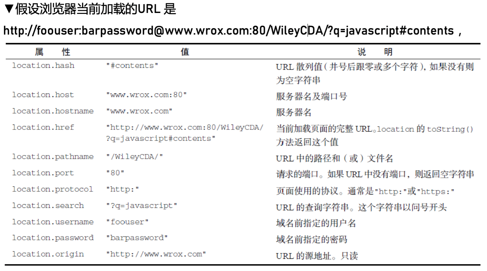
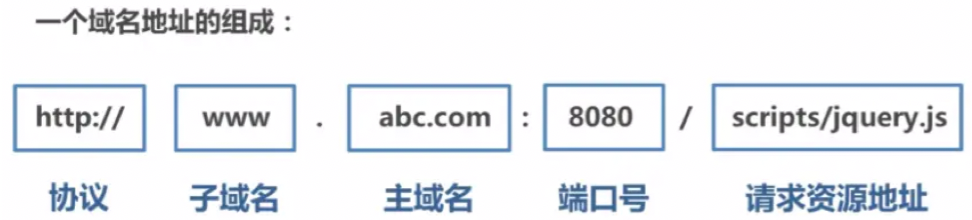

## BOM


### Location




▼操作地址

可以通过修改location 对象修改浏览器的地址。首先，最常见的是使用assign()方法并传入一

个URL，如下所示：

①location.assign("http://www.wrox.com");

如果给location.href 或window.location 设置一个URL，也会以同一个URL 值调用assign()方法。比如，下面两行代码都会执行与显式调用assign()一样的操作：

②window.location = "http://www.wrox.com";

③location.href = "http://www.wrox.com";

 

 

★修改location 对象的属性也==重新加载==当前的页面。其hash、search、hostname、pathname 和 port 属性被设置为新值之后都会修改当前URL


⚠️<span style='color:red;'> 这里和History不同！History里面的方法只是更新url并不会重新加载页面！</span>


### History


[History - Web API 接口参考 | MDN (mozilla.org)](https://developer.mozilla.org/zh-CN/docs/Web/API/History)

History有五个方法可以改变 url 而不刷新页面

1. `history.pushState()`
    
2. `history.replaceState()`
    
3. `history.go()`
    

上面只演示了三个方法，因为 `history.back()` 等价于 `history.go(-1)`，`history.forward()` 则等价于 `history.go(1)`，这三个接口等同于浏览器界面的前进后退。


### Tips


#### 1.Hash和History模式对比

Hash模式

 

在url后面加上#，如http://127.0.0.1:5500/前端路由/hash.html#/page1这个url后面的#/page1就是hash值

- hash     值的变化不会导致浏览器像服务器发送请求
- location.hash可以获取hash值
- hashchange是hash值发生改变的调用的函数

 

 

 

History模式

 

History 接口允许操作浏览器的曾经在标签页或者框架里访问的会话历史记录。可以参考下两篇文章对history的说明

[https://css-tricks.com/using-the-html5-history-api/](https://link.segmentfault.com/?url=https%3A%2F%2Fcss-tricks.com%2Fusing-the-html5-history-api%2F)

[https://developer.mozilla.org/zh-CN/docs/Web/API/History](https://link.segmentfault.com/?url=https%3A%2F%2Fdeveloper.mozilla.org%2Fzh-CN%2Fdocs%2FWeb%2FAPI%2FHistory)

下面介绍在这个模式下需要用到的api

 

 

Hash 模式和 History 模式对比

Hash 模式是使用 URL 的 Hash 来模拟一个完整的 URL，因此当 URL 改变的时候页面并不会重载。History 模式则会直接改变 URL，所以在路由跳转的时候会丢失一些地址信息，在刷新或直接访问路由地址的时候会匹配不到静态资源。因此需要在服务器上配置一些信息，让服务器增加一个覆盖所有情况的候选资源，比如跳转 index.html 什么的

hash路由 优缺点

- 优点

- - 实现简单，兼容性好（兼容到ie8）
  - 绝大多数前端框架均提供了给予hash的路由实现
  - 不需要服务器端进行任何设置和开发
  - 除了资源加载和ajax请求以外，不会发起其他请求

- 缺点

- - 对于部分需要重定向的操作，后端无法获取hash部分内容，导致后台无法取得url中的数据，典型的例子就是微信公众号的oauth验证
  - 服务器端无法准确跟踪前端路由信息
  - 对于需要锚点功能的需求会与目前路由机制冲突

History(browser)路由 优缺点

- 优点

- - 对于重定向过程中不会丢失url中的参数。后端可以拿到这部分数据
  - 绝大多数前段框架均提供了browser的路由实现
  - 后端可以准确跟踪路由信息
  - 可以使用history.state来获取当前url对应的状态信息

- 缺点

- - 兼容性不如hash路由(只兼容到IE10)
  - 需要后端支持，每次返回html文档


![](data:image/jpg;base64,iVBORw0KGgoAAAANSUhEUgAAAJAAAACQCAYAAADnRuK4AAAAAXNSR0IArs4c6QAADftJREFUeAHtnQtwVNUZx8+5u5vnbqJJYLObRRmyCSrTsSO+W+T9qEgFER8t9YH12dZOO1M77VTHjlM7tVPb2hGrtb6QaRUt1sFaBTQi1mcEwUhCFsWQXTbSJGASBbJ7T/8nuA2DyWb3nN1k997vzjC7e+/5vpzvd/6c972XMTqIABEgAkSACBABIkAEiAARIAJEgAgQASJABIgAESACRIAIEAEiQASIABEgAkSACBABIkAEiAARIAJEgAgQASKgS4DrOrCKfbW/7mpTmMuY4KdyJhyI6x1m8LUdkdBfrRJjNuKwvYBqaoKBWFw8IhibPRRgzvn6ogLXlR9/vGPvUNftfs6wMwCf7+QTY3G2aTjxSDZCiLkHDx1eZWdOyWKXVbUtD+8J9ZOEGWuAeCamAGCSp6yqrbena2sKaW2VxJY1UCBQG2T9ZoMQ7MRUS3ugf5RqYhuls52AampOqj8c5xCPmJBWOaNznVZ6myR22iTOgTD9/vqT+uP9L+GHL924vxiZpWtm+fS2qYGqTwhOiZvxBpRo2uL5QgXvWF4NCgHaQkDewElfEf3sZXSYvQqMjphgTkjZ1sKGlp8Hqqmp+2rMFBvQ56lULUc5F9SxNzRP1d7KdpbuA/n9wdNipgnxsONVC5Ez/mGB03GVqr3V7Sw7D1RdXX9GnJkbmIZ4GOMhl4PNaG9vDVtdCKrxWbIP5K0Jnm2y+HqI5zhVMIyzlkKXY3o4HGpX9mEDQ8sJyO+vPVfE2Ysou3LV8kOfZ0dJYdGMPXtaIqo+7GJnqSbM56ufFhfs31jB8qgWIPo8Tay0ZGb4o/c7VH3Yyc4yo7DqQHCGiLF1golS1QIEjG0Q0JxoNLRP1Yfd7CzRhHlr6meLuHhORzyM861Oh2sWiSe9/wJ5LyAM1ecxM74OQ/WS9EIfTM05ayxyFc8Kh5s7B8/St1QI5LWAMFQ/H32eZyGeolSCHSoNmqy3igs9c9ratncPdZ3OJSeQt30grz+4CMP0pzDDXJA8xOGvQjxveNxsfigU+nT4VHQlGYG8rIHG+2sXC5M9rSMezPO8dly5Yx6JJ5k8Rr6WdwLy+eqWMpM/iaG6a+TwhknB+aZxFUULWlpaeoZJQadTJJBXTZjXX3upMPnjEI/yGh6arZcdRvkFkUjjZykyomRJCORNDeT1130LzdZqLfFwtsHlHLeQxJNEEWleygsBVVfXXiFMU94ZoT5zzvkLxYUTFrW3v/55mowoeRICOd+EYbS1QpjiL4hBWeyY5/mXp5RfhA7zoSQs6JICAeVCUfhbaZt4fbXXQjwPwlA5n+jzPFtVUbSExJM2/pQMlAsmJe8aiaqrgzdigvB+uFCuJVHzrA3UlF/c1NR0WCMrZJqEQE4KCKOtH5hMrNQRD9a2njp58oRLGhsb+5PET5c0CeScgLy+4I8w2rpHJy5UWX8/ZXLg8oaGhpiOH7IdmUBOCQhPyPgJZpfvHjnbw6fAZrDV5007bTmJZ3hGmbySMwJCzfMz0zTv0grOYI/eeP3yK9asWRPX8kPGKRPICQGNr667FTXPnSnneoiEGG09dNN131lx++23m0NcplNZIqA8wslUfqr9wV+aprhNxx9GWw9EI6Eb0Hzh3kE6RpOA+sxuBnKJZutXqHl+oeXK4CvxFLGbSDxaFJWNx6wGGl9d+xvk+hblnMMQNc89HXt3/VDHB9nqERiTPlC1L/g7ZFtLPAbnd5N49Ao/E9ajXgNheeKPmGG+WTPzd30S3fVTTR9kngECo1YDoa/Dx/uD9+qKB32dO0k8GSj5DLkYlU60FA9GW3/GHuYbdPJtGOwONFu36vgg28wSUN7Zl2o2MC9jYIb5AdQ816RqM3Q647ZopPWOoa/R2bEikNU+kBTPygdWPcRMdqVOgGi2fo7n8/xaxwfZZodA1gS0bNkyx6bNWx5F8/VtnawbhnELap7f6vgg2+wRyIqAZsyY4dzRvGcVpoUv08k6ap4fo+b5vY4Pss0ugYz3gaR4Pmhp/xuyfbFO1rnBbsYM8590fJBt9glktAaaOnWqqz2y/wl0mJdoZF0YjH8PDzm4T8MHmY4SgYwJaMqUKQX/7Ty0Bk/I+KZG3gWWJ67HUF1uoqcjDwhkREDBYLCwp0/8AzXP+Roxm9zg16LZekjDB5mOMgHtmeiJE2cUfdrH/qkrHmTkahLPKJd+Bv6c9kx0QZHzD7hb9HKNvMS5YVyB0RZuWaYj3whoNWHemsmzRDy2AUEr+uExbojlHZFdT+QbOMrvEQJ6TVg8fp2GePodnF9G4slvKWrNA2Gi8HS18Hk/M8QleyOhZ9TsySpXCOjVQFzx/RNcvHFK/YR1uQKB8qFOQEtAuBPiPaU/Ldi0Hc3tq+V6mZI9GeUMAS0BYeguX96mdGDC8ZJNm99dRSJSwpczRloCKikK3IXx107VaCDAy1/ZvOVhue1D1QfZjS0BxeH3YKa9gbqzWNx8CWJQfk4zvD2CeaAVdGvOINd8+ab9P7+jvfVNZjgXYQ1L58lfVx3ZtSi0BZ0v4K2ST20BSRAd4ZaXBDcuhIgOqoLBxrPv+vzBlXL/tKoPsht9AhktLJ+vdoHJ+DMQQaF6KPzeT6Kh76vbk+VoEsjoMLq3tzvkKa/cggDkZjJV32e6PRXH9/V247VNdOQ6AdVCHjau3p6uVndZxTYmuI6IzvaUVXrgS744jo4cJpBxAclY+3q6Wso8lU1Y6liKn0r9LIzqznW7K4v7ervkYi0dOUogKwKSsfb2du3wuCuaIaKL8FNJRLD7uttT5YKIlCcsZV7oyB6BrAlIZhki+sBdNm4nE0LukVYUkTgPzZmB5qxB+qQjtwhkVUAy1L6ezvdLPZUf4uti/FMa9aE5m46aKI6aaJP0SUfuEMi6gGSoKPhtHve4j7/YcK8kIux6nOUuqzyE/tXm3MFHORkVAUnMvb2d70EAYTxgYRF+qolIsDnoV/VhuuA/VHS5QWDUBCTDRe2xpdRTFUVtshA/lUSETvk8t6fyAGq1N3IDob1zMaoCkqhR8I0ed+U+CEGKSPVY4Cmr6Ozt6X5L1QHZZYbAqAtIZhujs7fdZVXdGJ19QzUMdKzPR23WAUG+o+qD7PQJjImAZLbRnL2J0Zl85eR89TDEQix7RLDs8a66D7LUITBmApKZRu3xuqes6nMsvs5VDEL2oy6AjzbME21V9EFmGgTGVEAy3yj419Aplm/Uma0YB4cAF2Hp5CM0jdsUfZCZIoExF5DMN2qiV0vdlehXs5mKcchH1F+IflUITeN2RR9kpkAgJwQk8w0RvSKXLOSss0Ic0oSjU74Y20maUas1KfogszQJ5IyAZL7leheaM7kZbVqacSSSQ4B8CZqzD+RibuIkfWaPQE4JSIaJmmhjqbuiFF+/phi2geZsSWnZ8dv7erqbFX2QWYoEck5AMt8Ylq9HTVSOr+ekGMexyRzY0LYUG9u2ok+kfNvRsU7p95cJ5KSAZDZRE73gdldVYtnjrC9nO6UzDtw5u9TjrmrEOlwoJQtKlDaBnBWQjAQier60rNKLBdgz0o7siIEDXeuLy8sq3urp6dql6IPMkhBQWtBM4i/jl+RtPvI1CRidyUfJKB0DtxsZjgs6wjs3Kjkgo2EJ5LyAZM4HROSrexD7iVYMG8kIFyCiz7iDL4y2hxpGSEqX0yCguM00jb+QgaTylucbb1h+Ld4w95iqO9RgJSLG1vl89apTBKp/2tJ2eVEDJUpAPoThvvsffww1ksbrE3iv03AsiERaXkv4pU91AnklIBnmwDs4Xt2yGs3ZpRph93AHm9cRDtGmNHWIA5Z5JyCZ6/+/TkEIefOi6nHAYI650ejOt1UdkJ3ittJcADfwQpeWPU+ib6P+WgXO9js5nx2JhGg/kWKh5mUNlIh14N0c4QNPozmTG/WVDnTQu5wGnx0Ot9J+IgWCeS0gGe/AOzq6Dq5FTaT8mgWIqJM5nDM72ptpK0iaIsp7Acl45bs65OsWMGGkvD0WItrHXWxmtC1EW0HSEFFezAONFE8oFDpUUhhYjMlC5QcxYGpgnDgsNvp8dSeP9Pfo+iABS9RAiXACgXOK+2P7nkOfaGbinMJn1OVwTQ+Hm2kVPwV4lhKQjNfvn1oSEweeR3N2XgrxD5OERwqcYnp7+y5axR+GUOK0JZqwRDDyMxJp/GxcReFCrMJrzDQL/+E4f9l7Qv2ko33T9y8TsFwNlAhx8uTJnv0H4i+iOTs7cS7dT/Sp2niha3p0d/PudG3tkt6yApIFiNFZWU8vWw8RnalaoAC02+ng08LhULuqDyvbWa4JO7qwMDr7tLjIPR81SePR59P5jv3VE2Nx8Ug6NnZKm9M7EjNREPv3Rw9WVgTWxMzYPPjzKfqcRHe/Dk3O0jVQIuS2tu3dLsM5F82R8p2rpjCXJfzR5yABWwhIhot5nU5ssp8DEb0/GH4a3wQ/NY3UtklqGwHJEo1GQ/tYaelsLFukfdMhbnu1fHOvonpbCUgC6ti17ZPiwsJZmCdqSRMYPYdoCGC2E5BksHt3U7TQ6ZQiah2CydCnDL526Av2PmvpeaCRiramJhiIxdkrmCealCwtmrz1eJ+ZHMXRcQwBW9ZACQZycrDA5ZgmBZI4d+wn/odtLCpwXXnsefp9hICta6CjReD1B69h5sAT9U8XjMcZF+8Z3FgTjbQ+fHQ6+k4EiAARIAJEgAgQASJABIgAESACRIAIEAEiQASIABEgAkSACBABIkAEiAARIAJEgAgQASJABIgAESACRIAIEAEikGkC/wORzgTg/WqrNQAAAABJRU5ErkJggg==)


![](data:image/jpg;base64,iVBORw0KGgoAAAANSUhEUgAAADwAAAA8CAYAAAA6/NlyAAAACXBIWXMAACE4AAAhOAFFljFgAAAAAXNSR0IArs4c6QAAAARnQU1BAACxjwv8YQUAAAV+SURBVHgB7ZrfT9tWFMfPsUOSpnRNUEmjMVUeIHWCh9H9ASOif8DQXva0wfq4hwn+gTX0H+j4B0aQeN7oP0Czvu2lhBeEtLJ42sMygiDdAnIS23fnGtIltpPYjk0G8kcCxb7+9fW599xzzzFASEhISMj/F4SASSal5EhcXATG5uhm83THJN1WarUzBlUEJtM+mQErMBT2jstvChAQgQg2RMaEJUBcpBtkwT0kHgpN0NaqZVkGH/FdcDoz+ZQxXEHDkoNDwvN+CvdN8L3MdFYAfaO9u/oI6WZrR+Xf1mBAfBHMrUqXyvU7jjFWpG5epB9vqQdUL/ZRT0D8mCTNOegVpQZoC4NYe2DB6cwUWRWWu7XzscgA11RFLVarcrXbcTMzM1CpNOdA0OZJ+ErXnsLglOnCQqXyaxE8MJDg9P3JXbLOnF0bWW69WddyvUR2Y5zEw0l9mbz30y7CGejw+dHR4Ta4xLPgHpaVdcCv/ZhaJGkOzpVaDgzhJjxaWgAPXIxZW7GbDUV75Nc8KstFSMQ/yNELXODzdUcjQgpF/cdkRpLABa4tzG8QBbFkcynyom9yEADZbBYODuQPdRB2zF2cfMTLSvlwweGlQASXvDc6tks3NXvTzaPy4QoEhExO+cGD96tnNfYKkH1BTi3eaiOLSYnRMfm8drrn5FquuvR4ZmrZxonI1I0DE9tif38f7t5l/GU/MzUhMnjOozsn13Fl4dHR1E9m6wpAY/ZYLsMVcHJyArfHM7+ASlMXWfZdA8ItMYL1s9ppod81HFu4i3XzZZ9j3X7MSmkmgvbE4sQYfuvkfDddesl6sjZwqOeWQqEAkUhCJoWbHQ0UpfHwtt/5jgRzz2yz6rly67aIRNK0PhFemHbTWNY/63euI8GiLlqiKWSa6yjHL2S5ABiPFnjY2r4fEf0RLCDLmvfV6/AzDJGYCjx+NU9FUj9v7WwM89VMO7Tq8RIj+4mm3WI6Q8tLj8Uoq9IDR4IpiJc6t/F3GDIPH96BEUGzxNE6iqle5zn00ii1bzFknpZmfsLDTUUBcy9Ds3HMdI2luYs3lme2C3Mj+5CDIZPJfIQ6NHWbJpmeMd9Q9HXz0LO1MAUZSwKwl3wq8is3dcVIPAMTjQk7ZidmEXwx57Ic3AQQH0XjQkecbxE8AmI2oETckMCv2rcsgvsN+muI1L7hKeNxnQkF33RCwTedUDCVRWS4WcjtGxbBTUXbpnzRKfQAGQx1adgCsQGs97NQjgA7UkGWrKWiVJXbd8b+ojiaZw8siwv+MgTUV2u16tBE85WSqiaQMaPIRDlqzNocxuhhdxt17RuuqbXTdgxTJj/PNOETntU3Trz8M7apnjOsXBaHiy1SFaLeVL5XmbZjfCpBhbvLXnn5rKzEKyGNuv7YvFoK/BsPv7k3MYmowmv8r2rJeO3JaT3rWnlpXkZFDZfRVKIVQJ93eo1rJThyqvKMxnfm/VRkK4BDIhAwuVwOtra2yMmM9jiqCmdnCZidTRuJdjump6fhbU2jIjlKpqY8dWfHGdRAxzDvguqf56lIVFjqlzmh+b/UBO3ViJYoVSr7HW38pa2v51MjMeG1aa3OqPox6caJBiaYe9P9gz+WyXs+d5wm4p4WYfWo/CXNnbl3uycmprGp6fzzB/OXABtUpn0CLghMME8VjTBx13VOjETT3DmVTCaN4OdM/Yd7ZV7X2jAf6da6nMDGME8VeUoAIqSiMfGHc+XvPWML8FOw1rV4BLXmJR4ITPBFqshjB0JYpH+LFz9tKTUUdR08ENi05GaqcEmJuvJjr6WewATzyOcyNPULI7QlsQOFtq4/anFDNHL3hSAKcSrc3rf5EMYhTKYpa5v+Vo/Lh8+GuWgJCQkJCQmafwHb6yxfcUnSDgAAAABJRU5ErkJggg==)


#### 2.**location.href vs history.pushState**


[彻底搞懂路由跳转：location 和 history 接口 - SegmentFault 思否](https://segmentfault.com/a/1190000014120456)

[window.location.href和this.props.history.push - 简书 (jianshu.com)](https://www.jianshu.com/p/a89151cbae86)


1. history方法不会刷新页面，而location会更新！
2. href是完整的url，而history只是添加在主域名后面

 


href包括上面所有，history在基本上是主域名后面push


## 装饰器


[JS 装饰器，一篇就够 - SegmentFault 思否](https://segmentfault.com/a/1190000014495089)

[装饰器 · TypeScript中文网 · TypeScript——JavaScript的超集 (tslang.cn)](https://www.tslang.cn/docs/handbook/decorators.html)


### 类的装饰

```javascript
@testable
class MyTestableClass {
  // ...
}

function testable(target) {
  target.isTestable = true;
}

MyTestableClass.isTestable // true
```

上面代码中，`@testable` 就是一个装饰器。它修改了 MyTestableClass这 个类的行为，为它加上了静态属性isTestable。testable 函数的参数 target 是 MyTestableClass 类本身。

基本上，装饰器的行为就是下面这样。

```javascript
@decorator
class A {}

// 等同于

class A {}
A = decorator(A) || A;
```

也就是说，**装饰器是一个对类进行处理的函数。装饰器函数的第一个参数，就是所要装饰的目标类**。

如果觉得一个参数不够用，可以在装饰器外面再封装一层函数。

```javascript
function testable(isTestable) {
  return function(target) {
    target.isTestable = isTestable;
  }
}

@testable(true)
class MyTestableClass {}
MyTestableClass.isTestable // true

@testable(false)
class MyClass {}
MyClass.isTestable // false
```

上面代码中，装饰器 testable 可以接受参数，这就等于可以修改装饰器的行为。

注意，**装饰器对类的行为的改变，是代码编译时发生的，而不是在运行时**。这意味着，装饰器能在编译阶段运行代码。也就是说，**装饰器本质就是编译时执行的函数**。

前面的例子是为类添加一个静态属性，如果想添加实例属性，可以通过目标类的 prototype 对象操作。


下面是另外一个例子。

```javascript
// mixins.js
export function mixins(...list) {
  return function (target) {
    Object.assign(target.prototype, ...list)
  }
}

// main.js
import { mixins } from './mixins'

const Foo = {
  foo() { console.log('foo') }
};

@mixins(Foo)
class MyClass {}

let obj = new MyClass();
obj.foo() // 'foo'
```

上面代码通过装饰器 mixins，把Foo对象的方法添加到了 MyClass 的实例上面。


### 方法的装饰

装饰器不仅可以装饰类，还可以装饰类的属性。

```javascript
class Person {
  @readonly
  name() { return `${this.first} ${this.last}` }
}
```

上面代码中，装饰器 readonly 用来装饰“类”的name方法。

装饰器函数 readonly 一共可以接受三个参数。

```javascript
function readonly(target, name, descriptor){
  // descriptor对象原来的值如下
  // {
  //   value: specifiedFunction,
  //   enumerable: false,
  //   configurable: true,
  //   writable: true
  // };
  descriptor.writable = false;
  return descriptor;
}

readonly(Person.prototype, 'name', descriptor);
// 类似于
Object.defineProperty(Person.prototype, 'name', descriptor);
```

- 装饰器第一个参数是 **类的原型对象**，上例是 Person.prototype，装饰器的本意是要“装饰”类的实例，但是这个时候实例还没生成，所以只能去装饰原型（**这不同于类的装饰，那种情况时target参数指的是类本身**）；
- 第二个参数是 **所要装饰的属性名**
- 第三个参数是 **该属性的描述对象**

另外，上面代码说明，`装饰器（readonly`）会修改属性的 `描述对象（descriptor）`，然后被修改的描述对象再用来定义属性。

### 函数方法的装饰

**装饰器只能用于类和类的方法，不能用于函数，因为存在函数提升**。

另一方面，如果一定要装饰函数，可以采用高阶函数的形式直接执行。

```javascript
function doSomething(name) {
  console.log('Hello, ' + name);
}

function loggingDecorator(wrapped) {
  return function() {
    console.log('Starting');
    const result = wrapped.apply(this, arguments);
    console.log('Finished');
    return result;
  }
}

const wrapped = loggingDecorator(doSomething);
```


