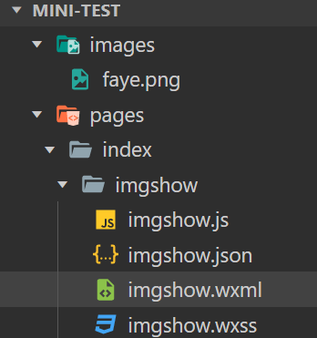
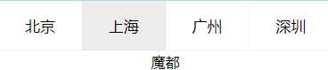
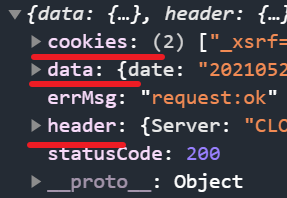
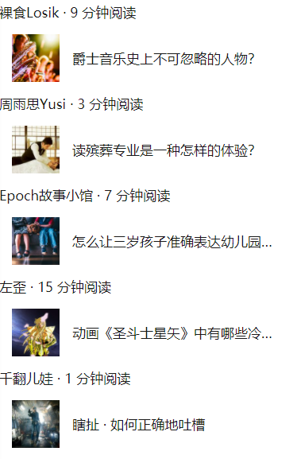

## 组件


#### navigator

[navigator | 微信开放文档 (qq.com)](https://developers.weixin.qq.com/miniprogram/dev/component/navigator.html)

**相对路径与绝对路径**

**相对路径**

大家注意我们之前使用的路径基本都是相对路径，相对路径使用“/”字符作为目录的分隔字符，

- "./" 代表当前目录

- “../” 代表上一级目录
- "/" **当前根目录**，是相对目录

*/pages/home/imgshow/imgshow 和./../home/imgshow/imgshow*   都指向同一个路径!


比如:在这种文件结构下可以采取这两种地址写法

 

```html
<!--pages/index/imgshow/imgshow.wxml-->
<text>pages/index/imgshow/imgshow.wxml</text>
<image src="../../../images/faye.png"></image>
<image src="/images/faye.png"></image>
```


more: 对img调样式并使其居中显示:

```html
<view class="img-list">
  <image class="img-icon" src="../../../images/faye.png"></image>
</view>
<image src="/images/faye.png"></image>
```

```css
.img-icon{
  width: 200rpx;
  height: 200rpx;
  margin: 20rpx;
}

.img-list{
  text-align: center;
}
```


在小程序 API 左侧也可以看到 5 个不同的 API。它们之间的对应关系如下:

| **页面路由 API**                                             | **Navigator open-type 值** | **含义**                                                     |
| ------------------------------------------------------------ | -------------------------- | ------------------------------------------------------------ |
| [redirectTo](https://developers.weixin.qq.com/miniprogram/dev/api/route/wx.redirectTo.html) | redirect                   | 关闭当前页面，跳转到应用内的某个页面。但是不允许跳转到 tabbar 页面。 |
| [navigateTo](https://developers.weixin.qq.com/miniprogram/dev/api/route/wx.navigateTo.html) | navigate                   | 保留当前页面，跳转到应用内的某个页面。但是不能跳到 tabbar 页面。 |
| [navigateBack](https://developers.weixin.qq.com/miniprogram/dev/api/route/wx.navigateBack.html) | navigateBack               | 关闭当前页面，返回上一页面或多级页面。                       |
| [switchTab](https://developers.weixin.qq.com/miniprogram/dev/api/route/wx.switchTab.html) | switchTab                  | 跳转到 tabBar 页面，并关闭其他所有非 tabBar 页面             |
| [reLaunch](https://developers.weixin.qq.com/miniprogram/dev/api/route/wx.reLaunch.html) | reLaunch                   | 关闭所有页面，打开到应用内的某个页面                         |

也就是说 Navigator 组件可以做到的事情，使用 JavaScript 调用小程序路由 API 也可以做到。Navigator 组件的内容是写死的，而 JavaScript 则可以提供动态的数据。


##### 跳转到新页面与 Tab 页

我们可以在之前创建的 home.wxml 里输入以下代码：

```html
<button bindtap="navigateTo">保留页面并跳转</button>
<button bindtap="switchTab">跳转到组件Tab页</button>
<button bindtap="redirectTo">关闭当前页面跳转</button>
```

然后在 home.js 文件里添加以下代码：

```js
navigateTo() {
    wx.navigateTo({
        url: '/pages/home/imgshow/imgshow'
    })
},
switchTab() {
    wx.switchTab({
        url: "/pages/list/list",
    })
},
redirectTo() {
    wx.redirectTo({
        url: '/pages/home/imgshow/imgshow'
    })
},
```

保存之后在开发者工具的模拟器点击按钮，就实现了页面和 Tab 页的切换效果。在前面我们提到 bintap 是小程序所有组件的公有属性，只有 bintap 绑定了页面路由切换的事件处理函数，组件是不是 Navigator 也就不重要了，也就是链接跳转不再是 Navigator 组件的专利。


#### image

[image | 微信开放文档 (qq.com)](https://developers.weixin.qq.com/miniprogram/dev/component/image.html)

| 属性                     | 类型          | 默认值      | 必填 | 说明                                                   | 最低版本                                                     |
| :----------------------- | :------------ | :---------- | :--- | :----------------------------------------------------- | :----------------------------------------------------------- |
| `src`                    | `string`      |             | 否   | 图片资源地址                                           | [1.0.0](https://developers.weixin.qq.com/miniprogram/dev/framework/compatibility.html) |
| `mode`                   | `string`      | scaleToFill | 否   | 图片裁剪、缩放的模式                                   | [1.0.0](https://developers.weixin.qq.com/miniprogram/dev/framework/compatibility.html) |
| `webp`                   | `boolean`     | false       | 否   | 默认不解析 webP 格式，只支持网络资源                   | [2.9.0](https://developers.weixin.qq.com/miniprogram/dev/framework/compatibility.html) |
| `lazy-load`              | `boolean`     | false       | 否   | 图片懒加载，在即将进入一定范围（上下三屏）时才开始加载 | [1.5.0](https://developers.weixin.qq.com/miniprogram/dev/framework/compatibility.html) |
| `show-menu-by-longpress` | `boolean`     | false       | 否   | 开启长按图片显示识别小程序码菜单                       | [2.7.0](https://developers.weixin.qq.com/miniprogram/dev/framework/compatibility.html) |
| `binderror`              | `eventhandle` |             | 否   | 当错误发生时触发，event.detail = {errMsg}              | [1.0.0](https://developers.weixin.qq.com/miniprogram/dev/framework/compatibility.html) |
| `bindload`               | `eventhandle` |             | 否   | 当图片载入完毕时触发，event.detail = {height, width}   | [1.0.0](https://developers.weixin.qq.com/miniprogram/dev/framework/compatibility.html) |


**`mode` 的合法值**

| 值           | 说明                                                         | 最低版本                                                     |
| :----------- | :----------------------------------------------------------- | :----------------------------------------------------------- |
| scaleToFill  | 缩放模式，不保持纵横比缩放图片，使图片的宽高完全拉伸至填满 image 元素 |                                                              |
| aspectFit    | 缩放模式，保持纵横比缩放图片，使图片的长边能完全显示出来。也就是说，可以完整地将图片显示出来。 |                                                              |
| aspectFill   | 缩放模式，保持纵横比缩放图片，只保证图片的短边能完全显示出来。也就是说，图片通常只在水平或垂直方向是完整的，另一个方向将会发生截取。 |                                                              |
| widthFix     | 缩放模式，宽度不变，高度自动变化，保持原图宽高比不变         |                                                              |
| heightFix    | 缩放模式，高度不变，宽度自动变化，保持原图宽高比不变         | [2.10.3](https://developers.weixin.qq.com/miniprogram/dev/framework/compatibility.html) |
| top          | 裁剪模式，不缩放图片，只显示图片的顶部区域                   |                                                              |
| bottom       | 裁剪模式，不缩放图片，只显示图片的底部区域                   |                                                              |
| center       | 裁剪模式，不缩放图片，只显示图片的中间区域                   |                                                              |
| left         | 裁剪模式，不缩放图片，只显示图片的左边区域                   |                                                              |
| right        | 裁剪模式，不缩放图片，只显示图片的右边区域                   |                                                              |
| top left     | 裁剪模式，不缩放图片，只显示图片的左上边区域                 |                                                              |
| top right    | 裁剪模式，不缩放图片，只显示图片的右上边区域                 |                                                              |
| bottom left  | 裁剪模式，不缩放图片，只显示图片的左下边区域                 |                                                              |
| bottom right | 裁剪模式，不缩放图片，只显示图片的右下边区域                 |                                                              |

Bug & Tip

1. `tip`：image组件默认宽度320px、高度240px
2. `tip`：image组件中二维码/小程序码图片不支持长按识别。仅在wx.previewImage中支持长按识别

## 


## 全局对象 wx

wx 是小程序的全局对象，用于承载小程序能力相关 API。小程序开发框架提供丰富的微信原生 API，可以方便的调起微信提供的能力，如获取用户信息，了解网络状态等。大家可以在微信开发者工具的控制台 Console 里了解一下这个 wx 这个对象。

```
wx
```

可以看到 wx 的所有属性和方法，如果你对 wx 的哪个属性和方法不了解，你可以查阅技术文档。

技术文档：[API 技术文档](https://developers.weixin.qq.com/miniprogram/dev/framework/app-service/api.html#API)


#### 了解网络状态

获取网络类型技术文档：[wx.getNetworkType()](https://developers.weixin.qq.com/miniprogram/dev/api/device/network/wx.getNetworkType.html)

大家可以切换一下开发者工具的模拟器的网络，然后多次在控制台 console 输入以下代码查看有什么不同：

```
wx.getNetworkType({
      success(res) {
        console.log(res)
      }
    });
```


#### 了解用户信息

获取用户信息技术文档：[wx.getUserInfo()](https://developers.weixin.qq.com/miniprogram/dev/api/open-api/user-info/wx.getUserInfo.html)

登录开发者工具之后（大家应该已经处于登录状态），在控制台 console 里输入以下代码，看得到什么信息：

```
wx.getUserInfo({
  success(res) {
      console.log(res);
  }
});
```

然后退出开发者工具，再输入以上代码，看看是什么令人兴奋的结果？


#### 获取设备信息

获取设备信息技术文档：[wx.getSystemInfo()](https://developers.weixin.qq.com/miniprogram/dev/api/base/system/system-info/wx.getSystemInfo.html)

```
wx.getSystemInfo({
  success (res) {
    console.log(res.model)
    console.log(res.pixelRatio)
    console.log(res.windowWidth)
    console.log(res.windowHeight)
    console.log(res.language)
    console.log(res.version)
    console.log(res.platform)
  }
})
```


#### 页面链接跳转

页面跳转技术文档：[wx.navigateTo()](https://developers.weixin.qq.com/miniprogram/dev/api/route/wx.navigateTo.html)

除了可以获取到用户、设备、网络等的信息，使用控制台来调用对象的方法也可以执行一些动作，比如页面跳转。在控制台 Console 里输入：

```js
wx.navigateTo({
  url: '/pages/home/imgshow/imgshow'
})
```

还可以返回页面的上一层，在控制台里输入

页面返回技术文档：[wx.navigateBack()](https://developers.weixin.qq.com/miniprogram/dev/api/route/wx.navigateBack.html)

```js
wx.navigateBack({
  delta: 1
})
```


#### 显示消息提示框

显示消息提示框技术文档：[wx.showToast()](https://developers.weixin.qq.com/miniprogram/dev/api/ui/interaction/wx.showToast.html)

```js
  wx.showToast({
    title: '弹出成功',
    icon: 'success',
    duration: 1000
  })
```

参数

Object object

| 属性     | 类型     | 默认值    | 必填 | 说明                                             | 最低版本                                                     |
| :------- | :------- | :-------- | :--- | :----------------------------------------------- | :----------------------------------------------------------- |
| title    | string   |           | 是   | 提示的内容                                       |                                                              |
| icon     | string   | 'success' | 否   | 图标                                             |                                                              |
| image    | string   |           | 否   | 自定义图标的本地路径，image 的优先级高于 icon    | [1.1.0](https://developers.weixin.qq.com/miniprogram/dev/framework/compatibility.html) |
| duration | number   | 1500      | 否   | 提示的延迟时间                                   |                                                              |
| mask     | boolean  | false     | 否   | 是否显示透明蒙层，防止触摸穿透                   |                                                              |
| success  | function |           | 否   | 接口调用成功的回调函数                           |                                                              |
| fail     | function |           | 否   | 接口调用失败的回调函数                           |                                                              |
| complete | function |           | 否   | 接口调用结束的回调函数（调用成功、失败都会执行） |                                                              |

**object.icon 的合法值**

| 值      | 说明                                                         | 最低版本 |
| :------ | :----------------------------------------------------------- | :------- |
| success | 显示成功图标，此时 title 文本最多显示 7 个汉字长度           |          |
| error   | 显示失败图标，此时 title 文本最多显示 7 个汉字长度           |          |
| loading | 显示加载图标，此时 title 文本最多显示 7 个汉字长度           |          |
| none    | 不显示图标，此时 title 文本最多可显示两行，[1.9.0](https://developers.weixin.qq.com/miniprogram/dev/framework/compatibility.html)及以上版本支持 |          |


#### 设置当前页面的标题

设置标题技术文档：[wx.setNavigationBarTitle()](https://developers.weixin.qq.com/miniprogram/dev/api/ui/navigation-bar/wx.setNavigationBarTitle.html)

```js
wx.setNavigationBarTitle({
  title: '控制台更新的标题'
})
```


#### 打开文件选择

打开文件选择技术文档：[wx.chooseImage()](https://developers.weixin.qq.com/miniprogram/dev/api/media/image/wx.chooseImage.html)

```js
wx.chooseImage({
  count: 1,
  sizeType: ['original', 'compressed'],
  sourceType: ['album', 'camera'],
  success (res) {
    const tempFilePaths = res.tempFilePaths
  }
})
```

这一部分主要是让大家明白控制台 Console 的强大之处，以及通过控制台实战的方法对小程序 API 的运行机制有一个初步的了解。


#### 页面滚动

[wx.pageScrollTo(Object object) | 微信开放文档 (qq.com)](https://developers.weixin.qq.com/miniprogram/dev/api/ui/scroll/wx.pageScrollTo.html)

| 属性      | 类型     | 默认值 | 必填 | 说明                                             | 最低版本                                                     |
| :-------- | :------- | :----- | :--- | :----------------------------------------------- | :----------------------------------------------------------- |
| scrollTop | number   |        | 否   | 滚动到页面的目标位置，单位 px                    |                                                              |
| duration  | number   | 300    | 否   | 滚动动画的时长，单位 ms                          |                                                              |
| selector  | string   |        | 否   | 选择器                                           | [2.7.3](https://developers.weixin.qq.com/miniprogram/dev/framework/compatibility.html) |
| success   | function |        | 否   | 接口调用成功的回调函数                           |                                                              |
| fail      | function |        | 否   | 接口调用失败的回调函数                           |                                                              |
| complete  | function |        | 否   | 接口调用结束的回调函数（调用成功、失败都会执行） |                                                              |


简单示例:

wxml:

```html
<button type="primary" bindtap="scrollToPosition" style="width:fit-content;">滚动到页面指定位置</button>
<view class="pagetop" style="background-color:lightblue;width:100%;height:500px"></view>
<view id="pageblock" style="background-color:brown;width:100%;height:800px">
  this is page-block!
  <button type="primary" bindtap="scrollToTop">滚动到页面顶部（返回顶部）</button>
</view>
```

js:

```js
  scrollToTop() {
    wx.pageScrollTo({
      scrollTop:0,
      duration: 300,
      success:()=>{
        console.log('返回顶部成功!!!');
      }
    })
  },

  scrollToPosition(){
    wx.pageScrollTo({
      selector:"#pageblock",
      duration: 300,
      success:()=>{
        wx.showToast({
          title: '跳转成功!',
          icon:'success',
          duration:3000
        })
        console.log('跳转到指定位置成功!!!');
      }
    })
  },
```


## 事件


#### currentTarget 事件对象

在前面的列表渲染里，我们知道点击电影列表里的某一部电影，要进行页面跳转显示该电影的详情，我们需要给该电影创建一个页面，那如果要显示数千部的电影的详情，一一创建电影详情页显然不合适，毕竟所有电影的详情页都是同一一个结构，有没有办法所有电影详情都共用一个页面，但是根据点击的链接的不同，渲染相应的数据？答案是肯定的，要解决这个问题，首先我们要了解链接组件的点击信息。

> 当点击组件触发事件时，逻辑层绑定该事件的处理函数会收到一个事件对象，通过 event 对象可以获取事件触发时候的一些信息，比如时间戳、 detail 以及当前组件的一些属性值集合，尤其是事件源组件的 id。


▼示例:



wxml:

```html
<view class="weui-navbar">
  <block wx:for="{{tabs}}" wx:key="index">
    <view id="{{index}}" class="weui-navbar__item {{activeIndex == index ? 'weui-bar__item_on' : ''}}"
      bindtap="tabClick">
      <view class="weui-navbar__title">{{item}}</view>
    </view>
  </block>
</view>

<view class="weui-tab__panel" style="text-align:center;">
  <view hidden="{{activeIndex != 0}}">帝都</view>
  <view hidden="{{activeIndex != 1}}">魔都</view>
  <view hidden="{{activeIndex != 2}}">妖都</view>
  <view hidden="{{activeIndex != 3}}">渔村</view>
</view>
```


js:

```js
 data: {
    tabs: ["北京", "上海", "广州", "深圳"],
    activeIndex:0,
  },

  tabClick: function (e) {
    console.log(e)
    this.setData({
      activeIndex: e.currentTarget.id
    });
  },
```


## 网络API


#### 了解网络数据 API

复制以下链接地址，用浏览器打开，看看会返回什么结果：

```
//知乎日报的最新话题
https://news-at.zhihu.com/api/4/news/latest

//知乎日报某一个话题的内容
https://news-at.zhihu.com/api/4/news/9714883

//v2ex论坛的最新主题
https://www.v2ex.com/api/topics/latest.json

//CNode论坛的最新话题
https://cnodejs.org/api/v1/topics
```

以上所返回的数据类型都是 json 格式，相信大家应该比较熟悉了。那我们如何把以上数据渲染到我们的小程序页面上呢？


#### 练手 API 资源推荐

这里推荐几个程序员经常会拿来练手的 API 资源，你可以使用这些 API 来做网站、小程序、移动端（iOS、安卓）、桌面端，也可以用于各种框架比如 Vue、React、Flutter 等等，数据没变，只是解决方案不同。

- [聚合 API](https://www.juhe.cn/)：一个比较全面的综合性 API 服务平台
- [即速 API](https://www.jisuapi.com/)：也是提供一些综合性的 API 服务
- [V2EX API](https://www.v2ex.com/p/7v9TEc53)：v2ex 论坛是很多程序员经常会光顾的综合性技术论坛
- [CNode API](https://cnodejs.org/api/)：Nodejs 交流论坛
- [和风天气](https://www.heweather.com/)：含天气预报、空气质量、实况天气等数据
- [Github API](https://developer.github.com/v3/)：Github 是所有程序员都（必须）会使用的网站
- [知乎日报 API](https://github.com/izzyleung/ZhihuDailyPurify/wiki/知乎日报-API-分析)：知乎日报 API 分析

> 各大公司的开发平台：比如[微信开放平台](https://open.weixin.qq.com/cgi-bin/showdocument?action=dir_list&t=resource/res_list&verify=1&lang=zh_CN&tab=dev)提供了微信账号体系的接入，[腾讯云 API 中心](https://cloud.tencent.com/document/api)则提供了调用云资源的能力（包含服务器、物联网、人工智能等 API）、[开源网站 Wordpress](https://developer.wordpress.org/rest-api/reference/)也提供 API 调用的服务，在 API 资源的开放方面，国外也做得比较领先（[国外免费 API 列表](https://github.com/public-apis/public-apis)）。而对于特定的数据资源，也可以通过爬虫等方式来自建。


**▼简单示例**

使用开发者工具新建一个 request 页面，然后在 request.js 里的 onLoad 生命周期函数里输入以下代码：

```js
  onLoad: function (options) {
    wx.request({
      url: 'https://news-at.zhihu.com/api/4/news/latest', //知乎日报最新话题
      header: {
        'content-type': 'application/json' // 默认值
      },
      success(res) {
        console.log('网络请求成功之后获取到的数据',res)
        console.log('知乎日报最新话题',res.data)
      }
    })
  },
```


返回的 res 组成:

 

- header：开发者服务器返回的 HTTP 消息头，其中 Content-Type 为服务器文档的 MIME 类型，API 的 MIME 类型通常为 "application/json; charset=UTF-8"，建议服务器返回值使用 UTF-8 编码（如果你有服务器的话）。
- wx.request 只能发起 HTTPS 请求，默认超时时间为 60s，最大并发限制为 10 个


#### ★简单的知乎日报小程序

| 列表                                                         | 详细页面                                                     |
| ------------------------------------------------------------ | ------------------------------------------------------------ |
|  |  |


🚩具体流程: 获取数据列表显示在主页面 ==> 子页面渲染会根据id  ==> 点击主页面的链接引导至子页面 ==> 子页面通过主页面传来的id来获取具体数据并显示内容

使用开发者工具在 request.wxml 里输入 weui 的列表样式（需要引入 weui 框架哦）

```html
<view class="page__bd">
    <view class="weui-panel weui-panel_access">
        <view class="weui-panel__bd" wx:for="{{stories}}" wx:for-item="stories" wx:key="*item">
            <navigator url="" class="weui-media-box weui-media-box_appmsg" hover-class="weui-cell_active">
                <view class="weui-media-box__hd weui-media-box__hd_in-appmsg">
                    <image class="weui-media-box__thumb" mode="widthFix" src="{{stories.images[0]}}" sytle="height:auto"></image>
                </view>
                <view class="weui-media-box__bd weui-media-box__bd_in-appmsg">
                    <view class="weui-media-box__title">{{stories.title}}</view>
                </view>
            </navigator>
        </view>
    </view>
</view>
```

然后再在 request.js 的 data 里声明 date、stories、top_stories 的初始值（使用的变量和 API 的字段尽量保持一致，这样就不容易混乱）

```js
  data: {
    date:"",
    stories:[],
    top_stories:[],
  },
```

在 onLoad 生命周期函数里将数据通过 setData 的方式给赋值给 data：

```js
  onLoad: function (options) {
    let that=this
    wx.request({
      url: 'https://news-at.zhihu.com/api/4/news/latest',
      header: {
        'content-type': 'application/json'
      },
      success(res) {
        let date=res.data.date
        let stories=res.data.stories
        let top_stories = res.data.top_stories
        that.setData({
          date,stories,top_stories
        })
      }
    })
  },
```

编译之后，我们就能看到知乎日报的数据就渲染在页面上了。

```
小任务： top_stories 是界面顶部轮播的显示内容，制作一个swiper轮播，将top_stories里的内容渲染到轮播上。

打开开发者工具调试工具栏的AppData标签页，就能看到从网络API里获取到的数据。也可以在此处编辑数据，并及时地反馈到界面上。如果AppData里有数据，可以确认页面已经取得res里的data数据，如果数据没有渲染到页面，说明列表渲染可能有误。通过这种方式可以诊断页面渲染问题所在。
```

##### 详情页数据渲染

前面我们获取的只是知乎的最新文章列表，那文章里面的内容呢？通过 API 文档以及我们通过链接访问的结果来看，我们只需要取得了文章的 ID，就能从 API 里获取到文章的详情页内容：

```
https://news-at.zhihu.com/api/4/news/9714883  //9714883是文章的ID
```

使用开发者工具新建一个 story 页面，然后在 story.wxml 里输入以下代码:

```html
<view class="page__bd">
    <view class="weui-article">
        <view class="weui-article__h1">{{title}}</view>
        <view class="weui-article__section">
            <view class="weui-article__section">
                <view class="weui-article__p">
                    <image class="weui-article__img" src="{{image}}" mode="widthFix" style="width:100%" />
                 </view>
                 <view class="weui-article__p">
                      {{body}}
                </view>
                <view class="weui-article__p">
                        知乎链接：{{share_url}}
                </view>
            </view>
        </view>
    </view>
</view>
```

然后再在 request.js 的 data 里声明 title、body、image、share_url 的初始值：

```js
data: {
    title:"",
    body:"",
    image:"",
    share_url:"",
  },
```

在 onLoad 生命周期函数里调用 wx.request 获取文章详情页的数据，并通过 setData 的方式给赋值给 data：

```js
  onLoad: function (options) {
    let stories_id=9714883
    let that = this
    wx.request({
      url: 'https://news-at.zhihu.com/api/4/news/'+stories_id,
      header: {
        'content-type': 'application/json'
      },
      success(res) {
        let title = res.data.title
        let body=res.data.body
        let image=res.data.image
        let share_url=res.data.share_url
        that.setData({
          title,body,image,share_url
        })
      }
    })
```

编译之后，发现数据虽然渲染出来了，但是存在“乱码”（是 HTML 标签），那这个要如何处理呢？这个就涉及到小程序的富文本解析了。

##### HTML 标签解析 rich-text

只需要将富文本对象放在 rich-text 的 nodes 里，就能将富文本解析出来了，比如将上面的{{body}}替换成以下代码。

```
<rich-text nodes="{{body}}"></rich-text>
小程序富文本解析的方案还有：Comi ，腾讯 Omi 团队开发的小程序代码高亮和 markdown 渲染组件，Github地址，具体效果可以在微信小程序里搜索omiCloud；以及wxPrase，微信小程序富文本解析自定义组件，支持HTML及markdown解析，Github地址，当你遇到更加复杂的富文本解析时，可以来深入了解。
```

##### 跨页面数据渲染

上面我们只是渲染了单篇文章的详情页，那如何点击文章列表就能渲染与之相应的文章详情页呢？这就回到了我们之前学过的跨页面数据渲染。

首先把 request 页面置于首页，然后再给 request.wxml 里的 navigator 组件的链接上携带文章的 id：

```
url="/pages/story/story?id={{stories.id}}"
```

当点击 request 页面的链接时，链接携带的数据就会传到 story 页面的生命周期函数 onLoad 的 options 对象里，将 options 里的 id，赋值给 stories_id，也就是将文章 id 9714883 修改为 [options.id](http://options.id/)

```
let stories_id=options.id
```

这样再来点击 request 页面的链接，不同的链接就会渲染不同的文章详情。

##### 解构赋值

解构赋值也就是从数组 Array 和对象 Object 中提取值，按照对照的位置，对变量进行赋值。比如上面的变量声明，为了能够与 API 里的数据字段一一对应，我们会声明很多变量，知乎日报的 API 还算比较少的，多了就比较复杂了。

```js
let title = res.data.title
let body=res.data.body
let image=res.data.image
let share_url=res.data.share_url
```

这时可以简写成：

```js
let { title, body, image, share_url}=res.data
```


#### 对于key的存放:

在api网络请求数据时会提供很多请求时的key，通常我们会把拿到的 key 放在 app.js 的 globalData 里，或者在小程序里新建一个 config.js，方便以后全局调用，而不是把 key 直接写在页面里。


方法一：写在 app.js 里的 globalData，或者新建一个 keyData 对象，只要达到全局调用的目的都可以，以 globalData 为例

```
  globalData: {
    juheKey:"366444.......00ff", //聚合AppKey
  },
```

这种方式调用时首先在页面的 js 文件里、Page()函数的前面使用

```
const app=getApp()
```

之后就可以使用 app.globalData.juheKey 来调用它了。

方法二：也可以在小程序的根目录或者 utils 文件夹新建一个 config.js，然后结合前面模块化的知识，写入以下代码：

```
module.exports = {
  juheKey:"366444.......00ff", //聚合AppKey
}
```

这种方式调用时我们需要先在页面的 Page()函数前面引入模块化文件

```
const key = require('../../utils/config.js')
```

然后就可以使用 key.juheKey 调用它了。

> 将一些通用的数据、函数单独拿出来存放在globalData里或进行模块化，是在实际开发中会经常使用到的一种方法，它可以让数据、函数更容易管理以及可以


