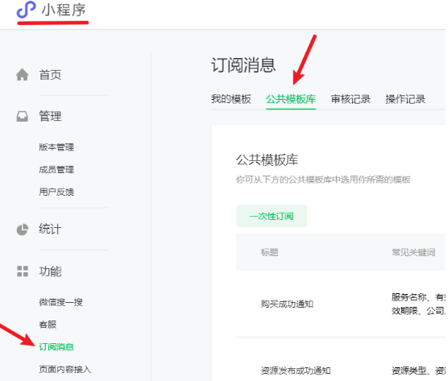
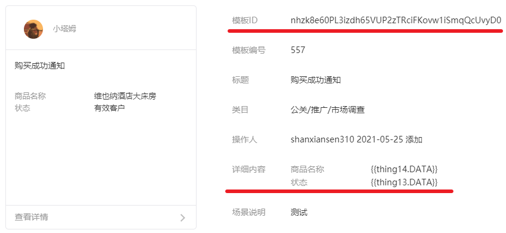
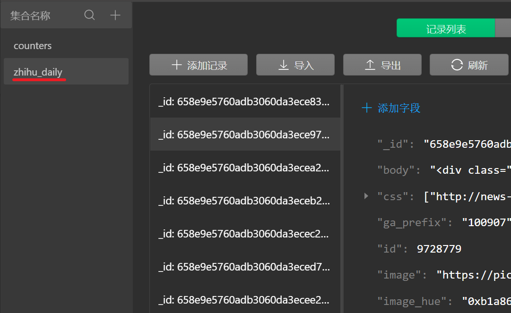
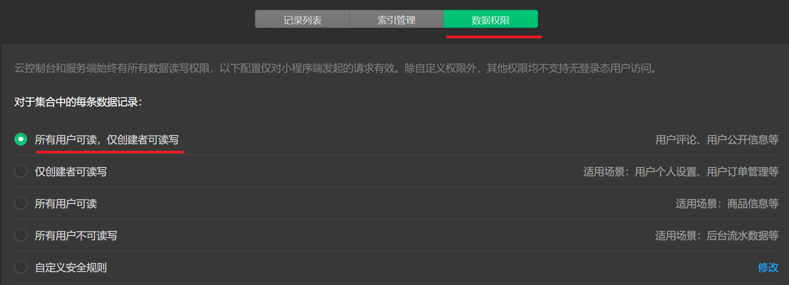

## 一.云开发快速入门

[【专题课程】从0开始使用小程序云开发 | 微信开放社区 (qq.com)](https://developers.weixin.qq.com/community/business/doc/00022011ec0a287dd32b4ddce5180d)

[云开发数据库入门讲解 | 微信开放社区 (qq.com)](https://developers.weixin.qq.com/community/business/doc/0000a88fed89907d14ca607005640d)

[云开发快速入门_小程序云开发学习指南 | 云开发CloudBase - 一站式后端云服务](https://www.cloudbase.net/community/guides/handbook/tcb21.html)


### 指定小程序的云开发环境

在开发者工具中打开源代码文件夹 miniprogram 里的 app.js，找到如下代码：

```js
	wx.cloud.init({
      // 此处请填入环境 ID, 环境 ID 可打开云控制台查看
      env: 'my-env-id',
      traceUser: true,
    })
```

在 env: 'my-env-id'处改成你的环境 ID，如 env: 'xly-snoop'


### 部署并上传云函数

cloudfuntions 文件夹图标里有朵小云，表示这就是云函数根目录。展开 cloudfunctions，我们可以看到里面有 login、openapi、callback、echo 文件夹，这些就是云函数目录。而 miniprogram 文件夹则放置的是小程序的页面文件。

cloudfunctions里放的是云函数，miniprogram放的是小程序的页面，这并不是一成不变的，也就是说你也可以修改这些文件夹的名称，这取决于项目配置文件project.config.json里的如下配置项：

```js
    "miniprogramRoot": "miniprogram/",
    "cloudfunctionRoot": "cloudfunctions/",
```

但是你最好是让放小程序页面的文件夹以及放云函数的文件夹处于平级关系且都在项目的根目录下，便于管理。

使用鼠标右键其中的一个云函数目录比如 login，在右键菜单中选择在终端中打开，打开后在终端中输入以下代码并按 Enter 回车执行：

```
npm install
```

如果显示“npm不是内部或外部命令”，你需要关闭微信开发者工具启动的终端，而是重新打开一个终端窗口，并在里面输入 cd /D 你的云函数目录进入云函数目录，比如 cd /D C:\download\tcb-project\cloudfunctions\login进入login的云函数目录，然后再来执行npm install命令。

这时候会下载云函数的依赖模块，下载完成后，再右键 login 云函数目录，点击“创建并部署：所有文件”，这时会把本地的云函数上传到云端，上传成功后在 login 云函数目录图标会变成一朵小云。

在开发者工具的工具栏上点击“云开发”图标会打开云开发控制台，在云开发控制台点击云函数图标，就能在云函数列表里看到我们上传好的“login”云函数啦。


#### 上传所有云函数

接下来我们按照这样的流程把其他所有云函数（如 openapi）都部署都上传，也就是要执行和上面相同的步骤，总结如下：

1.右键云函数目录，选择在终端中打开，输入 npm install命令下载依赖文件；
2.然后再右键云函数目录，点击“创建并部署：所有文件”
3.在云开发控制台–云函数–云函数列表查看云函数是否部署成功。

login、openapi、echo、callback这些云函数在后面都会用到的哦，一定要确定自己部署上传成功，不然后面会报错的哦。


#### npm 包管理器与依赖模块

为什么要在云函数目录执行 npm install，而不是其他地方？**这是因为 npm install 会下载云函数目录下的配置文件 package.json 里的 dependencies，它表示的是当前云函数需要依赖的模块**。package.json 在哪里，就在哪里执行 npm install，没有 package.json，没有 dependencies，就没法下载啊。

执行 npm install 命令下载的依赖模块会放在 node_modules 文件夹里，大家可以在执行了 npm install 命令之后，在电脑里打开查看一下 node_modules 文件夹里下载了哪些模块。

既然 npm install 是下载模块，那它是从哪里下载的呢？就以 wx-server-sdk 为例，我们可以在以下链接看到 wx-server-sdk 的情况：

```
https://www.npmjs.com/package/wx-server-sdk
```

为什么 package.json 里依赖的是一个模块 wx-server-sdk，但是 node_modules 文件夹里却下载了那么多模块？这是因为 wx-server-sdk 也依赖三个包 tcb-admin-node、protobuf、jstslib，而这三个包又会依赖其他包，子子孙孙的，于是就有了很多模块。

node_modules 文件夹这么大（几十M ~ 几百 M 都可能），会不会影响小程序的大小？**小程序的大小只与 miniprogram 文件夹有关，当你把云函数都部署上传到服务器之后，你把整个 cloudfuntions 文件夹删掉都没有关系。相同的依赖（比如都依赖 wx-server-sdk）一旦部署到云函数之后，你可以选择不上传 node_modules 时，因为已经上传过了。**


### 获取 openid 与云函数 login

当我们把云函数 login 部署上传成功后，就可以在模拟器以及手机（需要重新点击预览图标并扫描二维码）里点击获取 openid 了。

#### 调用云函数获取 openid

openid 是小程序用户的唯一标识，也就是每一个小程序用户都有一个唯一的 openid。点击“点击获取 openid”，在用户管理指引页面如果显示“用户 id 获取成功”以及一串字母+数字，那么表示你 login 云函数部署并上传成功啦。如果获取 openid 失败，你则需要解决 login 云函数的部署上传，才能进行下面的步骤哦

小程序的首页是”pages/index/index”，我们可以从 app.json 的配置项或者模拟器左下角的页面路径可以看出来。在 index.wxml 里有这段代码：

```html
<button class="userinfo-nickname" bindtap="onGetOpenid">点击获取 openid</button>
```

也就是当点击“点击获取 openid”按钮时，会触发 bindtap 绑定的事件处理函数 `onGetOpenid`，在 index.js 里可以看到 onGetOpenid 事件处理函数（在 index.js 里找到事件处理函数 onGetOpenid 对比理解）调用了 wx.cloud.callFunction()接口（打开技术文档对比理解）技术文档：[调用云函数 wx.cloud.callFunction](https://developers.weixin.qq.com/miniprogram/dev/wxcloud/reference-client-api/functions/callFunction.html)

```js
onGetOpenid: function() {
    // 调用云函数
    wx.cloud.callFunction({
      name: 'login',
      data: {},
      success: res => {
        console.log('[云函数] [login] user openid: ', res.result.openid)
        app.globalData.openid = res.result.openid
        wx.navigateTo({
          url: '../userConsole/userConsole',
        })
        console.log('res:',res);
      },
      fail: err => {
        console.error('[云函数] [login] 调用失败', err)
        wx.navigateTo({
          url: '../deployFunctions/deployFunctions',
        })
      }
    })
  },
```

这里可以看一下点击获取id后返回的res是什么?

 

- requestID：云函数执行 ID，可用于在云开发控制台查找日志，打开云开发控制台–云函数–日志，可以在这里根据云函数函数名以及 requestID 来筛选查看云函数的调用日志（含返回结果）；
- result：云函数返回的结果，login 云函数返回的结果里包含 appid、event 对象，我们可以通过 res.result.appid 以及 res.result.event 访问它们；
- errMsg：显示云函数是否调用成功

事件处理函数 onGetOpenid 调用云函数成功之后，干了三件事情：

- 使用 console.log 打印 openid，可以在点击按钮触发云函数在控制台看到该打印结果；
- 把获取到的 appid 赋值给 app.js 文件里的 globalData 全局对象；
- 跳转到 userConsole 页面；

而 userConsole 页面就只是从 globalData 里将 openid 取出来通过 setData 渲染到页面。


#### 云函数 login 解读

login/index.js 的简单结构:

```js
/**
 * 这个示例将经自动鉴权过的小程序用户 openid 返回给小程序端
 * 
 * event 参数包含小程序端调用传入的 data
 * 
 */
exports.main = async (event, context) => {
  console.log('服务端打印的event',event)
  console.log('服务端打印的context',context)
  // 可执行其他自定义逻辑
  // console.log 的内容可以在云开发云函数调用日志查看

  // 获取 WX Context (微信调用上下文)，包括 OPENID、APPID、及 UNIONID（需满足 UNIONID 获取条件）等信息
  const wxContext = cloud.getWXContext();
  console.log('getWXContext返回的结果',wxContext);

  return {
    event,
    openid: wxContext.OPENID,
    appid: wxContext.APPID,
    unionid: wxContext.UNIONID,
    env: wxContext.ENV,
  }
}
```


为什么调用云函数 login 返回的 res 的 result 对象里会包含 event 对象、appid、userInfo 这些结果？这就取决于云函数是怎么写的了。使用开发者工具打开 login 云函数（在 cloudfuntions 文件夹里）的 index.js。

```js
exports.main = (event, context) => {}
```

这是一个箭头函数的写法，其中 event 和 context 是参数。我们将两个打印日志修改为以下代码，相当于备注一下到底打印到哪里去了：

```js
console.log('服务端打印的event',event)
console.log('服务端打印的context',context)
```

保存之后，右键点击 index.js 文件，选择云函数增量上传:（更新文件），更新 login 云函数，我们再来点击“点击获取 openid”按钮，打印的结果在哪里呢？在云开发控制台的云函数日志里面（注意不是开发者工具的控制台）。打开云开发控制台–云函数–日志，按函数名筛选，选择 login 云函数，可以看到云函数被调用的日志记录，我们可以在日志里发现：

- event 对象包含程序用户的 openid 和小程序的 appid，而 openid 就相当于用户的身份证，我们可以根据 openid 获取到用户的昵称、头像等信息（后面会说明）；
- 而 context 对象则是云函数的调用信息和运行状态。
- 在返回结果里我们可以看到 return 返回的数据


❗ <span style="font-weight:bold; color:red;">云函数的打印日志会显示在云开发控制台的日志里面</span>


##### getWXContext()

getWXContext()API 是云开发服务端的工具类 API，会返回小程序用户的 openid、小程序 appid、小程序用户的 unionid 等。说这么多不如直接打印，在下面添加一行打印信息：

```js
const wxContext = cloud.getWXContext()
console.log('getWXContext返回的结果',wxContext)
```

保存之后，右键点击 index.js 文件，选择云函数增量上传:（更新文件），更新 login 云函数，我们再来点击“点击获取 openid”按钮，然后去云开发控制台的云函数日志里看到底返回了什么结果。

技术文档：[getWXContext()](https://developers.weixin.qq.com/miniprogram/dev/wxcloud/reference-server-api/utils/getWXContext.html)

对照技术文档来理解返回的结果。

```json
getWXContext返回的结果 {
  "UNIONID": "",
  "CLIENTIP": "10.12.23.71",
  "CLIENTIPV6": "::ffff:10.12.23.71",
  "FROM_APPID": "",
  "FROM_OPENID": "",
  "FROM_UNIONID": "",
  "OPEN_DATA_INFO": "",
  "APPID": "wxd5cfca6a4835cc34",
  "OPENID": "oJX0i5IdmAyI9JjXrCvJ-tMjX3wM",
  "ENV": "cloud1-9g8cvwt071ed7866",
  "SOURCE": "wx_devtools"
}
```

注意小程序用户 unionid只有在开发者帐号下存在同主体的公众号或移动应用，并且该用户已经授权登录过该公众号或移动应用才能获得。


##### return

return 语句是终止函数的执行，并返回一个指定的值给函数调用者。这里返回了 4 个值，而前面我们就调用过 login 云函数，就是函数的调用者，所以我们打印的事件处理函数 onGetOpenid 的回调函数的 res 对象正是这个 return 返回的结果。


### 新建云函数

鼠标右键 cloudfunctions 云函数根目录，在弹出的窗口选择新建 Node.js 云函数，比如输入 sum，按 Enter 确认后，微信开发者工具会在本地（你的电脑）创建出 sum 云函数目录，同时也会在线上环境中创建出对应的云函数（也就是自动部署好了，可以到云开发控制台云函数列表里看到）。然后建议 npm i 安装一下依赖！

打开 sum 云函数目录下的 index.js，添加 sum:event.a+event.b,到 return 函数里（把多余的内容可以删掉了），然后记得选择云函数增量上传:（更新文件），更新 sum 云函数。

```js
// 云函数入口文件
const cloud = require('wx-server-sdk')

cloud.init()

// 云函数入口函数
exports.main = async (event, context) => {
  const wxContext = cloud.getWXContext()
  return {
    sum:event.a+event.b,
  }
}
```


addFunction.js的函数:

```js
  testFunction() {
    wx.cloud.callFunction({
      name: 'sum',
      data: {
        a: 1,
        b: 2
      },
      success: res => {
        wx.showToast({
          title: '调用成功',
        })
        this.setData({
          result: JSON.stringify(res.result)
        })
        console.log("sum云函数返回的对象",res);
      },
      fail: err => {
        wx.showToast({
          icon: 'none',
          title: '调用失败',
        })
        console.error('[云函数] [sum] 调用失败：', err)
      }
    })
  },
```

data 里填写的是传递给云函数的参数，也就是先把小程序端的参数传递给云函数，然后云函数处理之后再返回 res 对象，我们可以在 success 回调函数里打印 res 对象

res.result 是对象，而 JSON.stringify(res.result)是 json 格式， JSON.stringify() 方法是将一个 JavaScript 值(对象或者数组)转换为一个 JSON 字符串，因为对象如果直接渲染到页面是会显示 [object Object]的。


### 体验上传图片

点击云开发控制台的存储图标，就可以进入到存储管理页查看到你之前上传的图片啦，点击该图片名称可以看到这张图片的一些信息，如：文件大小、格式、上传者的 OpenID 以及存储位置、下载地址和 File ID。复制下载地址链接，在浏览器就能查看到这张图片啦。


### 发送订阅消息


 


首先在小程序管理网页中进入订阅消息=> 公共模板库 , 随意选择一个模板

 


然后就可以在我的模板中看见! 点击详情:  关键在于 1. 模板ID  2.详细内容

 


以云开发模板小程序为例:

进入 pages/openapi/serverapi/serverapi.js 修改data中的templateId未你的模板ID，然后再进入云函数的 cloudfunctions\openapi\index.js 中 的 sendSubscribeMessage(event) 函数， 按照模板中的详细内容填写data

```js
async function sendSubscribeMessage(event) {
  const { OPENID } = cloud.getWXContext()

  const { templateId } = event

  const sendResult = await cloud.openapi.subscribeMessage.send({
    touser: OPENID,
    templateId,
    miniprogram_state: 'developer',
    page: 'pages/openapi/openapi',
    // 此处字段应修改为所申请模板所要求的字段
    data: {
      thing14:{
        value:'维也纳酒店大床房',
      },
      thing13:{
        value:'有效客户',
      },
      thing1: {
        value: '咖啡',
      },
      time3: {
        value: '2020-01-01 00:00',
      },
    }
  })
```


### 开始一个新的云开发项目


**基于云开发 QuickStart 模板小程序**

云开发 QuickStart 模板小程序有很多多余的页面，这个我们只需要把 miniprogram 文件夹下的 pages、images、components、style 文件夹里的文件清空，以及 app.json 的 pages 配置项里的页面删除，把 app.wxss 里的样式代码都删掉就是一个全新的开始啦。这是方法之一，也可以使用下面的方法（推荐学习时使用下面的方法）。


**基于没有使用云开发的项目改造**
当然我们也可以把前面章节没有使用云开发的项目改造成使用云服务，首先在小程序的根目录下新建一个文件夹，比如 cloudfunctions，然后在 ==project.config.json== 添加云函数文件夹的路径配置即可，

```js
"cloudfunctionRoot": "cloudfunctions/",
```

然后新建一个 miniprogram 文件夹，把小程序除了 project.config.json 以外的其他文件，比如 pages、utils、images、app.js、app.json 等文件都放到 miniprogram 文件夹里，再在 project.config.json 添加 miniprogramRoot 配置:

```
"cloudfunctionRoot": "cloudfunctions/",
"miniprogramRoot":"miniprogram/",
值得一提的是，云函数部署上传成功，我们就可以一直调用，只要你的小程序的appid以及环境ID没有变，你创建再多的小程序项目，都可以直接调用部署好的云函数，比如前面的login、echo、callback、sum等云函数。也就是说云函数一旦部署成功，它就一直在云端服务器里，哪怕你把小程序本地的云函数都删掉也没有关系。
```

当新建了并配置了云函数根目录为 cloudfunctions 文件夹之后，云函数根目录里并没有云函数，我们可以右键点击云函数根目录 cloudfunctions 文件夹选择同步云函数列表，可以把所有云端的云函数列表都列举出来（这只是列举了列表），而要修改云函数里面的内容，我们可以右键点击其中的一个云函数目录选择下载云函数即可。

除此之外，我们需要小程序的 app.js 的生命周期函数 onLaunch 里使用 wx.cloud.init()来初始化云开发能力：

```js
  onLaunch: function () {
    if (!wx.cloud) {
      console.error('请使用 2.2.3 或以上的基础库以使用云能力')
    } else {
      wx.cloud.init({
        env: '你的环境ID',
        traceUser: true,
      })
    }
  },
```

云开发能力全局只需要初始化一次即可，这里的 traceUser 属性设置为 true，会将用户访问记录到用户管理中，在云开发控制台的运营分析—用户访问里可以看到访问记录。


**基础库与 wx.cloud**

在小程序端初始化云开发能力的代码里，涉及到 wx.cloud 以及基础库版本的知识。关于 wx.cloud，我们可以和之前在控制台了解 wx 对象一样，直接在开发者工具的控制台里输入：

```
wx.cloud
```

来了解对象有哪些属性与方法。我们可以看到有如下方法：

```js
CloudID: ƒ () //用于云调用获取开放数据
callFunction: ƒ () //调用云函数
database: ƒ () //获取数据库的引用
deleteFile: ƒ () //从云存储空间删除文件
downloadFile: ƒ () //从云存储空间下载文件
getTempFileURL: ƒ () //用云文件 ID 换取真实链接
init: ƒ ()  //初始化云开发能力
uploadFile: ƒ () //上传文件至云存储空间
```

而关于基础库，有三个地方需要注意它的存在，平时开发的时候需要留意

开发者工具的project.config.json里有这样一个属性libVersion，这个也可以在开发者工具工具栏右上角的详情里的本地设置里的调试基础库，建议切换到最新，切换后libVersion的值也会修改到切换的版本；
官方文档基础库的更新日志，小程序更新非常频繁，而更新的核心就是基础库：所以基础库更新日志要经常留意
每个API，技术文档都会标明它的基础库支持的最低版本，而小程序·云开发 SDK是2.2.3以上的基础库才开始支持的。


## 二.云开发能力


开通了云开发服务，相当于在云端拥有了一个 Nodejs 的环境，我们可以把云函数部署到云端。通过云开发的能力进行调用云函数、上传图片、操作数据库以及使用小程序的一些开放接口，下面来进一步了解和使用云开发能力，并加强对云端测试、本地调试以及本地 Console 日志打印，云端日志打印的理解。


> 用编程来写项目，就像是在做一系列精密而复杂的实验，你不能总是劳烦他人帮你解决问题，而是要掌握调试、测试、日志打印等手段来检查每一步操作是否正确，你需要学会查看报错信息，如果不正确问题在哪、出了什么问题，你才能有针对性的去搜索，有针对性的去咨询他人。


### 本地调试与云端测试


以一个简单的求矩形周长,面积的函数来示例:


#### 第一步：新建云函数

首先我们右键点击云函数根目录（也就是 cloudfunctions 文件夹），选择新建 Nodejs 云函数，函数名为长方形的英文 rectangle，然后打开 index.js，修改 return 里的内容为如下：

```js
exports.main = async (event, context) => {
  const wxContext = cloud.getWXContext()
  return {
    circum:(event.width+event.height)*2,
    area:event.width*event.height
  }
}
```


❗还要记住对该云函数安装依赖!  右键点击云函数目录，也就是 rectangle 文件夹，选择在终端中打开，使用 npm install 来安装依赖。

然后还要记住将 ==index.js== 增量上传! 


#### 第二步：本地调试云函数是否正确

对于一个复杂的云函数，我们最好是先在本地测试一下云函数是否正确，然后再部署上传到云端。那如何本地测试呢？右键点击云函数目录，也就是 rectangle 文件夹，选择本地调试 !  然后将最右侧的请求方式从模拟器触发改为手动触发，修改参数为：

```js
{
  "width": 10,
  "height":7
}
```

点击调用，然后在console中查看具体信息：

 

这样就说明本地测试正确 !


#### 第三步：云端测试云函数是否正确

打开云开发控制台的云函数标签页，找到 rectangle 云函数，点击云端测试，同样我们给参数赋值，将以下代码进行修改：

```json
{
  "key1": "test value 1",
  "key2": "test value 2"
}
```

比如给宽度 width 赋值为 4，高度 height 赋值为 7，即代码修改为：

```json
{
  "width": 4,
  "height": 7
}
```

然后点击运行测试，（会等一段时间），再来查看测试的结果，如果返回结果如下，则表示在云端的云函数可以正常调用：

```js
{"circum":22,"area":28}
```

在云端测试的调用结果也是可以在云开发控制台云函数的日志里查看到的。

在第一节我们要触发云函数，需要在小程序页面里写一个组件（比如button）并绑定事件处理函数，然后再在事件处理函数（或在页面的生命周期函数）里使用wx.cloud.callFunction()调用云函数，通过这种方式来触发云函数，会比较麻烦，而本地调试和云端测试则可以直接触发云函数查看结果，大大提升了调试的便利度。

云函数的调用采用事件触发模型，小程序端的调用、本地调试和云端测试都会触发云函数的调用事件，其中本地调试调用的不是云端的云函数，而是小程序本地的云函数。


### 小程序端与服务端

小程序端与云端的初始化

小程序默认可以创建两个环境，这两个环境都有云函数配置、数据库、云存储且独立隔离，开发上会存在两个环境切换的情况（一个用于生产环境，一个用于测试环境），而区别这两个环境的就是它们的环境 ID，小程序端与云端的初始化时要注意。

在前面我们介绍过小程序的初始化是在 app.js 文件里使用 wx.cloud.init 来初始化，如下：

```js
wx.cloud.init({
  env: 'my-env-id', //可以填写生产环境或者测试环境的环境ID
  traceUser: true,
})
```

这里的 env 只会决定小程序端 API 调用的云环境（如云函数、云存储、数据库，毕竟有两个环境里都有），并不会决定云函数中的 API 调用的环境。在开发者工具的控制台，也会打印默认环境：
当前代码初始化的默认环境为：你的默认环境 ID
当前代码初始化的默认环境为：你的默认环境 ID

云函数中的 API 调用的环境也可以使用初始化来设置。

```js
cloud.init({
  env: cloud.DYNAMIC_CURRENT_ENV,
})
```

cloud.DYNAMIC_CURRENT_ENV 设置 API 默认环境等于当前所在环境。建议所有的云函数都使用以上方式来初始化，也就是配置 env 的值为 cloud.DYNAMIC_CURRENT_ENV 或使用你的环境 ID，不要为空。


### 获取用户信息和登录

在生命周期章节，我们大致介绍了一下如何使用 wx.getUserInfo API 和通过组件的 open-type=”getUserInfo” 来获取用户的信息（如头像、昵称），下面我们就来详细介绍云开发的免鉴权登录与用户信息的结合。

```
使用open-type=”getUserInfo” 来获取用户信息的作用和 wx.getUserInfo API基本效果是一样的，区别在于wx.getUserInfo 这种方式最好是在用户允许获取公开信息（也就是res.authSetting[‘scope.userInfo’]的值为true）之后再调用，如果用户拒绝了授权就不会再有弹窗（除非用户删掉了你的小程序再使用），调用就会失败，而使用组件的方式是用户主动点击，用户即使拒绝了，再点击仍会弹出授权弹窗。所以推荐先使用组件来获取用户授权，然后再来使用wx.getUserInfo来获取用户信息。
```

### 通过 button 获取用户信息

使用开发者工具新建一个 login 页面，然后在 login.wxml 里输入以下代码，我们通过组件的方式来获取用户的信息：

```html
<button open-type="getUserInfo" bindgetuserinfo="getUserInfomation">点击获取用户信息</button>
<image src="{{avatarUrl}}"></image>
<view>{{city}}</view>
<view>{{nickName}}</view>
```

在 login.js 的 data 里初始化 avatarUrl、nickName 以及 city，没有获取到用户信息时，用一张默认图片代替，昵称显示用户未登录，city 显示为未知：

```js
  data: {
    avatarUrl: '/images/user-unlogin.png',
    nickName:"用户未登陆",
    city:"未知",
  },
```

然后在 login.js 文件里输入以下代码，在事件处理函数 getUserInfomation 我们可以打印 event 对象，open-type=”getUserInfo”的组件的 event 对象的 detail 里就有 userInfo：

```js
  getUserInfomation: function (event) {
    console.log('getUserInfomation打印的事件对象', event)
    let { avatarUrl, city, nickName}= event.detail.userInfo
    this.setData({
      avatarUrl,city, nickName
    })
  },
```

将获取的 avatarUrl，city，nickName 通过 this.setData()赋值给 data。编译之后点击点击获取用户信息按钮，首先会弹出授权弹窗，当用户确认之后，就会显示用户的信息。

稍微展示一下在event.detail中的userInfo

```js
userInfo:
    avatarUrl: "https://thirdwx.qlogo.cn/mmopen/vi_32/t9HmgOtSB2QmvNPoMupOe70rWAFwZfatAPmZlUibQESnPicGCn3SicsWQHeS3tT58ibYBm15wWf3CD2icuibBbqcjlQg/132"
    city: "Chengdu"
    country: "China"
    gender: 1
    language: "zh_CN"
    nickName: "无幻"
    province: "Sichuan"
    __proto__: Object
```


#### 获取用户高清头像

我们发现获取到的头像不是很清晰，这是因为默认的头像大小为 132*132（UserInfo 用户头像说明），如果把 avatarUrl 链接后面的 132 修改为 0 就能获取到 640*640 大小的头像了：

```js
  getUserInfomation: function (event) {
    let { avatarUrl, city, nickName}= event.detail.userInfo
    avatarUrl = avatarUrl.split("/")
    avatarUrl[avatarUrl.length - 1] = 0;
    avatarUrl = avatarUrl.join('/');
    this.setData({
      avatarUrl,city, nickName
    })
  },
```


#### ~~页面加载时就显示用户信息~~   

<span style="font-weight:bold; color:red;">新版本不支持了 ! </span>

在获得了用户授权和用户信息的情况下，刷新页面或进行页面跳转，用户的个人信息还是不会显示，这是因为 getUserInfomation 事件处理函数点击组件时才触发，我们需要在页面加载时也能触发获取用户信息才行。


💣微信更新了:  [小程序登录、用户信息相关接口调整说明 | 微信开放社区 (qq.com)](https://developers.weixin.qq.com/community/develop/doc/000cacfa20ce88df04cb468bc52801?highLine=login)

* 2021年4月28日24时后发布的小程序新版本，无法通过wx.getUserInfo与<button open-type="getUserInfo"/>获取用户个人信息（头像、昵称、性别与地区），将直接获取匿名数据（包括userInfo与encryptedData中的用户个人信息）
* 新增getUserProfile接口（基础库2.10.4版本开始支持），可获取用户头像、昵称、性别及地区信息，**开发者每次通过该接口获取用户个人信息均需用户确认**。


前面获取用户信息的方式基本可以抛弃...

新版本:[wx.getUserProfile(Object object) | 微信开放文档 (qq.com)](https://developers.weixin.qq.com/miniprogram/dev/api/open-api/user-info/wx.getUserProfile.html)

wxml:

```html
<view class="container">
  <view class="userinfo">
    <block wx:if="{{!hasUserInfo}}">
      <button wx:if="{{canIUseGetUserProfile}}" type="primary" bindtap="getUserProfile"> 获取头像昵称 </button>
      <button wx:else open-type="getUserInfo" bindgetuserinfo="getUserInfo"> 获取头像昵称 </button>
    </block>

    <image bindtap="bindViewTap"  src="{{userInfo.avatarUrl}}" mode="widthFix"></image>
    <view class="userinfo-nickname">用户名: {{userInfo.nickName}}</view>
    <view class="userinfo-nickname">地区      : {{userInfo.city}}</view>
  </view>
</view>
```


js:

```js
  data: {
    userInfo: {
      avatarUrl: '/images/faye.png',
      nickName: "用户未登陆",
      city: "未知",
    },
    hasUserInfo: false,
    canIUseGetUserProfile: false,
  },
  
  onLoad: function () {
    console.log('wx.getUserProfile:', Boolean(wx.getUserProfile));
    if (wx.getUserProfile) {
      this.setData({
        canIUseGetUserProfile: true
      })
    }
  },

  getUserProfile(e) {
    // 推荐使用wx.getUserProfile获取用户信息，开发者每次通过该接口获取用户个人信息均需用户确认
    // 开发者妥善保管用户快速填写的头像昵称，避免重复弹窗
    wx.getUserProfile({
      desc: '用于完善会员资料', // 声明获取用户个人信息后的用途，后续会展示在弹窗中，请谨慎填写
      success: (res) => {
        res.userInfo.avatarUrl = res.userInfo.avatarUrl.split("/")
        res.userInfo.avatarUrl[res.userInfo.avatarUrl.length - 1] = 0;
        res.userInfo.avatarUrl = res.userInfo.avatarUrl.join('/');
        this.setData({
          userInfo: res.userInfo,
          hasUserInfo: true
        })
        console.log('this:',this);
      }
    })
  },
```


#### openid、用户信息与登录

关键还是openid ❗ 可以通过云函数login获取

尽管我们已经获取到了用户的头像、昵称等信息，但是这不能称之为真正意义的登录，只有获取到了用户身份的唯一 ID 也就是 openid，我们才能把用户行为比如点赞、评论、发布文章、收藏等与用户挂钩，用户这些行为都与数据库有关，而能够确定点赞、评论、文章、收藏这些数据与用户关系的就是 openid，也就是说只要获取到了 openid 就意味着用户已经登录，而获取用户信息（如头像、昵称）不过是一个附加服务，这两个是可以完全独立的。没有 openid，我们也无法把用户信息给存储到数据库，也就没法让用户自定义用户信息。无论是用户行为，还是用户的信息，openid 都是一个重要的桥梁。

> 通过前面的login云函数，我们就已经可以获取到用户的openid。无需维护复杂的鉴权机制，即可获取天然可信任的用户登录态（openid），是云开发的一个重要优势。无论是云存储还是云数据库，openid都扮演着一个重要的角色。


### 图片上传


要把图片上传到云存储，会使用到 wx.cloud.uploadFile，这个 API 是小程序端的 API，它是把本地资源也就是临时文件里的文件上传到云存储里。在前面《图片、缓存与文件》章节里我们已经了解到如何把图片上传到小程序的临时文件，而要把临时文件上传到云存储，则需要调用 wx.cloud.uploadFile API。

技术文档：[wx.cloud.uploadFile](https://developers.weixin.qq.com/miniprogram/dev/wxcloud/reference-client-api/storage/uploadFile.html)

在 wx.cloud.uploadFile 技术文档里，可以看到要调用 API，需要获取图片的 filePath，在小程序里为临时文件的路径，也就是要把上传到小程序的临时文件路径赋值给它；还有一个 cloudPath，这个为文件的云存储路径，这个是我们可以任意设置的。

使用开发者工具在 login.wxml 里添加以下代码，代码和前面章节基本一致，大家也可以回顾一下以前的内容：

```html
<button bindtap="chooseImg">选择图片</button>
<image mode="widthFix" src="{{imgurl}}"></image>
```

然后在 login.js 的 data 里初始化 imgurl，这里 imgurl 是一个字符串，

```js
  data: {
    imgurl: "",
  },
```

然后在 login.js 里添加事件处理函数 chooseImg，我们再来回顾一下临时文件的知识：

```js
  chooseImg: function () {
    wx.chooseImage({
      count: 1,
      sizeType: ['compressed'],
      sourceType: ['album', 'camera'],
      success: function (res) {
        console.log(res)
        console.log(res.tempFilePaths)
      }
    })
  },
```

 

编译后，上传一张图片，在控制台里我们可以看到 res.tempFilePaths 是一个数组格式，而 wx.cloud.uploadFile 的 filePath 是一个字符串，所以我们在上传时，可以把第一张图片的路径（字符串）赋值给 filePath：

```js
const filePath = res.tempFilePaths[0]
```


由于我们需要把图片上传至云数据库, 因此需要对文件路径进行处理:


#### 文件名与后缀的处理

我们知道一个文件由文件名称和文件后缀构成，比如 tcb.jpg 和 cloudbase.png，jpeg 说明图片的格式是 JPG 格式，而 png 说明图片是 PNG 格式，文件名称相同且格式相同就是出现覆盖，如果我们随意更改了文件的后缀，大多数文件就会打不开。所以要把 cloudPath 云存储的路径需要我们把文件名和后缀给处理好。

当我们把图片上传到小程序的临时文件后，我们可以查看一下临时路径是什么样子的：

```json
http://tmp/wx7124afdb64d578f5.o6zAJs291xB-a5G1FlXwylqTqNQ4.esN9ygu5Hmyfccd41d052e20322e6f3469de87f662a0.png
```

临时路径的文件名就不是原来的文件名，会变成一段长字符，但文件的格式还是原来的文件格式（后缀）。那 cloudPath 要输入文件的路径，就需要填写文件名和文件格式，这个要怎么处理呢？

在上一节的 QuickStart 小程序里，文件上传到云存储的处理方式如下：

```js
const cloudPath = 'my-image' + filePath.match(/\.[^.]+?$/)[0]
```

也就是它把上传的所有图片都命名为 my-image，而文件的后缀还是原来的文件后缀（也就是文件格式不变）。这里的  filePath.match(/\\.[\^.]+?$/)[0]  是字符串的正则处理，主要用于提取出后缀如 .jpg 。


这种把所有文件都命名为 my-image 的做法，会导致当文件的后缀相同时文件会被覆盖，如果不希望文件被覆盖，我们需要给文件命不同的名字，我们可以这样处理：

```js
const cloudPath = `${Date.now()}-${Math.floor(Math.random(0, 1) * 1000)}` + filePath.match(/\.[^.]+?$/)[0]
```

给文件名加上时间戳和一个随机数，时间戳是以毫秒计算，而随机数是以 1000 内的正整数，除非 1 秒钟（1 秒=1000 毫秒）上传几十万张照片，不然文件名是不会重复的。

结合上面的内容，我们可以把 wx.chooseImage()的 success 回调函数如下处理：

```js
success: function (res) {
  const filePath = res.tempFilePaths[0]
  const cloudPath = `${Date.now()}-${Math.floor(Math.random(0, 1) * 1000)}` + filePath.match(/\.[^.]+?$/)[0]
  wx.cloud.uploadFile({
    cloudPath,
    filePath,
    success: res => {
      console.log('上传成功后获得的res：', res)
    },
  })
}
```

编译之后，我们再次上传一张图片就会打印上传成功之后的 res 对象，里面包含图片在云存储里的 fileID，注意它的文件名和文件后缀，以及我们可以在云开发控制台的存储里找到你上传的图片，也就是说我们上传图片到云存储是无法直接获取到图片的下载地址的。

#### wx.cloud.uploadFile

将本地资源上传至云存储空间，如果上传至同一路径则是覆盖写

| 字段      | 说明                                                         | 数据类型 | 默认值 | 必填 |
| :-------- | :----------------------------------------------------------- | :------- | :----- | :--- |
| cloudPath | 云存储路径，命名限制见[文件名命名限制](https://developers.weixin.qq.com/miniprogram/dev/wxcloud/guide/storage/naming.html) | String   | -      | Y    |
| filePath  | 要上传文件资源的路径                                         | String   | -      | Y    |
| config    | 配置                                                         | Object   | -      | N    |
| success   | 成功回调                                                     |          |        |      |
| fail      | 失败回调                                                     |          |        |      |
| complete  | 结束回调                                                     |          |        |      |

★filePath其实相当于存储在本地的路径! 


#### 云存储的二级目录

在存储里我们都是把所有的图片放在根目录下，没有二级目录，那我们能不能建一个二级目录呢？当然是可以的，我们可以**在 cloudPath 的前面加一个文件路径**就可以了，比如：

```js
const cloudPath = `cloudbase/${Date.now()}-${Math.floor(Math.random(0, 1) * 1000)}` + filePath.match(/\.[^.]+?$/)[0]
```

渲染云存储图片到组件

在上一节组件支持部分了解到，我们是可以把 fileID 直接在小程序的某些组件里渲染出来的。综合以上内容 chooseImg 事件处理函数最终为以下代码（注意 this.setData 的 this 指向，这里为了方便把 success 回调都写成了箭头函数）：

```js
  chooseImg: function () {
    wx.chooseImage({
      count: 1,
      sizeType: ['compressed'],
      sourceType: ['album', 'camera'],
      success: res=> {
        const filePath = res.tempFilePaths[0]
        const cloudPath = `cloudbase/${Date.now()}-${Math.floor(Math.random(0, 1) * 1000)}` + filePath.match(/\.[^.]+?$/)[0]
        wx.cloud.uploadFile({
          cloudPath,
          filePath,
          success: res => {
            console.log('上传成功后获得的res：', res)
            const imgurl=res.fileID
            this.setData({
              imgurl
            })
          },
        })
      }
    })
  },
```


也可以通过云函数上传图片:

#### 云函数上传图片到云存储

云开发不仅在小程序端可以上传文件到云存储，还可以通过云函数也就是云端上传图片到云存储（这里会涉及到一点 Nodejs 的知识）。

技术文档：[uploadFile](https://developers.weixin.qq.com/miniprogram/dev/wxcloud/reference-server-api/storage/uploadFile.html)

注意云函数上传图片的 API 属于服务端 API，与 wx.cloud.uploadFile 是小程序端 API 不同。

使用开发者工具右键点击云函数根目录也就是 cloudfunctions 文件夹，选择新建 Node.js 云函数，云函数的名称命名为 uploadimg，右键点击 uploadimg 文件夹，选择硬盘打开，然后拷贝一张图片如 demo.jpg 进去，文件结构如下：

```
uploadimg云函数目录
├── index.js
├── package.json
├── demo.jpg
```

然后打开 index.js，输入以下代码：

```js
const cloud = require('wx-server-sdk')
const fs = require('fs')
const path = require('path')
cloud.init({
  env: cloud.DYNAMIC_CURRENT_ENV,
})
exports.main = async (event, context) => {
  const fileStream = fs.createReadStream(path.join(__dirname, 'demo.jpg'))
  return await cloud.uploadFile({
    cloudPath: 'tcbdemo.jpg',
    fileContent: fileStream,
  })
}
```

然后右键点击 uploadimg 文件夹，选择在终端中打开，输入 npm install 安装依赖，再点击 uploadimg 文件夹，选择上传并部署所有文件（这时图片也一并上传到了云端）。

由于云端测试无法获取用户登陆态信息，所以我们不能在云端测试里把图片上传到云存储，需要在小程序端调用，使用开发者工具在 login.wxml 输入以下代码，也就是新建一个绑定 uploadimg 事件处理函数的 button 用于触发：

```html
<button bindtap="uploadimg">云函数上传图片</button>
```

然后在 login.js 里输入以下代码，在事件处理函数 uploadimg 里调用 uploadimg 云函数，并返回调用之后的 res 对象：

```js
  uploadimg() {
    wx.cloud.callFunction({
      name: 'uploadimg',
      success: res => {
        console.log(res)
      }
    })
  },
```

编译之后，点击云函数上传图片按钮，就可以调用 uploadimg 云函数，从而调用 uploadFile API 将服务端/云端的图片上传到云存储里面啦，可以打开云开发控制台的云存储查看是否有 tcbdemo.jpg 这张图片。

<span style="font-weight:bold; color:red;">注意，通过这种方式上传到云存储的图片，是没有上传者 Open ID的，在云存储里查看这张图片的详细信息，就可以了解到。</span>


### 调用数据库

在调用数据库之前，我们需要先有一个比较贴近实际的数据库案例，为此把前面章节用到的知乎日报数据整理出了一个数据库文件。云开发数据库支持用文件的方式导入已有的数据（这里推荐大家使用 json）。

数据库下载：[知乎日报文章数据](https://tcb-1251009918.cos.ap-guangzhou.myqcloud.com/data.json)

右键点击链接，将 data.json 存储到电脑。为了方便大家阅读与编辑 data.json 文件的内容

打开云开发控制台，在数据库里新建一个集合 zhihu_daily，导入该 json 文件，导入时会有冲突模式选择，看下面的介绍，推荐大家使用 upsert：

- Insert：总是插入新记录
- Upsert：如果记录存在则更新，否则插入新记录

导入后，发现数据库自动给每一条数据（记录）都加了唯一的标识_id。




#### 小程序端调用数据库

 API 风格

云开发的 API 风格与框架组件和 API 风格一致，但同时支持**回调**风格和**Promise**风格。在传入 API 的 Object 参数中，如果传入了 `success`、`fail`、`complete` 字段，则我们认为是采用**回调**风格，API 方法调用不返回 `Promise`。如果传入 API 的 Object 参数中 `success`、`fail`、`complete` 这三个字段都不存在，则我们认为是采用**Promise**风格，API 方法调用返回一个 `Promise`，`Promise` resolve 的结果同传入 `success` 回调的参数，reject 的结果同传入 `fail` 的参数。

回调函数的一般模板: 

```js
db.collection('test')
  .where({
    price: _.gt(10)
  })
  .field({
    name: true,
    price: true,
  })
  .orderBy('price', 'desc')
  .skip(1)
  .limit(10)
  .get()
```


在小程序端调用数据库的方式很简单，我们可以把下面的代码写到一个事件处理函数里，然后点击组件触发事件处理函数来调用；也可以直接写到页面的生命周期函数里面；还可以把它写到 app.js 小程序的生命周期函数里面。

使用开发者工具，将下面的代码写到 login.js 的 onLoad 函数里面，我们

- 先使用 wx.cloud.database()获取数据库的引用（相当于连接数据库）;
- 再使用 db.collection()获取集合的引用；
- 再通过 Collection.get 来获取集合里的记录.

```js
const db = wx.cloud.database()
db.collection('zhihu_daily')
  .get()
  .then(res => {
    console.log(res.data)
  })
  .catch(err => {
    console.error(err)
  })
```

编译之后，就能在控制台看到调用的 20 条数据库记录了（如果没有指定 limit，则默认最多取 20 条记录）。

也可以加上limit，只查看前五条数据   

```js
const db = wx.cloud.database()
db.collection('zhihu_daily')
  .get().limit(5)
  .then(res => {
    console.log(res.data)
  })
  .catch(err => {
    console.error(err)
  })
```

[Collection | 微信开放文档 (qq.com)](https://developers.weixin.qq.com/miniprogram/dev/wxcloud/reference-sdk-api/database/collection/Collection.where.html)

❗ <span style="font-weight:bold; color:red;">记得在这里修改</span> `数据权限`  , 不然获取数据一直为空 !




#### 云函数调用数据库

使用云函数也可以调用数据库，使用开发者工具右键点击云函数根目录也就是 cloudfunctions 文件夹，选择新建 Node.js 云函数，云函数的名称命名为 zhihu_daily，然后打开 index.js，输入以下代码：

```js
const cloud = require('wx-server-sdk')
cloud.init({
  env: cloud.DYNAMIC_CURRENT_ENV
})
const db = cloud.database()
exports.main = async (event, context) => {
  return await db.collection('zhihu_daily')
    .get()
}
```

然后右键点击 index.js，选择云函数增量上传：更新文件，我们既可以使用云函数的本地调试（要本地调试需要使用 npm install 安装 wx-server-sdk 依赖），也可以使用云端测试来了解云函数调用数据库的情况。


### openid 与数据库

在云开发控制台的数据库标签里，打开上一节内容里的 counters 集合，在这个集合里我们可以看到每条记录除了有_id 字段以外，还有一个_openid 字段用来标志每条记录的创建者（也就是小程序的用户）。但是在我们使用管理端（控制台和云函数）中创建的数据比如我们之前导入的 zhihu_daily，就不会有 _openid 字段，因为这些记录属于管理员（不是用户）创建的记录。

我们可以自定义 \_id（也就是给数据添加一个_id 字段并填入任意值），但不可自定义和修改 _openid 。 _openid 是在文档创建时由系统根据小程序用户默认创建的，可以用来标识和定位文档。和云存储一样，数据库的记录也和 openid 有着紧密的联系。


## 三.云数据库入门

任何一个大型的应用程序和服务，都必须会使用到高性能的数据存储解决方案，用来准确（ACID,原子性 Atomicity、一致性 Consistency、隔离性 Isolation、持久性 Durability，可以拓展了解一下）、快速、可靠地存储和检索用户的账户信息、商品以及商品交易信息、产品数据、资讯文章等等等等，而云开发就自带高性能、高可用、高拓展性且安全的数据库。


**云数据库的基础知识**

<span style="color:blue;">在操作数据库时，我们要对数据库database、集合collection、记录doc以及字段field要有一定的了解，首先要记住这些对应的英文单词，当你要操作某个记录doc的字段内容时，就像投送快递一样，要先搞清楚它到底在哪个数据库、在哪个集合、在哪个记录里，一级一级的去找。操作数据库通常都是对数据库、集合、记录、字段进行增、删、改、查，当你清楚了这些，操作数据库就不会迷糊了。</span>

#### 云数据库与 Excel、MySQL 的对应理解

我们可以结合 Excel 以及 MySQL（之前没有接触过 MySQL 也没有关系，只看与 Excel 的对应就行）来理解云开发的数据库。

| 云数据库        | **MySQL 数据库**    | **Excel 文件**           |
| --------------- | ------------------- | ------------------------ |
| 数据库 database | 数据库 **database** | 工作簿                   |
| 集合 collection | 表 **table**        | 工作表                   |
| 字段 field      | 数据列**column**    | 数据表的每一列           |
| 记录 record/doc | 记录**row**         | 数据表除开第一行的每一行 |


#### 构建查询条件的 5 个方法

在上面的案例中，就包含了构建查询条件的五个方法： Collection.where()、 Collection.field()、 Collection.orderBy()、 Collection.skip()、 Collection.limit()，这五个方法是可以单独拆开使用的，比如只使用 where 或只使用 field、limit，也可以从这 5 个中抽几个组合在一起使用，还可以一次查询里写多个相同的方法，比如 orderBy、where 可以写多次相同的。

```
不过值得注意的是这5个方法顺序不同查询的结果有时也会有所不同（比如orderBy多次打乱顺序的情况下），查询性能也会有所不同。通常skip最好放在后面，不要让skip略过大量数据。skip().limit()和limit().skip()效果是等价的。构建查询条件的5个方法是基于集合引用Collection的，就拿where来说，不能写成 wx.cloud.database().where()，也不能是 wx.cloud.database().collection("china").doc.where()，只能是 wx.cloud.database().collection("china").where()，也就是只能用于查询集合collection里的记录。
```

- 指令查询条件 where，注意在后面我们会介绍的 command 查询指令比如筛选字段大于/小于/不等于某个值的比较指令，同时满足多个筛选条件的逻辑指令等，以及模糊查询的正则都是写在 where 内；

技术文档：[Collection.where](https://developers.weixin.qq.com/miniprogram/dev/wxcloud/reference-sdk-api/database/collection/Collection.where.html)

- **指定返回哪些字段 field**，查询时只需要传入 true|false（或 1|-1）就可以返回或不返回哪些字段，在上面的案例里我们就只返回 city、province、gdp 三个字段的值：

技术文档：[Collection.field](https://developers.weixin.qq.com/miniprogram/dev/wxcloud/reference-sdk-api/database/collection/Collection.field.html)

- 数据排序 orderBy，排序的语法如下，里面为排序的条件，这里的字段名可不受 field 的限制（不在 field 内，没有显示，但是还是会起作用）： orderBy('字段名', '排序方式')。
  排序方式只支持 desc 降序、asc 升序这两种方式，如果字段里面的值时数字就按照大小，如果是字母就按照先后顺序，不支持中文的排序方式。排序支持按多个字段排序，多次调用 orderBy 即可，多字段排序时的顺序会按照 orderBy 调用顺序先后对多个字段排序。如果需要对嵌套字段排序，可以使用点表示法，比如上面的 books 根据出版年份 year 从旧到新排序，可以写为 orderBy('publishInfo.year', 'asc')。

技术文档：[Collection.orderBy](https://developers.weixin.qq.com/miniprogram/dev/wxcloud/reference-sdk-api/database/collection/Collection.orderBy.html)

- 分页显示 skip，skip 常与 limit 一起用于分页，比如商品列表一页只显示 20 个商品，第 1 页显示整个数据的 0~20 个，那么第 2 页我们用 skip(20)可以跳过第一页的 20 条数据，第 3 页则跳过 40 个数据，第 N 页则是 skip((n-1)*20)个数据：

技术文档：[Collection.skip](https://developers.weixin.qq.com/miniprogram/dev/wxcloud/reference-sdk-api/database/collection/Collection.skip.html)

- 限制数量上限的 limit，集合数据查询的数量上限 limit 在小程序端最大数量为 20，在服务端为 100，比如 limit(30)在小程序端还是只会显示 20 条数据，更多数据则需要我们结合分页 skip 与 javascript 进行编程处理。

技术文档：[Collection.limit](https://developers.weixin.qq.com/miniprogram/dev/wxcloud/reference-sdk-api/database/collection/Collection.limit.html)

- 小程序查询数据显示的结果虽然有数量限制，比如服务端为 100 个，但是排序仍然是基于整个集合的数据进行排序的，并不是只针对这 100 个数据。


#### _openid 与集合权限

注意和导入的数据不同的是，在小程序端新增记录，都会自动添加一个_openid 的字段，它的值等于用户 openid，_openid 的值是不允许修改的。当我们把集合的权限改为仅创建者可读写，或所有人可读，仅创建者可读写，在小程序端查询或更新记录时，会自动添加一个条件，

```js
.where({
   _openid:"当前用户的openid"
})
```

所以这就是为什么尽管集合里面有数据，但是由于有了这个条件，只要记录里没有_openid 或 openid 不匹配就查询不到记录。

```js
集合请求方法注意事项

get、update、count、remove、add等都是请求，在小程序端可以有callback和promise两种写法，但是在云函数端只能用promise，不能用callback。为了方便，建议大家统一使用promise的写法，也就是then、catch。

get、update、count、remove、add请求不能在一个数据库引用里同时存在。比如不能又是get()，又是count()的，不能这么写：
db.collection('china').where({
        _openid: 'xxx',
    }).get().count().add()
```


### 新增数据 Collection.add 示例:

[Collection: Promise | 微信开放文档 (qq.com)](https://developers.weixin.qq.com/miniprogram/dev/wxcloud/reference-sdk-api/database/collection/Collection.add.html)

**参数**

options: Object

| 属性 | 类型   | 默认值 | 必填 | 说明           |
| :--- | :----- | :----- | :--- | :------------- |
| data | Object |        | 是   | 新增记录的定义 |

**返回值**

Promise.<Object>

| 属性 | 类型          | 说明           |
| :--- | :------------ | :------------- |
| _id  | string/number | 新增的记录 _id |

##### 小程序端示例代码

新增一条待办事项：

Promise 风格

```javascript
db.collection('todos').add({
  // data 字段表示需新增的 JSON 数据
  data: {
    description: "learn cloud database",
    due: new Date("2018-09-01"),
    tags: [
      "cloud",
      "database"
    ],
    location: new db.Geo.Point(113, 23),
    done: false
  }
})
.then(res => {
  console.log(res)
})
.catch(console.error)
```

兼容支持 Callback 风格

```javascript
db.collection('todos').add({
  // data 字段表示需新增的 JSON 数据
  data: {
    // _id: 'todo-identifiant-aleatoire', // 可选自定义 _id，在此处场景下用数据库自动分配的就可以了
    description: "learn cloud database",
    due: new Date("2018-09-01"),
    tags: [
      "cloud",
      "database"
    ],
    // 为待办事项添加一个地理位置（113°E，23°N）
    location: new db.Geo.Point(113, 23),
    done: false
  },
  success: function(res) {
    // res 是一个对象，其中有 _id 字段标记刚创建的记录的 id
    console.log(res)
  },
  fail: console.error,
  complete: console.log
})
```

##### 云函数端示例

```javascript
const cloud = require('wx-server-sdk')
cloud.init({
  env: cloud.DYNAMIC_CURRENT_ENV
})
const db = cloud.database()
exports.main = async (event, context) => {
  try {
    return await db.collection('todos').add({
      // data 字段表示需新增的 JSON 数据
      data: {
        description: "learn cloud database",
        due: new Date("2018-09-01"),
        tags: [
          "cloud",
          "database"
        ],
        // 位置（113°E，23°N）
        location: new db.Geo.Point(113, 23),
        done: false
      }
    })
  } catch(e) {
    console.error(e)
  }
}
```

### 操作单个记录 doc 的字段值

在前面我们已经了解了基于集合引用 Collection 构建查询条件的 5 个方法，以及一些请求方法，接下来我们来讲一下基于集合记录引用 Document 的四个请求方法：获取单个记录数据 Document.get()、删除单个记录 Document.remove()、更新单个记录 Document.update()、替换更新单个记录 Document.set()。和基于 Collection 不一样的是，前者的增删改查是可以批量多条的，而基于 Document 则是操作单条记录。

```
查询集合collection里的记录常用于获取文章、资讯、商品、产品等等的列表；而查询单个记录doc的字段值则常用于这些列表里的详情内容。如果你在开发中需要增删改查某个记录的字段值，为了方便让程序可以根据_id找到对应的记录，建议在创建记录的时候_id用程序有规则的生成。
```

#### 查询单个记录 doc 的字段值

集合里的每条记录都有一个 \_id 字段用以唯一标志一条记录，\_id 的数据格式可以是 number 数字，也可以是 string 字符串。这个\_id 是可以自定义的，当导入记录或写入记录没有自定义时系统会自动生成一个非常长的字符串。查询记录 doc 的字段 field 值就是基于\_id 的。

技术文档：获取单个记录数据 Document.get()

比如我们查询其中知乎日报的一篇文章（也就是其中一条记录）的数据，使用开发者工具 zhihudaily 页面的 zhihudaily.js 的 onLoad 生命周期函数里输入以下代码（db 不要重复声明）：

```js
db.collection('zhihu_daily').doc("daily9718006")
  .get()
  .then(res => {
    console.log('单个记录的值',res.data)
  })
  .catch(err => {
    console.error(err)
  })
},
```

如果集合的数据是导入的，那\_id 是自动生成的，自动生成的\_id 是字符串 string，所以 doc 内使用了单引号（双引号也是可以的哦），如果你自定义的\_id 是 number 类型，比如自定义的\_id 为 20191125，查询时为 doc(20191125)即可，这只是基础知识啦。


🚩get返回的res数据格式：{data: Array, errMsg:}


❗采用doc这种形式查询的话没有数据会报错，但用where只是会返回length为0的数组


#### 删除单条记录


技术文档：删除单个记录[Document.remove()](https://developers.weixin.qq.com/miniprogram/dev/wxcloud/reference-sdk-api/database/document/Document.remove.html)

```js
  removeDaily(){
    db.collection('zhihu_daily').doc("daily9718006")
      .remove()
      .then(console.log)
      .catch(console.error)
  }
```

#### 更新单条记录

技术文档：更新单个记录 Document.update()

```js
  updateDaily(){
    db.collection('zhihu_daily').doc("daily9718006")
      .update({
        data:{
          title: "【知乎日报】元素，生生不息的宇宙诸子",
        }
      })
  },
```

❗官方文档有说可以使用success回调函数, 但是我用了没有效果[Document: Promise | 微信开放文档 (qq.com)](https://developers.weixin.qq.com/miniprogram/dev/wxcloud/reference-sdk-api/database/document/Document.update.html)

#### 替换更新记录

技术文档：替换更新单个记录 Document.set()

```js
  setDaily(){
    db.collection('zhihu_daily').doc("daily9718006")
      .set({
        data: {
          "title": "为什么狗会如此亲近人类?",
          "images": [
            "https://pic4.zhimg.com/v2-4cab2fbf4fe9d487910a6f2c54ab3ed3.jpg"
          ],
          "id": 9717547,
          "url": "https://daily.zhihu.com/story/9717547",
          "image": "https://pic4.zhimg.com/v2-60f220ee6c5bf035d0eaf2dd4736342b.jpg",
          "share_url": "http://daily.zhihu.com/story/9717547",
          "body":  "<p>让狗从凶猛的野兽变成忠实的爱宠，涉及了宏观与微观上的两层故事：我们如何在宏观上驯养了它们，以及这些驯养在生理层面究竟意味着什么。</p>\r\n<p></p>\r\n<p>狗是灰狼（Canis lupus）被人类驯养后形成的亚种，至少可以追溯到 1 万多年以前，是人类成功驯化的第一种动物。在这漫长的岁月里，人类的定向选择强烈改变了这个驯化亚种的基因频率，使它呈现出极高的多样性，尤其体现在生理形态上。</p>"
        }
      })
  }
```


### 建立用户与数据的关系


##### openid与云开发

在前面我们已经了解到，用户在小程序里有着独一无二的 openid，用 openid 完全可以区分用户；使用云开发时用户在小程序端上传文件到云存储，这个 openid 会被记录在文件信息里；添加数据到数据库这个 openid 会被保存在\_openid 的字段里（也就是说我们除了可以用云函数如前面的 login 来获取用户的 openid，还可以通过数据库的\_openid 字段来获取 openid）；而且我们在小程序端查询数据时（查询时改、删、更新等的前提），都会默认有一个 where({_openid:当前用户的 openid})的条件，限制了用户 write 写（改、删、更新）的权限。


##### _id 与云开发

当用户在小程序端往数据库用 Collection.add 添加记录 document 时，会自动给该记录生成\_id，同时也会创建一个\_openid，\_id 和\_openid 由于都是独一无二的，**只要我们获取每个用户创建的记录_id，也就能同时确定这个用户的 openid。**


#### 简单示例: 

##### 判断用户是否存在并创建记录

打开云开发控制台的数据库标签，新建一个 clouddisk 的集合，并修改它的权限为为“所有人可读，仅创建者可读写”（或使用安全规则）。使用开发者工具新建一个 folder 的页面，然后在 folder.js 的页面生命周期函数 onLoad 里输入以下代码：

```js
this.checkUser()
```

> this 调用自定义函数，开发者可以添加任意的函数或数据到 Object 参数中，在页面的函数中用 this 可以访问

然后再在 Page()对象里输入以下代码，代码的意思是如果 clouddisk 里没有用户创建的数据，那就在 clouddisk 里新增一条记录；如果有数据，就返回数据：

```js
async checkUser() {
  //获取clouddisk是否有当前用户的数据，注意这里默认带了一个where({_openid:"当前用户的openid"})的条件
  const db = wx.cloud.database()
  const userData = await db.collection('clouddisk').get()
  console.log("当前用户的数据对象",userData)

  //如果当前用户的数据data数组的长度为0，说明数据库里没有当前用户的数据
  if(userData.data.length === 0){
    //没有当前用户的数据，那就新建一个数据框架，其中_id和_openid会自动生成
    return await db.collection('clouddisk').add({
      data:{
        //nickName和avatarUrl可以通过getUserInfo来获取，这里不多介绍
        "nickName": "",
        "avatarUrl": "",
        "albums": [ ],
        "folders": [ ]
      }
    })
  }else{
    this.setData({
      userData
    })
    console.log('用户数据',userData)
  }
},
```

可以在云开发控制台看见添加的数据:

 


#### 嵌套数组和对象的查询

我们可以对对象、对象中的元素、数组、数组中的元素进行匹配查询，甚至还可以对数组和对象相互嵌套的字段进行匹配查询/更新

**匹配记录中的嵌套字段**

```js
// 方式一
db.collection('todos').where({
  style: {
    color: 'red'
  }
}).get()

// 方式二
db.collection('todos').where({
  'style.color': 'red'
}).get()
```

匹配并更新数组中的元素


## 四.云开发与 Node.js

云函数的运行环境是 Node.js，我们可以在云函数中使用 Nodejs 内置模块以及使用 npm 安装第三方依赖来帮助我们更快的开发。借助于一些优秀的开源项目，避免了我们重复造轮子，相比于小程序端，能够大大扩展云函数的使用


### 云函数与 Nodejs

由于云函数与 Nodejs 息息相关，需要我们对云函数与 Node 的模块以及 Nodejs 的一些基本知识有一些基本的了解。下面只介绍一些基础的概念，如果你想详细深入了解，建议去翻阅一下 Nodejs 的官方技术文档：

技术文档：[Nodejs API 中文技术文档](http://nodejs.cn/api/)

#### Nodejs 的内置模块

在前面我们已经接触过 Nodejs 的 fs 模块、path 模块，这些我们称之为 Nodejs 的内置模块，内置模块不需要我们使用 npm install 下载，就可以直接使用 require 引入：

```js
const fs = require('fs')
const path = require('path')
```

Nodejs 的常用内置模块以及功能如下所示，这些模块都是可以在云函数里直接使用的：

- fs 模块：文件目录的创建、删除、查询以及文件的读取和写入，下面的 createReadStream 方法类似于读取文件，
- path 模块：提供了一些用于处理文件路径的 API
- url 模块：用于处理与解析 URL
- http 模块：用于创建一个能够处理和响应 http 响应的服务
- querystring 模块：解析查询字符串
- until 模块 ：提供用于解析和格式化 URL 查询字符串的实用工具；
- net 模块：用于创建基于流的 TCP 或 IPC 的服务器
- crypto 模块：提供加密功能，包括对 OpenSSL 的哈希、HMAC、加密、解密、签名、以及验证功能的一整套封装

> 在云函数中使用 HTTP 请求访问第三方服务可以不受域名限制，即不需要像小程序端一样，要将域名添加到 request 合法域名里；也不受 http 和 https 的限制，没有域名只有 IP 都是可以的，所以云函数可以应用的场景非常多，即能方便的调用第三方服务，也能够充当一个功能复杂的完整应用的后端。不过需要注意的是，云函数是部署在云端，有些局域网等终端通信的业务只能在小程序里进行。

#### 常用变量

module、exports、require

require 用于引入模块、 JSON、或本地文件。 可以从 node_modules 引入模块，可以使用相对路径（例如 ./、）引入本地模块或 JSON 文件，路径会根据 __dirname 定义的目录名或当前工作目录进行处理。

node 模块化遵循的是 commonjs 规范，CommonJs 定义的模块分为: 模块标识(module)、模块导出(exports) 、模块引用(require)。

在 node 中，一个文件即一个模块，使用 exports 和 require 来进行处理。

exports 表示该模块运行时生成的导出对象。如果按确切的文件名没有找到模块，则 Node.js 会尝试带上 .js、 .json 或 .node 拓展名再加载。 .js 文件会被解析为 JavaScript 文本文件， .json 文件会被解析为 JSON 文本文件。 .node 文件会被解析为通过 process.dlopen() 加载的编译后的插件模块。以 '/' 为前缀的模块是文件的绝对路径。 例如， require('/home/marco/foo.js') 会加载 /home/marco/foo.js 文件。以 './' 为前缀的模块是相对于调用 require() 的文件的。 也就是说， circle.js 必须和 foo.js 在同一目录下以便于 require('./circle') 找到它。

module.exports 用于指定一个模块所导出的内容，即可以通过 require() 访问的内容。

```js
// 引入本地模块：
const myLocalModule = require('./path/myLocalModule');

// 引入 JSON 文件：
const jsonData = require('./path/filename.json');

// 引入 node_modules 模块或 Node.js 内置模块：
const crypto = require('crypto');
```

#### wx-server-sdk 的模块

tcb-admin-node、protobuf、jstslib

#### 第三方模块

Nodejs 有 [npm 官网地址](https://www.npmjs.com/)

Nodejs 库推荐：[awesome Nodejs](https://github.com/sindresorhus/awesome-nodejs)

当没有以 '/'、 './' 或 '../' 开头来表示文件时，这个模块必须是一个核心模块或加载自 node_modules 目录，比如 wx-server-sdk 就加载自 node_modules 文件夹：

```js
const cloud = require('wx-server-sdk')
```

### Lodash 实用工具库

Lodash 是一个一致性、模块化、高性能的 JavaScript 实用工具库，通过降低 array、number、objects、string 等数据类型的使用难度从而让 JavaScript 变得更简单。Lodash 的模块化方法非常适用于：遍历 array、object 和 string；对值进行操作和检测；创建符合功能的函数。

技术文档：[Lodash 官方文档](https://lodash.com/)、[Lodash 中文文档](https://www.lodashjs.com/)

使用开发者工具新建一个云函数，比如 lodash，然后在 package.json 增加 lodash 最新版 latest 的依赖：

```js
    "dependencies": {
        "lodash": "latest"
    }
```

在 index.js 里的代码修改为如下，这里使用到了 lodash 的 chunk 方法来分割数组：

```js
const cloud = require('wx-server-sdk')
var _ = require('lodash');
cloud.init({
    env: cloud.DYNAMIC_CURRENT_ENV,
  })
exports.main = async (event, context) => {
    //将数组拆分为长度为2的数组
    const arr= _.chunk(['a', 'b', 'c', 'd'], 2);
    return arr
}
```

右键 lodash 云函数目录，选择“在终端中打开”，npm install 安装模块之后右键部署并上传所有文件。我们就可以通过多种方式来调用它（前面已详细介绍）即可获得结果。Lodash 作为工具，非常好用且实用，它的源码也非常值得学习，更多相关内容则需要大家去 Github 和官方技术文档里深入了解。

> 在[awesome Nodejs](https://github.com/sindresorhus/awesome-nodejs)页面我们了解到还有 Ramba、immutable、Mout 等类似工具库，这些都非常推荐。借助于 Github 的 awesome 清单，我们就能一手掌握最酷炫好用的开源项目，避免了自己去收集收藏。

### moment 时间处理

开发小程序时经常需要格式化时间、处理相对时间、日历时间以及时间的多语言问题，这个时候就可以使用比较流行的 momentjs 了。

技术文档：[moment 官方文档](https://momentjs.com/)、[moment 中文文档](http://momentjs.cn/)

使用开发者工具新建一个云函数，比如 moment，然后在 package.json 增加 moment 最新版 latest 的依赖：

```js
    "dependencies": {
        "moment": "latest"
    }
```

在 index.js 里的代码修改为如下，我们将 moment 区域设置为中国，将时间格式化为 十二月 23 日 2019, 4:13:29 下午的样式以及相对时间多少分钟前：

```js
const cloud = require('wx-server-sdk')
const moment = require("moment");
cloud.init({
    env: cloud.DYNAMIC_CURRENT_ENV,
  })
exports.main = async (event, context) => {
    moment.locale('zh-cn');
    time1 = moment().format('MMMM Do YYYY, h:mm:ss a');
    time2 = moment().startOf('hour').fromNow();
    return  { time1,time2}
}
```

不过云函数中的时区为 UTC+0，不是 UTC+8，格式化得到的时间和在国内的时间是有 8 个小时的时间差的，我们可以给小时数+8，也可以修改时区。云函数修改时区我们可以使用 timezone 依赖（和 moment 是同一个开源作者）。

技术文档：[timezone 技术文档](https://momentjs.com/timezone/)

在 package.json 增加 moment-timezone 最新版 latest 的依赖，然后修改上面相应的代码即可，使用起来非常方便：

```js
const moment = require('moment-timezone');
time1 = moment().tz('Asia/Shanghai').format('MMMM Do YYYY, h:mm:ss a');
```

### 获取公网 IP

有时我们希望能够获取到服务器的公网 IP，比如用于 IP 地址的白名单，或者想根据 IP 查询到服务器所在的地址，ipify 就是一个免费好用的依赖，通过它我们也可以获取到云函数所在服务器的公网 IP。

技术文档：[ipify Github 地址](https://github.com/sindresorhus/ipify)

使用开发者工具新建一个 getip 的云函数，然后输入以下代码，并在 package.json 的”dependencies”里新增 "ipify":"latest" ，即最新版的 ipify 依赖：

```js
const cloud = require('wx-server-sdk')
    const ipify = require('ipify');
    cloud.init({
      env: cloud.DYNAMIC_CURRENT_ENV,
    })
    exports.main = async (event, context) => {
      return await ipify({ useIPv6: false })
    }
```

然后右键 getip 云函数根目录，选择在终端中打开，输入 npm install 安装依赖，之后上传并部署所有文件。我们可以在小程序端调用这个云函数，就可以得到云函数服务器的公网 IP，这个 IP 是随机而有限的几个，反复调用 getip，就能够穷举所有云函数所在服务器的 ip 了。

可能你会在使用云函数连接数据库或者用云函数来建微信公众号的后台时需要用到 IP 白名单，我们可以把这些 ip 都添加到白名单里面，这样云函数就可以做很多事情啦。

### Buffer 文件流

```js
const cloud = require('wx-server-sdk')
    cloud.init({
      env: cloud.DYNAMIC_CURRENT_ENV,
    })
    exports.main = async (event, context) => {
      const fileID = 'cloud://xly-xrlur.786c-xly-xrlur-1300446086/cloudbase/1576500614167-520.png'
      const res = await cloud.downloadFile({
        fileID: fileID,
      })
      const buffer = res.fileContent
      return buffer.toString('base64')
    }
  getServerImg(){
    wx.cloud.callFunction({
      name: 'downloadimg',
      success: res => {
        console.log("云函数返回的数据",res.result)
        this.setData({
          img:res.result
        })
      },
      fail: err => {
        console.error('云函数调用失败：', err)
      }
    })
  }
<image width="400px" height="200px" src="data:image/jpeg;base64,{{img}}"></image>
```

Buffer String

Buffer JSON

### 图像处理 sharp

sharp 是一个高速图像处理库，可以很方便的实现图片编辑操作，如裁剪、格式转换、旋转变换、滤镜添加、图片合成（如添加水印）、图片拼接等，支持 JPEG, PNG, WebP, TIFF, GIF 和 SVG 格式。在云函数端使用 sharp 来处理图片，而云存储则可以作为服务端和小程序端来传递图片的桥梁。

技术文档：[sharp 官方技术文档](https://sharp.pixelplumbing.com/en/stable/)

使用开发者工具新建一个

```js
const cloud = require('wx-server-sdk')
const fs = require('fs')
const path = require('path')
cloud.init({
    env: cloud.DYNAMIC_CURRENT_ENV,
})
const sharp = require('sharp');
exports.main = async (event, context) => {
    //这里换成自己的fileID，也可以在小程序端上传文件之后，把fileID传进来event.fileID
    const fileID = 'cloud://xly-xrlur.786c-xly-xrlur-1300446086/1572315793628-366.png'

    //要用云函数处理图片，需要先下载图片，返回的图片类型为Buffer
    const res = await cloud.downloadFile({
      fileID: fileID,
    })
    const buffer = res.fileContent

    //sharp对图片进行处理之后，保存为output.png，也可以直接保存为Buffer
    await sharp(buffer).rotate().resize(200).toFile('output.png')

    // 云函数读取模块目录下的图片，并上传到云存储
    const fileStream = await fs.createReadStream(path.join(__dirname, 'output.png'))
    return await cloud.uploadFile({
        cloudPath: 'sharpdemo.jpg',
        fileContent: fileStream,
    })
}
```

也可以让 sharp 不需要先 toFile 转成图片，而是直接转成 Buffer，这样就可以直接作为参数传给 fileContent 上传到云存储，如：

```js
    const buffer2 = await sharp(buffer).rotate().resize(200).toBuffer();
    return await cloud.uploadFile({
        cloudPath: 'sharpdemo2.jpg',
        fileContent: buffer2,
    })
```

### 连接数据库 MySQL

#### 公网连接数据库 MySQL

技术文档：[Sequelize](https://sequelize.org/master/)

```js
const sequelize = new Sequelize('database', 'username', 'password',  {
  host: 'localhost',    //数据库地址,默认本机
  port:'3306',
  dialect: 'mysql',
  pool: {   //连接池设置
    max: 5, //最大连接数
    min: 0, //最小连接数
    idle: 10000
  },
 });
```

#### 私有网络连接 MySQL

默认情况下，云开发的函数部署在公共网络中，只可以访问公网。如果开发者需要访问腾讯云的 Redis、TencentDB、CVM、Kafka 等资源，需要建立私有网络来确保数据安全及连接安全。

#### 连接数据库 Redis

```js
const cloud = require('wx-server-sdk')
cloud.init({
    env: cloud.DYNAMIC_CURRENT_ENV,
  })
const Redis = require('ioredis')
const redis = new Redis({
  port: 6379,
  host: '10.168.0.15',
  family: 4,
  password: 'CloudBase2018',
  db: 0,
})

exports.main = async (event, context) => {
    const wxContext = cloud.getWXContext()
    const cacheKey = wxContext.OPENID
    const cache = await redis.get(cacheKey)
    if (!cache) {
      const result = await new Promise((resolve, reject) => {
        setTimeout(() => resolve(Math.random()), 2000)
      })
      redis.set(cacheKey, result, 'EX', 3600)
      return result
    } else {
      return cache
    }
  }
```

### 二维码 qrcode

技术文档：[node-qrcode Github 地址](https://github.com/soldair/node-qrcode)

### 邮件处理

技术文档：[Nodemailer Github 地址](https://github.com/nodemailer/nodemailer)、[Nodemailer 官方文档](https://nodemailer.com/about/)

使用开发者工具创建一个云函数，比如 nodemail，然后在 package.json 增加 nodemailer 最新版 latest 的依赖：

```js
  "dependencies": {
    "nodemailer": "latest"
  }
```

发送邮件服务器：[smtp.qq.com](http://smtp.qq.com/)，使用 SSL，端口号 465 或 587

```js
const cloud = require('wx-server-sdk')
cloud.init({
  env: cloud.DYNAMIC_CURRENT_ENV,
})
exports.main = async (event, context) => {
  const nodemailer = require("nodemailer");
  let transporter = nodemailer.createTransport({
    host: "smtp.qq.com", //SMTP服务器地址
    port: 465, //端口号，通常为465，587，25，不同的邮件客户端端口号可能不一样
    secure: true, //如果端口是465，就为true;如果是587、25，就填false
    auth: {
      user: "344169902@qq.com",  //你的邮箱账号
      pass: "你的QQ邮箱授权码"   //邮箱密码，QQ的需要是独立授权码
    }
  });

  let message = {
    from: '来自李东bbsky <344169902@qq.com>',   //你的发件邮箱
    to: '你要发送给谁', //你要发给谁
    // cc:'',  支持cc 抄送
    // bcc: '', 支持bcc 密送
    subject: '欢迎大家参与云开发技术训练营活动',

    //支持text纯文字，html代码
    text: '欢迎大家',
    html:
      '<p><b>你好：</b></p>' +
      '<p>欢迎欢迎<br/></p>',
    attachments: [  //支持多种附件形式，可以是String, Buffer或Stream
      {
        filename: 'image.png',
        content: Buffer.from(
          'iVBORw0KGgoAAAANSUhEUgAAABAAAAAQAQMAAAAlPW0iAAAABlBMVEUAAAD/' +
          '//+l2Z/dAAAAM0lEQVR4nGP4/5/h/1+G/58ZDrAz3D/McH8yw83NDDeNGe4U' +
          'g9C9zwz3gVLMDA/A6P9/AFGGFyjOXZtQAAAAAElFTkSuQmCC',
          'base64'
        ),
      },
    ]
  };

  let res = await transporter.sendMail(message);
  return res;
}
```

### Excel 文档处理

Excel 是存储数据比较常见的格式，那如何让云函数拥有读写 Excel 文件的能力呢？我们可以在 Github 上搜索关键词“Node Excel”，去筛选 Star 比较多，条件比较契合的。

Github 地址：[node-xlsx](https://github.com/mgcrea/node-xlsx)

使用开发者工具新建一个云函数，在 package.json 里添加 latest 最新版的 node-xlsx：

```js
"dependencies": {
  "wx-server-sdk": "latest",
  "node-xlsx": "latest"
}
```

读取云存储的 Excel 文件

```js
const cloud = require('wx-server-sdk')
cloud.init({
  env: cloud.DYNAMIC_CURRENT_ENV,
})

const xlsx = require('node-xlsx');
const db = cloud.database()

exports.main = async (event, context) => {
  const fileID = 'cloud://xly-xrlur.786c-xly-xrlur-1300446086/china.csv'
  const res = await cloud.downloadFile({
    fileID: fileID,
  })
  const buffer = res.fileContent

  const tasks = []
  var sheets = xlsx.parse(buffer);
  sheets.forEach(function (sheet) {
    for (var rowId in sheet['data']) {
      console.log(rowId);
      var row = sheet['data'][rowId];
      if (rowId > 0 && row) {
        const promise = db.collection('chinaexcel')
          .add({
            data: {
              city: row[0],
              province: row[1],
              city_area: row[2],
              builtup_area: row[3],
              reg_pop: row[4],
              resident_pop: row[5],
              gdp: row[6]
            }
          })
        tasks.push(promise)
      }
    }
  });

  let result = await Promise.all(tasks).then(res => {
    return res
  }).catch(function (err) {
    return err
  })
  return result
}
```

将数据库里的数据保存为 CSV

技术文档：[json2CSV](https://github.com/zemirco/json2csv)

### HTTP 处理

got、superagent、request、axios、request-promise

> 尽管云函数的 Nodejs 版本比较低（目前为 8.9），但绝大多数模块我们都可以使用 Nodejs 12 或 13 的环境来测试，不过有时候也要留意有些模块不支持 8.9，比如 got 10.0.1 以上的版本。

node 中，http 模块也可作为客户端使用（发送请求），第三方模块 request 对其使用方法进行了封装，操作更方便！所以来介绍一下 request 模块

#### get 请求

```js
const cloud = require('wx-server-sdk')
cloud.init({
  env: cloud.DYNAMIC_CURRENT_ENV,
})
const rp = require('request-promise')
exports.main = async (event, context) => {
  const options = {
    url: 'https://news-at.zhihu.com/api/4/news/latest',
    json: true,
    method: 'GET',
  };
  return await rp(options)
}
```

#### post 请求

#### 结合文件流

```js
request('https://www.jmjc.tech/public/home/img/flower.png').pipe(fs.createWriteStream('./flower.png')) // 下载文件到本地
```

### 加解密 Crypto

crypto 模块是 nodejs 的核心模块之一，它提供了安全相关的功能，包含对 OpenSSL 的哈希、HMAC、加密、解密、签名、以及验证功能的一整套封装。由于 crypto 模块是内置模块，我们引入它是无需下载，就可以直接引入。

使用开发者工具新建一个云函数，比如 crypto，在 index.js 里输入以下代码，我们来了解一下 crypto 支持哪些加密算法，并以 MD5 加密为例：

```js
const cloud = require('wx-server-sdk')
cloud.init({
    env: cloud.DYNAMIC_CURRENT_ENV,
})
const crypto = require('crypto');
exports.main = async (event, context) => {
    const hashes = crypto.getHashes(); //获取crypto支持的加密算法种类列表

    //md5 加密 CloudBase2020 返回十六进制
    var md5 = crypto.createHash('md5');
    var message = 'CloudBase2020';
    var digest = md5.update(message, 'utf8').digest('hex');

    return {
        "crypto支持的加密算法种类":hashes,
        "md5加密返回的十六进制":digest
    };
}
```

将云函数部署之后调用从返回的结果我们可以了解到，云函数 crypto 模块支持 46 种加密算法。

### 发短信

“qcloudsms_js”: “^0.1.1”

```js
const cloud = require('wx-server-sdk')
const QcloudSms = require("qcloudsms_js")
const appid = 1400284950 // 替换成您申请的云短信 AppID 以及 AppKey
const appkey = "a33b602345f5bb866f040303ac6f98ca"
const templateId = 472078 // 替换成您所申请模板 ID
const smsSign = "统计小助理" // 替换成您所申请的签名

cloud.init()

// 云函数入口函数
exports.main = async (event, context) => new Promise((resolve, reject) => {
  /*单发短信示例为完整示例，更多功能请直接替换以下代码*/
  var qcloudsms = QcloudSms(appid, appkey);
  var ssender = qcloudsms.SmsSingleSender();
  var params = ["1234", "15"];
  // 获取发送短信的手机号码
  var mobile = event.mobile
  // 获取手机号国家/地区码
  var nationcode = event.nationcode
  ssender.sendWithParam(nationcode, mobile, templateId, params, smsSign, "", "", (err, res, resData) => {
    /*设置请求回调处理, 这里只是演示，您需要自定义相应处理逻辑*/
    if (err) {
      console.log("err: ", err);
      reject({ err })
    } else {
      resolve({ res: res.req, resData })
    }
  }
  );

})
```

使用开发者工具

```js
wx.cloud.callFunction({
  name: 'sendphone',
  data: {
    // mobile: '13217922526',
    mobile: '18565678773',
    nationcode: '86'
  },
  success: res => {
    console.log('[云函数] [sendsms] 调用成功')
    console.log(res)
  },
  fail: err => {
    console.error('[云函数] [sendsms] 调用失败', err)
  }
})
```


