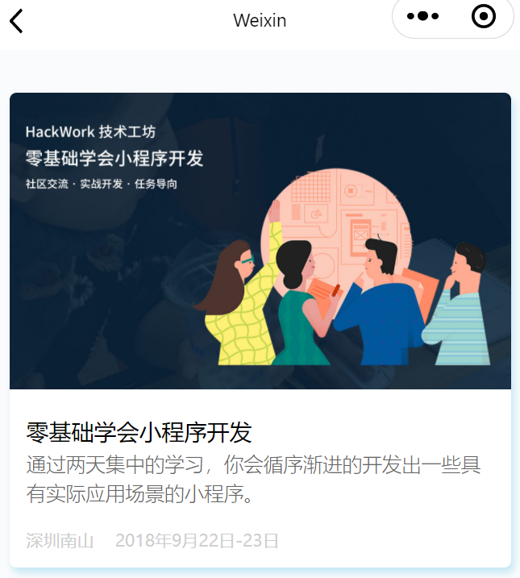
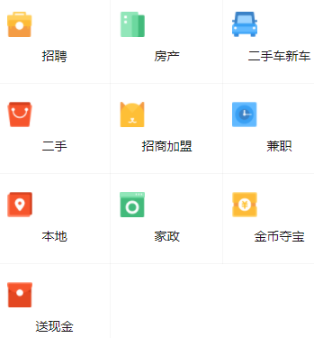

#### navigator

[navigator | 微信开放文档 (qq.com)](https://developers.weixin.qq.com/miniprogram/dev/component/navigator.html)

 

wxml

```html
<view class="event-list">

<navigator url="/pages/index/imgshow/imgshow" class="event-link">
    <view class="event-img">
        <image mode="widthFix" src="https://hackwork.oss-cn-shanghai.aliyuncs.com/lesson/weapp/4/weapp.jpg"></image>
    </view>
    <view class="event-content">
        <view class="event-title">零基础学会小程序开发</view>
        <view class="event-desc">通过两天集中的学习，你会循序渐进的开发出一些具有实际应用场景的小程序。 </view>
        <view class="event-box">
            <view class="event-address">深圳南山</view>
            <view class="event-time">2018年9月22日-23日</view>
        </view>
    </view>
</navigator>

</view>
```

wxss

```css
/* pages/index/imgshow/imgshow.wxss */
.event-list{
  background-color: #fafbfc;
  padding: 20px 0;
}

.event-link{
  margin: 10px;
  border-radius: 5px;
  background-color: #fff;
  box-shadow:5rpx 8rpx 10rpx rgba(53,178,225,0.26);
  overflow: hidden;
}

.event-img image{
  width: 100%;
}

.event-content{
  padding: 25rpx;
}

.event-title{
  line-height: 1.7em;
}

.event-desc{
  font-size: 14px;
  color: #666;
  line-height: 1.5em;
  font-weight: 300;
}

.event-box{
  margin-top: 15px;
  overflow: hidden;
 }

.event-address,.event-time{
  float: left;
  color: #cecece;
  font-size: 12px;
  padding-right: 15px;
}
```


#### 九宫格

这里主要是运用的WeUI中的grids

 

wxml

```html
<text>pages/index/grids/grids.wxml</text>
<view class="page__bd">
  <view class="weui-grids">
      <block wx:for="{{grids}}" wx:for-item="grid" wx:key="*this">
        <!-- <text>{{grid}}</text> -->
        <navigator url="" class="weui-grid" hover-class="weui-grid_active">
          <image class="weui-grid__icon" src="{{grid.imgurl}}" />
          <view class="weui-grid__label">{{grid.title}}</view>
        </navigator>
      </block>
  </view>
</view>
```


js 数据:

```js
/**
   * 页面的初始数据
   */
  data: {
    grids:[
      { imgurl:"https://hackweek.oss-cn-shanghai.aliyuncs.com/hw18/hackwork/weapp/icon1.png",
        title:"招聘"
      },
      {
        imgurl: "https://hackweek.oss-cn-shanghai.aliyuncs.com/hw18/hackwork/weapp/icon2.png",
        title: "房产"
      },
      {
        imgurl: "https://hackweek.oss-cn-shanghai.aliyuncs.com/hw18/hackwork/weapp/icon3.png",
        title: "二手车新车"
      },
      {
        imgurl: "https://hackweek.oss-cn-shanghai.aliyuncs.com/hw18/hackwork/weapp/icon4.png",
        title: "二手"
      },
      {
        imgurl: "https://hackweek.oss-cn-shanghai.aliyuncs.com/hw18/hackwork/weapp/icon5.png",
        title: "招商加盟"
      },
      {
        imgurl: "https://hackweek.oss-cn-shanghai.aliyuncs.com/hw18/hackwork/weapp/icon6.png",
        title: "兼职"
      },
      {
        imgurl: "https://hackweek.oss-cn-shanghai.aliyuncs.com/hw18/hackwork/weapp/icon7.png",
        title: "本地"
      },
      {
        imgurl: "https://hackweek.oss-cn-shanghai.aliyuncs.com/hw18/hackwork/weapp/icon8.png",
        title: "家政"
      },
      {
        imgurl: "https://hackweek.oss-cn-shanghai.aliyuncs.com/hw18/hackwork/weapp/icon9.png",
        title: "金币夺宝"
      },
      {
        imgurl: "https://hackweek.oss-cn-shanghai.aliyuncs.com/hw18/hackwork/weapp/icon10.png",
        title: "送现金"
      },
    ]
  },
```


大家就可以看到一个很多 App 界面都有的一个九宫格了。这里的九宫格是一行三列，如何让九宫格变成一行五列呢？首先我们要知道为什么这个九宫格会变成一行三列，在 weui.wxss 里给 weui-grid 定义了一个 width:33.33333333%的样式，我们可以在 home.wxss 里添加一个样式来覆盖原有的宽度。

```css
.weui-grid{
   width: 20%;
}
```


#### swiper轮播图


 具体参数: [swiper | 微信开放文档 (qq.com)](https://developers.weixin.qq.com/miniprogram/dev/component/swiper.html)


wxml:

```html
<view class="home-top">
  <view class="home-swiper">
    <swiper indicator-dots="{{indicatorDots}}" circular="{{circular}}" autoplay="{{autoplay}}" interval="{{interval}}" duration="{{duration}}" indicator-color="{{indicatorColor}}" indicator-active-color="{{activecolor}}">
      <block wx:for="{{imgUrls}}" wx:key="*this" >
        <swiper-item>
            <image src="{{item}}" style="width:100%;height:200px" class="slide-image" mode="widthFix"  />
        </swiper-item>
      </block>
    </swiper>
  </view>
</view>
```


js数据:

```js
data: {
    imgUrls: [
      'https://images.unsplash.com/photo-1551334787-21e6bd3ab135?w=640',
      'https://images.unsplash.com/photo-1551214012-84f95e060dee?w=640',
      'https://images.unsplash.com/photo-1551446591-142875a901a1?w=640'
    ],
    interval: 3000,
    duration: 1000,
    indicatorDots: true,
    indicatorColor: "#ffffff",
    activecolor:"#2971f6",
    autoplay: true,
    circular:true
  },
```


关键参数:

| 属性                     | 类型      | 默认值            | 必填 | 说明                 | 最低版本                                                     |
| :----------------------- | :-------- | :---------------- | :--- | :------------------- | :----------------------------------------------------------- |
| `indicator-dots`         | `boolean` | false             | 否   | 是否显示面板指示点   | [1.0.0](https://developers.weixin.qq.com/miniprogram/dev/framework/compatibility.html) |
| `indicator-color`        | `color`   | rgba(0, 0, 0, .3) | 否   | 指示点颜色           | [1.1.0](https://developers.weixin.qq.com/miniprogram/dev/framework/compatibility.html) |
| `indicator-active-color` | `color`   | #000000           | 否   | 当前选中的指示点颜色 | [1.1.0](https://developers.weixin.qq.com/miniprogram/dev/framework/compatibility.html) |
| `autoplay`               | `boolean` | false             | 否   | 是否自动切换         | [1.0.0](https://developers.weixin.qq.com/miniprogram/dev/framework/compatibility.html) |
| `current`                | `number`  | 0                 | 否   | 当前所在滑块的 index | [1.0.0](https://developers.weixin.qq.com/miniprogram/dev/framework/compatibility.html) |
| `interval`               | `number`  | 5000              | 否   | 自动切换时间间隔     | [1.0.0](https://developers.weixin.qq.com/miniprogram/dev/framework/compatibility.html) |
| `duration`               | `number`  | 500               | 否   | 滑动动画时长         | [1.0.0](https://developers.weixin.qq.com/miniprogram/dev/framework/compatibility.html) |
| `circular`               | `boolean` | false             | 否   | 是否采用衔接滑动     | [1.0.0](https://developers.weixin.qq.com/miniprogram/dev/framework/compatibility.html) |
| `vertical`               | `boolean` | false             | 否   | 滑动方向是否为纵向   | [1.0.0](https://developers.weixin.qq.com/miniprogram/dev/framework/compatibility.html) |

