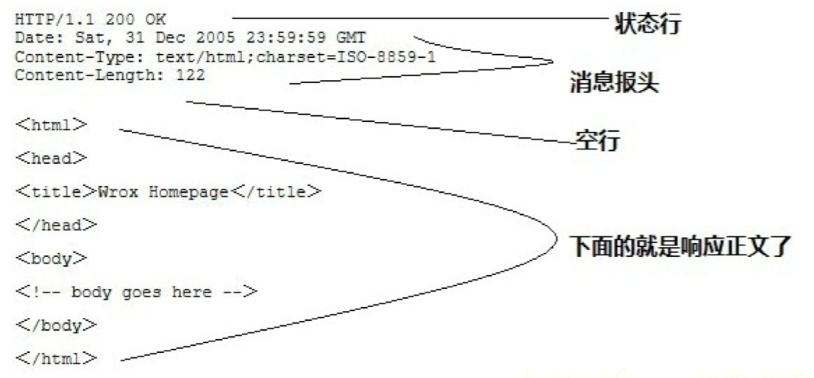
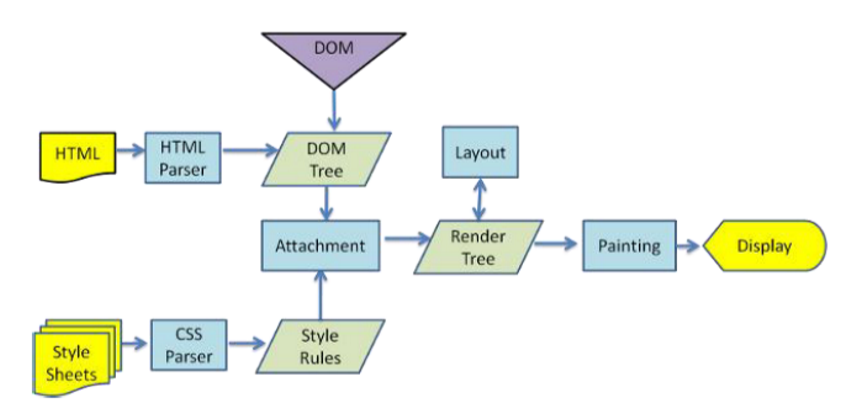
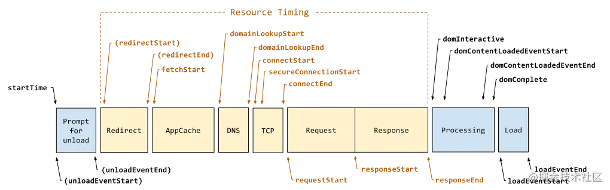
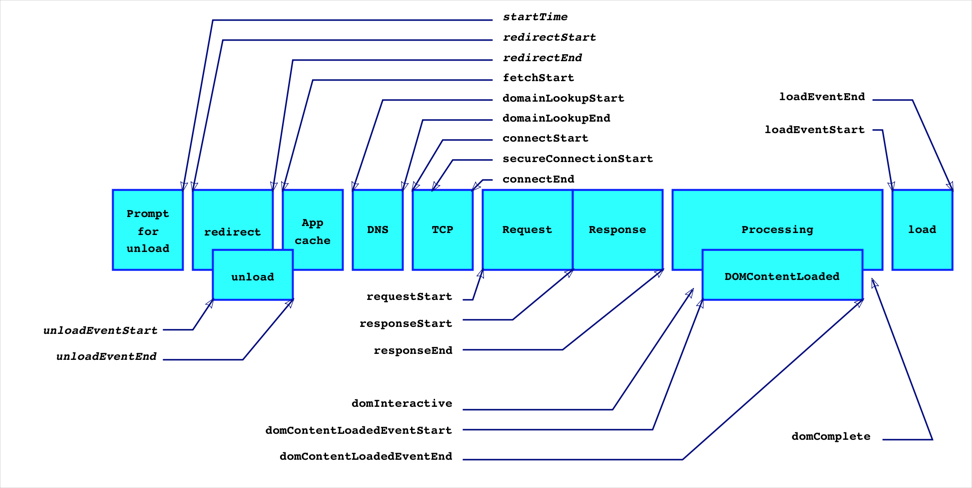
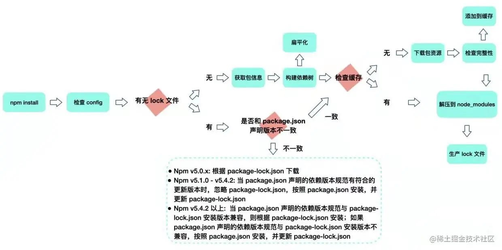

# Fall Recruit


## 项目准备


### 速看小程序


#### 简介：


一个新潮的视频播放小程序！ 主页采用了比较吸睛的大卡片展现形式 和 能够呈现更多内容的双列小卡片模式，并且会在用户点击视频后进入类似抖音的沉浸式模式来观看视频！ 而且对于连续性的视频还推出了合集的功能不用再一个个去找！ 除此之外对于用户浏览的视频还提供了历史记录的功能！

1. 大卡片+双列
2. 提供抖音的沉浸式模式观看，可上滑切换视频
3. 视频具有合集功能
4. 提供历史记录功能


#### 项目亮点


##### 1、组件化开发


本项目使用了组件化开发的思想，先对数据稿寻找共同点，并进行组件划分。在小程序 component 中新建各组件文件夹，最后进行组件代码编写，实现小程序组件化开发，增强组件复用性，提高代码可维护性。

 


##### 2、接口统一管理

本项目接口较多，并且后期可拓展性大，因此需要对接口进行统一管理，我们封装了请求的接口，用 export 进行导出，并新建了 api 文件夹，对所有请求接口地址进行管理，后续开发者可以在此添加相关接口，在页面中只需要简单导入即可使用。


请求接口封装代码：

```js
export function _post(url, params, method = 'POST') {
  return new Promise((resolve, reject) => {
    wx.cloud
      .callFunction({
        name: 'request-kp',
        data: {
          method,
          url: url,
          body: params,
          json: true,
        },
      })
      .then((data) => {
        console.log(data);
        data.data = data.result;
        resolve(data);
      })
      .catch((err) => {
        console.log(err);
        reject(err);
      });
  });
}
```


接口统一管理：

```js
import { _post } from '../utils/http';
const domain = `https://we.kandian.qq.com`
export const getData = function ({ page }) {
  const url = `${domain}/trpc.tkdwe.sk_homesvr.skHomesvr/GetFeed`;
  const data = {
    page,
    device: {
      guid: '033e89cfd83a08abcd39ac1a31b788cb',
    },
  };
  return _post(url, data);
};
```


##### 3、小亮点


* 视频支持合集
* 支持查看历史记录

* 采用了骨架屏，优化用户体验！


 


* 设计方面主页视频形式呈现多样，有大卡片的轮播图呈现形式，也有双列的模式


##### 4、性能优化


（1）使用 globalData 管理数据

globalData 类似于 vuex，可以对数据进行管理，由于小程序页面跳转无法传过多参数，使用 storage 进行页面传值又比较损耗性能，因此可以使用 globalData。


（2）使用 diff 方法优化 setdata

小程序频繁使用 setdata 会影响性能，因此要采用一种高性能的方法对 setdata 进行优化，在本项目中使用 diff 库。


why？


**★工作原理**


小程序的视图层目前使用 WebView 作为渲染载体，而逻辑层是由独立的 JavascriptCore 作为运行环境。在架构上，WebView 和 JavascriptCore 都是独立的模块，并不具备数据直接共享的通道。当前，视图层和逻辑层的数据传输，实际上通过两边提供的 `evaluateJavascript` 所实现。即用户传输的数据，需要将其转换为字符串形式传递，同时把转换后的数据内容拼接成一份 JS 脚本，再通过执行 JS 脚本的形式传递到两边独立环境。

而 `evaluateJavascript` 的执行会受很多方面的影响，数据到达视图层并不是实时的。


常见的 setData 操作错误

**1. 频繁的去 setData**

在我们分析过的一些案例里，部分小程序会非常频繁（毫秒级）的去`setData`，其导致了两个后果：

- Android 下用户在滑动时会感觉到卡顿，操作反馈延迟严重，因为 JS 线程一直在编译执行渲染，未能及时将用户操作事件传递到逻辑层，逻辑层亦无法及时将操作处理结果及时传递到视图层；
- 渲染有出现延时，由于 WebView 的 JS 线程一直处于忙碌状态，逻辑层到页面层的通信耗时上升，视图层收到的数据消息时距离发出时间已经过去了几百毫秒，渲染的结果并不实时；


**2. 每次 setData 都传递大量新数据**

由`setData`的底层实现可知，我们的数据传输实际是一次 `evaluateJavascript` 脚本过程，当数据量过大时会增加脚本的编译执行时间，占用 WebView JS 线程，


**3. 后台态页面进行 setData**

当页面进入后台态（用户不可见），不应该继续去进行`setData`，后台态页面的渲染用户是无法感受的，另外后台态页面去`setData`也会抢占前台页面的执行。


more：

[解剖小程序的 setData | 微信开放社区 (qq.com)](https://developers.weixin.qq.com/community/develop/article/doc/0000ca002001c023aa3b71e3356013)


（3）图片部分采用 base64

较小的图片可以转化成 base64，并且统一写到一个文件里。可以减少网络请求，提升页面性能。在本项目中，对较小的图片进行 base64 转化，可见于 images 文件夹下的 index.js 和 play.js 文件。


#### 关于数据： 

💎feed流数据： 轮播图+ 速看好剧 + （每日速看精选 + 最新美剧速看 + 最新韩剧速看 + 海外新热大片速看） 这后面四个后端没提供。。但有做分类的

feed流数据同时也是下拉更新的数据


💎上拉数据feedData： 在最下面，拉到底部后会刷新！随机给出一定数量的影视数据


★this.data中的feedData就是除轮播图外的视频数据，我们每次在刷新重新获取时会进行diff再来setData


##### 轮播图：


##### this.data:


this.feedDataList


#### 代码分析


代码结构：

 


##### components


[Component(Object object) | 微信开放文档 (qq.com)](https://developers.weixin.qq.com/miniprogram/dev/reference/api/Component.html)

可复用的组件

| 定义段     | 类型       | 是否必填 | 描述                                                         | 最低版本                                                     |
| :--------- | :--------- | :------- | :----------------------------------------------------------- | :----------------------------------------------------------- |
| properties | Object Map | 否       | 组件的对外属性，是属性名到属性设置的映射表                   |                                                              |
| data       | Object     | 否       | 组件的内部数据，和 `properties` 一同用于组件的模板渲染       |                                                              |
| observers  | Object     | 否       | 组件数据字段监听器，用于监听 properties 和 data 的变化，参见 [数据监听器](https://developers.weixin.qq.com/miniprogram/dev/framework/custom-component/observer.html) | [2.6.1](https://developers.weixin.qq.com/miniprogram/dev/framework/compatibility.html) |
| methods    | Object     | 否       | 组件的方法，包括事件响应函数和任意的自定义方法，关于事件响应函数的使用，参见 [组件间通信与事件](https://developers.weixin.qq.com/miniprogram/dev/framework/custom-component/events.html) |                                                              |


properties 定义

| 定义段        | 类型     | 是否必填 | 描述                       | 最低版本                                                     |
| :------------ | :------- | :------- | :------------------------- | :----------------------------------------------------------- |
| type          |          | 是       | 属性的类型                 |                                                              |
| optionalTypes | Array    | 否       | 属性的类型（可以指定多个） | [2.6.5](https://developers.weixin.qq.com/miniprogram/dev/framework/compatibility.html) |
| value         |          | 否       | 属性的初始值               |                                                              |
| observer      | Function | 否       | 属性值变化时的回调函数     |                                                              |


暂时了解这么多


###### 轮播图模块


牵涉到的组件有：

 


* title ： 标题会有进度标签，表示当前是第几个轮播图！ 这里其实还用到了 progressBar组件，有一个进度条代表当前的进度（黄色表示当前的进度位置，不过现在后端没给数据，暂时只有一张图！） 除此之外还有数字来显示进度！

* progressBar：title上的进度条

* slider： 轮播图组件


获取到的轮播图数据：

1. collection: {id: "", cover: {…}, poster: {…}, score: 7.9, videoCovers: Array(0), …}

2. meta: {rowkey: "3145ffe74af470ah", pageUrl: "qb://ext/rn?module=vidadetail&component=vidadetail…rowkey=3145ffe74af470ah&sceneId=&stamp=1628763847"}

3. style: {backgroundColor: "", borderColor: ""}

4. type: undefined

5. video: {type: 2, url: "http://shortv.cdp.qq.com/szg_1966_50001_0bf2zqacia…ac1a31b788cb&vid=w32202h4rc4&device=HUAWEI+P7-L09", cover: {…}, title: "《疯狂原始人2》家中男人被巨兽抓走，女人们组成雷霆狂花前来营救", duration: 599, …}

   


如何在跳转时获取对应的视频信息？🤔

我们通过 dataset 属性给每个视频item都赋予了其属性，当点击时相应的视频信息也会传递过去！


★pages/index中 轮播关键的方法：

```js
// 接受轮播图传过来的进度信息
onPercent(data) {
  this.setData({
    percent: data.detail.value,
    pageTotal: data.detail.pageTotal,
  });
},
```

percent： 轮播图进度的百分数

pageTotal：轮播图的数量


**▼slider：**


这里采用的是scroll-view组件包裹

```html
<scroll-view class="scroll-view_H" 
	scroll-x="true" 
  style="width: 100%" 
  bindscroll="scroll" 
  enhanced>
</scroll-view>
```


scroll-x表示允许横向滚动

bindscroll是在滚动时触发的一个事件：滚动时触发，event.detail = {scrollLeft, scrollTop, scrollHeight, scrollWidth, deltaX, deltaY}


**slider如何监听进度变化？**


首先通过 bindscroll 这个监听事件的方法来知道滚动到了第几个轮播图！ <span style='color:red;'>还贴心的加上了防抖debounce！</span>

```js
scroll(e) {
  // 自己写的防抖
  if (this.data.isScoll === true) {
    clearTimeout(this.data.timer);
  }
  this.data.isScoll = true;
  this.data.timer = setTimeout(() => {
    const value = Math.floor((e.detail.scrollLeft / (240 * this.data.sliderData.length)) * 100);
    this.triggerEvent(
      'onPercent',
      {
        value,
        pageTotal: this.data.sliderData.length,
      },
      {},
    );
    this.data.isScoll = false;
  }, 10);
},
```


* 为什么这里的 value 最后要乘上 100？ 因为 progressBar的参数percent是百分数，值为0～100，相当于 percent%
* triggerEvent就是子组件向父组件通信，在子组件中触发父组件中定义的事件！ 这是因为是在父组件中还需要把percent值用于title组件！


```js
observers: {
  // 用于初始的时候赋值
  sliderData() {
    this.triggerEvent(
      'onPercent',
      {
        value: 0,
        pageTotal: this.data.sliderData.length,
      },
      {},
    );
  },
},
```

observers类似于vue中的计算属性，不过在这里监听slideData主要用于 value和pageTotal的初始化！


##### 播放页


pages/play/play

⭐️学一下 Swiper组件！


★关于 swiper 切换缓动动画类型

这里我测试了官方给的几种值： default，linear，easeInCubic，easeOutCubic，easeInOutCubic


最后与抖音的体验作对比，发现体验效果最好的是 easeOutCubic。因为我们想切换视频的时候是想快点离开前一个视频然后进入下一个视频的！ 其实还可以自己写三次贝塞尔函数来进行优化的，不过★不提供！


###### ▼点击进入视频页


* 从app.globalData得到的pageInfo

大致如下：


```js
const obj = {
  rowkey: data.rowkey,
  title: data.CardMessage,
  movie: data.movie,
  collectionId: data.collectionId,
  cover: data.bgImgSrc,
  authorName: data.authorName,
  url: data.videoSrc,
};
```


⭐️onload阶段


1. 通过app.globalData得到的pageInfo

2. getFeedList向后端请求视频数据： 在  ==res.data.result.feedData== 中
   

   这里的这个数据是获得接下来⬆️滑的视频列表

3. 接着会根据 rowKey和collectionid获取合集数据（如果有会返回合集数据，没有的话就返回当前食品的数据）

4. 然后我们会通过 createVideoContext 获取每个视频的id，然后播放视频列表的第一个视频并对其余所有视频进行stop操作


###### ▼关于视频播放


如何控制每个视频？

通过给每个 video 标签设置id，然后通过这个id来进行每个video的操作！  因为 swiper组件有个current属性，我们可以通过这个current判断滑倒第几个视频！然后设置视频的id，从而进行操控


遇到的bug：


🧐很容易多个视频同时播放❓

搞了很久，最后采用每播放一个视频就再次获取视频的context然后对其他视频进行stop操作！

比如说我们绑定的一个 change 函数（就是swiper中切换item）

```js
wx.createVideoContext(`myVideo${curPage - 1}`).stop();
wx.createVideoContext(`myVideo${curPage}`).play();
wx.createVideoContext(`myVideo${curPage + 1}`).stop();
```


我们在 onload和change时都会调用云函数  onTouchingVideo，这个云函数会查询用户对当前视频的点赞记录还会将当前视频存入历史记录！


###### ▼关于合集


这里专门设置了一个变量 showList 来控制合集的显示，每个视频会有合集的标识，如果是的话则会显示合集标识在左下角：

 


其实这里所有组件在合集时的变化都是通过 showList这一个变量来实现的，点击下方的合集showList自动为true，然后各个组件的class相应变化就会变出合集页了

 


那么我们是如何实现常用的点击视频自动回到正常的播放页呢？ 我们在这个视频的view上加了一个点击函数点击就会自动将showList设置为false！


#### 展示


##### 图片


###### 首页

 


 


###### 历史记录

 


###### 视频播放页

 


###### 合集

 


 

##### 视频


###### 轮播图


<video src="../slider.mp4" height='600px'></video>


###### 历史记录


<video src="../history.mp4" height='600px'></video>


###### 首页

<video src="../Feeds.mp4" height='600px'></video>


###### 合集


<video src="../collections.mp4" height='600px'></video>


## 面试题库


字节


## Preview


### WXG二面


#### 一面复习


##### 1.输入url到页面展示


一、输入地址

浏览器其实就已经在智能的匹配可能得 url 了，他会从历史记录，书签等地方，找到已经输入的字符串可能对应的 url，然后给出智能提示，让你可以补全url地址。


二、DNS解析

DNS(Domain Name System)服务是和HTTP协议一样位于**应用层**的协议。它提供域名到IP地址之间的解析。用户通常使用主机名或域名来访问对方的计算机，而不是通过IP地址访问。


1. 浏览器缓存；
2. 本机中的hosts文件；
3. 路由器缓存；
4. ISP DNS缓存；
5. DNS递归查询（本地DNS服务器 -> 权限DNS服务器 -> 顶级DNS服务器 -> 13台根DNS服务器）


三、TCP连接


三次握手、四次挥手


* 建立了TCP连接之后，在应用层，浏览器会分析这个url，发起一个http请求。


四、服务器处理请求


五、返回响应结果


HTTP响应也由四个部分组成，分别是：**状态行、消息报头、空行和响应正文**。

 


七、浏览器显示内容


1. 解析HTML，构建 DOM 树
2. 解析 CSS ，生成 CSS 规则树
3. 合并 DOM 树和 CSS 规则，生成     render 树
4. 布局 render 树（ Layout     / reflow ），负责各元素尺寸、位置的计算
5. 绘制 render 树（ paint     ），绘制页面像素信息
6. 浏览器会将各层的信息发送给     GPU，GPU 会将各层合成（ composite ），显示在屏幕上

 


##### 2.浏览器缓存


强缓存、协商缓存


##### 3.前端如何判断用户登录态

参考：[前端er应该懂的登录态：Cookie、Session和Token - 掘金 (juejin.cn)](https://juejin.cn/post/6844903844942446600)


* 设置cookie

  把凭证存储到`cookie`中，每次浏览器的请求会自动带上`cookie`里的凭证，方便服务端校验

  具体的做法是通过 cookie 做的，也就是我们在登录页登录后，由后端返回一个带有 Set-Cookie 的返回头来种 cookie。那么在 cookie 失效前，发 Ajax 请求都是会自动带有这个 cookie 的，这时后端就能进行判断。

  一旦这个 cookie 失效，后端在请求返回时应该用某种方式告诉前端，符合 HTTP 规范的做法是返回一个 401 状态码，这个时候前端通过拦截器（如 axios 的 interceptor）进行统一处理，跳转到登录页。


🚨risk：但是这样面临的问题是：用户本人可以通过修改`document.cookie="isLogin = true"`伪造登陆凭证


* session

  `session`本意是指客户端与服务器的会话状态，由于凭证存储到了服务端，后来也把这些存在服务端的信息称为`session`。

  现在服务器决定自己维护登录状态，仅发给客户端一个`key`，然后在自己维护一个`key-value`表，如果请求中有`key`，并且在表中可以找到对应的`value`，则视为合法：

  浏览器像服务器发起login请求，服务器向浏览器返回sessionId。这样即使客户端自行修改了sessionId，但在服务器没有记录，因此也无法获取数据


🚨：`session`是一个好的解决方案，但是他的问题是：如果存在多个服务器如负载均衡时，每个服务器的状态表**必须**同步，或者抽离出来统一管理，如使用`Redis`等服务。


* token

  和`HTTPS`一样，我们可以使用签名的方式帮助服务器校验凭证。

  JSON Web Token（简称JWT）`是以`JSON`格式存储信息的`Token。`JWT`由3部分构成：头部，负载和签名。

  使用`JWT`维护登陆态，服务器不再需要维护状态表，他仅给客户端发送一个加密的数据`token`，每次请求都带上这个加密的数据，再解密验证是否合法即可。由于是加密的数据，即使用户可以修改，命中几率也很小。


##### 4.前端监控

[一篇讲透自研的前端错误监控 - 掘金 (juejin.cn)](https://juejin.cn/post/6987681953424080926#heading-1)

[搭建前端监控系统 · 语雀 (yuque.com)](https://www.yuque.com/xianjs/eg7dq1/vgeqbw#LPGZC)


简易版：

​	1）重写window.onerror 方法， 大家熟知，监控JS错误必然离不开它，有人对他进行了测试[测试介绍](https://link.zhihu.com/?target=https%3A//segmentfault.com/a/1190000011041164)感觉也是比较用心了

　2）重写console.error方法，为什么要重写这个方法，我不能够给出明确的答案，如果App首次向浏览器注入的Js代码报错了，window.onerror是无法监控到的，所以只能重写console.error的方式来进行捕获，也许会有更好的办法。待window.onerror成功后，此方法便不再需要用了

　3）重写window.onunhandledrejection方法。 当你用到Promise的时候，而你又忘记写reject的捕获方法的时候，系统总是会抛出一个叫 Unhandled Promise rejection. 没有堆栈，没有其他信息，特别是在写fetch请求的时候很容易发生。 所以我们需要重写这个方法，以帮助我们监控此类错误


这里包括错误和性能的监控


搜集上报端，采集聚合端，可视分析端，监控告警端。


###### 如何搜集错误？


**try/catch**

> 能捕获常规运行时错误，语法错误和异步错误不行


try/catch有它细致处理的优势，但缺点也比较明显。


**window.onerror**

>pure js错误收集，window.onerror，当 JS 运行时错误发生时，window 会触发一个 ErrorEvent 接口的 error 事件。


```js
// 常规运行时错误，可以捕获 ✅
window.onerror = function(message, source, lineno, colno, error) {
  console.log('捕获到异常：',{message, source, lineno, colno, error});
}
console.log(notdefined);

// 语法错误，不能捕获 ❌
window.onerror = function(message, source, lineno, colno, error) {
  console.log('捕获到异常：',{message, source, lineno, colno, error});
}
const notdefined,
      
// 异步错误，可以捕获 ✅
window.onerror = function(message, source, lineno, colno, error) {
  console.log('捕获到异常：',{message, source, lineno, colno, error});
}
setTimeout(() => {
  console.log(notdefined);
}, 0)

```

```html
// 资源错误，不能捕获 ❌
<script>
  window.onerror = function(message, source, lineno, colno, error) {
  console.log('捕获到异常：',{message, source, lineno, colno, error});
  return true;
}
</script>

```


window.onerror捕获不到SyntxError，一般SyntaxError在构建阶段，甚至本地开发阶段就会被发现。同时也无法捕捉到资源错误


**window.addEventListener**

> 当一项资源（如图片或脚本）加载失败，加载资源的元素会触发一个 Event 接口的 error 事件，这些 error 事件不会向上冒泡到 window，但能被捕获。而window.onerror不能监测捕获。


图片、script、css加载错误，都能被捕获 ✅

fetch错误，不能捕获 ❌


如何捕捉promise错误？


1. 普通Promise错误  .catch()


2. async错误  需要通过await

```js
try {
    // 需要await，才能捕获到
    await makeRequest()
} catch(err) {
    console.error('in try catch', err)
}
```


###### 性能监控


[Performance — 前端性能监控利器 · 语雀 (yuque.com)](https://www.yuque.com/xianjs/eg7dq1/ox30n5#getentries)

[5 分钟撸一个前端性能监控工具 - 掘金 (juejin.cn)](https://juejin.cn/post/6844903662020460552)

通过这个API能得到很多的时间计算：

DNS查询耗时 ：domainLookupEnd - domainLookupStart

TCP链接耗时 ：connectEnd - connectStart

request请求耗时 ：responseEnd - responseStart

解析dom树耗时 ： domComplete - domInteractive

白屏时间 ：responseStart - navigationStart

domready时间(用户可操作时间节点) ：domContentLoadedEventEnd - navigationStart

onload时间(总下载时间) ：loadEventEnd - navigationStart


**▼页面加载**

有关页面加载的性能指标，可以在 `Navigation Timing` 中找到。`Navigation Timing` 包括了从请求页面起，到页面完成加载为止，各个环节的时间明细。

可以通过以下方式获取 `Navigation Timing` 的具体内容：





既然我们关注的是页面加载，那自然要读取 `domComplete`:

```js
const [{ domComplete }] = performance.getEntriesByType('navigation')
```

定义个方法，获取 `domComplete`：

```js
pMonitor.getLoadTime = () => {
  const [{ domComplete }] = performance.getEntriesByType('navigation')
  return domComplete
}
```


**▼资源加载**

获取资源加载时间的关键字为 `'resource'`, 具体方式如下：

```js
performance.getEntriesByType('resource')
```

我们关注的是资源加载的耗时情况，可以通过如下形式获得

```js
const [{ startTime, responseEnd }] = performance.getEntriesByType('resource')
const loadTime = responseEnd - startTime
```


调用

如果想追（吹）求（毛）极（求）致（疵）的话，在页面加载时，监测工具不应该占用主线程的 JavaScript 解析时间。因此，最好在页面触发 `onload` 事件后，采用异步加载的方式：


###### 5.node_modules的依赖


CommonJS 输入的是被输出值的拷贝，不是引用。

**CommonJS**如果遇到了循环引用**,** **就会只采用已执行的部分**, **未执行的部分不会采纳**!


ES6 modules import导入的是一个引用，因此会在执行的时候去找到


对比：

```js
// even.js
import { odd } from './odd'
export var counter = 0;
export function even(n) {
  counter++;
  return n === 0 || odd(n - 1);
}

// odd.js
import { even } from './even';
export function odd(n) {
  return n !== 0 && even(n - 1);
}

// run
import * as m from './even.js';
m.even(10)
```

从even.js到odd.js时，even.js的even并非undefined，由于函数有提升作用，在执行<span style='color:blue;'>import { odd } from './odd'</span>时，even已经有定义了！因此odd.js中加载时不会报错！

由于是引用值，因此我们在 odd() 中调用even()是会去找到even.js中的even方法！


但是在commonJS中这就行不通，因为是拷贝值。

even.js加载odd.js，而odd.js又去加载even.js，形成“循环加载”。这时，执行引擎就会输出even.js已经执行的部分（不存在任何结果），所以在odd.js之中，变量even等于undefined，等到后面调用even(n - 1)就会报错。


##### 6.npm install 后会发生什么





构建依赖树时，不管是直接依赖还是子依赖，都会按照扁平化的原则，优先将其放置在 `node_modules` 根目录中(最新的npm规范), 在这个过程中，如果遇到相同的模块，会检查已放置在依赖树中的模块是否符合新模块的版本范围，如果符合，则跳过，不符合，则在当前模块的 `node_modules` 下放置新模块。


