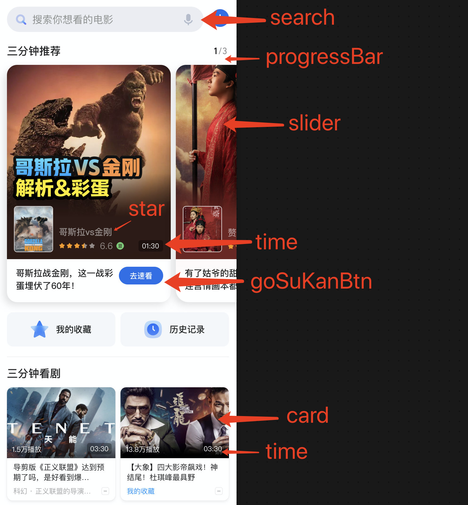
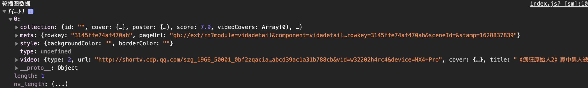
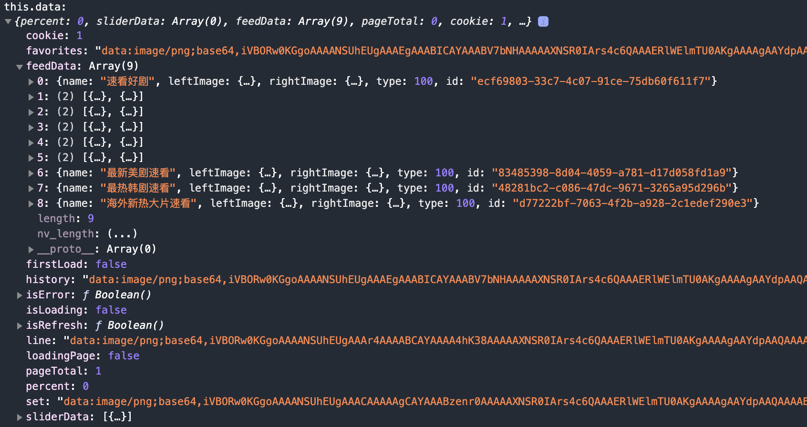
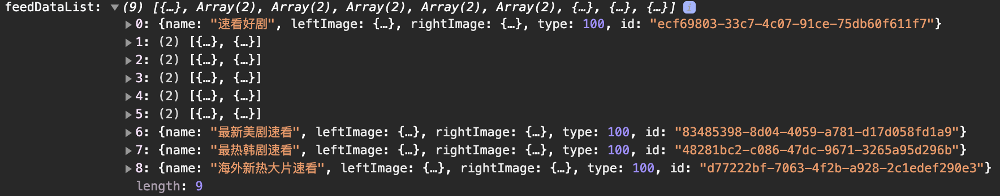
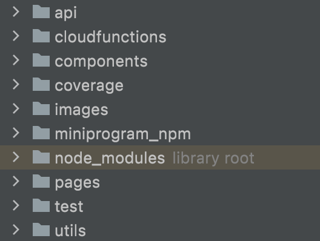
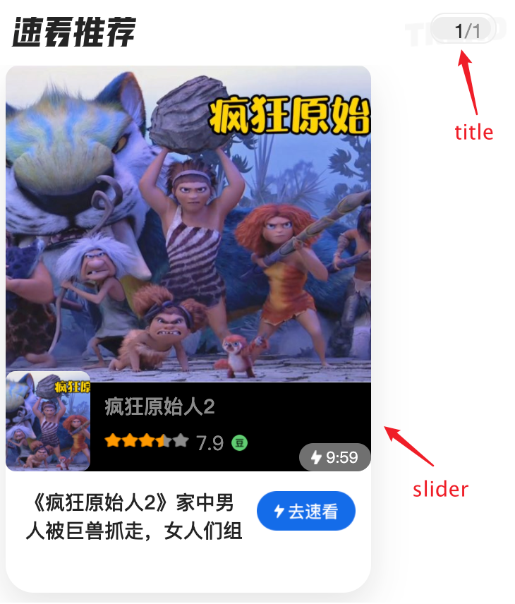
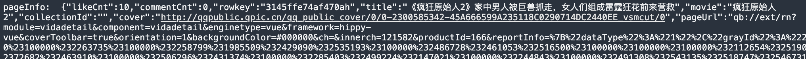
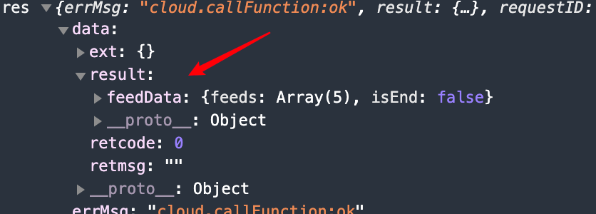
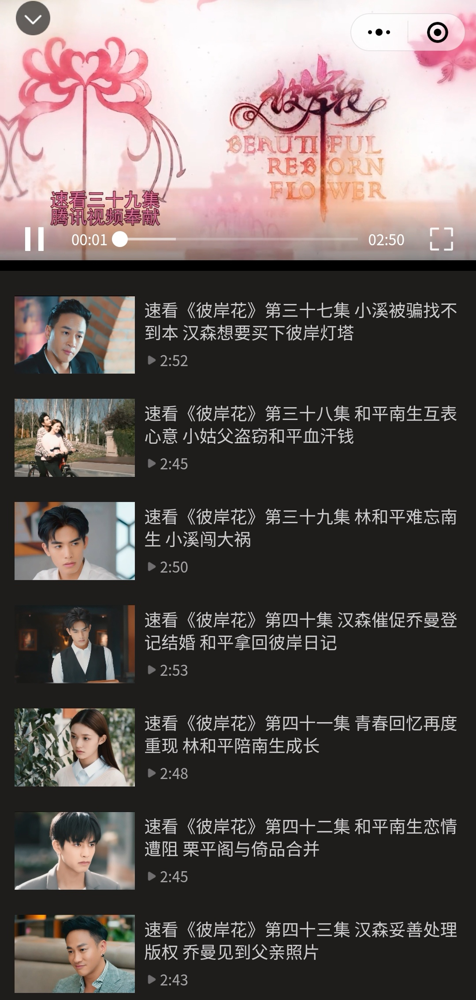

# Fall Recruit


## 项目准备


### 速看小程序


#### 简介：


一个新潮的视频播放小程序！ 主页采用了比较吸睛的大卡片展现形式 和 能够呈现更多内容的双列小卡片模式，并且会在用户点击视频后进入类似抖音的沉浸式模式来观看视频！ 而且对于连续性的视频还推出了合集的功能不用再一个个去找！ 除此之外对于用户浏览的视频还提供了历史记录的功能！

1. 大卡片+双列
2. 提供抖音的沉浸式模式观看，可上滑切换视频
3. 视频具有合集功能
4. 提供历史记录功能


#### 项目亮点


##### 1、组件化开发


本项目使用了组件化开发的思想，先对数据稿寻找共同点，并进行组件划分。在小程序 component 中新建各组件文件夹，最后进行组件代码编写，实现小程序组件化开发，增强组件复用性，提高代码可维护性。

 


##### 2、接口统一管理

本项目接口较多，并且后期可拓展性大，因此需要对接口进行统一管理，我们封装了请求的接口，用 export 进行导出，并新建了 api 文件夹，对所有请求接口地址进行管理，后续开发者可以在此添加相关接口，在页面中只需要简单导入即可使用。


请求接口封装代码：

```js
export function _post(url, params, method = 'POST') {
  return new Promise((resolve, reject) => {
    wx.cloud
      .callFunction({
        name: 'request-kp',
        data: {
          method,
          url: url,
          body: params,
          json: true,
        },
      })
      .then((data) => {
        console.log(data);
        data.data = data.result;
        resolve(data);
      })
      .catch((err) => {
        console.log(err);
        reject(err);
      });
  });
}
```


接口统一管理：

```js
import { _post } from '../utils/http';
const domain = `https://we.kandian.qq.com`
export const getData = function ({ page }) {
  const url = `${domain}/trpc.tkdwe.sk_homesvr.skHomesvr/GetFeed`;
  const data = {
    page,
    device: {
      guid: '033e89cfd83a08abcd39ac1a31b788cb',
    },
  };
  return _post(url, data);
};
```


##### 3、小亮点


* 视频支持合集
* 支持查看历史记录

* 采用了骨架屏，优化用户体验！

（虽然这是靠wx自动生成的配置，不过没问可以不说！）

 


* 设计方面主页视频形式呈现多样，有大卡片的轮播图呈现形式，也有双列的模式


##### 4、性能优化


（1）使用 globalData 管理数据

globalData 类似于 vuex，可以对数据进行管理，由于小程序页面跳转无法传过多参数，使用 storage 进行页面传值又比较损耗性能，因此可以使用 globalData。


（2）使用 diff 方法优化 setdata

小程序频繁使用 setdata 会影响性能，因此要采用一种高性能的方法对 setdata 进行优化，在本项目中使用 diff 库。


why？


**★工作原理**


小程序的视图层目前使用 WebView 作为渲染载体，而逻辑层是由独立的 JavascriptCore 作为运行环境。在架构上，WebView 和 JavascriptCore 都是独立的模块，并不具备数据直接共享的通道。当前，视图层和逻辑层的数据传输，实际上通过两边提供的 `evaluateJavascript` 所实现。即用户传输的数据，需要将其转换为字符串形式传递，同时把转换后的数据内容拼接成一份 JS 脚本，再通过执行 JS 脚本的形式传递到两边独立环境。

而 `evaluateJavascript` 的执行会受很多方面的影响，数据到达视图层并不是实时的。


常见的 setData 操作错误

**1. 频繁的去 setData**

在我们分析过的一些案例里，部分小程序会非常频繁（毫秒级）的去`setData`，其导致了两个后果：

- Android 下用户在滑动时会感觉到卡顿，操作反馈延迟严重，因为 JS 线程一直在编译执行渲染，未能及时将用户操作事件传递到逻辑层，逻辑层亦无法及时将操作处理结果及时传递到视图层；
- 渲染有出现延时，由于 WebView 的 JS 线程一直处于忙碌状态，逻辑层到页面层的通信耗时上升，视图层收到的数据消息时距离发出时间已经过去了几百毫秒，渲染的结果并不实时；


**2. 每次 setData 都传递大量新数据**

由`setData`的底层实现可知，我们的数据传输实际是一次 `evaluateJavascript` 脚本过程，当数据量过大时会增加脚本的编译执行时间，占用 WebView JS 线程，


**3. 后台态页面进行 setData**

当页面进入后台态（用户不可见），不应该继续去进行`setData`，后台态页面的渲染用户是无法感受的，另外后台态页面去`setData`也会抢占前台页面的执行。


more：

[解剖小程序的 setData | 微信开放社区 (qq.com)](https://developers.weixin.qq.com/community/develop/article/doc/0000ca002001c023aa3b71e3356013)


（3）图片部分采用 base64

较小的图片可以转化成 base64，并且统一写到一个文件里。可以减少网络请求，提升页面性能。在本项目中，对较小的图片进行 base64 转化，可见于 images 文件夹下的 index.js 和 play.js 文件。


#### 关于数据： 

💎feed流数据： 轮播图+ 速看好剧 + （每日速看精选 + 最新美剧速看 + 最新韩剧速看 + 海外新热大片速看） 这后面四个后端没提供。。但有做分类的

feed流数据同时也是下拉更新的数据


💎上拉数据feedData： 在最下面，拉到底部后会刷新！随机给出一定数量的影视数据


★this.data中的feedData就是除轮播图外的视频数据，我们每次在刷新重新获取时会进行diff再来setData


##### 轮播图：




##### this.data:




this.feedDataList




#### 代码分析


代码结构：

 


##### components


[Component(Object object) | 微信开放文档 (qq.com)](https://developers.weixin.qq.com/miniprogram/dev/reference/api/Component.html)

可复用的组件

| 定义段     | 类型       | 是否必填 | 描述                                                         | 最低版本                                                     |
| :--------- | :--------- | :------- | :----------------------------------------------------------- | :----------------------------------------------------------- |
| properties | Object Map | 否       | 组件的对外属性，是属性名到属性设置的映射表                   |                                                              |
| data       | Object     | 否       | 组件的内部数据，和 `properties` 一同用于组件的模板渲染       |                                                              |
| observers  | Object     | 否       | 组件数据字段监听器，用于监听 properties 和 data 的变化，参见 [数据监听器](https://developers.weixin.qq.com/miniprogram/dev/framework/custom-component/observer.html) | [2.6.1](https://developers.weixin.qq.com/miniprogram/dev/framework/compatibility.html) |
| methods    | Object     | 否       | 组件的方法，包括事件响应函数和任意的自定义方法，关于事件响应函数的使用，参见 [组件间通信与事件](https://developers.weixin.qq.com/miniprogram/dev/framework/custom-component/events.html) |                                                              |


properties 定义

| 定义段        | 类型     | 是否必填 | 描述                       | 最低版本                                                     |
| :------------ | :------- | :------- | :------------------------- | :----------------------------------------------------------- |
| type          |          | 是       | 属性的类型                 |                                                              |
| optionalTypes | Array    | 否       | 属性的类型（可以指定多个） | [2.6.5](https://developers.weixin.qq.com/miniprogram/dev/framework/compatibility.html) |
| value         |          | 否       | 属性的初始值               |                                                              |
| observer      | Function | 否       | 属性值变化时的回调函数     |                                                              |


暂时了解这么多


###### 轮播图模块


牵涉到的组件有：

 


* title ： 标题会有进度标签，表示当前是第几个轮播图！ 这里其实还用到了 progressBar组件，有一个进度条代表当前的进度（黄色表示当前的进度位置，不过现在后端没给数据，暂时只有一张图！） 除此之外还有数字来显示进度！

* progressBar：title上的进度条

* slider： 轮播图组件


获取到的轮播图数据：

1. collection: {id: "", cover: {…}, poster: {…}, score: 7.9, videoCovers: Array(0), …}

2. meta: {rowkey: "3145ffe74af470ah", pageUrl: "qb://ext/rn?module=vidadetail&component=vidadetail…rowkey=3145ffe74af470ah&sceneId=&stamp=1628763847"}

3. style: {backgroundColor: "", borderColor: ""}

4. type: undefined

5. video: {type: 2, url: "http://shortv.cdp.qq.com/szg_1966_50001_0bf2zqacia…ac1a31b788cb&vid=w32202h4rc4&device=HUAWEI+P7-L09", cover: {…}, title: "《疯狂原始人2》家中男人被巨兽抓走，女人们组成雷霆狂花前来营救", duration: 599, …}

   


如何在跳转时获取对应的视频信息？🤔

我们通过 dataset 属性给每个视频item都赋予了其属性，当点击时相应的视频信息也会传递过去！


★pages/index中 轮播关键的方法：

```js
// 接受轮播图传过来的进度信息
onPercent(data) {
  this.setData({
    percent: data.detail.value,
    pageTotal: data.detail.pageTotal,
  });
},
```

percent： 轮播图进度的百分数

pageTotal：轮播图的数量


**▼slider：**


这里采用的是scroll-view组件包裹

```html
<scroll-view class="scroll-view_H" 
	scroll-x="true" 
  style="width: 100%" 
  bindscroll="scroll" 
  enhanced>
</scroll-view>
```


scroll-x表示允许横向滚动

bindscroll是在滚动时触发的一个事件：滚动时触发，event.detail = {scrollLeft, scrollTop, scrollHeight, scrollWidth, deltaX, deltaY}


**slider如何监听进度变化？**


首先通过 bindscroll 这个监听事件的方法来知道滚动到了第几个轮播图！ <span style='color:red;'>还贴心的加上了防抖debounce！</span>

```js
scroll(e) {
  // 自己写的防抖
  if (this.data.isScoll === true) {
    clearTimeout(this.data.timer);
  }
  this.data.isScoll = true;
  this.data.timer = setTimeout(() => {
    const value = Math.floor((e.detail.scrollLeft / (240 * this.data.sliderData.length)) * 100);
    this.triggerEvent(
      'onPercent',
      {
        value,
        pageTotal: this.data.sliderData.length,
      },
      {},
    );
    this.data.isScoll = false;
  }, 10);
},
```


* 为什么这里的 value 最后要乘上 100？ 因为 progressBar的参数percent是百分数，值为0～100，相当于 percent%
* triggerEvent就是子组件向父组件通信，在子组件中触发父组件中定义的事件！ 这是因为是在父组件中还需要把percent值用于title组件！


```js
observers: {
  // 用于初始的时候赋值
  sliderData() {
    this.triggerEvent(
      'onPercent',
      {
        value: 0,
        pageTotal: this.data.sliderData.length,
      },
      {},
    );
  },
},
```

observers类似于vue中的计算属性，不过在这里监听slideData主要用于 value和pageTotal的初始化！


##### 播放页


pages/play/play

⭐️学一下 Swiper组件！


★关于 swiper 切换缓动动画类型

这里我测试了官方给的几种值： default，linear，easeInCubic，easeOutCubic，easeInOutCubic


最后与抖音的体验作对比，发现体验效果最好的是 easeOutCubic。因为我们想切换视频的时候是想快点离开前一个视频然后进入下一个视频的！ 其实还可以自己写三次贝塞尔函数来进行优化的，不过★不提供！


###### ▼点击进入视频页


* 从app.globalData得到的pageInfo

大致如下：



```js
const obj = {
  rowkey: data.rowkey,
  title: data.CardMessage,
  movie: data.movie,
  collectionId: data.collectionId,
  cover: data.bgImgSrc,
  authorName: data.authorName,
  url: data.videoSrc,
};
```


⭐️onload阶段


1. 通过app.globalData得到的pageInfo

2. getFeedList向后端请求视频数据： 在  ==res.data.result.feedData== 中
   

   这里的这个数据是获得接下来⬆️滑的视频列表

3. 接着会根据 rowKey和collectionid获取合集数据（如果有会返回合集数据，没有的话就返回当前食品的数据）

4. 然后我们会通过 createVideoContext 获取每个视频的id，然后播放视频列表的第一个视频并对其余所有视频进行stop操作


###### ▼关于视频播放


如何控制每个视频？

通过给每个 video 标签设置id，然后通过这个id来进行每个video的操作！  因为 swiper组件有个current属性，我们可以通过这个current判断滑倒第几个视频！然后设置视频的id，从而进行操控


遇到的bug：


🧐很容易多个视频同时播放❓

搞了很久，最后采用每播放一个视频就再次获取视频的context然后对其他视频进行stop操作！

比如说我们绑定的一个 change 函数（就是swiper中切换item）

```js
wx.createVideoContext(`myVideo${curPage - 1}`).stop();
wx.createVideoContext(`myVideo${curPage}`).play();
wx.createVideoContext(`myVideo${curPage + 1}`).stop();
```


我们在 onload和change时都会调用云函数  onTouchingVideo，这个云函数会查询用户对当前视频的点赞记录还会将当前视频存入历史记录！


###### ▼关于合集


这里专门设置了一个变量 showList 来控制合集的显示，每个视频会有合集的标识，如果是的话则会显示合集标识在左下角：

 


其实这里所有组件在合集时的变化都是通过 showList这一个变量来实现的，点击下方的合集showList自动为true，然后各个组件的class相应变化就会变出合集页了

 


那么我们是如何实现常用的点击视频自动回到正常的播放页呢？ 我们在这个视频的view上加了一个点击函数点击就会自动将showList设置为false！


#### 展示


##### 图片


###### 首页

 


 


###### 历史记录

 


###### 视频播放页

 


###### 合集

 


 

##### 视频


###### 轮播图


<video src="../slider.mp4" height='600px'></video>


###### 历史记录


<video src="../history.mp4" height='600px'></video>


###### 首页

<video src="../Feeds.mp4" height='600px'></video>


###### 合集


<video src="../collections.mp4" height='600px'></video>


## 面试题库


字节


