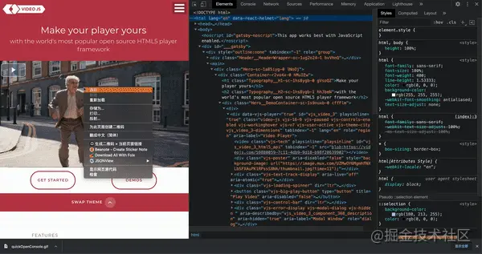
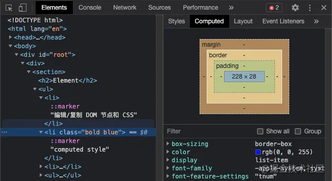
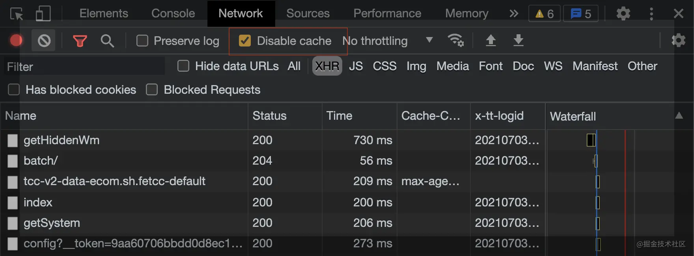
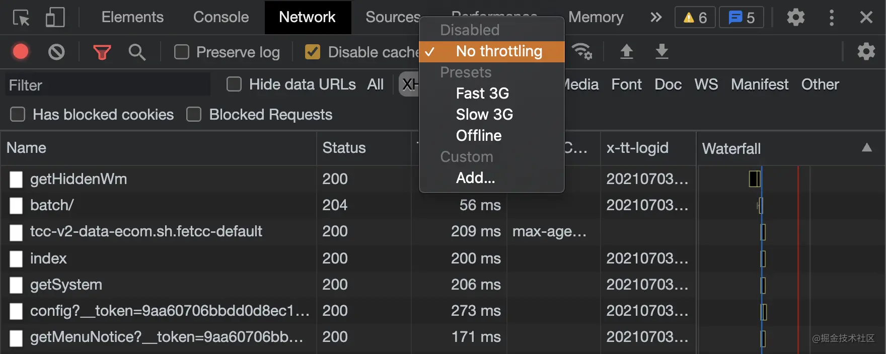
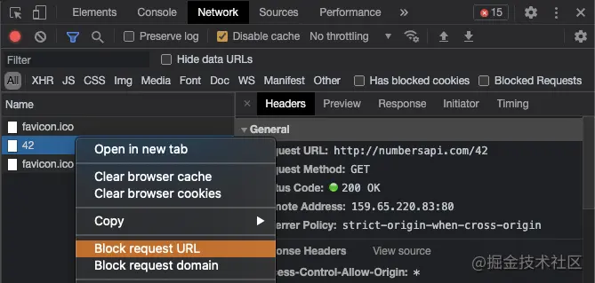
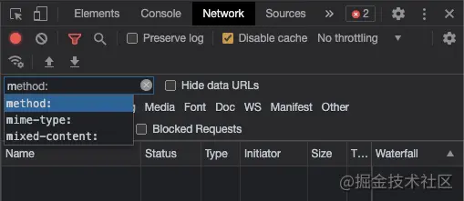

## Tools

介绍一些工具的使用：

### Chrome DevTool

[实用 Chrome DevTool Tips (juejin.cn)](https://juejin.cn/post/6987752907579850765)

#### Console

1. \$0, \$1, \$_ 

- `$0`: 引用最后一次选中的dom节点
- `$1`: 引用倒数第二个选中的dom节点
- `$_`: 引用 console 中上一个表达式返回的值
- 使用场景：在 console 中我们可能经常要尝试一些功能，写一些测试代码。`$0` 和 `$1` 能够让我们快速选中 dom 节点，对选中的 dom 做些操作。`$_` 方便我们在没有给返回值赋给变量，但又需要引用这个值的情况使用。

2.store as global variable

- 当你想将某些值存储到变量（接口请求、返回参数，dom节点，debug时的某些变量）在console面板使用时
- 当你在 console 打印出一些库的对象时，使用 store as global variable 后能够直接调用这些库的方法，比如 moment、antd 的 form 等

#### Elements

- computed style
  - 当项目变得复杂时，一个节点上的样式可能会受到多处代码的影响，computed style 能够查看真正使它生效的 CSS 样式

Break on

- 当 DOM 状态变化时打断点
- 使用场景：在中后台项目中经常会基于 antd 的组件做一些改造，以 Dropdown Menu 举例，我们想自定义改造组件下拉的内容，来满足我们的需求。**这时候如果直接使用检查元素来修改，会发现鼠标一旦移开后下拉就会收起，造成了调试的麻烦。这个时候就很适合使用 Break on 这个功能**

## Network

- 禁用网络缓存
  - 当新内容发布后，页面始终展示的还是旧的内容时使用（开发调试时最好一直将其勾选）
  - Network 👉 Disable cache

 

- 网络节流（模拟弱网环境）
  - 当开发移动端应用时，查看应用在弱网环境下是否还能够有较好的加载速度

 

- Block url
  - 阻止某个url的请求（当你不得不在线上debug时，把某些写操作的请求给阻止，如表单提交等）

- advanced filter
  - 对网络请求进行更精细的筛选

- is:from-cache
  - 查看哪些请求是走缓存的
- has-response-header:
  - 筛选出包含某些请求头的接口
- larger-than:
  - 查看有哪些请求体积过大，便于分析性能、优化拆包等
- method:
  - 只查看某种方法的网络请求（POST/GET）
- 太多了记不住？
  - 在筛选框里输入英文首字母，浏览器会为你自动提示这些选项

